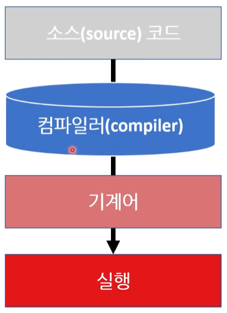
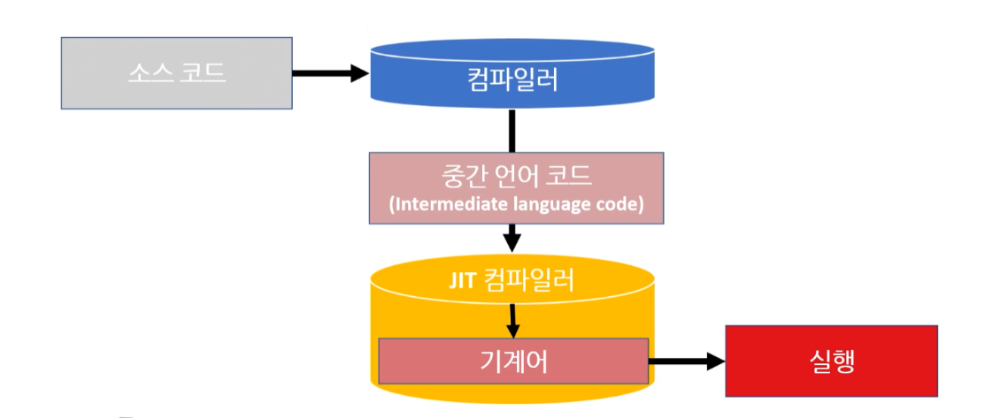
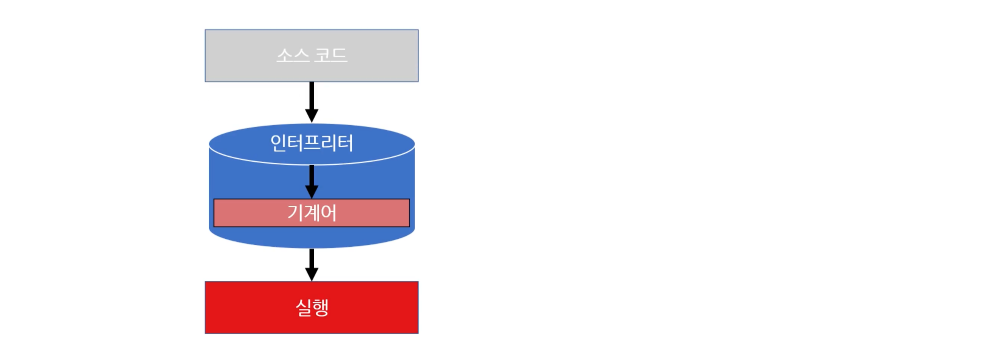
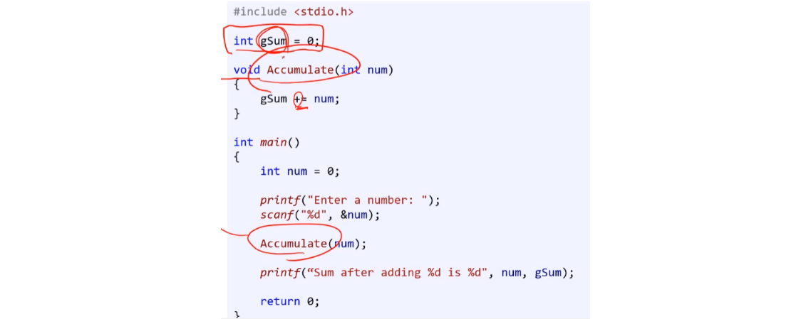
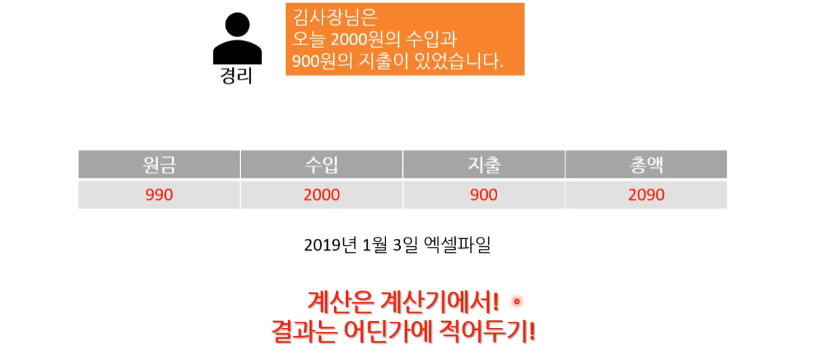
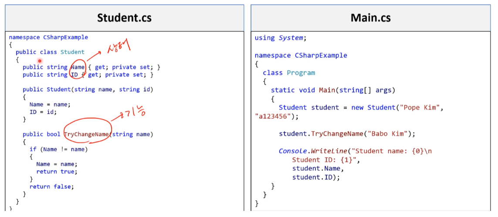
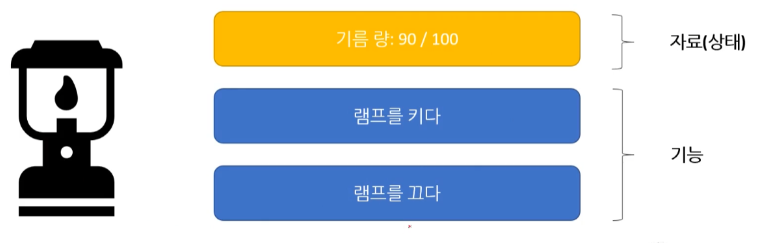
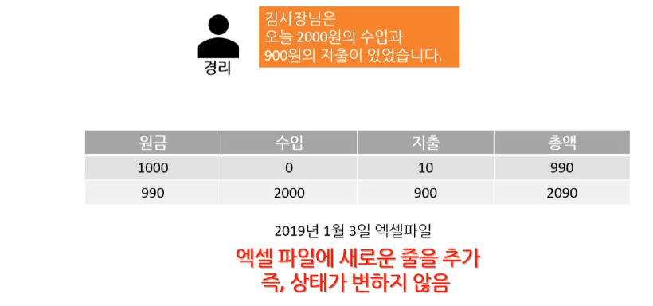

# 프로그래밍 언어의 특징

> **[ 업데이트 예정 ]**
>
> * 프로그래밍 언어별 점유율 - 목록 및 사이트 ( 정리 )
> * 저작권 이미지 교체
> * 프로그래밍 언어 - 계보 만들기


## 1. 프로그래밍 언어 계보

* **기계어**
* **1949년 : Assembly**

---

* **1954년 : Fortran**
* 1970년 : SQL
* **1971년 : C**

---

* **1983년 : C++**
* **1983년 : Objectiv-C**

---

* **1991년 : Python**
* **1991년 : Visual Basic ( VBA : Visual Basic 6.0 기반 )**
* **1993년 : Ruby**
* 1993년 : HTML 
  ( 1996년 : CSS )
* **1995년 : JAVA**
* **1995년 : PHP**
* **1995년 : JavaScript**

---

* **2000년 : C#**
* **2001년 : Visual Basic .NET** 
* **2009년 : GO**

---

* **2011년: Dart**
* **2011년 : Kotlin**
* **2012년 : TypeScript**
* **2014년 : Swift**
* **2015년 : Rust**

---

<br>

<br>

*[그림] 1-1. C언어 계보 - 뉴렉처 강의*

※ 나중에 새롭게 다시 만들어 볼 예정


<br>

<br>

*[그림] 1-2. 프로그래밍 언어 진화도*

* 기계어 => 어셈블리어 => 절차지향 언어 => 객체지향 언어 => 함수형 언어


<br>

<br>

*[그림] 1-3. 1, 2, 3세대 언어 및 번역기 - 뉴렉처 강의*


<br>

<br>

<br>

<br>

## 2. 프로그램 언어 특징

5가지 분류 방법이 존재한다.

1. Low Level  /  High Level
2. Compiler  /  interpreter 
3. Strong  /  Weak
4. Managed  /  UnManaged
5. Procedural / OOP / functional

[참고] 지금은 이해하기 어렵지만 실무에서는 매우 의미 있는 내용이다.

<br>

<br>

<br>

### 2.1. 저수준 언어 / 고수준 언어

* low-level language : 컴퓨터가 이해하기 쉬운 언어
* high-level language : 인간이 이해하기 쉬운 언어

<br>

<br>

#### 1) 저수준 언어

* **Low Level**

<u>컴퓨터가 이해하기 쉬운 언어</u>로 <u>0과 1(숫자 코드)</u>로 이루어져 있다.
컴퓨터로 바로 이해할 수 있는 언어로 되어 있기 때문에 변환 과정이 필요 없다.

(ex) 기계어, 어셈블리어

<br>

<br>

#### 2) 고수준 언어

* **High Level** 

<u>인간이 이해하기 쉬운 언어</u>로 <u>문자 코드</u>를 사용한다.
사람이 쓰는 말에 매우 가까워 진다. - **[주의!] 영어 한정**

CPU와 memory에 해당하는 부분은 **고급 언어(연산자, 제어 구조, 변수, 배열 등)**가 제어하고, 그 외의 것은 API가 제어한다. 
( Application Programming Interface : 어떤 장치를 사용하기 위한 간접 적인 접근  도구 )

어셈블리어 처럼 **<u>기계어와 일대일 대응이 불가능</u>** 해진다.
컴퓨터가 이해하기 위해 '기계어'로 **변환**하는 과정이 필요하다.

(ex) 어셈블리어, C, C++, C#, JavaScript ...

( 어셈블리어 : 문자코드를 사용한다고 해서 <u>고수준 언어</u>로 보기도 한다. )

```C#
int addResult = 3 + 4;  // 3과 4를 더한 후 addResult에 저장한다.
int mulResult = 3 * 4;  // 3과 4를 곱한 후 mulResult에 저장한다.
```

<br>

<br>

#### 3) 상대적인 구분

저수준 언어와 고수준 언어의 구분은 시대에 따라 상대적이기 때문에 구분이 모호한 면이 있다.
기계어 까지만 저수준 언어로 보는가 하면, 기계어와 일대일 대응이 가능한 어셈블리어 까지 저수준으로 취급하기도 한다. 
최근에 다양한 언어의 사용도가 높아지면서 C언어까지 저급 언어로 분류하기도 한다. 

현대에 와서는 인간 친화적 언어 인가에 기준점을 두고 있다.

>  어셈블리어 : 문자코드를 사용한다고 해서 <u>고수준 언어</u>로 보기도 하고, 기계어와 일대일 대응이 가능하다 해서 <u>저수준 언어</u>로 보기도 한다.

<br>

<br>

<br>

<br>

### 2.2. 컴파일 / JIT 컴파일 / 인터프리터

프로그램 성능, 개발 속도 등에 영향을 주는 부분이다.

<br>

<br>

#### 1) 컴파일 언어

**Compiled Language**

컴파일러가 고수준 언어(문자 코드 / 소스 코드)를 네이티브 코드(기계어)로 컴파일한다.

* **컴필레이션 ( compilation )** : 코드 전체를 한 번에 기계어로 해석한다.

( 빌드를 통해 기계어가 나온다. )

(ex) C, C++

<br>

##### (1) 컴파일 과정 

소스코드 - 컴파일러 - 기계어(exe) - 실행




<br>

##### (2) 장단점

* [장점] 
  * 다양한 최적화가 가능 - 빠른 실행 
    ( 1시간 동안 컴파일, 0.1초 만에 실행 )
  * 컴파일 단계에서 버그를 미리 찾을 수 있다. 
  
* [단점] 
  * 컴파일 시간 - 1시간 이상 컴파일을 기다려야 할 수도 있다.
  * 다양한 컴파일러 - 기계어가 나오다 보니 CPU와 OS마다 맞는 여라가지의 exe 파일을 컴파일 해야 한다.
    플랫폼(MacOS, 32비트 윈도우, 아이폰 등)마다 다른 exe 파일을 컴파일 해야 한다.

<br>

##### (3) 특징

* 한번에 미리 번역한다. ( 이 덕분에 실행 속도가 빠르다. )
* 기계어를 직접 만들어 낸다. ( 컴파일 설정에 따라서 어셈블리어로 만들기도 한다. )
* 실행만 하면 되기 때문에 수행 성능이 좋다. ( 속도가 빠르다. )
* 별도의 실행 환경(가성 머신 등)이 존재하지 않는다.
* Native 언어로 주변 환경에 의존성을 가지게 된다. ( 즉, 하드웨어, OS 등이 동일해야 한다. )

<br>

<br>

#### 2) JIT 컴파일 ( 동적 번역 ) 언어

* **Just-in-time compilation** / **dynamic translation** or **run-time compilations**

컴파일 언어와 인터프리터 언어의 하이브리드 중간 형태라고 보면 된다.

[ 소스코드 ] => [ 컴파일 ] => [ 중간코드(IL code) ] => [ **JIT 컴파일** ] => [ 기계어 ] => 실행 

(ex) C# , JAVA, WASM ( WebAssembly )



<br>

##### (1) 중간 언어 코드

컴파일러가 소스코드를 **중간 언어**로 컴파일한다.
기계는 아니고 프로그램이 이해 할 수 있는 언어를 **중간 언어**라고 한다.

C언어와 달리 JAVA는 컴파일 과정에서 바이트 코드 같은 중간 언어( 문서 )가 완성되고, 
사용시 기계어로 변환 시켜 사용한다.

<br>

##### (2) VM 종속 ( Virtual Machine )

* 플랫폼 별로 가상머신( Virtual Machine )을 설치해야 한다.
* 프로그램 실행 중에 VM이 중간 언어를 기계가 이해하는 언어로 바꿔서 실행한다. 
  * 기계어 또는 함수 등 기계가 이해할 수 있는 다양한 형태으로 바뀐다.
* JAVA나 C#은 플랫폼에 종속적이지 않고 <u>VM에 종속적이다.</u>

<br>

<br>

#### 3) 인터프리터 언어 

**Interpreter Language**

컴파일 단계가 없이 실행 시 고수준 언어를 네이트브 코드로 바꿔서 실행한다.
( 동시 통역으로 이해하면 편하다. )

* **인터프리테이션 ( interpretation** ) : 실시간으로 기계어로 해석한다.

(ex) JavaScript, Python, Lua, PHP



<br>

**장단점**

* [장점]
  * 생산성이 좋다. ( 개발 속도가 빠르다. )

* [단점]
  * 프로그래머 버그 방지 부족 : 오프라인 컴파일러가 없어서 실제로 실행하기 전까지 코드의 문제를 잡아낼 수 없다.
  * 느린 실행 속도

<br>

<br>

<br>

<br>

### 2.3. 강한 타입 / 약한 타입

강한 타입(Strong-typed), 약한 타입(Weak-typed)

강한 / 약한 타이핑은 유형이 얼마나 엄격하게 구별되는지 에 관한 것입니다. 
변수 선언(변수의 용도)과 관련 있다.

> **[참고] Static / Dynamic type ( 정적 / 동적 타입 )**
>
> 타이핑은 type 정보가 수집되는 시점 (컴파일 타임 또는 런타임)에 관한 것입니다 .
>
> * **Statically typed** : 정적타입 언어는 컴파일 시 변수의 ‘타입’이 결정됩니다.
>   * C, C++, C#, Java
> * **Dynamically typed** : 동적타입 언어는 런타임 시 변수의 ‘타입’이 결정됩니다.
>   * JavaScript, Objective-C, PHP, Python, Ruby
>
> 정적타입 언어 사용시 타입 에러는 컴파일 시 에러가 뜨기 때문에, 더 편하고 빠르게 에러 확인이 가능합니다. 
> 동적타입 언어는 런타임 시 확인할 수 밖에 없기 때문에, 이러한 불편함을 해소하기 위해 TypeScipt와 Flow같은 툴을 사용하게 된다.

<br>

<br>

#### 1) 강한 타입

**Strong-typed**

변수형을 선언 후 변수형 변경이 불가능 하다.
엄격하게 구분한다.

* 상용 코드를 작성할 때는 강한 타입 언어들이 일반적으로 더 낫다.
  ( 컴파일 등을 활용해서 실수를 바로 잡기 편하다. )

대표적인 언어 : C, C++, C#, Java 등 ( C# 등은 약한 타입도 지원하긴 한다. )

<br>

<br>

#### 2) 약한 타입

**Weak-typed**

변수형을 선언 후 변수형 변경이 가능하다.
관대하게 구분한다.

* [장점] 강한 타입에 비해 신경 쓸 부분이 상대적으로 적기 때문에 1인 이나 취미로 개발할 때 등 빠르게 개발할 수 있다.
* [단점] 약한 타입을 사용하면 코드를 실행하기 전까지 실수를 찾을 수 없게 된다. 
  ( 의도인지 실수인지 알기 어렵다. )

대표적인 언어 : JavaScript, Python

<br>

<br>

<br>

<br>

### 2.4. 매니지드 / 언매니지드

* **Managed / Unmanaged**

<br>

<br>

#### 1) 메모리 관리

메모리의 수명(라이프 사이클) 관리가 핵심이다.
- **확보** - 프로그램에서 큰 데이터를 사용하기 위해 운영체제(OS)로 부터 독점적으로 사용할 메모리를 확보 할 수 있다.
- **반환** - 데이터를 다 사용한 뒤에는 OS에 메모리를 반환 할 수 있다.

메모리 관리에 따라 매니지드 언어, 언매니지드 언어가 나뉜다.
[주의!] 저수준 언어라고 해서 언매니지드 언어라고 생각할 수 있는데 그런 기준이 아니다.

<br>

<br>

#### 2) 매니지드 언어

**프로그래밍 언어**가 더 이상 메모리를 사용하지 않는 상황( 어림짐작 )을 **자동으로 판단하여 메모리를 반환**한다.

C언어와 달리 JAVA는 컴파일 과정에서 바이트 코드 같은 중간 언어( 문서 )가 완성되고, 사용시 기계어로 변환 시켜 사용한다.

<br>

##### (1) 장단점

- [장점] 개발 속도가 빠르다. 

  - 메모리 관리를 언어상에서 알아서 해주는 언어로 메모리에 대한 생각은 하지 않고 코드를 작성할 수 있다.
    컴퓨터의 깊은 구조를 모르고도 프로그램을 작성이 쉽게 할 수 있는 언어들이다.
  - 매니지드 언어가 프로그래밍 실수가 적고 편하다. 

- [단점] 성능이 좋지 못하다.

  * 예시 : 실생활 예제 ( 명시적 표현 VS 어림짐작 )

    어림짐작이 명시적 표현보다 효율적일 수 없다.

    - 명시적 표현 : '나 오늘 이제 차 안 써. 너 써도 돼' 

    - 어림짐작 : '식탁에 차 키를 그냥 둔다.' - 안 쓰는 건지 잠시 둔건지, 오늘만 안쓰는 건지 애매하다.
    
    ( 명시적 표현이 깔끔하고 효율적이지만 일일이 말해야 하기 때문에 잊어버리고 실수 할 수 있다. )

<br>

##### (2) 프로그램 개발 

성능이 크게 중요하지 않은 프로그램 개발 시 사용한다.

잔실수 없어 편하며 개발 속도가 빠르다. ( 생산성이 높다. )

* JAVA, C#, JavaScript, Lua

<br>

<br>

#### 3) 언매니지드 언어★

**프로그래머**가 책임지고 **메모리를 관리**하는 언어이다.

<br>

##### (1) 장단점

- [장점] 성능에서 효율적이며 속도가 뛰어난 프로그램을 개발 할 수 있다.
- [단점] 프로그래머가 실수를 할 경우 Memory Leak 이라는, 치명적인 문제가 발생할 수 있습니다. 
              ( 명시적 표현 특성 상 일일이 말해야 하기 때문에 잊어버리고 실수 할 수 있다. )

<br>

##### (2) 프로그램 개발

성능이 중요한 프로그램 개발 시 사용한다.
개발 속도가 빠르지 않지만 완성된 프로그램은 성능이 뛰어나다. ( 성능을 쥐어 짠다. )

* C, C++
* (ex) 게임, 임베디드 등

<br>

##### (3) 언매니지드를 공부하는 이유 ★

언매니지드 언어를 배우면 10년 뒤에도 대우 받는 프로그래머로 살아남기 위해 반드시 필요한 지식을 배울 수 있다.

1. **하드웨어 동작 원리**
   사용자가 직접적으로 하드웨어 CPU, Memory를 관리해야 한다. 
   그렇기 때문에 컴퓨터의 구조 혹은 관리하는 법을 깊게 배워야 한다. 

   * 메모리의 동작원리

   * CPU 동작 원리

2. **컴퓨터처럼 생각하는 법** 

   컴퓨터 처럼 생각하는 습관을 들이면, 그러지 못한 사람들 보다 빠르게 성장할 수 있다. 

3. **다양한 언어의 동작 원리**

   매니지드 언어에서 지원하는 모든 **기능들의 동작원리**

<br>

<br>

<br>

<br>

### 2.5. 프로그래밍 패러다임

* 프로그래밍 패러다임 : 관점이나 기능에 따라 분류하는 방식이다.

  * 프로그래밍 언어는 이런 패러다임을 하나 또는 여러 개를 지원한다.

    (ex) JAVA, C++ ( JAVA의 경우 객체 지향 프로그래밍, 함수형 프로그래밍 을 지원한다. )


<br>

<br>

#### 1) 절차지향 언어

**Procedural Programming**

함수를 실행하면 <u>절차적인 순서에 따라 실행</u>해서 결과가 반환 된다.
가장 단순한 형태의 프로그래밍 언어이다. 

(ex) 어셈블리어, C

* 기능과 자료 저장(상태)의 분리
  * 결과로 나온 자료를 저장하고 싶으면 별도의 공간에 따로 저장할 수 있다.
  * 자료 저장(상태)을 어디다가 저장 하느냐를 심각히 고민하지 않는 언어이다.
  * 기능과 자료 저장의 분리 ( OOP에서는 같이 저장한다. )


---

<br>

**(1) 프로그래밍 코드 - C언어**



<br>

**(2) 실생활 예제 - 장부정리**

동일 한 엑셀 파일의 같은 줄을 계속 업데이트 하는 상황(덮어쓰기)이다. 
즉, 상태가 변한다.



<br>

<br>

#### 2) 개체 지향 언어 ( OOP 언어 )

**OOP(Object-Oriented Programming)**

사람한테 직관적인 것( 물체 )을 프로그래밍 언어로 만든 것이다.
반면, 절차적인 언어는 기계 관점 위주로 돌았다.

(ex) C++, Java

* 개체 ( Object )

  자료 저장(상태)과 기능을 하나의 개체(Object)에 합침

  * 물체의 개념
  * 오역 때문에 객체라고 주로 부르기도 한다. ( 객체는 주어와 목적어를 말한다. )

* 클래스 ( Class )

  * 개체는 이 클래스라는 '틀, 설계도'를 통해 완성된다.

  * 클래스는 공통적으로 사용되는 속성이나 메소드(기능)를 미리 만들어 둘 수 있다.

  * 클래스는 중복 사용을 해결하고, 동시에 효율적으로 사용하기 위해 **상속** 통해 새로운 클래스를 만들 수도 있다.

    (ex) Human, Japaness, Korean 등

* 가장 널리 쓰이는 프로그래밍 패러다임

  * 사람에게 매우 직관적이다.
  * 미리 만들어 진 여러가지를 재활용하기 때문에 복잡한 프로그램의 구조를 잡기 쉽다.

* [주의!] OOP언어라고 불리는 것들은 OOP적인 문법을 강제하는 언어라고 생각하자. 
  C 언어를 OOP처럼 사용할 수 있지만, 그렇게 사용하길 컴파일러에서 강제하지 않는다.

<br>

**프로그래밍 코드 - C#**



<br>

**실생활 예시 - 램프**



<br>

<br>

#### 3) 함수형 언어

**Functional programming**

절차적 언어와 비슷하지만 순수 함수(Pure Function)를 조합하고 프로그램을 만든다. 
특징 또한 함수를 순서대로 실행한 결과이다.

* 절차적 언어처럼 함수가 있다.

* 함수형 프로그래밍은 선언형 프로그래밍에 바탕을 두며 함수의 응용을 강조한다.

  * 선언형 프로그래밍 ( declarative programming )

    * 함수형 프로그래밍은 선언형 프로그래밍 패러다임을 따른다.
    * '선언형 프로그래밍'은 프로그래밍이 문이 아닌 식이나 선언으로 수행된다.

    ```css
    body { backfround-color : pink }	// 선언형 코드의 예시다.
    ```

  * '명령형 프로그래밍 (  imperative programming )'

    * 선언형 프로그래밍과 비교 되는데, ''명령형 프로그래밍''은 상태를 바꾸는 것(원하는 결과 값에 도달하기 위한 과정을 나열한다.)을 강조하는 한다. ( 우리가 주로 작성하는 방식이다. )
    * 모든 선언형 코드는 명령코드 위에 쓰여진다.

* 함수형 프로그래밍은 수학의 함수에 충실해서 대부분 반환형이 존재한다.

* 함수형 언어가 유용할 때
  * 함수형 언어는 상태가 변하지 않는다. == 불변성(immutable)
  * <u>**여러 개의 프로그램이 데이터에 접근할 때 사용한다.**</u>
  * 특정 분야에 필요하다. ( 가장 안 쓰이는 패러다임이기도 하다. )

<br>

**프로그래밍 코드 - LISP**


<br>

**실생활 예시 - 장부**



<br>

<br>

<br>

<br>

## 참고

* 뉴렉처 - [컴퓨터 프로그래밍을 하기 위한 사전지식 : 6강 ~ 12강](https://www.youtube.com/playlist?list=PLq8wAnVUcTFXna0fCAsElIj2qayRqvGjk)
* POCU 프로그래밍 입문 ( with C# )
* 위키백과

---

---


