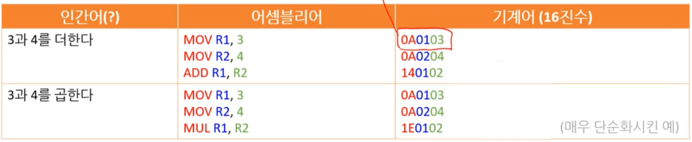

## 02 언어별 분류 

**[ 업데이트 예정 ]**

* 지속적으로 추가 및 업데이트 예정

---


### [참고] 5가지 분류 방법

5가지 분류 방법이 존재한다.

---

1. Low Level  /  High Level
2. Compiler  /  interpreter 
3. Strong  /  Weak
4. Managed  /  UnManaged
5. Procedural / OOP / functional

---


### 1. 기계어 

* **Machine Code (=Machine Language)** 
* **Native code**

---

1. **Low Level** / ~~High Level~~
2. ~~Compiler / JIT / interpreter~~  -  **Machine**
3. ~~Strong / Weak~~ - **Machine**
4. ~~Managed~~ / **UnManaged**
5. **Procedural** ~~/ OOP / functional~~

* **물리 언어** : 기계 장치와 연관 되어 있는 언어이다.

---

<u>컴퓨터가 이해하기 쉬운 언어</u>로 비트 단위의 **0과 1(숫자 코드)**로만 표현된다. 
컴퓨터로 바로 이해할 수 있는 언어로 되어 있기 때문에 기계어 이상의 변환 과정이 필요 없다.

**CPU**가 바로 **해독**할 수 있는 유일한 언어이자 모든 **프로그래밍 언어의 종착지**다.
번역기를 통해 나오는 마지막 **<u>실행코드</u>**이다.
( 모든 언어는 이 기계어로 번역되어야 한다. )

[참고] 해커는 기계어 만으로 어떤 프로그래밍인지 해석하기도 한다.

<br>

<br>

<br>


### 2. 어셈블리어

* **Assembly Language**

---

1. **Low Level**  /  High Level
2. ~~Compiler  /  JIT  /  interpreter~~  -  **Assembler**
3. ~~Strong  /  Weak~~  -  **Assembly**
4. Managed  /  **UnManaged**
5. **Procedural** ~~/ OOP / functional~~

* **물리 언어** : 기계 장치와 연관 되어 있는 언어이다.

---

<u>인간이 이해하기 쉬운 언어</u>로 <u>문자 코드</u>를 사용한다.
기계어 비교할 때 사람에게 보다 친근한 코드이다. 

<br>

<br>

#### 1) 기능코드

**실행코드**가 되기 전 단계인 **<u>기능코드</u>** 역할을 하고 있다.

대부분의 중/고급 언어의 컴파일러에는 어셈블러가 병합되어 있다. 
그러다보니 C의 경우도 C→기계어와 같이 가는 것이 아니라 C→어셈블리어→기계어 순으로 컴파일 할 수도 있다. 
( C로 작성한 다음 어셈블리어로 최적화 한다는 것도 이런 식이다. )

가상머신 에서도 어셈블리어가 사용된다. 
Java의 바이트코드와 .NET Framework|.NET CLR의 CIL이 대표적인 가상머신 어셈블리어 이다. 
다만, 가상머신 어셈블리어는 다양한 자료형을 지원하거나 함수를 지원하는 등 실제 어셈블리어와는 차이를 보이며, 
대개 JIT 컴파일러를 거치거나 인터프리터를 통해 해석된다.

<br>

<br>

#### 2) 기계어와 일대일 대응

대부분 **기계어랑 일대일 대응**이 가능하다.

* 이 때문에 '저수준 언어'라고 부르기도 한다.

* **명령어 종류**   -   ADD, SUB, MUL, DIV / JMP / LOAD, WRITE

* **과정 예시**       -  (ex) MOV는 10, ADD는 20, MUL은 30

  [   어셈블리어        =>                            기계어(2진수)                 ]
    MOV   R1,   3       =>    0000 1010   0000 0001   0000 0011
    MOV   R2,   4       =>    0000 1010   0000 0010   0000 0100
    ADD    R1,   R2    =>    0001 0100   0000 0001   0000 0010



```assembly
MOV R1, 3  	 ; 숫자 3을 R1에 저장
MOV R2, 4  	 ; 숫자 4를 R2에 저장
ADD R1, R2   ; R1과 R2의 값을 더한 후 그 결과를 R1에 저장
```

<br>

<br>

#### 3) 비통일 된 규격

기계어는 <u>CPU가 채택한 ISA에 따라 다 다르기 때문에 어셈블리어의 명령어 역시 통일된 규격이 없다.</u>
( 또한 <u>문법 아키텍처에 따라서도 다르고 어셈블러의 종류에 따라서도 문법/매크로 등이 제각각이다.</u> )

<br>

<br>

#### 4) 저수준 ~ 고수준 언어

인간이 이해할 수 있는 문자코드를 사용한다는 점에서 **'고수준 언어**'로 불리기도 하며,
고급 언어와 기계어 사이에 있다 하여 **'중간 언어'**라고 불리기도 하며,
기계어와 일대일 대응이 가능하다 해서 **'저수준 언어'**라고 불리기도 한다.

<br>

<br>

<br>

### 3. C

---

1. **Low Level**  /  High Level
2. **Compiler**  ~~/  JIT  /  interpreter~~ 
3. **Strong**  /  ~~Weak~~
4. ~~Managed~~  /  **UnManaged**
5. **Procedural** ~~/ OOP / functional~~

---

* 유래
  * 유닉스 개발을 위해 C언어 개발했다.
    ( 어셈블리어로 유닉스 개발을 마치고, C언어를 개발 한 이후 유닉스를 새로 작성하게 된다. )
  * B언어를 계승한 다는 의미에서 C를 붙였다. 여러 기능 면에서도 많은 영향을 받았다.

* 특징

  * 자원 관리를 빡빡하게 해야 할 때 사용된다. ( 자원 최적화 )
    하드웨어와 밀접한 언어다.

    * 어셈블리어를 삽입할 수도 있다.
    * 당시에는 하드웨어의 한계로 자원 효율적으로 쓰면서 최대 성능을 내야 했다.
    * 나사 탐사선에서도 쓰인 언어이다. 

  * C 언어의 경우에는 사람이 이해하기 편한 문법 구조로 되어 있지만 
    기계어의 명령 구조와 유사한 문법들도 가지고 있어서 '중급 언어(Middle-Level Language)'라고 부르기도 합니다.  

    ( low와 high의 중간 )

  * 보안상으로 보면 초보자와 숙련자 사이의 격차가 크기 때문에 공격을 많이 당하기도 한다.
    <u>**근본 거의 모든 것의 시작**</u> - 후속 언어들에게 많은 영향을 끼친 언어이다.

* 학습적 측면
  * 많은 프로그래밍 언어에 영향을 끼친 언어다.
  * C언어 자체로 배울 양은 적지만 하드웨어 자체를 알아야 하기 때문에 배우기 어려운 언어이다.
    10년뒤 살아남는 개발자가 되기 위해서는 C를 이용할 줄 알아야 한다. ( 정확히 말하면 컴퓨터를 알아야 한다. )
* 사용 분야 : 임베디드 프로그래밍, OS 개발

(정신) Trust the programmer - 다른 의미로는 프로그래머가 해야 할게 많다.
(특징) 포인터 메모리 직접지정

<br>

<br>

<br>

### 4. C++

---

1. ~~Low Level~~  /  **High Level**
2. **Compiler**  ~~/  interpreter~~ 
3. **Strong**  ~~/  Weak~~
4. ~~Managed  /~~  **UnManaged**
5. ~~Procedural /~~ **OOP** ~~/ functional~~

---

* 유래

  * 비야네 스트로스트럽 교수가 창시했다.
  * C언에어서 더 발전한 언어라는 의미에서 C++로 지었다. 

* 특징

  * C언어의 확장판이다. 
    * C언어의 확장한 슈퍼셋(super set)이다.
    * (ex) JavaScript / TypeScript

  * C문법과 호환이 되는 특징 덕에 많은 프로그래머의 지지를 받았다.
  * C에 Class라는 객체지향 프로그래밍 패러다임이 들어간다. 
    ( 비슷한 예로 JavaScript - TypeScript가 있다. )

  * 하드웨어와 밀접한 관계가 있는 언어다.
    * 로우 레벨 퍼포먼스, 메모리 관리를 직접 관여할 수 있어 임베디드에서 높은 속도 퍼포먼스를 요하는 경우 사용된다. 

* 학습적 측면
  * 굉장히 난해서 프로그래밍 언어 중 가장 사용하기 어려운 언어이다.

(사용처) 포토샵, 프리미어 프로, 게임 서버, 임베디드 등
(키워드) STL

<br>

<br>

<br>

### 5. JAVA

객체지향 대표 언어 - 로우레벨 보다는 하이레벨과 가까운 언어

---

1. ~~Low Level~~  /  **High Level**
2. ~~Compiler  /~~  **JIT**  ~~/  interpreter~~ 
3. **Strong**  ~~/  Weak~~
4. **Managed**  /  UnManaged
5. ~~Procedural /~~ **OOP** ~~/ functional~~

---

* 유래
  * JAVA 이름
    * 원래 오크라는 나무 이름을 쓰려고 하다가 이미 운영 중인 테크 회사가 있어서 포기하고, 사람들이 좋아하는 커피 종류 중 하나인 JAVA를 사용하게 되었다. ( 로고에 커피 잔이 있다. ) 
    * 인도네시아의 섬 이름이기도 하다.
* 특징
  * 오라클과 함께 하는 생태계다. - Oracle 생태계 / Oracle 기업
  * JVM이라는 가상머신 기반의 언어다. 
    ( Byte 바이트 코드를 활용하기에 호환성이 좋다. )
  * 레퍼런스가 많고, 안정성이 좋지만, 문법이 복잡하고, 타입 지정 해야 해서 조금 복잡하다.


(점유율 지역) 한국
(사용처) 정부, 기업, 은행 - 기업용 어플리케이션, 서버, 앱 - 시스템, 앱, 웹 다 가능 / 관공소( 전자 정부 프레임워크 ), SI, 안드로이드 앱, 백엔드 서버

* 

<br>

<br>

<br>

### 6. C#

---

1. ~~Low Level~~  /  **High Level**
2. ~~Compiler  /~~  **JIT**  ~~/  interpreter~~ 
3. **Strong**  ~~/  Weak~~
4. **Managed**  /  UnManaged
5. ~~Procedural /~~ **OOP** ~~/ functional~~

---

* 닷넷 시스템과 함께하는 생태계다. - .Net 생테계 / MS 기업
* 가상머신 기반의 언어로 ( 닷넷을 활용하기에 호환성이 좋다. )
* C++보다 JAVA에 더 유사하다. 마이크로소프트 JAVA 
* 기업용으로 만들어진 프로그래밍 언어다.
* C/C++ 비교하면 느린편이지만 개발속도가 빠르다.
  * C++ 비해 수동으로 작업할 것이 적다.
* 메모리 관리 : 가비지 콜렉터 GC가 책임 진다.
* 플랫폼 이식 : CLR 이 책임 진다.
  * 윈도우, 리눅스 , macOS, 안드로이드, iOS 등
* 일관된 클래스 라이브러리

(점유율 지역) 유럽, 미국 등
(사용처) "기업용 어플리케이션", 서버, 게임 - 응용프로그램, 웹 서버, 게임 unity 3D 등 가능 

> MS가 발목 잡아서 윈도우즈를 벗어날 수 없다. 
> 지금은 위기를 느끼고 멀티플랫폼 이라는 한계를 넘어서고 있다.

<br>

**[ C++ / C# ]**

* 동작 속도 : C++ >>> C#

* 개발 속도 : C# >> C++

<br>

<br>

<br>

<br>

## 참고

* 뉴렉처 - [컴퓨터 프로그래밍을 하기 위한 사전지식 : 6강 ~ 12강](https://www.youtube.com/playlist?list=PLq8wAnVUcTFXna0fCAsElIj2qayRqvGjk)
* POCU 프로그래밍 입문 ( with C# )
* 위키백과


## 나중에 정리할 내용

### - HTML

* **HyperText Mark-up Language**

브라우저에서 볼 수 있는 문서를 적은 언어로
어떤 요소나 정보를 배치할 지 설계하는 **<u>마크업 언어</u>**다. ( 정적 언어 )


### - CSS

- **Cascading Style Sheet** ( Style Sheet Language )

HTML에서 배치 된 요소를 디자인 한다.
디자인을 입힐 수 있는 코드를 작성하는 **<u>스타일 언어</u>**이다. ( 정적 언어 )


### - JavaScript, Python

**<u>Managed Language / 동적 언어 / 인터프리터 언어</u>**

메모리 관리를 언어상에서 알아서 해주는 언어로 메모리에 대한 생각은 하지 않고 코드를 작성할 수 있다.
컴퓨터의 깊은 구조를 모르고도 프로그램을 작성이 쉽게 할 수 있는 언어들이다.

**인터프리터 언어**다.
( 빠르게 한 줄 단위로 바로바로 실행되기 때문에 소스코드를 직접 실행하는 것으로 보인다. )

(특징) 개발 속도가 빠르다. ( 코딩을 빠르고 간편하게 작성할 수 있다. )


프로그래밍 실행 과정 : 소스 코드 / 설치  =>  작동 ( 실행자 / 실시간 인터프리터 )  =>  메모리 로드  =>  실행

> * 수행 성능이 좋지 못하다. - 컴파일러 언어에 비해서 느리다.
> * 바뀐 내용이 즉시 반영할 수 있기 때문에 **유연성**이 뛰어나다.
> * 소스코드 배포 방식이라 실행 환경에 구애 받지 않는다.
> * 호환성이 좋다. 


1. **JavaScript**

   ---
   
   * 여러가지 활용법

     1. 하이브리드 앱, 크로스플랫폼 앱 
     2. electron - VSC, slack, skype, Discord, Figma, Trello, Twitch, atom
     3. 게임 개발
     4. 인터렉티브 웹 사이트
     5. VR, AR

     * [개인적인 생각] 다양한 것을 할 수 있으나 결국 성능에 한계가 존재할 듯 하다.

   * 실사용 : 웹 개발, 앱 개발

   * [참고] 언어 유래
   
     * 처음에는 모카라는 커피에 초콜릿을 추가하는 이름으로 지었다가 LiveScript로 변경했다가 JAVA가 유행하는 것을 보고 의도적으로 JavaScript로 이름을 변경하게 되었다. 결과적으로는 마케팅 면에서 성공하게 되었다. 물론 자바와는 아무런 관련이 없다. 
   
   ---
   
   스크립트 언어, 다이나믹 타입, 컴파일 단계가 없다. ( 최신 버전은 클래스 타입 선언 가능 )
   웹 사이트를 만들기 위해 적합한 프로그래밍 언어이다.
   쉬우면서 모호하고 어려운 언어 ( 기괴함 )
   
   * Proto 프로토타입, 비동기 this, Hoi 호이스팅, Clo 클로저, 실행 컨텍스트, 프로미스
   
   - 추상화가 잘 되어있다.
   - 브라우저에서 실행 ( 브라우저와 연관성이 깊다. )
     - Chrome이 JS Engine ( V8 [C++로 만들어졌다.] )이 장착 되어 있어 VM 역할을 한다.
   
   - 웹앱 개발 시 업데이트로부터 자유로워 진다.
   
   * 개발 환경이 바뀌는 흐름이 굉장히 빠른 특징이 있다.
   
   (사용처) 웹 프로그래밍
   (출생) 넷스케이프 => 구글이 호흡기 달아줌 => 현재 프런트엔드 최강자

​		※ 자바와 자바스크립트의 관계  :  햄과 햄스터로 즉, 아무 관련이 없다.

---

프로그래밍 언어로, 스크립트 언어에 해당된다.
서버에서 요청 응답한 데이터들을 가지고 화면을 동적으로 동작할 수 있게 만들어 주는 **<u>프로그래밍 언어</u>**이다. ( 동적 언어 )

( HTML과 CSS는 이 작업이 불가능 하다. )

----


2. **Python**
   
   * 초보자가 입문하기 쉬운 언어
   * 영어랑 비슷해서 배우기 쉽다.
   * 거대한 커뮤니티
   * 방대한 활용 범위
   * 실사용 : 머신러닝, 웹 스크래핑, 서버, 응용프로그램, 데이터 분석, 해킹, 업무자동화 등

   ---

   개발 생산 속도가 매우 뛰어나다. 
   초보자를 위한 최고의 선택, 동적 언어 개발자들이 사용하기 편하다. 
   현업에서도 부수적인 언어로 빨리 빨리 자동화 툴을 만들 때 사용한다.

   학습 자료가 많다.
   커뮤니티가 크고, 자료도 많고, 다양한 것을 시도 할 수 있다.
   
   속도가 필요하면 C언어의 구현 기능을 활용할 수 있다. ( +플랫폼 독립적 )
   
   OOP적 측면에서도 완성도가 높다.
   
   - 추상화가 잘 되어있다.
   
   (사용처) AI 머신러닝, 데이터 사이언스, 웹 스크래핑, 웹 사이트 빌드, 업무자동화
   (사용기업) 인스타, 레딧, 핀터레스트
   
   ---


### - Functional Language

1. **GO 언어**
   자바스크립트랑 비교할 때 빠르다.
   병렬성, 병행성, 빠르고, 이쁘다
   ( 사용처 : 서버 )

---

* Google에서 만든 언어다.
* [왜 구글의 프로그래밍 언어 Go가 겁나 핫한건지 5분 설명](https://youtu.be/VDaMhtWNSQU)
* [참고] 마스코트 : GOPHER라는 두더지 가 있다.

* [참고] 언어명 유래
  * Google에서 앞의 두 글자만 따면 Go가 된다.

---

🔗 Resources
Start with basics first:  How to Write Go Code: https://golang.org/doc/code.html
Convenient way to learn go also to use this Go by Example site: https://gobyexample.com/
And try your own code using the online playground: 
Then move to advanced stuff: https://golang.org/doc/effective_go.html
There is also nice page that collects all the common practices. Very useful: https://github.com/golang/go/wiki/Cod... 
And here is another one for all the gotchas: http://devs.cloudimmunity.com/gotchas...

And last but not least, you can always refer to the language spec. It is good source of truth: https://golang.org/ref/spec

---


2. **RUST**
   안전성, 속도, 병렬 프로그래밍, 함수형 프로그래밍, 시스템 프로그래밍
   (사용기업) 아마존, 구글, 마이크로소프트, 페이스북, 모질라, 리눅스 재단, 디스코드, 드롭박스, npm

---

* [C가 주옥같은 개발자들 보세요. Rust 10분 정리!](https://youtu.be/w1dlmOjDLX8)

* [참고] 언어명 유래
  * 녹병이라는 곰팡이의 이름을 따서 만들었다. ( 창시자가 곰팡이를 좋아한다. )

---


### - 나중에 볼 자료

[추천] 참고자료 : https://github.com/gothinkster/realworld  

* RealWorld -  언어 간의 차이점을 비교 할 수 있다.


세대별 언어

* 1세대 - [First-generation programming language](https://en.wikipedia.org/wiki/First-generation_programming_language)

* 2세대 - [Second-generation programming language](https://en.wikipedia.org/wiki/Second-generation_programming_language)

* 3세대 - [Third-generation programming language](https://en.wikipedia.org/wiki/Third-generation_programming_language)

* 4세대 - [Fourth-generation programming language](https://en.wikipedia.org/wiki/Fourth-generation_programming_language)

* 5세대 - [Fifth-generation programming language](https://en.wikipedia.org/wiki/Fifth-generation_programming_language)


#### - 미분류


**Kotlin** (1)

* 구글 안드로이드 공식 언어
* JAVA 업그레이드 버전이라고 생각하는 것이 좋다.
* Kotlin은 컴파일시 JAVA 바이트코드로 컴파일 한다.
  * 프로그램 실행 전에 JAVA로 완전 변환이 가능하다. ( 100% 호환 )
  * [참고] JavaScript로도 컴파일 할 수 있다.

* JetBrains사가 IDE 개발 도중 코드에 70%를 차지 하는 JAVA를 대신 할 목적으로 Kotlin을 개발하게 된다. 

* 실사용 : 안드로이드 앱, 백엔드 서버

* [참고] Kotlin 이름
  * 러시아의 섬 이름을 따 온 것이다. ( JAVA가 인도네시아의 섬이름을 따 왔듯이 러시아에 본사를 둔 JetBrains는 러시아의 섬 이름을 따오게 된다. )

* [참고] 사용해야 하는 이유

  1. null safety 언어 : null에서 안전한 언어다. null을 허용한 언어인 자바로 프로그램을 만들면 프로그램을 실행 하는 도중에 널이 생길 수 있다. 프로그램으로서는 처리할 값이 없으니 오류를 발생 시키는 문제를 일으킨다. 이를 코틀린에서는 실행 전에 널 발생 가능성을 미리 검사해 준다.

  2. 코루틴(coroutin) 문법 지원 : 한 번에 많은 일을 하게 해주는 좋은 문법을 가지고 있다. 다른 언어보다 빠르단 소리다.


**Kotlin** (2)

서버사이드에서도 JAVA를 대신할 수 있다.

Google 미는 언어

JAVA와 비교하면 개발 편의성이 뛰어난 언어다.

성능은 java와 유사하나 문법적으로 다르다.

JAVA와 똑같은 Byte 코드를 만든다.

참고자료는 JAVA 쪽이 풍부하다.


>   **자바 대신 채용하는 이유**
>
>
>       1. 가독성 뛰어남
>       2. 속도 차이 없음
>       3. 버그 생성 가능성 적음
>       4. [단점] 컴파일 속도 20배 정도 차이남 ( 점점 빨라지는 중이다. 21.06.09. )


**[참고] 안드로이드 개발 자바와 Kotlin 가독성**

안드로이드 쓰는 JAVA는 JAVA가 아니다.
JAVA와 비슷한 무언가 Dalvik코드를 실행하게 하는 안드로이드가 있고,
JAVA API를 복제한 안드로이드 플랫폿 API들이 있다.
근데 그것들이 아주 옛날 JAVA API만 사용하고 있기 때문에 버전이 JAVA15,16까지 나왔지만 16을 사용할 수 없다.
현재는 그나마 JAVA 8 일부분만 사용할 수 있다. 문제는 나온 지 엄청 오래된 플랫폼이기 때문에 최근에 제공된 문법을 사용할 수 없다.
Kotlin에서는 그런 코드들을 작성할 필요가 많이 줄어든다.

(사용처 및 사용기업) 네이버 라인, 구글, 안드로이드 어플


**TypeScript**
JavaScript의 확장판으로 Type을 제공한다.
비슷한 예로 C언어 - C++언어가 있다.


X. Ruby 
웹 프레임워크를 쓰기위해서 
동적언어

* [참고] 언어명 유래
  * Perl 언어에서 영향을 많이 받았는데 Perl이 진주를 뜻하는 pearl과 발음이 비슷해서 루비로 지었다.


X. PHP
백엔드 언어다. 거의 모든 웹에서 사용된다. 간단한 웹페이지 만들기
커뮤니티도 크고 안정적이다. ( 보안 이슈가 있었다. )

[핵심] 워드프레스

(사용처) 워드프레스, 페이스북 초기


X. R
수학 통계에 특화된 언어
패키지가 많고, 지원이나 개발이 꾸준하다.
(사용처) 데이터 마이닝, AI


X. Dart

Flutter 프레임워크를 사용한다.


[ iOS, MacOS ]
Swift
애플 객체지향 언어, 가볍고 빠른 언어를 추구한다.


[ 기타 ]
Ruby on Rails  //서버 프레임워크

Scala


