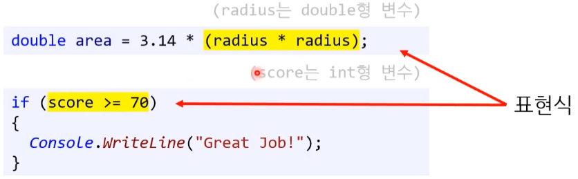

## **1. 프로그래밍 언어**

### **1.1. 프로그램과 문장**

리터럴 < 표현식 < 문장 < 프로그램


#### **1) 리터럴 (literal)**

---

소스 코드 내에서 특정한 **자료형의 값**을 **나타내는 모든 표기법**이다.

( 리터럴(literal)은 **사람이 이해할 수 있는 문자 또는 약속된 기호를 사용해 값을 생성하는 표기법(notation)**을 말한다. )

* 리트럴의 의미가 두 가지로 볼 수 있다.
  
  * 첫 번째는 표기법
  
    * 고정된 값을 나타내는 표기법이다. 
  
    * 객체 지향 언어에서는 객체의 리터럴 표기법을 지원한다.
  
      ```c#
      int num1 = 0xF3;		// 16진수 표기법
      int num2 = 0b01;		// 2진수 표기법
      ```
  
      ```javascript
      var obj = { name: 'SY', age: 50 }; // 객체리터럴 방식으로 만든 객체
      ```
  
  * 두 번째는 매직넘버, 데이터(값) 그 자체
  
    * **변수에 넣는 변하지 않는 데이터(값) 그 자체**를 뜻한다.
  
    * ```c#
      const int num = 1; 		// num은 상수이고, 1은 리트럴이 되는 것이다.
      ```
  

( Example )
리터럴에 해당하는 것 :

- `"hey"` (a string 문자열)
- `false` (a boolean 불)
- `3.14` (a real number 실수)
- `[1,2,3]` (a list of numbers 숫자 리스트)
- `(x) => x*x`(a fuction 함수)
- `/^1?$|^(11+?)\1+$/`(a regexp 정규 표현식)
- `5, 0x05, 005` ( 진수표기법 )

리터럴에 해당하지 않는 것:

- `std::cout`(an identifier 식별자)
- `foo = 0`(a statement 문장)
- `1+2` (an expression 표현식)

---


#### [ 숙제 ]

1. Expression과 Statement 차이 명확히 하고 작성하기


#### **2) 표현식 (expression)**

하나의 값으로 **계산될 수 있는** 리터럴, 변수, 연산자, 함수 호출 등의 **조합**을 의미합니다.  

표현식을 실행하며 **평가(evaluate)** 되며, 어떤 값을 **반환** 한다. void 반환도 포함된다.

( evaluate : 평가라고 적었지만 쉽게 말해 값을 도출해 내는 것이다. 결과값이 나온다. )

---

* 조건식을 불리언 표현식 ( Boolean Expression )이라고 부르기도 한다.
  
  [   if  ( 조건식 )   ]
  
  

---

* `1.0 + abs(a) * b`  
* `a > 1`
* `1 + 2` (an expression 표현식)
* `3 + 4;`		// C# 컴파일 오류
  * **[주의!]** 일부 표현식은 단독으로 사용 할 수 없다. 


#### **3) 문장, 구문 (statement)**

표현식이 하나 이상 모여서 **실행할 수 있는 코드의 최소 단위**가 된다. ( 표현식 보다 더 넓은 의미이다. )

보통 세미콜론, 중괄호{} 블록, 들여쓰기 등을 통해 구분된다.

* `foo = 0` ( a statement 문장 - Python ) 
* `int foo = 0;` ( a statement 문장 - C# ) 

* 대입문 (assignment statement)
* 조건문(conditional statement) - if(age > 5){}
* 반복문(iteration or loop statements) 
* 등 이 있다.


##### (1) 세미콜론 ( Semicolon )

코드 구문(statement) 끝에 붙이는 단어로 대부분 필수적으로 들어가는 단어이다.

```c#
/* C# */

int num = 50;
```


##### (2) 블록 ( Block )

블록은 특정한 동작을 위해서 코드가 모여 있는 상태를 뜻하며 보통 **<u>중괄호</u>**({})를 기준으로 코드 블록을 구상합니다.

* 범위(scope)라고도 불린다.

```c#
/* C# */

if (key == 1)
{
	Console.WriteLint("HelloWorld!");
}
```


##### (3) 들여쓰기 ( Indentation )

가독성을 높이기 위한 띄어쓰기이다. tab이나 space를 사용한다.

프로그래밍 언어 등 여러 체계의 가이드라인 문서에 따라 사용 방식이 다르다.

```C#
/* C# */

if (key == 1)
{
	Console.WriteLint("HelloWorld!");
}
```


#### 4) **프로그램 (program)**

문장(statement)이 모여서 완성된 수행 순서이다.


#### **■ 주석 (comment)**

* **comment out ( 주석 처리 )** 
  * 반대로 다시 되돌려 놓는 것을 comment in 이라고 한다.


코드를 짜는 개발자들이 알아볼 수 있도록 작성하는 부분을 주석(comment)라고 합니다. 

코드와 관련된 내용을 메모할 때 사용한다.

컴파일할 때 무시되는 문장이다.


**[ C#의 comment out ]**

```c#
// 한 라인 ( 한 줄 주석 )
```

```C#
/*

복수 라인 
( 여러 줄 주석 )

*/
```


### 1.2.  네이밍 규칙

#### **1) 키워드 (keyword)**

특별한 의미가 부여된 단어로, 이미 사용하던 예약어다.

언어마다 키워드를 확인하는 방법이 있기도 하다.

[ 예시 ] **Python의 키워드 확인하는 방법** (소프트키워드는 3.10이상)

```python
# 키워드 리스트 출력
import keyword

print(keyword.kwlist)
print(keyword.iskeyword("hong"))
print(keyword.iskeyword("continue"))
```

※ [주의!] 생각보다 그 양이 적다. 


#### **2) 식별자 (identifier)**

프로그래밍 언어에서 임의로 이름을 붙여 사용하는 단어이다.

(ex) 변수명, 함수명, 클래스명 등


**[ 식별자 규칙 ]**

언어 자체적으로 강제하는 규칙으로 언어마다 약간의 차이가 있을 수 있다.


#### 3) 코딩 컨벤션

좋은 코드를 짜기 위한 규칙이다.

( 코딩 컨벤션.md 참고하기 )


## 2. 기타


