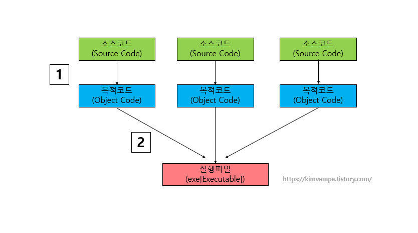
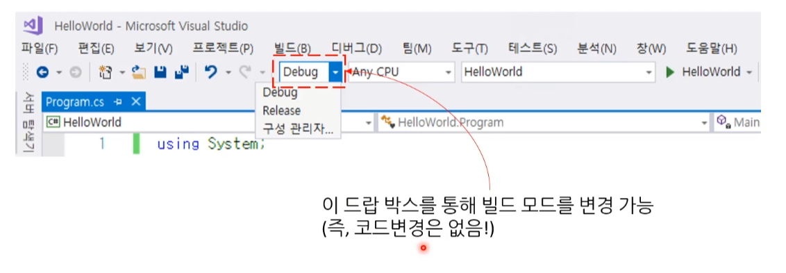
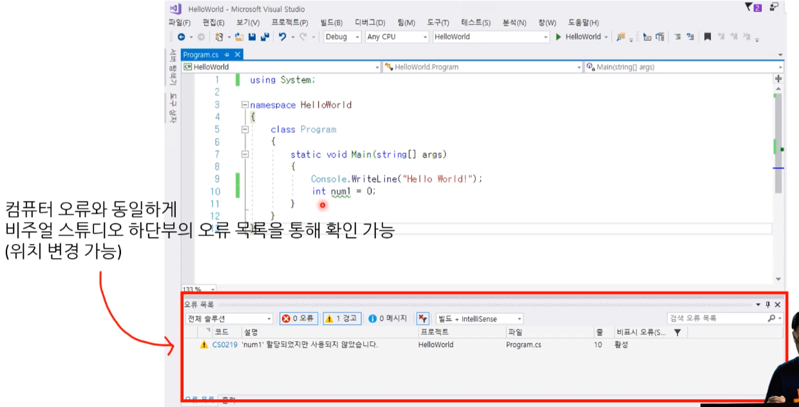
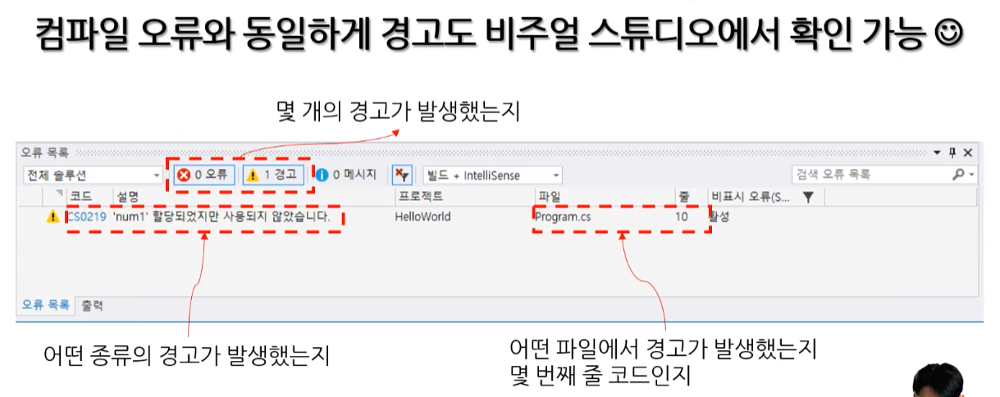
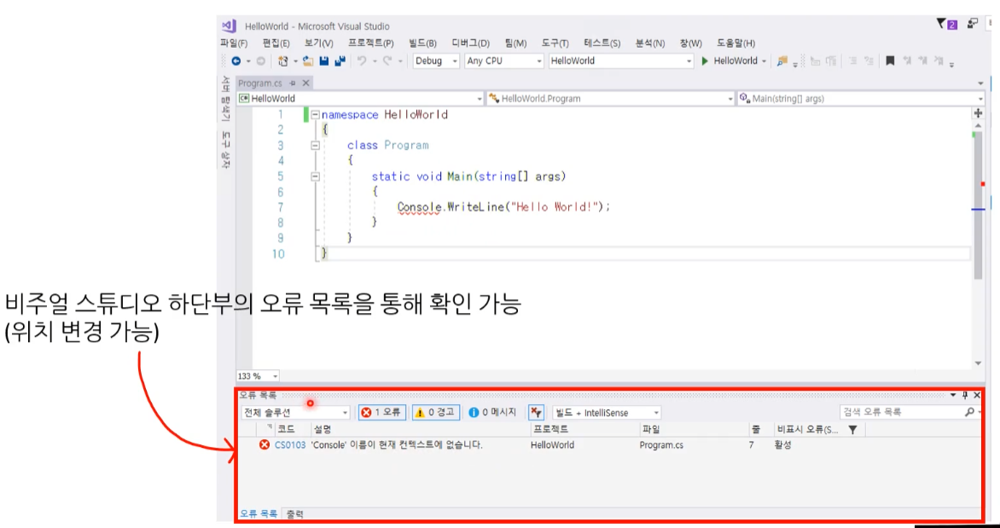
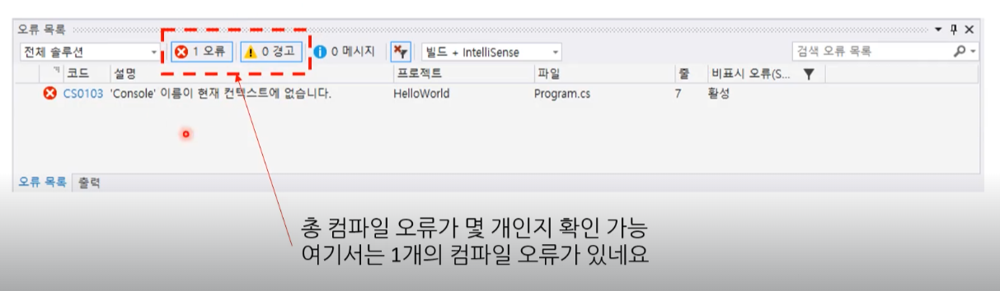
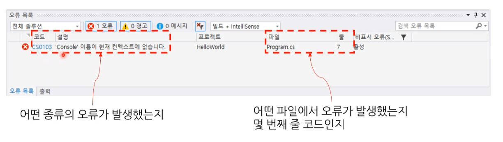
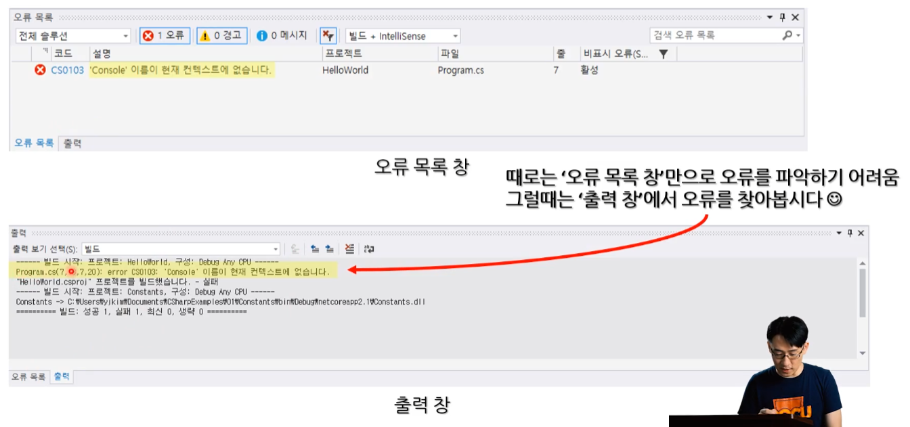

# 04 프로젝트 빌드와 컴파일 ( +에러 )

## 1. **프로젝트 ( with Visual Studio )**

솔루션 >> 프로젝트 >> 소스코드

* 소스코드 ( Source ) : 프로그래밍 코드가 들어있는 파일이다.
* 프로젝트 ( Project ) 
  * 프로그램을 개발하는 데 사용하는 각종 파일을 모아두는 관리한다. ( 컴퓨터 코드가 담긴 파일이 보관된다. )
  * 프로그램 하나를 이루는 가장 작은 단위 가 되는 프로그램을 의미한다.

* 솔루션 ( Solution ) : 하나 이상의 프로젝트를 모아두는 관리한다.

---

* 템플릿 ( Template ) : 프로그램을 만들 때 공통적을 사용하는 기본 코드를 제공하는 툴


**확장자**

프로그래밍 언어마다 확장자가 다르다.


## 2. 빌드와 컴파일

**[ 빌드 과정 ]**



---

-  그림 1번은 컴파일(compile)에 해당한다.
-  그림 2번은 링크(Link)에 해당한다.
-  1번과 2번 두과정을 합쳐서 빌드(Build)라고 한다.

---

\* 소스코드(원시코드) : 컴퓨터 프로그램을 (사람이 읽을 수 있는) 프로그래밍 언어로 기술한 글을 말한다.

\* 목적코드(목적파일) : 컴파일러나 어셈블러가 소스코드 파일을 컴파일 또는 어셈블해서 생성하는 파일이다.


### 2.1. **컴파일, 컴파일러란?**

- 컴파일러(Compiler) : 컴파일을 실행하는 프로그램을 말한다.

- 컴파일(Complile) : 원시 코드에서 목적 코드로 옮기는 과정을 말한다.

  - 컴파일은 그림 1번을 말한다. ( 넓은 의미의 컴파일 뜻 으로는 빌드 그림 전체를 말하기도 한다. )

  

 


### **2.2. 링크(Link), 링커(Linker)란?**

- 링커(Linker) : 링크를 실행해주는 프로그램입니다.
- 링크(Link) : 컴파일러의 결과물인 목적코드(Object code)들을 최종 실행 가능한 실행파일(.exe) 만들기 위해 연결 ,병합 해주는 작업입니다.
  - 정적 링크(static link)와 동적 링크(dynamic link)로 나뉜다.
    - **정적 링크** : 컴파일된 소스파일을 연결해서 실행가능한 파일을 만드는 것입니다.
    - **동적 링크** : 프로그램 실행 도중 프로그램 외부에 존재하는 코드를 찾아서 연결하는 작업을 말합니다.(동적 링크는 링커가 필요가 없다.)

 

 

 

 

### 2.3. 빌드(Build),빌드 툴(Build tool)란?

- 빌드(Build) : 소스 코드 파일을 실행할 수 있는 독립 소프트웨어 가공물로 변환하는 과정을 말하거나 그에 대한 결과물을 일컫는다. 쉽게 말하면 코드를 프로그램으로 하나로 번역하는 과정이다.
  - 파일 또는 파일 묶음을 만드는 과정이다.
    ( 하나로 변형하고, 압축해서 저장한다고 생각하면 된다. )
  - **컴파일과 링크 두 개의 과정을 합친 것이라 생각하면 된다.**
- 빌더 툴(Build tool) : 빌드를 수행하는 도구를 말한다.
  \- 종류 : Ant, Maven, Gradle 
  \- 빌드 툴이 제공하는 기능은 전처리(preprocessing), 컴파일(Compile), 패키징(packaging), 테스팅(testing), 배포(distribution) 이 있다.

 

> ---
>
> [ 빌드를 하는 목적 - 3가지 ]
>
> 1. 실행파일을 하나로 만들기 위함이다.
>
> 2. 압축을 통해 전체크기를 줄이기 위함이다.
>
> 3. 보안적인 이유로 타인이 코드를 알지 못하도록 난독시키기 위함이다.
>
> ---


[참고] https://kimvampa.tistory.com/27

---


### 2.4. 디버그(debug)와 릴리즈(release) 빌드

디버그 버전은 디버깅용으로 빌드하고 릴리스 버전은 최종 릴리스 배포용으로 빌드합니다. 
성능에 최적화되어 있는 것은 릴리스 빌드이나 디버그하는 데 더 적합한 것은 디버그 빌드입니다.

이 모든 과정(디버그 빌드, 릴리스 빌드)은 컴파일러가 알아서 해준다.

* **디버그 빌드** : 개발자가 개발 중에 사용하는 실행파일
  * 디버깅 : 디버깅을 위한 유용한 많은 정보가 담겨져 있다.

  * 최적화 : 거의 안 됨

  * 성능 : 성능은 별로다. 
    [주의!] 배포를 디버그 빌드로 하면 해킹 당할 위험도가 높아진다.

* **릴리즈 빌드** : 실제 사용자(고객)에게 배포하는 실행파일
  * 디버깅 : 디버깅을 위한 정보는 적다.
  * 최적화 : 최적화 집중
  * 성능은 디버깅 모드보다 엄청 빠름 ( 때론 수십 배 이상 차이가 난다. )
    * 정신 버전 이전에 마지막으로 테스트하는 베타 버전으로 빌드하기도 한다.




#### 1) 빌드 번호

제품 출시 직전에 진행되는 여러 가지 테스트 단계에서 수정 및 업데이트 되는 내용을 빌드 번호로 구분한다.

빌드 번호는 크게 디버그용 빌드와 릴리스용 빌드, 2가지가 있다.


#### 2) 버전 번호

기업에서 제품을 출시 할 때 마다 제품마다 버전 번호가 매겨진다. 

(ex) 윈도우 10, 윈도우 11, 한글 2022 등

이 번호는 제품 및 패키지를 출시하고 나면 수정이 불가능한 정식 버전이다.


※ 최종 상품에는 '버전 번호'와 '빌드 번호'가 동시에 포함된다.


## 3. 컴파일(Compile)과 에러

### 3.1. 컴파일(Compile)관 런타임(runtime)?

**컴파일(Compile)**

* 소스코드를 기계어 또는 VM(Virtual Machine)이 이해할 수 있는 언어로 변경하는 행위이다.

  ( 기계가 이해할 수 있는 언어를 기계어라고 부른다. )

* 컴파일을 할 때, 오류(error) 또는 경고(warning)가 발생할 수 있다.

> ----
>
> **컴파일러(compliler)** 
>
> * 컴파일 할 때 사용하는 프로그램이다.
>
> * CLI : 커맨드 라인 환경의 특정 프로그램
>
> * GUI : IDE ( 통합개발 환경 ) 
>
>   (ex) 비주얼 스튜디오 ( 컴파일러가 포함되어 있다. )
>
> ---


**런타임(runtime)**

* 컴파일 과정을 마친 프로그램이 실행되어 동작 되는 것을 런타임이라고 합니다.


### 3.2. 오류와 경고

오류와 경고는 처음 보기에 큰 차이가 없어 보이지만 컴파일러에게 이 둘은 완전 다른 개념입니다.


#### 1) 컴파일 경고 ( warring )

컴파일 경고는 똑똑한 컴파일러가 코드에 문제가 될 수 있는 부분에 대해 미리 경고를 주는 것입니다. 
<u>당장 문제가 되지는 않기 때문에 실행 파일이 만들어지기는 한다는 점에서 차이가 난다.</u> 

컴파일 경고의 예로는 선언된 변수가 사용되지 않고 있는 것이 대표적입니다.
( 컨트롤이 non-void 함수의 끝에 도달(control reaches end of non-void function), 캐스팅(Casting) 없이 포인터에서 정수를 만들려고 하거나(attempt to make integer from pointer without a cast) 등이 있습니다. )

* 경고 : 프로그래머의 실수처럼 보이는 것을 똑똑한 컴파일러가 찾아주는 것이다.
  * exe 파일 생성 : 경고가 있더라도, exe 파일이 생성된다.
  * 프로그램 실행 가능

---


**[ 경고의 안일함이 주는 위험성 ]**

경고는 실제로는 문제가 아닌 경우가 대부분이다. ( 10% 정도는 문제가 있을 수도 있다. )

그러나 경고를 수정하지 않는다면, 나중에 진짜 문제를 찾기 어려울 수 있다.

---

* 이미 100개의 경고가 있는데 새로 추가된 경고 하나가 눈에 보일까?

오류는 치명적이고 실행 파일도 만들어지지 않으니 빨리 고치고, 경고는 실행 파일이 만들어 지니 무시해도 된다고 생각한다면 큰 오산입니다. 

컴파일 경고 중 아주 드물게 치명적인 버그를 만들어내는 경우가 존재합니다. 

평소에 경고를 고치지 않는 습관을 들이다가 나중에 경고가 100개, 200개 쌓이면 치명적인 경고를 못 보고 넘어갈 위험이 존재하죠.

---

* 실제 업계에서는 릴리즈 빌드 시에 경고를 오류처럼 다루기도 한다.
* 경고는 언제나 고치자!







#### 2) 컴파일 오류 ( error )

컴파일 오류는 작성된 소스 코드로부터 제대로 작동하는 프로그램이 나올 수 없을 때 발생합니다. 
컴파일러가 코드를 이해할 수 없기 때문에 실행 파일(.exe)을 만들어내지 않는다.

* 작성한 코드가 프로그래밍 언어의 규격에 위반 되는 경우 발생한다.

  * **오류가 있기 때문에 exe 파일이 생성되지 않는다.**
    따라서 프로그램을 실행조차 할 수 없다. ( exe 파일이 없으니까 )
* 컴파일 오류의 예로는 **구문(syntax) 및 형(type) 오류**가 일반적이다.
  * 함수 정의
    * 중괄호를 생략
    * 반환형을 생략
    * 불완전한 구조체의 멤버에 접근
  * 구문
    * 세미콜론(;)을 빼먹는 사소한 실수
    * 접근할 수 없는 데이터에 접근을 시도하는 것 등이 있다.


---


**[ 컴파일 오류의 유용성 ]**

컴파일 오류는 프로그램 실행 중에 문제를 발견하는 것보다 이득이다.

프로그램 실행 중에 문제가 있는 것을 **버그**라고 한다. 
버그가 나는 상황을 프로그래머가 직접 재현하고 고쳐야 한다.

그렇기 때문에 컴파일 때 잡으면 아주 간편한 것이다.


----


**[ 오류 창과 실행 창 ]**

- 오류 창이 안 보일 경우 - 스튜디오의 보기 > 오류 목록 ( 클릭! )



---








#### 3) 런타인 오류 ( runtime error )

런타임 에러는 프로그램 실행 중에 발생하는 에러입니다.
일반적으로 프로그램에서 수행 불가능한 작업을 시도할 때 발생합니다.

프로그램 설계 미숙일 수도 있으나, 매우 드물게 하드웨어 결함이 원인일 수도 있습니다.
만약 어떤 소스코드가 이미 실행 가능한 프로그램으로 컴파일 되었다고 해도 이것은 여전히 프로그램 실행 중에 버그를 일으킬 수 있습니다.

예상치 못한 오류 또는 충돌로 동작하지 않을 수 있는데 이렇게 프로그램이 실행 중에 발생하는 에러를 런타임 에러라고 합니다.

(ex)  0 나누기 오류, 무한 루프, 널(NULL) 참조 오류, 잘못된 인덱스 배열 참조 오류, 메모리 부족 오류 등이 있습니다.

```c#
int x = 0;
int y = 1 / x;
```

```c#
while(true)	// 무한 루프는 메모리 용량의 소진을 이어 질 수 있다.
{
}
```

```c#
int x = null;
int y = x + 1;
```

```c#
int[] num = new int[5] {1, 2, 3, 4, 5};
Console.WriteLine(num[5]);
```


#### 4) 기타 오류

##### (1) 시간 초과

* **TLE : Time Limit Exceeded**

너무 느린 알고리즘으로 짠다거나 루프문을 잘못 사용했을 때 발생합니다.

예를 들어 버블 정렬을 사용하면 시간 복잡도가 O(n^2)인데
퀵 정렬은 상황에 따라 O(NlogN)까지 시간 복잡도가 단축될 수 있습니다.

이 때 n이 100개 정도면 상관이 없지만
n이 100000개면 버블 정렬 사용시 
n*n=100000000000으로 시간 초과가 될 것입니다.*
*따라서 100000*log100000이 훨씬 빠를 것입니다.

무한 루프에 빠져서 시간 초과가 되는 경우도 있습니다.

반드시 루프가 제대로 종료되는지 체크해야합니다.


##### (2) 논리 오류

컴파일이나 실행 자체는 성공하지만 잘못된 결과를 반환하는 오류를 말합니다.

알고리즘 상의 논리적 결함이나 코드상의 문제로 발생합니다.

논리 오류는 문제가 바로 띄지 않기 때문에 가장 경계해야 할 오류입니다. ( 컴파일 오류와 런타임 오류보다 감지가 어렵다. )
프로그램이 설계 의도에 맞게 올바른 연산을 해내고 정확한 값을 반환하는지 항상 주의 깊게 확인할 필요가 있습니다.

(ex) 지도 앱에서 관광 명소를 검색했는데 엉뚱한 위치를 알려주는 문제가 발생했다.


## 4. 예외 처리와 메모리 누수

### 4.1. 예외처리

* Exception handling

* 사용자가 통제에서 벗어난 돌발 상황에서 일어날 수 있는 <u>오류들을 미리 처리하는 작업이다.</u>

* try-catch라는 구문을 주로 사용한다.

* 예외처리 기능을 남발하면 안되지만 적절히 사용하다면 개발자가 제어할 수 없는 요인으로 인한 장애를 방지할 수 있다.

  ( 프로그램이 안정적으로 작동할 수 있도록 만든다. )

  * 예외처리를 남발 하게 되면 근본적인 해결이 어려워 질 수 있다.


### 4.2. 메모리 누수

* Memory Leak

프로그램을 계속 작동하기 위해서는 다 쓴 데이터를 그때그때 치워 줘야 한다. 

그렇지 않으면 메모리가 가득 차버리면서 더 이상 프로세스를 진행하지 못하고 일을 중지해 버린다.

즉, 다른 데이터를 올려놓을 공간이 부족해져서 런타임 오류가 발생하는 것이다.


이 처럼 <u>메모리 공간에 불필요한 데이터가 쌓여서 남아있는 것</u>을 **메모리 누수**라고 한다.

C, C++ 같은 언매니드 언어에서는 다 쓴 메모리를 프로그래머가 직접 치워야 한다.


### 4.3. 가비지 컬렉션

현대적인 언어에서는 이 **메모리 관리를 상당 부분 자동으로 처리해 주는 기능**이 있다.
이를 쓰레기 수집 또는 가비지 컬렉션이라고 부른다.

컴퓨터가 데이터를 판단해서 주기적으로 치워주는 것이다.
덕분에 개발자는 메모리를 크게 신경 쓰지 않아도 문제없이 프로그래밍을 할 수 있게 되었다.


#### 1) **가비지 컬렉션의 한계**

가비지 컬렉션은 프로그램이 동작하는 도중 불특정 시점에 실행되는데, 이때 언어의 쓰레기 수집 방식에 따라 프로그램이 부분적으로 혹은 전체적으로 중단된다.

동시에 연산을 수행하는 과정도 필요하다. 
그럼으로 C, C++ 언어에 비해 **프로그램의 성능**이 떨어질 수 밖에 없다. 


또한 <u>불필요한 데이터를 모두 제거하지 못한다는 점</u>에도 가지 컬렉션의 한계를 볼 수 있다. 
가비지 컬렉션을 사용해도 **메모리 누수**가 생길 수 있는 것이다.

이런 한계 때문에 가비지 컬렉션을 전적으로 의존해서 안된다.
결국 프로그래머가 메모리 관리에도 신경 써야 하는 것이다.


#### 2) **프로그래밍 언어 학습**

해당 언어에서 메모리를 효과적으로 관리할 수 있는 방법을 꾸준히 공부해야 한다.

내가 사용하는 언어에서 가비지 컬렉터가 어떤 원리로 작동하는지, 메모리 누수가 발생할 수 있는 요인에는 어떤 것이 있고 이를 어떻게 감지하고 해결할 수 있을지 알아야 실력  있는 개발자 될 수 있습니다.

