#  05. 변수와 상수 ( 데이터 타입 )


## 1. 변수와 상수

### 1.1. 변수 ( Varialbe )

어떤 상태를 저장하는 곳 - 상태는 변할 수 있고, 그럴 때 마다 저장한다.

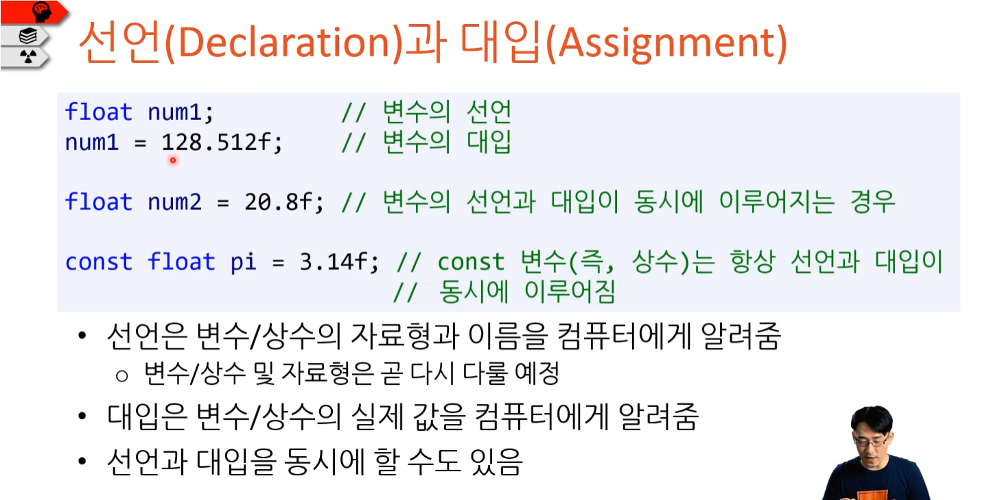

* **대입(Assignment) 대신 정의(definition)로 사용하는 경우도 있다.**

---

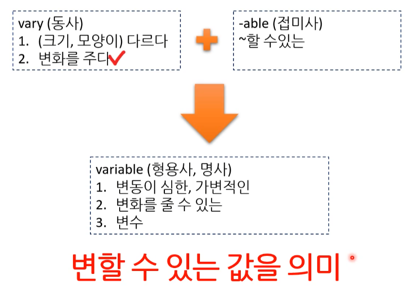

---

**변수**

* **변수를 사용하는 이유** : 재사용, 명확한 유추 가능

* 재사용 하다 보니 변수를 mutalbe이라고 부르기도 한다.

  ( mutable ( 형용사 ) : 변할 수 있는, 잘 변하는 )

  
  
  
  
  

**상수**

* immutable이라고 부르기도 한다.

  ( immutable ( 형용사 ) : 변경할 수 없는, 불변의  )

---

변수를 사용하지 않고 매직넘버를 사용할 경우 발생할 수 있는 문제점


1. **상태 변화 시 누락 가능성 증가**

   변수를 사용하게 된다면 한 군데만 수정해도 다른 곳에서 값이 바뀐다.

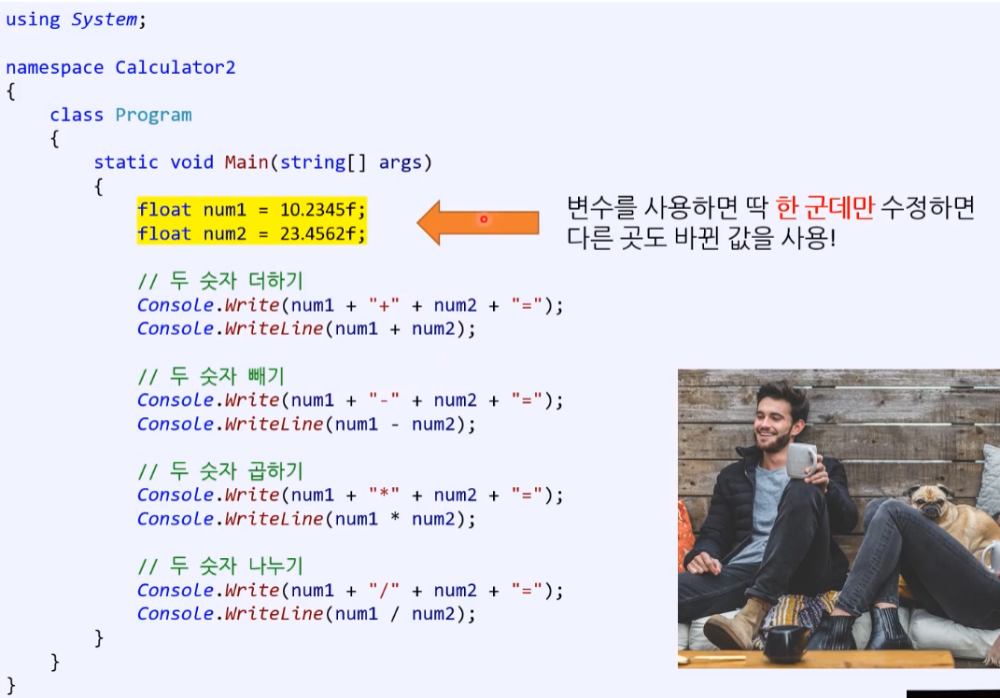


2. **명확한 이름을 통해 의도 파악 가능**
   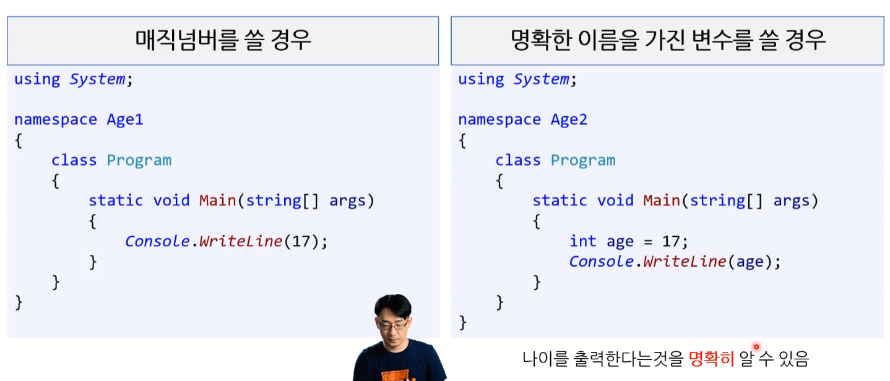


---


### 1.2. 상수 ( const )

변하지 않는 숫자를 말한다. 
( 컴퓨터 과학에서는 문자도 숫자이기에 함께 포함한다. )

* 넓은 의미 : constant

* 좁은 의미 : litreal, magic number, const 키워드 
* 헷갈리지만 섞어서 쓰고, 업계에서도 그렇게 혼용해서 소통한다. 
  ( 하지만 엄밀히 따지면 literal, 별칭으로는 magic number를 사용한다. )


#### 1) const 키워드

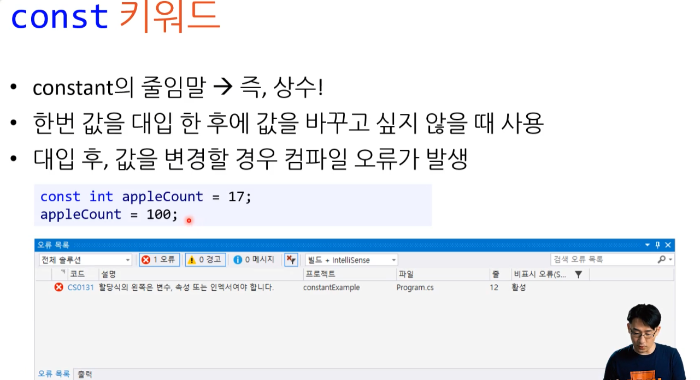


#### 2) 매직 넘버 ( Magic Number )

뭔지 전혀 알 수 없기 때문에 `매직넘버`라고 부른다.

* 매직 넘버는 되도록이면 사용하지 말자.
* 변수를 사용하면 한 번에 변경 할 수 있지만 매직 넘버를 사용하면 여러차례 바꿔야 한다.

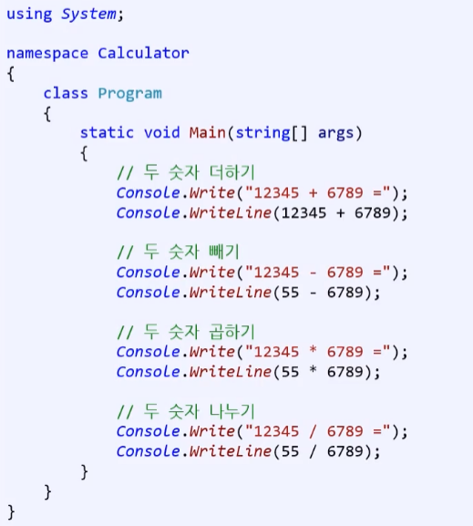

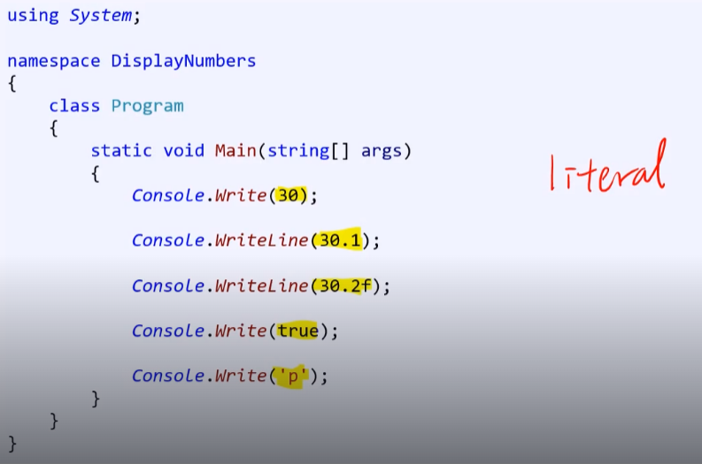

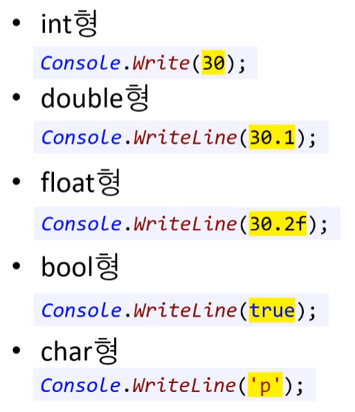


#### 3) 접두사와 접미사

**접두사 접미사를 사용하는 이유**

* **컴퓨터 입장에서 10은 다양한 의미를 표현하기 때문에 알아 듣기 어렵다.**

* 그렇기 때문에 접두사와 접미사를 사용한다.
* [핵심] 접두사와 접미사 사용으로 명확한 의도를 전달하는 방식은 업계의 코딩 표준이다.
  * 접두사 접미사의 사용은 가독성을 높여준다.

> ---
>
> int 10
>
> 이진수 10
>
> double 10
>
> ---

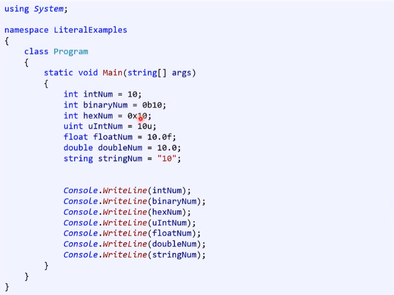

---


##### (1) 접두사와 접미사

* 접두사 ( prefix ) : 상수의 앞을 꾸민다.
* 접미사 ( postfix ) : 상수의 뒤를 꾸민다.


##### (2) 상수 접두사

상수 앞에 붇는 기호로 진법을 나타낸다.

* 2진수 : **0b-** / 0B-
* 16진수 : **0x-** / 0X-

( 일반적으로 여러 프로그래밍 언어에서 대문자보다 소문자를 주로 사용한다.  소문자는 잘 쓰이지 않는다. )

```c#
int num1 = 0b10;	// 사용 비중이 매우 높다.
int num2 = 0B10;

int num3 = 0x10;	// 사용 비중이 매우 높다.
int num4 = 0X10;
```


##### (3) 상수 접미사

상수 뒤에 붙는 기호이다.

* 상수의 자료형을 나타낸다.

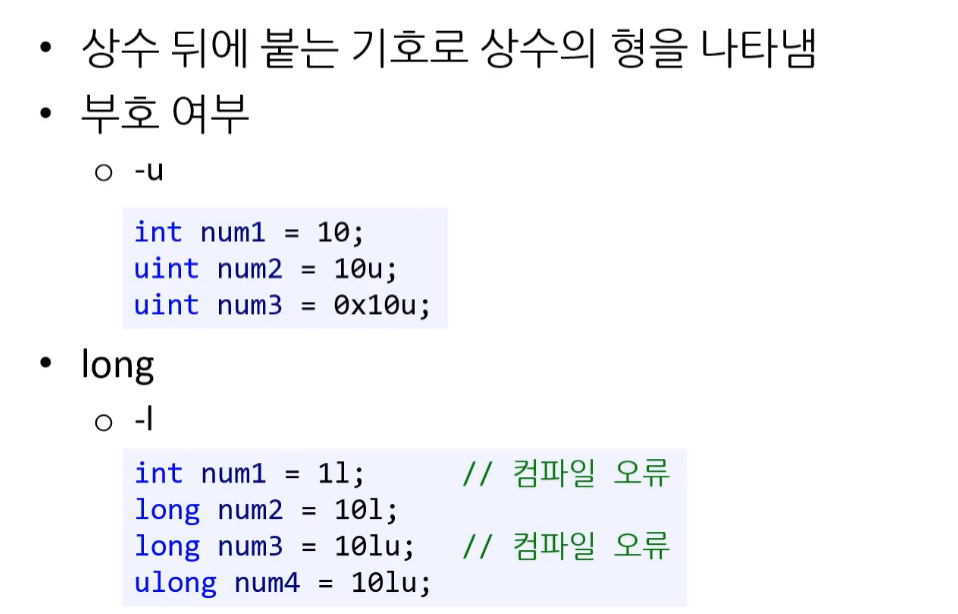

---

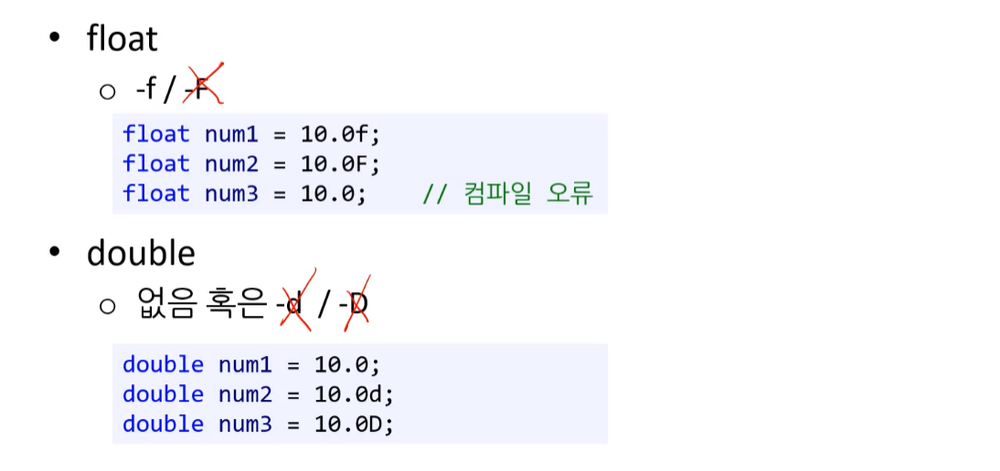

( 대문자는 잘 안쓰인다. double 접미사는 거의 안쓰이는 편이다. )

* float에서 사용하는 f 접미사는 일반적인 업계 코딩 표준이다.
  * 수정(대입)할때 접미사를 붙여주는 게 특히 좋습니다. 
    왜냐하면 변수 선언문에는 왼쪽에 바로 type이 보이지만 단순 대입문에서는 변수 타입이 안 보인다. 이럴때 접미사를 붙여주면 곧바로 변수 타입을 알 수 있어서 ( 프로그래머가 눈으로 봤을때 ) 가독성이 올라가기 때문이다.

---


## 2. 기본 자료형 소개

* 어떤 언어가 자체적으로 지원하는 자료형
* 하드웨어에서 직접적으로 이해하는 자료형


**기본 자료형 ( Primitive Types )** 

* 원시 자료형, 가장 단순한 형태의 자료형, Built-in Types 등 다양하게 불리기도 한다.

* 컴퓨터가 이해할 수 있는 가장 자연스러운 형태의 데이터
  * ALL 숫자
  * 디지털 : 2진수
* 프로그래밍 언어마다 담을 수 있는 자료의 크기 차이는 존재한다.

---


### 2.1. 정수형 ( Integer Types )

* 자연수를 의미한다.

* byte, short, int, long

  ( C#에서 byte가 다른 언어에서는 char 형으로 많이 쓰인다. )

  * byte : 1 바이트
  * short : 2 바이트
  * int : 4 바이트
  * long : 8 바이트

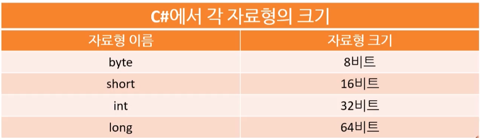


### 2.2. 부동소수점형 ( Floating-Point Types )

* float, double
  * float : 4 바이트
  * double : 8 바이트

* 3.14, 0.9와 같은 실수를 담는다.

```C#
float float1 = 10.23f;
float float2 = 3.4f;

double double1 = 11.0;			// float과 달리 f를 안 붙인다.	
double double2 = 5.234;			// float과 달리 f를 안 붙인다.
```


#### [bonus] int, float - 4바이트 최적화

int와 float 형을 기본으로 많이 사용하곤 합니다. 

그 이유는 일반적인 CPU의 구조 때문에 4바이트 크기의 데이터로 연산을 하는 것이 가장 빠르기 때문입니다. (순수하게 CPU의 연산장치만 고려할 경우를 말한다,) 

따라서 실무에서는 일반적으로 byte나 short 대신 int를 사용하는 경우가 많다.

하지만 정말 메모리가 많이 모자른 시스템에서 프로그래밍을 한다면 이 마저도 byte로 줄여서 메모리를 최대로 아끼려고 합니다. 


### 2.3. 문자형 ( Character Type )

* 하나의 문자를 담는 자료형
  * 알파벳 ( a-z, A-Z ), 숫자( 0-9 ), 특수문자( !, @, * 등등 )
  * 작은 따옴표 ( ' ' )
* char : 2바이트 ( 유니코드 )

---

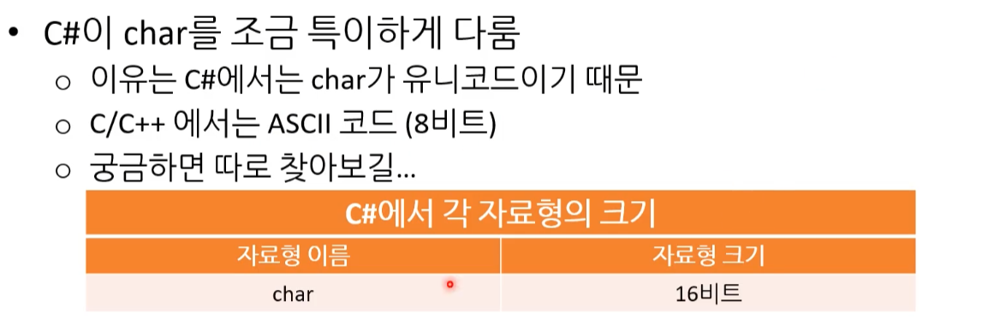

[참고] 유니코드의 첫 부분은 ASCII 하고 동일하다.


### 2.4. 불리언형 ( Boolean Type )

[참고] 어떻게 보면 정수형이라고 할 수도 있다. 어떤 경우는 불리언이 없고 정수형으로 대신 사용하기도 한다.

( 불리언을 번역을 할 만한 마땅한 단어가 없다. )

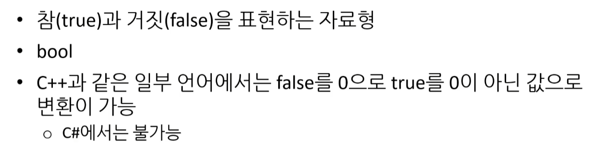

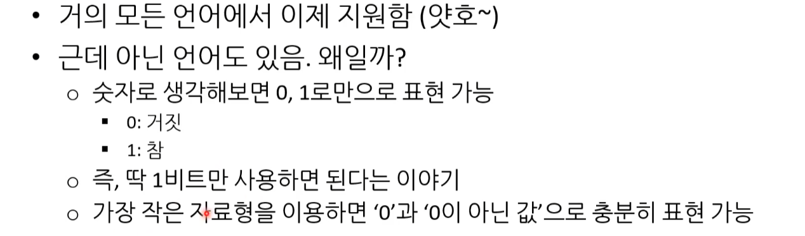


### 2.5. 부호 있는 자료형, 부호 없는 자료형

* 부호 : 수학에서는 양수와 음수를 판별하기 위한 기호(sign)를 의미한다.

* **부호 있는 자료형(Signed Types)**
* **부호 없는 자료형(Unsigned Types)**

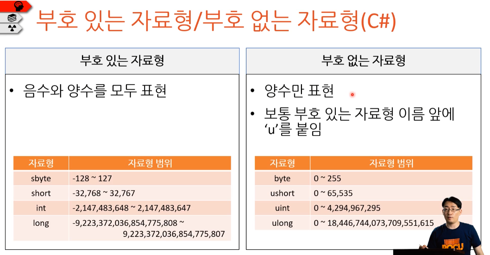


#### - byte

byte가 부호가 없는 이유 : C언어의 char형에서 시작한 것을 보인다.

---

* ASCII 코드
  * 처음에는 총 128개
    * 7비트로 표현 가능 
    * 남는 1비트는?

---

> [ 확장 아스키 ( Extended ASCII ) ]
>
> 1비트가 남다 보니 각 나라마다 이 1비트를 가지고 다양한 언어가 추가 된다.
>
> EUC-KR(한국어), EUC-JP(일본어)

---

* Char형은 이런 문자를 사용하는 특징 때문에 음수를 사용하지 않는 unsigned을 기본형으로 사용하게 된다.

---

C#에서는 C언어의 char 대신 byte라는 자료형을 사용하며 unsigned가 기본형으로 사용한다.

( C#에서의 char는 16비트이다. )

* sbyte 하면 음수/양수 모두 담은 signed


### [summry] 기본 자료형 - 최종

* 기본적으로 많이 쓰이는 자료형 : int, float

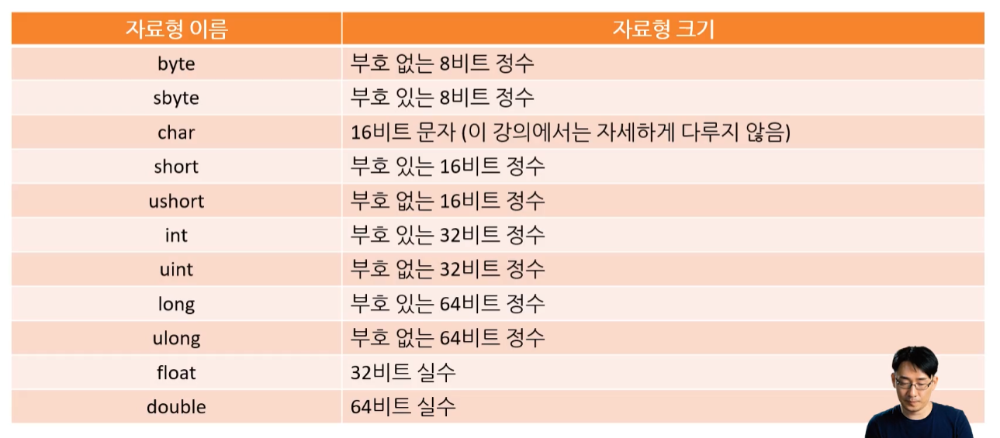


```C#
using System;

namespace PrimitiveTypesToBinary
{
    class Program
    {
        static void Main(string[] args)
        {
            byte byte1 = byte.MaxValue;
            byte byte2 = byte.MinValue;

            int int1 = int.MaxValue;
            int int2 = int.MinValue;

            long long1 = long.MinValue;
            long long2 = long.MaxValue;

            char char1 = 'x';
            char char2 = '$';

            Console.WriteLine(byte1 + " -> " + Convert.ToString(byte1, 2));
            Console.WriteLine(byte2 + " -> " + Convert.ToString(byte2, 2));

            Console.WriteLine(int1 + " -> " + Convert.ToString(int1, 2));
            Console.WriteLine(int2 + " -> " + Convert.ToString(int2, 2));

            Console.WriteLine(long1 + " -> " + Convert.ToString(long1, 2));
            Console.WriteLine(long2 + " -> " + Convert.ToString(long2, 2));

            Console.WriteLine(char1 + " -> " + Convert.ToString(char1, 2));
            Console.WriteLine(char2 + " -> " + Convert.ToString(char2, 2));
        }
    }
}
```


## 3. 형 변환 (Type Conversion)

### 3.1. 묵시적 변환(Implicit Conversion)

* '묵시적 변환', '암묵적 변환'이라고 번역한다.


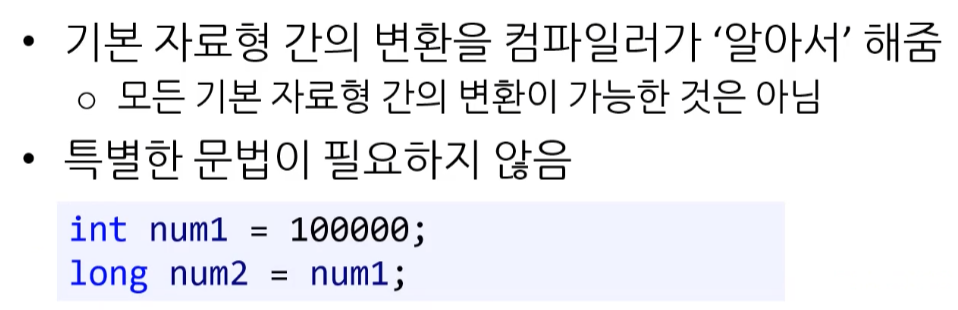


---


---


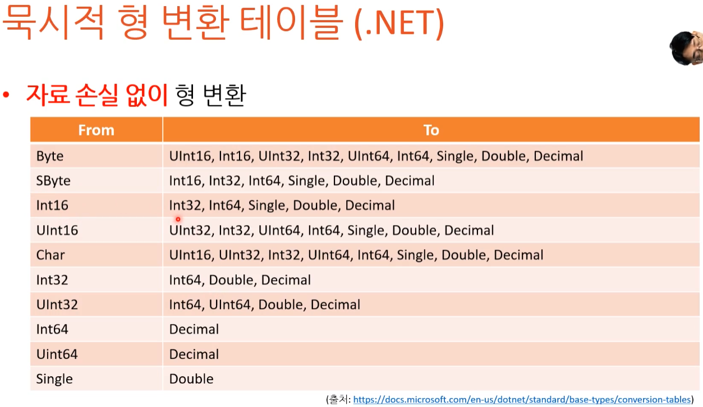


* int 형을 float으로 변환 시키면 손실이 있을 수 있다.

```c#
using System;

namespace SampleProject
{
    class Program
    {
        static void Main(string[] args)
        {
            int num1 = 1234567890;
            float num2 = num1;
            
            Console.WriteLine(num1 - (int)num2);
        }
    }
}
```

```
-46
```

상식적으로 0이 나오는 것이 정상이지만 정밀도 문제가 생긴다.

그러니, int로 표현 가능 한 것은 int로 사용하는 것이 좋다. 


#### 1) 정밀도 손실(Loss of Precision)

정밀하게 값을 표현하지 못한다.

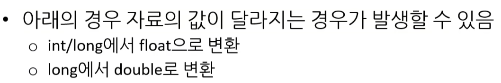


#### 2) 승격(Promotion)

컴파일러가 알아서 자동적으로 형을 바꿔준다고 생각하면 된다.

변환과 승격을 다르게 보는 경우가 있다. 
( 엄밀히 따지면 다른 것이지만 프로그래머에게 이 두 개의 차이점을 알아야 하는 경우는 드물다.  )

**중요한 것은 어떤 것에서 어떤 것으로 변환이 되는지, 변환 시 문제가 있는지, 변환 시 2진수 표현이 바뀌는지 아닌지 등의 여부를 아는 것이 중요하다.**

- 컴파일러가 자동으로 실수형이나 부동소수형 자료의 이진 표현을 확장한다.
- 산술 연산자 또는 논리 연산자가 제대로 동작하게 하거나 ALU(산술논리장치)가 더 효율적으로 돌 수 있게 하려고 사용한다.
- 예를들어, int와 double을 더했을 때 정수+실수의 조건인데, double로 해야 소수점 표현이 가능하니까 두 가지의 합은 **double**로 출력된다.

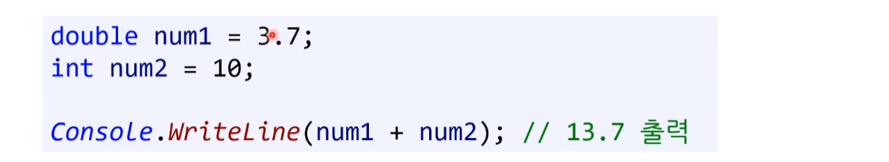


##### (1) 작은 형에서 큰 형으로 변환

아무런 문제 없이 들어간다.

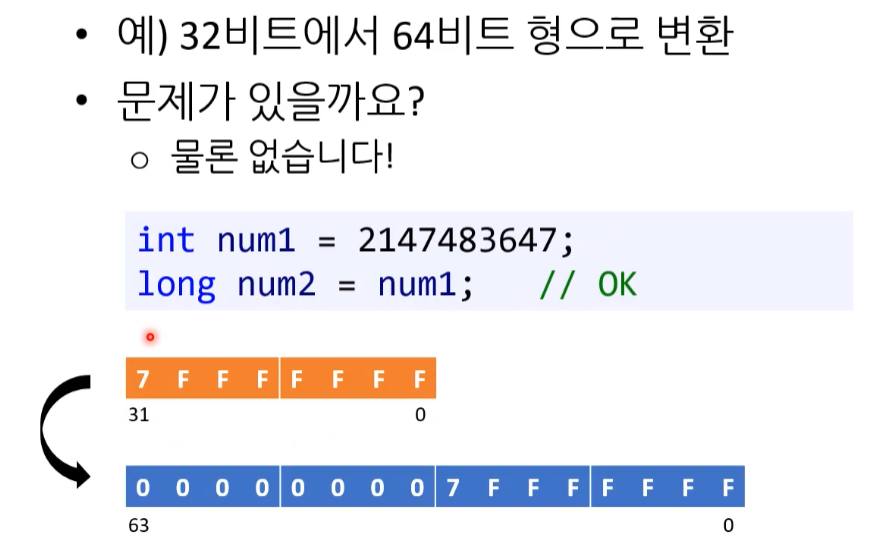


##### (2) 큰 형에서 작은 형으로 변환

값이 작으면 상관 없이지만 아니라면 손실이 일어날 가능성이 크다.
( 언어마다 손실 상황을 고려해 컴파일 오류를 내는 경우도 있다. )

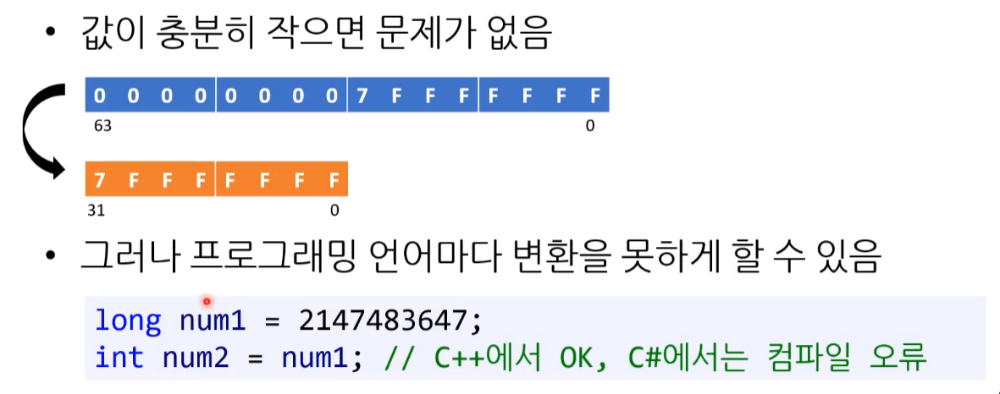

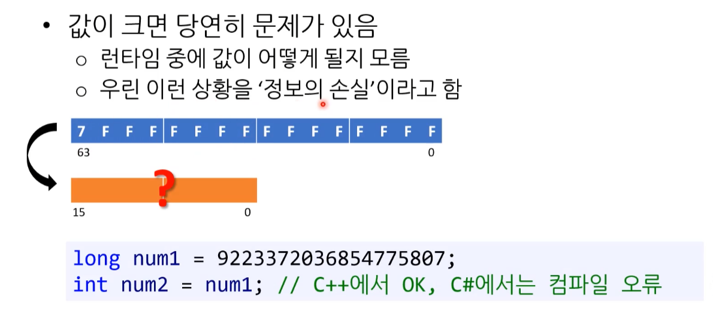


### 3.2. 명시적 변환

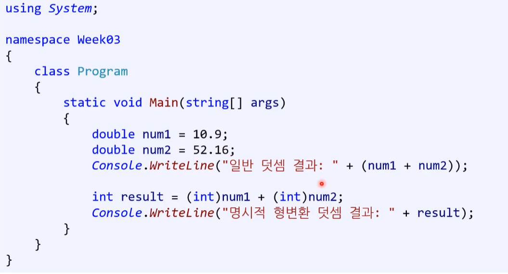

```
일반 덧셈 결과: 63.06
명시적 형변환 덧셈 결과: 62
```

실수에서 정수로의 명시적 형변환은 무조건 내림이 된다. ( 소수점 없애기 )

---


명시적인 형 변환은 프로그래머의 의도를 포함되어 있다. 

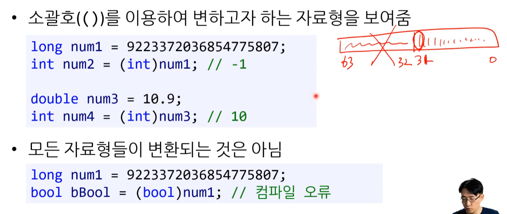


