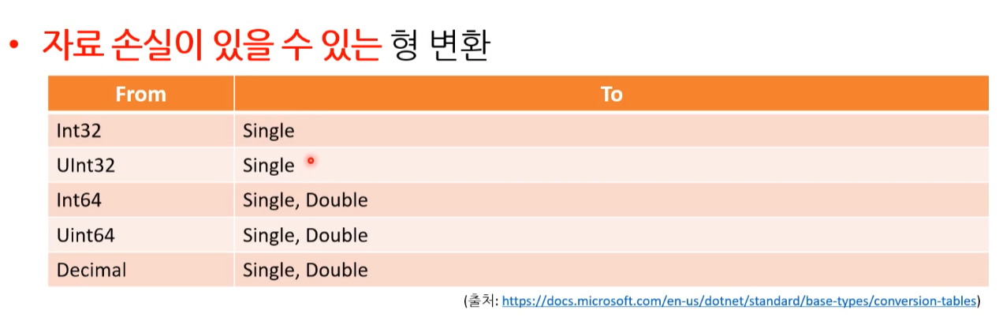

#  05. 변수와 상수 ( 데이터 타입 )


## 1. 변수와 상수

### 1.1. 변수 ( Varialbe )

어떤 상태를 저장하는 곳 - 상태는 변할 수 있고, 그럴 때 마다 저장한다.

* variable : 변할 수 있는 값을 의미 
  * ( vary : [동사] 변화를 주다. )

* **변수를 사용하는 이유** : 재사용, 명확한 유추 가능

* 재사용 하다 보니 변수를 mutable이라고 부르기도 한다.

  ( mutable ( 형용사 ) : 변할 수 있는, 잘 변하는 )


#### 1) 선언과 대입

* 선언 ( Declaration ) : 변수 / 상수의 자료형과 이름을 컴퓨터에 알린다. 
* 대입 ( Assignment ) : 변수 / 상수의 실제 값을 컴퓨터에 알린다. 
  * 선언과 대입을 동시에 할 수 있다.
  * const 변수(즉, 상수)는 항상 선언과 대입이 동시에 이루어진다.
  * **대입(Assignment) 대신 정의(definition)로 사용하는 경우도 있다.**

```C#
float num1;				// 변수 선언
num1 = 128.512f;		// 변수 대입

float num2 = 128.512f	// 변수 선언과 동시에 대입

const float PI = 3.14f 	// const 변수(즉, 상수)는 항상 선언과 대입이 동시에 이루어짐
```


#### 2) 변수 미사용시 생기는 문제점

변수를 사용하지 않고 매직넘버를 사용할 경우 발생할 수 있는 문제점이다.


1. **상태 변화 시 누락 가능성 증가**

   변수를 사용하게 된다면 한 군데만 수정해도 다른 곳에서 값이 바뀐다.
   
   * 매직넘버 만을 사용할 경우 변수에서 1번 수정 할 것을 N번 이상 수정해야 한다.
   
   ( ※ 나중에 예시 코드 기입 예정 )


2. **명확한 이름을 통해 의도 파악 가능**

```c#
-------------------------------
// 명확함 X : 무엇을 출력하는지 알 수 없다.
Console.WriteLine(17);		
-------------------------------
// 명확함 O : 변수명 age를 통해 나이를 출력한 다는 것을 명확히 알 수 있다.
int age = 17;				
Console.WriteLine(age);
-------------------------------
```


### 1.2. 상수 ( constant )

변하지 않는 숫자를 말한다. 
( 컴퓨터 과학에서는 문자도 숫자이기에 함께 포함한다. )

* immutable이라고 부르기도 한다.
  ( immutable ( 형용사 ) : 변경할 수 없는, 불변의  )

---

* 넓은 의미 : constant, immutable

* 좁은 의미 : litreal, magic number, const 키워드 
* 헷갈리지만 섞어서 쓰고, 업계에서도 그렇게 혼용해서 소통한다. 
  ( 하지만 엄밀히 따지면 literal, 별칭으로는 magic number를 사용한다. )


#### 1) const 키워드

* constant의 줄임말 => 상수
* 한 번 값을 대입한 후에 값을 바꾸고 싶지 않을 때 사용
* [컴파일 오류] 대입 후, 값을 변경할 경우 컴파일 오류 발생


#### 2) 매직 넘버 ( Magic Number )

뭔지 전혀 알 수 없기 때문에 `매직넘버`라고 부른다.

* 매직 넘버는 되도록이면 사용하지 말자.
* 변수를 사용하면 한 번에 변경 할 수 있지만 매직 넘버를 사용하면 여러차례 바꿔야 한다.

```c#
Console.WriteLine(30);			// int 
Console.WriteLine(30.1);		// double
Console.WriteLine(30.2f);		// float
Console.WriteLine(true);		// bool
Console.WriteLine('p');			// char
```


#### 3) 접두사와 접미사

**접두사 접미사를 사용하는 이유**

* **컴퓨터 입장에서 10은 다양한 의미를 표현하기 때문에 알아 듣기 어렵다.**

  ( 그렇기 때문에 접두사와 접미사를 사용한다. )

* [핵심] 접두사 접미사의 사용은 명확한 의도를 전달하여 가독성을 높여준다.

  * 접두사와 접미사 사용은 업계의 코딩 표준이다.


> ---
>
> int 10
>
> 이진수 10
>
> double 10
>
> ---


##### (1) 접두사와 접미사

* 접두사 ( prefix ) : 상수의 앞을 꾸민다.
* 접미사 ( postfix ) : 상수의 뒤를 꾸민다.


##### (2) 상수 접두사

상수 앞에 붇는 기호로 진법을 나타낸다.

* 2진수 : **0b-** / 0B-
* 16진수 : **0x-** / 0X-

( 일반적으로 여러 프로그래밍 언어에서 대문자보다 소문자를 주로 사용한다.  대문자는 잘 쓰이지 않는다. )

```c#
int num1 = 0b10;	// 사용 비중이 매우 높다.
int num2 = 0B10;

int num3 = 0x10;	// 사용 비중이 매우 높다.
int num4 = 0X10;
```


##### (3) 상수 접미사

상수 뒤에 붙는 기호로 상수의 자료형을 나타낸다.

* **-u** : unsigned 형 ( 부호 없음 )

```c#
int num1 = 10;
uint num2 = 10u;
uint num3 = 0x10u;
```


* **-l** : long

```c#
int num1 = 1l;			// 컴파일 오류
long num2 = 10l;
long num3 = 10lu;		// 컴파일 오류
ulong num4 = 10lu;
```


* **-f** / -F : float
  * 대문자도 가능하나 거의 잘 안쓰이는 편이며 보통은 소문자 -f를 사용한다.
  * float에서 사용하는 f 접미사는 일반적인 업계 코딩 표준이다.

```C#
float num1 = 10.0f;
float num2 = 10.0F;
float num3 = 10.0;		// 컴파일 오류
```


* -d / -D : double
  * double 접미사는 생략이 가능하며 거의 안쓰인다.

```c#
double num1 = 10.0;
double num2 = 10.0d;
double num3 = 10.0D;
```


**[ 접미사 사용 시기 ]**

수정(대입)할때 접미사를 붙여주는 게 특히 좋습니다. 

왜냐하면 변수 선언문에는 왼쪽에 바로 type이 보이지만 단순 대입문에서는 변수 타입이 안 보인다. 이럴때 접미사를 붙여주면 곧바로 변수 타입을 알 수 있어서 ( 프로그래머가 눈으로 봤을때 ) 가독성이 올라가기 때문이다.


## 2. 기본 자료형 소개

**기본 자료형 ( Primitive Types )** 

* 어떤 언어가 자체적으로 지원하는 자료형
* 하드웨어에서 직접적으로 이해하는 자료형
* 컴퓨터가 이해할 수 있는 가장 자연스러운 형태의 데이터
  * ALL 숫자
  * 디지털 : 2진수
* 프로그래밍 언어마다 담을 수 있는 자료의 크기 차이는 존재한다.
* 원시 자료형, 가장 단순한 형태의 자료형, Built-in Types 등 다양하게 불리기도 한다.

---


### 2.1. 정수형 ( Integer Types )

* 음수, 0, 자연수를 의미한다.

* byte, short, int, long

  * byte : 8비트 ( 1 바이트 )
  * short : 16비트 ( 2 바이트 )
  * int : 32비트 ( 4 바이트 )
  * long : 64비트 ( 8 바이트 )
* [참고] C#에서 byte가 다른 언어에서는 char 형으로 쓰이는 편이다.


### 2.2. 부동소수점형 ( Floating-Point Types )

* 소수점이 있는 수이다.

* float, double
  * float : 32비트 ( 4 바이트 )
  * double : 64비트 ( 8 바이트 )

* 3.14, 0.9와 같은 실수를 담는다.

```C#
float float1 = 10.23f;
float float2 = 3.4f;

double double1 = 11.0;			// float과 달리 f를 안 붙인다.	
double double2 = 5.234;			// float과 달리 f를 안 붙인다.
```


#### [bonus] int, float - 4바이트 최적화

int와 float 형을 기본으로 많이 사용하곤 합니다. 

그 이유는 일반적인 CPU의 구조 때문에 4바이트 크기의 데이터로 연산을 하는 것이 가장 빠르기 때문입니다. 
( 순수하게 CPU의 연산장치만 고려할 경우를 말한다. ) 

따라서 실무에서는 일반적으로 byte나 short 대신 int를 사용하는 경우가 많다.

하지만 정말 메모리가 많이 모자른 시스템에서 프로그래밍을 한다면 이 마저도 byte로 줄여서 메모리를 최대로 아끼려고 합니다. 


### 2.3. 문자형 ( Character Type )

* 하나의 문자를 담는 자료형
  * 알파벳 ( a-z, A-Z ), 숫자( 0-9 ), 특수문자( !, @, * 등등 )
  * 작은 따옴표 ( ' ' )
* char : 16비트 ( 2바이트 ) 
  * 유니코드

* [참고] C#은 char형이 유니코드를 사용하는 16비트 ( 2 바이트 )
* [참고] C/C++은 char형이 ASCII코드를 사용하는 8비트 ( 1 바이트 )


### 2.4. 불리언형 ( Boolean Type )

* bool  ( 불리언을 번역을 할 만한 마땅한 단어가 없다. )
* 참 ( true )와 거짓 ( false )를 표현하는 자료형
* 거의 모든 언어에서 지원하는 자료형이다.

* [참고] 어떻게 보면 정수형이라고 할 수도 있다. 어떤 경우는 불리언이 없고 정수형으로 대신 사용하기도 한다.

  * C++ 같은 일부 언어에서는 false : 0 으로 true : 0이 아닌 값 으로 변환이 가능하다.
    * C#은 불가능

  * 숫자로 생각하면 0 ( 거짓 ), 1 ( 참 )로만 표현 가능하다.
    *  1비트 만으로 사용 가능 한 것이다.


### 2.5. 부호 있는 자료형, 부호 없는 자료형

* 부호 : 수학에서는 양수와 음수를 판별하기 위한 기호(sign)를 의미한다.

* **부호 있는 자료형(Signed Types)** : 음수와 양수 모두 표현

  

  

* **부호 없는 자료형(Unsigned Types)** : 양수만 표현

  * 보통 부호 있는 자료형 이름 앞에 'u'를 붙인다.


#### [ C : char - C# : byte / C# : char ]

**C : char**

* 8비트 ( 1 바이트 )

* ASCII 문자 체계

* [범위] 양수 음수 사용

  

**C# : byte**

byte가 부호가 없는 이유 : C언어의 char형에서 계승한 것으로 보인다.

* 8비트 ( 1 바이트 )
* C#에서는 C언어의 char 대신하여 byte라는 자료형을 사용하고 있으며 unsigned를 기본형으로 사용하고 있다.
  * sbyte : 음수/양수 모두 담은 signed 형 byte를 의미한다. 
* C : char => C# : byte


**C# : char**

* 16비트 ( 2 바이트 )
* 유니코드
* [범위] U+0000~U+FFFF

* C#에서의 char는 ASCII보다 방대한 문자를 가지는 유니코드를 16비트 ( 2 바이트 )로 표현한 것이다.

* C : char ( 8비트 : ASCII 코드 ) => C# : char ( 16비트 : 유니코드 )


### [summry] 기본 자료형 - 최종

* 기본적으로 많이 쓰이는 자료형 : int, float


## 3. 형 변환 ( Type Conversion )

### 3.1. 묵시적 변환 ( Implicit Conversion )

* '묵시적 변환', '암묵적 변환'이라고 번역하기도 한다.

* 컴파일러에서 기본 자료형 간의 변환을 자동으로 해준다.

  * 모든 기본 자료형 간의 변환이 가능한 것은 아니다.
  * 특별한 문법이 필요 없다.

  ```c#
  int num1 = 10000;
  long num2 = num1;
  ```

  

---


---





#### 1) 정밀도 손실 ( Loss of Precision )

묵시적 변환시 특히 아래의 자료형이 달라지는 경우 정밀도 손실이 발생할 가능성이 크다.

* int / long => float
* long = > double

```c#
using System;

namespace SampleProject
{
    class Program
    {
        static void Main(string[] args)
        {
            int num1 = 1234567890;
            float num2 = num1;
            
            Console.WriteLine(num1 - (int)num2);
        }
    }
}
```

```
-46
```

상식적으로 0이 나오는 것이 정상이지만 이렇게 정밀도 문제가 생긴다.

그러니 int로 표현 가능 한 것은 int로 사용하는 것이 좋다. 


##### (1) 작은 형에서 큰 형으로 변환

아무 문제 없다.

* 32비트에서 64비트 형으로 변화 

```
int num1 = 2147483647;
long num2 = num1;		// OK
```


##### (2) 큰 형에서 작은 형으로 변환

값이 작으면 상관 없지만 아니라면 손실이 일어날 가능성이 크다.
( 언어마다 손실 상황을 고려해서 컴파일 오류를 내는 경우도 있다. )


* 64비트에서 32비트 형으로 변환 ( 작을 경우 )
  * 아래의 경우 손실이 없어 문제가 되지 않는다. 

```C#
long num1 = 2147483647;
int num2 = num1;			// C++에서 OK, C#에서는 컴파일 오류
```


* 64비트에서 32비트 형으로 변환 ( 큰 경우 )
  * 런타임 중에 값이 어떻게 될지 모른다.
  * 아래의 경우 '정보의 손실'이 생겨 문제가 된다.  

```c#
long num1 = 9223372036854775807;
int num2 = num1;			// C++에서 OK, C#에서는 컴파일 오류
```


#### 2) 승격 ( Promotion )

**연산 시 자료형의 크기가 더 큰 것을(표형범위가 넓은 형식) 따르는 것이다.**

컴파일러가 알아서 자동적으로 형을 바꿔준다고 생각하면 된다.

* int와 double을 더했을 때 정수+실수의 조건인데, double로 해야 소수점 표현이 가능하니까 두 가지의 합은 **double**로 출력된다.
  - 산술 연산자 또는 논리 연산자가 제대로 동작하게 하거나 ALU(산술논리장치)가 더 효율적으로 돌 수 있게 하려고 사용한다.
  - 실수형, 부동소수점 Type 확장 
    * 컴파일러가 자동으로 실수형이나 부동소수형 자료의 이진 표현을 확장한다. 

```c#
double num1 = 3.7;
int num2 = 10;

Console.WriteLine(num1 + num2);		// 13.7 출력 ( 승격 )
```


> ---
>
> **[ Type Conversion과 Type Promotion ]**
>
> 변환과 승격을 다르게 보는 경우가 있다. 
> ( 엄밀히 따지면 다른 것이지만 프로그래머에게 이 두 개의 차이점을 알아야 하는 경우는 드물다.  )
>
> **중요한 것은 어떤 것에서 어떤 것으로 변환이 되는지, 변환 시 문제가 있는지, 변환 시 2진수 표현이 바뀌는지 아닌지 등의 여부를 아는 것이 중요하다.**
>
> ---


### 3.2. 명시적 변환 ( Explicit conversion )

명시적인 형 변환은 프로그래머의 의도를 포함되어 있다. 

* 소괄호 ( () )를 이용하여 변하고자 하는 자료형을 보여준다.

* 실수에서 정수로의 명시적 형변환은 무조건 내림이 된다. ( 소수점 없애기 )

  ```c#
  long num1 = 9223372036854775807;
  int num2 = (int)num1;			// -1
  
  double num3 = 10.9;
  int num4 = (int)num3;			// 10
  ```

* 모든 자료형이 변환이 되는 것은 아니다.

  ```c#
  long num1 = 9223372036854775807;
  bool bBool = (bool)num1;		// 컴파일 오류
  ```


**실습**

```c#
using System;

namespace Week
{
    class Program
    {
        static void Main(string[] args)
        {
        	double num1 = 10.9;
        	double num2 = 52.16;
        	Console.WriteLine("일반 덧셈 결과 : " + (num1 + num2));
        	
        	int result = (int)num1 + (int)num2;
        	Console.WriteLine("명시적 형변환 덧셈 결과 : " + result);
        }
    }
}
```

```
일반 덧셈 결과: 63.06
명시적 형변환 덧셈 결과: 62
```


