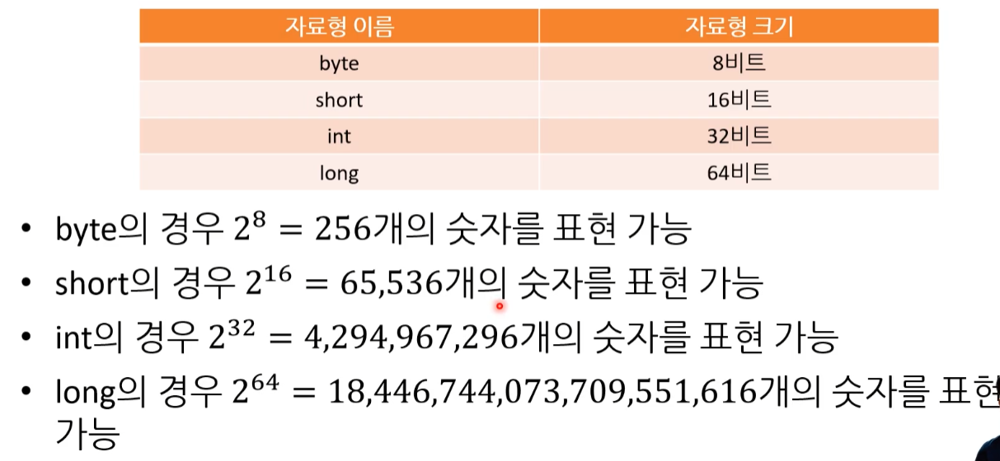

# 06. 데이터 단위 - 데이터와 정보

### 1. 정보란?

데이터 => 처리 과정 => 정보

**데이터** ( 자료, 기호가 나열 된 것 )  =>  **정보** ( 정리 분석 한 것 )

* 데이터는 처리 가공을 통해 실제로 사용할 수 있는 정보가 된다.

( 디지털 정보의 단위는 디지털 데이터의 단위이기도 합니다. )

### 2. 데이터 단위 ( bit / byte / word )

* **bit ( binary digit ) - 정보의 기본 단위 ★**
  * 비트에서 첫 번째 비트를 최상위 비트(Most Significant Bit, MSB), 
                                                              마지막 비트를 최하위 비트(Least Siginificant Bit, LSB)라고 부릅니다.
* **byte - 메모리 주소의 기본 단위 ★**
  * 컴퓨터가 데이터를 저장하는 최소 단위 1byte
  * 1byte = 8bit
    * 2 nibble ( 4bits : 4bits )
    * 0 ~ 255 ( 256개 )

  * 영문자 한 글자가 저장될 수 있는 메모리 크기다.
    ( 한글 한 글자를 저장하려면 2바이트가 필요하다. )
  
* **word - CPU가 데이터를 다루는 기본 단위 ( = 레지스터의 크기 )**
  * word는 컴퓨터 시스템에 따라서 크기가 달라진다. 
    ( [과거] 8비트 => [현재] 32비트 => 64비트 )

### 3. 데이터의 최대 조합수

---

---

* 2의 10 제곱 = 1024

* 2의 32 제곱 = 4기가 바이트
  ( 32 bit 구조의 한계 용량 = 4GB )

---

* 4비트 = 16가지
  8비트 = 256가지 ( 1byte )
  16비트 = 65,536가지 ( 64kb )
  32비트 = 4,294,967,296가지 ( 약 42.9억 ) ( 4GB )

---

* 1024 byte    = 1 kbyte

  1024 kbyte  = 1 mbyte

  1024 mbyte = 1 gbyte

  1024 gbyte   = 1 tbyte

---

> **[ 메모리 수 ]**
>
> 32비트 최대 설치할 수 있는 메모리 수 - 4,294,967,296개
>
> - ***32비트 운영체제가 지원하는 메모리 ( 최대 4GB )***
>
> - ***64비트 운영체제가 지원하는 메모리 ( 최대 512GB )* **

## 참고

| 유튜버             | 제목                                                         | 주소                                                         |
| ------------------ | ------------------------------------------------------------ | ------------------------------------------------------------ |
| 오제이튜브         | 💻 컴퓨터의 실체                                              | https://www.youtube.com/playlist?list=PLz--ENLG_8TNmXT0BY43eSLlFCcQDDqyA |
| 홍정모             | C언어[따배씨] 초반 부분                                      | https://www.youtube.com/playlist?list=PLNfg4W25Tapyl6ahul_8VS_8Tx3_egcTI |
| 종합               | CS개론(입문 - 개론/메모리/보수/문자)                         | https://www.youtube.com/playlist?list=PLetkvXWioaD3eBJZrgBayT-SfUdV9SroK |
| 뉴렉처             | 프로그래밍 학습 가이드 목록                                  | https://www.youtube.com/playlist?list=PLq8wAnVUcTFVWq7BUX9kz1mdoeQKEcL9Q |
| 뉴렉처             | 컴퓨터 프로그래밍을 하기 위한 사전지식                       | https://www.youtube.com/playlist?list=PLq8wAnVUcTFXna0fCAsElIj2qayRqvGjk |
| Tucker Programming | 컴맹을 위한 Go 언어 기초 프로그래밍 기초 강좌 ( 1~6강 까지 ) | https://www.youtube.com/playlist?list=PLy-g2fnSzUTAaDcLW7hpq0e8Jlt7Zfgd6 |
| 널널한 개발자      | 넓고 얕게 외워서 컴공 전공자 되기                            | https://www.inflearn.com/course/%EB%84%93%EA%B3%A0%EC%96%95%EA%B2%8C-%EC%BB%B4%EA%B3%B5-%EC%A0%84%EA%B3%B5%EC%9E%90/dashboard |
