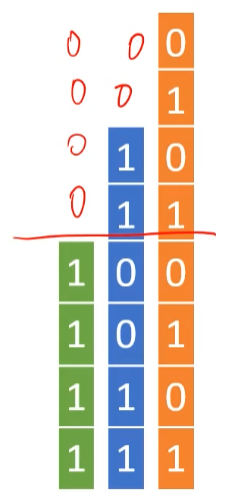
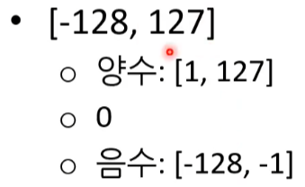
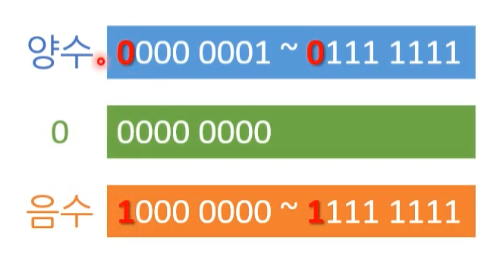
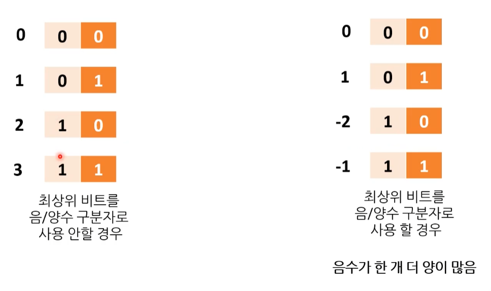

# 07 숫자 - 진법과 보수


## 1. 진법

### 1.1. 2진수와 16진수

**십진법 - Decimal numerical system** - 손가락 10개

**이진법 - Binary numerical system** - 진공관과 트랜지스터의 스위치


#### **1) 2진수와 16진수**

* 2진수 한 자리 수 - 1비트

* 16진수 두 자리수 - 1바이트, 8비트

  * '0x'표기법 : 0x16 
  * ex) 0xFF - 255 ( 1바이트, 8비트 )

  

> **CSS에서 사용하는 색상 표기 방법**
>
> CSS 색상 표기 - 16진수 표기
> #03 F1 E3 - 24비트 컬러
> ( + 알파값 - 32비트 트루 컬러 )


#### 2) 16진수 사용 이유

1. 10진수 이상을 표현하기 위하여
   16진수를 사용할 수 밖에 없다.
2. 간략한 정보 전달 표기를 위하여


### 1.2. 실수 진법 변환

#### 1) [실수] 2진수 => 10진수

$$
10010.1011 (2) 
 = 2^4 + 2^1 + 2^{−1} + 2^{−3} + 2^{−4}
 = 18 + 0.5 + 0.125 + 0.0625 = 18.6875
$$


#### 2) [실수] 10진수 => 2진수 

소수부분에 2를 곱하고, 나오는 정수부분을 순서대로 나열하면 2진법으로 표기된 소수가 된다.
$$
−118.625  =  −1110110(2)

 −0.625=−1110110(2) −2^{−1}
 −2^{−3}
 =−1110110.101 (2)
$$


**[주의!] 10진수 0.1의 2진수 변환 = 무한소수**

0.0001100110011...

컴퓨터는 무한 소수들을 모두 메모리에 나타낼 수 없기 때문에 일정 부분만 잘라서 메모리에 보관하게 된다. 
따라서 필연적으로 오차가 발생하게 된다.


## 2. 보수

**여기서 보수는 2의 보수를 말한다.** 
핵심은 **오버플로우**(생략)를 이용한 **보수 더하기**로 **뺄셈을 사용**할 수 있게 되는 것이다.

[참고] 2의 보수를 제안 한 것은 폰노이만이다.

---

1단계 : 1100  -  0011
2단계 : 1100  -  0011 + 10000 - 10000 ( 0 )

- +10000 - 10000은 0 이기 때문에 사용해도 상관이 없다.

3단계 : 1100 + 1101 - 10000

- 10000을 먼저 사용 함으로써 -0011은 1101을 더하기로 사용할 수 있게 된다.

4단계 : 11001 - 10000 ( 오버플로우로 앞의 자리 각자 생략 )

- 그리고 이후 나오는 캐리는 어차피 빼줘야 한다.

5단계 : 1001

* 1100 - 0011을 다른 방식으로 표현하면 1100 + (-0011) 보수화 더하기를 하여 나중에 캐리 생략할 수 있게 되는 것이다.

---

**오버플로우**(생략)를 이용하면 음수를 보수로 표현할 수 있다.

* 2의 보수는 음수를 한 개 더 표현할 수 있다. 

  * char     =>     -128  ~  +127 

  * 음수 갯수 = 0 + 양수 갯수

    


### 2.1. **'10진수'를 '음수'로 변환하는 방법**

1. 10진수 => 2진수로 변환
2. 보수
3. 더하기 1

* [확인 방법] 음수와 반대 양수를 더하면 0이 되는지 확인  ex) -5 + (+5) = 0 
* [장점] '2의 보수' 정수 표현법에서 -0과 0은 같다! 
  * '1의 보수'만 사용할 경우 -0, 0은 1111,0000 으로 표현 될 수 있다.


### 2.2. **'음수'를 '10진수'로 변환하는 방법**

1. 음수 여부 확인 - 2진수 맨 앞자리 숫자
2. 보수
3. 더하기 1
4. 10진수 => 2진수로 변환
5. 마이너스 여부에 따라 붙이기


### 2.3. 음수와 양수

---





---








---


**[ 음수 양수 - 구분자 ]**

* **부호 있는 자료형(Signed Types)**
* **부호 없는 자료형(Unsigned Types)**



---


## 3. 프로그램과 숫자

'프로그래밍'의 수와 '수학'의 수는 차이가 있다.


* 프로그래밍

  * 정수 : 1,2, -3, 0 ( int )
  * 실수 : 1.25  -  소수점이 있는 숫자를 표현 ( double )
  * 문자열 ( string )

* 수학

  * 정수

    * 양의 정수 ( 자연수 )
    * 0
    * 음의 정수 ( 0보다 작은 수 )

  * 실수

    실제로 존재하는 수를 의미한다.

    * 유리수 : 비로 표현되는 수
    * 무리수 : 비로 표현되지 않는 수 

---

* 상수 ( constant ) : 프로그램 실행하는 중에 변하지 않는 값을 상수라고 한다. ( 넓은 의미의 상수 )

  * 프로그래밍에서 '변하지 않는 것'에 문장도 포함된다. 
    ( 컴퓨터 하드웨어 내부에서 글자도 모두 숫자로 저장된다. )

  ```c#
  <상수의 종류> <상수의 이름> = <상수>;
  // 상수에 이름을 붙여는 주는 것을 '변수를 선언한다'고 한다. ( 할당도 지금 이루어지고 있다. )
  
  int appleCount = 3;
  ```


---

[참고] 문자열 : 덧셈 연산은 가능하나 뺄셈 연산은 불가능하다.


 

## [ 참고 ]

* [[2진수 변환기, 정수및 소수 10진수↔2진수 변환 | OurCalc](https://ourcalc.com/2진수-변환기/)](https://ourcalc.com/2%EC%A7%84%EC%88%98-%EB%B3%80%ED%99%98%EA%B8%B0/)

| 유튜버             | 제목                                                         | 주소                                                         |
| ------------------ | ------------------------------------------------------------ | ------------------------------------------------------------ |
| 오제이튜브         | 💻 컴퓨터의 실체                                              | https://www.youtube.com/playlist?list=PLz--ENLG_8TNmXT0BY43eSLlFCcQDDqyA |
| 홍정모             | C언어[따배씨] 초반 부분                                      | https://www.youtube.com/playlist?list=PLNfg4W25Tapyl6ahul_8VS_8Tx3_egcTI |
| 종합               | CS개론(입문 - 개론/메모리/보수/문자)                         | https://www.youtube.com/playlist?list=PLetkvXWioaD3eBJZrgBayT-SfUdV9SroK |
| 뉴렉처             | 프로그래밍 학습 가이드 목록                                  | https://www.youtube.com/playlist?list=PLq8wAnVUcTFVWq7BUX9kz1mdoeQKEcL9Q |
| 뉴렉처             | 컴퓨터 프로그래밍을 하기 위한 사전지식                       | https://www.youtube.com/playlist?list=PLq8wAnVUcTFXna0fCAsElIj2qayRqvGjk |
| Tucker Programming | 컴맹을 위한 Go 언어 기초 프로그래밍 기초 강좌 ( 1~6강 까지 ) | https://www.youtube.com/playlist?list=PLy-g2fnSzUTAaDcLW7hpq0e8Jlt7Zfgd6 |
| 널널한 개발자      | 넓고 얕게 외워서 컴공 전공자 되기                            | https://www.inflearn.com/course/%EB%84%93%EA%B3%A0%EC%96%95%EA%B2%8C-%EC%BB%B4%EA%B3%B5-%EC%A0%84%EA%B3%B5%EC%9E%90/dashboard |
