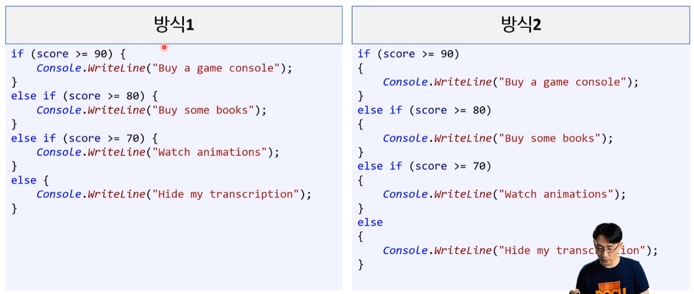

# [보충] 코딩 컨벤션 ( with 클린코딩 )

※ POCU 1500 - 클론코딩 추가 예정


## 1. 코딩 스탠다드

- **코딩 스탠다드는 무엇인가?** 12
  - 프로그래밍 작성 스타일 규칙이다.
  - 목표는 실수를 덜 유발하는 코드를 만들기 위함이다.


* **[참고] 코딩 스탠다드와 동의어** ㅇㅇㅇ
  * 코드 컨벤션(Code Convention)
  * 코딩 컨벤션 (Coding Convention)
  * 코딩 스탠다드 / 코딩 규칙 / 코딩 표준 ( Coding standards )


* **[참고] 회사마다 코딩 표준이 있고, 우린 이를 존중해야 한다.**  ㅇㅇㅇ
  * 회사가 그런 표준을 가지게 된 배경이나 이유가 존재할 것이다. 그러니 일단 따라야 한다. 


### 1.1. 코딩 표준의 필요성

* **코딩 표준이 필요한 이유는?** 12
  * 협업과 생산성을 위해 필수적이다.
  * 실수를 덜 유발하는 코드를 만들기 위함이다.


### 1.2. 코딩 표준 

#### - 중괄호 ( { } )

* **중괄호를 생략하면 어떤 문제가 발생하는가?** 12
  * 가독성 낮아진다. ( 구분이 어렵다. )
  * 실수를 유발하며 유지 보수 과정에서 문제를 일으킨다. 
  * [참고] 실제 현업에서도 이런 사소한 실수로 비즈니스 적으로 문제를 일으키기도 한다.
    ( 보안 회사에서 실제 문제가 발생하여 신문에서 나왔다. 시니어급 이상이 실수한 사례이다. )


* **[참고] 중괄호 치는 패턴 2가지를 말하시오.** ㅇㅇㅇ

  * K&R 스타일
    * 줄의 맨 마지막에 시작 중괄호를 넣는 형태

    ```csharp
    함수 시그니처{
    	...
    }
    ```
    
  * Allman 스타일 
    * 시작과 끝을 맞추는 형태
    
    ```csharp
    함수 시그니처
    {
    	...
    }
    ```
    
    


* **현대에 선호하는 중괄호 패턴은 무엇인가?** 12
  * (방식2 : Allman 스타일)을 더 선호한다.
    * (방식1 : K&R 스타일)은 과거에 스크린이 작은 시절 이를 효율적으로 사용하기 위해 택한 방식이다. 
    * 현대는 모니터가 충분히 크다.




## 2. POCU 아카데미용 C# 코딩 표준

### 2.1. 표기법 종류

* **표기법 4가지를 말하시오.** 12
  * 파스칼 표기법(PascalCase)(Upper camel case)
  * 카멜 표기법(camelCase)
  * 헝가리안 표기법(Hungarian Notation)
  * 케밥 표기법(Kebab Case)


* **파스칼 표기법은 무엇인가? **12
  * 단어의 첫 시작은 항상 대문자를 사용하는 표기법
  * Upper camel case란 표현보다는 Pascal Case란 표현을 씁니다.
  * (ex) HeyTechBlog, HelloWorld, System


* **카멜 표기법은 무엇인가? **12
  * 맨처음 문자는 소문자로 표기하고, 각 단어의 첫문자를 대문자로 표기하고 붙여쓴다.
  * 띄어쓰기 대신 대문자로 단어를 구분하는 표기 방식
  * (ex) backgroundColor, typeName, iPhone


* **[참고] 케밥 표기법(Kebab Case)**  ㅇㅇㅇ
  * 모두 소문자(혹은 모두 대문자)로 쓰되, 띄어쓰기를 하이픈(-) 기호로 대체하는 방식이다. 
  * HTML, CSS, URL와 같이 "-"를 연산자로 이용하지 않는 언어에서 사용된다.
  * (ex) kebab-casa, bayerische-motoren-werke, font-size,...


* **[참고] 헝가리안 표기법(Hungarian Notation)  **ㅇㅇㅇ
  * 컴퓨터 프로그래밍에서 변수 및 함수의 이름 인자 앞에 데이터 타입을 명시하는 코딩 규칙
    * (ex) int intNum 
  * [참고] IDE이 부실한 시절 유행한 표기법으로 현대 와서는 지양하는 방법이다. [MS 공식 가이드라인](https://learn.microsoft.com/en-us/previous-versions/dotnet/netframework-4.0/ms229045(v=vs.100)?redirectedfrom=MSDN)에서도 사용하지 말 것을 권고하고 있다.


* **[참고] 표기법 정의는 각 언어의 문서마다 조금씩 다를 수 있다.** ㅇㅇ

  * 위키 백과 등에서 나오는 정의들은 보편적인 표기법들을 표기할 뿐이다.

  * (ex) 파이썬에서는 파스칼 케이스를 케멜 케이스라고 명명하고 사용한다.

    


### 2.2. 메인 코딩 표준

**[ 표준 규칙 ]**

* POCU : https://docs.popekim.com/ko/coding-standards/pocu-csharp


#### 1) 기본

##### (1) 변수와 상수

---

* **아래의 네이밍을 올바르게 바꾸시오. **12

  ```csharp
  public int orderid { get; private set; }		// 약어
  ```

  |

  ```csharp
  public int OrderID { get; private set; }		// 약어
  ```

  * 뒤에 추가로 단어가 오지 않고, 줄임말(약어)이 들어가는 경우 모두 대문자로 표기한다.


* **아래의 네이밍을 올바르게 바꾸시오. **1

  ```csharp
  int somenumber;	// 지역변수
  int id;			// 지역변수
  ```

  |

  ```csharp
  int someNumber;
  int id;
  ```

  * 카멜 표기법


* **'지역 변수'와 '그것을 사용하는 코드' 선언시 어떻게 하는게 더 가독성이 높을까?** 12
  * 지역 변수를 선언할 때는 그 지역 변수를 사용하는 코드와 동일한 줄로 가능한 가깝게 선언하는 것을 원칙으로 한다.
  


* **아래의 네이밍을 올바르게 바꾸시오.** 12

  ```csharp
  const int someconstant = 1;
  ```

  |
  
  ```csharp
  const int SOME_CONSTANT = 1;
  ```
  
    * ALL 대문자, 밑줄 분리
  
    * 모두 대문자로 하되 밑줄로 각 단어를 분리한다.
  


* **초기화 후 값이 변하지 않는 변수는 어떻게 처리하는가?** 12
  * 초기화 후 값이 변하지 않는 변수는 `readonly`로 선언한다.


* **아래의 네이밍을 올바르게 바꾸시오.** 

  ```csharp
  bool fired;			    // 지역변수
  private bool fired;		// private 멤버변수
  ```

  |

  ```cs
  bool bFired;			    // 지역변수
  private bool mbFired;		// private 멤버변수
  ```

  * 앞에 `b`를 붙인다.


* **아래의 네이밍을 올바르게 바꾸시오.** 12

  ```csharp
  float f = 0.5;
  ```

  |

  ```cs
  float f = 0.5F;
  ```

  * `double`이 반드시 필요한 경우가 아닌 이상 부동 소수점 값에 `f`를 붙여준다


##### (2) 조건문

---

* **아래의 코드를 올바르게 바꾸시오.** 1

  ```csharp
  switch (number)
  {
      case 0:
          ... 
          break;
  }
  ```

  |

  ```csharp
  switch (type)
  {
      case 0:
          ... 
          break;
      default:
          Debug.Fail("unknown type");
          break;
  }
  ```

  * `switch` 문에 언제나 `default:` 케이스를 넣는다.
  * `switch` 문에서 `default:` 케이스가 절대 실행될 일이 없는 경우, `default:` 안에 `Debug.Fail()` 또는 `Debug.Assert(false)` 란 코드를 추가한다.


##### (3) 반복문

* **단순 반복문(for, while 등)에 사용되는 변수가 아닌 경우엔 i, e 대신 무엇을 사용해야 하나? **12
  *  `index`, `employee` 처럼 변수에 저장되는 데이터를 한 눈에 알아볼 수 있는 변수명을 사용한다.


* **변수 가리기는 사용할까?** 12
  * 변수 가리기(variable shadowing)는 표준 규칙상 허용되지 않는다. 


* **변수 가리기란 무엇인가?** 12

  * 외부 변수가 동일한 이름을 사용중이라면 내부 변수에는 다른 이름을 사용한다.

    (ex) 매개변수가 count 라면 for문에 count를 사용해서 가려진다.
    
    ```csharp
    public class SomeClass
    {
        public int Count { get; set; }
        public void Func(int count)
        {
            for (int count = 0; count != 10; ++count)
            {
                // count를 사용
            }
        }
    }
    ```


##### (4) 열거형

---

* **아래의 코드를 올바르게 바꾸시오. **12

  ```csharp
  public enum direction
  {
      North,
      South
  }
  ```

  |

  ```csharp
  public enum EDirection
  {
      North,
      South
  }
  ```

  * 선언할 때는 앞에 `E`를 붙인다. 
  * 파스칼 표기법


* **아래의 코드를 올바르게 바꾸시오.** 12

  ```csharp
  [Flags]
  public enum visibility
  {
      None = 0,
      Character = 1 << 0,
      Terrain = 1 << 1,
      Building = 1 << 2,
  }
  ```

  |

  ```cs
  [Flags]
  public enum EVisibilityFlags
  {
      None = 0,
      Character = 1 << 0,
      Terrain = 1 << 1,
      Building = 1 << 2,
  }
  ```

  * '비트 플래그 열거형' 이름 뒤에 `Flags`를 붙인다.


#### 2) 함수

##### (1) 함수

---

* **아래 코드를 올바르게 작성하시오.**  1

  ```csharp
  public uint age();		// 메서드 - 작동 기능 : age를 반환한다.
  ```

  |

  ```cs
  public uint GetAge();
  ```

  * 파스칼 표기법
  * 값을 반환하는 함수의 이름은 무엇을 반환하는지 알 수 있게 짓는다.


##### (2) **매개변수**

---

* **아래 코드를 올바르게 작성하시오.** ( 매개변수 )  12

  ```csharp
  public void SomeMethod(int someparameter)
  {
      ...
  }
  ```
  
  |
  
  ```csharp
  public void SomeMethod(int someParameter)
  {
      ...
  }
  ```
  
  * 카멜 표기법


* **다음 코드를 올바르게 작성하시오.** 12

  ```csharp
  public Anim GetAnim(string name)	// 매개변수에 NULL이 들어올 수 있다
  {
  }
  ```

  |

  ```csharp
  public Anim GetAnim(string nameOrNull)
  {
  }
  ```


* **null을 함수의 매개변수로 사용하는 것이 어떤가?**  1
  * `null`을 매개변수로 사용하는 것을 지양한다.
    * 함수의 매개변수로 `null`을 허용하지 않는 것을 추구한다. 
    * 특히, `public` 함수일 경우 더욱 그러하다.


##### (3) 반환

---

* **다음 코드를 올바르게 작성하시오.** 12

  ```csharp
  public string GetName();		// 반환 값이 NULL일 수 있다.
  ```

  |

  ```csharp
  public string GetNameOrNull();
  ```

  

* **null을 함수에서 반환 할 수 있게 작성할 수 있는가?** 12
  
  * 함수에서 `null`을 반환을 지양한다.
    * 함수에서 `null`을 반환하지 않는 것을 추구한다. 
    * 특히, `public` 함수일 경우 더욱 그러하다. 
  * 그러나 때로는 예외를 던지는 것을 방지하기 위해 그래야 할 경우도 있다.


##### (4) 재귀 함수

---

* **아래의 코드를 올바르게 작성하시오.**  12

  ```csharp
  public void fibonacci();
  ```
  
  |

  ```csharp
  public void FibonacciRecursive();
  ```

  * 이름 뒤에 `Recursive`를 붙인다.

---


##### (5) C# 함수

---

* **함수 오버로딩은 어떨 때 피해야 하는 것이 좋은가? **1

  1. 매개변수 자료형이 범용적인 경우, 함수 오버로딩을 피한다.

  2. 너무 포괄적 함수는 피한다.

  |

  **올바른 방식:**

  ```cs
  public Anim GetAnimByIndex(int index);
  public Anim GetAnimByName(string name);
  ```

  **틀린 방식:**

  ```cs
  public Anim GetAnim(int index);
  public Anim GetAnim(string name);
  ```


* **디폴드 매개변수와 함수 오버로딩 어떤게 선호도가 높은가?**  12
  * 디폴트 매개 변수 대신 함수 오버로딩을 선호한다.


* **디폴드 매개변수 사용시 유의해야 할 사항은 무엇인가? **12
  * 디폴트 매개 변수를 사용하는 경우, `null`이나 `false`, `0` 같이 '0에 준하는 값'(비트 패턴이 0인 값)을 사용한다.


* **다음 코드를 올바르게 고치시오. **12

  ```csharp
  if (int.TryParse(intString, out int number))
  {
  	...
  }
  ```

  |

  ```csharp
  int number;
  if (int.TryParse(intString, out number))
  {
  	...
  }
  ```

  * 함수에 전달하는 `out` 매개변수는 별도의 라인에 선언한다. 
  * 즉, 인자 목록 안에서 선언하지 않는다.


#### 3) 클래스

#####  (1) 메서드

---

* **다음 코드를 올바르게 작성하시오.** 12

  ```csharp
  public uint age()		// age를 반환하는 메서드
  {
      // 함수 구현부...
  }
  ```
  
  |
  
  ```csharp
  public uint GetAge()
  {
      // 함수 구현부...
  }
  ```
  
  * 파스칼 표기법
  * 동사(명령형)+명사(목적어)의 형태 - 지향한다


* **부울 상태를 반환하는 메서드명은? **[어려움]

  * **부울(boolean) 상태를 반환하는 메서드**의 동사 부분은 최대한 `Is`, `Can`, `Has`, `Should`를 사용한다.

  * 이래도 만약, 부자연스러울 경우에는 상태를 나타내는 다른 3인칭 단수형 동사를 사용한다.
  
  ```csharp
  public bool IsAlive(Person person);
  public bool HasChild(Person person);
  public bool CanAccept(Person person);
  public bool ShouldDelete(Person person);
  public bool Exists(Person person);
  ```


* **public 이 외의 메서드명 네이밍 규칙은 무엇인가?** 1

  * public 메서드가 아닌 경우 카멜 표기법을 따른다. ( private 등 )
  
  * [주의!] Visual Studio를 사용 시에는 별도의 스타일 규칙을 추가해야 할 수도 있음. ([자세한 설명](https://stackoverflow.com/quest ions/40856186/naming-rule-violation))
  
  ```cs
  private uint getAge()
  {
      // 함수 구현부...
  }
  ```
  
  ---
  
  
  
  


##### (2) 컬렉션 클래스

---

* **컬렉션 클래스는 어떤걸 사용할까?** 1
  * **System.Collections.Generic**
    * 항상 `System.Collections`에 들어있는 컨테이너 대신에 `System.Collections.Generic`에 들어있는 컨테이너를 사용한다. 
    * ( 성능상의 이유로 추정, 나중에 더 알아보기 )
  * 순수 배열을 사용하는 것도 괜찮다.


##### (3) **클래스**

---

* **다음 코드를 올바르게 작성하시오.** 1

  ```csharp
  class playermanager;
  ```

  |

  ```csharp
  class PlayerManager;
  ```

  * 파스칼 표기법 : 클래스명


* **C# 클래스에서 싱글턴 패턴을 어떻게 사용할까? **1
  * 사용하지 않는다.
  * 싱글턴 패턴 대신에 정적(`static`) 클래스를 사용한다.


* **[참고] 싱글턴 패턴**  ㅇㅇ

  *  **객체의 인스턴스를 한 개만 생성되게 하는 패턴**입니다.

  ```java
  public class Singleton {
  
      private static Singleton instance = new Singleton();
      
      private Singleton() {
          // 생성자는 외부에서 호출못하게 private 으로 지정해야 한다.
      }
  
      public static Singleton getInstance() {
          return instance;
      }
  
      public void say() {
          System.out.println("hi, there");
      }
  }
  ```

  


* **클래스 정의 시 순서를 나열 하시오.** 1

  |

  1. public const 상수      ( 댓글로 피드백 받음 )
  2. private const 상수      ( 댓글로 피드백 받음 )
  3. public 멤버변수/프로퍼티
  4. internal 멤버변수/프로퍼티
  5. protected 멤버변수/프로퍼티
  6. private 멤버변수
     - 단, 프로퍼티와 대응하는 private 멤버변수는 프로퍼티 바로 위에 적음
  7. 생성자
  8. public 메서드
  9. Internal 메서드
  10. protected 메서드
  11. private 메서드
  
  


* **다음 파일명을 올바르게 작성하시오.** 12

  ```cs
  public class PlayerAnimation 
  {
  }
  ```

  ```
  playeranimation.cs
  ```

  |

  ```cs
  public class PlayerAnimation 
  {
  }
  ```

  ```
  PlayerAnimation.cs
  ```

  * 파일 이름은 대소문자까지 포함해서 반드시 클래스 이름과 일치해야 한다.


* **클래스 파일 관리는 어떻게 하는가?** 
* <u>클래스는 각각 독립된 소스 파일</u>에 있어야 한다. 
  
* 단, 작은 클래스 몇 개를 한 파일 안에 같이 넣어두는 것이 상식적일 경우 예외를 허용한다.


* **partial 클래스는 무엇인가?** 12
  * 여러 파일이 하나의 클래스로 이루어진 것을 말한다.


* **다음 파일명을 올바르게 작성하시오.** 12

  ```csharp
  public partial class Human;
  ```

  ```
  // head, body, arm
  ```

  |

  ```csharp
  Human.Head.cs
  Human.Body.cs
  Human.Arm.cs
  ```

  * 클래스 이름으로 시작하고, 그 뒤에 마침표와 세부 항목 이름을 붙인다.


* **new 키워드 사용 규칙은 무엇인가?**

  * `new` 키워드 뒤에 반드시 명시적으로 자료형을 적어준다. 
  * 즉, C# 9.0의 `new()` 사용 금지


* **개체 초기자(object initializer) 는 어떻게 사용하나?**  @@@

  개체 초기자(object initializer)를 사용하지 않으려고 노력한다. 그 대신 생성자와 이름으로 지정한 매개변수(named parameter)를 사용하는 게 더 좋은 방법이다. 이 원칙에 대한 두가지 예는 다음과 같다.

  1. 개체 생성을 딱 한 군데서만 할 경우 (예: 한군데서만 사용하는 DTO)
  2. 개체 생성을 해당 클래스 안에 있는 정적 메서드에서 하는 경우 (예: Factory 패턴)


##### (4) 클래스 관련 변수

---

* **다음 코드에서 멤버 변수명을 올바르게 작성하시오.** 1

  ```csharp
  public class Employee
  {
      public int departmentid { get; set; }
      private int age;		
  }
  ```

  |

  ```csharp
  public class Employee
  {
      public int DepartmentID { get; set; }
      private int mAge;
  }
  ```

  * `private` 멤버 변수명은 앞에 `m`을 붙이고 <u>파스칼 표기법</u>을 따른다.


* **초기화 후 값이 변하지 않는 변수는 어떻게 처리하는가?**

  * 초기화 후 값이 변하지 않는 변수는 `readonly`로 선언한다.

  ```cs
  public class Account
  {
      private readonly string mPassword;
      
      public Account(string password)
      {
          mPassword = password;
      }
  }
  ```


* **상수로 사용하는 개체형 변수 코딩 규칙은 무엇이 있는가?**

  1. 상수로 사용하는 개체형 변수에는 `static readonly`를 사용한다.

  2. `static readonly` 변수는 모두 대문자로 하되 밑줄로 각 단어를 분리한다.

     ```cs
     public static readonly MyConstClass MY_CONST_OBJECT = new MyConstClass();
     ```


##### (5) 구조체  / 인터페이스

---

* **다음 코드를 올바르게 작성하시오.** 1

  ```csharp
  struct playerdata;				// 구조체명
  
  public struct suserid;			// 구조체 선언
  public readonly struct sname;	// 구조체 선언
  ```

  |

  ```csharp
  struct PlayerData;				// 구조체명
  
  public struct SUserID;			// 구조체 선언
  public readonly struct Name;	// 구조체 선언
  ```

  * 파스칼 표기법 : 구조체명
  * 구조체를 선언할 때는 앞에 `S`를 붙인다. 
    * 단, `readonly struct`일 때는 그렇지 아니한다


* **다음 코드를 올바르게 작성하시오.** 1

  ```csharp
  interface someinterface;
  ```

  |

  ```csharp
  interface ISomeInterface;
  ```

  * 파스칼 표기법 : 인터페이스
  * 인터페이스를 선언할 때는 앞에 `I`를 붙인다.


##### (6) 프로퍼티

---

* **getter와 setter와 프로퍼티 중 어떤 것을 사용할까?** 12

  * getter와 setter 대신 프로퍼티를 사용한다.

  **틀린 방식 :**

  ```cs
  public class Employee
  {
      private string mName;
      public string GetName();
      public string SetName(string name);
  }
  ```

  **올바른 방식 :**

  ```cs
  public class Employee
  {
      public string Name { get; set; }
  }
  ```

  


* **부울 프로퍼티 네이밍 규칙은 무엇이 있는가?** 1

  * 부울 프로퍼티는 앞에 `Is`, `Has`, `Can`, `Should` 중에 하나를 붙인다.

  ```cs
  public bool IsFired { get; private set; }
  public bool HasChild { get; private set; }
  public bool CanModal { get; private set; }
  public bool ShouldRedirect { get; private set; }
  ```


* **프로퍼티 `private init`**의 사용을 지양해야 하는가?  @@@
  * 아니다.
  * 프로퍼티에 `private init`(C# 9.0)을 최대한 사용한다.


#### 4) 디버그 / 예외 / 파일

##### (1) **assert**

* **assert의 대표적인 사용 예시를 적으시오.** 1
  * 대부분의 함수는 다음과 같은 `assert`를 가질 수 있다.
  * `Debug.Assert`(매개변수의 null 값 검사)


* **assert는 언제 사용하는가?** 1
  * 컨트롤 가능한 데이터가 들어오고,
    * 함수 선조건, switch 문
  * 특정 조건이 반드시 충족되어야 한다고 가정(assertion)하고 짠 코드 모든 곳에 `assert`를 사용한다.
  * `assert`는 복구 불가능한 조건에 사용한다.


##### (2) 데이터 유효성 검사

* **데이터 유효성 검사는 언제 어디서 하는가?** 1
  * 외부로부터 들어오는 <u>데이터의 유효성은 외부/내부 경계가 바뀌는 곳에서 검증(validate)</u>한다.


* **데이터 유효성 검사시 문제가 발견 될 경우 어떻게 하나?** 1
  * 문제가 있을 경우 <u>내부 함수로 전달하기 전에 반환</u>해 버린다. 
    * 이는 경계를 넘어 내부로 들어온 모든 데이터는 유효하다고 가정한다는 뜻이다.
  * <u>내부 함수에서 예외(익셉션)를 던지지 않으려 노력한다. 예외는 경계에서만 처리하는 것을 원칙</u>으로 한다.


* **데이터 유효성 검사시 예외는 항상 경계에서 처리해야 하는가?**

  * 아니다. 

  * `enum` 형을 `switch` 문에서 처리할 때 실수로 처리 안 한 `enum` 값을 찾기 위해 `default:` 케이스에서 예외를 던지는 것은 허용.

    ```csharp
    switch (accountType)
    {
        case AccountType.Personal:
            return something;
        case AccountType.Business:
            return somethingElse;
        default:
            throw new NotImplementedException($"unhandled switch case: {accountType}");
    }
    ```

    


##### (3) 예외

* **using 선언과 using 문은 어떻게 사용할까? **12

  * [`using` 선언](https://learn.microsoft.com/ko-kr/dotnet/csharp/language-reference/proposals/csharp-8.0/using) (C# 8.0)의 사용을 금한다. 

  * 대신 [`using` 문](https://learn.microsoft.com/ko-kr/dotnet/csharp/language-reference/statements/using)을 사용한다.
  
    [참고] https://www.csharpstudy.com/latest/CS8-using.aspx


#### 5) 네임스페이스 / 기타

##### (1) **네임스페이스**

* **아래의 네임스페이스를 보고, 올바른 네이밍으로 고치시오.** 12

  ```csharp
  namespace system.graphics
  ```

  |

  ```cs
  namespace System.Graphics
  ```

  * 네임스페이스 ( 이름 ) : 파스칼 표기법


##### (2) 비동기? 파일 입출력? 

* **async Task 와 async void은 어떻게 사용할까? **@@@
  * `async void` 대신에 `async Task`를 사용한다. 
  * `async void`가 허용되는 유일한 곳은 이벤트 핸들러이다.


### 2.3. 소스 코드 포맷팅

* **텝은 띄어쓰기 몇칸을 기준으로 하는게 좋은가?** 1
  * 4칸


* **아래 변수 선언을 올바르게 고치시오. **1

  ```csharp
  int counter = 0, index = 0;
  ```

  |

  ```csharp
  int counter = 0;
  int index = 0;
  ```

  


