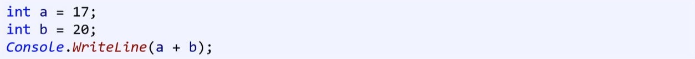
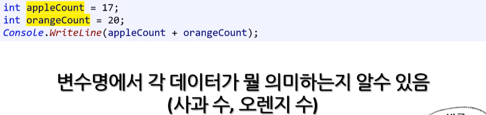
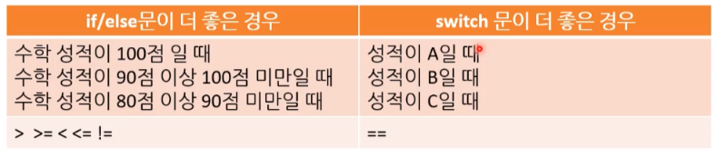

# 클린 코딩

좋은 코드란 그 자체로 설명이 되는 코드다.
좋은 코드는 가독성을 높이고, 실수를 줄여준다.

즉, 팀원과의 효율을 높이며 유지 보수에 효율성을 높여준다.


## 1. 주석 (comment)


---

* 본질적으로 코드 자체가 이해가 되는 코드를 작성해야 한다.
  * 주석은 백그라운드 지식이 아니면 이해할 수 없는 코드에만 작성해야 한다.

  * 주석이 없으면 없을 수록 좋은 코드
    * 전제조건 : 주석 없어도 다른 사람들이 이해 할 수 있는 코드여야 한다.

> ---
>
> **'오픈소스 코드'와 '회사 코드'**
>
> 오픈소스 코드와 회사 내 코드를 1:1로 비교할 수는 없습니다. 
>
> * 마소 코드 베이스에서 일해봤는데 주석 없는 코드 매우 많습니다. 
> * 오픈소스 코드의 경우 회사 코드에 비해 주석 처리가 꽤 있는 편이다.
>
> ( 비유를 들면 전공의 의사들이 학생들에게 설명할 때는 매우 친절히 설명 하지만 자기들끼리 설명할 때는 많은 내용을 생략하고 짧게 필요한 것만 전달합니다. 회사라는 곳은 면접을 통해 어느 정도 최소 실력이 검증된 사람들이 근무하는 곳이라, 미주알 고주알 모든 걸 주석을 쓸 필요는 없습니다. )
>
> [출처] - POCU 댓글 
>
> ---


## 1. 변수와 상수 

### 1.1. 변수

**(1) 사용 시기**

* 재사용 하는 경우
* 가독성이 높아지는 경우
  * 재사용 하지 않더라도 가독성이 높아지면 사용하는 것이 좋다.
  * **재사용 기준 : 2번 이상 사용하는 경우**

> ---
>
> [ 기타 ] 김포프 댓글 
>
> 재활용할 필요성이 있는 값은 변수로 하는 것을 기본으로하되, 가끔 변수명을 대입하면 코드가 읽기 확 쉬워지게 가독성이 높아지는 경우에 한해서 따로 재사용하지 않는 변수를 만들 때도 있다고 기억하시면 될 것 같습니다. ( 나름 괜찮은 원칙 ) 
>
> ---


**(2) 네이밍 규칙**

* <u>**명확한 유추가 가능한 코드명 사용**</u>

* 본인 외에 다른 사람이 보고 이해 못하는 이름은 좋지 않다.
  * 검색 가능한 이름을 사용한다.


---



---




**(3) 가독성 유지**

'짧은 변수명'이나 '축약어'를 너무 남발해서는 안된다.


### 1.2. 상수 - 접두사와 접미사

접두사와 접미사 사용으로 명확한 의도를 전달하는 방식은 업계의 코딩 표준이다.

( 접두사 접미사의 사용은 가독성을 높여준다. )

* **소문자 사용**
  * **접두사와 접미사 사용으로 가독성 높이기**


##### (1) 상수 접두사

상수 앞에 붇는 기호로 진법을 나타낸다.

* 2진수 : **0b-** / 0B-
* 16진수 : **0x-** / 0X-

* **소문자 사용**
  * 일반적으로 여러 프로그래밍 언어에서 대문자보다 소문자를 주로 사용한다. 

```c#
int num1 = 0b10;	// 사용 비중이 매우 높다.
int num2 = 0B10;

int num3 = 0x10;	// 사용 비중이 매우 높다.
int num4 = 0X10;
```


##### (2) 상수 접미사

* 상수 뒤에 붙는 기호로 상수의 자료형을 나타낸다.

* **소문자 사용**

  * 대문자는 잘 쓰이지 않는다. double 접미사는 거의 안쓰이는 편이다. 

  * float에서 사용하는 f 접미사는 일반적인 업계 코딩 표준이다.

    * 수정(대입)할 때 접미사를 붙여주는 게 특히 좋습니다. 

      왜냐하면 변수 선언문에는 왼쪽에 바로 type이 보이지만 단순 대입문에서는 변수 타입이 안 보인다. 이럴때  접미사를 붙여주면 곧바로 변수 타입을 알 수 있어서 ( 프로그래머가 눈으로 봤을 때 ) 가독성이 올라가기 때문이다.


##### **(3) const 키워드**

변하지 않는 상수는 미리 작성해 둔다.


##### (4) 매직 넘버 

매직 넘버는 되도록이면 사용하지 말자. 

* 변수를 사용하자.


### 1.3. 자료형 - 선택 방법

#### 1) 자료형 선택 - 주의점

* **변수의 역할** 
  * 부호가 없는 변수도 이때를 고려해서 적절히 사용해야 한다.
* **오버플로우 가능성**
  * **오버플로어 (overflow )** : 자료형 보다 큰 수를 받아서 값이 넘어가 변하는 것을 말한다.
    <=> 언더플로어 ( underflow )
    [참고] 랜덤값 만들 때 의도적으로 쓰는 경우도 있다.


#### 2) 부호 있는 없는 변수 - 사용시기

**프로그래머의 명백한 의도를 보여 줄 때 사용한다.**

(ex) uint age = 17


#### 3) 자료형 선언 TIP

##### (1) int, float - 4바이트 최적화

* **4바이트 연산 - 최적화**
* int와 float 형을 기본으로 사용한다.

그 이유는 일반적인 4바이트 크기의 데이터 연산이 CPU의 구조 상으로는 가장 빠르기 때문입니다. 
( 순수하게 CPU의 연산장치만 고려할 경우를 말한다. ) 

따라서 실무에서도 일반적으로 byte나 short 대신 int를 사용하는 경우가 많다.

하지만 정말 메모리가 많이 모자란 시스템에서 프로그래밍을 한다면 이 마저도 byte로 줄여서 메모리를 최대로 아끼려고 합니다. 


##### (2) 선언과 초기화

( 할 수 있는 경우에 한 해 ) 선언과 동시에 대입해 주는 건 좋은 습관입니다. 

* (ex) int num = 0;
* (ex) float f = 0.0f;
* (ex) double d = 0.0;


### 1.4. 기타 추가

* **범위 선언** : **변수의 유효 시점을 명확하게 하기 위해서 여러 Scope내에 선언해서 사용할 수 있다.**
  * (ex) for문에서만 사용하는 변수는 for문 안에서 변수를 선언하는 것이 좋습니다.


## 2. 연산자

* **증가 / 감소 연산자 사용**
  * 하드웨어 자체에 1대 1로 대응 되는 명령어다.
  * 속도  :  ++num  >  num + 1


* **조건 연산자 - 사용시기**
  * 간단한 비교를 할 때만 조건 연산자를 사용한다.  ( 가독성 )
  * [주의!] 체인 걸어서 사용하지 않기!


* **괄호**
  * 쓸모 없는 괄호는 없앤다.


* **실수 연산**
  * double 값으로 하는 연산은 최대한 줄이는 것이 좋다.
    * 보통의 경우 정밀도가 그렇게 까지 높지 않아도 되는 데이터라면 float 을 사용합니다. 
  * double형보다 decimal형으로 바꿔서 계산하는 것이 좋은 방법이다.
  * 실수 나누기를 할 경우 가독성을 위해 마지막에 실수 표시를 남긴다.
    (ex) num / 100.0


* **반올림 ( 연산만 사용 )**

  ```csharp
  // 소수점 2자리 까지 반올림
  uint totalRound = (uint)(totalCost * 1000);
  totalCost = (totalRound + 5) / 10 / 100.0;
  ```


* **불리언 표현식**
  * (  X  )   !(month >= 1 && month <= 12)
  * (  O  )   month < 1 || month > 12   
  * ! 붙여서 조건을 뒤집어 주시면 읽기 어려워 지니 지양합시다.


* **%와 / 는 비싼 연산입니다.** 
  ++ 연산으로 처리하는게 좋다고 생각합니다. 
  ( Lab8 실습 중 알파벳 처리하는 과정에서 나온 이야기이다. )


* [?? 및 ??= 연산자](https://learn.microsoft.com/ko-kr/dotnet/csharp/language-reference/operators/null-coalescing-operator)

  [포프] 저희 회사에서는 금지한 연산자입니다. 의미가 한번에 이해안되고 다른 언어와 호환이 안되서...

  [조교] 그럼 만약 비슷한 연산을 하고 싶다면 a != null ? a : b 이런식 으로 쓰는것이 일반적인가요?

  [포프] 넵. 아니면 아예 if문


## 3.  조건문

### 3.1. if문

**(1) if 문  : 코딩 습관**

1. 논리적으로 말이 되는지 확인하기
   * **논리적으로만 보려고 하면 놓치는 부분이 있을 수 있으니 <u>테스트</u>와 <u>디버깅</u>을 잘 활용 해야한다.**
2. 불필요한 반복 로직이 들어갔는지 확인
   * (ex) else if 문

---

* 좋은 프로그래머가 되기 위해 확실하게 연습하자.
  * [TIP] 헷갈리면 그림이나 순서도를 그려보자.

---


**(2) if 문 - 사용시기**

* 대량의 범위를 나타내는 조건들의 경우 IF문을 사용하는 것이 적절하다.




**[TIP] 배재하는 생각 습관**

- 배재 된 로직을 굳이 확인할 필요가 없다.
- [참고] '디버깅' : 디버깅 할 때도 이런 **<u>배재하는 생각 습관</u>**이 중요하다. ( 과도하게 의심하지 마라. )
  * 배재 습관이 없고 의심하게 된다면 너무 많은 경우의 수를 생각하게 된다. 
  * 비효율적이다.


**[TIP] IF 문**

**a vs b**

a. 조건식이 지저분한 단순 if문
b. 조건식이 깔끔한 다중 if문

코드가 지저분하다 깔끔하다는 비객관적인 영역이라 언제나 그렇다 말할 순 없지만 일반적으로 b입니다.
이유는 어차피 동일한 어셈블리어 코드가 나올 확률이 99.9%고 그렇다면 가독성을 높이는 게 올바른 방법이니까요


### 3.2. switch 문

**(1) switch 문을 쓰기 좋은 조건**

1. 비교 대상이 하나일 때
2. 비교 값이 이산적으로 하나씩 뚝뚝 끊겨 나오는 경우
   * 패턴이 있는 == 연산자를 사용하는 표현식


**(2) switch 문 사용 습관 - default 항상 사용**

매치 표현식의 반환 값과 일치하는 case 구문이 없을 경우 실행한다.

* default 구문의 끝에도 반드시 break 구문을 넣자.
  * **break 문을 넣는 좋은 습관을 들이자.**

* 잘못된 / 예상하지 못한 반환값을 잡아야 할 경우 => 어서트(assert)를 사용한다.
  * `switch` 문에서 `default:` 케이스가 절대 실행될 일이 없는 경우, `default:` 안에 `Debug.Fail()` 또는 `Debug.Assert(false)` 란 코드를 추가한다.


**(3) switch 문 최적화**

switch문이 사용하기 적절한 상황이라면 if문보다 switch문을 사용하자.

* 컴파일러 자체에서 if문 보다 더 빨리 작동 할 수 있게 최적화를 시켜 준다. 
  ( 업계에서도 사용하는 방법이다. )


### 3.3. 실전 : 코드 습관

※ 오답 노트 처럼 자주 실수 할 것 같은 코드를 적어둔 자료다.


**최대 최솟값 구하기**

```cs
double[] numbers = new double[5];
for (int i = 0; i < 5; i++)
{
	numbers[i] = double.Parse(input.ReadLine());
}

double min = numbers[0];
double max = numbers[0];
double sum = 0;
double average = 0;

for (int i = 1; i < 5; i++)
{
	if (min > numbers[i])
    {
	    min = numbers[i];
    }
    else if (max < numbers[i])
    {
    	max = numbers[i];
    }
    	sum += numbers[i];
}
average = sum / 5.0;
```

* 앞에서 min과 max에 numbers[0]을 대입했으므로 반복문은 시작이 1부터 여야 한다.
* 동시에 min이고 max인 경우는 없기 때문에 else if가 되어야 한다.


## 4. 반복문

### 4.1. 공통 : 반복 조건식 / 증감연산자

* 반복 조건식 ( i < 3 ) 
  배열을 사용할 때 몇 번까지 도는지 확인하기 편하기 때문에 i < 3을 사용하는 것이 좋다.  ( i <= 2를 잘 쓰지 않는다. )
* 증감연산자 ( ++i ) 
  동작은 동일하지만 ++i가 성능 면에서 조금 더 빠르기에 습관적은 ++i로 들여두는 것도 좋다. ( 하지만 업계에서 i++를 더 많이 사용한다. )

* 공백 사용
  for 문 전에 뒤에 빈 줄 하나 삽입해주면 가독성이 높아집니다.


### 4.2. 단순 반복하기 - for 문

for문을 사용하자

* 배열 : 배열의 모든 요소를 훑을 때
* 일정한 범위 : 반복문이 범위가 정해져 있을 때 사용한다.
* 단순 반복 : 특정한 조건에 의한 종료 없이 단순 반복하기


#### - 반복문 중첩 ( 성능 문제 )

* **<u>반복문이 많아질 수록 성능이 떨어진다.</u>**
  * 기하급수적으로 떨어진다.
* 프로그램의 런타임 복잡도는 **내포(중첩)된 반복문 개수**에 **비례**한다.
  * 한 개 반복문 : O(N)
  * 이중 반복문 : O(N 제곱)
  * 삼중 반복문 : O(N 세제곱)
    * 만약 N = 100이라면 반복문 개수에 따라 100 => 10,000 => 1,000,000 증가 한다.
    * O(N 세제곱)을 O(N)으로 만들 수만 있다면 100,000 배 빨라질 수 있다. ( 알고리즘 성능 향상 )


### 4.3. 실행 중 종료 - while 문

* 불규칙 한 범위 : 반복문을 종료하는 시점이 반복문 실행 도중에 결정 될 때 사용한다.
* **while(true) : 다양한 조건**이 필요할 경우 while(true)를 사용하자.
  * 여러 조건을 while문에 한 번에 기입하는 것은 가독성을 떨어트리고 실수를 유발한다.
    while (true)를 사용할 경우 이런 여러 조건문을 따로 표기하고 break 시켜 사용할 수 있다.
  * 한 동안 나쁜 습관이라 불렸었지만 현재는 검증 완료 되어 유용하게 사용되고 있는 방식이다.


---

* do-while : while (true) 문을 대신하여 사용하는 경우가 더 많다.


**[ for문 중첩 - 질문 ]**

```
[질문] for문 중첩
a. 현업에서는 for문 중첩을 보통 몇 중첩까지 사용하는게 적당할까요?
b. 포프님 께서 현업으로 일 하시면서 본 for문 중 가장 긴 for문은 어느 정도 였나요?

지난 Lab08 과제에서 for문 중첩을 3중첩 까지 하면서 사용하다 보니 이게 맞나?라는 의구심이 들었습니다. ( 과제는 완료했습니다. )

만약 현업으로 회사의 소스 코드를 작성한다면 for문 중첩을 어느정도 까지 마지노선을 두고 작성하는게 좋을지, 어떤 기준으로 결정하는게 좋을 지 궁금해집니다. 찾아보니 시간복잡도를 고려해야 할 것 같긴 한데 이것 만으로는 그 기준을 명확히 잡지 못하겠습니다.
```

```
[답변]

a. 상황따라 다릅니다만 일반적으로 3중부터는 느려서 못쓰는 경우가 많습니다. 때에 다라서는 2중도 그렇고요

여기서 중요한거 내가 사용하는 자료의 길이(N)가 얼마나 되는지 그에서 이 코드를 돌리면 얼마나 느려지는지 입니다.

시간복잡도도 그에 대한 이야기고요.

N이 3인 상황에서는 5중 for 문을 돌려도 전혀 상관없습니다.

시간복잡도라는 것도 내가 코드를 작성할때 대략 N이 10000인걸 알고 있다면 3중 for문을 순간 어마무시하게 느려질거므로 그렇지 않은 다른 효율적인 알고리듬을 사용해야 한다는걸 "미리" 알게 해줄뿐입니다. 한마디로 삽질을 덜 한다는 거죠

따라서 그냥 기계적으로 중첩 for문이 몇까지 허용되냐는건 대답할 수 없는 질문입니다.


b. 5중 중첩까지 써봤으면 그보다 효율적인 방법은 존재하지 않았기에 그렇게 했습니다. (그리고 N이 크지 않아서 그리 느리지도 않았구요)
```


## 5. 입출력

* 입력 초기화

  ```csharp
  double price1 = double.Parse(input.ReadLine());
  ```


## 6. 배열

* **기본형 보다 <u>단축형을 좀 더 많이 본다.</u>**

```csharp
int[] ages = new int[]{ 30, 14, 22 };
```

```csharp
int[] ages = { 30, 14, 22 };
```


* **배열 지양 ★★★**

  * 배열이 코드도 깔끔하고 좋긴 하지만 C#에서는 동적 할당(new 키워드 사용) 해줘야 한다는 흠이 있습니다.

  * 가능하다면 **정적 할당**할 수 있는 변수를 사용하자.

    ```csharp
    int row = arr.GetLength(0);
    int col = arr.GetLength(1);
    ```


## 7. 함수

**함수 사용 기준**

* **재사용 기준** 

  * <u>2번 이상</u> 호출되는 것은 함수로 만들자. ( + 단순 할수록 좋다. )
    ( 예외 : 함수가 너무 길어지는 경우는 하는 경우도 있지만 김포프는 그렇게 까지 하지 않는다. )

* TIP

  * 매개변수 null 여부 : 매개변수에 null값이 안 들어온다고 가정하고 작성한다.

    만약 null이 들어오는 상황이라면 코딩스탠다드에 명시에 함수명에 null이 들어오는 함수란 걸 기입한다.


**함수 네이밍 규칙**

* 함수명
  * 동사로 시작
  * 파스칼 표기법
* 함수 매개변수, 지역변수
  * 명사로 시작
  * 낙타 표기법


**함수 작성시 주의사항 2가지**

* 블랙박스
  * 함수명
  * 함수헤더
  * 함수 바디
    * 명확히 한다

* 함수의 기능 - 오직 1가지


**함수 초보자를 위한 조언**

* '블랙박스'를 유추만으로 사용하자.
* 신뢰하라.
* 오용하지 마라.


**return 사용 TIP**

* return 전에 빈 줄 하나 삽입해주면 가독성이 높아집니다.

* 대입 연산 포함하는 것이 좋지 않다. 
  * 반환과 대입이라는 다른 목적의 코드를 한 구문에 넣어서 직관적으로 읽는데 방해되기 때문이다.
  * 대입문을 곧바로 return하는 코드를 거의 실무에서 볼 수 없다.


**가독성 TIP**

* 함수 사이에는 빈 줄을 하나 넣으면 가독성이 높아집니다.


## 8. 디자인 패턴?

**유효성 검사란?**

요청한 데이터가 어떤 조건에 충족하는지 확인 및 검증하는 작업입니다.

유효성 검사를 하고 리턴 하면 그 뒤로는 안심하고 코드를 짤 수 있어서 좋습니다


**Early Return**

 함수가 혼잡해지는 것을 막는 훌륭한 방법이다. 

 `if/else if` **대신에** `if/return` **구조를 사용하여 들여쓰기를 최소한으로 줄이자.**

* if문 if문으로 사용한다. 
  * else if를 사용해도 어차피 앞에서 if문으로 return해서 나갈 것이기 때문에 불필요한 else 코드를 기입할 필요가 없다.

```java
# if / else 방식 - ( X )
----------------------------------------

public String getValue(final int id) {

	String value;

	if (id > 0) {
		if (id > 10) {
			value = "Id is greater than 10.";
		} else {
			value = "Id is greater than 0 and below 10."
		}
	} else if (id == 0) {
		value = "This id is zero.";
	} else {
		value = "Invalid id.";
	}

	return value;
}
```

---

```java
# if / return - Early Return ( O )
----------------------------------------

public String getValue(final int id) {

	if (id > 0) {
		// 여기가 문제다. 바보 같지만 10보다 큰 값이 들어와도 이 조건문 안에서 끝나버린다...
		return "Id is greater than 0 and below 10.";
	}

	if (id == 0) {
		return "This id is zero."
	}

	if (id < 0) {
		return "Invalid id.";
	}

	return "Id is greater than 10.";
}
```

- 이런 사고 흐름으로 구현하면 에러를 먼저 잡고 그 다음 불필요한 버그를 피하면서 안전하게 비지니스 로직을 구현할 수 있게 된다. 
- fail-fast 사고방식은 [Test-Driven Development](https://en.wikipedia.org/wiki/Test-driven_development) 과 유사해서 테스트에도 용이하다. 
- 함수가 에러 발생시 즉시 종료되기 때문에 의도되지 않은 코드가 실행될 가능성을 피할 수 있다. 
- 예상되는 긍정 결과는 함수의 끝에서 빨리 찾을 수 있다. 
- 예전에는 안 좋은 코드라는 얘기를 했지만 현재는 그것이 검증 끝났고, 현업에서 많이 사용되고 있다.

> ---
>
> **return은 하나만 사용? ( X )**
>
> return은 웬만하면 하나만 사용하라는 조언은 한 10년 쯤 된 조언이다. 
> 요즘은 early return을 사용하는 추세다. ( 가독성도 좋고 최적화에도 도음이 된다. )
>
> * **[ 예외 ] C++에서의 NRVO** 
>   return문 하나만 써서 최적화 도움이 되는건 C++에서의 NRVO 정도가 있는데 이것도 컴파일러 발전에 따라 계속 바뀌는 부분이다. C++ 코딩할 때만 특수하게 고민하는 부분일 것 같다. ( 출처 : 김포프 slack 댓글 )
>
> ---


## 9. 열거형

* enum 마지막 수 활용하기
  * MAX로 선언하고 배열 만들기
  * count로 선언하고 사용하기


* enum으로 switch, function parameter, constant int에 활용한다.


* enum은 따로 `.cs` 파일을 만들어 줘서 분리해 두는게 좋은 습관이다.


## 10. 클래스

new는 안 할 수 있으면 안 하는 게 무조건 좋습니다.
( new 할때 혹은 new된게 지워질때 성능저하가 꽤 됩니다. )

