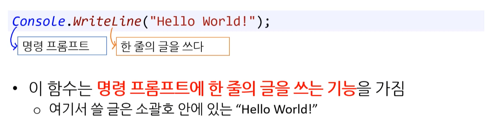

# 02 기초 문법

## **1. 프로그래밍 네이밍**

### **1.1. 키워드 (keyword)**

특별한 의미가 부여된 단어로, 이미 사용하고 있는 예약어다.

* [C# 키워드](https://learn.microsoft.com/ko-kr/dotnet/csharp/language-reference/keywords/)


### **1.2. 식별자 (identifier)**

프로그래밍 언어에서 임의로 이름을 붙여 사용하는 단어이다.

(ex) 변수명, 함수명, 클래스명 등


#### **- 식별자 규칙**

언어 자체적으로 강제하는 규칙이다.


### 1.3. 코딩 컨벤션 (Coding conventions)

**[ 코드컨벤션(Code Convention) / 코딩 컨벤션 (Coding Convention) / 코딩 규칙 ]**

해당 언어로 작성된 프로그램의 각 측면에 대한 프로그래밍 스타일, 사례 및 방법을 권장하는 특정 프로그래밍 언어 에 대한 일련의 지침입니다 .
궁극적인 목표는 다른 사람들의 실수를 덜 유발 시키며, 쉽게 이해할 수 있게 가독성 높은 코드를 작성하는 것이다. 일종의 코딩 스타일 규약이다.


#### **- Code Naming**

개발자들 사이에서 생산성 향상을 위해 약속한 관례적인 규칙이다.
Coding conventions 중 하나이다. 


## 2. 구문 (statement)

명령을 내리는 최소 단위라고 생각하면 된다.

* **세미콜론**
* **들여쓰기**
* **블록** 


#### 1) 세미콜론 ( Semicolon )

C#의 경우 코드 구문(statement) 끝에 붙이는 단어로 필수적으로 들어가야 합니다.

```c#
int num = 50;
```


#### 2) 블록 ( Block )

블록은 특정한 동작을 위해서 코드가 모여 있는 상태를 뜻하며 <u>**중괄호({})**</u>를 기준으로 코드 블록을 구상합니다.

* 범위(scope)라고도 불린다.

```c#
if (key == 1)
{
	Console.WriteLint("HelloWorld!");
}
```


#### 3) 들여쓰기 ( Indentation )

가이드라인 참고


#### **4) 주석 (comment)**

코드를 짜는 개발자들이 알아볼 수 있도록 작성하는 부분을 주석(comment)라고 합니다. 

* **commend out ( 주석 처리 )**

```c#
// 한 라인 ( 한 줄 주석 )
```

```C#
/*

복수 라인 
( 여러 줄 주석 )

*/
```


## **3. Hello World! ( Fuction )**

* 환경 세팅이 되었다는 의미이다.


### 3.1. 프로젝트 시작

#### 1) 빈 프로젝트

* C# Study 사이트 : Visual Studio의 C# 프로젝트 템플릿에서 Console Application을 선택

* [가이드: C# 프로젝트에서 .CS 파일 생성하기](https://blog.pocu.academy/ko/2019/05/07/how-to-make-cs-file-on-csharp-project.html)


> ---
>
> **[ Visual Studio 탬플릿 ]**
>
> C# 프로그래밍에서 가장 많이 사용하는 3가지 방식이다.
>
> * **콘솔 앱 프로그램** 
>
>   명령 프로프트 ( 명령창, 터미널 ) 화면에서 실행되는 프로그램을 작성하는 방식으로 C# 프로그래밍 언어를 학습을 때 주로 사용한다.
>
> * **윈도 응용 프로그램**
>
>   윈도 운영 체제에서 실행되는 윈도 기반의 프로그램을 작성할 때 사용한다.
>
> * **웹 응용 프로그램**
>
>   웹 사이트, 게시판, 쇼핑몰 같은 웹 기반 프로그램을 작성할 때 사용한다.


#### 2) 확장자 (extension)

* 파일 : .cs
* 프로젝트 : .csproj
* 솔루션 : sln
  * (ex) Hello.cs
  * (ex) Hello.csproj
  * (ex) Hello.sln

---

* C++와 다르게 C#은 *.h과 같은 별도의 헤더 파일은 없다.

---


### 3.2. 메인 함수와 'Hello World'

* **함수(function)**: '특정 기능을 수행하는 코드의 집합이다'


**C# 모든 버전**

```C#
using System;

class Program 
{
    static void Main(string[] args) 
    {
        Console.WriteLine("Hello, world!");
    }
}
```


**POCU 아카데미 - .NET Core 버전** 

```C#
using System;

namespace HelloWolrd
{
    class Program
    {
    	static void Main(string[] args)
    	{
    		Console.WriteLine("Hello World!");
		}
    }
}
```


#### 1) 메인 함수 - Main()

```c#
static void Main(string[] args)
```

* **시작점 ( Entry Point ) ( 진입점 )**

  * <u>모든 C# 프로그램은 Main()을 반드시 가져야 한다.</u> 

  * Main()은 시작지점 ( 메서드 )이다.

    * C# 프로그램(exe 파일 등)은 반드시 어떤 지점에서 부터 자동으로 실행된다.

      그 '어떤' 지점 바로 Main이다. ( 함수 라는 표현 대신 보통 메서드 라고 한다. )

  * 선언 조건

    * Main() 메소드는 임의의 클래스 안에서 존재하며, 프로그램 상에 단 **1개**만 있어야 한다. ( 2개 이상 에러 발생 )

    * Main()는 static으로 선언되며, 메소드 인자는 string[] 문자열이다.
      * static을 사용하면 개체를 생성하지 않고 바로 Main()  메서드를 실행 할 수 있다.
    
  


#### 2) 전역 함수 - static

Main 메서드(method) 앞부분에 static이 있다.

* <u>이것 덕분에 **전역함수**가 된다는 것만 기억</u>
* 이것 덕분에 OOP와 상관 없다 는 것만 기억


#### 3) 함수 인자 - string[] args

**메인 함수가 외부에서 받는 <u>데이터</u>**

* 함수 인자(function argument/parameter)(인자/매개변수) 부른다.
* 메서드 인자라고도 부른다.

---

**[ 사용법 ]**

* 커맨드 라인(command-line)으로 부터 인자를 받는다.

* 커맨드 라인 인자란?

  * exe 파일을 실행할 때 추가적으로 넣는 정보

    * `> Hello World.exe Hi C# is fun`

    * "Hi", "C#", "is", "fun" 총 4개의 인자가 들어간다.
    * 이 인자들이 args에 저장된다.


#### 4) 반환형 - void, int

모든 함수는 반환형이 존재한다.
특정 값을 반환할 수도 있고, 아무런 값도 반환하지 않을 수 있다.

* **return : 실제 값을 반환할 때 앞에 사용하는 키워드 이다.**

  [참고] 크게 3가지 형태로 반환 할 수 있다. ( **Return type** )

  * void : ...이 하나도 없는 ( 반환 값이 없다. )

  * int : 정수값

  * [참고] 비동기 반환값도 존재한다. 
    * (ex) async Task, async Task<int>

* **실행 결과 - 코드 ( 성공 / 오류 )**

  * 커맨드 라인은 이 반환형을 받아서 exe 프로그램이 올바르게 실행됐는지 여부를 알 수 있다.
  * 0 : 대부분의 경우 성공을 의미 ( 각 프로그램 마다 의미가 다를 수 있다. )
  * 0 이외의 값 : 오류 코드

  ```c#
  static int Main(string[] args)
  {
  	return 0;
  }
  ```


> **[ Main 함수 - 반환 값 error ]**
>
> Main 함수에 int, void, Task(비동기) 이외에 값을 반환형으로 사용할 경우 아래 에러가 나면서 컴파일이 안된다.
>
> - `error CS5001: Program does not contain a static 'Main' method suitable for an entry point`
>


> **[ Main 함수 - 비동기  반환 값 ]**
>
> * static async Task Main()
> * static async Task Main(string[] args)
> * static async Task<int> Main()
> * static async Task<int> Main(string[] args)


#### 5) 출력 함수 - Console.WriteLine();

화면에 글자를 출력할 때 사용하는 함수이다.

* System.Console은 .NET Framework 클래스이며, WriteLine은 화면에 데이터를 Console클래스의 출력 메서드(함수)로 보여준다.




#### 6) 네임스페이스 - namespace

C#에서는 라이브러리를 네임스페이스 라고 부릅니다. 

* '네임스페이스'에는 클래스, 구조체, 인터페이스, 대리자, 열거 형식 등을 담을 수 있다.
* '네임스페이스'를 만들 때는 namespace 키워드를 이용하여 이름을 기입합니다.
* `namespace 네임스페이스_이름` 후에 오는 중괄호 사이에는 이 네임스페이스에 소속된 클래스 등이 들어갑니다.

```c#
namespace HelloWolrd
{
    class Program
    {
    	...
    }
}
```


#### 7) using 지시어 - using System;

**[ 사용법 ] ** using 지시어 뒤에 사용할 네임스페이스 이름을 입력합니다. 

* using은 C#의 지시어다.

* using System은 System 네임스페이스 안에 있는 클래스를 사용하겠다고 컴파일에 알리는 것이다.

* 프로그램에서 사용할 함수들이 들어있는 네임스페이스를 코드의 맨 위에 **using 지시어**를 사용해서 컴퓨터에 알려줘야 한다.

---

* **using System;**을 없애고 빌드한다면?
  * 빌드 오류가 발생
  * Console에 빨간 줄 그어진다.
  * 'Console.WriteLine()'을 사용하기 위해서 System이라는 네임스페이스를 불러야 한다.

```c#
using System;
// using - 사용한다
// System - System 네임스페이스

// using System을 입력하면 라이브러리를 사용한다는 의미에서 코드 문장을 더 단축해서 사용할 수 있습니다.
// System.Console.WriteLine("Hello");
Console.WriteLine("Hello");
```

---


##### (1) using 키워드

* 콘솔 화면에서 문자열 출력 시 `네임스페이스.클래스.메서드();` 형태로 사용해야 한다.
* using 키워드( `using System;` )를 사용하게 되면 '네임스페이스'를 생략하고 `클래스.메서드();` 형태로 줄여서 슬 수 있다.
* C#의 모든 명령 체계는 `네임스페이스.클래스.메서드();` 형태이거나 '네임스페이스'를 제외한 `클래스.메서드();` 형태로 주로 사용한다.

[참고] C#의 기본 코드 구조 : 네임스페이스 => 클래스 => Main() 메서드

```c#
// using을 사용하지 않은 코드 형태 //

class UsingDemo
{
	static void Main()
	{
		System.Console.WriteLine("Hello World");
	}
}
```

```c#
// using을 사용하는 코드 형태 //
using System;

class UsingDemo
{
	static void Main()
	{
		Console.WriteLine("Hello World");
	}
}
```


##### (2) using static

C# 6.0 버전 이후 부터는 `using static System.Console;` 구문으로 `System.Console`을 생략한 `WriteLine()` 메서드 형태만으로도 사용할 수 있다.

Console 클래스의 `WriteLine()` 메서드는 C# 학습시 많이 사용하는 구문이기 때문에 `using static` 구문으로 위쪽에 `System.Console`을 입력하고 간편하게 사용할 수 있다.

* 어떤 데이터 형식의 정적 멤버를 데이터 형식의 이름을 명시하지 않고 참조하겠다고 선언하는 기능을 한다.

```c#
using static System.Console;

class WriteLineDemo
{
	static void Main()
	{
		WriteLine("Hello World");
	}
}
```


##### (3) 정규화 된 이름

네임스페이스 이름과 형식 이름까지 전체를 지정하는 방식이다. 

`네임스페이스.클래스.메서드();` 형태로 전체 이름을 다 지정하는 것을 **정규화 된 이름(fully qualified names)**이라고 한다.

```c#
class FullyQualifiedNames
{
	static void Main()
	{
		System.Console.WriteLine("Hello World");
	}
}
```


### 3.3. 버전 별 'Hello World'

* **C# 6.0 ~ C# 10.0**


**C# 6.0 부터**

* (using) static 한정자
* 식 본문 멤버 (메서드)

```C#
using static System.Console;

class Program {
    static void Main(string[] args) => WriteLine("Hello, world!");
}
```


**C# 8.0 부터**

* System이라는 모듈을 사용한다. 해당 모듈은 Console에 관한 것들을 담고있다.
* namespace를 정의한다. 자바로 치면 패키지나 프로젝트라고 생각하면 된다.
* private이라는 구문으로 클래스 내부에서만 가능하게 만든다. static void Main()이라는 구문으로 메인 메소드를 만든다. 이것은 Java 와 다르고 C 와 C++처럼 (string[] args) 가 붙지 않으며 보통 빈칸이다.
* WriteLine만  쓰면 바로 프로그램이 종료된다. ReadLine으로 아무키나 눌러야 종료되도록 한다.

```C#
using System; 		  

namespace HelloWorld   
{ 
	class Program	   //클래스를 시작한다. 자바의 클래스와 같다고 생각하면 된다.
	{ 
		private static void Main()
		{ 
			Console.WriteLine("Hello, World!"); 
            Console.ReadLine(); 
		} //메인메소드의 끝. 메소드의 끝이라고 할 수 있다.
	} //클래스의 끝. 클래스밑에 다른 클래스를 만들수 없다
} //네임스페이스의 끝. 폴더의 끝이라고 생각하면 된다
```


**C# 9.0 부터**

* System 구문으로 System 을 사용한다는 정의와 동시에 namespace 없이 작동시킨다
* 최상위 문

```C#
System.Console.WriteLine("Hello, world!");
```


**C# 10.0부터**

* 암시적 전역 using 지시문

```C#
Console.WriteLine("Hello, world!");
```


### 3.4. [실습] 함수 만들기 

* **[python] input / def **
* **정수, 작은 따옴표. 큰 따옴표, 문자열 - 출력**


**Hello World! ( Fuction ) -**

```C#
using System;

namespace HelloWolrd
{
    class Program
    {
        static void HelloWorld(int num)
        {
            Console.WriteLine("=========================================");
            Console.WriteLine("Hello Wolrd!");
            Console.WriteLine($"입력한 숫자 출력 : {num}");
            Console.WriteLine("=========================================");
        }

        static void Main(string[] args)
        {
            int num = int.Parse(Console.ReadLine());
            HelloWorld(num);
        }
    }
}

```


## 3. 기타

### 3.1 인터렉티브 Hello World

C# 인터렉티브(interactive) 대화형은 한 줄 씩 코드를 실행하면서 C#의 여러 명령을 학습할 수 있는 도구입니다.

간단한 코드는 C# 인터렉티브를 사용합니다. 

1. 비주얼 스튜디오 검색창 'C# Interactive' 검색 실행
   ( 한글 : C# 대화형 ) 
2. Console.WriteLine("Hello World!");를 입력 실행

* [참고] 특정 코드를 블록 선택한 수 `Ctrl + E`를 두 번 누르면 자동으로 C# 인터렉티브 창에 소스 코드가 표시됩니다.
   ( 주의! 한글은 제대로 표시되지 않을 수 있습니다. )


### 3.2. 코드 조각

단축키처럼 특정 코드 입력 후 조작하면 자동으로 코드를 생성한다.


* **`svm`+ `Tab` `Tab` : 입력**

```c#
static void Main(string[] args)
{

}
```


* **`cw` +  `Tab` : 입력**

```c#
Console.WriteLine();
```

