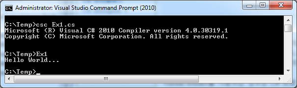

# 01 C# 소개

## 1. C# 탄생

### 1.1. 등장배경과 역사

#### 1) **창시자**

1. **MicroSoft**

2. **C#의 창시자, 앤더스 헤일즈버그 (Anders Hejlsberg)**

   - '아네르스 하일스베르' 라고도 합니다.

   - 1960년 덴마크 출신의 소프트웨어 공학자
   
   Microsoft에는 개발자들에게 존경 받는 몇 명의 인물로 C#을 개발했다.

**[ 개발 참여 한 프로젝트 ]**

* C# 
* TypeScript
* Visual J++  :  마이크로소프트사에서 제공한 자바 언어 개발 툴이다.

* 기타 : 이 외에도 Borland사 시절에 Turbo Pascal을 상업적으로 성공시키고, Delphi(델파이)도 디자인 했다.

> ---
>
> * **터보 파스칼** 
>   파스칼을 사용하는 컴파일러와 통합 개발 환경(IDE)을 포함한 개발 체계이다. 
>
> * **델파이** 
>   윈도우즈, 리눅스, iOS, 안드로이드에서 작동하는 프로그램 제작에 이용되는 통합 개발 환경(IDE)이자 언어이다. 
> * **Visual J++** 
>   MS에서 제공한 자바 언어 개발 툴이다. 사용자 인터페이스는 기존에 MS에서 제공한 개발자 환경과 동일하다. 출시된 지 얼마 지나지 않아 선 마이크로시스템에서 상표권 및 저작권 침해를 문제 삼아 현재는 판매되지 않고 있다.

---

#### 2) 프로그래밍 언어명

이름의 유래로는 두 가지가 있다.

1. 첫 번째, C++ ++라는 뜻이다. 
   ++++을 세로로 쌓으면 시각적으로 # 모양이 되기 때문이다.
   한때 해커들 사이에서 유행했었던 리트(은어)의 일종이다.

2. 두 번째, 음악에서 유래한 것으로, 도(C)에 반음(#)을 올린 것. 

   기본 글꼴이나 브라우저의 기술적인 한계와 키보드에는 올림표 기호(U+266F ♯ )가 포함되지 않기에 문서에서는 대체 기호로 해시 기호(U+0023 # )를 사용한다.

#### 3) 개발 스토리와 목적 ( 전략 )

##### (1) 개발 일화 

**[ Visual J++ 와 C# ]**

앤더스 헤일즈버그가 MS 입사 후 가장 처음 한 작업은 Visual J++ 개발이었습니다. 

1995년 Java가 나오고, MS에서도 썬 마이크로시스템즈와 라이센스를 맺은 뒤 독자적인 Java 확장 언어 비주얼 J++를 만들게 된다. 그런데 썬에서 개발한 JVM에 MS가 임의로 부가 기능을 추가하면서 썬과 특허권 소송을 열게 된다. 

소송 결과 MS의 Visual Studio에서는 비주얼 J 시리즈와 MS VM(MS 버추얼머신)을 사용할 수 없게 된다. 

이 일을 계기로 헤일즈버그는 자신들만의 플랫폼 구축의 필요성을 명확히 깨닫게 됩니다.
"우리는 우리의 플랫폼을 만들어야 하고, 이 플랫폼에서 우리의 혁신을 구축해야 한다는 것을..."

* C++ 언어에서 파생된 언어 라고 하지만 JAVA에서 많은 영향을 받았다.
  ( 그래서 C++의 계승보다 MS버전의 JAVA로 보는 시각도 많다. )
* C#은 .NET 이라는 독자적인 플랫을 가지고 간다.
* C#은 C++과 JAVA 양쪽에 비슷한 문법을 가지고 있다.
  * C++ : 1983년

  * JAVA : 1995년

  * Visual J++ : 1996년
  * C# : (발표) 2000년, (출시) 2002년

> ---
>
> [ C, C++ ]
>
> 미시적인 것을 만드는 것이 특화 되어 있다. 
> 거시적인 부분 ( 추상적인 부분 )을 다루기에는 복잡하다. 
>
> ( JAVA 같은 객체지향언어가 이런 거시적인 부분( 추상적인 부분 )을 해결해 줄 수 있는 언어였다. )
>
> ---

##### (2) 목적과 전략

* C#과 .NET 프레임워크을 함께하는 전략을 사용한다.
* 닷넷 프레임워크은 응용 프로그램 개발 환경으로 프로세서 가상 머신에 속한다.
  * 닷넷 프레임워크 기반으로 만들어 진 응용 프로그램은 반드시 닷넷 프레임워크가 미리 설치되어 있어야 한다. 
  * 윈도우즈 개발을 위해서는 .NET 프레임워크가 필요 했으며, MS는 이점을 이용하여 개발자로 하여금 C#을 사용하게 유도했다.

* (최근) 윈도우 10버전(Windows 10 May 2019 Update) 부터는 닷넷 프레임워크 4.8이 기본적으로 탑재돼 있다.
  * 윈도우 11과 윈도우 서버 2022에도 설치되어 있다.

### 1.2. 개발 업데이트

#### 1) 개발 기업 및 주체

MS ( 마이크로소프트 )

* [참고] C#은 닷넷 플랫폼과 함께하는 생태계다.

#### 2) 과거와 현재 반응

.NET과 C#이 출시 되다.  [ 2002년 1월 ]

NET 버젼 1.0으로 처음 소개되면서 .NET은 3581개의 .NET 타입(class, struct, interface, enum 등) 을 갖고 있었다. 
( 현재의 .NET은 수만개의 .NET 타입들을 갖고 있다. )

그 시기에 다수의 개발자들은 C++ 혹은 VB 를 자신의 개발 언어로 여겼으며, 더 많은 Win32 API와 복잡한 COM 기술을 이해하는데 많은 시간을 할애했다.

새로운 언어로 C#이 등장했을 때, 개발자들은 비난과 거부감을 드러내었다. 
가장 대표적인 것이 C#으로 개발하면 프로그램이 엄청 느려져서 실무에서는 거의 사용할 수 없다(?)는 것이었을 것이다.

C++ 개발팀은 C#에 대항하여 새로운 .NET 프레임워크을 껴안는 전략을 구사였고 Managed C++를 내놓게 된다.
VB 개발팀도 자신의 클래식 VB 언어를 단절하면서 VB.NET이라는 전혀 새로운(?) 언어를 내놓게 된다.
현재 Managed C++는 외면 받고 있으며, 보다 적은 개발자들이 VB.NET을 사용하고 있다.

대부분의 .NET 실무 프로젝트는 C#으로 진행되었으며, 누구도 C#이 느려서 쓸 수 없다고 말하지 않게 되었다.

#### 3) 업데이트 - 현황 및 방향

C# 2.0 까지는 ECMA 및 [ISO](https://namu.wiki/w/ISO) 두 곳 모두에 표준이 등재되어 있으나, 이후 버전은 C# 5.0만이 ECMA 표준이 등재되어 있다.

| C# 버전 | .NET 버전                                                    | Visual Studio                             | 출시일      | 표준                                                         | 변경 사항                                                    |
| ------- | ------------------------------------------------------------ | ----------------------------------------- | ----------- | ------------------------------------------------------------ | ------------------------------------------------------------ |
| C# 1.0  | .NET Framework 1.0                                           | Visual  Studio .NET 2002                  | 2002년 1월  | [ECMA-334](https://www.ecma-international.org/publications/files/ECMA-ST/ECMA-334.pdf) | [링크 1.0](https://docs.microsoft.com/ko-kr/dotnet/csharp/whats-new/csharp-version-history#c-version-10) |
| C# 1.1  | .NET Framework 1.1                                           | Visual  Studio .NET 2003                  | 2003년 4월  | [ECMA-334](https://www.ecma-international.org/publications/files/ECMA-ST/ECMA-334.pdf) | [링크 1.2](https://learn.microsoft.com/ko-kr/dotnet/csharp/whats-new/csharp-version-history#c-version-12) |
| C# 2.0  | .NET Framework 2.0                                           | Visual  Studio 2005                       | 2005년 11월 | [ECMA-334](https://www.ecma-international.org/publications/files/ECMA-ST/ECMA-334.pdf) | [링크 2.0](https://learn.microsoft.com/ko-kr/dotnet/csharp/whats-new/csharp-version-history#c-version-20) |
| C# 3.0  | .NET  Framework 3.5                                          | Visual  Studio 2008                       | 2007년 11월 | -                                                            | [링크 3.0](https://learn.microsoft.com/ko-kr/dotnet/csharp/whats-new/csharp-version-history#c-version-30) |
| C# 4.0  | .NET Framework 4.0                                           | Visual  Studio 2010                       | 2010년 4월  | -                                                            | [링크 4.0](https://learn.microsoft.com/ko-kr/dotnet/csharp/whats-new/csharp-version-history#c-version-40) |
| C# 5.0  | .NET Framework 4.5                                           | Visual  Studio 2012                       | 2012년 8월  | [ECMA-334](https://www.ecma-international.org/publications/files/ECMA-ST/ECMA-334.pdf) | [링크 5.0](https://learn.microsoft.com/ko-kr/dotnet/csharp/whats-new/csharp-version-history#c-version-50) |
| C# 6.0  | .NET Framework 4.6        .NET Core 1.0        .NET Core 1.1 | Visual  Studio 2015                       | 2015년 7월  | -                                                            | [링크 6.0](https://learn.microsoft.com/ko-kr/dotnet/csharp/whats-new/csharp-version-history#c-version-60) |
| C# 7.0  | .NET Framework 4.6.2                                         | Visual  Studio 2017 v15.0                 | 2017년 3월  | -                                                            | [링크 7.0](https://learn.microsoft.com/ko-kr/dotnet/csharp/whats-new/csharp-version-history#c-version-70) |
| C# 7.1  | .NET Framework 4.7        .NET Core 2.0                 | Visual  Studio 2017 v15.3                 | 2017년 8월  | -                                                            | [링크 7.1](https://learn.microsoft.com/ko-kr/dotnet/csharp/whats-new/csharp-version-history#c-version-71) |
| C# 7.2  | .NET Framework 4.7.1                                         | Visual  Studio 2017 v15.5                 | 2017년 11월 | -                                                            | [링크 7.2](https://learn.microsoft.com/ko-kr/dotnet/csharp/whats-new/csharp-version-history#c-version-72) |
| C# 7.3  | .NET Framework  4.7.2        .NET Core 2.1        .NET Core 2.2 | Visual  Studio 2017 v15.7                 | 2018년 5월  | -                                                            | [링크 7.3](https://learn.microsoft.com/ko-kr/dotnet/csharp/whats-new/csharp-version-history#c-version-73) |
| C# 8.0  | .NET  Framework 4.8        .NET Core 3.0                | Visual  Studio 2019 v16.3 + .NET Core 3.0 | 2019년 9월  | -                                                            | [링크 8.0](https://learn.microsoft.com/ko-kr/dotnet/csharp/whats-new/csharp-version-history#c-version-80) |
| C# 9.0  | .NET  5.0                                                    | Visual  Studio 2019 v16.9                 | 2021년 4월  | -                                                            | [링크 9.0](https://learn.microsoft.com/ko-kr/dotnet/csharp/whats-new/csharp-version-history#c-version-9) |
| C# 10.0 | .NET  6.0                                                    | Visual  Studio 2022                       | 2021년 11월 | -                                                            | [링크 10.0](https://learn.microsoft.com/ko-kr/dotnet/csharp/whats-new/csharp-version-history#c-version-10) |
| C# 11.0 | .NET  7.0                                                    | Visual  Studio 2022 v17.4                 | 2022년 11월 | -                                                            | [링크 11.0](https://learn.microsoft.com/ko-kr/dotnet/csharp/whats-new/csharp-version-history#c-version-11) |

## 2. 특징 및 비교

### 2.1. 언어적 공통 특징 - 5가지

---

1. ~~Low Level~~  /  **High Level**
2. ~~Compiler  /~~  **JIT**  ~~/  interpreter~~ 
3. **Strong**  ~~/  Weak~~
4. **Managed**  /  UnManaged
5. ~~Procedural /~~ **OOP** ~~/ functional~~

---

 

 

**[ 1. High Level ]**

고수준 언어로 여기서 저수준과 고수준 언어의 차이는 얼마나 인간 친화적인 언어에 가까운가에 있다.

C#은 C,C++보다는 좀 더 고수준 언어로 평가된다.

 

 

**[ 2. JIT  ( 동적 번역 ) 컴파일 ]**

* **Just-in-time compilation** / **dynamic translation** or **run-time compilations**

컴파일 언어와 인터프리터 언어의 하이브리드 중간 형태라고 보면 된다.

JAVA 번역기와 유사하다. 
( 동시에 CLI를 지켜야 된다는 특징을 가진다.  )

---

* **VM 종속 / 번역기**

  두 번의 과정을 거친다.

  1. 컴파일

  2.  JIT 컴파일 or AOT 컴파일 

* **중간코드** : 실행 파일 전 단계에 **중간 코드**를 사용한다.
  
* **호환성 및 범용성**

  JAVA와 유사한 닷넷 플랫폼에 종속되기 때문에 호환성과 범용성에 자유로울 수 밖에 없다.

  최근에는 C#의 지원범위가 점점 늘어 리눅스와 임베디드 분야까지 섭렵 가능한 언어가 되었다. 

 

 

**[ 3. Strong Typed ( Static typed ) ]**

유형이 얼마나 엄격하게 구별되는지 에 관한 것입니다. 

변수형을 선언 후 변수형 변경이 불가능 하다. ( 엄격하게 구분한다. )

* 상용 코드를 작성할 때는 강한 타입 언어들이 일반적으로 더 낫다.
  ( 컴파일 등을 활용해서 실수를 바로 잡기 편하다. )

* [주의!] C#은 약한 타입도 지원하긴 한다.

* **Static type ( 정적 타입 )**

  타이핑은 type 정보가 수집되는 시점 (컴파일 타임 또는 런타임)에 관한 것입니다 .

  정적타입 언어는 컴파일 시 변수의 ‘타입’이 결정됩니다.

  

 

**[ 4. Managed Language ]** 

메모리 관리(할당, 반환)를 언어 상에서 알아서 해주기 때문에 편하게 코드를 작성할 수 있다.

컴퓨터의 깊은 구조를 몰라도 개발을 쉽게 할 수 있는 언어이다.

( 반대로 메모리 관리를 직접 해야 하는 Unmanaged Language : C, C++ 언어들이 있다. )

 

 

**[ 5. OOP ]**

객체 지향 프로그래밍은 컴퓨터 프로그램을 명령어의 목록으로 보는 시각에서 벗어나 여러 개의 독립된 단위, 즉 "객체"들의 모임으로 파악하고자 하는 것이다. 각각의 객체는 메시지를 주고받고, 데이터를 처리할 수 있다.

객체 지향 프로그래밍은 프로그램을 유연하고 변경이 쉽게 만들기 때문에 대규모 소프트웨어 개발에 많이 사용된다. 또한 프로그래밍을 더 배우기 쉽게 하고 소프트웨어 개발과 보수를 간편하게 하며, 보다 직관적인 코드 분석을 가능하게 하는 장점이 있다. 

그러나 지나친 프로그램의 객체화 경향은 실제 세계의 모습을 그대로 반영하지 못한다는 비판을 받기도 한다.

 

 

**[기타] 문법**

C#의 기본 문법은 C, C++, 자바 등 C 스타일 언어와 유사하다.

* 세미콜론이 선언문의 끝을 나타낸다.
* 중괄호로 선언문을 묶는다. 
  보통 선언문은 메소드(함수)로, 메소드는 클래스로, 클래스는 네임스페이스로 묶인다.
* 변수에 등호를 사용해서 값을 대입하고, 두 개의 등호("==")를 사용해 비교한다.
* 대괄호는 배열의 선언 및 인덱스 접근 모두에 사용된다.

### 2.2. 차별점 비교 ( 고유의 특징 )

#### 1) .NET 플랫폼

C#은 **.NET 플랫폼**의 한 부분인 것이다.

C#은 Language가 있고, .NET Platform을 활용한다.
Java라는 Language가 있고,  JAVA Platform을 활용한다. ( JAVA는 언어와 플랫폼 이름이 유사하다. )

그렇기 때문에 C#은 .NET 플랫폼에 최적화 된 언어이다. 

이 닷넷 프레임워크는 무수히 많은 클래스 라이브러리들로 구성되어 있으며, 이 클래스들을 적절히 사용하는 것이 C# 프로그래밍에 있어 큰 비중을 차지한다.

NET Framework 4.0 버전만 하더라도 10,000개가 넘는 클래스 라이브러리들로 구성되어 있지만 이 많은 클래스를 모두 외우는 사람은 없다. 그래도 <u>C# 프로그래밍을 하면서 자주 사용되는 중요 클래스들을 함께 익히는 것이 유용하다.</u>

다행히 잘 정리된 MSDN과 인텔리센스 기능이 있어 잘 활용하는 것이 좋다.

#### 2) C# 고유한 특징

**간결성**

* 간결성을 추구한다. 
*  JAVA와 비교해도 그 간결성이 더하다. 
* 이것도 되고 저것도 되는 방식을 허용하지 않고, 하나만 허용되게 만들었다.
  * 100 사람이 만들어도 한 사람이 만든 것 처럼 만들게 했다.

**다양한 기능**

* 새로운 변화를 추구하며 다양한 업데이트를 진행한다.
* '제네릭'과 'LINQ' 같은 편리한 기능을 제공한다.

**호환성** 

* 100% 하위 호환성을 지킨다.
* C# 1.0부터 8.0까지 낮은 버전에서 지원하던 기능이 높은 버전으로 올라가면서 없어진 것이 단 하나도 없다.

**기타**

* **키워드** : 현존하는 언어 중에서 문법적으로 키워드가 많은 언어에 속한다. 

* **C/C++ 특징** : 예외적으로 포인터도 쓸 수 있고, 주소도 사용 가능하다.

#### 3) [보류] C# 비교 - 나중에 확인할 예정

* C#은 C나 자바스크립트와 달리 전역 함수나 변수가 없고, 모두 클래스 안에서 생성됩니다.
  ( 클래스를 통해 전역함수, 변수 대용으로 사용된다. )

##### (1) C# vs JAVA

* **언어와 플랫폼**

  * C#은 Language가 있고, .NET Platform을 활용한다.

  * Java라는 Language가 있고,  JAVA Platform을 활용한다. ( 언어와 플랫폼 이름이 유사하다. )

* **가상머신의 기능**

  * C# 언어는 빌드 후 IL(Intermediate Language, 중간 언어)로 변환되며, CLR(Common Language Runtime, 공통 언어 런타임)에서 실행된다.

  * JAVA 언어는 빌드 후 바이트코드(Bytecode)로 변환되며, JVM(Java Virtual Machine, 자바 가상 머신)에서 실행 된다.

C#을 통하여 다룰 수 있는 .NET 플랫폼의 기술들 조차 자바를 염두에 둔 것이 많아서 자바와 가장 많이 비교된다. 

하지만 C#은 자바와 달리 Unsafe Code와 같은 기술 등을 통하여 플랫폼 간 상호 운용성에 상당히 많은 노력을 기울이고 있다. 

C#의 기본 자료형은 닷넷의 객체 모델을 따르고, 런타임 차원에서 Garbage Collection이 되며 클래스, 인터페이스, 위임, 예외와 같이 객체 지향 언어로서 가져야 할 모든 요소들이 포함되어 있다.

**[ 검증 필요한 논쟁 ]** 

* JAVA와 비교 할 때 C#이 비슷한 코드에서 평균적으로 10~20% 정도 더 빠르다.
  ( C/C++보다는 당연히 느리다. 이는 가상머신 언어의 태생적인 한계점이라고 할 수 있다. )

  ( 그 반대의 결과도 많이 나온다. 나무위키는 C#이 우세하다고 하지만 구글링 결과는 또 JAVA가 우세한 경우도 많다.)

* NET 7에서 실행 속도를 개선하기 위해 아예 네이티브 코드로 컴파일시키는 .NET Native AOT가 나왔다.

##### (2) C# vs C++

* 동작 속도 : C++ >>> C#

* 개발 속도 : C# >> C++

---

나중에 참고해서 추가 할 부분들이다.

* [참고] [유니티 시작하기 전 알아둬야 하는 C# 특징 (faet. C++과 C#의 차이)](https://www.youtube.com/watch?v=dC1JdPDZRr0)
  [참고] [[OOP\] C++과 C#의 차이(데이터, 메모리)](https://velog.io/@cedongne/OOP-C과-C의-차이데이터-메모리)

- [참고] [C++과 C#의 차이점 - 위키백과](https://ko.wikipedia.org/wiki/C_%EC%83%A4%ED%94%84#C++%EA%B3%BC_C#%EC%9D%98_%EC%B0%A8%EC%9D%B4%EC%A0%90)

- [참고] 기타 자료

  - https://blog.wishket.com/c-vs-c-%EB%82%B4-%EA%B0%9C%EB%B0%9C-%ED%94%84%EB%A1%9C%EC%A0%9D%ED%8A%B8%EC%97%90-%EC%95%8C%EB%A7%9E%EC%9D%80-%EC%96%B8%EC%96%B4-c-vs-c/
  - https://m.blog.naver.com/PostView.naver?isHttpsRedirect=true&blogId=io044&logNo=220070411535
  - https://m.blog.naver.com/ridesafe/222017882422

  

---

**( 읽어보고 정리하기 )**

이 둘의 차이점은 C++와 C# 모두 객체 지향 언어이지만, C#은 모든 것을 객체로 취급하기 때문에 컴포넌트 지향 프로그래밍 언어라고도 한다는 것입니다.

컴포넌트(Component)란 프로그래밍에서 재사용이 가능한 각각의 구성 요소, 즉, 독립된 모듈을 뜻합니다. 컴포넌트 기반 프로그래밍에서는 레고 블록과 같이 이미 만들어진 컴포넌트들을 조합하여 화면을 구성할 수 있습니다.

다시 차이점으로 돌아가 보면, 객체 지향 프로그래밍은 큰 바이너리 실행 파일로 결합된 ‘클래스 간의 연관성’에 초점을 맞추지만, 컴포넌트 지향 프로그래밍은 자체적으로 작동하는 ‘교환 가능한 코드 모듈’을 사용한다는 점에서 다릅니다. 또한, 사용자는 이러한 코드 모듈을 사용하기 위해 내부 작업(세부 사항)을 알 필요가 없습니다!

그 밖에도 다음과 같은 차이점이 있습니다.

C++는 본래 유닉스 기반 시스템을 위해 설계되었지만 모든 플랫폼에서 사용할 수 있습니다. 반면, C#은 표준화되었지만, Windows 환경 이외에서는 거의 사용되지 않습니다. (닷넷은 Windows에서만 설치가 가능해 다른 운영체제는 사용 불가하기 때문)

C++는 컴파일되어 기계 코드로 직접 변환됩니다. 하지만 C#은 중간 언어, 즉, ASP.NET에서 해석되는 CLR(공용 언어 런타임)로 컴파일됩니다.

C++에서는 메모리를 수동으로 처리해야 하는 반면, C#은 메모리 관리를 자동으로 처리할 수 있는 가상 시스템에서 실행됩니다.

C#과 달리, C++는 포인터를 사용할 수 있습니다.

[참고] [C 언어, C++, C#의 차이점 이해하기 | 개발직군 채용](https://www.elancer.co.kr/blog/view?seq=52)

---

### 2.3. 장단점 

#### 1) 장점

( 나중에 입력 - 중급개발자 기준 )

1. 생산성이 뛰어납니다.
2. 사소한 실수를 엄격한 문법에서 막아줍니다.
3. 메모리 관리가 수월합니다.

#### 2) 단점

( 나중에 입력 - 중급개발자 기준 )

1. 윈도우 위주로 사용이 가능합니다.
2. C와 C++에 비해 속도가 느립니다.
3. 현존하는 언어 중에서 문법적으로 키워드가 많은 언어에 속한다. 

### 2.4. 실무 : 주 사용처 

(점유율 지역) 미국이나 유럽에서 많이 사용되고 있다.

- 한국에서는 기타 여러 사유로 인해 게임 이외에는 점유율이 적은 편이다.

#### 1) 사용 중인 분야 ( O )

* **모바일, PC 게임**

  * **Unity** - [참고] Unity 엔진의 지원 언어 - 원래 3가지
    * Boo
    * JavaScript 기반의 UnityScript
    * **C# ★**
      * C#을 사용하는 Unity 사용자들이 증가
        * 2017년 8월 기준, 모든 Unity 프로젝트의 85.4%가 C#만 사용
        * 그 결과 2018년 버전부터 C#만 단독 지원

  

* **윈도우 애플리케이션**
  기업용 애플리케이션 많이 생산한다.

  

* **웹 애플리케이션**

  * ASP.NET MVC
  * .NET Core

  ex) stackoverflow

  

* 모바일 애플리케이션

  * Xamaring - 개발은 가능하다.

* 그 외 다수

#### 2) 사용하기 어려운 분야 ( X )

**윈도우 애플리케이션, 웹 애플리케이션, 게임 엔진** 이 세 분야를 제외한 다른 분야에서는 매우 저조한 점유율을 가지고 있다.

모바일 애플리케이션 개발도 괜찮은 환경이 제공된다고는 하지만 아직까지는 비주류로 그리 많은 개발이 이루어지지는 않고 있다. 
( 실험적인 수준에 그치고 있으며, 다른 개발자를 유입 시키기 위한 큰 메리트가 없는 듯 하다. )

### 2.5. 입문 언어 - 추천

* **입문자에게 최적화 된 상위 언어**
  * 간결함 : 덕지덕지 발전한 느낌이 없고, 깔끔 및 간결하다.
  * 실수 방지 : 다른 언어에 비해 사용자가 실수를 줄일 수 있다.
  * 개발 환경 : 아주 뛰어난 개발 환경을 가지고 있다.
  * 문서화 : 아주아주 뛰어난 설명서(documentation)를 가지고 있음 
    * C# 만큼 문서화 잘 된 언어가 없다. ( MS에서 실제로 전문 기술 문서 작성자를 고용 )
    * Microsoft C# Guide : https://learn.microsoft.com/ko-kr/dotnet/csharp/
  * 완성도 : 언어의 완성도도 현존하는 언어 중 괜찮다는 평이 많다.
  * 미래상 제시 : 타 프로그래밍 언어의 미래상을 제공하는 언어
    * 신개념을 들여오면서 실무자들이 최대한 실수를 줄일 수 있게 고안해 오는 경우가 많다.
      * ex) async, await 등
    * 아키텍트(설계자) 비전 등이 괜찮다.
* **프레임워크의 강력함**
  * [ 수업 ] .NET Core - 사용
    * .NET Core는 윈도우, 리눅스, 맥 등에서 모두 실행 가능
    * .NET 프레임워크(OLD) vs NET Core(NEW)
      * NET Core로 넘어가는 분위기
        ( 모든 것이 .NET Core로 바뀌어 가는 중 )
    * 혹시 나중에 .NET 프레임워크를 사용할 일이 있으면 그냥 사용하면 됨.
      ( .NET Core와 거의 똑같음! )
* **[주의!] 개체지향(OOP, Object-Oriented Programming) 언어**
  * 입문자가 이해하기에는 난이도가 높다.

## 3. 환경 설정

**Microsoft Visual C#**

Microsoft가 C#에 대하여 내리는 모든 표준 정의를 가장 정확하고 안정적으로 반영하는 컴파일러이다. 최근에는 C# 3.0에 포함될 LINQ 확장과 같은 부분에 대한 기술적인 레퍼런스를 미리 테스트해볼 수 있는 도구로도 자주 쓰인다.

### 3.1. 설치하기

C# 컴파일러는 .NET SDK 또는 Visual Studio를 설치하면 함께 설치된다.

* Visual Studio 설치 : 설치 옵션에서 닷넷( .NET 데스크톱 개발 등 )과 관련 된 사항들을 설치하면 된다.

* Framework 버전 설정
  * [ Project ] - [ 프로젝트명 Properties ] - [ Target framework ] 버전 설정하기

#### 1) 직접 설치

##### (1) 윈도우 ( Windows )

##### (2) 맥 ( Mac )

##### (3) 리눅스 ( Linux )

[주의!] 동일한 버전의 .NET 환경 설치하기 ( 버전이 조금이라도 높거나 낮아도 실행 불가! )

* https://learn.microsoft.com/ko-kr/dotnet/core/install/linux-ubuntu-2204

* 명령어

  * 빌드 : dotnet build

  * 실행 : dotnet 파일명.dll

    ( 윈도우 외의 환경이라면 DLL 파일을 실행 파일로 생성합니다. )

#### 2) 온라인 환경

* [repliet](https://replit.com/new/csharp)

### 3.2. 실행하기

#### [ IDE ]

**Visual Studio**

* isual Studio를 사용하는 경우 C# 프로젝트를 빌드하여 '실행파일'을 생성한다.

#### [ 인터렉티브 C# ]

C# 인터렉티브(interactive) 대화형은 한 줄 씩 코드를 실행하면서 C#의 여러 명령을 학습하거나 테스트 할 수 있는 도구입니다.
간단한 코드는 C# 인터렉티브를 사용해 보는 것이 좋습니다.

1. 비주얼 스튜디오 검색창 'C# Interactive' 검색 실행
   ( 한글 : C# 대화형 ) 
2. Console.WriteLine("Hello World!");를 입력 실행
3. System 네임스페이스는 생략 가능합니다. 

* [참고] 특정 코드를 블록 선택한 수 `Ctrl + E`를 두 번 누르면 자동으로 C# 인터렉티브 창에 소스 코드가 표시됩니다.
  ( 주의! 한글은 제대로 표시되지 않을 수 있습니다. )

##### - 단축어 모음

* #help : 도움말을 볼 수 있습니다.

* #cls : 화면을 지운 후 필요한 명령을 수행합니다.

* #clear : 화면을 지운 후 필요한 명령을 수행합니다.

#### [ 터미널 ]

*  Visual Studio 없이 .NET Framework에서 제공되는 C# 컴파일러인 [csc.exe](http://msdn.microsoft.com/ko-kr/library/78f4aasd.aspx)를 이용하여 실행파일을 생성할 수 있다.

1. 소스코드 주소 복사 ( Ctrl + C )
2. `cd 주소명` 입력 ( 마우스 오른쪽 버튼 - 클릭 )
3. `csc <파일명> <인자_값> ...` 입력 - 실행

### 3.3. 기타 툴

( 미정리 ) 

**Mono**

마이크로소프트 닷넷 플랫폼에 대한 구현이 시작될 무렵에 시작되었으며, 현재는 제3자 닷넷 플랫폼 중에서 가장 안정적이고 성숙되었다고 평가되는 프로젝트이다. 마이크로소프트 닷넷 플랫폼이 윈도우와 소수의 유닉스 플랫폼을 대상으로 하고 있는 것과는 달리 모노 플랫폼의 경우 윈도우보다는 리눅스, 유닉스, 맥 OS X, 솔라리스와 같이 윈도우 외의 운영 체제와 플랫폼을 대상으로 한다. 

초기에는 지미안이 호스팅했으나 현재는 노벨에서 호스팅하고 있다. 모노 플랫폼을 기반으로 GTK#, 모질라 임베딩, IKVM(Java 바이트 코드를 모노 플랫폼 위에서 에뮬레이션하여 실행하는 VM), COCOA#, Nemerle 언어, MonoDevelop IDE 등의 기술을 지원한다. 

또한 마이크로소프트 닷넷 플랫폼과 서로 호환이 가능하다. 현재는 리눅스 배포판들 사이에서 공식적으로 채택되고 있을 정도로 리눅스 환경에서는 대중적인 닷넷 플랫폼 구현이 되었다.

---

윈도우 이외의 운영체제에서도 C# 사용이 가능하도록 모노라는 프로젝트가 진행 중이다. 아직 그다지 완전하다고 볼 수는 없다. MonoDevelop/Xamarin Studio IDE가 제공되어, 개발도 다른 플랫폼에서 할 수는 있지만 Visual Studio만큼의 편의성을 제공하지는 못한다.

MS는 오랫동안 오픈 소스 진영에 배타적인 태도를 보여 왔고, 닷넷에 공개되지 않은 뭔가, 또는 MS에 특허가 있는 것을 넣어서 MS가 만들지 않은 프레임워크는 대부분의 기존 프로그램(.NET 프레임워크용으로 만든)이 잘 안 돌아가는 무용지물이 되거나, 나중에 특허 소송으로 프로젝트를 아예 개발살낼 가능성을 완전히 배제할 수 없었다. 이 때문에 리처드 스톨먼 등 여러 사람이 'C#과 모노를 써서는 안 된다'고 한 적도 있다. 결국 MS는 2006년 커뮤니티 공약이라는 것을 발표하면서 ECMA 표준에 의한 구현에 대해서는 특허권을 주장하지 않기로 하였다.

하지만, 얼마 지나지 않아 모노의 주 구성 요소 대부분이 저 커뮤니티 공약의 적용 범위에 포함되지 않기 때문에 모노가 아직도 언제든지 특허 소송을 통해 개발살날 수 있다는 것이 밝혀져 모노 위험 요소설이 다시 부상하였다.

그러나 2010년대 이래 MS는 친(親) 오픈 소스적인 행보를 보여, 2014년엔 닷넷을 오픈 소스로 공개하였으며, MS가 모노 프로젝트의 주요 메인테이너인 Xamarin을 인수하면서 이러한 우려는 종식되었다. 그후 MS가 Xamarin 인수 이후 사실상 프로젝트 자체가 MS로 넘어갔다. Git 기여자를 보면 Microsoft 개발자가 대다수다. 2015년 4월 29일에 배포된 Mono 4.0 버전에서는 아예 닷넷의 오픈소스 플랫폼인 .NET Core가 적용되었다.

2017년 5월에 Visual Studio의 macOS 버전이 공개되어서, macOS에서도 정식으로 C# 개발을 할 수 있게 되었다.

---

**Rider**

JetBrains사의 유료 IDE이다. Java용 IDE로 유명한 IntelliJ IDEA를 베이스로 하고 있어 리눅스를 포함한 크로스플랫폼이 지원되고 완성도가 높으며, MonoDevelop보다 훨씬 뛰어난 코드 컴플리션 및 리팩토링 기능을 제공한한다. 또한 유니티 엔진과도 연동도 뛰어나다고 한다.

.NET에 대응. ReSharper의 언어엔진을 사용하는 IntelliJ 기반 IDE. C#을 스크립트 언어로 사용하는 유니티 엔진을 공식 지원하며, C++을 사용하는 언리얼 엔진 역시 지원한다.

( .NET용 IDE이기 때문에, VS용 ReSharper C++을 개조해 Rider에 붙여서 사용한다. CLion 대신 Rider로 지원하는 이유는 게임 개발자들이 언리얼와 유니티 양쪽 모두 사용하는 경우가 많아, 이미 유니티를 지원하는 Rider에 ReSharper C++을 붙였다고 한다. )

## 참고

* [C# 스토리](https://www.csharpstudy.com/Story)
* [C# - 위키백과](https://ko.wikipedia.org/wiki/C_%EC%83%A4%ED%94%84)
* [C# - 나무위키](https://namu.wiki/w/C%23)

