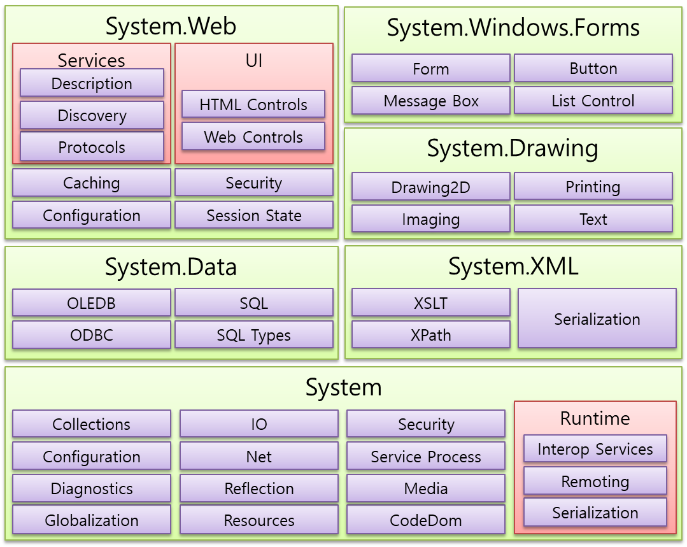

# 02  .NET 플랫폼과 C#

## 1. .NET 이란?

* **.NET은 무엇인가?**
  * .NET은 다양한 유형의 애플리케이션을 빌드 하기 위한 <u>오픈 소스 개발자 플랫폼</u>입니다.

* **.NET의 장점 3가지는 무엇인가?**
  * 무료 오픈 소스
  * 여러 언어 지원
  * 크로스 플랫폼 환경

* **.NET은 크게 3가지로 나누시오.**
  * FCL
  * CLR
  * 기타

* **FCL은 무엇인가?** 
  * ASP.NET, WinForms, XML 스택, ADO.NET 등 <u>전체를 포함하는 더 넓은 의미의 라이브러리</u>이다.

* **FCL은 어디에서 사용 가능한가?**

  * 모든 CLR 기반 언어에서 사용할 수 있습니다.

  * [참고] 이러한 클래스는 보통 C#으로 작성되었다.

* **BCL은 무엇인가?**

  * **기본 클래스 라이브러리**이다.

  * System.*(및 제한된 범위 Microsoft.*) 네임스페이스를 구성하는 라이브러리 집합입니다. 

* **FCL과 BCL의 관계는 어떻게 되는가?**
  * BCL은 상위 수준 애플리케이션 프레임워크의 <u>기반이 되는 하위 수준의 범용 프레임워크</u>입니다.
  * FCL의 하위 개념으로 FCL에 BCL이 포함되어 있다고 말할 수 있다.

* **[참고] 클래스 라이브러리 학습**

  * 이 닷넷은 무수히 많은 <u>클래스 라이브러리</u>들로 구성되어 있으며, 이 클래스들을 적절히 사용하는 것이 C# 프로그래밍에 있어 큰 비중을 차지한다.

    NET Framework 4.0 버전만 하더라도 10,000개가 넘는 클래스 라이브러리들로 구성되어 있지만 이 많은 클래스를 모두 외우는 사람은 없다. 
    그래도 <u>C# 프로그래밍을 하면서 자주 사용되는 중요 클래스들을 함께 익히는 것이 유용하다.</u>

    다행히 잘 정리된 MSDN과 인텔리센스 기능이 있어 잘 활용하는 것이 좋다.

* **[참고] BCL 공부**
  * 거의 모든 프로그램에서 BCL를 사용할 수 있다.
  * BCL에는 윈도우 개발자가 필요로 하는 많은 기능이 구현돼 있고 틈틈이 BCL을 공부해 둘 필요가 있다. 
  * 새로운 버전의 닷넷이 출시될 때마다 BCL의 영역은 점점 더 커진다.
    * 배울 내용도 많아지지만 개발자가 작성해야 할 코드의 규모는 더 줄어드는 것이다.

* **CLR은 무엇인가?**
  * 런타임 엔진으로 닷넷의 모든 소프트웨어를 돌리는 엔진 역할을 한다. 
  * JAVA의 가상머신과 유사한 역할을 하고 있다.

* **CLR은 어디에 설치 되는가?**
  * CLR은 .NET과 함께 OS위에 설치 된다.

* **[참고] 닷넷 구성요소로 FCL, BCL 이외에 기타는 무엇이 있는가?**
  * 부가적인 실행 파일 : 마이크로소프트는 닷넷에 <u>기본적으로 C#, VB.NET 컴파일러</u>를 제공하고 있으며 <u>그 밖에도 각종 유틸리티 성격의 실행 파일</u>을 포함 시켜 두었다.
  * GAC(Global Assembly Cache) : GAC는 컴퓨터에 실행되는 <u>닷넷 응용 프로그램이 어셈블리 파일을 공통적으로 찾을 수 있는 전역 저장소</u>다. 일반적으로 `assembly` 폴더에 위치하고 각종 `DLL` 파일을 담고 있다.  ( .NET Framework 4부터 전역 어셈블리 캐시의 기본 위치는 **%windir%\Microsoft.NET\assembly**입니다. .NET Framework의 이전 버전에서 기본 위치는 **%windir%\assembly**입니다. )

* **무엇인가?**

* **무엇인가?**

* **무엇인가?**

* **무엇인가?**

* **무엇인가?**

* **무엇인가?**

* **무엇인가?**

* **무엇인가?**

* **무엇인가?**

