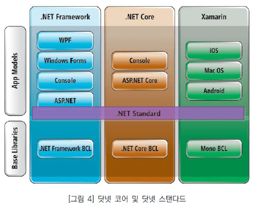

# 02  .NET 플랫폼과 C#

## 1. .NET 이란?

### 1.1. .NET 이란?

.NET은 다양한 유형의 애플리케이션을 빌드 하기 위한 <u>오픈 소스 개발자 플랫폼</u>입니다.

* 무료, 오픈 소스, 크로스플랫폼 개발 환경
* 여러 언어 제공 : **<u>C#</u>**, Visual Basic, F#
  *  여러 프로그래밍 언어를 지원하도록 설계되었습니다.
* 런타임 엔진 ( 여러 명령어 집합 )
* 웹, 데스크톱, 모바일, 게임, IOT, 클라우드 등 모든 영역의 개발 환경 제공

---

* 닷넷 응용 프로그램은 기존의 모든 윈도우 응용 프로그램에 대응해서 만들 수 있다.
  * ASP => ASP.NET
  * Win32 Console => Console
  * Win32 Windows, MFC => Windows Forms, WPF
  * 등이 있다.

* **<u>닷넷은 크게 FCL과 CLR, 기타 영역으로 나눌 수 있다.</u>**

#### 1) FCL 

* **FCL ( Framework Class Library )** 
  * **.NET Framework Class Library** ( MS 공식 사이트에서는 이렇게 표기 되어있다. )
  * **.NET Framework**

---

ASP.NET, WinForms, XML 스택, ADO.NET 등 전체를 포함하는 더 넓은 의미의 라이브러리입니다. 
이러한 클래스는 보통 C#으로 작성되었지만 모든 CLR 기반 언어에서 사용할 수 있습니다.

##### (1) **BCL(Basic Class Library)**

**기본 클래스 라이브러리**이다.

* System.*(및 제한된 범위 Microsoft.*) 네임스페이스를 구성하는 라이브러리 집합입니다. 

* BCL은 ASP.NET Core 같은 상위 수준 애플리케이션 프레임워크의 기반이 되는 하위 수준의 범용 프레임워크입니다.

  * FCL의 하위 개념으로 FCL에 BCL이 포함되어 있다고 말할 수 있다.
  * `System.String`, `System.DateTime` 등이 있다.

  * 아래의 그림은 BCL의 일부 단면이다.

##### (2) 클래스 라이브러리 학습

이 닷넷은 무수히 많은 <u>클래스 라이브러리</u>들로 구성되어 있으며, 이 클래스들을 적절히 사용하는 것이 C# 프로그래밍에 있어 큰 비중을 차지한다.

NET Framework 4.0 버전만 하더라도 10,000개가 넘는 클래스 라이브러리들로 구성되어 있지만 이 많은 클래스를 모두 외우는 사람은 없다. 
그래도 <u>C# 프로그래밍을 하면서 자주 사용되는 중요 클래스들을 함께 익히는 것이 유용하다.</u>

다행히 잘 정리된 MSDN과 인텔리센스 기능이 있어 잘 활용하는 것이 좋다.

---

> ---
>
> **[ BCL 공부 ]**
>
> * 거의 모든 프로그램에서 BCL를 사용할 수 있다.
> * BCL에는 윈도우 개발자가 필요로 하는 많은 기능이 구현돼 있고 틈틈이 BCL을 공부해 둘 필요가 있다. 
> * 새로운 버전의 닷넷이 출시될 때마다 BCL의 영역은 점점 더 커진다.
> * 배울 내용도 많아지지만 개발자가 작성해야 할 코드의 규모는 더 줄어드는 것이다.
>
> ---

> ---
>
> **[ 플랫폼 개발자 ]**
>
> "Framework Design Guidelines" 라는 책은 쓴 Krzysztof Cwalina의 강의에서 C#과 .NET Framework과 관련하여 인상 깊은 말을 남긴다. 
>
> "80~90년대 개발자들은 그들 스스로를 C++ 프로그래머나 VB 프로그래머 등과 같이 특정 프로그래밍 언어를 다루는 개발자로 불러 왔다. 하지만, 이제는 개발 언어를 능숙하게 다루는 것보다 어떤 개발 프레임워크를 다룰 수 있는가가 더 중요해 졌다. 이제 많은 개발자들이 자신을 <u>**.NET 프로그래머**</u>로 부르고 있다."
>
> ---

#### 2) CLR

CLR ( Common Language Runtime ) 

* [설치] CLR은 .NET과 함께 OS위에 설치 된다.
* 런타임 엔진으로 닷넷의 모든 소프트웨어를 돌리는 엔진 역할을 한다. 
  * JAVA의 가상머신과 유사한 역할을 하고 있다.

#### 3) 기타 etc

* 부가적인 실행 파일 : 마이크로소프트는 닷넷에 기본적으로 C#, VB.NET 컴파일러를 제공하고 있으며 그 밖에도 각종 유틸리티 성격의 실행 파일을 포함시켜 두었다.
* GAC(Global Assembly Cache) : GAC는 컴퓨터에 실행되는 닷넷 응용 프로그램이 어셈블리 파일을 공통적으로 찾을 수 있는 전역 저장소다. 일반적으로 `C:\Window\assembly` 폴더에 위치하고 각종 `DLL` 파일을 담고 있다. 

### 1.2. .NET 호환 언어

#### 1) 호환 언어

어떤 언어의 컴파일러든지 결과물을 중간 언어로 생성해 낸다면 CLR이 그것을 실행 할 수 있다.
이처럼 중간 언어로 번역하는 언어를 단넷 호환 언어(.NET-Compliant Language)라고 한다. 

모든 닷넷 호환 언어는 소스코드를 IL 코드로 컴파일하고, CLR이 실행될 때 IL 코드를 CPU의 기계어로 최종 번역한다.

닷넷 호환 언어는 IL 코드의 결과물을 공유하기 위해 상호 호출이 가능하다. 
(ex. C#으로 만든 클래스를 F#에서 사용할 수 있고, 심지어 다른 언어로 만든 클래스까지도 상속 받을 수 있다. )

현재 공식 지원 언어로는 C#, F# 또는 Visual Basic 등이 있다. 

#### 2) C#의 관계 

**[ 탄생 ]**

* MS가 닷넷을 출시하면서 그것을 잘 표현할 수 있는 언어가 필요했고, 그렇게 탄생한 언어가 C#이다.
* C#은 닷넷과 함께 태어났고 발전한다.

---

**[ .NET ]**

* C#은 **.NET 플랫폼**의 일부라고 생각하는 것이 좋다. 

* C#은 **.NET 플랫폼**를 기반으로 IL 코드를 생성할 뿐이다. ( 사실상 컴파일러 포지션을 가진다. )

* C#을 배우는 것이 **.NET 플랫폼**을 공부하는 것이다.

* <u>C#은 .NET 플랫폼에 가장 최적화 된 언어이다.</u> 
  * .NET 플랫폼에서 가장 직접적으로 반영하고, .NET 플랫폼에 강하게 의존하는 프로그래밍 언어이다. 
    * C# 외에도 베이직, 포트란, 파이썬, C++로 사용 가능하긴 하지만 CLI를 지켜야 하기 때문에 생산성 면에서 제약이 있다. 

  * C#은 태생 자체가 닷넷 생태계의 모든 영역에서 실행되는 다양한 응용 프로그램을 만들기 위해 디자인 된 프로그래밍 언어인 것이다.
    *  [.NET의 Common Type System (CTS)](http://msdn.microsoft.com/ko-kr/library/2hf02550(v=VS.90).aspx)에 정의된 .NET 데이터 타입을 사용한다. 
      * C#을 포함한 모든 .NET 프로그래밍 언어는 이 .NET 데이터 타입을 사용한다.

    * 기능 중에서는 LINQ 기능을 활용하면 쉽게 프로그래밍을 할 수 있다.

---

### 1.3. .NET 시스템 

#### 1) 공용 타입 시스템 ( CTS )

##### (1) 공용 타입 시스템 ( CTS )

* CTS : Common Type System

닷넷 호환 언어가 지켜야 할 타입(Type)의 표준 규격을 정하는 것이 공용 타입 시스템(CTS)이다.

만약, 새로운 언어를 만들어 닷넷 프레임워크 상에서 실행하고 싶다면 2가지 조건이 지켜져야 한다.

---

조건 ① 

CTS 규약을 만족하는 한도 내에서만 구현할 수 있다. ( CTS의 한계 )
예를 들어, CTS에서는 클래스 상속을 하나만 받을 수 있도록 정의한다. 

따라서 닷넷 호환 언어를 만든다면 클래스의 다중 상속을 지원하도록 만들 수는 없다.
실제로 중간 언어에서는 다중 상속과 관련된 어떠한 IL 코드 표현도 제공하지 않는다.

즉, 닷넷 호환 언어는 CTS의 한계를 넘어 구현할 수 없다.

---

특징 ②

CTS에서 정의된 모든 규격을 구현할 필요가 없다. 
( 한도 내에서만 구현하기만 하면 된다. )

예를 들어 CTS에서는 타입 접근성에 public, private... 등으로 나누고 있다면,
새롭게 만든 닷넷 호환 언어에서는 public만 지원하도록 만들 수 있다.

언어에서 필요하지 않다면 CTS에서 정의한 접근성에 모두 대응하지 않아도 된다.

---

C#과 Visual Basic .NET 언어는 CTS가 정의한 타입 시스템의 일부를 자신들의 언어 사양에 맞게 구현했다.
CTS 전체를 활용해 프로그램을 만들고 싶다면 IL 언어를 사용하거나 CTS 전체 규격을 표현한 언어를 새롭게 만들어야 한다.

##### (2) 공용 언어 사양 ( CLS )

* CLS : Common Language Specification

닷넷 호환 언어가 지켜야 할 최소한의 언어 사양을 정한 것이 공용 언어 사양(CLS)이다.
닷넷 호환 언어를 만들고 싶다면 CTS 전체를 구현해야 할 필요는 없지만 적어도 CLS에 명시된 사양 만큼은 완벽하게 구현해야 한다.

예를 들어 C#에는 unsigned 형식을 지원한다. 이는 CTS에 정의돼 있기 때문에 C#에서 정의할 수 있는 것이다. 하지만 CLS에서는 unsigned 타입을 강제화 하지 않는다. 따라서 C#에 unsigned 타입이 구현됐다고 해서 다른 언어에서도 unsigned 타입이 구현됐다고 보장할 수 없다. 즉, 호환성 문제가 발생할 여지가 있는 것이다.

따라서, 서로 다른 언어를 섞어서 프로그램을 만들어야 한다면 외부에서 사용할 기능에 대해서는 CLS를 준수해야 한다.

① 모든 닷넷 호환 언어는 CLS에서 정의한 사양 만큼은 구현해야 한다.

② 닷넷 호환 언어끼리 호출해야 하는 경우에는 그 기능에 한해서 CLS를 만족시키도록 작성해야 한다.

#### 2) 메타데이터와 매니페스트

##### (1) 메타데이터 ( Metadata )

* Metadata

---

* 데이터를 위한 데이터를 메타 데이터 라고 한다.
  * 그림 파일의 메타데이터
    * 데이터 : 그림 파일
    * 메타데이터 : 그림 파일에 속성에 있는 수 많은 데이터를 말한다.
  * 프로그래밍 언어의 메타데이터
    * 데이터 : 개발자가 구현한 코드 
    * 메타데이터 : 해당 코드의 성격을 설명해 주는 별도의 데이터
    * [주의!] 모든 프로그래밍 언어에서 메타데이터를 생성하지는 않는다.

---

* CLR에서 동작하는 실행 파일은 완전하게 자기 서술적인(self-dexcriptive) 메타데이터를 제공한다.
  * 외부에서는 이러한 정보를 리플렉션(Reflection)이라는 기술을 통해 사용할 수 있다.
* 직접 닷넷 호환 언어를 만들어 컴파일을 제공한다면 메타데이터도 함께 생성되게 끔 만들어야 한다.
* C# 언어로 컴파일 된 EXE/DLL 파일에도 메타데이터가 담겨 있다. 
  * 다른 사람이 만든 EXE/DLL 파일에서 어떤 클래스와 메서드가 제공되는지 확인하고 싶다면 메타데이터로 알 수 있다.

##### (2) 어셈블리, 모듈, 매니페스트

**[ 어셈블리 ]**

* C#으로 프로그램을 만드는 경우 거의 EXE 또는 DLL 파일을 만든게 된다.
* 닷넷에서는 이런 실행 파일을 어셈블리(Assembly)라고 한다.
  * 닷넷 프로그래밍에서 특별한 언급이 없다면 어셈블리는 실행 파일(EXE, DLL)을 의미한다.
  * [주의] 기계어와 1:1 대응 되는 프로그래밍 언어인 어셈블리와 이름이 혼동될 수 있다. 

* 어셈블리는 그 자체가 "참조 단위"이자 "배포 단위"이다.
  * 다른 사람이 만든 어셈블리에 구현된 코드를 사용하고 싶다면 매니페스트가 포함된 모듈 및 그와 관련된 모든 모듈을 함께 가지고 있어야 한다.

**[ 모듈 ]**

* 어셈블리는 1개 이상의 모듈(Module)로 구성되는데, 이때 모듈 하나당 한 개의 파일이 대응된다.

**[ 메니페스트 ]**

여러 개의 파일이 하나의 어셈블리를 구성하고 있다면 그 목록을 관리하는 메니페스트 데이터가 존재해야 한다.

* 모듈 중 하나는 반드시 메니페스트 데이터를 담고 있어야 한다.

* 확장자
  * 메니페스트를 포함하고 있지 않은 모듈은 보통 확장자가 netmodul이다.
  * 메니페스트를 포함하는 경우에는 확장자가 DLL(또는 EXE)이다.

---

* 이론상 어셈블리가 다수의 모듈을 지원하기 하지만 일반적으로 거의 모든 어셈블리가 1개의 (EXE/DLL 모듈) 파일로 구성된다.
* 여러 개의 모듈을 관리하는 것은 번거롭고 Visual Studi 같은 개발 도구에서도 모듈 생성을 지원하지 않기 때문에 다중 모듈을 사용하는 경우는 거의 없다.

---

#### 3) 공용 언어

##### (1) 공통 중간 언어 ( CIL )

* CIL ( IL / MSIL ) : Common Intermediate Language 
  * 공용 중간 언어CIL이라고 하며 줄여서 IL 코드 또는 MSIL 코드라고 한다.
  * <u>MS 공식 문서에서는 MSIL(Microsoft Intermediate Language)이라 표기되어 있다.</u> 

---

* 중간 코드 : <u>바이트 코드, 슈도 코드, 의사 코드, 가상 CPU 코드</u> 등 다양한 용어로 사용된다.
  ( 물리적인 코드가 아니라는 뜻에서 의사코드 및 슈도 코드라고도 불린다. )
* 컴파일러는 개발자가, JIT 컴파일(+AOT 컴파일)은 사용자가 쓰게 된다.

---

* IL 코드는 그 자체로 프로그래밍 언어 문법을 가지고 있다. 
  * IL 자체는 일종의 기계어와 유사하다. 
  * 어셈블리어의 일종으로 기계어와 1:1 대응이 가능하다.
  * IL 소스코드를 닷넷에 포함된 ilasm.exe(IL 어셈블러)로 컴파일한 프로그램과 C#에서 빌드/실행한 파일의 프로그램이 동일하다. 

##### (2) 공용 언어 기반구조 ( CLI )

공용 언어 기반구조 CLI는 마이크로소프트에서 ECMA 표준으로 제출한 공개 규약이다. 
CLI는 CTS 명세를 포함하며, 중간 언어에 대한 코드 정의, 메타데이터와 그것을 포함하는 이진 파일의 구조까지 표준 사양으로 기술하고 있다. 

CLI 사양에 맞게 JAVA의 VM과 유사한 것을 구현할 수 있다.
CLI 사양을 준수한 구현체(ex. CLR)에서 동작하는 닷넷 파일은 또 다른 구현체에서 실행하는 것이 가능하다.

CLI 규격을 MS에서 만든 구현체가 바로 CLR이다.
닷넷 프레임위크도 이 CLI 구현체 중 하나이며 그 밖에 CLI 구현체로는 닷넷 코어, MONO 프레임워크 등이 있다.

> ---
>
> [참고] CLI와 CLR, 닷넷은 보통 구분 없이 사용된다는 점에 유의하자.
>
> 예를 들어 C#과 같은 언어는 닷넷 호환 언어라는 말보다는 CLI 호환 언어라고 불러야 하는 것이 맞다.
> 단지 CLI 구현체 중에 CLR이 가장 대표적이고, CLR은 닷넷 프레임워크에 포함돼 있으므로 암묵적으로 혼용되는 면이 있다.
>
> ---

 

##### (3) 공용 언어 런타임 ( CLR )

* **CLR : Common Language Runtime**

공용 언어 런타임 ( CLR ) CLI 사양을 따르는 가장 대표적인 VM으로서 MS가 개발해 윈도우 운영체제용으로만 배포되고 있다.
CLR에는 두 가지 큰 기능이 있다.

① 중간 언어를 JIT 컴파일러를 이용해 기계어로 변환하는 것이다.
② GC를 제공해 동적 메모리 할당 및 회수를 지원하는 것이다.

CLR 자체를 관리 환경(Managed Environment)이라고도 하고, CLR이 로드 되는 프로세스를 기존의 네이티브 프로세스와 구별해 관리 프로세스(Managed Process)라고 한다.

대체로 '관리'라는 단어가 들어가면 CLR 환경과 엮인다고 보면 된다.

> ---
>
> [참고] CLR은 프로세스(EXE) 내에서 공개된 API에 의해 로드 될 수 있다.
>
> 윈도우 개발 환경에서 동작하는 기존 네이티브 응용 프로그램에서 CLR을 내장하는 것이 가능하다.
>
> * CLR을 로드 하는 w3wp.exe
>   * 윈도우에 포함된 웹 서버인 ISS는 기존 w3wp.exe 프로세스에 CLR을 자동으로 로드할 수 있는 기능을 추가했다. 이로써 개발자는 명식적으로 CLR을 로드하는 코드를 작성하지 않고도 웹 애플리케이션을 닷넷 언어로 만들 수 있다.
> * CLR을 로드 하는 SQL 서버
> * CLR을 로드 하는 명령어 셸(Shell)
>   * (자세한 설명은 '시작하세요! C# 10 프로그래밍 - p14' 참고 )
>
> ---

#### 4) 실행 과정

`.NET` 환경의 언어로 개발할 때, 소스코드를 컴파일하게 되면 **컴파일 타임**에 해당 언어의 컴파일러에 의해 우선 바이트코드인 `CIL Code`를 생성한다. 그리고 `CLR`은 **런타임에** `JIT`(Just-In-Time) 또는 `AOT`(Ahead-Of-Time) 컴파일 방식을 이용하여 `CIL Code`를 OS가 이해할 수 있는 `Native Code` 로 변환하게 된다.

---

* `Source Code` -> **컴파일**(c) -> `CIL Code` -> **JIT 컴파일** -> `Native Code ( 기계어 )`
* `Source Code` -> **컴파일**(c) -> `CIL Code` -> **AOT 컴파일** -> `Native Code ( 기계어 )`

---

##### (1) AOT 컴파일

Ahead-Of-Time 컴파일러입니다.

`JIT` 컴파일 방식의 느린 속도를 해결하기 위해 만들어진 컴파일 방식이다.

---

JIT와 비슷하게 이 컴파일러도 IL을 기계어 코드로 변환합니다. 

 **AOT는 실행 전에 바이트코드를 기계어로 바꾸는 컴파일러다.** 실행 전에 모두 기계어로 변환되기 때문에 JIT 컴파일러가 런타임에 컴파일 하기 때문에 발생하는 성능 이슈가 생기지 않고 거의 네이티브의 성능을 낼 수 있게 된다. 

##### (2) 빌드와 실행

* [빌드] C# Code => IL (CIL)
  * C# 컴파일러는 C# 소스 코드를 컴파일해서 IL(Intermediata Language) 이라는 중간 언어로 작성된 실행 파일을 만든다.
  * 동시에 CLR을 로드하는 코드를 자동으로 파일 내부에 추가한다. ( 사용자가 실행 시 내부적으로 CLR이 먼저 로드된다. )
  * 파일명은 EXE/DLL로 외형상 기존 프로그램과 동일한 구조이다.

* [실행] IL => 실행파일

  * CLR은 프로세스(EXE/DLL)가 실행되면 메모리에 함께 적재되어 실행된다.

  * CLR은 EXE/DLL에 저장돼 있는 닷넷 코드(IL)를 실행한다.

  * CLR은 IL을 하드웨어가 이해 할 수 있는 기계어로 컴파일 한 후 실행되는 것이다.

    * <u>CLR은 자바의 가상머신과 유사한 역할</u>을 하는 것이다.

## 2. .NET 버전

### 2.1. MS의 전략

C#의 점유율을 올리기 위한 전략이 아니었을까 하는 추측을 한다.

1. **One Platform ( Only Windows )**

   * [ .NET Framework ]
   
   
      * 초창기 오직 **윈도우즈에서만 동작**할 수 있게 만들었다. ( 비즈니스 적인 이유 )
   
   
      * JAVA처럼 WORA(Write Once Run Anywhere)를 지원하지 않았다.
   

2. **Multi Language**  

   * [ .NET Framework ]

   * '멀티플랫폼'을 지원하지 않는 대신 **'멀티랭귀지'를 지원하게 된다.**

   * VB, C/C++, PHP 등도 쓸 수 있게 해주었다. 
     ( 단, CLI를 지켜야 한다. )

     > **CLI ( Common Language Infrastructure )**
     >
     > * CTS ( Common type system ) - 단일 한 자료형
     >
     >   * CLS ( Common Language Specification ) - 함수 호출, 포인터 사용 등
     >
     > * CLR ( Common Language Runtime ) - 닷넷의 가성머신 역할을 하는 구성요소이다. 
     >
     >   닷넷 플랫폼에 맞춰서 관리 되는 특징을 가지고 있다.
     >
     >   (ex) Managed C++, VB.NET - CLI를 맞추다 보니 거의 다른 언어가 되어 버렸다.

   * <u>[핵심] C#은 닷넷을 위해 태어난 언어이기 때문에 CLI를 따로 맞출 필요가 없다.</u> 

     * 이런 상황이라 윈도우 애플리케이션 개발자는 자연스럽게 C#을 쓸 수 밖에 없게 된다. 
       ( C# 점유율 상승, MS가 의도한 전략으로 추측된다. )

3. **Multi Platform**
   * [ .NET Core 등장 ]

   * Only 윈도우즈 => Multi Platform

   * 탈 윈도우즈와 동시에 **멀티플랫폼을 지원**하게 된다. 

   * .NET Core는 윈도우 외의 운영체제가 닷넷을 사용할 수 있도록 한 오픈소스 프로젝트다.

4. **.NET 합체**
   * .Net Framewor와 .Net Core가 합처진 .NET을 개발하고 있다.

   * **.NET 5** ( 2021년 4월 )
     .NET Core, Xamarin 등이 하나로 합처진 버전으로 여러 운영체제 프로그램 개발이 가능하게 되었다. 
     .NET Core는 .NET Framework의 새로운 크로스 플랫폼 버전이 된 것이다.
     ( .NET 5와 .NET Framework는 출발 지점이 다르다고 볼 수 있다. )
     *  .NET Framework는 더 이상 출시되지 않는다.

5. **최신 업데이트**
* **.NET 6** ( 2021년 11월 )
  
* **.NET 7** ( 2022년 11월 )

[참고] [Microsoft .NET - 공식 홈페이지](https://dotnet.microsoft.com/)

[참고] [Microsoft .NET - 나무위키](https://namu.wiki/w/Microsoft .NET) 

### 2.2. 버전 변화 과정

#### 1) .NET Framework

윈도우 애플리케이션은 대부분 닷넷 프레임워크를 기반으로 개발되었다. 국내 소프트웨어 시장 전체에서 닷넷 프레임워크가 차지하는 비중이 크지는 않지만 제조·의료 분야 IT 시스템에서는 비교적 활발하게 사용되고 있다.

닷넷 프레임워크는 2002년 2월 13일, MS가 내놓은 소프트웨어 플랫폼으로 C#이라는 객체지향 언어도 함께 출시하여 자바에 대항하고자 하였다. 

통상적으로 윈도우용 애플리케이션은 닷넷 프레임워크 기반으로 개발하는 것이 생산성이 높고 성능도 좋다. 또한 사용 가능한 서드파티(3rd Party) 라이브러리도 풍부하다. 다만 대부분이 상용이고 윈도우 전용이다. 이같은 닷넷 프레임워크의 한계는 애플리케이션 생태계가 웹과 모바일 중심으로 변화하면서 더욱 두드러졌다.

하지만 기업들은 비용 절감을 위해 리눅스를 비롯한 오픈소스 소프트웨어 도입에 적극적으로 나서게 되었다. 라이선스 비용이 많이 드는 윈도우 기반의 서버가 아니더라도 수준 높은 웹 애플리케이션 서비스가 가능하게 된 것이다.

> ---
>
> * 1.0
> * 1.1
> * 2.0
> * 3.5
> * 4.X : 다양한 버전이 오랫동안 발전해 왔다.
> * 4.8 : .NET Framework의 마지막 버전이다.
> * 5.0 :  .NET Framework와 .NET Core의 통합 버전 등장하면서 5.0부터는 .NET이라고 불리게 된다.
>
> ---

#### 2) .NET Core

* CLI의 또 다른 구현체 이다.
* 크로스 플랫폼이 특징이다.

MS도 닷넷 프레임워크의 한계를 인식하고 대안을 마련하기 시작했다. 그 결과 2014년 닷넷 코어라는 이름으로 크로스 플랫폼을 지원하는 오픈소스 프레임워크를 출시한다. 아울러 MS는 닷넷 파운데이션(.NET Foundation)을 설립하여 오픈소스 진영으로 입지를 넓혀간다. 

MS는 닷넷 코어 출시와 함께 닷넷 표준 API 스펙인 닷넷 스탠다드(.NET Standard)도 발표하게 된다. 개발자가 닷넷 스탠다드 API만을 사용하여 라이브러리를 빌드해 배포하면 해당 닷넷 스탠다드 버전을 지원하는 닷넷 환경에서는 어디서든 참조 및 실행이 가능하다. ( 이러한 이유로 다양한 플랫폼에서 공통적으로 사용하기 위한 라이브러리는 닷넷 스탠다드를 타깃으로 개발할 것을 권장하게 된다. )

> ---
>
> * 1.0
> * 1.1
> * 2.1
> * 3.1 : 3.1을 마지막으로 더 이상 '코어'라는 단어를 사용하지 않는다.
> * 5.0 :  .NET Framework와 .NET Core의 통합 버전 등장하면서 5.0부터는 .NET이라고 불리게 된다.
>
> ---

##### [ .NET Standard Library ]

닷넷 프레임워크 정책의 한계로 닷넷 코어와 닷넷 프레임워크는 같은 하부 구조를 공유하고 있는 반면 기반 라이브러리 단계부터는 서로 독자적인 구현이 이루어진다. 즉, 기반 라이브러리가 각각 "Basci Class Library", "Core Library"로 나뉘면서 이를 바탕으로 제작되는 라이브러리의 개별화 문제가 발생한다.

라이브러리 개별화 문제를 해결하기 위해 표준을 만든 것이 `.NET Standard Library`이다. 
만약, 새로 만든 라이브러리가 '닷넷 표준' 라이브러리 위에서 만들어진다면 '닷넷 코어'와 '닷넷 프레임워크' 위에서 사용할 수 있게 보장한다.

---

---

---

#### 3) .NET

닷넷 프레임워크와 닷넷 코어로 나누어 지원하던 플랫폼을 닷넷(.NET)이라는 단일 이름으로 통합하기로 한 것이다. 그 시작 버전이 5.0인 것은 닷넷 코어의 최신 버전이 3.x이고, 닷넷 프레임워크의 최신 버전이 4.8인 탓에 개발자 혼란을 줄이기 위해 이 둘을 아우르는 버전을 채택한 것이라고 한다.

닷넷 코어로 시작한 MS의 크로스 플랫폼 전략은 닷넷 5.0 출시로 새로운 전환기를 맞게 되었다.

> ---
>
> * 5.0 :  .NET Framework와 .NET Core의 통합 버전 등장하면서 5.0부터는 .NET이라고 불리게 된다.
> * 6.0
> * 7.0
> * 8.0
>
> ---

[참고자료] [알아두면 쓸모 있는 닷넷(.NET) 이야기](https://s-core.co.kr/insight/view/%EC%95%8C%EC%95%84%EB%91%90%EB%A9%B4-%EC%93%B8%EB%AA%A8-%EC%9E%88%EB%8A%94-%EB%8B%B7%EB%84%B7-net-%EC%9D%B4%EC%95%BC%EA%B8%B0/)

### 2.3. 버전 요약

* C# 버전
* .NET 버전
* Visual Stduio 버전

---

C# 2.0 까지는 ECMA 및 [ISO](https://namu.wiki/w/ISO) 두 곳 모두에 표준이 등재되어 있으나, 이후 버전은 C# 5.0만이 ECMA 표준이 등재되어 있다.

| C# 버전 | .NET 버전                                                    | Visual Studio                             | 출시일       | 표준                                                         | 변경 사항                                                    |
| ------- | ------------------------------------------------------------ | ----------------------------------------- | ------------ | ------------------------------------------------------------ | ------------------------------------------------------------ |
| C# 1.0  | .NET Framework 1.0                                           | Visual  Studio .NET 2002                  | 2002년 2월   | [ECMA-334](https://www.ecma-international.org/publications/files/ECMA-ST/ECMA-334.pdf) | [링크 1.0](https://docs.microsoft.com/ko-kr/dotnet/csharp/whats-new/csharp-version-history#c-version-10-1) |
| C# 1.1  | .NET Framework 1.1                                           | Visual  Studio .NET 2003                  | 2003년 4월   | [ECMA-334](https://www.ecma-international.org/publications/files/ECMA-ST/ECMA-334.pdf) | [링크 1.2](https://learn.microsoft.com/ko-kr/dotnet/csharp/whats-new/csharp-version-history#c-version-12) |
| C# 2.0  | .NET Framework 2.0                                           | Visual  Studio 2005                       | 2005년 11월  | [ECMA-334](https://www.ecma-international.org/publications/files/ECMA-ST/ECMA-334.pdf) | [링크 2.0](https://learn.microsoft.com/ko-kr/dotnet/csharp/whats-new/csharp-version-history#c-version-20) |
| C# 3.0  | .NET  Framework 3.5                                          | Visual  Studio 2008                       | 2007년 11월  | -                                                            | [링크 3.0](https://learn.microsoft.com/ko-kr/dotnet/csharp/whats-new/csharp-version-history#c-version-30) |
| C# 4.0  | .NET Framework 4.0                                           | Visual  Studio 2010                       | 2010년 4월   | -                                                            | [링크 4.0](https://learn.microsoft.com/ko-kr/dotnet/csharp/whats-new/csharp-version-history#c-version-40) |
| C# 5.0  | .NET Framework 4.5                                           | Visual  Studio 2012                       | 2012년 8월   | [ECMA-334](https://www.ecma-international.org/publications/files/ECMA-ST/ECMA-334.pdf) | [링크 5.0](https://learn.microsoft.com/ko-kr/dotnet/csharp/whats-new/csharp-version-history#c-version-50) |
| C# 6.0  | .NET Framework 4.6        .NET Core 1.0        .NET Core 1.1 | Visual  Studio 2015                       | 2015년  7월  | -                                                            | [링크 6.0](https://learn.microsoft.com/ko-kr/dotnet/csharp/whats-new/csharp-version-history#c-version-60) |
| C# 7.0  | .NET Framework 4.6.2                                         | Visual  Studio 2017 v15.0                 | 2017년 3월   | -                                                            | [링크 7.0](https://learn.microsoft.com/ko-kr/dotnet/csharp/whats-new/csharp-version-history#c-version-70) |
| C# 7.1  | .NET Framework 4.7        .NET Core 2.0                 | Visual  Studio 2017 v15.3                 | 2017년  8월  | -                                                            | [링크 7.1](https://learn.microsoft.com/ko-kr/dotnet/csharp/whats-new/csharp-version-history#c-version-71) |
| C# 7.2  | .NET Framework 4.7.1                                         | Visual  Studio 2017 v15.5                 | 2017년  11월 | -                                                            | [링크 7.2](https://learn.microsoft.com/ko-kr/dotnet/csharp/whats-new/csharp-version-history#c-version-72) |
| C# 7.3  | .NET Framework  4.7.2        .NET Core 2.1        .NET Core 2.2 | Visual  Studio 2017 v15.7                 | 2018년  5월  | -                                                            | [링크 7.3](https://learn.microsoft.com/ko-kr/dotnet/csharp/whats-new/csharp-version-history#c-version-73) |
| C# 8.0  | .NET  Framework 4.8        .NET Core 3.0                | Visual  Studio 2019 v16.3 + .NET Core 3.0 | 2019년  9월  | -                                                            | [링크 8.0](https://learn.microsoft.com/ko-kr/dotnet/csharp/whats-new/csharp-version-history#c-version-80) |
| C# 9.0  | .NET  5.0                                                    | Visual  Studio 2019 v16.9                 | 2021년 4월   | -                                                            | [링크 9.0](https://learn.microsoft.com/ko-kr/dotnet/csharp/whats-new/csharp-version-history#c-version-9) |
| C# 10.0 | .NET  6.0                                                    | Visual  Studio 2022                       | 2021년 11월  | -                                                            | [링크 10.0](https://learn.microsoft.com/ko-kr/dotnet/csharp/whats-new/csharp-version-history#c-version-10) |
| C# 11.0 | .NET  7.0                                                    | Visual  Studio 2022 v17.4                 | 2022년 11월  | -                                                            | [링크 11.0](https://learn.microsoft.com/ko-kr/dotnet/csharp/whats-new/csharp-version-history#c-version-11) |

---

- Visual Studio 2008은 .NET 3.5 뿐만 아니라 .NET 2.0, .NET 3.0도 지원한다.
- Visual Studio 2010은 .NET 4.0 뿐만 아니라 .NET 2.0, .NET 3.0, .NET 3.5도 지원한다.

---

**7.0**

- C# 7.1, C# 7.2, C# 7.3은 Minor 버전으로 자동으로 Enable되지 않으며, VS에서 C# 프로젝트 속성창 => Build 탭 => Advanced 버튼 => Language Version 콤보박스에서 해당 버전을 선택해야 한다.

---

**8.0**

- C# 8.0을 사용하기 위해서는 VS 2019를 Update 16.3 이상으로 업데이트하고 .NET Core 3.0 을 설치한 후 사용한다. 
- C# 8.0은 .NET Framework 4.8에서 사용할 수 없다.

---

**9.0**

* C# 9.0은 .NET 5에 포함되어 있다.
* .NET 5 : .NET Framework와 .NET Core의 통합 버전 등장하면서 5부터는 .NET이라고 불리게 된다.

---

**10**

- C# 10을 사용하기 위해서는 VS 2022/.NET 6를 설치한다. 
- C# 10은 .NET 6에 포함되어 있다.

---

**11**

- C# 11을 사용하기 위해서는 VS 2022 Update 17.4 이상과 .NET 7을 설치한다. 
- C# 11은 .NET 7에 포함되어 있다.

---

## 3. **C# 업데이트 기능**

다음은 C# 버전별로 새로 추가된 주요 기능들을 요약한 것이다.

C# 5.0 버전까지는 버전마다 변화가 많았고, 6.0 버전부터는 작지만 개발자에게 도움을 주는 기능을 다수 추가하는 방식으로 업데이트 하고 있다. ( 출처 : C# 교과서 )

### **C# 2.0**

- [C# Generics](https://www.csharpstudy.com/CSharp/CSharp-generics.aspx)
- [Anonymous Method (무명 메서드)](https://www.csharpstudy.com/CSharp/CSharp-anonymous-method.aspx)
- [Nullable Type](https://www.csharpstudy.com/CSharp/CSharp-datatype.aspx)
- [Partial Type](https://www.csharpstudy.com/CSharp/CSharp-partial.aspx)
- [C# yield 키워드](https://www.csharpstudy.com/CSharp/CSharp-yield.aspx)
- Delegate에 대한 Covariance / Contravariance
- 이터레이터 ( 반복기, iterator )
- Static 클래스

### **C# 3.0**

- [Lambda Expression (람다식)](https://www.csharpstudy.com/CSharp/CSharp-lambda.aspx)
- [Anonymous Type (익명 타입)](https://www.csharpstudy.com/CSharp/CSharp-anonymous-type.aspx)
- [Extension Method (확장 메서드)](https://www.csharpstudy.com/CSharp/CSharp-extension-method.aspx)
- [C# var 키워드 (implicit type)](https://www.csharpstudy.com/CSharp/CSharp-anonymous-type.aspx)
  - 암시적으로 형식화 된 변수 ( implicitly typeed local variables )

- [LINQ](https://www.csharpstudy.com/SQL/SQL-linq.aspx) ( Language INtergrated Query) - ( C# 3.5 )
- Expression Tree
- Object initializer ( 개체 이니셜라이저 )
- Collection initializer ( 컬렉션 이니셜라이저 )
- Auto-implemented properties ( 자동 구현 속성 )
- Query expressions ( 쿼리 식 )

### **C# 4.0**

- [C# dynamic (Late binding)](https://www.csharpstudy.com/CSharp/CSharp-dynamic.aspx)
- [Named Argument](https://www.csharpstudy.com/CSharp/CSharp-method.aspx)
- [Optional Argument](https://www.csharpstudy.com/CSharp/CSharp-method.aspx)
- [Indexed Property](http://msdn.microsoft.com/en-us/library/ee310208.aspx)
- 보다 쉬운 Office COM API 지원

### **C# 5.0**

- [C# async / await](https://www.csharpstudy.com/CSharp/CSharp-async-await.aspx)
- asynchronous methods ( 비동기 메서드 )
- Caller Information

### **C# 6.0**

- [C# 6.0: 널 조건 연산자 (Null-conditional operator)](https://www.csharpstudy.com/CS6/CSharp-null-conditional-operator.aspx)
- [C# 6.0: 문자열 내삽(內揷) 기능 (String Interpolation)](https://www.csharpstudy.com/CS6/CSharp-string-interpolation.aspx)
- [C# 6.0: Dictionary Initializer](https://www.csharpstudy.com/CS6/CSharp-dictionary-initializer.aspx)
- [C# 6.0: nameof 연산자](https://www.csharpstudy.com/CS6/CSharp-nameof.aspx)
- [C# 6.0: using static 문](https://www.csharpstudy.com/CS6/CSharp-using-static-member.aspx)
- [C# 6.0: catch/finally 블럭에서 await 사용](https://www.csharpstudy.com/CS6/CSharp-try-catch-enhanced.aspx)
- [C# 6.0: Exception Filter 지원](https://www.csharpstudy.com/CS6/CSharp-try-catch-enhanced.aspx#MainPlaceHolder_MainBar_MainContent_s2_TitleDiv)
- [C# 6.0: 자동 속성 초기자 (Auto-Property Initializer)](https://www.csharpstudy.com/CS6/CSharp-auto-property.aspx)
- [C# 6.0: 읽기전용 자동 속성 (Getter only)](https://www.csharpstudy.com/CS6/CSharp-auto-property.aspx#MainPlaceHolder_MainBar_MainContent_s2_TitleDiv)
- [C# 6.0: Expression-bodied member 사용](https://www.csharpstudy.com/CS6/CSharp-Expression-bodied-member.aspx)

### **C# 7.0**

- [C# 7.0: 패턴 매칭 (pattern matching)](https://www.csharpstudy.com/latest/CS7-pattern.aspx)
- [C# 7.0: 튜플 (Tuple)](https://www.csharpstudy.com/latest/CS7-tuple.aspx)
- [C# 7.0: 로컬 함수 (Local Function)](https://www.csharpstudy.com/latest/CS7-localfunc.aspx)
- [C# 7.0: out 파라미터](https://www.csharpstudy.com/latest/CS7-outvar.aspx)
- [C# 7.0: 자리수 분리자 (digit separator)와 이진 리터럴(binary literals)](https://www.csharpstudy.com/latest/CS7-literal.aspx)
- [C# 7.0: Deconstructor](https://www.csharpstudy.com/latest/CS7-deconstructor.aspx)
- [C# 7.0: ref local 과 ref return](https://www.csharpstudy.com/latest/CS7-ref-return.aspx)
- [C# 7.0: async 커스텀 리턴 타입](https://www.csharpstudy.com/latest/CS7-async-return.aspx)
- [C# 7.0: 향상된 Expression-bodied 표현](https://www.csharpstudy.com/latest/CS7-expr-bodied.aspx)
- [C# 7.0: throw expression](https://www.csharpstudy.com/latest/CS7-throw-expr.aspx)

### **C# 8.0**

**C# 8.0을 사용하기 위해서는** Visual Studio 2019과 .NET Core 3.0을 설치한 후, C# 프로젝트에서 .NET Core 3.0을 선택한다. 특히, .NET Core 3.0 정식버전을 사용하기 위해서는 Visual Studio 2019 Update 16.3(혹은 그 이상)이 필요하므로, VS 2019를 최신 버전으로 업데이트하고 VS 를 재시작한 후 사용한다. C# 8.0은 .NET Framework 4.8에서 사용할 수 없다.

(주: 만약 .NET Core Preview 버전을 사용하는 경우, Visual Studio 2019의 Tools => Options 메뉴에서 Environment => Preview Features 로 이동한 후, [Use previews of the .NET Core SDK] 옵션을 선택한 후, Visual Studio를 재시작하면 된다)

- [C# 8.0: 디폴트 인터페이스 멤버 (Default Inteface Members)](https://www.csharpstudy.com/latest/CS8-def-itf-mem.aspx)
- [C# 8.0: 향상된 패턴 매칭 기능 (Pattern Matching)](https://www.csharpstudy.com/latest/CS8-pattern-matching.aspx)
- [C# 8.0: Nullable Reference Type](https://www.csharpstudy.com/latest/CS8-nullable-ref-type.aspx)
- [C# 8.0: 인덱싱과 슬라이싱 (Indexing / Slicing)](https://www.csharpstudy.com/latest/CS8-indexing-slicing.aspx)
- [C# 8.0: 비동기 스트림 (Async Stream)](https://www.csharpstudy.com/latest/CS8-async-stream.aspx)
- [C# 8.0: using 선언](https://www.csharpstudy.com/latest/CS8-using.aspx)
- [C# 8.0: 널 병합 할당 연산자 (Null-coalescing assignment)](https://www.csharpstudy.com/latest/CS8-null-coalescing.aspx)
- [C# 8.0: 구조체(struct) 읽기 전용 멤버](https://www.csharpstudy.com/latest/CS8-readonly-member.aspx)
- [C# 8.0: 기타 기능들](https://www.csharpstudy.com/latest/CS8-misc.aspx)

### **C# 9.0**

다음은 C# 9.0에 새로 추가된 주요 기능들을 요약한 것이다. C# 9.0은 .NET 5 에 포함되어 출시 되며, 2020년 11월 10일 출시되었다.

**[Nov 2020] C# 9.0을 사용하기 위해서는**
(1) Visual Studio 2019 v16.8 이상을 설치하면, .NET 5.0을 함께 설치한다.
(2) C# 프로젝트 속성에서 Application => Target framework을 ".NET 5" 으로 설정한다. 즉, .NET 5을 지정해야 C# 9을 사용할 수 있다.

**VS Code에서 C# 9.0을 사용하기 위해서는**
.NET 5.0을 설치하고, VS Code C# extension (by Microsoft)를 설치하면 된다.

* [C# 9.0: 레코드(record) 타입](https://www.csharpstudy.com/latest/CS9-record.aspx)
* [C# 9.0: init accessor](https://www.csharpstudy.com/latest/CS9-init.aspx)
* [C# 9.0: 최상위 프로그램 (Top-level Program)](https://www.csharpstudy.com/latest/CS9-top-level.aspx)
* [C# 9.0: 향상된 패턴 매칭 (Pattern matching)](https://www.csharpstudy.com/latest/CS9-pattern-match.aspx)
* [C# 9.0: 향상된 타겟 타이핑 (Target typing)](https://www.csharpstudy.com/latest/CS9-target-typing.aspx)
* [C# 9.0: 공변 리턴 타입 (Covariant return type)](https://www.csharpstudy.com/latest/CS9-covariant-return.aspx)
* [C# 9.0: Native Int 타입 (nint, nuint)](https://www.csharpstudy.com/latest/CS9-native-int.aspx)

### **C# 10.0**

다음은 C# 10에 새로 추가된 주요 기능들을 요약한 것이다. C# 10은 .NET 6 에 포함되어 출시 되며, 2021년 11월 출시되었다.

**C# 10을 사용하기 위해서는** Visual Studio 2022를 설치하여 사용한다. VS 2022 설치시 .NET 6는 함께 설치된다. VS 2022 설치와 관련해서는 [VS 2022 설치](https://www.csharpstudy.com/latest/CS10-VS2022.aspx) 아티클을 참고한다.

* [C# 10: global using](https://www.csharpstudy.com/latest/CS10-global-using.aspx)
* [C# 10: File-scoped Namespace](https://www.csharpstudy.com/latest/CS10-file-scope-namespace.aspx)
* [C# 10: 향상된 문자열 내삽](https://www.csharpstudy.com/latest/CS10-improve-string-interpolation.aspx)
* [C# 10: 향상된 람다식 유추](https://www.csharpstudy.com/latest/CS10-lambda-improve.aspx)
* [C# 10: struct 기능 향상](https://www.csharpstudy.com/latest/CS10-struct-improve.aspx)
* [C# 10: record struct](https://www.csharpstudy.com/latest/CS10-record-struct.aspx)
* [C# 10: 확장된 속성패턴](https://www.csharpstudy.com/latest/CS10-extended-property-pattern.aspx)
* [C# 10: 명료한 할당문에 대한 Warning 제거](https://www.csharpstudy.com/latest/CS10-Improved-definite-assignment.aspx)
* [C# 10: C# 10: Destructor 기능 개선](https://www.csharpstudy.com/latest/CS10-destructor-update.aspx)

### **C# 11 **

다음은 C# 11에 새로 추가된 주요 기능들을 요약한 것이다. C# 11은 .NET 7와 함께 사용되는데, .NET 7은 2022년 11월 8일 출시되었다.

**C# 11을 사용하기 위해서는** Visual Studio 2022 17.4 이상 버전과 .NET 7 SDK를 설치하여야 한다. .NET 7이 설치되었더라도 VS 2022 버전이 17.4 미만이면, .NET 7과 C# 11을 사용할 수 없다.

- [C# 11: Raw String Literal](https://www.csharpstudy.com/latest/CS11-raw-string-literal.aspx)
- [C# 11: String Interpolation에서의 복수 라인 표현식](https://www.csharpstudy.com/latest/CS11-newline-string-interpolation.aspx)
- [C# 11: u8 접미어 (UTF-8 문자열 접미어)](https://www.csharpstudy.com/latest/CS11-utf8-string-literal.aspx)
- [C# 11: Generic Math 지원](https://www.csharpstudy.com/latest/CS11-generic-math.aspx)
- [C# 11: Generic Attribute](https://www.csharpstudy.com/latest/CS11-generic-attribute.aspx)
- [C# 11: 리스트 패턴 (List Pattern)](https://www.csharpstudy.com/latest/CS11-list-pattern.aspx)
- [C# 11: 파일 로컬 타입 (file access modifier)](https://www.csharpstudy.com/latest/CS11-file-local-type.aspx)
- [C# 11: required 멤버 (required modifier)](https://www.csharpstudy.com/latest/CS11-required.aspx)
- [C# 11: Auto-default struct](https://www.csharpstudy.com/latest/CS11-auto-default-struct.aspx)
- [C# 11: Span/ReadOnlySpan 패턴 매칭](https://www.csharpstudy.com/latest/CS11-span-pattern.aspx)
- [C# 11: 확장된 nameof 사용 범위](https://www.csharpstudy.com/latest/CS11-extended-nameof-scope.aspx)
- [C# 11: nint, nuint 데이타 타입](https://www.csharpstudy.com/latest/CS11-nint.aspx)
- [C# 11: ref 필드와 scoped modifier](https://www.csharpstudy.com/latest/CS11-ref-field.aspx)
- [C# 11: lowercase 타입명 컴파일 경고](https://www.csharpstudy.com/latest/CS11-lowercase-warning.aspx)
- [C# 11: 향상된 method group->delegate 변환](https://www.csharpstudy.com/latest/CS11-improved-method-group.aspx)

