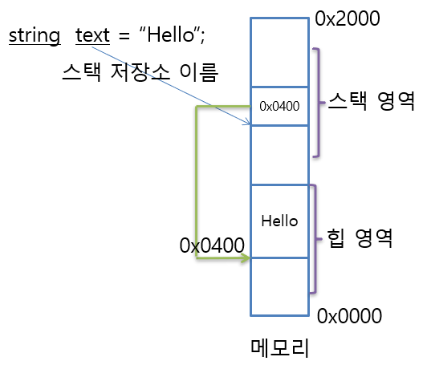
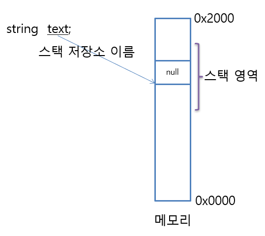
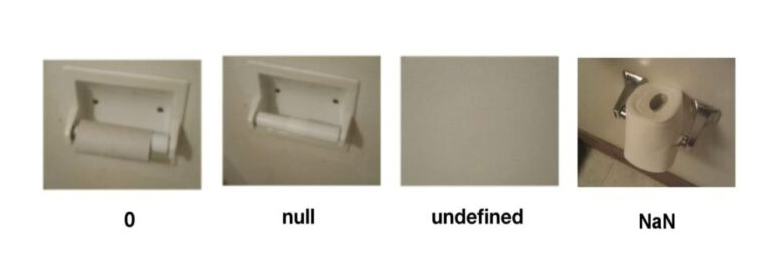

# 변수, 데이터 타입1 ( C# - Data Types 01 )


## 1. 데이터 형식

* 데이터 형식은 <u>'값 형</u>'과 '<u>참조 형</u>'으로 나눌 수 있다.


### 1.1. 값 형과 참조형

#### 1) 값 형

* value type
* 변수가 값을 담는 데이터 형식
* 스택 메모리를 활용한다.

---

* 기본 데이터형은 모두 값형(value type) 이다.

  * int, float, double, decimal, byte, enum(사실상 이름 붙은 정수) 등

* 한 변수를 다른 변수에 대입하면 <u>사본을 만드는 자료형</u>

  ```csharp
  int num1 = 1;
  int num2 = num1;
  num2 = 3;	// num1은 여전히 1
  ```

* 함수 매개변수의 인자로 전달해도 마찬가지다.

  * 즉 다른 변수의 값을 변경해도 원본은 바뀌지 않는다.

  ```csharp
  public static void DoSomething(int num)
  {
  	num = 3;	// 함수 밖의 num1은 여전히 1
  }
  ```

  ```csharp
  // 메인 함수
  int num1 = 1;
  DoSomething(num1);
  ```


[ 원본을 바꾸고 싶다면? ]

* 함수 호출의 경우 - ref 매개변수 사용


#### 2) 참조 형  

* reference type

* 변수가 값 대신 값이 있는 곳의 위치 ( 참조 )를 담는 데이터 형식이다.

* 스택 메모리와 힙 메모리를 활용한다. 
  * 힙에 데이터를 저장하고, 스택에는 데이터가 저장 된 힙 메모리의 주소를 저장한다.
  
  

---

* 일단, 값을 복사하지 않고 원본을 공유하는 형태의 자료형이라고 생각하는 게 좋다.
* C#에서 클래스는 모두 참조형

---

* 배열
* 배열의 배열
  * 내부 배열을 다른 변수에 대입한 뒤 요소를 바꿨는데 원본도 바뀐다.
* 클래스
* string
* object

---

> ---
>
> **[ 참고 ] '값 형'과 '참조 형'의 하드웨어**
>
> 값 형은 cpu안에 저장이 된다고 가정하고, 생각하는 것이 좋다.
>
> * 내부 안에서 돌아간다.
>
> 참조형은 Memory에 저장이 된다고 가정하고, 생각하는 것이 좋다. 
>
> * cpu에서 연산하려면 주소를 참조해서 가져와서 돌린다. ( 크기 문제 등의 이유 )
>
> ---


#### 3) 값 형과 참조형 - null

##### (1) null

어떤 변수가 메모리 상에 어떤 데이터도 가지고 있지 않다는 의미로서 NULL을 사용하는데, C# 에서는 NULL을 표현하기 위하여 소문자 **null** 키워드를 사용한다.

모든 데이타 타입이 NULL을 가질 수 있는 것은 아니다.
( 사실 데이타 타입은 NULL을 가질 수 있는 타입 (Reference 타입)과 가질 수 없는 타입 (Value 타입)으로 구분될 수 있다. )

어떤 언어에서는 nil이라고 하기도 한다. 

* 참조 형식의 기본값

* '없다'를 컴퓨터 세계에서 이진수로 0

* 데이터가 존재하지 않는다는 의미이다.

  * 아무것도 참조하고 있지 않다.
  * 포인터가 아무것도 가리키지 않아 값 자체가 없음을 의미한다. 
  * undeifend와 빈 값(Empty, "")와 다르다.

  


##### (2) 값 형과 참조형 - null

* 값 형

  * 값 형의 기본값인 0은 이진수로도 0이다.
  * 값 형에는 null을 쓸 수 없다.

  ```cs
  int num = null;			// 컴파일 오류
  ```

* 참조형

  * 참조형의 기본값인 null은 메모리에서 보면 이진수 0과 같다.
  * 참조형에는 0을 쓸 수 없다.

  ```csharp
  Human you = 0;			// 컴파일 오류
  string message = 0;		// 컴파일 오류
  ```

  * <u>null은 의도치 않은 결괏값을 표현할 때 쓰면 좋다.</u>

[ 중요 ] 내부적으로는 2진수로 보면 0이나 null이나 비트 패턴으로 0이지만 프로그래밍 언어에서 사용할 때는 직접적으로 대입할 수 없다.


##### (3) 참고 : 요약 정리

* null : 정의된 형식조차 없는 것이다. 참조 하지 않는 것이다.
* 0 : 숫자로 정의되었는데 내용이 없는 것이다.

---

* undefined : 정의 되지 않았다.
* NaN ( Not A Number ) : 연산 과정에서 잘못된 입력 값을 받아서 계산 할 수 없음




#### [bonus] 참조형과 가비지 컬렉션

* [노란색] 크게 중요한 내용은 아니다.

* 임시 문자열(쓰레기)은 쓰레기 수집기(GC)의 대상이다.
  * 참조형도 전부 GC의 대상이다.
  * 참조형 임시 데이터를 너무 많이 만든다면 GC의 성능저하가 올 수 있다.
    * (ex) New 클래스
  * 값형은 GC의 대상이 아니다.
    * but, 값 형은 복사본을 만들 때 따른 비용으로 성능저하가 올 수 있다.
  * [종합] 값형은 쓰레기 수집기 대상이 아니지만, 참조형은 쓰레기 수집기 대상이다.


[참고] 

* 반드시 값형이 빠르다 참조형이 빠르다라고 확정 할 수 없다. 
* 하지만 일반적으로 볼 때 값 형을 사용하는 것이 보통 성능상으로 유리한 편이다.


### 1.2. 메모리 영역

윈도우 프로그램은 기본적으로 하나의 스레드를 갖는다.

'스택'은 이 개별 스레드마다 전용으로 사용할 수 있는 저장소가 메모리에 할당되는데 그 영역을 말한다.

힙은 프로그램에서 필요에 의해 메모리를 사용하겠다고 요청했을 때 사용할 수 있는 저장소 이다. 
특별히 닷넷에서는 CLR이 직접 프로그램에서 사용될 '힙'을 관리한다.


#### 1) 스택 메모리

* **값 형식 ( Value Types )**에서 사용하는 영역이다.
* 변수를 선언하면 차례대로 스택을 쌓였다가 코드 블록이 끝나면서 스택에서 걷혀 제거됩니다. ( 스스로 제거 )
  * C# 컴파일러에 의해 자동 할당 및 해제된다.


#### 2) 힙 메모리

* **참조 형식 ( Reference Types )**에서 사용하는 영역이다.
* 힙은 스택과 다르게 저장된 데이터를 스스로 제거하지 못한다. 
* 가비지 컬렉션이 대신해서 데이터를 제거한다. 

> ---
>
> [ C#과 C, C++ ]
>
> * C, C++ : 프로그래머가 직접 메모리 할당과 해제를 반드시 직접 해줘야 한다.
> * C# : 프로그래머가 오직 할당만 하고, 해제는 가비지 컬렉션이 담당한다. 
>
> ---


#### 3) 절대 바꿀 수 없는 메모리

상수와 열거형에 담긴 데이터는 절대 바꿀 수 없는 메모리 공간이다. 

* 상수 : const
* 열거형 : Enumerator


> ---
>
> 질문
>
> 값형이 함수 인자로 전달 될 경우 메모리 복사가 일어나야 하기 때문에 단순히 참조만 전달하는 것에 비하여 메모리 낭비가 발생하고 복사하는데 걸리는 성능 저하로 인해 성능이 더 안 좋을 것 같습니다. 기본 타입일 경우 크기가 작으므로 별로 상관이 없을 것 같은데 크기가 큰 개체의 경우 이러한 현상이 더 심해질 것 같습니다. 이런 상황에서도 값형이 여전히 더 성능이 좋은게 맞나요?
>
> 
>
> 답변
>
> 값은 스택 메모리를 사용하여 복사하기 때문에 힙 메모리에 비해 속도가 매우 빠릅니다. 따라서 기본적으로 값 형이 성능이 유효하다고 생각하시는게 편합니다. (실제 실무에서도 스택 메모리에 넣을 수 있다면 최대한 스택 메모리에 넣고, 용량상 그게 안될 때는 힙 메모리에 넣는 경우가 보통입니다) 
>
> 하지만 C++에 가시면 많은 개체(object)를 담고 있는 컨테이너를 값형으로 복사할 경우 성능상의 문제가 발생할 여지가 있어 그 컨테이너 안에 값이 아닌 참조형(즉 포인터)를 저장하거나 아예 컨테이너를 복사하지 않고 참조로 전달할 경우들이 있습니다. (이 정도가 성능때문에 값형 대신 참조형을 사용하는 거의 유일한 예)
>
> ---


## 2. C#의 데이터 타입

* C#은 [.NET 데이터 타입](https://learn.microsoft.com/ko-kr/dotnet/csharp/language-reference/builtin-types/built-in-types)을 사용한다.


| C# 데이타 타입 | .NET 데이타 타입 | 설명                                                 |
| :------------- | :--------------- | :--------------------------------------------------- |
| bool           | System.Boolean   | True or False                                        |
| byte           | System.Byte      | 8비트 unsigned integer                               |
| sbyte          | System.SByte     | 8비트 signed integer                                 |
| short          | System.Int16     | 16비트 signed integer                                |
| int            | System.Int32     | 32비트 signed integer                                |
| long           | System.Int64     | 64비트 signed integer                                |
| ushort         | System.UInt16    | 16비트 unsigned integer                              |
| uint           | System.UInt32    | 32비트 unsigned integer                              |
| ulong          | System.UInt64    | 64비트 unsigned integer                              |
| float          | System.Single    | 32비트 single precision 부동소수점 숫자              |
| double         | System.Double    | 64비트 double precision 부동소수점 숫자              |
| decimal        | System.Decimal   | 128비트 Decimal                                      |
| char           | System.Char      | 16비트 유니코드 문자                                 |
| string         | System.String    | 유니코드 문자열                                      |
|                | System.DateTime  | 날짜와 시간, 별도의 C# 키워드가 없음                 |
| object         | System.Object    | 모든 타입의 기본 클래스로 모든 유형을 포함할 수 있음 |


### 2.1. C# 데이터 타입 : .Net 데이터 타입

C# 키워드(keyword)  데이터 타입은 해당 .NET 데이터 타입의 별칭입니다. ( 서로 교환하여 사용할 수 있습니다. )

* C#에서 사용하는 자료형은 **.NET 데이터 타입**이고, C#은 단지 별도의 명칭을 예약어를 추가해서 사용하고 있을 뿐이다.
* 내부적으로 C# 컴파일러는 C# 키워드로 된 데이터 타입을 컴파일 후 **.NET 데이타 타입**으로 변경하게 된다.
  * 즉, C#은 int, double, string 과 같은 **C# 키워드 데이터 타입**을 표현할 수 있으며, 동시에 System.Int32, System.Double, System.String 과 같은 .NET 데이타 클래스로 데이타 타입으로도 표현할 수도 있다. ( `int = System.Int32` 식으로 1:1 대응 )

```csharp
char CHAR01 = 'A';
Char CHAR02 = 'A';

int INT01 = 32;
Int32 INT02 = 32;

string STR01 = "안녕하세요.";
String STR02 = "안녕하세요.";

bool BOOL01 = true;
Boolean BOOL02 = true;
```


---

**[ GetType() - 메서드 ]**

모든 변수에 GetType() 메서드를 요청하면 해당 변수의 닷넷 데이터  형식을 알려 줍니다.

```csharp
int num1 = 1;
float num2 = 3;

Console,WriteLine(num1.GetType());
Console,WriteLine(num2.GetType());
```

```csharp
System.Int32
System.Single
```

---


### 2.2. 공용 형식 시스템

C#의 모든 데이터 형식은 <u>공용 형식 시스템(Commmon Type System)</u>이라는 .NET 형식의 체계 표준을 그대로 따르고 있습니다. 

C#의 데이터 형식 체계가 공용 형식 시스템(CTS) 표준을 따르고 있다.

* 즉, 이 모든 데이터 형식은 <u>공용 형식 시스템</u>에서 온 것입니다. 
* 공용 형식 시스템 : 모두가 함께 사용하는 데이터 형식 체계
  * 여기서 모두는 C#을 비롯한 .NET을 지원하는 모든 언어를 뜻합니다.
    ( 즉, 공용 형식 시스템은 .NET 언어들이 반드시 따라야 하는 데이터 형식 표준입니다. )
  * 이렇게 사용하는 이유는 .NET 언어들 끼리 서로 호환성을 갖도록 하기 위함입니다.

| **클래스 이름** | **C# 형식** | **C++ 형식**                       | **비주얼 베이직 형식** |
| --------------- | ----------- | ---------------------------------- | ---------------------- |
| System.Byte     | byte        | unsigned char                      | Byte                   |
| System.SByte    | sbyte       | char                               | SByte                  |
| System.Int16    | short       | short                              | Short                  |
| System.Int32    | int         | int 또는 long                      | Integer                |
| System.Int64    | long        | __int64                            | Long                   |
| System.UInt16   | ushort      | unsigned short                     | UShort                 |
| System.UInt32   | uint        | unsigned int  또는   unsigned long | UInteger               |
| System.UInt64   | ulong       | unsigned __int64                   | ULong                  |
| System.Single   | float       | float                              | Single                 |
| System.Double   | double      | double                             | Double                 |
| System.Boolean  | bool        | bool                               | Boolean                |
| System.Char     | char        | wchar_t                            | Char                   |
| System..Decimal | decimal     | Decimal                            | Decimal                |
| System.IntPtr   | 없음        | 없음                               | 없음                   |
| System.UIntPtr  | 없음        | 없음                               | 없음                   |
| System.Object   | object      | Object*                            | Object                 |
| System..String  | string      | String*                            | String                 |


### 2.3. 래퍼 형식 ( wrapper type )

* 닷넷 데이터 형식을 다른 말로 '래퍼 형식'이라고 합니다.
* int, string 같은 기본 형식을 클래스 또는 구조체로 감싼 닷넷 데이터 형식을 의미합니다.

```csharp
int num1 = 1234;		// int 키워드 : 기본 형식
Int32 num2 = 1234;		// System.Int32 구조체 : 닷넷 형식

string str1 = "안녕";		// string 키워드 : 기본 형식
String str2 = "안녕";		// System.String 클래스 : 닷넷 형식
```


