#  05. 변수와 상수 ( 데이터 타입 )


## 1. 변수와 상수

### 1.1. 변수 ( Varialbe )

어떤 일정한 형식의 데이터를 임시로 저장하는 곳 - 상태는 변할 수 있고, 그럴 때 마다 저장한다.

* variable : 변할 수 있는 값을 의미  ( vary : [동사] 변화를 주다. )

---

* **변수를 사용하는 이유** : 재사용, 명확한 유추 가능
  * 재사용 하다 보니 변수를 mutable이라고 부르기도 한다.
    ( mutable ( 형용사 ) : 변할 수 있는, 잘 변하는 )


#### 1) 선언과 대입

* 선언 ( Declaration ) : 변수 및 상수 변수(const 키워드)의 자료형과 이름(식별자)을 컴퓨터(컴파일러)에 알린다. 

* 대입 ( Assignment ) : 변수 및 상수 변수(const 키워드)의 실제 값을 컴퓨터(컴파일러)에 알린다. 

  * 식별자를 부여한 변수는 할당된 저장소를 가리킨다. ( 저장해서 사용한다. )
    ( 할당된 저장소 : 정수 리터럴, 실수 리터럴, 문자열 리터럴 등 )
  
  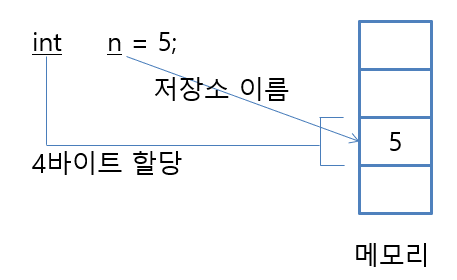
  
  ---
  
  * 선언과 대입 (할당) 을 동시에 할 수 있다.
  * 상수 변수(const 키워드)는 항상 선언과 대입이 동시에 이루어진다.
  * **대입(Assignment) 대신 정의(definition)로 사용하는 경우도 있다.**
  
  [참고] 선언과 대입 (할당)은 별개의 작업이다. 나중에 내부적으로 어떻게 다른지 공부해보자.
  
  ---

```C#
float num1;				// 변수 선언
num1 = 128.512f;		// 변수 대입

float num2 = 128.512f	// 변수 선언과 동시에 대입

const float PI = 3.14f 	// const 변수(즉, 상수)는 항상 선언과 대입이 동시에 이루어짐
```

```csharp
int a, b, c;
a = b = c = 10;
/* 이런 식으로도 초기화가 가능하지만 코딩 컨벤션에 위배 될 경우 추천하지 않는다. */
```


> ---
>
> **[ 초기화 ]**
>
> * Initialization
> * 변수에 최초의 데이터를 할당하는 것을 의미한다.
>
> ---
>
> * C, C++ 경우
>   * 초기화를 하지 않을 경우 이 변수에 "쓰레기 데이터"가 들어가게 된다. 이렇게 들어간 데이터는 엉뚱한 동작을 유발할 수 있다.
> * C# 경우
>   * 이런 문제를 민연에 방지하도록 초기화를 강제한다.
>   * 초기화 되지 않은 변수를 사용하면 컴파일러가 에러 메시지를 내면서 실행 파일은 만들지 않는다.
>   * 초기값은 수치 형식 상 0으로 초기화 하는 경우가 많다. 
>
> ---


#### 2) 변수 미사용시 생기는 문제점

변수를 사용하지 않고 매직넘버를 사용할 경우 발생할 수 있는 문제점이다.


1. **상태 변화 시 누락 가능성 증가**

   변수를 사용하게 된다면 한 군데만 수정해도 다른 곳에서 값이 바뀐다.
   
   * 매직넘버 만을 사용할 경우 변수에서 1번 수정 할 것을 N번 이상 수정해야 한다.
   
   ( ※ 나중에 예시 코드 기입 예정 )


2. **명확한 이름을 통해 의도 파악 불가**

```c#
-------------------------------
// 명확함 X : 무엇을 출력하는지 알 수 없다.
Console.WriteLine(17);		
-------------------------------
// 명확함 O : 변수명 age를 통해 나이를 출력한 다는 것을 명확히 알 수 있다.
int age = 17;				
Console.WriteLine(age);
-------------------------------
```


#### 3) 지역변수와 전역 변수 @@

* 지역변수 ( 로컬변수 ) 

  * 해당 메서드내에서만 사용되며, 메서드 호출이 끝나면 소멸된다. 
  * 기본값을 할당받지 못하기 때문에 반드시 사용 전에 값을 할당해야 한다.

* 전역변수 ( 필드 ) 

  * 클래스의 객체가 살아있는 한 계속 존속하며 또한 다른 메서드들에서 필드를 참조할 수 있다. 

    ( 만약 필드가 정적 필드(static field)이면 클래스 Type이 처음으로 런타임에 의해 로드될 때 해당 Type 객체(타입 메타정보를 갖는 객체)에 생성되어 프로그램이 종료될 때까지 유지된다. )

  * 값을 할당하지 않으면, 해당 타입의 기본값이 자동으로 할당된다. 
    예를 들어, int 타입의 필드인 경우 기본값 0 이 할당된다.

```C#
using System;

namespace ConsoleApplication1
{
    class CSVar
    {
        //필드 (클래스 내에서 공통적으로 사용되는 전역 변수)
        int globalVar;
        const int MAX = 1024;

        public void Method1()
        {
            // 로컬변수
            int localVar;

            // 아래 할당이 없으면 에러 발생
            localVar = 100;

            Console.WriteLine(globalVar);
            Console.WriteLine(localVar);
        }
    }

    class Program
    {
        // 모든 프로그램에는 Main()이 있어야 함.
        static void Main(string[] args)
        {
            // 테스트
            CSVar obj = new CSVar();
            obj.Method1();
        }
    }
}
```

- 필드 globalVar는 값을 명시적으로 할당하지 않은 경우 기본값 0 이 할당된다. 여기서 전역(Global)의 의미는 객체 (혹은 클래스) 내에서의 전역을 의미한다.
- 지역변수 localVar는 값을 할당하지 않고 사용하게 되면, 컴파일러 에러가 발생한다.


#### 4) 기타 @@

* 변수를 동시에 여러 개 선언 할 수 도 있다.
* 데이터 형식을 콤마( , )를 이용해서 한 번에 여러 개를 선언하고 초기화 할 수 있다.

```csharp
int num1, num2, num3 = 5;
```


### 1.2. 상수 ( constant )

변하지 않는 숫자를 말한다. 
( 컴퓨터 과학에서는 문자도 숫자이기에 함께 포함한다. )

* immutable이라고 부르기도 한다.
  ( immutable ( 형용사 ) : 변경할 수 없는, 불변의  )

---

* 넓은 의미 : constant, immutable

* 좁은 의미 : litreal, magic number / const 키워드 
* 헷갈리지만 섞어서 쓰고, 업계에서도 그렇게 혼용해서 소통한다. 
  ( 하지만 엄밀히 따지면 literal, 별칭으로는 magic number를 사용한다. )


#### 1) 리트럴 ( 매직 넘버  )

뭔지 전혀 알 수 없기 때문에 `매직넘버`라고 부른다.
( 하지만 엄밀히 따지면 literal, 별칭으로는 magic number를 사용한다. )

* 매직 넘버는 되도록이면 사용하지 말자.
* 변수를 사용하면 한 번에 변경 할 수 있지만 매직 넘버를 사용하면 여러차례 바꿔야 한다.

```c#
Console.WriteLine(30);			// int 
Console.WriteLine(30.1);		// double
Console.WriteLine(30.2f);		// float
Console.WriteLine(true);		// bool
Console.WriteLine('p');			// char
```


##### (1) C# 리트럴 처리 방식 @@

1. 리트럴 무조건 양수
2. 만약, '**부호(-) 단항 연사자**' 붙을 경우 내부적으로 signed형으로 취급하고 저장됩니다.

```csharp
-2147483648 = -0b1000_0000_0000_0000_0000_0000_0000_0000 ( O )
-2147483648 = 0b1111_1111_1111_1111_1111_1111_1111_1111 ( X )
```

```csharp
int num01_1 = 0b1000_0000_0000_0000_0000_0000_0000_0000; // cs0266 error
int num01_2 = unchecked((int)0b1000_0000_0000_0000_0000_0000_0000_0000);
int num01_3 = -0b1000_0000_0000_0000_0000_0000_0000_0000;

int num02_1 = 0b1111_1111_1111_1111_1111_1111_1111_1111; // cs0266 error
int num02_2 = unchecked((int)0b1111_1111_1111_1111_1111_1111_1111_1111);
int num02_3 = -0b0000_0000_0000_0000_0000_0000_0000_0001;
```

* -0b1000_0000_0000_0000_0000_0000_0000_0000로 넣은 리트럴은 나중에 출력하면 0b1111_1111_1111_1111_1111_1111_1111_1111 형태로 나온다. 
* 이거외에 프로그래머가 직접적으로 0b1111_1111_1111_1111_1111_1111_1111_1111 넣을 방법은 unchecked 키워드 까지 사용해서 강제로 int형 캐스팅을 하는 방법 밖에는 없네요.
  * unchecked 키워드 : 상수값 들의 연산이나 변환에 의해 오버플로, 언더플로가 생긴다 하더라도 컴파일러에게 "내가 의도한거니까 무시해라" 하는 키워드 입니다.

---

이런 결과가 나오는 이유는 C#에서 리트럴은 무조건 양수로 취급하고, 부호 단항 연산자까지가 리트럴 값을 결정하기 때문인 듯 합니다.


**[ 참고 ] C언어의 리트럴**

C언어에서는 위의 문제가 발생하지 않는다.

```c
#include <stdio.h>

int main() {
    int num1 = 0b01111111111111111111111111111111;
    int num2 = 0b11111111111111111111111111111111;
    
    printf("%d\n", num1);
    printf("%d\n", num2);

    return 0;
}
```

```
2147483647
-1
```

즉, <u>언어마다 리트럴 처리 방식이 다를 수 있다.</u>

( C언어는 프로그래머가 알아서 잘 통제할 것이라는 전제를 깔고 있다. )


##### (2) 숫자 구분자 ( 언더 스코어 _ )

C# 7.0부터 언더스코어(_) 문자를 사용하는 숫자 구분자(digit separator)를 제공하여 세 자리 마다 콤마로 구분되는 긴 숫자 형태를 표현할 수 있다.

가독성을 높힐 수 있습니다.

```cs
int number = 1_000_000;
Console.WriteLine(number);	
```

```
1000000
```


#### 2) const / readonly @@

##### (1) const 키워드 

* constant의 줄임말 => 상수
* 한 번 값을 대입한 후에 값을 바꾸고 싶지 않을 때 사용
* const는 필드 선언부에서 사용되거나 메서드 내에서 사용될 수 있으며, 컴파일시 상수값이 결정된다.  @@@@@@
  * 컴파일 할 때 값이 결정돼야만 한다. ( 상수 숫자 기입 )

* [컴파일 오류] 대입 후, 값을 변경할 경우 <u>컴파일 오류</u> 발생

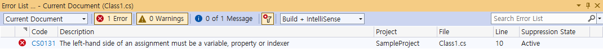


[ 예외 : 상수식 ]

같은 코드임에도 컴파일러가 값을 컴파일 시에 계산해서 대입할 수 있다면 상수에 대입하는 것이 가능핟.

```csharp
const int n = 5 * 100 / 2;		이러한 단순 수깅느 컴파일러가 값을 계산할 수 있다.
```

* 여기서 `5 * 100 / 2`를 상수식(constant expression)이라고 구분할 수 있다. 
  * 컴파일 할 때 값이 결정되는 수식을 말한다.


##### (2) readonly 키워드 @@

* C#에서는 const 대신 readonly 키워드를 사용하여 읽기전용 (개념적으로 상수와 비슷한) 필드를 만들 수 있다. 
  * 선언 이후 다른 값을 대입하지 못한다.

* readonly는 필드 선언부나 클래스 생성자에서 그 값을 지정할 수 있고, 런타임시 값이 결정된다.

```cs
using System;

namespace ConsoleApplication1
{
    class CSVar
    {
        // 상수
        const int MAX_VALUE = 1024;

        // readonly 필드 
        readonly int Max;
        public CSVar() 
        {
           Max = 1;
        }
        
        //...
    }
}
```


#### 4) 접두사와 접미사

**접두사 접미사를 사용하는 이유**

* **컴퓨터 입장에서 10은 다양한 의미를 표현하기 때문에 알아 듣기 어렵다.**

  ( 그렇기 때문에 접두사와 접미사를 사용한다. )

* [핵심] 접두사 접미사의 사용은 명확한 의도를 전달하여 가독성을 높여준다.

  * 접두사와 접미사 사용은 업계의 코딩 표준이다.


> ---
>
> int 10
>
> 이진수 10
>
> double 10
>
> ---


##### (1) 접두사와 접미사

* 접두사 ( prefix ) : 상수의 앞을 꾸민다.
* 접미사 ( postfix ) : 상수의 뒤를 꾸민다.


##### (2) 상수 접두사

상수 앞에 붇는 기호로 진법을 나타낸다.

접두사를 사용하여 특정 진법으로 된 리트럴을 표현할 수 있다. 

* 2진수 : **0b-** / 0B-
* 16진수 : **0x-** / 0X-

( 일반적으로 여러 프로그래밍 언어에서 대문자보다 소문자를 주로 사용한다.  대문자는 잘 쓰이지 않는다. )

```c#
int num1 = 0b10;	// 사용 비중이 매우 높다.
int num2 = 0B10;

int num3 = 0x10;	// 사용 비중이 매우 높다.
int num4 = 0X10;
```


##### (3) 상수 접미사

상수 뒤에 붙는 기호로 상수의 자료형을 나타낸다.

* **-u** : unsigned 형 ( 부호 없음 )

```c#
int num1 = 10;
uint num2 = 10u;
uint num3 = 0x10u;
```


* **-l** : long

```c#
int num1 = 1l;			// 컴파일 오류
long num2 = 10l;
long num3 = 10lu;		// 컴파일 오류
ulong num4 = 10lu;
```


* **-f** / -F : float
  * 대문자도 가능하나 거의 잘 안쓰이는 편이며 보통은 소문자 -f를 사용한다.
  * float에서 사용하는 f 접미사는 일반적인 업계 코딩 표준이다.

```C#
float num1 = 10.0f;
float num2 = 10.0F;
float num3 = 10.0;		// 컴파일 오류
```


* -d / -D : double
  * <u>double 접미사는 생략이 가능하며 거의 안쓰인다.</u>

```c#
double num1 = 10.0;
double num2 = 10.0d;
double num3 = 10.0D;
```


**[ 접미사 사용 시기 ]**

수정(대입)할때 접미사를 붙여주는 게 특히 좋습니다. 

왜냐하면 변수 선언문에는 왼쪽에 바로 type이 보이지만 단순 대입문에서는 변수 타입이 안 보인다. 이럴때 접미사를 붙여주면 곧바로 변수 타입을 알 수 있어서 ( 프로그래머가 눈으로 봤을때 ) 가독성이 올라가기 때문이다.


**[ 리터럴 데이터와 접미사 ]** @@@

C#에서 리터럴 데이타를 사용할 때, 별도의 접미어 표시(Suffix)가 없는 경우 C# 컴파일러는 int, double, char, string, bool 데이타 타입에 기본적으로 그 값을 할당한다. 

따라서, 특정 데이타 타입을 지정하고 싶으면, 리터럴 데이타 뒤에 1~2자의 타입 지정 접미사(Suffix)를 추가해야 한다. 

Suffix는 대소문자 구분이 없다. 즉 decimal을 나타내는 접미어 M은 1024M 이나 1024m처럼 사용가능하다. 

아래는 디폴트 리터럴 타입과 각 데이타 타입별 Suffix에 대한 예제이다.


**디폴트 리터럴 타입**

```cs
123    // int 리터럴
12.3   // double 리터럴
"A"    // string 리터럴
'a'    // char 리터럴
true   // bool 리터럴
```

| C# 리터럴 데이타 타입 | Suffix (대소문자 모두 가능) | 예제              |
| --------------------- | --------------------------- | ----------------- |
| long                  | L                           | 1024L             |
| uint                  | U                           | 1024U             |
| ulong                 | UL                          | 1024UL            |
| float                 | F                           | 10.24F            |
| double                | D                           | 10.24D 또는 10.24 |
| decimal               | M                           | 10.24M            |


## 2. 기본 자료형

### 2.1. 기본 자료형 소개

---

**기본 자료형 ( Primitive Types )** 

* 프로그래밍 언어에서 자체적으로 지원하는 자료형
* 하드웨어에서 직접적으로 이해하는 자료형
* 컴퓨터가 이해할 수 있는 가장 자연스러운 형태의 데이터
  * ALL 숫자
  * 디지털 : 2진수
* 프로그래밍 언어마다 담을 수 있는 자료의 크기 차이는 존재한다.
* **원시 자료형, 가장 단순한 형태의 자료형, Built-in Types** 등 다양하게 불리기도 한다.

---

* [숙제] - [ 데이터 형식 / 비트 / 범위 / 닷넷 형식 ] 순으로 표 만들어서 정리하기


#### 1) 정수형 ( Integer Types )

* 음수, 0, 자연수를 의미한다.

* byte, short, int, long

  * byte : 8비트 ( 1 바이트 )
  * short : 16비트 ( 2 바이트 )
  * int : 32비트 ( 4 바이트 )
  * long : 64비트 ( 8 바이트 )
* [참고] C#에서 byte가 다른 언어에서는 char 형으로 쓰이는 편이다.

| C#  형식/키워드 | 범위                                                    | 부호 | 크기(바이트)            | .NET  형식                                                   |
| --------------- | ------------------------------------------------------- | ---- | ----------------------- | ------------------------------------------------------------ |
| sbyte           | -128 ~ 127                                              | O    | 1바이트 (8비트)         | [System.SByte](https://learn.microsoft.com/ko-kr/dotnet/api/system.sbyte) |
| byte            | 0 ~ 255                                                 | X    | 1바이트 (8비트)         | [System.Byte](https://learn.microsoft.com/ko-kr/dotnet/api/system.byte) |
| short           | –32,768 ~ 32,767                                        | O    | 2바이트 (16비트)        | [System.Int16](https://learn.microsoft.com/ko-kr/dotnet/api/system.int16) |
| ushort          | 0 ~ 65,535                                              | X    | 2바이트 (16비트)        | [System.UInt16](https://learn.microsoft.com/ko-kr/dotnet/api/system.uint16) |
| int             | –2,147,483,648 ~ 2,147,483,647                          | O    | 4바이트 (32비트)        | [System.Int32](https://learn.microsoft.com/ko-kr/dotnet/api/system.int32) |
| uint            | 0 ~ 4,294,967,295                                       | X    | 4바이트 (32비트)        | [System.UInt32](https://learn.microsoft.com/ko-kr/dotnet/api/system.uint32) |
| long            | –9,223,372,036,854,775,808 ~  9,223,372,036,854,775,807 | O    | 8바이트 (64비트)        | [System.Int64](https://learn.microsoft.com/ko-kr/dotnet/api/system.int64) |
| ulong           | 0 ~ 18,446,744,073,709,551,615                          | X    | 8바이트 (64비트)        | [System.UInt64](https://learn.microsoft.com/ko-kr/dotnet/api/system.uint64) |
| nint            | 플랫폼에 따라 다름(런타임에 계산됨)                     | O    | 32비트 또는 64비트 정수 | [System.IntPtr](https://learn.microsoft.com/ko-kr/dotnet/api/system.intptr) |
| nuint           | 플랫폼에 따라 다름(런타임에 계산됨)                     | X    | 32비트 또는 64비트 정수 | [System.UIntPtr](https://learn.microsoft.com/ko-kr/dotnet/api/system.uintptr) |


#### 2) 부동 소수점형 ( Floating-Point Types )

---

* 소수점이 고정되어 있지 않고 움직이면서 수를 표현한다는 뜻이다.
  * 소수점을 이동시켜 수를 표현하면 고정 시켰을 때보다 더 훨씬 넓은 범위의 값을 표현할 수 있다.
  * 정밀도의 한계와 속도가 느려지는 문제를 가지고 있습니다.

* 정수뿐 아니라 유리수를 포함하는 실수 영역의 데이터도 다룹니다.
  * 3.14, 0.9와 같은 실수를 담는다.
* float, double, decimal
  * decimal은 C#에서만 사용하는 소수점형 이다.

---

* C#의 float과 double은 IEEE754라는 표준 알고리즘에 기반한 데이터 형식이다.

```C#
float float1 = 10.23f;
float float2 = 3.4f;

double double1 = 11.0;			// float과 달리 f를 안 붙인다.	
double double2 = 5.234;			// float과 달리 f를 안 붙인다.
```

---

| C#  형식/키워드 | 설명                                            | 근사 범위                      | 전체 자릿수      | Size              | .NET 형식                                                    |
| --------------- | ----------------------------------------------- | ------------------------------ | ---------------- | ----------------- | ------------------------------------------------------------ |
| float           | 단일 정밀도  (Single Precison) 부동 소수점 형식 | ±1.5 x 10−45 ~  ±3.4 x 1038    | ~6-9개 자릿수    | 4바이트(32비트)   | [System.Single](https://learn.microsoft.com/ko-kr/dotnet/api/system.single) |
| double          | 복수 정밀도  (Double Precison) 부동 소수점 형식 | ±5.0 × 10−324 ~ ±1.7 × 10308   | ~15-17개 자릿수  | 8바이트(64비트)   | [System.Double](https://learn.microsoft.com/ko-kr/dotnet/api/system.double) |
| decimal         | 복수 정밀도보다 더 높은 정밀도 형식             | ±1.0 x 10-28 ~  ±7.9228 x 1028 | 28-29개의 자릿수 | 16바이트(128비트) | [System.Decimal](https://learn.microsoft.com/ko-kr/dotnet/api/system.decimal) |

※ decimal은 프로그래밍 언어에 어디에나 있는 기본 자료형은 아니다.


> ---
>
> **[ IEEE754 ]**
>
> 4바이트(32비트) 크기의 foat 형식은 수를 표현할 때 1비트를 부호 전용으로사용하고, 가수부 23비트를 수를 표현하는 데 사용합니다. 그리고 나머지 지수부 8비트를 소수점의 위치를 나타내기 위해 사용합니다.
>
> 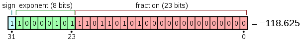
>
> 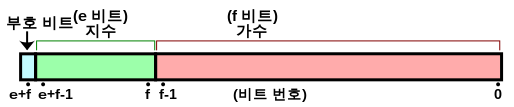
>
> ---


> ---
>
> **[ 지수 표기법 ]**
>
> 아주 큰 수와 작은 수를 표현할 때는 지수 표기법(exponential notation)을 사용합니다. 지수 표기법은 과학적 표기법(scientific notation)이라고도 합니다.
>
> 지수 표기법은 숫자를 '-d.ddd ··· E+ddd' 또는 '-d.ddd ··· e+ddd' 형태의 문자열로 변환합니다. 여기서 각 d는 숫자 (0~9)를 나타냅니다. 숫자가 음수이면 문자열 앞에 빼기 기호가 붙습니다. 소수점 앞에는 항상 숫자가 하나만 있어야 합니다.
>
> * 실수E+지수 : 실수 곱하기 지수만큼 10의 거듭제곱을 나타냅니다.
>
> ---


#### 3) 문자형 ( Character Type )

* 하나의 문자를 담는 자료형
  * 알파벳 ( a-z, A-Z ), 숫자( 0-9 ), 특수문자( !, @, * 등등 )
  * 작은 따옴표 ( ' ' )
* char : 16비트 ( 2바이트 ) 
  * 유니코드

* [참고] C#은 char형이 유니코드를 사용하는 16비트 ( 2 바이트 )
* [참고] C/C++은 char형이 ASCII코드를 사용하는 8비트 ( 1 바이트 )


#### 4) 불리언형 ( Boolean Type )

* bool  ( 불리언을 번역을 할 만한 마땅한 단어가 없다. )
* 참 ( true )와 거짓 ( false )를 표현하는 자료형
* 거의 모든 언어에서 지원하는 자료형이다.

* [참고] 어떻게 보면 정수형이라고 할 수도 있다. 어떤 경우는 불리언이 없고 정수형으로 대신 사용하기도 한다.

  * C++ 같은 일부 언어에서는 false : 0 으로 true : 0이 아닌 값 으로 변환이 가능하다.
    * C#은 불가능

  * 숫자로 생각하면 0 ( 거짓 ), 1 ( 참 )로만 표현 가능하다.
    *  1비트 만으로 사용 가능 한 것이다.

> ---
>
> **[ 불리언형 - 8비트 ]**
>
> 1비트 만으로 표현이 가능하겠찌만, 컴퓨터가 사용하는 데이터의 크기가 바이트 단위이기 때문에 1비트만 저장하려 해도 한 바이트가 통째로 사용됩니다.
>
> ---


#### 5) 부호 있는 자료형, 부호 없는 자료형

* 부호 : 수학에서는 양수와 음수를 판별하기 위한 기호(sign)를 의미한다.

* **부호 있는 자료형(Signed Types)** : 음수와 양수 모두 표현

  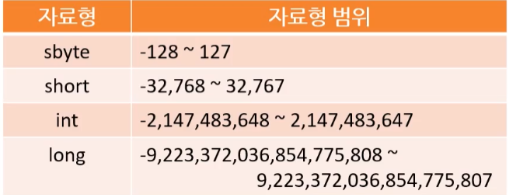

  

* **부호 없는 자료형(Unsigned Types)** : 양수만 표현

  * 보통 부호 있는 자료형 이름 앞에 'u'를 붙인다.


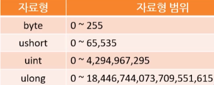


**[ C : char - C# : byte / C# : char ]**

**C : char**

* 8비트 ( 1 바이트 )

* ASCII 문자 체계

* [범위] 양수 음수 사용

  

**C# : byte**

byte가 부호가 없는 이유 : C언어의 char형에서 계승한 것으로 보인다.

* 8비트 ( 1 바이트 )
* C#에서는 C언어의 char 대신하여 byte라는 자료형을 사용하고 있으며 unsigned를 기본형으로 사용하고 있다.
  * sbyte : 음수/양수 모두 담은 signed 형 byte를 의미한다. 
* C : char => C# : byte


**C# : char**

* 16비트 ( 2 바이트 )
* 유니코드
* [범위] U+0000~U+FFFF

* C#에서의 char는 ASCII보다 방대한 문자를 가지는 유니코드를 16비트 ( 2 바이트 )로 표현한 것이다.

* C : char ( 8비트 : ASCII 코드 ) => C# : char ( 16비트 : 유니코드 )


#### [Summry] 기본 자료형 - 최종

* 기본적으로 많이 쓰이는 자료형 : int, float

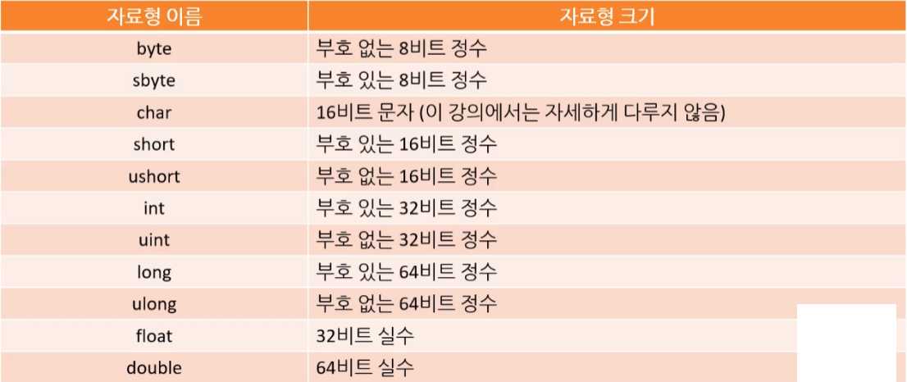


### 2.2. 최적화 / 최솟값 최댓값

#### 1) 최적화

##### (1) int, float - 4바이트 최적화

int와 float 형을 기본으로 많이 사용하곤 합니다. 

그 이유는 일반적인 CPU의 구조 때문에 4바이트 크기의 데이터로 연산을 하는 것이 가장 빠르기 때문입니다. 
( 순수하게 CPU의 연산장치만 고려할 경우를 말한다. ) 

따라서 실무에서는 일반적으로 byte나 short 대신 int를 사용하는 경우가 많다.

하지만 정말 메모리가 많이 모자른 시스템에서 프로그래밍을 한다면 이 마저도 byte로 줄여서 메모리를 최대로 아끼려고 합니다. 


##### (2) float, double - 성능 차이

* 속도 : float > dobule

  * float이 double보다 CPU에서 2배 정도 빠르다.

  * 실제 게임 업계에서도 float을 많이 쓴다.

* 정밀도 : double > float 
  * 당연히 double이 우세하다.


##### (3) 부동 소주점 형식의 문제

* 정밀도의 한계
* 속도
  * 산술 연산 과정이 정수 계열 형식보다 복잡하고 느립니다.


#### 2) 최솟값 최댓값 - MIN / MAX

* 기본형.MaxValue : 기본형 최댓값
  * 양수 : 011111...
  * [주의!] 출력시 0을 생략하고 1111.. 로만 나올 수도 있다.
* 기본형.MinVaule : 기본형 최솟값
  * 음수 : 100000...

[ 참고 ] C# 데이타 타입 키워드 뒤에서도 이러한 프로퍼티를 직접 호출할 수 있다. 즉, int.MaxValue 혹은 Int32.MaxValue, Single.MaxValue 처럼 사용할 수 있다. 

---

* Convert.ToString(변수명, 진법) : 변수를 특정 진법으로 변환
  * Convert.ToString(byte1, 2) : byte1변수를 2진수로 변환

```c#
using System;

namespace PrimitiveTypesToBinary
{
    class Program
    {
        static void Main(string[] args)
        {
            byte byte1 = byte.MaxValue;
            byte byte2 = byte.MinValue;

            int int1 = int.MaxValue;
            int int2 = int.MinValue;

            long long1 = long.MinValue;
            long long2 = long.MaxValue;

            char char1 = 'A';
            char char2 = 'a';


            Console.WriteLine("byte Max : " + byte1 + " -> " + Convert.ToString(byte1, 2));
            Console.WriteLine("byte Min : " + byte2 + " -> " + Convert.ToString(byte2, 2));
            Console.WriteLine();

            Console.WriteLine("int Max : " + int1 + " -> " + Convert.ToString(int1, 2));
            Console.WriteLine("int Min : " + int2 + " -> " + Convert.ToString(int2, 2));
            Console.WriteLine();

            Console.WriteLine("long Max : " + long1 + " -> " + Convert.ToString(long1, 2));
            Console.WriteLine("long Min : " + long2 + " -> " + Convert.ToString(long2, 2));
            Console.WriteLine();

            Console.WriteLine("char 'A' : " + char1 + " -> " + Convert.ToString(char1, 2));
            Console.WriteLine("char 'a' : " + char2 + " -> " + Convert.ToString(char2, 2));
        }
    }
}

```

```
byte Max : 255 -> 11111111
byte Min : 0 -> 0

int Max : 2147483647 -> 1111111111111111111111111111111
int Min : -2147483648 -> 10000000000000000000000000000000

long Max : -9223372036854775808 -> 1000000000000000000000000000000000000000000000000000000000000000
long Min : 9223372036854775807 -> 111111111111111111111111111111111111111111111111111111111111111

char 'A' : A -> 1000001
char 'a' : a -> 1100001
```


## 3. 형 변환 ( Type Conversion )

### 3.1. 묵시적 변환 ( Implicit Conversion )

* '묵시적 변환', '암시적 변화', 암묵적 변환'이라고 번역하기도 한다.

* 컴파일러에서 기본 자료형 간의 변환을 자동으로 해준다.

  * 모든 기본 자료형 간의 변환이 가능한 것은 아니다.
  * 특별한 문법이 필요 없다.

  ```c#
  int num1 = 10000;
  long num2 = num1;
  ```


---


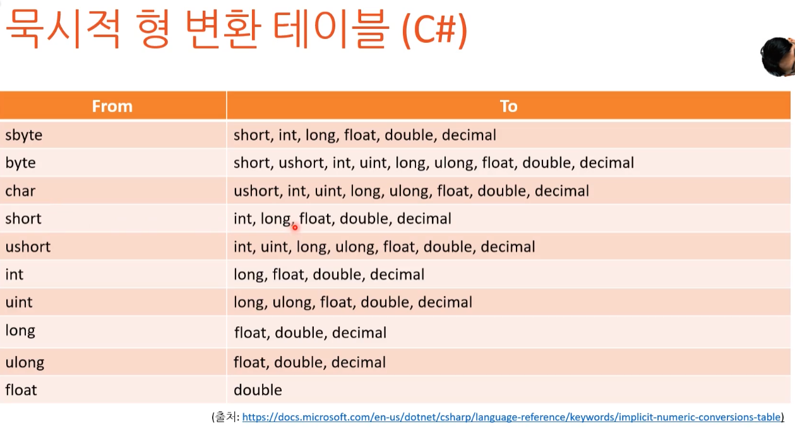


---


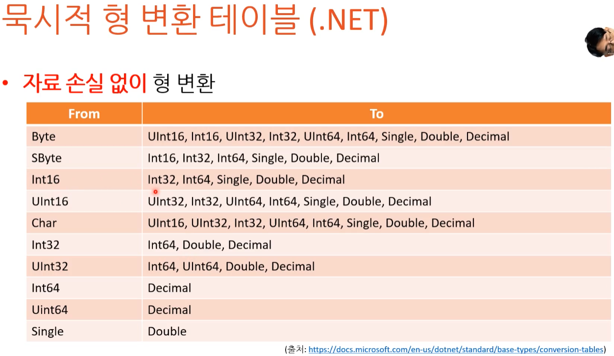

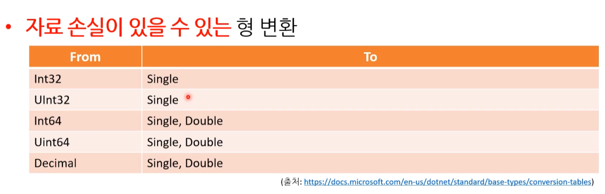


#### 1) 정밀도 손실 ( Loss of Precision )

묵시적 변환시 특히 아래의 자료형이 달라지는 경우 정밀도 손실이 발생할 가능성이 크다.

* int / long => float
* long = > double

```c#
using System;

namespace SampleProject
{
    class Program
    {
        static void Main(string[] args)
        {
            int num1 = 1234567890;
            float num2 = num1;
            
            Console.WriteLine(num1 - (int)num2);
        }
    }
}
```

```
-46
```

상식적으로 0이 나오는 것이 정상이지만 이렇게 정밀도 문제가 생긴다.

그러니 int로 표현 가능 한 것은 int로 사용하는 것이 좋다. 


##### (1) 작은 형에서 큰 형으로 변환

아무 문제 없다.

* 32비트에서 64비트 형으로 변화 

```
int num1 = 2147483647;
long num2 = num1;		// OK
```

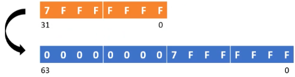


##### (2) 큰 형에서 작은 형으로 변환

값이 작으면 상관 없지만 아니라면 손실이 일어날 가능성이 크다.
( 언어마다 손실 상황을 고려해서 컴파일 오류를 내는 경우도 있다. )


* 64비트에서 32비트 형으로 변환 ( 작을 경우 )
  * 아래의 경우 손실이 없어 문제가 되지 않는다. 

```C#
long num1 = 2147483647;
int num2 = num1;			// C++에서 OK, C#에서는 컴파일 오류
```


* 64비트에서 32비트 형으로 변환 ( 큰 경우 )
  * 런타임 중에 값이 어떻게 될지 모른다.
  * 아래의 경우 '정보의 손실'이 생겨 문제가 된다.  

```c#
long num1 = 9223372036854775807;
int num2 = num1;			// C++에서 OK, C#에서는 컴파일 오류
```


#### 2) 승격 ( Promotion )

**연산 시 자료형의 크기가 더 큰 것을(표형범위가 넓은 형식) 따르는 것이다.**

컴파일러가 알아서 자동적으로 형을 바꿔준다고 생각하면 된다.

* int와 double을 더했을 때 정수+실수의 조건인데, double로 해야 소수점 표현이 가능하니까 두 가지의 합은 **double**로 출력된다.
  - 산술 연산자 또는 논리 연산자가 제대로 동작하게 하거나 ALU(산술논리장치)가 더 효율적으로 돌 수 있게 하려고 사용한다.
  - 실수형, 부동소수점 Type 확장 
    * 컴파일러가 자동으로 실수형이나 부동소수형 자료의 이진 표현을 확장한다. 

```c#
double num1 = 3.7;
int num2 = 10;

Console.WriteLine(num1 + num2);		// 13.7 출력 ( 승격 )
```


> ---
>
> **[ Type Conversion과 Type Promotion ]**
>
> 변환과 승격을 다르게 보는 경우가 있다. 
> ( 엄밀히 따지면 다른 것이지만 프로그래머에게 이 두 개의 차이점을 알아야 하는 경우는 드물다.  )
>
> **중요한 것은 어떤 것에서 어떤 것으로 변환이 되는지, 변환 시 문제가 있는지, 변환 시 2진수 표현이 바뀌는지 아닌지 등의 여부를 아는 것이 중요하다.**
>
> ---


### 3.2. 명시적 변환 ( Explicit conversion )

명시적인 형 변환은 프로그래머의 의도를 포함되어 있다. 

* 캐스팅(casting) 이라고도 한다.

* 형변환 연산자() 를 이용하여 변하고자 하는 자료형을 보여준다.

* 큰 자료형에서 작은 자료형으로 형 변환시 앞부분은 잘라내고 뒷 부분의 숫자만 가져 온다.

  ```c#
  long num1 = 9223372036854775807;
  int num2 = (int)num1;			// -1
  ```

  

* 실수에서 정수로의 명시적 형변환은 무조건 내림이 된다. ( 소수점 없애기 )

  ```c#
  double num3 = 10.9;
  int num4 = (int)num3;			// 10
  ```

* 모든 자료형이 변환이 되는 것은 아니다.

  ```c#
  long num1 = 9223372036854775807;
  bool bBool = (bool)num1;		// 컴파일 오류
  ```


**실습**

```c#
using System;

namespace Week
{
    class Program
    {
        static void Main(string[] args)
        {
        	double num1 = 10.9;
        	double num2 = 52.16;
        	Console.WriteLine("일반 덧셈 결과 : " + (num1 + num2));
        	
        	int result = (int)num1 + (int)num2;
        	Console.WriteLine("명시적 형변환 덧셈 결과 : " + result);
        }
    }
}
```

```
일반 덧셈 결과: 63.06
명시적 형변환 덧셈 결과: 62
```


