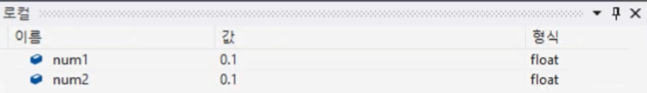
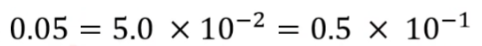
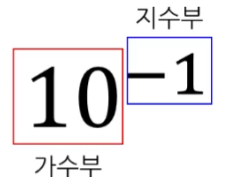
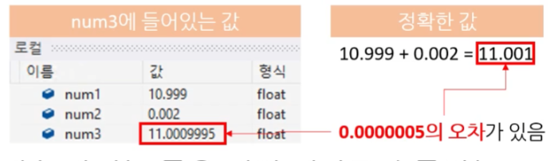
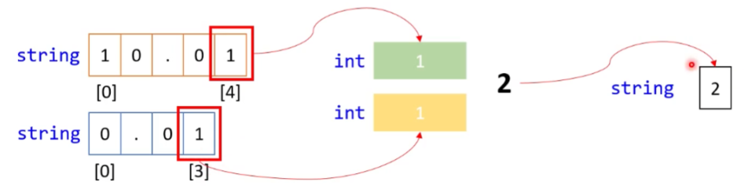
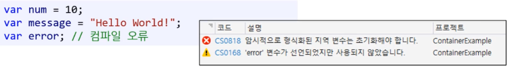
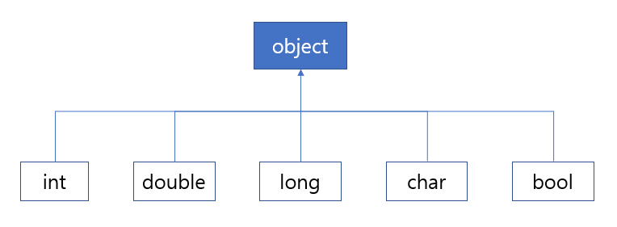

#  05. 변수와 상수2 ( 데이터 타입 )

* C#에서 사용하는 데이터형이다. 


## 1. decimal 

( 비트 수 : 128비트 )

* float 형과 double 형이 가지는 정밀도 문제를 해결해 주는 형이다. 
* 소수점 형 데이터를 의미한다.
* 언어마다 지원해 주는 특이한 형식이 있다.
* C#에서 decimal 형이다. ( System.Decimal )


#### 1) 부동 소수점의 한계

##### (1) 부동소수점형의 정밀도 문제

float 형의 정밀도 문제 때문에 == 이런 식으로 비교하는 게 좋지 않다.

* float 형에서 == 를 비교할 때는 num1, num2를 빼서 그 차이가 아주 작으면 같다고 생각한다. 
  ( 어쩔 땐 다르다고 할 때도 있다. 즉, 정밀하지 못하다. )

```csharp
static void Main(string[] args)
{	
	float num1 = 0.09999999999999f;
	float num2 = 0.1f;
	
	if (num1 == num2)
	{
		Console.WriteLine("Same!");
	}
}
```

```
Same!
```




**[ 부동소수점 ]** 

지수에 따라 소수점이 떠다니는 자료형






**[ float 형과 double 형 ]**

* float 형과 double형도 가수부와 지수부를 나눠서 저장한다. 
  * 표현할 수 있는 범위가 커진다.
  * 문제는 가수부에 줄 수 있는 값이 많지 않기 때문에 여기서 정밀도 문제가 발생할 수 있다.

* **비트 수는 정해져 있는데 너무 표현할 숫자가 많다.**
  * 0부터 0.000000000000000000001씩 더해서 1까지 가는 과정을 모두 정확하게 출력할 수 있을까?
    *  불가능. 이미 32개의 비트 수만으로 표현할 수 있는 수의 개수를 넘어간다.
    *  1을 출력하기 전에 많은 수들이 정확하지 않게 출력 될 것이다.
  * 정수에 이런 문제가 없는 이유는 사실상 "열거형" 이기 때문이다.
  * 따라서 부동소수점에서 근접한 두 수는 같은 값이 될 수도 있다.

---

* 32개의 비트수가 표할 수 있는 범위를 넘어서는 정밀한 숫자의 경우 같은 비트 패턴을 보이며 중복되는 값이 생길 수 있다.

* 부동소수점은 정확도는 포기하며 엄청난 양의 범위를 보장 했고, 실수에서 정수 부분의 범위 뿐만 아니라 소수점 자리의 부분까지 늘려났다.
* 부동소수점형 값은 근사값임을 언제나 기억하자.


##### (2) 실사용 : 은행에서 쓰기 적합할까?

* 적합하지 않다. ( 부적합 )
* 연산 과정에서 오차가 발생한다. 

```cs
float num1 = 10.999f;
float num2 = 0.002f;
float num3 = num1 + num2;
```

```
11.001
```




##### (3) 부동소수점 사용하는 이유

1. 빠르다 : CPU에서 자체적으로 지원하는 유일한 실수형이다. 

   * 계산이 빠르다.

   * float하고 decimal 속도 차이가 2배에서 1.5배정도 난다.

2. 다용성 : 다른 곳에서 쓰기엔 크게 문제 없다.
   * (ex) 게임에서 총 끝에서 나는 연기 효과를 보여주는데 1mm 틀린다고 문제일까?

---

* decimal 쓰는 경우는 돈 관련 경우 말고는 없는 듯 하다.

---


#### 2) 부동소수점의 한계 : 해결책 

부동소수점이 태생적으로 가지고 있는 정밀도 문제를 개선할 수 있는 방법들이다.


##### (1) 해결책 1 : 정수로 변환해서 쓰기

* 10의 배수를 곱하고 반올림을 한 후 정수로 바꿔서 연산한다. ( 반올림 떠올리기 )
* [한계] 정수가 표현할 수 있는 범위까지만 표현 가능하다.
  * 32비트 정수에서는 문제 ( 0 ~ 4,294,967,295 )
  * 64비트 정수에서는 크게 문제가 아님 ( 0~ 9,223,372,036,854,775,807 )
    * 단, 소수점 9자리( 854,775,807 )까지 계산해야 한다면 
    * 64비트 수도 충분하지 않을 수도 있다.


##### (2) 해결책 2 : 문자열로 표현하기

* 문자열은 무한의 길이를 가진다. 

---

1. 숫자가 아닌 문자열로 저장

2. 두 숫자를 계산할 때 문자열에서 각 자리의 문자를 숫자로 바꾼 뒤 한 자리씩 계산한다.

   (ex) "10.01" + "0.01"

   

---

**[ 한계점 ]**

* 받아 올림, 받아 내림 매우 번거럽다.
* `+ 연산자` 잘못 사용하면 망한다.
  (ex) "10.01" + "0.01" => "10.010.01"


#### 3) decimal 형

---

* C#에서만 해결할 수 있는 자료형이다.

* 일부 언어들도 비슷한 해결책이 있다.
  * JAVA의 경우 BigDecimal

---

정밀도를 높이기 위해서 사용하는 자료형이다.

* 소수점 28자리가지는 정확도(유효 자릿수)가 높기에 세금과 환율 계산 등 주로 금융 프로그램을 만들 대 사용합니다.
* CPU ( 기계 ) 자체에서 지원하는 데이터 형은 아니다.
* 금융권에서 돈 계산에 쓰기에 적합하다.


##### (1) decimal 사용

```csharp
decimal num1 = 10.123456789876543212345678987899m;	// OK
decimal num2 = 10.123456789876543212345678987899;	// 컴파일 오류
decimal num3 = 10m;									// OK
decimal num4 = 10;									// OK
```

* 접미사 'm' 또는 'M' 사용
  * <u>정수일 때는 안 붙여도 된다. ( 묵시적 변환 허용 )</u>
  * <u>부동소수점 일 때는 반드시 붙여야 한다. ( 명시적 변환만 허용 )</u>

---

* 정수형으로 최대 표현할 수 있는 수가 decimal를 넘지 않기 때문에 접미사를 안 붙여도 대입 가능한 것으로 추측된다.
  * 반대로 double형은 그것이 불가능하기(범위를 넘는 등) 때문에 컴파일 오류가 발생하는 것으로 추측된다. 
* 컴파일 오류가 나는 이유는 묵시적으로 double 형은 decimal 형에 대입할 수 없게 되어있기 때문이다.

---


##### (2) decimal 다른 자료형 변환

```csharp
decimal num1 = 10.123456789876543212345678987899m;	
decimal num2 = 10.12345678987654321234567891239m;	

float num3 = num1;				// 컴파일 오류
float num4 = (float)num1;		// OK

num2 = num4;					// 컴파일 오류
num2 = (decimal)num4;			// OK
```

```csharp
decimal num1 = 100;									

int num2 = num1;				// 컴파일 오류
int num3 = (int)num1;			// OK
num1 = num3;					// OK
```


##### (3) decimal 한계 넘는 데이터 형식

decimal의 한계를 넘는 데이터를 처리하려면 직접 '데이터 형식'을 만들어야 한다. 


## 2. var

C#은 강력한 타입 언어이지만 var 키워드를 통해 약한 타입 언어의 편리함도 제공합니다.

* 암시적으로 형식화 된 로컬 변수 만들기


### 2.1. var 정의

* 묵시적 자료형

  * 컴파일러가 알아서 묵시적으로 타입을 추론 해주는 자료형이다. ( var score = ... ) 

  * 즉, 추론을 통해 자동적으로 형식을 결정한다.

    * 이 기능을 형식 추론(type inference)이라고 합니다. 

    ```csharp
    int number = 1234;		// 명시적으로 형식화된(explicit typing)
    var number = 1234;		// 암시적으로 형식화된(implicit typing)
    ```

* 긴 자료형을 짧게 줄여 준다. => 편의성 


**[ 사용 주의! ]**

* 지역 변수에만 사용 가능하다.

* 반드시 선언과 동시에 대입(초기화)해야 한다. (주의! 컴파일 오류)

  


---


**[ 다른 프로그래밍 언어의 var ]**

* **C++**
  * auto라고 표현한다.
* **JavaScript**
  * [주의!] JavaScript의 var와 다르다.
  * JavaScript : 동적 데이터형 ( dynamic )
    * 모든 값을 다 담을 수 있는 키워드
  * C# : 정적 데이터형 ( static ) 
    * C#은 오른쪽의 값으로 추론한다.
    * 편의성을 위해 사용하는 기능이다.


### 2.2. var 형식 : 튜플 리터럴 

C#에서는 튜플 리터럴(tuple literal)을 제공합니다.


**[ 방법1 ]**

var 키워드로 변수를 선언한 후 괄호에 콤마를 구분해서 숫자 데이터를 넣으면 자동으로 t.Item1, t.Item2 형태로 같이 저장되어 그 값을 사용할 수 있습니다.

```csharp
var t = (100, 200);
Console.WriteLine(t.Item1);
Console.WriteLine(t.Item2);
```

```
100
200
```


**[ 방법2 ]**

변수 여러 개를 괄호 안에 선언 할 수 있습니다.

```csharp
var (x, y) = (300, 400);
Console.WriteLine($"{x}, {y}");
```

```
300, 400
```


### 2.3. var : 코딩표준

* <u>자료형이 뭔지 바로 알 수 있을 때만 var 사용한다.</u>
  * 대입하는 값을 통해 명백하게 자료형을 알 수 있을 때만 사용한다.

```csharp
var num = 10;					// 10 				<= 명백 ( O )
var message = "Hello World!";	// "Hello World"	<= 명백 ( O )
var weight = GetWeight();		// GetWeight()? 	<= 명백 ( X ) - 함수를 봐야 한다.
```

* foreach 문에서 사용하는 건 거의 언제나 좋다!

  ```csharp
  Dictionary<string, string> students = new Dictionary<string, string>();
  // { ("A10000000", "Teemo"), ("A10000001", "Leon") }
  
  // 원래는 KeyValuePair<string, string>
  foreach (var score in students)
  {
  	Console.WriteLine($"Key: {score.Key}, Value: {score.Value}");
  }
  ```

  


## 3. default  키워드

변수를 선언하고 초기화할 대는 해당 변수의 데이터 형식으로 초기화 하면 됩니다.

C#에서 기본으로 제공하는 값으로 초기화하고 싶다면 다음과 같이 default 키워드를 사용합니다.

```csharp
int i = default;
double d = default;
char c = default;
string s = default;
```


### 3.1. 데이터 별 : 기본값 

닷넷에서 자료형에 대한 메모리를 할당하면 해당 영역을 무조건 0에 준하는 값으로 초기화 한다

* 값 형 : 0
  * 정수 데이터 형식 : 0
  * 실수 데이터 형식 : 0.0
* 참조 형 : null
  * string, List, Array 등
  * [주의!] char만 '\0' 형식 이다.

[참고] bool 형 : false 


### 3.2. default(T)

`default(T)` 형태로도 사용할 수 있습니다.

* int, string, default 기본값을 알 수 있습니다. 
* 상황에 따라 `default`, `default(T)` 형식을 적절하게 사용할 수 있습니다.

[참고] 기본 식(default expression) : T 자리에는 특정 형식이 들어오는 것을 '기본식'이라고 합니다.

```csharp
int i = default(int);
double d = default(double);
char c = default(char);
string s = default(string);
```


## 4. object 형식

어떤 데이터든지 다룰 수 있는 데이터 형식이다.

*  **"상속" 덕분에 어떤 데이터든지 다룰 수 있는 데이터 형식**이다.
* 모든 데이터 형식 ( 프로그래머가 만드는 데이터 형식 포함 )이 자동으로 object 형식으로 부터 상속받게 한다.
* 즉, object 형식이 모든 데이터 형식의 조상이 되는 것이다.




### 4.1. 박싱과 언박싱

박싱과 언박싱도 값 형식과 참조 형식 간의 형식 변화라고 할 수 있습니다. 


#### 1) 박싱 (Boxing)

* Object 형식에 값 형식의 데이터를 할당하려는 시도가 이루어지면 object 형식은 방식을 수행해서 해당 데이터를 힙에 할당합니다.

---

```csharp
object a = 20;
```

* 20은 박스에 담겨 힙에 할당되고, a는 그 주소를 참조하게 됩니다.

---


#### 2) 언박싱 (Unboxing)

* 박 싱된 값을 꺼내 값 형식 변수에 저장하는 과정을 말합니다.

```csharp
object a = 20;
int b = (int)a;
```


### 4.2. object와 var

* object 형식은 object 형식일 뿐입니다.
* 예를 들어 앞의 코드 중 `object a = 20;`이 컴파일 돼서 실행되면 CLR은 20을 박싱 해서 힙에 넣어놓고, a가 힙을 가리키도록 만들 겁니다.
* 하지만 `var a = 20;`은 컴파일러가 a에 적합한 데이터 형식을 파악해서 `int a = 20;`으로 바꿔 컴파일 합니다.
* CLR이 해당 코드를 실행할 때는 a가 var로 선언되었는지 조차 눈치채지 못하고 int 형식의 객체 a에 20을 담아 스택에 오립니다.


