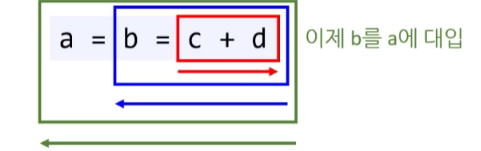

# 08.  연산자


## 1. 산술 연산자

* **산술 연산자란?**
  * +
  * -
  * *
  * /
  * %


* **산술연산자를 사용할 때 팁은 무엇인가? (힌트 : int, double)**
  * 최종 결과 값이 double형일 경우
  * 맨 마지막의 피연산자를 double형으로 바꿔주는 것이 좋다. ( 가독성이 좋다. )
  * ( 실제 업계에서도 일반적으로 하는 방식이다. 보통 분모를 double로 바꾼다. )


## 2. 증가/감소 연산자

* **증가/감소 연산자란?**
  * ++ / -- 처럼 변수의 앞(prefix)이나 뒤(postfix)에 붙어 값을 바꿔 주는 연산자이다.


* **증가/감소 연산자와 하드웨어의 관계는 어떤가?**
  * 하드웨어 자체에 기계어로 1대 1로 대응 되는 명령어다.
  * 이렇기 때문에 증감 연산자가 산술 연산자( 더하기 빼기 )보다 빠르다. 
    * ( ++num )  >  ( num = num + 1)


* **아래 <u>전위 증가 연산자 코드</u>를 <u>산술(+) 연산자 코드</u>로 바꾸시오.**

  ```C#
  int num = 10;
  int result1 = ++num;	//★
  int result2 = num;
  ```

  ```c#
  int num = 10;
  num = num + 1;			//★
  int result1 = num;
  int result2 = num;
  ```


* **아래 <u>후위 증가 연산자 코드</u>를 <u>산술(+) 연산자 코드</u>로 바꾸시오.**

  ```c#
  int num = 10;
  int result1 = num++;	//★
  int result2 = num;
  ```

  ```c#
  int num = 10;
  int result1 = num;
  num = num + 1;			//★
  int result2 = num;
  ```

  

* **부동수소점이 증감연산자를 사용하지 않는 이유**

  * 정수 처럼 순서대로 전개 된 값이 아니라 중간에 여러가지 값이 있을 수 있다. 
  * 모든 것을 만족할 수 있는 규칙이 나오기 어렵다. 
    ( 원칙상 가능하고 메뉴얼도 있지만 그 사용성 때문에 실무에서는 거의 쓰이지 않고 있다.  )

  * 결론적으로 정수형에서만 사용하자.
    ( 실수형에 증감연산자를 사용해도 컴파일 에러는 발생하지 않는다. )


* **다음 코드의 결과 값을 작성하시오. ★★★**

  ```cs
  int num1 = 0;
  int num2 = 10;
  
  int result3 = num1-- + num1-- - --num2;
  
  Console.WriteLine("num1: " + num1);
  Console.WriteLine("num2: " + num2);
  Console.WriteLine("result3: " + result3);
  ```

  ```
  num1: -2
  num2:  9
  result3: -10
  ```

  


## 3. 비트 연산자


* **비트 연산자란 무엇인가?**
  * 비트 별로 하나씩 연산하는 연산자이다.
  * 성능 향상이나 메모리 절약을 위해 임베디드, 데이터, 비트 플래그 등에서 많이 사용된다.


* **비트 연산자의 종류는?**
  * bitwise
    * &
    * |
    * ^
    * ~
  * bit shift
    * \>\>
    * \<\<


* **^ 은 어떤 연산자인가?**
  * XOR
  * 서로 다를 때 true


* **<<  는 어떤 연산자인가?**
  * 왼쪽으로 한 칸 씩 이동하는 비트 연산자이다.
  * 맨 앞에 이동한 숫자는 버린다.
  * 이동 후 생긴 빈 칸은 0으로 채운다. 
    ( 왼쪽 쉬프트의 경우에는 음수/양수 둘 다 0으로 채워진다. )
  * [주의!] 부동소수점 사용 불가 - 컴파일 error


*  **>>  는 어떤 연산자인가?**

  * 오른쪽으로 한 칸 씩 이동하는 비트 연산자이다.

  * 맨 뒤에 이동한 숫자는 버린다.

  * 부호 있는 정수형(int, long) 이동 후 생긴 빈 칸은 최상위 비트( MSB - most significant bit )에 맞게 채운다. 

    * 최상위 비트가 1이라면 1로 채운다. 

    * 최상위 비트가 0이라면 0로 채운다.
    * 이것을 arithmetic right shift(산술적)라 한다.

  * 부호 없는 정수형(uint, ulong) 이동 후 생긴 빈 칸은 0으로 채운다.

    * 이것을 logical right shift(논리적)라 한다.
  * [주의!] 부동소수점 사용 불가 - 컴파일 error


* **비트 플래그란?**
  * 비트 필드라 불리기도 한다.
  * 1byte(8bit)에 각 1bit당 상태를 저장하는 방법으로 8개의 상태를 저장하는 방식을 말한다.
  * 바이트의 개별 비트를 비트 플래그(bit flag)라 한다.
  * [용도] true(1), false(0) 같은 대량의 데이터를 integer에 짧게 저장할 때 많이 쓰인다.


* **다음 코드의 비트 플래그를 읽어보세요.**

  ```
  0100 0001 
  ```

  * 0번 비트와 6번 비트가 켜진 상태다.
  * 일반적으로 오른쪽에서 왼쪽으로 센다.


## 4. 대입 연산자

* **수학 `=`와 대입연산자 `=` 차이점은?**
  * 수학 `=` 좌항 우항이 똑같다는 의미이다.
  * 대입연산자의 `=`는 오른쪽 값을 왼쪽에 대입한다는 의미이다.


* **대입연산자 조합의 종류를 나열하시오**
  * 산순 연산자와 조합
    * /=
    * +=
    * *=
    * -=
    * %=
  * 비트 연산자와 조합
    * &=
    * |=
    * ^=
    * <<=
    * \>\>=
    * [주의!] ~= : 이런 연산자는 없다.


## 5. 비교 연산자 / 논리연산자

* **논리연산자와 비교연산자란 무엇인가?**

  * 조건식의 값을 계산하기 위해 사용하는 연산자이다.

    ( 불리언 표현식을 위해 사용된다. )

  * [응용] boolean 변수에 값을 저장할 수도 있다.


* **비교연산자는 어떤 것이 있는가?**
  * **<**
  * **<=**
  * **\>**
  * **\>=**
  * **==**
  * **!=**
  * [주의!] =< : 사용시 컴파일 에러가 난다.


* **논리연산자는 어떤 것이 있는가?**
  * &&
  * ||
  * !


* **&& 연산과 || 연산의 표현식 평가(평가 순서)를 핵심을 서술하세요.**
  * **&& 연산자**
    * 첫 번째 표현식이 거짓이면 두 번째 표현식은 평가하지 않는다.
    * 첫 번째 표현식이 참이면 두 번째 표현식도 평가한다.
  * **|| 연산자**
    * 첫 번째 표현식이 참이면 두 번째 표현식은 평가하지 않는다.
    * 첫 번째 표현식이 거짓이면 두 번째 표현식도 평가한다.
  * **short-circuit ( Short-circuit evaluation )** : 뒤에 오는 표현식을 평가하지 않아도 최종 결과가 달라지지 않을 때 뒤에 오는 표현식을 평가하지 않는 시스템입니다.


* **! ( a == b || c == d ) 의 식을 풀어보시오.**
  * !( a == b ) !( || ) !( c == d )
  * ( a != b && c != d )


* **( &, | )연산과 ( &&, || )연산의 차이점은?**

  1. 사용 용도

     * 비트 연산 ( & / | ) 

       * 비트 처리를 위해 사용
       * 주로, 비트를 이용한 연산을 한다.
         ( 부울 판단도 할 수 있긴 하나 주목적이 아니다. )
  
     * 논리 연산 ( && / || ) 
  
       * 부울 판단
       * "부울 데이터 유형"에서만 작동합니다.
         논리 조건을 검사 할 때만 사용됩니다.
  2. 비교 데이터
  
     * 비트 연산 ( & / | )  : Integer, Boolean
     * 논리 연산 ( && / || )  : Boolean
  3. 표현식 평가 ( 평가 순서 )
  
     * & / | : 비트연산
     * 앞의 결과와 상관 없이 모두 평가한다.
       (ex) & 앞이 false여도 뒤에 확인 
     * && / || : 논리연산
       앞의 결과에 따라 두 번째 연산을 진행하지 않을 수 있다. 
       (ex) && 앞이 false면 종료


## 6. 조건 연산자 ( 삼항 연산자 )

* **조건 연산자 ( 삼항 연산자 )는 무엇인가?**
  * ? 와 : 두 기호를 사용하는 연산자이다.
  * (불리언 표현식)을 평가하여 참과 거짓일 때 서로 다른 값을 반환 한다.


* **조건 연산자 ( 삼항 연산자 )의 사용하기 좋은 시점은 언제인가?**
  * 간단한 비교를 할 때만 조건 연산자를 사용한다. ( 가독성 )
  * if / else 문을 사용하는 것보다 빠를 수 있다.
  * [주의!] 체인을 걸어서 사용하는 방법은 너무 복잡하고 가독성이 떨어지기 때문에 사용하지 않는 것을 추천한다. (ex)  a  ?  b  :  c  ?  d  :  e  


* **[ 참고 ] 삼항연산자 최적화**

  하드웨어와 깊이 관련된 프로그래머가 삼항연산자를 여러 개 사용하여 최적화 시키는 경우도 있습니다. 
  ( 조건문 쓰는 것 보다 빠르다. ) 

  하지만 이렇게 사용할 경우 코드 자체가 서로 읽기가 어렵고, 최근에는 컴파일러가 자체적으로 코드를 하드웨어 최적화에 맞게 만드는 방법도 있기 때문에 지양하고 있는 중이다.


* [예정] 널연산자와 관련 된 질문 나중에 추가 예정


## 7. 우선순위 / 결합 순서 / 평가 순서

* **우선 순위는 무엇인가?** 
  * 연산자 마다 계산하는 우선순위가 있다. ( 사칙연산의 우선순위를 떠올리면 된다. )
  * 단항 => 사칙연산 => 비트 쉬프트( << , >>) => 비교 연산자( >=, <=) => 같음 연산자( == , != ) => 비트 연산( & ^ | ) => 논리 연산( && || ) => 조건연산 ( 삼항연산 ) => 대입 연산자
    * 단항 : 부호( + , - ), !, 타입캐스팅, sizeof


* **결합 순서는 무엇인가?**

  * 연산자들의 계산 방향과 우선 순위를 고려한 결합 순서라고 보면 된다.
  * 일반적으로 '왼쪽에서 오른쪽'
  * 소수의 연산자만 오른쪽에서 왼쪽
    * <u>대입, 조건, 단항 (prefix),  연산자</u>만 오른쪽에서 왼쪽으로 순으로 실행된다.

  


* **결합 순서에 맞게 다음 식을 괄호 표시 하시오.**

  ```c#
  x = a ? b : c ? d : e;
  ```

  ```c#
  x = a ? b : (c ? d : e);
  ```


* **우선순위와 평가 순서는 무엇이 다른가?**

  * 평가 순서 => 우선순위, 결합순서
  * 평가 순서 대로 평가를 진행 한 후 우선순위에 맞게 결합해서 결과 값을 낸다.
    ( 평가 순서는 왼쪽에서 오른쪽으로 정해진 규칙에 따라 진행된다.  )

  * **a || b && c**
    a가 참 일때는 b와 c를  평가하지 않음
    a가 거짓이고 b가 참이면 c를 평가함
    a가 거짓이고 b가 거짓이면 c를 평가하지 않음

    **a && b || c**
    a는 거짓 일때 b는 평가하지 않고 c는 평가를 하게 됨
    a가 참이고 b가 참일때 c는 평가하지 않음
    a가 참이고 b가 거짓일때 c를 평가함


```c#
using System;

namespace ASCIICodeHelloWorld
{
    class Program
    {
        static void Main(string[] args)
        {
            int a = 0;
            int b = 0;
            int c = 0;

            // 평가O		평가X		평가X
            //  참		  .			.
            if (++a == 1 || ++b == 1 && ++c == 1) { }
            Console.WriteLine("{0} {1} {2}", a, b, c);	//1 0 0
            a = b = c = 0;

            // 평가O      평가O      평가O
            // 거짓        참       참/거짓
            if (++a == 0 || ++b == 1 && ++c == 1) { }
            Console.WriteLine("{0} {1} {2}", a, b, c);	//1 1 1
            a = b = c = 0;

            // 평가O      평가O     평가X
            // 거짓       거짓        .
            if (++a == 0 || ++b == 0 && ++c == 1) { }
            Console.WriteLine("{0} {1} {2}", a, b, c);	//1 1 0
            a = b = c = 0;
            Console.WriteLine();


            // 평가O      평가X		평가O
            // 거짓         .      참/거짓
            if (++a == 0 && ++b == 1 || ++c == 1) { }
            Console.WriteLine("{0} {1} {2}", a, b, c);	//1 0 1
            a = b = c = 0;

            // 평가O      평가O     평가X
            //  참         참        .
            if (++a == 1 && ++b == 1 || ++c == 1) { }
            Console.WriteLine("{0} {1} {2}", a, b, c);	//1 1 0
            a = b = c = 0;

            // 평가O      평가O     평가O
            //  참        거짓     참/거짓
            if (++a == 1 && ++b == 0 || ++c == 1) { }
            Console.WriteLine("{0} {1} {2}", a, b, c);	//1 1 1
        }
    }
}
```

```
1 0 0
1 1 1
1 1 0

1 0 1
1 1 0
1 1 1
```


