# 08.  연산자

## 1. 연산자

* 연산자 ( operator )
* 하나 이상의 피연산자(operand)를 가지고 연산을 한다.
  * 단항(unary) 연산자
  * 이항(binary) 연산자
  * 삼항(ternary) 연산자


**[ 단항 연산자 ]**

**unary operator**

* 산술 연산자 :  `단항 +` `단항 -` 
* 증가 / 감소 연산자 : `++` `--`
* 비트 연산자 : `~` 
* 논리 연산자 : `!`
* 변환 연산자(캐스트) : `( )` 
* 기타 ( 나중에 정리 )
  * `^x`
  * `await`
  * `&x` / `*x`
  * `true 및 false 연산자`


## 1. 산술 연산자

**Arithmetic operators**

수치 형식의 데이터를 다루는 연산자이다.

* `+`  ( add )
* `-`  ( subtract )
* `*`  ( multiply )
* `/`  ( divide )
* `%`  ( remainder, modulus )


---

**`+` 연산자 ( 더하기 연산자)**

```c#
int number1 = 10;
int number2 = 30;
int reuslt = number1 + number2
```


**`-` 연산자 ( 빼기 연산자 )**

연산 결과가 음수일 경우 조심해야 한다!

부호 없는 피연산자끼리 빼서 음수가 나오면 그 값을 표현할 수 없기 때문에 언더플로어가 발생한다.

```c#
int number1 = 10;
int number2 = 30;

int result1 = number1 - number2;				// -20
uint result = (uint)number1 - (uint)number2;	// 4294967276
```


**`*` 연산자 ( 곱하기 연산자 )**

두 피연산자를 곱한다.

```c#
int number1 = 10;
int number2 = 30;

int result1 = number1 * number2;
```


**`/` 연산자 ( 나누기 - 몫 연산자 )**

<u>정수형 피연산자</u>의 경우 결과가 제대로 나오지 않을 수 있다.

```c#
int number1 = 10;
int nubmer2 = 30;
int result1 = number1 / number2;				// 0
double result2 = number1 / number2;				// 0
```

연산자 우선순위 때문에 연산을 int형으로 해서 double에 대입하게 되는 것이다.
올바르게 계산하려면 **명시적 변환**을 해야 한다.

```c#
double result3 = (double)number1 / (double)number2;				// 0
```

* 둘 중에 하나만 double로 바꾸면 된다. 자동으로 묵시적 변환이 일어난 뒤 연산하게 된다.
  ( 실제 업계에서도 일반적으로 하는 방식이다. 보통 분모를 double로 바꾼다. )


**`%`연산자 ( 나누기 - 나머지 연산자 )**

`/` 연산자는 나눗셈의 몫을 구한다.

`%` 연산자는 나눗셈의 나머지를 구한다.

```c#
int number1 = 15;
int number2 = 30;
int result = number1 % number2;		// 15
```


## 2. 증가/감소 연산자

* **Increment And Decrement Operators**

연산 기호를 변수의 앞이나 뒤에 붙일 수 있다.

하드웨어 도는 것과 꽤 관련 있는 연산자 이다.


**++ 연산자**

* 피 연산자 하나의 값을 1만큼 증가한다.
* 변수의 앞( 전위 )이나 뒤( 후위 )에 붙인다.
* 전위 ( prefix ) / 후위 ( postfix )

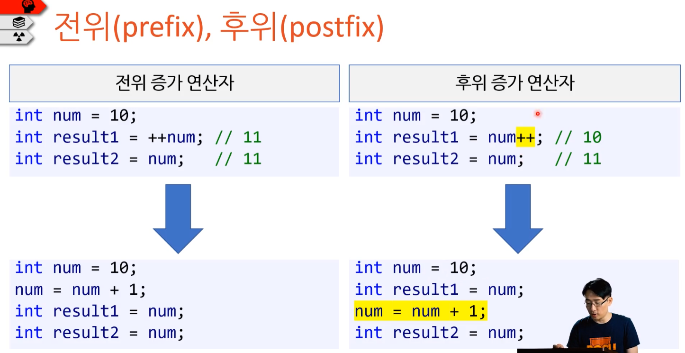


**[중요]** **증가/감소 연산자와 하드웨어**

증감 연산자로 정수 숫자를 하나만 증가시키는 것은 하드웨어 기계어에서 있는 명령어다.
( 하드웨어 자체에 1대 1로 대응 되는 명령어다. )

증감 연산자가 더하기 연산자로 숫자1 더하는 명령어 보다 빠르다. ( num = num + 1)


**-- 연산자**

* 피 연산자 하나의 값을 1만큼 감소한다.
* 변수의 앞( 전위 )이나 뒤( 후위 )에 붙인다.

```c#
int num1 = 10;
int num2 = 'a';		// 0x61		// 0b97

num1++;		// 'b'	// 0x62		// 0b98
++num1;		// 'c'	// 0x63		// 0b99
num2--;		// 'b'	// 0x62		// 0b98
--num2;		// 'a'	// 0x61		// 0b97
```


---


**부동수소점이 증감연산자를 사용할 수 없는 이유**

정수 처럼 순서대로 전개 된 값이 아니라 중간에 여러가지 값이 있을 수 있다. 
모든 것을 만족할 수 있는 규칙이 나오기 어렵다. 
( 원칙상 가능하고 메뉴얼도 있지만 그 사용성 때문에 실무에서는 거의 쓰이지 않고 있다.  )

결론적으로 정수형에서만 사용하자.
( 실수형에 증감연산자를 사용해도 컴파일 에러는 발생하지 않는다. )


---


## 3. 비트 연산자

[책] 이것이 C#이다 : p131, p136 내용 추가 예정


### 3.1. 비트 연산자

* **bitwise**
* **bit operator**

비트 별로 하나씩 연산하겠다는 의미이다.

성능 향상이나 메모리 절약을 위해 임베디드, 데이터, 비트 플래그 등에서 많이 사용된다.

( 비트 플래그 : 참 거짓 같은 대량의 데이터를 integer에 짧게 저장할 때 많이 쓰인다. )

---

* & (and)
* | (or)
* ^ (xor) - 서로 다를 때 true
* ~ (not)

---


#### 1)    &   (and)

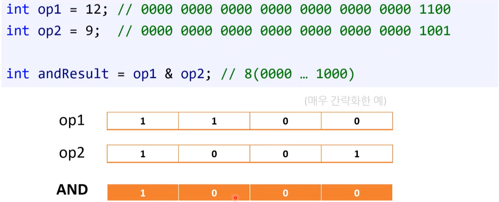


#### 2)    |   (or)

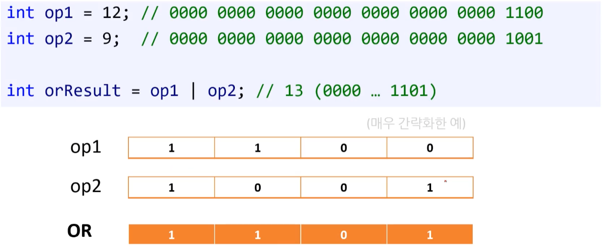


#### 3)   ^   (xor) 

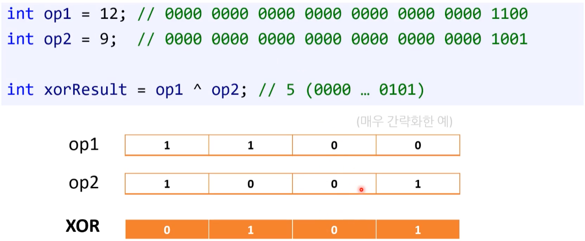


#### 4)   ~   (not)

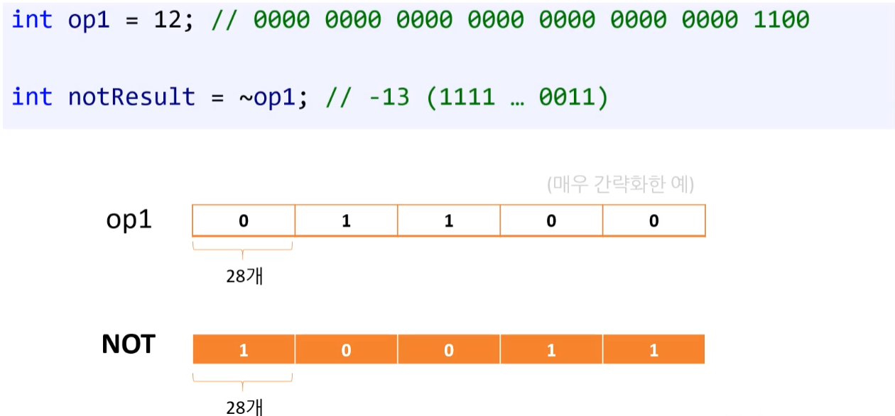


### 3.2. 비트 이동 연산자

* **bit shift operator ( 줄줄이 이동 )**

한국 말로는 번역할 말이 없어서 이동 연산자로 사용 한 것이다.

하드웨어 CPU에서 지원하는 연산자이다.

비트를 왼쪽 혹은 오른쪽으로 움직이는 연산들이다.

[주의!] 부동소수점 사용 불가 - 컴파일 error

---

* << ( left - shift )
* \>> ( right - shift )

---


#### 1)   <<  ( left - shift )

* 맨 앞에 이동한 숫자는 버린다.
* 이동 후 생긴 빈 칸은 0으로 채운다. 
  ( 왼쪽 쉬프트의 경우에는 음수/양수 둘 다 0으로 채워집니다. )


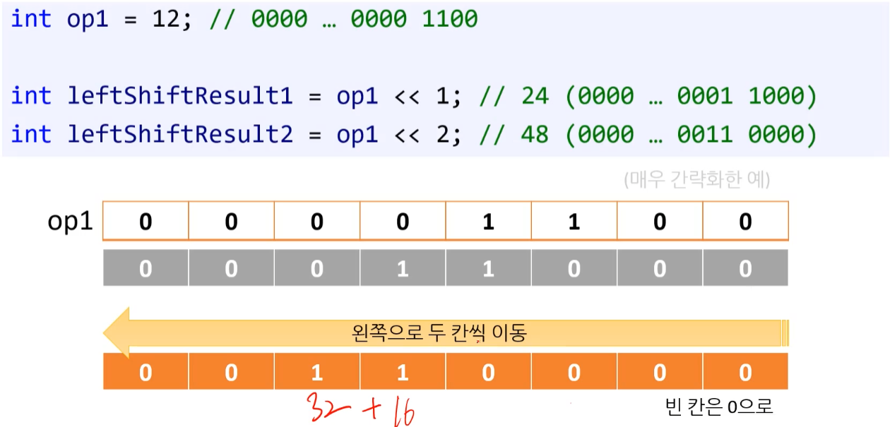


#### 2)   >>  ( right - shift )

* 맨 뒤에 이동한 숫자는 버린다.
* 이동 후 생긴 빈 칸은 최상위 비트( MSB - most significant bit )에 맞게 채운다. 
  * 최상위 비트가 1이라면 1로 채운다. 

  * 최상위 비트가 0이라면 0로 채운다.

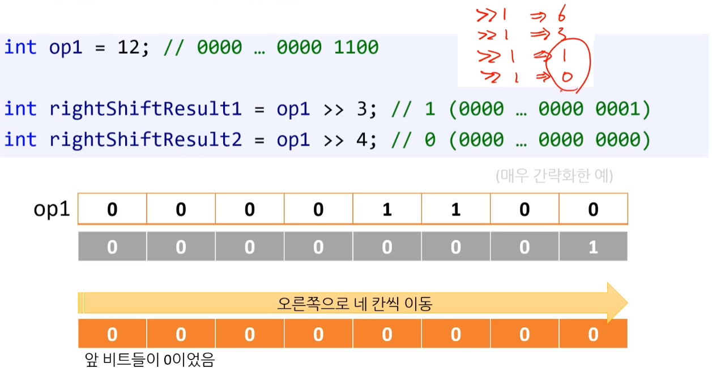


```c#
uint a = 0b_1000_0000_0000_0000_0000_0000_0000_0000;
Console.WriteLine($"Before: {Convert.ToString(a, toBase: 2),32}");

uint b = a >> 3;
Console.WriteLine($"After:  {Convert.ToString(b, toBase: 2).PadLeft(32, '0'),32}");
// Output:
// Before: 10000000000000000000000000000000
// After:  00010000000000000000000000000000

int c = (int)a;
Console.WriteLine($"Before: {Convert.ToString(c, toBase: 2),32}");

int d = c >> 3;
Console.WriteLine($"After:  {Convert.ToString(d, toBase: 2).PadLeft(32, '0'),32}");
// Output:
// Before: 10000000000000000000000000000000
// After:  11110000000000000000000000000000
```


**[  logical right shift(논리적)와 arithmetic right shift(산술적)  ]**

부호 없는 정수형(uint, ulong)의 경우 right-shift를 해도 0으로 채워지는데 이것을 이걸 logical right shift(논리적)라고 한다. 

부호 있는 정수형(int, long)의 right shift는 arithmetic right shift(산술적)이라고 합니다.


#### 3) 비트 플래그 (bit flag)

메모리의 최소 크기 단위는 1바이트로 변수의 크기는 적어도 1바이트 이상이다. 8비트(1바이트)는 비트가 8개로 8가지 상태를 저장할 수 있다. 
( 이는 1바이트를 사용해서 1비트만 사용하고 7비트를 낭비함으로써 1가지 상태만 저장하는 bool 자료형보다 훨씬 효율적이다. )

여기서 **바이트의 개별 비트를 비트 플래그(bit flag)라고 한다**. ( 비트 필드라 불리기도 한다. )

> 플래그(flag)는 깃발에서 유래한 용어다. 보통 깃발을 위로 올리면 on, 아래로 내리면 off를 뜻한다. 
> 이걸 정수의 비트에 활용하는 건데 비트가 1이면 on, 0이면 off를 나타낸다.


플래그를 설명할 때는 일반적으로 오른쪽에서 왼쪽으로 센다. 예를 들어, 아래는 0번 비트와 6번 비트가 켜진 상태다.

```
0100 0001    // 0번 비트와 6번 비트가 켜진 상태다.
```


```C#
using System;

namespace BitFlag
{
    class Program
    {
        static void Main(string[] args)
        {
            const int BIT_FLAG_SIZE = 8;

            byte bitFlags = 0;
            
            byte mask1 = 1 << 2;
            bitFlags |= mask1;
            Console.WriteLine("bitFlags: " + Convert.ToString(bitFlags, 2).PadLeft(BIT_FLAG_SIZE, '0'));

            byte mask3 = (1 << 3) | (1 << 5);
            bitFlags |= mask3;
            Console.WriteLine("bitFlags: " + Convert.ToString(bitFlags, 2).PadLeft(BIT_FLAG_SIZE, '0'));

            bitFlags &= (byte)~mask1;	// mask1을 꺼주기 위해 not과 and를 사용한다.
            Console.WriteLine("bitFlags: " + Convert.ToString(bitFlags, 2).PadLeft(BIT_FLAG_SIZE, '0'));
            
            bitFlags &= 0;				// 전부 끈다 - 0으로 만든다.
            Console.WriteLine("bitFlags: " + Convert.ToString(bitFlags, 2).PadLeft(BIT_FLAG_SIZE, '0'));

            char char1 = 'A';
            int result1 = char1 | ' ';							// ' ' : 32
            Console.WriteLine("result1: " + (char)result1);		// 'a'

            char char2 = 'a';
            int result2 = char2 & '_';							// '_' : 95
            Console.WriteLine("result2: " + (char)result2);		// 'A'
        }
    }
}
```


#### 4) 기타

* `x & ~1` : 단순 1빼기가 아니다 홀수만 1을 빼는 비트연산이다.


## 4. 대입 연산자

* assignment operator
* 할당 연산자 ( 동의어 )


**수학에서 `=` 기호**

* 좌항 우항이 똑같다는 의미이다.


**프로그래밍에서 `=` 기호**

1) 대입이라는 의미이다.
2) 오른쪽에 있는 값을 왼쪽에 대입하는 것이다.


**[ 기본형 / 축약형 ]**

---

```csharp
x = x op y			// 기본형 ( 단순 대입 연산자 - simple assignment operator )
```

```csharp
x op= y				// 축약형 ( 복합 대입 연산자 - compound assignment operator ) 
```

* /= 		
* +=
* *=
* -=
* %=

---

* &=
* |=
* ^=
* <<=
* \>\>=

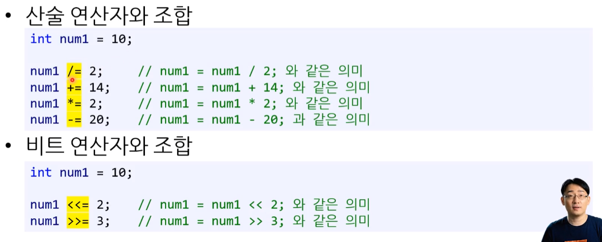

* [주의!] ~= : 이런 연산자는 없다.


## 5. 비교 연산자  / 논리 연산자

### 5.1. 비교 연산자

**Relational Operator** **( comparative operator )**

두피 연산자 사이의 관계를 평가하는 연산자이다. 

* **관계 연산자 ( 비교 연산자 )**
  * 직역 : 관계 연산자
  * 번역 : 비교 연산자

[참고] 수학 기호랑 비슷하나 프로그래밍에서는 명확하게 하기 위해 부호를 두 개 쓰는 것이다.

---

* **<**
* **<=**
* **\>**
* **\>=**
  * **=< : 사용 시 컴파일 에러나 난다.**

---

* **==**

* **!=**
  * 수학에서 사용하는 기호 ( ≠ )가 키보드에 없어서 != 를 사용한다.
  
  * 연산 결과는 논리 형식, 즉 bool입니다.
  
  * [참고] != 연산자의 경우 다른 프로그래밍 언어 언어에서 <> , !== 형태로 사용되기도 한다. 
  
    (ex) name == "Pope" - 일반적인 방식
    * "Pope" == name : 좌항 우항을 바꿔서 사용 할 수는 있지만 사용하는 경우는 드물다. 

---


### 5.2. 논리 연산자

**Logical Operator** ( Boolean Operation 이라고도 불린다. )

피연산자로 오는 두 개의 진릿값이 모드 참이어야 그 결고가 참이 되고, 그 외에는 모두 거짓이 됩니다.


#### 1) 개념

논리 연산자 AND( && )와 OR( || )는 비트 연산자 & 랑 | 와 비슷하다.

* **&&, ||, !**


**[ AND ( && ) ]**

* 좌항, 우항이 모두 참이면 참이다. ( 하나라도 참이 아니면 거짓 )

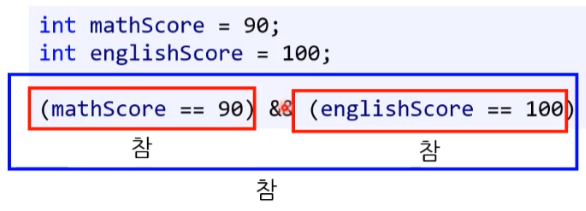


**[ OR ( || ) ]**

* 좌항 혹은 우항이 하나라도 참이면 참이다. ( 둘 다 참이 아니면 거짓 )

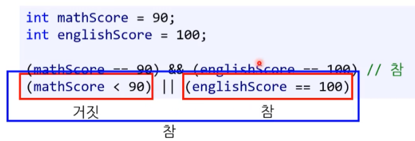


**[ ! ]**

* 부정연산자
* 거짓을 참으로, 참을 거짓으로 만든다.

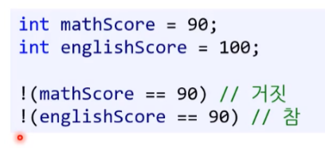


**[ 응용 : 변수 저장 ]**

* 논리 연산자의 값을 따로 boolean 변수에 저장하여 사용할 수도 있다. 

```csharp
int mathScore;
int englishScore;
...
bool bgame = (mathScore >= 90) || (englishScore < 80);
```


**[ 진리표 ]**

※ 나중에 기입 예정

* [책] 이것이 C#이다 : p125 ~ p126


#### 2) 표현식 평가 ( 평가 순서 ) ★

if 문 안의 표현식들은 종종 평가되지 않을 때가 있다.

( 평가가 되지 않는 다는 것은 실행이 되지 않는다는 의미이다. )

* 단락 평가 ( short-circuiting )


##### (1)  ||  -  OR

* 첫 번째 표현식이 참이면 두 번째 표현식은 평가하지 않는다.
* 첫 번째 표현식이 거짓이면 두 번째 표현식도 평가한다.

---

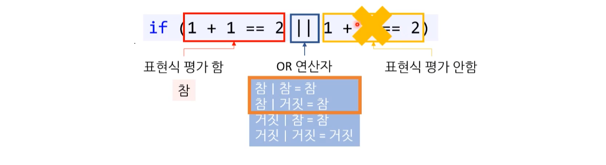

---

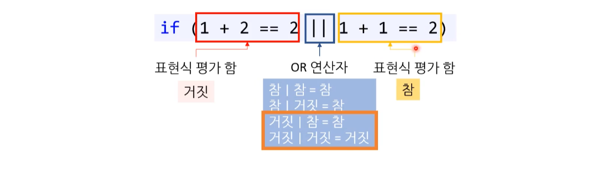

---


**[ 면접 문제 ]**

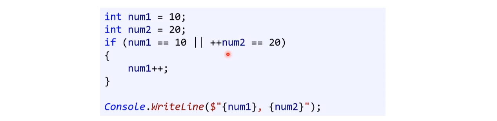

---


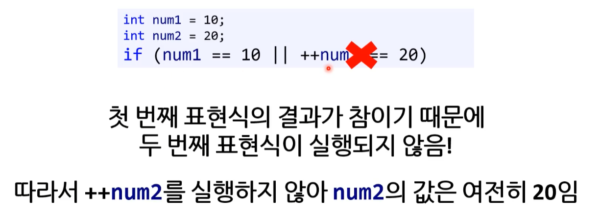


##### (2) &&  -  AND

* 첫 번째 표현식이 거짓이면 두 번째 표현식은 평가하지 않는다.
* 첫 번째 표현식이 참이면 두 번째 표현식도 평가한다.

---

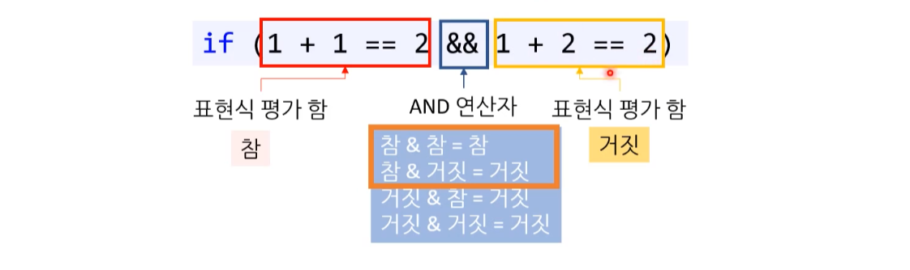

---

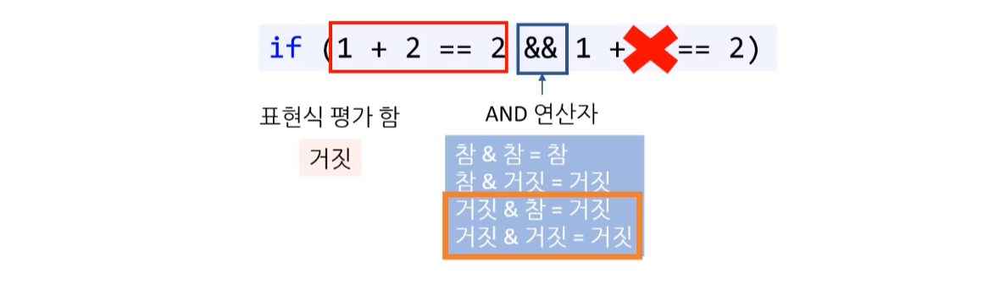

---


##### (3)  ! ( a == b || c == d )

* !( P => Q )
  * !(P) !(=>) !(Q)
  * !P <= !Q
  * !Q => !P
* **! ( a == b || c == d )**
  * !( a == b ) !( || ) !( c == d )
  * **( a != b && c != d )**


#### 3) ( &, | )연산과 ( &&, || )연산의 차이

**(1) 사용 용도**

* 비트 연산 ( & / | ) 
  * 비트 처리를 위해 사용
  * 주로, 비트를 이용한 연산을 한다.
    ( 부울 판단도 할 수 있긴 하나 주목적이 아니다. )
* 논리 연산 ( && / || ) 
  * 부울 판단
  * "부울 데이터 유형"에서만 작동합니다.
    논리 조건을 검사 할 때만 사용됩니다.


**(2) 비교 데이터**

* 비트 연산 ( & / | )  : Integer, Boolean
* 논리 연산 ( && / || )  : Boolean


**(3) 표현식 평가 ( 평가 순서 )**

* & / | : 비트연산
  앞의 결과와 상관 없이 모두 평가한다.
  (ex) & 앞이 false여도 뒤에 확인 

* && / || : 논리연산
  앞의 결과에 따라 두 번째 연산을 진행하지 않을 수 있다. 
  (ex) && 앞이 false면 종료

  


## 6. 조건 연산자 ( 삼항 연산자 )

**Conditional Operator ( 조건 연산자 )**

**ternary conditional operator ( 삼항 연산자 )**

* **ternary operator ( 삼항 연산자 )**
* '삼항 연사자' 라고도 쓰지만 '조건 연산자'로 좀 더 많이 사용된다.

[참고] C# 3.0 이상부터 지원

```c#
if (num1 > num2)
{
	max = num1;
}
else
{
	max = num2;
}
```

```c#
max = (num1 > num2) ? num1 : num2;		// 조건연산자
```


### 6.1. 개념

* ? 와 : 두 기호를 사용한다.
* (불리언 표현식)을 평가하여 참과 거짓일 때 서로 다른 값을 반환 한다.


### 6.2. 사용 시점

**사용 O**

* 간단한 비교를 할 때만 조건 연산자를 사용한다.  ( 가독성 )
  * 간단한 조건 연산자는 가독성에서도 좋아서 사용하는 것을 권장한다.
* if / else 문을 사용하는 것보다 빠를 수 있다.


**사용 X**

* 과남용 하지 말 것

* 체인을 걸어서 사용하는 방법은 너무 복잡하고 가독성이 떨어지기 때문에 사용하지 않는 것을 추천한다.

  (ex)  a  ?  b  :  c  ?  d  :  e  

> ---
>
> **[ 예외 ]**
>
> 하드웨어와 깊이 관련된 프로그래머가 삼항연산자를 여러 개 사용하여 최적화 시키는 경우도 있습니다. 
> ( 조건문 쓰는 것 보다 빠르다. ) 
>
> 하지만 이렇게 사용할 경우 코드 자체가 서로 읽기가 어렵고, 최근에는 컴파일러가 자체적으로 코드를 하드웨어 최적화에 맞게 만드는 방법도 있기 때문에 지양하고 있는 중이다.
>
> ---


### 6.3. null 조건 연산자

( 정리 할 예정 )

* C# 6.0에서 도입 되었습니다.
* 객체의 멤버에 접근하기 전에 해당 객체가 null인지 검사하여 그 결과가 참(개체가 null)이면 그 결과로 null을 반환하고, 그렇지 않은 경우에는 `.` 뒤에 지정된 멤버를 반환합니다.
* ?[]도 동일한 기능을 수행하는 연산자 입니다.
  * 차이점 : 객체의 멤버 접근이 아닌 배열과 같은 컬렉션 객체의 첨자를 이용한 참조에 사용된다는 점이 다릅니다.


[참고] 이 연산자는 Elvis(라큰롤의 제왕 엘비스)라는 별명을 갖고 있는데 `?.`에서 물음표 기호의 머리 부분을 오른쪽으로 늘려보면 특유의 헤어스타일을 한 그의 얼굴이 연상되기 때문이다.

```csharp
using System.Collections;
using static System.Console;

namespace NullConditionalOperator
{
    class MainApp
    {
        static void Main(string[] args)
        {
            ArrayList a = null;
            a?.Add("야구");
            a?.Add("축구");
            WriteLine($"Count : {a?.Count}");
            WriteLine($"{a?[0]}");
            WriteLine($"{a?[1]}");
            
            a = new ArrayList();
            a?.Add("야구");
            a?.Add("축구");
            WriteLine($"Count : {a?.Count}");
            WriteLine($"{a?[0]}");
            WriteLine($"{a?[1]}");
        }
    }
}
```

```
Count :


Count : 2
야구
축구
```


## 7. 우선순위 / 결합 순서 / 평가 순서

**※ 면접에서 많이 나오는 개념이다.**

* **우선순위**
* **결합 순서**
* **평가 순서**

---

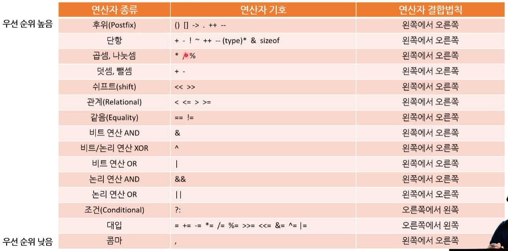

[참고] 이미지에서 단항 연산자의 연산자 결합법칙이 잘 못 표기 되어 있다. ( 올바른 표기 : 오른쪽에서 왼쪽 )

[이 링크로 표 다시 바꿀 예정] https://learn.microsoft.com/ko-kr/dotnet/csharp/language-reference/operators/#operator-precedence

* [도서] 이것이 C#이다 : p143

---


**우선순위**

* operator precedence

* 단항 => 사칙연산 => 쉬프트 => 비교 연산자 => 같음 연산자 => 비트 연산 => 논리 연산 => 조건연산 ( 삼항연산 ) => 대입

* [참고] 자주 안 써서 찾아봐야 하는 연산자 우선순위가 있다면 괄호( )를 일부러 쳐준다.


**결합 순서**

* 일반적으로 '왼쪽에서 오른쪽'
* 소수의 연산자만 오른쪽에서 왼쪽
  * <u>단항 (+prefix), 대입, 조건 연산자</u>만 오른쪽에서 왼쪽으로 순으로 실행된다.

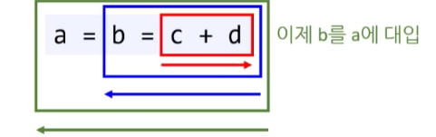


**평가 순서 ★**

* 논리 연산을 할 때 나오는 순서 개념이다.
* 자세한 건 아래 '[주의!] 우선순위와 평가 순서는 다르다.'글 참고


### 8.1. 실습 예제

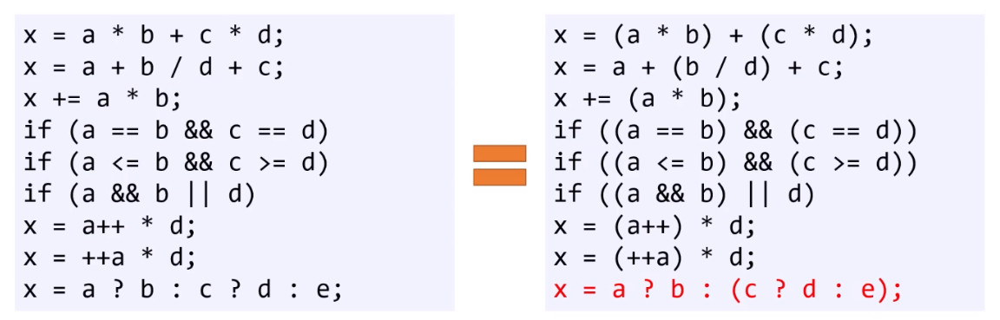


### 8.2. [주의!] 우선순위와 평가 순서는 다르다.

**★ 시험에도 많이 나오는 부분이다. ★**

평가 순서 대로 평가를 진행 한 후 우선순위에 맞게 결합해서 결과 값을 낸다.
( 평가 순서는 왼쪽에서 오른쪽으로 정해진 규칙에 따라 진행된다.  )

* &&가 || 보다 우선순위가 높다.

* &&와 ||  연산자는 왼쪽에 있는 표현식의 평가를 강제한다.

* **[키워드] sequence point, if short circuit**
* **short-circuit ( Short-circuit evaluation )** : 뒤에 오는 표현식을 평가하지 않아도 최종 결과가 달라지지 않을 때 뒤에 오는 표현식을 평가하지 않는 시스템을 말한다.
  * Short-circuit ( 단락 계산 )

  * Short-circuit evaluation ( 단축 평가 )

* **sequence point (시퀀스 포인트)** : 프로그램이 실행이 다음 단계로 넘어가기 전에 모든 부수 효과들이 확실하게 평가되는 포인트(순서를 나누는 기준)이다. C++에서 구문이 있는 세미콜론은 시퀀스 포인트를 표시한다. 

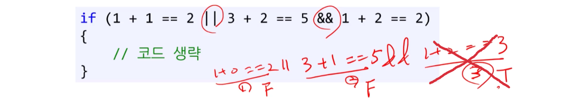


---

**a || b && c**
a가 참 일때는 b와 c를  평가하지 않음
a가 거짓이고 b가 참이면 c를 평가함
a가 거짓이고 b가 거짓이면 c를 평가하지 않음

**a && b || c**
a는 거짓 일때 b는 평가하지 않고 c는 평가를 하게 됨
a가 참이고 b가 참일때 c는 평가하지 않음
a가 참이고 b가 거짓일때 c를 평가함

[주의!] 코드 자체가 복잡해지며, 실수를 유발 할 수 있기 때문에 논리 연산자에서는 가능한 증감 연산자를 함께 사용하지 않는게 좋다.

```c#
using System;

namespace ASCIICodeHelloWorld
{
    class Program
    {
        static void Main(string[] args)
        {
            int a = 0;
            int b = 0;
            int c = 0;

            // 평가O		평가X		평가X
            //  참		  .			.
            if (++a == 1 || ++b == 1 && ++c == 1) { }
            Console.WriteLine("{0} {1} {2}", a, b, c);
            a = b = c = 0;

            // 평가O      평가O      평가O
            // 거짓        참       참/거짓
            if (++a == 0 || ++b == 1 && ++c == 1) { }
            Console.WriteLine("{0} {1} {2}", a, b, c);
            a = b = c = 0;

            // 평가O      평가O     평가X
            // 거짓       거짓        .
            if (++a == 0 || ++b == 0 && ++c == 1) { }
            Console.WriteLine("{0} {1} {2}", a, b, c);
            a = b = c = 0;
            Console.WriteLine();


            // 평가O      평가X		평가O
            // 거짓         .      참/거짓
            if (++a == 0 && ++b == 1 || ++c == 1) { }
            Console.WriteLine("{0} {1} {2}", a, b, c);
            a = b = c = 0;

            // 평가O      평가O     평가X
            //  참         참        .
            if (++a == 1 && ++b == 1 || ++c == 1) { }
            Console.WriteLine("{0} {1} {2}", a, b, c);
            a = b = c = 0;

            // 평가O      평가O     평가O
            //  참        거짓     참/거짓
            if (++a == 1 && ++b == 0 || ++c == 1) { }
            Console.WriteLine("{0} {1} {2}", a, b, c);
        }
    }
}
```

```
1 0 0
1 1 1
1 1 0

1 0 1
1 1 0
1 1 1
```


## 8. 그 밖의 연산자


### **형변환 연산자(캐스트)**

**cast operator**

데이터 형식을 변환(casting)한다. 

* `( )`

```csharp
int number = (int)3.14;
```


### **문자열 연결 연산자** 

addition operator 

* `+` / `+=`
* 문자열과 함께 사용하면 정수형, 실수형, bool형 모두 문자열로 취급하게 된다.

```csharp
"Hello" + "World"
```

```csharp
"Hello World"
```

[주의!] `-` 연산자는 사용할 수 없다. 에러 발생!


### 나열(콤마) 연산자

comma opertor

콤마를 구분자로 하여 한 문장에 변수 여러 개를 선언할 때 사용합니다.
( 자주 사용하지는 않는 듯 하다. 알아 만 두자. )

```csharp
int a = 10, b = 20, c = 30;
```


### sizeof 연산자

단항 연산자로 데이터 형식 자체의 크기를 구하는 데 사용합니다.

운영체제와 컴퓨터마다 결괏값 이 다르게 나올 수 있습니다.

```csharp
sizeof(double)
```

```
8
```


### [] 첨자 연산자

컬렉션이나 문자열, 배열 등에 데이터를 접근하기 위해 사용되는 연산자다.

* 0번째부터 시작하는 숫자를 인덱스(index) 또는 첨자(subscript)라고 한다.
  * 0 기반 (zero base) 또는 제로 오프쎗(zero offset)이라고 해서 배열과 같은 데이터 구조의 인덱스는 0번째부터 시작된다. 

* 컬렉션이나 문자열, 배열 등에 직접 인덱스([ ]) 기호를 사용하여 특정 인덱스에 해당하는 값을 뽑아 낼 수 있다.

```csharp
"ABC"[1]
```

```csharp
'B'
```


### new 연산자

* new 키워드는 형식을 인스턴스화(instantiate) 시켜 주는 연산자이다.
* 특정 형식(배열, 컬렉션 등)을 실제 사용 가능한 개체로 만들어 줍니다.
* new 연산자를 사용하여 특정 크기만 메모리 영역을 잡을 수 있다.

```csharp
int[] numbers;
numbers = new int[3];
```


### 람다 연산자

* Lambda operator

* 람다 연산자를 사용하면 함수를 줄여서 표현할 수 있습니다.
* 처음 사용이 어색하지만 코드의 간결함을 유지할 수 있는 형태로 프로그램 코드를 작성할 수 있습니다.

[참고1] 프로그래밍에서 화살표 함수(arrow function) 또는 화살표 메서드는 람디식(lamda expression)의 또 다른 이름입니다. 

[참고2] 함수 축약의 영어 표현은 'expression bodied method'로 '식 본문 메서드'로 번역할 수 있습니다.

```csharp
using System;

class ArrowFunction
{
    static void Main()
    {
        Hi();
        Multiply(3, 5);
    }

    static void Hi() => Console.WriteLine("안녕하세요.");
    static void Multiply(int a, int b) => Console.WriteLine(a * b);
}
```

```
안녕하세요.
15
```


### ?? - null 병합 연산자

**Null-coalescing operator**

* C# 3.0 이상 지원

* **?? 연산자 : 왼쪽 피연산자의 값이 NULL인 경우 ??의 오른쪽 피연산자 값을 리턴하고, 아니면 ??의 왼쪽 피연산자 값을 리턴한다.** 

* ?? 연산자는 왼쪽 피연산자가 NULL이 허용되는 데이타 타입인 경우에만 사용된다.
* 예를 들어, int 타입은 NULL을 가질 수 없으므로 허용되지 않지만, [Nullable](https://www.csharpstudy.com/CSharp/CSharp-datatype.aspx) 즉 int? 타입은 허용된다.

```csharp
string s = str ?? "(널)";
```

[설명] 변수 str가 null 이면 "(널)" 이라는 문자열을 s 에 대입한다. null 이 아니면 str의 값을 s 에 대입.


> ---
>
> [ 김포프 ]
>
> 저희 회사에서는 금지한 연산자입니다. 의미가 한번에 이해 안 되고 다른 언어와 호환이 안 되기 때문입니다.
>
> * a != null ? a : b 
> * if문
>
> 이 두 가지로 대체하여 해결합니다.
>
> ---


