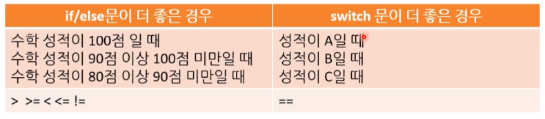

# 01-02 조건문 ( if, switch )


## 1. if 문

* **else if문의 생성 과정을 코드로 작성하시오.**

  ```c#
  if
  {
  	...
  }
  else		//결합
  {	
  	if()	//결합
  	{
  		...
  	}
  }
  ```

  

* **else if문의 내재된 조건은 무엇인가?**
  
  * else if문은 if문이 아니다. 
  * 내재된 조건 자체가 앞의 if 조건문이 거짓이라는 것이 포함된다.
    ( 이로 인한 중복 코드 사용을 주의하자. )


* **if문 작성시 코딩 습관 2가지를 작성하시오.**
  1. 논리적으로 말이 되는지 확인 ( 테스트, 디버깅 - 필수 )
  2. 불필요한 반복 로직이 들어갔는지 확인


* **배제하는 습관을 가져야 하는 이유?**
  * 매우 비효율적이다. 
  * 배재 습관이 없고 의심하게 된다면 너무 많은 경우의 수를 생각하게 된다. 
  * 디버깅 할 때도 이런 **<u>배재하는 생각 습관</u>**이 중요하다. ( 과도하게 의심하지 마라. )


## 2. switch 문

* **swtich 문을 쓰기 좋은 조건 2가지는?**
  1. 비교 대상이 하나일 때
  2. 비교 값이 이산적인 혹은 일정한 패턴이 있는 경우
     * 패턴이 있는 == 연산자를 사용하는 표현식들은 switch로 작성하는 것이 좋다.


* **if문과 비교할 때 switch문을 쓰면 좋은 장점은 무엇인가?**
  * 실수를 줄이는 코드 즉, 좋은 코드를 작성할 수 있다.
  * if / else if 문은 == 연산자 사이에 다른 변수를 비교하는 케이스가 발생할 수 있다. ( 코드를 보는 입장에서 실수를 불러일으킬  여자가 있는 코드다. )
  * switch는 하나의 변수 만을 통일 되게 사용하기 때문에 이런 부분을 보완할 수 있다.


* **if문을 쓰기 좋은 조건은?**
  * 일정 한 패턴과 일치 및 동치가 되는 조건들은 switch 문을 사용하는 것이 적절하나
  * 그외의 문들은 IF 조건문을 사용하는 것이 적절하다.
    * mathScore > 80 이런 조건 말고, mathScore == 80 이런 조건을 말한다.




* **왜 프로그래머들은 방어적으로 변하는가?**
  * 높은 레벨의 프로그래머들도 실수를 한다. 그렇기 때문에 스스로 방어적으로 될 수 밖에 없고, 자신이 틀렸을 수도 있다는 어투로 커뮤니케이션을 하기도 한다. 
  * ( 코드 자체가 방어적으로 만들게 된다.  )


* **case 문에 사용할 수 있는 상수는 무엇이 있는가?**
  * **int** [ 기본 ] - 일반적으로 가장 많이 사용되는 데이터 형이다.
  * long
  * char
    * <u>char 역시 정수형이다.</u>

  * bool
    * 흔히 쓰이는 방식은 아니다.
  * string **( C# 전용 )**     -     (ex) case "apple":
  * [주의!] 부동소수점들은 사용이 불가능하다. ( 실험 결과 C#은 되지만 권장하지 않는다. )


* **default 문 사용 팁은?**
  * 잘못된 / 예상하지 못한 반환값을 잡아야 할 경우 => 어서트(assert)를 사용한다.
  * default 구문의 끝에도 반드시 break 구문을 넣자.
    * **break 문을 넣는 좋은 습관을 들이자.**


* **swtich 문에서 fall through은 무엇인가? ( 많이 중요하지는 않다. )**
  * break가 없는 case를 실행하는 경우이다.
  * C#에서 fall through를 의도적으로 작동 시키기 위해서는 특정 키워드 구문을 사용해야 한다. 
    ( 그래야 컴파일 오류가 발생하지 않는다. 현업에서도 잘 사용하는 방법은 아니다. )


* 숙제
  * [참고] switch문 사용 - 최적화 ( 내용 보강 필요 )
  * 내용 보강해서 문제 만들기

