# 10 조건문 ( if, switch )

[참고] 제어문(control statement) : 조건문, 반복문, 점프문 ( break, continue, goto, return )

[참고] 조건문 / 분기문 / 선택문

* 조건문 : **conditionals** (that is, **conditional statements**, **conditional expressions** and **conditional constructs**)

* 분기문 : **Branching Statement**
  * 흐로프램의 흐름을 조건에 따라 여러 갈래로 나누느 흐름 제어 구문입니다.

* 선택문 : **Selection statements**
  * C#에서는 선택문으로 불린다.


## 1. if 문 ( 조건문 )

### 1.1. 조건식

---

* **Conditional Expression**
* **Boolean Expression** 

---

* 조건식을 실행하면 참이나 거짓을 반환 한다. 

* 조건식을 불리언 표현식 ( Boolean Expression )이라고 부르긴도 한다.

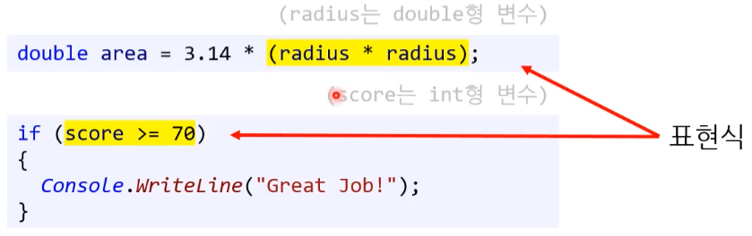

[참고] 노란색 형관펜이 표현식이고, if 블록 전체가 조건문이다. 


### 1.2. 연산자

#### 1) 비교연산자

---

* **Relational Operator** - **비교 연산자 ( 관계 연산자 )**

---

* **<**
* **<=**
* **\>**
* **\>=**
  * **=< : 사용 시 컴파일 에러나 난다.**

---

* **==**
* **!=**

---


#### 2) 논리연산자

* &&, ||


### 1.3. if / else if / else

프로그램 흐름을 여러 가지 갈래로 가지치기(branching) 할 수 있다.


**if / else 문**

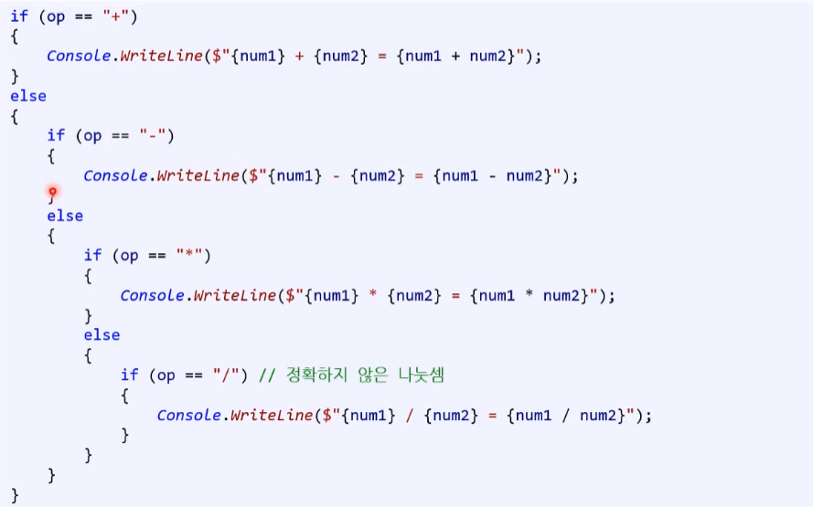


---


**if / else if 문**

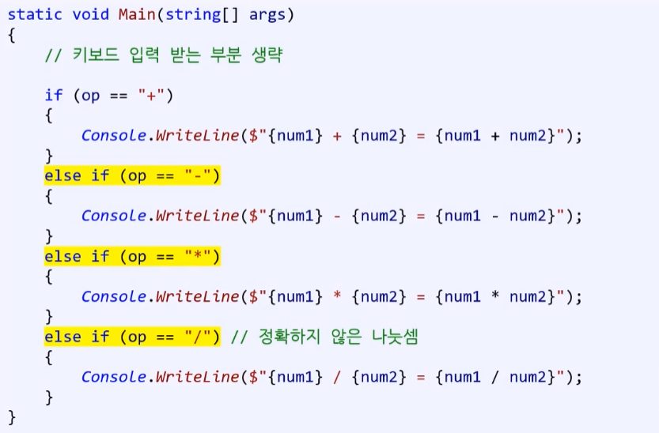


**if / else if / else 문**

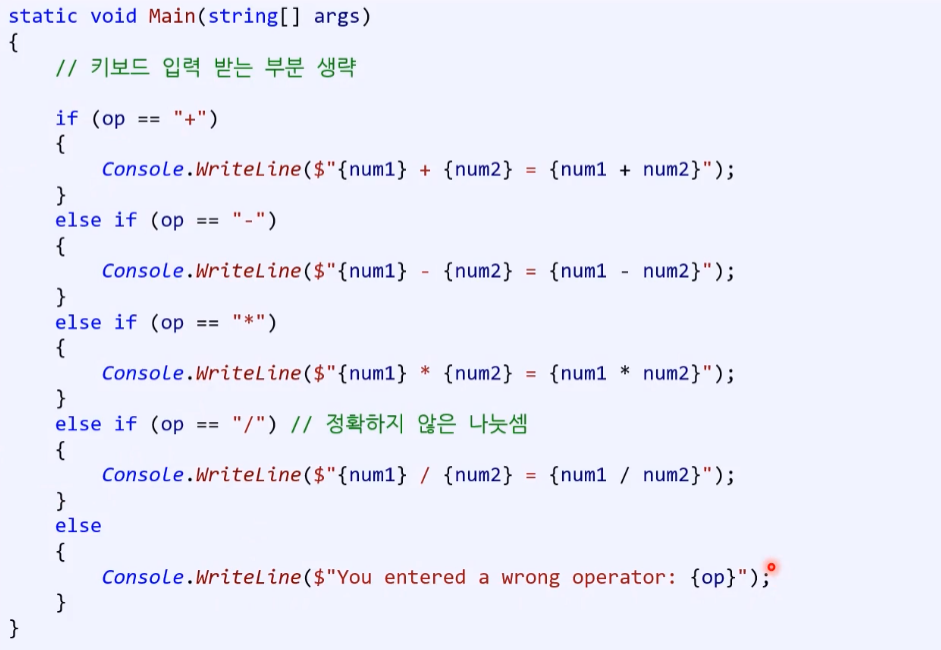


---


#### 1) else문

* 사전적 의미 : 만약 그렇지 않다면 
* if문의 조건식이 참이 아닐 때 수행

* [주의!] if문 없이 혼자 else문 작성 시 - 컴파일 에러 발생


#### 2) else if 문

##### (1) else if - 생성 과정

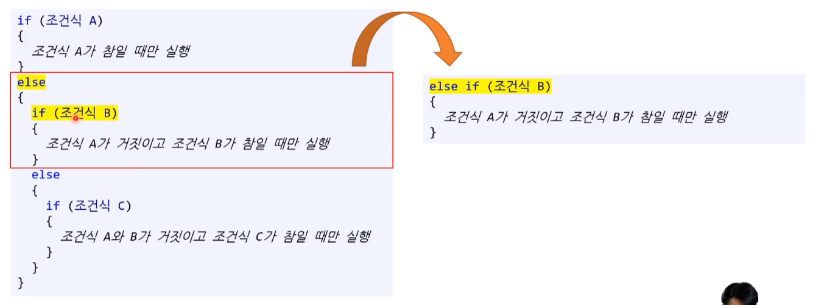

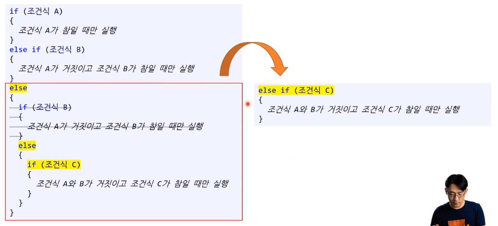


---


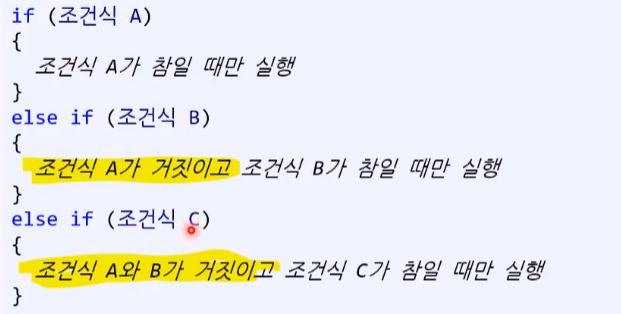


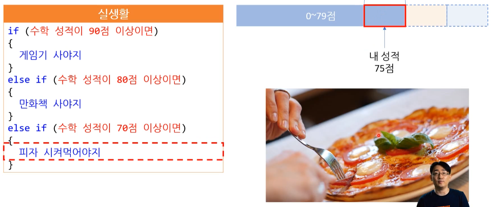


##### **(2) else if - 내재 된 조건 ( 배재 )**

else if문에 <u>내재 된 조건</u>은 **앞에 조건문들이 거짓이라는 것이 포함**된다.  ( + 중복 코드에 주의하자. )

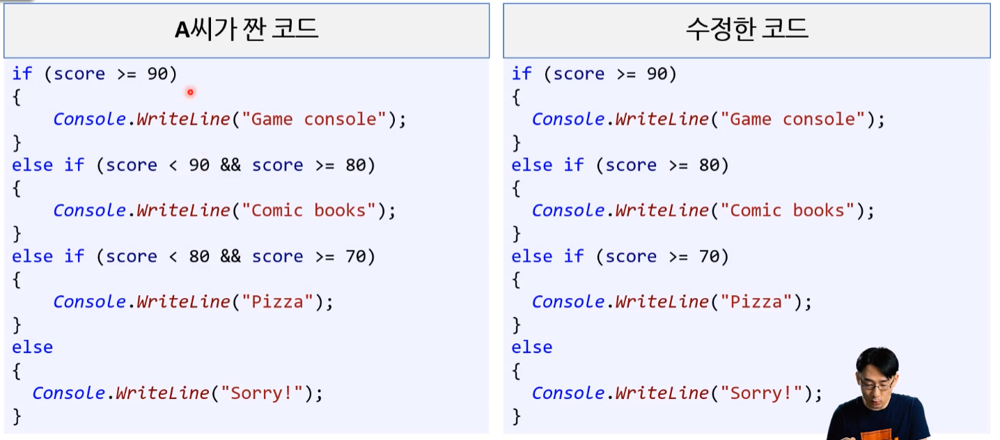

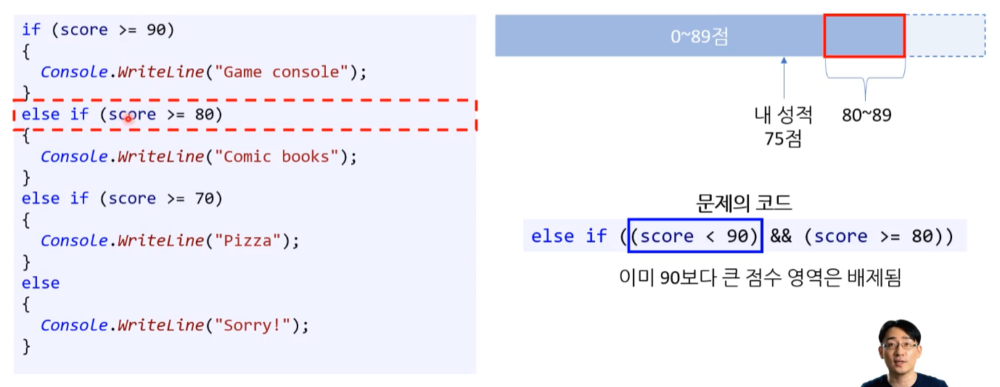

---

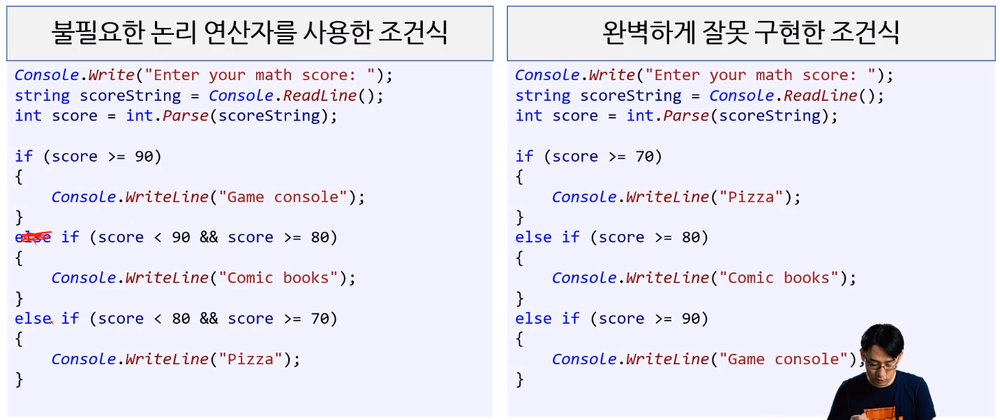


#### 3) if문 : 코딩 습관

##### (1) if 문  : 코딩 습관

1. 논리적으로 말이 되는지 확인하기
   * **논리적으로만 보려고 하면 놓치는 부분이 있을 수 있으니 <u>테스트</u>와 <u>디버깅</u>을 잘 활용 해야한다.**
2. 불필요한 반복 로직이 들어갔는지 확인
   * (ex) else if 문

---

* 좋은 프로그래머가 되기 위해 확실하게 연습하자.
  * [TIP] 헷갈리면 그림이나 순서도를 그려보자.

---


##### **(2) 배재하는 생각 습관**

- 배재 된 로직을 굳이 확인할 필요가 없다.
- [참고] '디버깅' : 디버깅 할 때도 이런 **<u>배재하는 생각 습관</u>**이 중요하다. ( 과도하게 의심하지 마라. )
  * 배재 습관이 없고 의심하게 된다면 너무 많은 경우의 수를 생각하게 된다. 
  * 비효율적이다.


## 2. switch 문

* 전기 스위치 ( 똑딱이 )

[참고] switch문은 다중 if문으로 변환할 수 있지만 반대로는 특정한 경우의 다중 if문만이 switch문으로 변환할 수 있다.


### 2.1. switch 문을 쓰기 좋은 조건

1. 비교 대상이 하나일 때
2. 비교 값이 이산적으로 하나씩 뚝뚝 끊겨 나오는 경우
   * 패턴이 있는 == 연산자를 사용하는 표현식

> ---
>
> [참고] switch문 사용 - 최적화 ( 내용 보강 필요 )
>
> * switch문이 사용하기 적절한 상황이라면 if문보다 switch문을 사용하자.
>
>    * switch는 case 인자가 0, 1, 2, 3, 4 처럼 연속인 경우에는 어셈블러에서 jump table 이 사용이 가능하기 때문에 빠르게 최적화 할 수 있다. 
>
>      쉽게 말해 컴파일러 자체에서 if문 보다 더 빨리 작동 할 수 있게 최적화를 시켜준다. 
>      ( 업계에서도 사용하는 방법이다. )
>
>    * [보충 할 자료]
>
>      * https://www.youtube.com/watch?v=1Qg-dIh2qGQ&ab_channel=%ED%8F%AC%ED%94%84TV
>      * https://justdoprogram.blogspot.com/2021/12/if-vs-switch-performance-comparision.html
>      * 나중에 내공이 많이 쌓인 뒤 영상을 보고 내용을 추가하자.
>
> ---


#### 1) switch문이 나오게 된 배경

실수를 줄이는 코드 : 좋은 코드란 실수를 줄일 수 있는 코드이다.

* if / else if 문은 == 연산자 사이에 다른 변수를 비교하는 케이스도 있을 수 있다. 그러다 보니 코드를 보는 입장에서 실수를 불러일으키는 코드가 될 수 있다.
* switch는 하나의 변수 만을 통일 되게 사용하기 때문에 이런 부분을 보완할 수 있다.
* [결론] 패턴이 있는 == 연산자를 사용하는 표현식들은 switch로 작성하는 것이 좋다.


> [ 프로 프로그래머의 특징 ]
>
> 높은 레벨의 프로그래머들도 실수를 한다. 
> 그렇기 때문에 스스로 방어적으로 될 수 밖에 없고, 자신이 틀렸을 수도 있다는 어투로 커뮤니케이션을 하기도 한다. 
>
> ( 코드 자체가 방어적으로 만들게 된다.  )


#### 2) IF 조건문을 사용하면 가독성이 안 좋은 건가?

* 답변 : 꼭 그런 것 만은 아니다.
  * 표현식의 형식에 따라 다르다.
  * 일정 한 패턴과 일치 및 동치가 되는 조건들은 switch 문을 사용하는 것이 적절하나
  * 그외의 문들은 IF 조건문을 사용하는 것이 적절하다.
    * mathScore > 80 이런 조건 말고, mathScore == 80 이런 조건을 말한다.

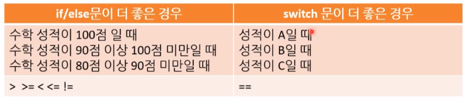


### 2.2. switch, case

* switch : 전환하다, 바꾸다 
* case : 경우

---

* 매치 표현식의 결과 값에 따라 실행할 구문을 선택

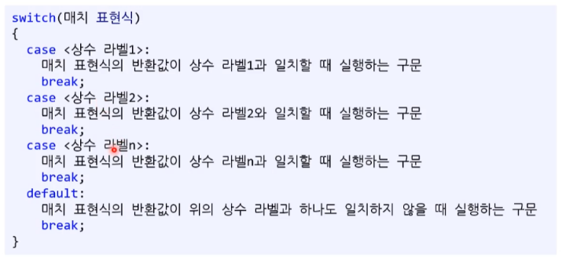


#### 1) case 상수

case에서 사용할 수 있는 상수형이다.

* **int** [ 기본 ] - 일반적으로 가장 많이 사용되는 데이터 형이다.
* long
* char
  * <u>char 역시 정수형이다.</u>

* bool
  * 흔히 쓰이는 방식은 아니다.
* string **( C# 전용 )**
  * (ex) case "apple":
* [주의!] 부동소수점들은 사용이 불가능하다. ( 실험 결과 C#은 되지만 권장하지 않는다. )


#### 2) break 문

모든 case 구문 다음에는 break 구문을 넣어야 한다. 
* C#에서는 break 구문이 없으면 컴파일 오류가 발생한다.
* C# 한정인 것이며 다른 언어의 경우 break가 없는 case를 실행하는 경우도 있다. 
  * 이를 프로그래밍 용어로는 fall through 라고 부른다.
  * C#에서 '4) fall through' 방식 이외에  fall through를 의도적으로 작동 시키기 위해서는 특정 키워드 구문을 사용해야 한다. 
    ( 그래야 컴파일 오류가 발생하지 않는다. 현업에서도 잘 사용하는 방법은 아니다. )
* 그래도 다른 언어에서도 break문을 넣는 게 좋은 습관이다.

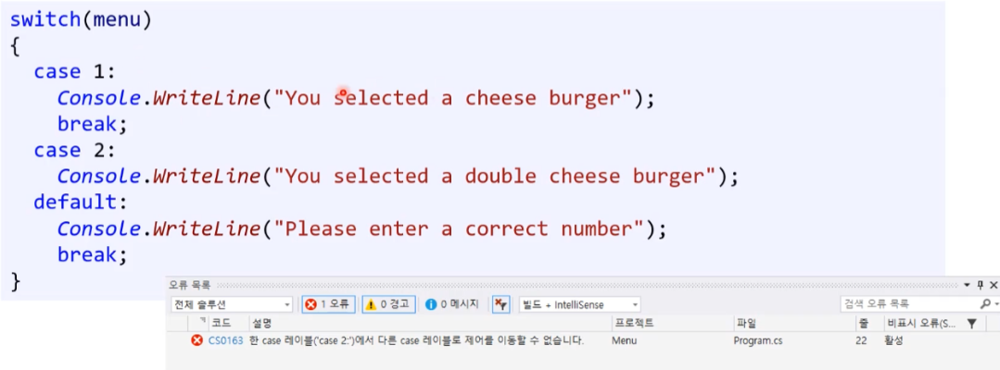


#### 3) default

* 매치 표현식의 반환 값과 일치하는 case 구문이 없을 경우 실행한다.
* 잘못된 / 예상하지 못한 반환값을 잡아야 할 경우 => 어서트(assert)를 사용한다.
* default 구문의 끝에도 반드시 break 구문을 넣자.
  * **break 문을 넣는 좋은 습관을 들이자.**


#### 4) C# fall through

case 문에 실행해야 할 코드가 포함 돼 있지 않는다면 break문을 생략할 수 있다.
( 단, 하나라도 다른 코드가 있다면 break문이 필요하다. 없을 시 에러 발생 )


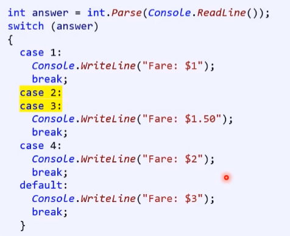


### 2.3. 기타

#### - object 사용

명령 프롬프트를 통해 입력받은 문자열을 int 또는 float 형식으로 변환한 후, 변환된 데이터를 object 형식 개체에 박싱하여 넣습니다. 그리고 switch 문에서 이 객체 안에 박싱된 데이터의 형식에 따라 메시지를 출력합니다.

```csharp
using System;

namespace Switch2
{
    class MainApp
    {
        static void Main(string[] args)
        {
            object obj = null;

            string s = Console.ReadLine();
            if (int.TryParse(s, out int out_i))
                obj = out_i;
            else if (float.TryParse(s, out float out_f))
                obj = out_f;
            else
                obj = s;

            switch (obj)
            {
                case int:
                    Console.WriteLine($"{(int)obj}는 int 형식입니다.");
                    break;
                case float:
                    Console.WriteLine($"{(float)obj}는 float 형식입니다.");
                    break;
                default:
                    Console.Write($"{obj}(은)는 모르는 형식입니다.");                    
                    break;
            }
        }
    }
}
```

```
123
123는 int 형식입니다.
```

```
12.45
12.45는 float 형식입니다.
```

```
abc
abc(은)는 모르는 형식입니다.
```

