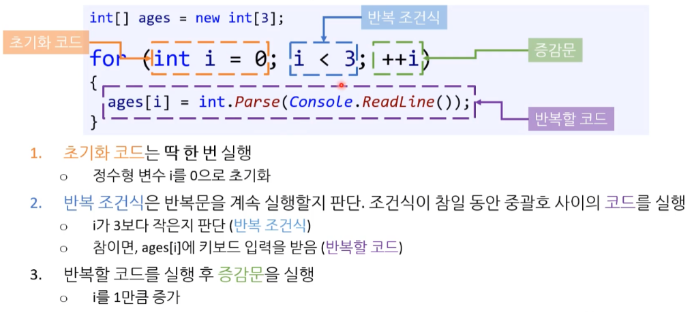
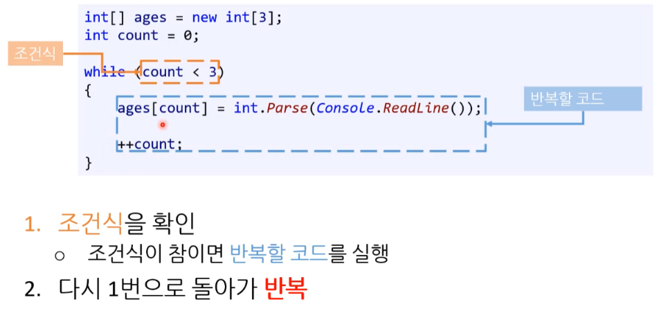
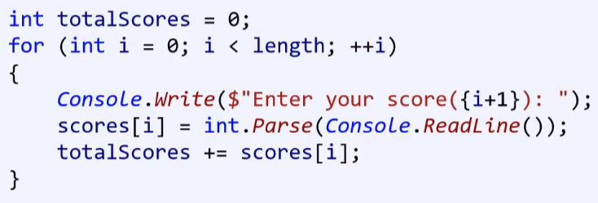
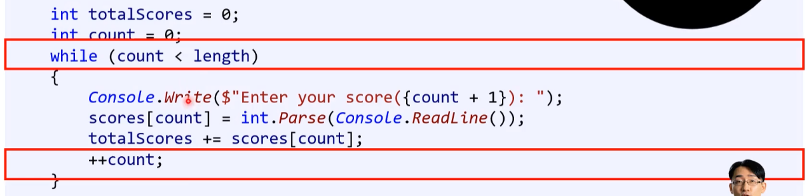
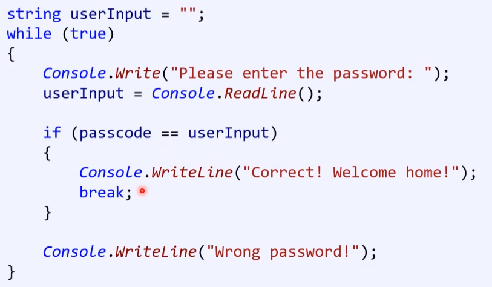
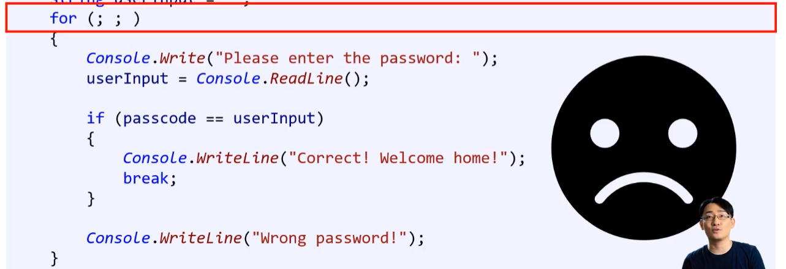

# 반복문

Iteration statements

loop statement

---

반복문의 사용으로 **중복 코드** 사용을 효율적으로 할 수 있게 되었다.

총 3개의 반복문이 존재한다.

1. for 문
2. while 문
3. do ... while 문
4. foreach 문 ( C# )

* 업계 사용 빈도 : for문 > while 문 >>> do..while 문

* **반복문은 3개 모두 호환**이 된다.
  * [참고] 조건문( if 와 switch  )은 서로 완벽하게 호환되지 않는다.


## 1. for / while / do-while


### 1.1. for 문

for loop

특정 코드를 <u>**정해진 횟수** 만큼 **반복**</u>하는 구문이다. 




[참고] index 관습 

* i, j, k ... ( i ~ n ) : 포트란 이라는 프로그래밍 언어에서 시작된 관습 


### 1.2. while 문

<u>**특정 조건을 만족**하는 동안</u> 코드를 **반복**한다.

* 일정 반복 횟수를 정할 수 있다.
* 무한 반복 (infinite loop)도 가능하다.
* continue / break / 기타




### 1.3. do-while 문

* while 문과 거의 유사하다.

  * do 구문의 중괄호 코드 블럭을 **반드시 한번 실행**

  * do while문은 끝에 세미콜론(;)을 반드시 붙여줘야 한다.

    * 그렇지 않으면 컴파일러가 해당 구문을 인식하지 못하고 <u>**에러 메세지**</u>를 출력한다.
    
    ```c#
    do
    {
    	// 최소 한 번은 반드시 실행되는 코드
    	// 한 번 실행 후에는 조건식이 참일 때만 실행
    } while (조건식);
    ```

* 하드웨어에서 반복문 돌리는 방법과 비슷하다.

* 생각보다 많이 안 쓰이며 10% 미만 정도로 사용하고 있다.

* [숙제]for문 do-while 문으로 바꾸기 연습해보기

---

```c#
using System;
					
public class Program
{
    public static void Main()
    {
	int result = 2;
	int count = 0;

	do
	{
	    result += 4;
	} while (++count < 4);

	Console.WriteLine(result);
    }
}
```

```
18
```


### 1.4. foreach 

* 강의랑 합치기

C# foreach 문은 배열이나 컬렉션에 주로 사용하는데, 컬렉션의 각 요소를 하나씩 꺼내와서 foreach 루프 내의 블럭을 실행할 때 사용된다. 다음 예제는 문자열 배열을 foreach를 사용하여 각 문자열 요소를 하나씩 출력하는 코드이다.

```cs
static void Main(string[] args)
{
    string[] array = new string[] { "AB", "CD", "EF" };

    // foreach 루프
    foreach (string s in array)
    {
       Console.WriteLine(s);
    }
}
```


**for vs. foreach**

C#에서 for와 foreach를 비교하는 것은 흔히 성능적 측면과 코드 가독성 측면을 고려하는데, 성능적 측면은 for가 경우에 따라 약간 빠를 수 있지만 대부분의 경우 성능적 차이는 크지 않으며, foreach는 for보다 훨신 간결한 코드를 제공한다는 장점이 있다.

특히, 루프에서 가장 많이 사용되는 C# 배열(array)의 경우, foreach가 내부적인 최적화를 거쳐 for 루프와 동일한 성능이므로 더 간결한 foreach를 사용할 것을 권장한다. 예를 들어, 2차배열, 3차배열 등의 다중 배열을 처리할 경우, for루프는 배열 차수만큼 여러번 루프를 돌려야 하지만, foreach는 아래와 같이 단순히 한 루프 문장으로 이를 처리할 수 있어 편리하다.

```cs
static void Main(string[] args)
{
    // 3차배열 선언
    string[,,] arr = new string[,,] { 
            { {"1", "2"}, {"11","22"} }, 
            { {"3", "4"}, {"33", "44"} }
    };

    //for 루프 : 3번 루프를 만들어 돌림
    for (int i = 0; i < arr.GetLength(0); i++)
    {
        for (int j = 0; j < arr.GetLength(1); j++)
        {
            for (int k = 0; k < arr.GetLength(2); k++)
            {
                Debug.WriteLine(arr[i, j, k]);
            }
        }
    }

    //foreach 루프 : 한번에 3차배열 모두 처리
    foreach (var s in arr)
    {
        Debug.WriteLine(s);
    }
}
```


**C# 반복 구문 예제**

아래 예제는 콘솔로부터 Q키가 입력되지 전까지 계속 키 입력을 받아들인 후, 그동안 입력된 키들을 foreach 루프를 써서 출력해 본 예이다.

```cs
using System;
using System.Collections.Generic;

namespace MySystem
{
    class Program
    {
        static void Main(string[] args)
        {
            List<char> keyList = new List<char>();
            ConsoleKeyInfo key;
            do
            {
                key = Console.ReadKey();
                keyList.Add(key.KeyChar);
            } while (key.Key != ConsoleKey.Q); // Q가 아니면 계속

            Console.WriteLine();
            foreach (char ch in keyList) // 리스트 루프
            {
                Console.Write(ch);
            }
        }
    }
}
```


## 2.  반복문 최적화 사용

* 작동 되어도 하면 안되는 것이 있다.


### 2.1. 공통 : 반복 조건식 / 증감연산자

```c#
int[] ages = new int[3];

for (int i = 0; i < 3; ++i)
{
	ages[i] = int.Parse(Console.ReadLine());
}
```

* 반복 조건식 ( i < 3 )
  배열을 사용할 때 몇 번까지 도는지 확인하기 편하기 때문에 i < 3을 사용하는 것이 좋다.  ( i <= 2를 잘 쓰지 않는다. )
* 증감연산자 ( ++i ) 
  동작은 동일하지만 ++i가 성능 면에서 조금 더 빠르기에 습관적은 ++i로 들여두는 것도 좋다. ( 하지만 업계에서 i++를 더 많이 사용한다. )
* 공백 사용
  for 문 전에 뒤에 빈 줄 하나 삽입해주면 가독성이 높아집니다.

> ---
>
> [ 포프 댓글 ( 종합 ) ]
>
> 1. i가 int 형일때 ++i가 i++보다 빠른 건 맞습니다 
>    ( 컴파일러 최적화가 없고 일반적인 어셈블리어 기계를 사용할 때 ) 
>
> 2. 하지만 그로 인한 성능 차이는 실제 측정이 안 될 정도로 미미합니다. 
>    ( 이걸 아예 차이가 없다는 주장하는 사람들이 있는 듯 한데, 엄밀히 말하면 차이는 있습니다. 실용적인 의미가 없을 뿐이죠 ) 
>
> 3. C++ 등의 언어를 사용하면 ++ 연산자를 프로그래머가 재정의 할 수 있는데 그러면 클래스에도 ++ 연산자를 추가할 수 있습니다. 그럴 경우 ++i를 먼저 구현하고 i++에서는 ++i를 버전을 사용하는 식으로 구현하는 게 관습입니다. 따라서 이럴 경우는 ++i를 사용하는 게 함수 호출도 적어집니다. 이 부분에서는 성능차이가 충분히 날 수 있습니다. 
>
>    제가 ++i를 사용하는 이유도 '3.' 때문이지만... 어차피 int에서도 ++i를 사용하던 i++를 사용하던 아무 차이가 없다면 차라리 ++i로 습관을 들여놓는 게 옳다 생각해서 딱히 i++가 기능 상 필요한 경우가 아니라면 ++i를 사용합니다. 
>
>    (참고로 다른 사람들은 이걸 그냥 별 의미없는 성능 + 선호 차이로 생각하고 넘어가는 거 같은데 전 나중에 실수로 성능에 해를 끼치는 걸 방지하는 차원/방어적 코딩의 개념에서 ++i를 사용합니다)
>
> * 전위 연산을 사용하는 게 더 좋은 코딩 습관이나, 많은 책이나 업계의 80% 이상이 후위 연산을 사용합니다.
>
> ---


### 2.2. 단순 반복하기 - for 문

for문을 사용하자

* 배열의 모든 요소를 훑을 때
  * 중첩 루프(nested loop)를 사용한다. 

* 반복문이 범위가 정해져 있을 때 사용한다.
* 특정한 조건에 의한 종료 없이 단순 반복하기


**[ Good ]**

* **for 문**




**[ Bad ]**

* **while 문**
  * count 사용을 잊어서 실수 유발을 일으킬 수 있다.




### 2.3. 실행 중 종료 - while 문

* 반복문을 종료하는 시점이 반복문 실행 도중에 결정 될 때 사용한다.
* **다양한 조건이 필요할 경우 while(true)를 사용하자.**

---

* while 문 : 코드 블럭이 한 번도 실행 안 될 수도 있다.
* do-while 문 : 코드 블록이 무조건 한번은 실행 된다.


#### **1) while (true)**

여러 조건을 while문에 한 번에 기입하는 것은 가독성을 떨어트리고 실수를 유발한다.
while (true)를 사용할 경우 이런 여러 조건문을 따로 표기하고 break 시켜 사용할 수 있다.

* 한 동안 나쁜 습관이라 불렸었지만 현재는 검증 완료 되어 유용하게 사용되고 있는 방식이다.

```c#
while (true)
{
	// 코드
}
```


**[ Good ]**

* **while (true)**

* **끝내는 조건이 있을 때 사용한다.**




**[ Bad ]**

* **for문**
* 방법을 알아도 사용하지 말자.




#### **2) do while 사용은?**

do while문을 사용하는 것 보다 while(true) 형태로 사용하는 경우가 더 많다. 
( 읽기가 편한 감이 있다. 정형화 되어서 고착화 되었다.  )

**do-while문은 뭔지 만 알고 최대한 for문과 while문을 사용하는 방향으로 최대한 맞추는 것이 좋다.**

* do - while 문을 자주 쓰지는 않음
* while (true) 문을 대신하여 사용하는 경우가 더 많다.

```c#
while (true)
{
	if (조건식)
	{
		break;
	}
}
```


