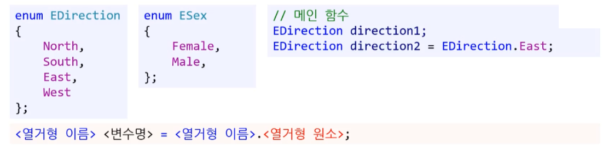

# 열거형( enum )과 어서트( assert )


## 1. 열거형 ( enum )

프로그래밍 실수를 막을 수 있는 형이다. 
( 반드시 쓸 필요는 없지만 있으면 좋기 때문에 알아두자.  )

최종 실행하는 컴퓨터가 이해하기에는 상수이지만, 컴파일러가 볼 때 고유한 집합이다. 

* **Enumerated Type**

* 정수형 상수의 집합
  * 집합 자체가 고유의 이름을 가진다.
  * 각 원소마다 고유의 이름을 가진다.
* enum은 변수로 사용 가능하다.


### 1.1. 사용법

#### 1) 열거형 정의

##### (1) 기본형

* 정의는 함수 밖에서 한다.
* 첫 번째 원소의 기본값은 0
  * 아무 값도 대입하지 않으면 원소의 값은 1씩 증가한다.


```csharp
// class 소속 없이 cs파일을 따로 분리해서 사용하는 것도 가능하다.

namespace Assignment4
{
    enum EElementType
    {
        Fire,
        Water,
        Wind,
        Earth
    }
}
```


**[주의!] 부동소수은 안된다.** 

* 컴파일 에러


##### (2) 직접 정의

* 각 원소에 원하는 값을 대입 가능하다.

  * 상수

  * 계산식

```c#
enum EDirection
{
	North = 5,
	South = 10,
	East = 15,
	West = East + 10
};
```

```c#
enum EDirection
{
	North = 5,
	South,	// 6
	East,	// 7
	West	// 8
};
```


초기화 안해 주고, -2를 넣어주면, -1, 0, 1로 1씩 증가한다.

* 그러니 초기화 해주는 것이 좋은 습관이다.


#### 2) 선언 및 대입

열거형 변수에는 해당 열거형의 원소만 대입 가능

* 다른 열거형 변수나 상수 등을 사용할 경우 **컴파일 에러** 발생




#### 3) enum으로 배열 만들기 - 꼼수

* 다른 언어에서도 사용할 수 있는 방법이다.
* enum 마지막에 MAX를 선언하고 이를 배열 만들 때 사용한다.
* ( C#에서는 이거 말고도 따로 사용하는 방법이 있다. )

```csharp
class Program
{
	enum EDirection
	{
		East,
		West,
		South,
		North,
		MAX
	};
	
	static void Main(string[] args)
	{
		string[] directions = new string[(int)EDirection.MAX];
		
		for (int i = 0; i < directions.Lenght; ++i)
		{
			...
			directions[i];						// 사용법 1
			directions[(int)EDirection.North];	// 사용법 2
            ...
		}
	}
}
```


### 1.2. 열거형의 유용함

#### 1)  switch와 enum

switch문 만 사용할 경우 실수를 유발 할 수 있다.

누군가 이상한 case를 추가할 경우 확인에 미연에 대처할 수 없다.

* int 형은 같은 기본형을 공유하기 때문에 발생하는 현상이다.
* case로 const 상수를 값으로 받는다고 하들 누군가 실수로 case문에 임의의 값을 추가하면 그 값이 case 분기문으로 들어올 수 있다.
  * 컴퓨터 입장에서는 'int형 이름 있는 상수' 나 'int형 이름 없는 상수'나 같은 'int형 상수' 이다.
* [해결법] **열거형 (enum) 사용**
  * 열거형에 없는 값을 case에서 사용할 경우 컴파일 오류가 발생하고 실수를 미연에 방지할 수 있다.
  * 정수를 읽어 와서 캐스팅 한 다음 사용한다.


**[ 문제 상황 ]**


**[ 해결 상황 ]**


#### 2) fucntion과 enum

* 함수는 블랙박스다.

  * 내부 구현을 몰라도 쓸 수 있어야 한다.
  * 함수 시그니처만으로 유추가 불가능 할 경우 함수 바디를 봐야 한다.
  * 이런 불필요한 상황을 enum 사용으로 개선할 수 있다.

* enum의 좋은 점

  * 가독성 - 코드가 읽기 좋다. 

  * 사전 예방 

    * 컴파일 오류 : 다른 값 입력시 컴파일 오류로 문제를 미연에 방지한다.

    * 매개변수 인지 : 함수 매개변수로 쓰이면 함수가 요구하는 인자형을 빨리 알 수 있다.
      ( 함수에 잘못된 값이 넘어가는 것을 방지한다. )


**[ 문제점 ]**

* **블랙박스**
* 함수 시그니쳐만 보고 어떤 값이 들어갈지 유추 불가능 할 경우 결국 함수 바디를 봐야 한다.
* 만약, 누가 함수 바디를 안 보고 시그니쳐만 보고 판단한다면 잘못된 인자를 넘길 가능성이 있다.


**[ 해결법 ]**

* **enum 사용**
* 이로써 더 명확한 함수가 되었다.


#### 3) constant와 enum

* **enum형과 정수형 - 비교**
* [이유1] 범위 제한
  * 정수형은 너무 자유롭기 때문에 실수 할 가능성이 높다.


---

* [이유2] 가독성
  * 유사한 성질을 가진 정보들을 나열해야 할 때 정수형 상수보다는 enum을 사용하는 것이 좋다.


### 1.3. 실습

**코드 : 열거형을 이용한 계산기**

```C#
using System;

namespace CalculatorUsingEnum
{
    class Program
    {
        static void Main(string[] args)
        {
            Console.Write("num1: ");
            string num1String = Console.ReadLine();
            int num1 = int.Parse(num1String);

            Console.Write("num2: ");
            string num2String = Console.ReadLine();
            int num2 = int.Parse(num2String);

            Console.Write("operation (+, -, *, /, %): ");
            string operationString = Console.ReadLine();
            char operationChar = char.Parse(operationString);

            EOperator operation = (EOperator)operationChar;

            switch (operation)
            {
                case EOperator.Plus:
                    Console.WriteLine($"{num1} + {num2} = {num1 + num2}");
                    break;

                case EOperator.Minus:
                    Console.WriteLine($"{num1} - {num2} = {num1 - num2}");
                    break;

                case EOperator.Multiply:
                    Console.WriteLine($"{num1} * {num2} = {num1 * num2}");
                    break;

                case EOperator.Divide:
                    Console.WriteLine($"{num1} / {num2} = {num1 / num2}");
                    break;

                default:
                    Console.WriteLine($"You entered a wrong operator: {operationChar}");
                    break;
            }
        }
    }
}
```


## 2. 어서트 (assert)

assert : 단언하다 가정하다.

> ---
>
> **[ 가정, 추측, 단어 - 차이 ]** 
>
> 가정 : 이게 틀리다는 것이 증명 되지 않는 이상 맞다고 믿는 것
>
> 추측 : 가정만큼 그 정도의 강한 개연성이 있는 건 아니다.
>
> **단언** : 이것은 반드시 이럴 것이라고 단언한다.
>
> ---


### 2.1. 사용 계기


**문제**

* enum을 수정하고, 그 enum을 쓰는 함수의 case 문은 수정하지 않는 경우가 생각보다 흔히 일어난다.
  ( enum을 스는 곳이 10군데, 20군데 라면... )

**해결법**

* 어서트 ( assert ) :  코드 검증을 위한 코드


### 2.2. 개념

* 절대 발생하지 않아야 하는 조건을 런타임 중에 검사
  * 만약 발생한다면 코드가 올바르게 동작하지 않는다는 의미이다.
  * 함수의 선조건 검사에 쓰기 적당하다.

* 디버그 모드에서만 동작
  * 릴리즈 모드에서는 어서트 함수는 주석과 유사하게 무시된다. 
  * 만약, 릴리즈 모드에서도 동작한다면 성능 저하가 발생할 것이다.

* 최종 제품의 성능저하 없이 개발 중에 문제를 고치는 바람직한 방법이다.
* 훌륭한 프로그래밍 언어들은 모두 가지고 있는 기능이다. 

---

유명한 소프트웨어 개발자의 경우 : 코드 4줄에 assert에 하나 있다고 하더라. ( 그만큼 중요하다. )

* 김포프는 그렇게 까지 쓰지는 않는다. 100줄에 하나 정도 들어가는 정도다.

---


### 2.3. 사용법

```c#
using System.Diagnostics;

Debug.Assert();
```

* System.Diagnostics 라이브러리를 추가해야 한다.  - `using System.Diagnostics;`
* `Assert()` 괄호 안에 들어가는 **조건이 거짓**일 경우 프로그램은 일시 중단되고, 어서트 메시지가 출력창에 출력된다.
* 방식 2 가 더 좋은 방식이다.


**[ 방식 1 ]**

```c#
Debug.Assert(menu < 5);		// menu가 5 이상이면 어서트 발생
```

```c#
Debug.Assert( <표현식> );	
```


**[ 방식 2 ]**

* 어서트가 일어날 때 보여줄 메시지를 함께 작성
* 표현식에서 false가 나면 메시지가 출력 되면서 프로그램이 일시 중단 된다.

```c#
Debug.Assert(menu < 5);		// menu가 5 이상이면 어서트 발생
```

```c#
Debug.Assert( <표현식> , <메시지> );	
```


( 왼쪽 코드 표에 enum EMenum 마지막에 count 추가 해줘야 작동한다. - 약간 잘못 작성된 것  )


* .NET Core 버전에 따라서 어서트 창이 안 나오거나 다른 코드가 보일 수 있다.
* 이럴 때는 출력창이나 호출 스택창을 이용해서 어서트가 발생한 코드로 돌아갈 수 있다.


### 2.4. 유용한 시점과 한계

* 외부로 들어오는 값이 없고, 프로그래머가 모든 값을 컨트롤 가능할 때 유용하게 사용할 수 있다. 

* 사용자가 입력하는 값은 assert로 모두 잡을 수 없다. 
  * 이를 보완하기 위해 if문이나 예외처리를 사용한다.


----

----


## $ 이것이 C#이다 : Ch03 데이터 보관하기

* 기반자료형은 정수 계열만 사용할 수 있으며, 생략할 경우 컴파일러가 int를 기반 자료형으로 사용합니다.
  * 정수 계열(byte, sbyte, short, ushort, int, uint, long, ulong, char)
* 열거 형식의 각 요소는 서로 중복되지 않는 값을 갖고 있다는 의미를 가진다.
* 요소가 갖고 있는 값보다 각 요소의 이름을 사용하는 것이 적절하다.
  * (ex) "DialogResult가 0이다" 보다는 "DialogResult가 YES다"가 의미 전달이 잘된다.

---


## **$ C# 스터디 : C# 문법 $**

**C# enum (열거형)**

C#의 키워드 enum은 열거형 상수(constant)를 표현하기 위한 것으로 이를 이용하면 **상수 숫자들을 보다 의미있는 단어들로 표현**할 수 있어서 프로그램을 읽기 쉽게 해준다.

**enum의 각 요소는 별도의 지정없이는 첫번째 요소가 0**, 두번째 요소가 1, 세번째 요소가 2 등과 같이 1씩 증가된 값들을 할당받는다. 물론, 개발자가 임의로 의미있는 번호를 지정해 줄 수도 있다. enum문은 클래스 안이나 네임스페이스 내에서만 선언될 수 있다. 즉, 메서드 안이나 속성 안에서는 선언되지 않는다.

아래 예제는 Category 라는 enum 타입을 정의한 예인데, Cake는 숫자 0을 갖고, IceCream은 1, Bread는 2라는 값을 갖는다. 프로그램상에서 Category 값을 0, 1 처럼 직접 쓰는 대신 Category.Cake, Category.IceCream 와 같이 사용하면 그 의미를 파악하기가 훨씬 쉬워진다.


**C# enum의 사용**

**enum 타입은 숫자형 타입과 호환가능하다.** 만약 enum 타입의 변수를 int로 캐스팅(주: Casting - 한 타입을 다른 타입으로 변경하는 것. 타입 변환이 실패할 수도 있다)하면 해당 enum값의 숫자 값을 얻게 된다. 또한, enum 타입의 변수는 enum 리터럴값과 서로 비교할 수 있다.
아래 코드는 enum 변수 myCity가 리터럴 City.Seoul 과 같은지 체크하는 예제이다.

```
class Program
{
    enum City
    {
        Seoul,   // 0
        Daejun,  // 1
        Busan = 5,  // 5
        Jeju = 10   // 10
    }

    static void Main(string[] args)
    {
        City myCity;
        
        // enum 타입에 값을 대입하는 방법
        myCity = City.Seoul;

        // enum을 int로 변환(Casting)하는 방법. 
        // (int)를 앞에 지정.
        int cityValue = (int) myCity; 

        if (myCity == City.Seoul) // enum 값을 비교하는 방법
        {
            Console.WriteLine("Welcome to Seoul");
        }
    }
}
```


**플래그(flag) enum**

enum의 각 멤버들은 각 비트별로 구분되는 값들(예: 1,2,4,8,...)을 갖을 수 있는데, 이렇게 enum 타입이 비트 필드를 갖는다는 것을 표시하기 위해 enum 선언문 바로 위에 [Flags] 라는 Attribute (주: Type 혹은 그 멤버를 선언할 때 그 위에 붙이는 특별한 특성값으로 해당 타입 혹은 멤버가 어떤 특성을 갖고 있는지 나타내게 된다)를 지정할 수 있다.

[Flags] 특성을 갖는 플래그 enum은 **OR 연산자를 이용해서 한 enum 변수에 다중값(예: 1+4)을 가질 수** 있으며, **AND 연산자를 이용하여 enum 변수가 특정 멤버를 포함하고 있는지 체크할 수** 있다.

아래 예제는 Border라는 플래그 enum으로 OR 연산을 통해 다중값을 표현하고, AND 연산을 통해 특정멤버를 체크해보는 코드를 보여주고 있다.
또한, 플래그 enum에 대해 .ToString() 메서드를 사용하면 해당 플래그 멤버명들을 문자열로 보여준다는 것이다. [Flags]가 없으면 1+4 즉 5를 출력한다.

```
[Flags]
enum Border
{
    None = 0,
    Top = 1,
    Right = 2,
    Bottom = 4,
    Left = 8
}

static void Main(string[] args)
{
    // OR 연산자로 다중 플래그 할당
    Border b = Border.Top | Border.Bottom;

    // & 연산자로 플래그 체크
    if ((b & Border.Top) != 0)
    {
        //HasFlag()이용 플래그 체크
        if (b.HasFlag(Border.Bottom))
        {
            // "Top, Bottom" 출력
            Console.WriteLine(b.ToString());
        }
    }
}
```

---

---


