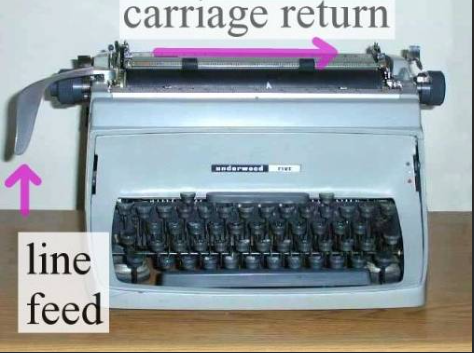

# 문자와 문자열

**[핵심] 컴퓨터에서 모든 것은 숫자로 이루어져 있다.**


## 1. 문자

* 모든 문자는 사실 숫자다.


### 1.1. 데이터 타입

각 언어마다 문자를 주로 쓰는 데이터 타입이 다르다.

그 데이터 타입은 문자코드 특징 때문에 대부분 unsigned를 기본형으로 한다.

* char / 2바이트 / 유니코드
* char는 ushort와 비트(bit)상으로는 16비트(0 ~ 0xFFFF)로 동일하지만 사칙연산(+ -, *, /)을 하려고 시도할 경우 컴파일 오류를 발생시키낟.


### 1.2. 문자 코드

* **문자열 셋 / 문자열 세트**

  * Character Set
  * 사용자가 입력한 문자나 기호들을 컴퓨터가 이용할 수 있는 숫자로 만드는 것
  * 숫자에 대응되는 할당 문자들의 집합
  * 아스키 코드, 유니코드 등이 있다. 

* **문자열 인코딩**

  * Encoding

  * 문자열 셋을 통해 사람이 입력한 문자를 그에 해당하는 숫자로 변환 하는 것

    ( 문자 => 숫자 ) 변환


#### **1) ASCII - 표준 코드체계**

미국 ANSI에서 표준화한 정보 교환용 7비트 부호체계이다.  

* 1byte 

---

* 최초의 아스키 총 128개의 문자
* 7 bit
  0000 0000  ~  0111 1111
         0	   ~         127
* 1 bit - 남은 비트 1개
  사용을 안 하거나, 오류 검증용으로 사용

​	ex) 65 = 'A'

---


#### **2) ANSI - Extended ASCII**

* 확장 아스키 ( Extended ASCII )

ASCII가 1비트가 남다 보니 각 나라마다 이 1비트를 가지고 다양한 언어가 추가하게 된다.
하지만 이런 인코딩 방식이 중구난방으로 만들어지다 보니 호환이 안되 서로 다른 문자 인코딩을 사용하여 글자가 깨지는 일이 빈번히 발생하게 되었다.

(ex) EUC-KR(한국어), EUC-JP(일본어)

https://developer-p.tistory.com/72


#### **3) 유니코드**

위의 호환성 문제를 해결하게 된 것이 유니코드 방식이다.

전 세계의 모든 문자를 다루도록 설계된 표준 문자 전산 처리 방식으로
그 개수는 고어까지 포함되면서 비트 수의 범위가 늘어나고 있다.

문자열 셋을 통일 하게 되면서 호환성 문제에서 벗어나 다양한 문자로 온라인에 소통할 수 있게 되었다.

호환성을 이유로 **<u>UTF-8</u>** 형식이 가장 많이 사용되고 있다.  ( 형식이 다양하다. )

* **UTF-8 ( UTF 16, UTF 32 )**

* **2바이트 ( 16비트 )**

> ---
>
> **유니코드와 아스키코드**
>
> 유니코드의 첫 부분은 ASCII 하고 동일하다.
>
> 유니코드의 첫 128바이트는 아스키와 완전히 동일하다.
>
> ---


### 1.3. 이스케이프 문자 

---

* **Escape character**
* **Escape sequence**
* **Escape key**
  * ( 확장 문자라고 불리기도 한다. )


---

* 이스케이프 코드란 프로그래밍 할 때 사용할 수 있도록 미리 정의해 둔 "문자 조합"이다.

* 문법에서 탈출시키고 의미에 맞게 출력 시킨다.

* 역슬래시 ( back-slash : `\` )로 시작하는 특수 문자
  * 한국 키보드의 경우 원화기호 ( ￦ ) 

| 이스케이프 시퀀스 | 표현                                                         |
| :---------------- | :----------------------------------------------------------- |
| **\n**            | 줄 바꿈 ( 다음 행으로 이동 ) newline                         |
| **\r**            | 캐리지 리턴 ( 줄의 시작으로 이동 ) carriage-return           |
| **\t**            | 가로 탭 tab                                                  |
| **\\'**           | 작은따옴표                                                   |
| **\\"**           | 큰따옴표                                                     |
| **\\\\**          | 백슬래시                                                     |
| **\?**            | 리터럴 물음표                                                |
| **\\0{숫자}**     | 8진수 표기법의 ASCII 문자   ( string - 사용 가능 )           |
| **\x{숫자}**      | 16진수 표기법의 ASCII 문자 ( string, char - 둘 다  사용 가능) |
| **\u{숫자}**      | 유니코드 문자의 번호를 16진수로 명시                         |


#### 1) 따옴표 출력

"큰따움표"와 '작은따움표'를 출력할 때 이스케이프 문자가  필요하다.


**방법1** - 일반적인 방법

```c#
Console.WriteLine("\'");
Console.WriteLine("\"");
```


**방법2** - C#에서 만 할 수 있는 방법이다.

```c#
Console.WriteLine("'");
Console.WriteLine('"');
```


#### 2) 16진수 아스키값

* \x 를 붙여준다.

```c#
using System;

namespace ASCIICodeHelloWorld
{
    class Program
    {
        static void Main(string[] args)
        {
            Console.WriteLine("Hello World!");

            Console.WriteLine("\x48\x65\x6C\x6C\x6F\x20\x57\x6F\x72\x6C\x64\x21");
        }
    }
}
```

```
Hello World!
Hello World!
```


### 1.4. NewLine

#### 1) CR, LF, CRLF

**(1)  CR, LF, CRLF 탄생일화**

타자기(typewriter) 시절 부터 사용하던 줄바꿈 방식에서 따온 용어들이다.
( 타자기로 문서를 작성할 때 한 줄에 글자를 다 입력했으면 아래 줄로 이동시켜 한다. )

현재는 컴퓨터의 줄바꿈 문자로 사용되고 있다.


**(2) CR, LF, CRLF의 의미**

타자기에서 줄바꿈을 하려면 종이를 오른쪽으로 쭉 밀고, 다시 종이를 한 줄만큼 위로 올립니다. 이렇게 종이를 오른쪽으로 밀어서 처음으로 오게 하는 행동을 복귀(Carriage Return)라고 하고, 종이를 위로 올리는 행동을 개행(Line Feed)이라고 합니다

* **CR** 
  * Carrige Return
  * 이스케이프 시퀀스 : \r
  * <u>현재 커서를 줄 올림 없이 가장 앞으로 옮기는 동작</u>
* **LF**
  * Line Feed
  * 이스케이프 시퀀스 : \n
  * <u>커서는 그 자리에 그대로 둔 상황에서 종이만 한 줄 올려 줄을 바꾸는 동작</u>

* **CRLF**
  * CR + LF
  * 이스케이프 시퀀스 : \r\n
  * <u>두 가지 다 사용한다는 의미이다.</u>

```python
# python 코드 

print("Hello World")
print("Hello \rWorld")		# \r 때문에 덮어쓴다
```

```
Hello World
World
```


**(3) 운영체제의 NewLine 기본값**

이런 다양한 줄 바꿈 방식은 OS 종류에 따라 각기 다른 줄 바꿈 기본값으로 적용한다.

유닉스와 리눅스, 최신 맥OS 등의 경우 LF 방식을 사용하고 있고, 윈도우의 경우 CR+LF 방식을 사용한다.

* CR	    :  맥 OS (버전 9 이하)
* LF	     :  맥 OS (버전 10 이상), 유닉스, 리눅스, 
* CR+LF      :  윈도우


**(4) 호환성 문제 ** 

이 때문에 줄 바꿈을 `CRLF`로만 인식하는 메모장의 경우 UNIX 기반 OS로 작성한 문자를 열었을 때 문자 일부가 깨지는 현상을 간혹 볼 수 있다.

이 외에도 프로그래밍 협업 과정에서 다양한 문제들을 불러 일으킨다. ( Git, 소스코드 등 )


**[ 해소 방안 ]**

1. 일반적인 작업에서는 LF 권장 사용
2. 각종 유틸리티 프로그램이 가진 설정을 통해 자동 해결
3. 프로그램 코딩 상에서 미연에 방지하기
   * (ex) C# - Enviroment.Newline


#### 2) C# NewLine

* \n 대신 Enviroment.Newline 을 쓰시는 것이 좋습니다.
* [참고] \r\n for non-Unix platforms, or \n for Unix platforms.
  * C# 자체적으로 플랫폼 별 newLine 호환성을 높이 위한 방법이다.

```cs
// Sample for the Environment.NewLine property
using System;

class Sample
{
    public static void Main()
    {
        Console.WriteLine();
        Console.WriteLine($"NewLine: {Environment.NewLine}  first line{Environment.NewLine}  second line");
    }
}

/*
This example produces the following results:

NewLine:
  first line
  second line
*/
```


## 2. 문자열

* **문자열 : 모든 것을 읽어 올 수 있는 형태인 포괄적인 형태의 상위 개념**
* string 형식
  * 문자열을 담는 역할
  * 문자열을 가공하기 위한 다양한 기능 제공


### 2.1. 개념

문자열은 자체는 하드웨어가 이해하는 기본 자료형은 아니다.
( 하드웨어 - 컴퓨터가 1:1 이해할 수 있는 데이터가 아니다. )

```c#
string greetin = "Hi, everybody!";
Console.WriteLine(greeting);
```

* 여러 개의 문자가 모인 집합체 
  ( 문자가 줄줄이 연결 된 거라 생각하면 된다. )

* 문자열은 큰 따옴표("")로 감싼다.

  ```
  "Hello World!"
  "123456"
  "My age is 17"
  ```

* 문자열은 문자형(char)의 배열 **@@@@@@@@@@**

  * 문자열(string)은 문자(character)의 집합체이다. 
  * 문자열 안에 있는 각 문자를 액세스하고 싶으면, [인덱스] (square bracket)을 사용하여 문자 요소를 액세스한다. 
  * 문자 배열(char array)을 문자열(string)으로 변환하기 위해서는 new string(문자 배열)을 사용한다.
  
  ```c#
  char[] greeting = { 'H', 'e', 'l', 'l', 'o', ' ', 'W', 'o', 'r', 'l', 'd', '!', '\0'};
  Console.WriteLine(greeting);  // "Hello World" 출력
  Console.WriteLine(greeting[0]); // 'H' 출력
  
  string str = new string(greeting);
  Console.WriteLine(str)		  // "Hello World" 출력 
  ```
  


### 2.2. 연산자

#### 1) 사칙 연산자

* '\+ 연산자, += 연산자'만 사용 가능하다.

  * 두 문자열을 하나로 합쳐서 새로운 문자열을 만든다.
  * [특이] 문자열과 숫자 합치기 - 새로운 문자열을 만든다.
  * "Hello" + "World" => "HelloWorld"
  * "Hi" +" " + "Pope" => "Hi Pope"
  * "Hello" + 12345 => "Hello12345"

* 나머지 사칙연산( - , * , / ) 사용시 에러 발생

  ```c#
  CS 0019  // 피연산자를 적용할 수 없습니다.
  ```


> ---
>
> **[ 문자열로 변환 후 계산하기 ]**
>
> 암시적보다는 명시적으로 변환한 후 더하기 연산을 하는 것을 권장합니다.
>
> ```csharp
> int days = 28;
> "2월달은 " + days + "일입니다."						// 암시적 변환 ( X )
> "2월달은 " + days.ToString() + "일입니다."				// 묵시적 변화 ( O )
> "2월달은 " + Convert.ToString(days) + "일입니다."		// 묵시적 변환 ( O )
> ```
>
> ---


#### 2) == 연산자

* 두 문자열이 같은지 확인한다.
* 일부 다른 프로그래밍 언어에서는 쓰지 못하거나 다른 결과가 나올 수 있다.
  * 이렇게 언어마다 다르게 동작하는 이유는 문자열이 컴퓨터에 있어 <u>"기본 자료형"이 아니기 때문이다.</u>
  * **[주의!]** **컴퓨터 프로그래밍 언어마다 문자열 동작 방식이 다르다.** 

```java
(ex)
string message1 = "Hello";
string message2 = "Hello";
// JAVA에서는 message1 == message2의 결과가 false 일 수 있다.
```


### 2.3. string @@@


#### 1) C# string

**C#의 키워드 string은 .NET의 System.String 클래스와 동일**하다. 

* System.String 클래스의 모든 메서드와 속성(Property)을 사용할 수 있다. 

* **C# 문자열은 Immutable 즉 한번 문자열이 설정되면, 다시 변경할 수 없다.** 
  * 한번 그 값이 설정되면 다시 변경할 수 없는 타입을 Immutable Type이라 부르고, 반대로 값을 계속 변경할 수 있는 것을 Mutable Type이라 부른다. 
  * 예를 들어, 문자열 변수 s 가 있을 때, s = "C#"; 이라고 한 후 다시 s = "F#"; 이라고 실행하면, .NET 시스템은 새로운 string 객체를 생성하여 "F#"이라는 데이타로 초기화 한 후 이를 변수명 s 에 할당한다. 즉, 변수 s 는 내부적으로는 전혀 다른 메모리를 갖는 객체를 가리키는 것이다.

```cs
using System;

namespace MySystem
{
   class Program
   {
      static void Main(string[] args)
      {         
         // 문자열(string) 변수
         string s1 = "C#";
         string s2 = "Programming";

         // 문자(char) 변수 
         char c1 = 'A';
         char c2 = 'B';

         // 문자열 결합
         string s3 = s1 + " " + s2;
         Console.WriteLine("String: {0}", s3);

         // 부분문자열 발췌
         string s3substring = s3.Substring(1, 5);
         Console.WriteLine("Substring: {0}", s3substring);
      }
   }
}
```


#### 2) string 메서드

##### (1) 문자열 안에서 찾기

| 메소드         | 설명                                                         |
| -------------- | ------------------------------------------------------------ |
| IndexOf( )     | 현재 문자열 내에서  찾고자 하는 지정된 문자 또는 문자열의 위치를 찾는다. |
| LastIndexOf( ) | 현재 문자열 내에서  찾고자 하는 지정된 문자 또는 문자열의 위치를 뒤에서부터 찾는다. |
| StartsWith( )  | 현재 문자열이 지정된  문자열로 시작하는지를 평가한다.        |
| EndsWith( )    | 현재 문자열이 지정된  문자열로 끝나는지를 평가한다.          |
| Contains( )    | 현재 문자열이 지정된  문자열을 포함하는지를 평가한다.        |
| Replace( )     | 현재 문자열에서  지정된 문자열이 다른 지정된 문자열로 모두 바뀐 새 문자열을 반환한다. |


##### (2) 문자열 변형

| 메소드       | 설명                                                         |
| ------------ | ------------------------------------------------------------ |
| ToLower( )   | 현재 문자열의 모든  대문자를 소문자로 바꾼 새 문자열을 반환한다. |
| ToUpper( )   | 현재 문자열의 모든  소문자를 대문자로 바꾼 새 문자열을 반환한다. |
| Insert( )    | 현재 문자열의 지정된  위치에 지정된 문자열이 삽입된 새 문자열을 반환한다. |
| Remove( )    | 현재 문자열의 지정된  위치로부터 지정된 수만큼의 문자가 삭제된 새문자열을 반환한다. |
| Trim( )      | 현재 문자열의  앞/뒤에 있는 공백을 삭제한 새 문자열을 반환한다. |
| TrimStart( ) | 현재 문자열의 앞에  있는 공백을 삭제한 새 문자열을 반환한다. |
| TrimEnd( )   | 현재 문자열의 뒤에  있는 공백을 삭제한 새 문자열을 반환한다. |


##### (3) 문자열 분할

| 메소드       | 설명                                                         |
| ------------ | ------------------------------------------------------------ |
| Split( )     | 현재 문자열을 지정된  문자를 기준으로 분리한 문자열의 배열을 반환한다. |
| SubString( ) | 현재 문자열의 지정된  위치로부터 지정된 수만큼의 문자로 이루어진 새 문자열을 반환한다. |


## 3. stringBuilder @@@

문자열을 다루는데 중요한 클래스 중의 하나는 **System.Text.StringBuilder** 클래스이다. String 클래스는 위에서 설명한 대로 Immutable이기 때문에, 문자열 갱신을 많이 하는 프로그램에는 적당하지 않다. 반면 Mutable 타입인 [StringBuilder 클래스](http://msdn.microsoft.com/ko-kr/library/system.text.stringbuilder(v=VS.100).aspx)는 문자열 갱신이 많은 곳에서 자주 사용되는데 이는 이 클래스가 별도 메모리를 생성,소멸하지 않고 일정한 버퍼를 갖고 문자열 갱신을 효율적으로 처리하기 때문이다.

특히 루프 안에서 계속 문자열을 추가 변경하는 코드에서는 string 대신 StringBuilder를 사용해야 한다.

```
using System;
using System.Text;

namespace MySystem
{
   class Program
   {
      static void Main(string[] args)
      {                  
         StringBuilder sb = new StringBuilder();
         for (int i = 1; i <= 26; i++)
         {
            sb.Append(i.ToString());
            sb.Append(System.Environment.NewLine);
         }
         string s = sb.ToString();

         Console.WriteLine(s);
      }
   }
}
```


