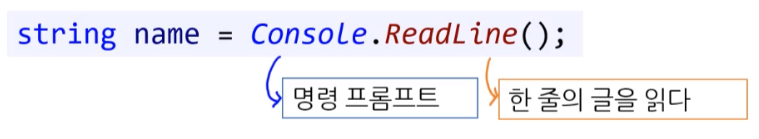
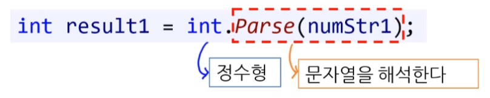

# 01-05 입출력1 


## 1. 입출력

### 1.1. 입력

#### 1) '문자열' 입력 - ReadLine()

* **Console.ReadLine()** 

```c#
string num = Console.ReadLine()
```



---

* Console : 명령 프로픔트
* ReadLine() :  <u>명령 프롬프트에서 한 줄의 글을 읽는 기능</u>을 가진다.
  * Enter 키가 입력 되기 전 까지의 값을 반환한다.
  * 키보드로부터 받은 값은 반드시 문자열 형으로 반환한다.


#### 2) '문자열' 입력 - Read(), ReadKey()

* **Console.Read()** : 콘솔에서 한 문자를 정수로 입력 받습니다. ( 입력한 값은 문자에 해당하는 정수로 반환 된다. )

```csharp
int x = Console.Read();
Console.WriteLine(x);
Console.WriteLine(Convert.ToChar(x));
```

```
A (Enter)
65
A
```


---


* **Console.ReadKey()** : 콘솔 키보드에서 다음 문자나 사용자가 누른 기능 키 값을 가져옵니다.
  * 'ConsoleKeyInfo 구조체', 'ConsoleKey 열거형'을 사용할 수 있습니다.

```csharp
ConsoleKeyInfo cki = Console.ReadKey(true);		// 키보드 키 값 입력
Console.WriteLine($"{cki.Key}");				// Key
Console.WriteLine($"{cki.KeyChar}");			// UniCode
Console.WriteLine($"{cki.Modifiers}");			// Ctrl, Shift Alt 조합
if (cki.Key == ConsoleKey.Q)
{
    Console.WriteLine("Q를 입력하셨군요..");
}
```


#### 3) '문자열'을 '정수형'으로 변환

* **문자열을 정수형으로 묵시적/명시적 변환은 불가능**

* 해결법 : Parse ( 사전적 의미 : 해석하다 / 분석하다 )

---

```C#
int num = Console.ReadLine();	// 묵시적 변환 ( 불가능 )
```

``` 
CS0029 에러 코드 - 암시적 ( 묵시적 ) 변환 할 수 없습니다.
```

---

```c#
int num = (int)Console.ReadLine();	// 명시적 변환 ( 불가능 )
```

```
CS0030 에러 코드 - 명시적 변환 할 수 없습니다.
```

---


#### - Parse



* 이 함수는 **문자열을 특정 형으로 변환(해석) 하는 기능**을 가지고 있다.

* <u>공백을 제외한 데이터를 해석한다.</u>

* 다른 프로그래밍 언어에도 이런 유사한 함수들이 존재한다.

* 문자열이 숫자 외의 값을 가질 경우 예외 ( exception ) 발생

  ```c#
  int result = int.Parse("a");
  ```


**코드**

```c#
int num1 = int.Parse(Console.ReadLine());
long num2 = long.Parse(Console.ReadLine());
Console.WriteLine(num1);
Console.WriteLine(num2);
```

**실행**

```c#
     25     // int.Parse(Console.ReadLine())
  9999999   // long.Parse(Console.ReadLine())
```

```c#
25			// num1 = 25
9999999		// num2 = 9999999
```

---

```C#
string userInput = Console.ReadLine();

int int_number = int.Parse(userInput);				// 문자열을 정수로 변환
double double_number = double.Parse(userInput);		// 문자열을 실수로 변환
```


### 1.2. 출력 - WriteLine()

* 출력 함수 ( 메소드 ) - 활용
  * Write() - 개행이 없다.
  * WriteLine() - 개행이 있다. 

* 여러 줄 문자열 만들기
  * 줄 바꿈 ( \n )


## 2. 다양한 형식 출력 - 클래스

### 2.1. 날짜 형식 ( DateTime Class )

DateTime에서 날짜 관련 정보를 제공합니다.

```csharp
> DateTime.Now 	// 날짜 전체
[2020-07-48 오전 7:24:06]
    
> DateTime.Year
> DateTime.Month
> DateTime.Day
> DateTime.Hour
> DateTime.Minute
> DateTime.Second
```

```csharp
DateTime dt = new DateTime(2018, 11, 3, 23, 18, 22);	// 2018년 11월 3일 23시 18분 22초
WriteLine("{0}", dt);	// 국가 및 지역 설정에 따라 다른 결과 출력
```


**[ 날짜 및 시간 - 서식 지정자 ]**

* 자세히 : [MSDN 날짜 및 시간 - 서식 지정자](https://learn.microsoft.com/ko-kr/dotnet/standard/base-types/standard-date-and-time-format-strings#table-of-format-specifiers)

* ( 한 번에 정리하기 )
  * 이것이 C#이다 : p106~p108


### 2.2. 변환 ( Convert Class )

데이터 형식을 변환할 수 있는 클래스다.

* `Convert.ToString()` : 숫자 데이터 형식을 문자열로 변경합니다.
* `Convert.ToInt32()` : 숫자 데이터 형식을 정수 형식으로 변경합니다.
* `Convert.ToDouble()` : 숫자 데이터 형식을 실수 형식으로 변경합니다.
  * 그 외 : `Convert.ToSingle()`, `Convert.ToDecimal()`
* `Convert.ToChar()` : 입력 받은 숫자 또는 문자열 하나를 문자로 변경합니다.


**[ Parse 대체 ]**

아래 두 가지 메서드는 Parse() 메서드로 대체 가능하다. ( 권장 )

`Convert.ToInt32()` => `int.Parse()` 

`Convert.ToDouble()` => `double.Parse()`


## 2. 실습 ( 보류 )

*  카지노 ( 랜덤 함수 짧게 설명 기입 )

----

**최종 복습 예문 - Casino**

```python
from random import randint, randrange

# Welcome to Python Casino
print("Welcome to Python Casino!")
pc_choice = randint(1, 100)

game_set = True

while game_set:
  my_choice = int(input("Choose your number(1-100) : "))
  if my_choice < pc_choice:
    print("▲△▲△ UP △▲△▲")
  elif my_choice > pc_choice:
    print("▼▽▼▽ DOWN ▽▼▽▼")
  elif my_choice < 1 or my_choice > 100:
    print("Choose the number between 1 to 100!")
  else:
    print("★★ You Win!", randrange(999999, 99999999), "get Moneny ★★")
    game_set = False

print("==========================================")
print("▣ randrange type : ", type(randrange(1,10)))
```


