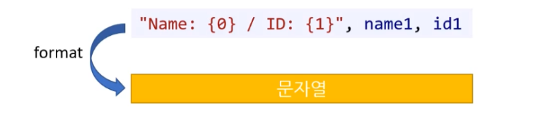

# 01-06 입출력2 ( String Format ) 

* **문자열 포맷팅(string formatting) 은 무엇인가?** 

  * 문자열을 만들때 원하는 위치에 특정한 값(변수)를 삽입해서 문자열을 출력하기 위한 형식이다.

  


## 1. 문자열 포맷팅

* **\+ 더하기 포맷팅은 어떻게 사용하는가?**

  * \+ 연산자를 이용해서 문자열을 만들 수 있다.

  ---

  * 문자열 + 문자열

  ---

  * 정수형 + 문자열 / 문자열 + 정수형
  * 부동소수형 + 문자열 / 문자열 + 부동소수형

  ---

  * 문자열 + 부동소수형 + 정수형 / 문자열 + 정수형 + 부동소수형
  * 정수형 + 문자열 + 부동소수형 / 부동소수형 + 문자열 + 정수형

  ---

  ```c#
  Console.WriteLine("고" + 1 + 1.2);
  ```


* **\+ 더하기 포맷팅에서 주의할 사항은?**
  * 연산 우선순위를 고려해야 한다. ( 실수가 발생할 수 있다. )
  * [주의!] 정수형 + 부동소수형 + 문자열
    * 정수랑 부동소수가 숫자로 더해진 후 문자열이 된다. ( 연산 우선순위 - 계산 )


---


* **string.Format()은 무엇인가?**

  * ( \+ 더하기 포맷팅 보다 개선된 방법이다. )
  * 색인 (index)를 사용한다. 
    * 문장에 {0}, {1} ... {n}과 같은 인덱싱을 이용해서 원하는 값을 대입할 수 있다.
  * 소괄호 안에 있는 데이터를 특정 서식에 맞춰 결합하여 문자열을 만드는 함수이다.
    * 문자열 반환

  

  


---


* **문자열 보간 ( string interpolation ) - $"{} {}"은 무엇인가?**
  * 최신 C#에 등장 ( C# 6 )
  * string.Format() 방식보다 더 개선된 방식이다. 
  * 문자열 앞에 "$"를 붙여준다.
  * 대채 될 문자열을 "{\<변수명>}"으로 표현한다.

```c#
string message = $"Student Name: {name} / Student ID: {id}";
Console.WriteLine($"Student Name: {name} / Student ID: {id}");
```


* **세 문자열 포맷팅을 사용시 실수가 적어지는 순서대로 나열하시오.**
  * `문자열 보간`    >    `string.Format()`    >    `+ 더하기 포맷팅`


---


## 2. 데이터 포맷팅

* **주니어 시절 때 포맷팅을 잘 사용해야 하는 이유는?**
  * 주니어 개발자 시기에 데이터 정리를 하게 된다.
  * 이 때 포맷팅과 이스케이프 문자를 잘 활용하는 것이 좋다.
  * 꼼꼼한 습관 - 다지기 좋은 시기이다.


### 2.1. 정렬

* **문자열을 우측 정렬해서 출력 하시오.**

  입력한 숫자 만큼 칸 확보가 된다. ( 문자열 포함한 숫자다.)

  ```cs
  // Console.WriteLine - 오른쪽 정렬
  Console.WriteLine("{0, 10}", "Lulu");
  ```

  ```cs
  // string.Fromat() - 오른쪽 정렬
  string name = "Lulu"
  string str = string.Format("{0, 10}", name);
  Console.WriteLine(str);
  ```

  ```cs
  // 문자열 보간 (string interpolation) -  오른쪽 정렬
  string name = "Lulu"
  string str = $"{name, 10}"
  Console.WriteLine(str);
  ```


* **문자열을 좌측 정렬해서 출력 하시오.**

  입력한 숫자 만큼 칸 확보가 된다. ( 문자열 포함한 숫자다.)

  ```cs
  // Console.WriteLine - 왼쪽 정렬
  string name = "Lulu"
  Console.WriteLine("{0, -10}", name);	
  //Console.WriteLine("{0, -10}", "Lulu");
  ```

  ```cs
  // string.Fromat() - 왼쪽 정렬
  string name = "Lulu"
  string str = string.Format("{0, -10}", name);
  Console.WriteLine(str);
  ```

  ```cs
  // 문자열 보간 (string interpolation) - 왼쪽 정렬
  string name = "Lulu"
  string str = $"{name, -10}"
  Console.WriteLine(str);
  ```


* **int 최댓값, 최솟값을 정렬하시오. ( 5칸 공백 )**

  * 최댓값 : 10자리
  * 최솟값 : 11자리 ( 부호 1칸 )

  ```cs
  int num1 = int.MaxValue;
  int num2 = int.MinValue;
  Console.WriteLine("{0,-15}+{1,16} = {2}", num1, num2, num1 + num2);
  ```

  ```
  2147483647     +     -2147483648 = -1
  ```

  

* **string 관련 메서드를 활용하여 문자열 정렬을 하세요.**

  * 문자열 자체 내에서 정렬 시키는 방식이다.
  * PadLeft(), PadRight() 활용한다.

  ```C#
  // 왼쪽 및 오른쪽 정렬
  // 첫 번째 매개변수 : 공간 크기, 두 번째 매개변수 : 공백에 들어갈 텍스트 형태이다.
  int width = 15;
  string s = "치킨";
  Console.WriteLine(s.PadLeft(width, ' '));		
  Console.WriteLine(s.PadRight(width, ' '));
  ```

  ```
               치킨
  치킨
  ```

  

  


### 2.2. 소수점 자리 수 - 출력

* **소수점 자리수를 출력하세요.**

  * 보통 작은 f를 사용한다.

  ```cs
  const float PI = 3.14159265359f;
  ```

  ---

  ```c#
  Console.WriteLine("{0:f4}", PI);			// 4자리까지 반올림
  ```

  ```csharp
  str = string.Format("{0:f4}", PI);			// 4자리까지 반올림
  ```

  ```cs
  str = $"{PI:f4}";							// 4자리까지 반올림
  ```

* **응용 ( 공간 확보 / 왼쪽 정렬 )** 

  ```cs
  Console.WriteLine("{0,-10:f4}", PI);		// 4자리까지 반올림, 10칸 왼쪽 정렬
  ```

  ```csharp
  str = string.Format("{0,-10:f4}", PI);		// 4자리까지 반올림, 10칸 왼쪽 정렬
  ```

  ```csharp
  str = $"{PI,-10:f4}";						// 4자리까지 반올림, 10칸 왼쪽 정렬
  ```

  


* **사칙 연산만을 사용하여 반올림 하세요.**

  **[ 정밀함 ]**
  
  ```csharp
  // 소수점 2자리 까지 반올림
  double totalCost = 453.154572;
  uint totalRound = (uint)(totalCost * 1000);
  totalCost = (totalRound + 5) / 10 / 100.0;
  ```

  **[ 가독성 ]**
  
  소수점 둘째 자리까지 반올림
  
  ```c#
  average = (int)(average * 100 + 0.5) / 100.0;
  ```
  
  ※ 0.5를 더하기를 하느냐 5를 더하기를 하느냐의 차이가 있다. 
     ( 5를 사용하는게 정밀도가 더 높을 듯 예상은 되는데 나중에 좀 더 알아보자. )
  
  
  
  


### 2.3. 진수 ( 진법 변환 ) 

* **진수 변환 (Base Converter)**

  ```csharp
  ==========================================================
  
  * 10진수 => 16진수 변환 ( 대문자, 소문자 - 사용가능 )
      ( int 정수형 => string 문자열 )
      1. ConSole.WriteLine()
      2. string.Format()
      3. 문자열 보간 (String interpolation)
      4. <정수형 변수>.ToString(string? format)
  
  * 10진수 => 2진수, 8진수 변환
      ( int 정수형 => string 문자열 )
      * Convert.ToString(int value, int toBase)
      * [주의] Convert.ToString 사용
      	* 정렬 없는 문자열만 만들어진다.
      	* Convert.ToString()이 16진수 변환은 소문자만 가능하다.
      
  ==========================================================
          
  * N진수 => 10진수 변환 
      ( string 문자열 => int 정수형 )
      * Convert.ToInt32(string value, int fromBase)
  
  ==========================================================
  ```

  * 맨 하단의 코드 확인 


### 2.4. @ 출력

* **@를 사용한 문자열 포맷 방식은 무엇인가?**

  * 역슬래시 ( \\ )를 그대로 출력하고 싶을 때 "@" 기호를 사용한다.

    ```c#
    Console.WriteLine("\x61");		// a를 출력
    Console.WriteLine(@"\x61");		// \x61을 그대로 출력
    ```

    ```
    a
    \x61
    ```

    * 단, 큰 따옴표만 다르게 동작한다.

      * 큰 따옴표 출력시에는 @ 방식이 작동하지 않는다.
        ( 큰 따옴표 쓸 때 사용하는 것은 비효율적이다. )

      ```c#
      Console.WriteLine("\"Hello World\"");	// "Hello World" 출력
      Console.WriteLine(@"""Hello World""");	// "Hello World" 출력
      ```

      ```
      "Hello World"
      "Hello World"
      ```


* **@를 사용하는 이유는 무엇인가?**
  * 역슬래시 출력하기 간편하게 하기 위해 사용하는 방식이다.
  * 주로, 파일 및 폴더의 주소를 기입할 때 사용한다.


* **$@을 결합하는 사용방식은 어떤가?**

  * 가독성이 매우 떨어지는 쓰레기 방식이다.

  * 협업하기 매우 비효율적이다. ( 업계에서 사용하지 않는 방식이다. )

    


---


### ★ 진법/진수 변환 관련 코드

```cs
using System;
using System.Globalization;

namespace HelloWorld
{
    class Program
    {
        static void Main(string[] args)
        {
            string strBase2 = "0000011011101010"; // 0x06EA
            string strBase8 = "3352";
            string strBase16_lower = "0x06ea";
            string strBase16_upper = "0x06EA";

            int intBase10 = 1770;

            Console.WriteLine("--------------------------------------------------------------");
            Console.WriteLine("# 진수별 숫자 모음 ");
            Console.WriteLine($"[ 10진수 ] : {intBase10}");
            Console.WriteLine();
            Console.WriteLine($"[  2진수 ] : {strBase2}");
            Console.WriteLine($"[  8진수 ] : {strBase8}");
            Console.WriteLine($"[ 16진수 ( 소문자 ) ] : {strBase16_lower}");
            Console.WriteLine($"[ 16진수 ( 대문자 ) ] : {strBase16_upper}");
            Console.WriteLine("--------------------------------------------------------------");


            Console.WriteLine("--------------------------------------------------------------");
            Console.WriteLine("1. Console.WriteLine()");
            Console.WriteLine("( 10진수 => 16진수 )");
            Console.WriteLine();

            //Console.WriteLine("[ 2진법 ] : {0:b}", intBase10);                  // 2진법 ( 없음 - msdn 확인 완료 ) 
            //Console.WriteLine("[ 8진법 ] : {0:o}", intBase10);                  // 8진법 ( 없음 - msdn 확인 완료 )
            Console.WriteLine($"[  10진수 =>  2진수           ] : 불가능");
            Console.WriteLine($"[  10진수 =>  8진수           ] : 불가능");

            Console.WriteLine("[  10진수 => 16진수 (소문자)  ] : {0:x8}", intBase10);      // 16진법 ( 소문자 - 8칸 공백 )
            Console.WriteLine("[  10진수 => 16진수 (대문자)  ] : {0:X8}", intBase10);      // 16진법 ( 대문자 - 8칸 공백 )
            Console.WriteLine("--------------------------------------------------------------");


            Console.WriteLine("--------------------------------------------------------------");
            Console.WriteLine("2. string.Format()");
            Console.WriteLine("( 10진수 => 16진수 )");
            Console.WriteLine();

            //Console.WriteLine(string.Format("[ 2진법 ] : {0:b}", intBase10));                     // 2진법 ( 없음 - msdn 확인 완료 ) 
            //Console.WriteLine(string.Format("[ 8진법 ] : {0:o}", intBase10));                     // 8진법 ( 없음 - msdn 확인 완료 ) 
            Console.WriteLine($"[  10진수 =>  2진수           ] : 불가능");
            Console.WriteLine($"[  10진수 =>  8진수           ] : 불가능");

            Console.WriteLine(string.Format("[  10진수 => 16진수 (소문자)  ] : {0:x8}", intBase10));        // 16진법 ( 소문자 - 8칸 공백 )
            Console.WriteLine(string.Format("[  10진수 => 16진수 (대문자)  ] : {0:X8}", intBase10));        // 16진법 ( 대문자 - 8칸 공백 )
            Console.WriteLine("--------------------------------------------------------------");


            Console.WriteLine("--------------------------------------------------------------");
            Console.WriteLine("3. 문자열 보간 ( String interpolation )");
            Console.WriteLine("( 10진수 => 16진수 )");
            Console.WriteLine();

            //Console.WriteLine($"[  10진수 =>  2진수           ] : {intBase10:b}");                     // 2진수 ( 없음 - msdn 확인 완료 ) 
            //Console.WriteLine($"[  10진수 =>  8진수           ]  : {intBase10:o}");                     // 8진수 ( 없음 - msdn 확인 완료 ) 
            Console.WriteLine($"[  10진수 =>  2진수           ] : 불가능");
            Console.WriteLine($"[  10진수 =>  8진수           ] : 불가능");

            Console.WriteLine($"[  10진수 => 16진수 (소문자)  ] : {intBase10:x8}");            // 16진법 ( 소문자 - 8칸 공백 )
            Console.WriteLine($"[  10진수 => 16진수 (대문자)  ] : {intBase10:X8}");            // 16진법 ( 대문자 - 8칸 공백 )
            Console.WriteLine("--------------------------------------------------------------");


            Console.WriteLine("--------------------------------------------------------------");
            Console.WriteLine("4. <정수형 변수>.ToString(string? format)");
            Console.WriteLine("( 10진수 => 16진수 )");
            Console.WriteLine();

            Console.WriteLine($"[  10진수 =>  2진수           ] : 불가능");                                          // 2진수 ( 없음 - msdn 확인 완료 ) 
            Console.WriteLine($"[  10진수 =>  8진수           ] : 불가능");                                          // 8진수 ( 없음 - msdn 확인 완료 ) 
            Console.WriteLine($"[  10진수 => 16진수 (소문자)  ] : {intBase10.ToString("x8")}");          // 16진수 ( 소문자 - 8칸 공백 )
            Console.WriteLine($"[  10진수 => 16진수 (대문자)  ] : {intBase10.ToString("X8")}");          // 16진수 ( 대문자 - 8칸 공백 )
            Console.WriteLine("--------------------------------------------------------------");


            Console.WriteLine("--------------------------------------------------------------");
            Console.WriteLine("5. Convert.ToString(int value, int toBase)");
            Console.WriteLine("( 10진수 => N진수 ) - 대문자 처리 / 공백 처리 [ 불가 ]");
            Console.WriteLine();

            Console.WriteLine($"[  10진수 =>  2진수           ] : {Convert.ToString(intBase10, 2)}");                     // 2진수 ( 공백 처리 불가 )
            Console.WriteLine($"[  10진수 =>  8진수           ] : {Convert.ToString(intBase10, 8)}");                     // 8진수 ( 공백 처리 불가 )
            Console.WriteLine($"[  10진수 => 16진수 (소문자)  ] : {Convert.ToString(intBase10, 16)}");        // 16진수 ( 소문자 ) ( 공백 처리 불가 )
            Console.WriteLine($"[  10진수 => 16진수 (대문자)  ] : 불가능");                                   // 16진수 ( 대문자 ) ( 없음 - msdn 확인 완료 )
            Console.WriteLine("--------------------------------------------------------------");


            Console.WriteLine("--------------------------------------------------------------");
            Console.WriteLine("6. Convert.ToInt32(string value, int fromBase)");
            Console.WriteLine("( N진수 => 10진수 )");
            Console.WriteLine();

            Console.WriteLine($"[   2진수          => 10진수  ] : {Convert.ToInt32(strBase2, 2)}");                                       //  2진수 => 10진수
            Console.WriteLine($"[   8진수          => 10진수  ] : {Convert.ToInt32(strBase8, 8)}");                                       //  8진수 => 10진수 
            Console.WriteLine($"[  16진수 (소문자) => 10진수  ] : {Convert.ToInt32(strBase16_lower, 16)}");                    // 16진수 ( 소문자 ) => 10진수
            Console.WriteLine($"[  16진수 (대문자) => 10진수  ] : {Convert.ToInt32(strBase16_upper, 16)}");                    // 16진수 ( 대문자 ) => 10진수
            Console.WriteLine("--------------------------------------------------------------");
        }
    }
}
```

```
--------------------------------------------------------------
# 진수별 숫자 모음
[ 10진수 ] : 1770

[  2진수 ] : 0000011011101010
[  8진수 ] : 3352
[ 16진수 ( 소문자 ) ] : 0x06ea
[ 16진수 ( 대문자 ) ] : 0x06EA
--------------------------------------------------------------
--------------------------------------------------------------
1. Console.WriteLine()
( 10진수 => 16진수 )

[  10진수 =>  2진수           ] : 불가능
[  10진수 =>  8진수           ] : 불가능
[  10진수 => 16진수 (소문자)  ] : 000006ea
[  10진수 => 16진수 (대문자)  ] : 000006EA
--------------------------------------------------------------
--------------------------------------------------------------
2. string.Format()
( 10진수 => 16진수 )

[  10진수 =>  2진수           ] : 불가능
[  10진수 =>  8진수           ] : 불가능
[  10진수 => 16진수 (소문자)  ] : 000006ea
[  10진수 => 16진수 (대문자)  ] : 000006EA
--------------------------------------------------------------
--------------------------------------------------------------
3. 문자열 보간 ( String interpolation )
( 10진수 => 16진수 )

[  10진수 =>  2진수           ] : 불가능
[  10진수 =>  8진수           ] : 불가능
[  10진수 => 16진수 (소문자)  ] : 000006ea
[  10진수 => 16진수 (대문자)  ] : 000006EA
--------------------------------------------------------------
--------------------------------------------------------------
4. <정수형 변수>.ToString(string? format)
( 10진수 => 16진수 )

[  10진수 =>  2진수           ] : 불가능
[  10진수 =>  8진수           ] : 불가능
[  10진수 => 16진수 (소문자)  ] : 000006ea
[  10진수 => 16진수 (대문자)  ] : 000006EA
--------------------------------------------------------------
--------------------------------------------------------------
5. Convert.ToString(int value, int toBase)
( 10진수 => N진수 ) - 대문자 처리 / 공백 처리 [ 불가 ]

[  10진수 =>  2진수           ] : 11011101010
[  10진수 =>  8진수           ] : 3352
[  10진수 => 16진수 (소문자)  ] : 6ea
[  10진수 => 16진수 (대문자)  ] : 불가능
--------------------------------------------------------------
--------------------------------------------------------------
6. Convert.ToInt32(string value, int fromBase)
( N진수 => 10진수 )

[   2진수          => 10진수  ] : 1770
[   8진수          => 10진수  ] : 1770
[  16진수 (소문자) => 10진수  ] : 1770
[  16진수 (대문자) => 10진수  ] : 1770
--------------------------------------------------------------
```


