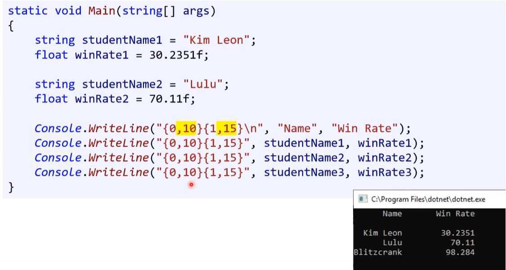

# 14 입출력2 ( String Format ) 

* **문자열 포맷팅(string formatting)** 
  * 문자열을 만들때 원하는 위치에 특정한 값(변수)를 삽입해서 문자열을 출력하기 위한 형식


## 1. 문자열 포맷팅 

### 1.1. + 더하기 연산자

\+ 연산자를 이용해서 문자열을 만들 수 있다.

---

* 문자열 + 문자열

---

* 정수형 + 문자열 / 문자열 + 정수형
* 부동소수형 + 문자열 / 문자열 + 부동소수형

---

* 문자열 + 부동소수형 + 정수형 / 문자열 + 정수형 + 부동소수형
* 정수형 + 문자열 + 부동소수형 / 부동소수형 + 문자열 + 정수형
* [주의!] 정수형 + 부동소수형 + 문자열
  * 정수랑 부동소수가 숫자로 더해진 후 문자열이 된다. ( 연산 우선순위 - 계산 )

---

```c#
Console.WriteLine("고" + 1 + 1.2);
```


**[단점]**

* 결합해야 할 문자열이 많아지고 복잡해진다. ( 가독성 악화 )
* 다수 결합 되면서 합치고 버려지는 '인지 string'이 발생하면서 성능 저하가 생길 우려가 생긴다.


### 1.2. string.Format()

* `+ 더하기 연산자` 포맷팅 보다 개선된 방법이다.
* `Format()` 메소드를 활용한다.


* 서식 항목 안에 있는 데이터를 특정 서식에 맞춰 결합하여 문자열을 만드는 함수이다.
  * 서식 항목(Format Item) : {0}, {1} 등에 입력되는 것들을 말한다.
  * 문자열 반환


#### 1) 인덱싱

* **색인 (index)**
  * 자리 표시자(place holder) 또는 서식 지정자(format specifier)라고 불리기도 한다.

* 문장에 {0}, {1} ... {n}과 같은 인덱싱을 이용해서 원하는 값을 대입할 수 있다.
* String.Format() , Console.WriteLine()  두 곳 모두에 쓸 수 있다.


**[ 참 {0}을 두 군데 쓰면 어떻게 될까요? ]**


**[ 참 {0}과 {1}의 위치를 바꾼다면? ]** **@@@@@@@@@@@@**

```cs
Console.WriteLine("{1} {0}", "Hello", "World!");
```

```
World! Hello
```

인덱싱 위치에 맞게 순서가 바뀐다.


#### 2) 서식 항목 - `{첨자, 맞춤:서식 문자열}`

```csharp
Console.WritLine("Total : {0, -7: D}", 123);	// 첨자:0, 맞춤:-7, 서식 문자열:D
```

* `{첨자, 맞춤 : 서식 문자열}`
  * 첨자 : 서식 항목의 첨자
  * 맞춤 : 왼쪽 / 오른쪽 맞춤 정렬
  * 서식 문자열 : 변환 서식 지정 문자열 ( 서식 지정자를 기입한다. )
    * 서식 지정자 (Format Specifier)

---

**[ 서식 지정자 ]**

※ 자세한 내용 : [msdn 서식 지정자](https://learn.microsoft.com/ko-kr/dotnet/standard/base-types/standard-numeric-format-strings)


* N : 입력된 수를 콤마로 구분하여 출력합니다.
* E : 입력된 수를 지수 표기로 서식화 합니다.

[참고] 자릿수 지정자(Precision Specifier) : 서식 지정자 옆에 입력할 0부터 99까지 입력할 수 있는 수이다.

---


#### 3) 가독성 비교 : `+ 연산자` vs `string.Format()`


#### 4) 기타

##### - String.Format() / 변수 활용 @@@@@

* 충분히 '문자열 보간'으로 변경할 수 있는 부분이다.

```cs
int width = 10;
...
output.Write(String.Format("{0," + width + "}", Convert.ToString(numbers[i], 8)));
```


### 1.3. 문자열 보간 ★

최신 추가 된 방법이다. 
더 개선된 방식이다. ★

* 최신 C#에 등장 ( C# 6.0 버전 )
  * 문자열 보간 ( string interpolation )이라고도 불린다.
  * 문자열 템플릿 ( string template ) 또는 템플릿 문자열 ( template string )이라고도 불린다.
  
* 문자열 앞에 "$"를 붙여준다.
* 대채 될 문자열을 "{\<변수명>}"으로 표현한다.
* String.Format 자체가 의미가 없다.

```c#
string message = $"Student Name: {name} / Student ID: {id}";
Console.WriteLine($"Student Name: {name} / Student ID: {id}");
```


### [■] 세 문자열 포맷팅 ( 비교 )


## 2. 데이터 포맷팅

데이터를 깔끔하게 관리 및 정리하여 표현할 수 있는 다양한 포맷팅 방식이다.


**[ 주니어 개발자와 데이터 정리 ]**

주니어 개발자 시기에 데이터 정리를 하게 된다.

이 때 포맷팅과 이스케이프 문자를 잘 활용하는 것이 좋다.

* 꼼꼼한 습관 - 다지기


### 2.1. 정렬

* 스페이스 바를 이용하지 않고 정렬하기
* 기본값 : 우측 정렬 





#### 1) 서식 항목

##### (1) 우측 정렬

* 기본 값 : 우측정렬
* **string.Format()** 에서 동일하게 사용가능
* **문자열 보간 (string interpolation)** 에서도 동일하게 작동한다.


```cs
// Console.WriteLine - 오른쪽 정렬
Console.WriteLine("{0, 10}", "Lulu");
```

```cs
// string.Fromat() - 오른쪽 정렬
string name = "Lulu"
string str = string.Format("{0, 10}", name);
Console.WriteLine(str);
```

```cs
// 문자열 보간 (string interpolation) -  오른쪽 정렬
string name = "Lulu"
string str = $"{name, 10}"
Console.WriteLine(str);
```


##### (2) 좌측 정렬

* 음수 값을 를 넣으면 된다.


```cs
// Console.WriteLine - 왼쪽 정렬
string name = "Lulu"
Console.WriteLine("{0, -10}", name);	
//Console.WriteLine("{0, -10}", "Lulu");
```

```cs
// string.Fromat() - 왼쪽 정렬
string name = "Lulu"
string str = string.Format("{0, -10}", name);
Console.WriteLine(str);
```

```cs
// 문자열 보간 (string interpolation) - 왼쪽 정렬
string name = "Lulu"
string str = $"{name, -10}"
Console.WriteLine(str);
```


##### (3) 자리 칸 수 정렬

int는 11칸을 차지하며 정렬할 수 있을까?

* 정렬시 입력한 숫자 값이 칸 자리를 수를 의미한다.

---

[답] int의 최댓값은 10자릿수. 여기에 - 부호까지 포함하면 ( 총 11칸 )

```c#
int num1 = int.MaxValue;
int num2 = int.MinValue;
Console.WriteLine("{0,-11} + {1,11} = {2}", num1, num2, num1 + num2);
```

```
2147483647  + -2147483648 + -1
```

* MaxValue : 2147483647 ( 10 자리 )
* MinValue : -2147483648 ( 10 자리 + 1 자리 [부호] )

---


#### 2) string 메서드 

##### - PadLeft, PadRight

문자열 자체 내에서 정렬 시키는 방식이다.

* 사용 결과 : '문자열 보간'에서는 우측 좌측 정렬에 변수를 집어 넣을 수 없기 때문에 `PadLeft, PadRight`를 사용해야 한다. ( 우측 좌측 정렬시에는 너비를 상수만 기입해야 한다. 내가 아는 한 아직까지 방법을 찾지 못했다. @@ ) @@@@@@@@@@@@@@@@@@@@@@@@@@@@@@@@@@@@@@@@

```C#
// 왼쪽 및 오른쪽 정렬
// 첫 번째 매개변수 : 공간 크기, 두 번째 매개변수 : 공백에 들어갈 텍스트 형태이다.
int width = 15;
string s = "치킨";
Console.WriteLine(s.PadLeft(width, ' '));		
Console.WriteLine(s.PadRight(width, ' '));
```

```
             치킨
치킨
```


### 2.2. 소수점 자리 수

* 출력할 때 서식을 정하는 방법이다.


#### 1) string.Format("{0:f3}", 3.141592...) @@@@

* 보통 작은 f를 사용한다.


#### 2) string.Format("{0:0.00}", value) @@@@

```cs
// 6번째 까지 출력 ( 7번째 자리의 값을 반올림하여 출력 )

double value = 3.14159265359;

// string result = string.Format("{0:0.#####0}", value)
string result = string.Format("{0:0.000000}", value); 	// 위의 값 동일
Console.WriteLine(result);
```

```
3.141593
```

※ 1)과 2)은 내부 방식이 다르다. 나중에 아래 레퍼런스 참고해서 나중에 개념 보충하기

* F3 : [링크](https://learn.microsoft.com/ko-kr/dotnet/standard/base-types/standard-numeric-format-strings?redirectedfrom=MSDN)
* 0.00 : [링크](https://learn.microsoft.com/ko-kr/dotnet/standard/base-types/custom-numeric-format-strings#rounding-and-fixed-point-format-strings)
* MidpointRounding : [링크](https://learn.microsoft.com/ko-kr/dotnet/api/system.midpointrounding?view=net-7.0#system-midpointrounding-toeven)


**[응용] 좌/우 정렬 + 소수점 자리 표현 - 함께 사용**

* 자릿수 뒤에 f를 붙여주는 것으로 소수점 자리 표현과 좌/우 정렬을 함께 사용할 수있다.

```c#
Console.WriteLine("{0,10} {1,15:f2}", Name, Rate);
```


**[기타] Math Class 사용** @@@@@@@@@@@

```cs
//Math Class를 이용
double value  = 5.123456789;


// 반올림
double result = Math.Round(value, 5);
//결과값 result = "5.12346" 

// 올림
result = Math.Ceiling(value);
//결과값 result = "6" 

// 내림
result = Math.Truncate(value);
//결과값 result = "5"
```


### 2.3. 진수 ( 진법 변환 ) 


#### 1) 10진수 => N진수 변환

* [주의!] 정수만 사용 가능


**(1) 10진수 => 16진수만 변환 가능 ( 대문자, 소문자 - 사용가능 )**
( int 정수형 => string 문자열 )

1. **ConSole.WriteLine()**
2. **string.Format()**
3. **문자열 보간 (String interpolation)**
4. **<정수형 변수>.ToString(string? format)**


**(2) 10진수 => 2진수, 8진수 변환**
( int 정수형 => string 문자열 )

* **메서드 및 옵션 사용시 : 16진수 ( 대소문자 가능 )**
* **Convert.ToString(int value, int toBase)**

---

**[ Convert .ToString() - 사용 TIP ]**

* **정렬**
  * 정렬 없는 문자열만 만들어진다.
  * [해결법] PadLeft, PadRight 활용
* **공백 처리**
  * 앞에 0이 안 붙기 때문에 고의 적으로 표시를 해야 한다.
  * [해결법] PadLeft, PadRight 옵션을 사용한다.
    * `Convert.ToString(5, 2).PadeLeft(4, '0')`

* **16진수 대문자**
  * Convert.ToString()이 16진수 변환은 소문자만 가능하다.
  * [해결법] 대문자를 사용할 때는 뒤에 `.ToUpper()`을 사용해 준다.


#### 2) N진수 => 10진수 변환 

( string 문자열 => int 정수형 )

* **Convert.ToInt32(string value, int fromBase)**

---

```cs
using System;
using System.Globalization;

namespace HelloWorld
{
    class Program
    {
        static void Main(string[] args)
        {
            string strBase2 = "0000011011101010"; // 0x06EA
            string strBase8 = "3352";
            string strBase16_lower = "0x06ea";
            string strBase16_upper = "0x06EA";

            int intBase10 = 1770;

            Console.WriteLine("--------------------------------------------------------------");
            Console.WriteLine("# 진수별 숫자 모음 ");
            Console.WriteLine($"[ 10진수 ] : {intBase10}");
            Console.WriteLine();
            Console.WriteLine($"[  2진수 ] : {strBase2}");
            Console.WriteLine($"[  8진수 ] : {strBase8}");
            Console.WriteLine($"[ 16진수 ( 소문자 ) ] : {strBase16_lower}");
            Console.WriteLine($"[ 16진수 ( 대문자 ) ] : {strBase16_upper}");
            Console.WriteLine("--------------------------------------------------------------");


            Console.WriteLine("--------------------------------------------------------------");
            Console.WriteLine("1. Console.WriteLine()");
            Console.WriteLine("( 10진수 => 16진수 )");
            Console.WriteLine();

            //Console.WriteLine("[ 2진법 ] : {0:b}", intBase10);                  // 2진법 ( 없음 - msdn 확인 완료 ) 
            //Console.WriteLine("[ 8진법 ] : {0:o}", intBase10);                  // 8진법 ( 없음 - msdn 확인 완료 )
            Console.WriteLine($"[  10진수 =>  2진수           ] : 불가능");
            Console.WriteLine($"[  10진수 =>  8진수           ] : 불가능");

            Console.WriteLine("[  10진수 => 16진수 (소문자)  ] : {0:x8}", intBase10);      // 16진법 ( 소문자 - 8칸 공백 )
            Console.WriteLine("[  10진수 => 16진수 (대문자)  ] : {0:X8}", intBase10);      // 16진법 ( 대문자 - 8칸 공백 )
            Console.WriteLine("--------------------------------------------------------------");


            Console.WriteLine("--------------------------------------------------------------");
            Console.WriteLine("2. string.Format()");
            Console.WriteLine("( 10진수 => 16진수 )");
            Console.WriteLine();

            //Console.WriteLine(string.Format("[ 2진법 ] : {0:b}", intBase10));                     // 2진법 ( 없음 - msdn 확인 완료 ) 
            //Console.WriteLine(string.Format("[ 8진법 ] : {0:o}", intBase10));                     // 8진법 ( 없음 - msdn 확인 완료 ) 
            Console.WriteLine($"[  10진수 =>  2진수           ] : 불가능");
            Console.WriteLine($"[  10진수 =>  8진수           ] : 불가능");

            Console.WriteLine(string.Format("[  10진수 => 16진수 (소문자)  ] : {0:x8}", intBase10));        // 16진법 ( 소문자 - 8칸 공백 )
            Console.WriteLine(string.Format("[  10진수 => 16진수 (대문자)  ] : {0:X8}", intBase10));        // 16진법 ( 대문자 - 8칸 공백 )
            Console.WriteLine("--------------------------------------------------------------");


            Console.WriteLine("--------------------------------------------------------------");
            Console.WriteLine("3. 문자열 보간 ( String interpolation )");
            Console.WriteLine("( 10진수 => 16진수 )");
            Console.WriteLine();

            //Console.WriteLine($"[  10진수 =>  2진수           ] : {intBase10:b}");                     // 2진수 ( 없음 - msdn 확인 완료 ) 
            //Console.WriteLine($"[  10진수 =>  8진수           ]  : {intBase10:o}");                     // 8진수 ( 없음 - msdn 확인 완료 ) 
            Console.WriteLine($"[  10진수 =>  2진수           ] : 불가능");
            Console.WriteLine($"[  10진수 =>  8진수           ] : 불가능");

            Console.WriteLine($"[  10진수 => 16진수 (소문자)  ] : {intBase10:x8}");            // 16진법 ( 소문자 - 8칸 공백 )
            Console.WriteLine($"[  10진수 => 16진수 (대문자)  ] : {intBase10:X8}");            // 16진법 ( 대문자 - 8칸 공백 )
            Console.WriteLine("--------------------------------------------------------------");


            Console.WriteLine("--------------------------------------------------------------");
            Console.WriteLine("4. <정수형 변수>.ToString(string? format)");
            Console.WriteLine("( 10진수 => 16진수 )");
            Console.WriteLine();

            Console.WriteLine($"[  10진수 =>  2진수           ] : 불가능");                                          // 2진수 ( 없음 - msdn 확인 완료 ) 
            Console.WriteLine($"[  10진수 =>  8진수           ] : 불가능");                                          // 8진수 ( 없음 - msdn 확인 완료 ) 
            Console.WriteLine($"[  10진수 => 16진수 (소문자)  ] : {intBase10.ToString("x8")}");          // 16진수 ( 소문자 - 8칸 공백 )
            Console.WriteLine($"[  10진수 => 16진수 (대문자)  ] : {intBase10.ToString("X8")}");          // 16진수 ( 대문자 - 8칸 공백 )
            Console.WriteLine("--------------------------------------------------------------");


            Console.WriteLine("--------------------------------------------------------------");
            Console.WriteLine("5. Convert.ToString(int value, int toBase)");
            Console.WriteLine("( 10진수 => N진수 ) - 대문자 처리 / 공백 표시 [ 불가 ]");
            Console.WriteLine();

            Console.WriteLine($"[  10진수 =>  2진수           ] : {Convert.ToString(intBase10, 2)}");                     // 2진수 ( 공백 표시 불가 )
            Console.WriteLine($"[  10진수 =>  8진수           ] : {Convert.ToString(intBase10, 8)}");                     // 8진수 ( 공백 표시 불가 )
            Console.WriteLine($"[  10진수 => 16진수 (소문자)  ] : {Convert.ToString(intBase10, 16)}");        // 16진수 ( 소문자 ) ( 공백 표시 불가 )
            Console.WriteLine($"[  10진수 => 16진수 (대문자)  ] : 불가능");                                   // 16진수 ( 대문자 ) ( 없음 - msdn 확인 완료 )
            Console.WriteLine("--------------------------------------------------------------");


            Console.WriteLine("--------------------------------------------------------------");
            Console.WriteLine("6. Convert.ToInt32(string value, int fromBase)");
            Console.WriteLine("( N진수 => 10진수 )");
            Console.WriteLine();

            Console.WriteLine($"[   2진수          => 10진수  ] : {Convert.ToInt32(strBase2, 2)}");                                       //  2진수 => 10진수
            Console.WriteLine($"[   8진수          => 10진수  ] : {Convert.ToInt32(strBase8, 8)}");                                       //  8진수 => 10진수 
            Console.WriteLine($"[  16진수 (소문자) => 10진수  ] : {Convert.ToInt32(strBase16_lower, 16)}");                    // 16진수 ( 소문자 ) => 10진수
            Console.WriteLine($"[  16진수 (대문자) => 10진수  ] : {Convert.ToInt32(strBase16_upper, 16)}");                    // 16진수 ( 대문자 ) => 10진수
            Console.WriteLine("--------------------------------------------------------------");
        }
    }
}

```

```
--------------------------------------------------------------
# 진수별 숫자 모음
[ 10진수 ] : 1770

[  2진수 ] : 0000011011101010
[  8진수 ] : 3352
[ 16진수 ( 소문자 ) ] : 0x06ea
[ 16진수 ( 대문자 ) ] : 0x06EA
--------------------------------------------------------------
--------------------------------------------------------------
1. Console.WriteLine()
( 10진수 => 16진수 )

[  10진수 =>  2진수           ] : 불가능
[  10진수 =>  8진수           ] : 불가능
[  10진수 => 16진수 (소문자)  ] : 000006ea
[  10진수 => 16진수 (대문자)  ] : 000006EA
--------------------------------------------------------------
--------------------------------------------------------------
2. string.Format()
( 10진수 => 16진수 )

[  10진수 =>  2진수           ] : 불가능
[  10진수 =>  8진수           ] : 불가능
[  10진수 => 16진수 (소문자)  ] : 000006ea
[  10진수 => 16진수 (대문자)  ] : 000006EA
--------------------------------------------------------------
--------------------------------------------------------------
3. 문자열 보간 ( String interpolation )
( 10진수 => 16진수 )

[  10진수 =>  2진수           ] : 불가능
[  10진수 =>  8진수           ] : 불가능
[  10진수 => 16진수 (소문자)  ] : 000006ea
[  10진수 => 16진수 (대문자)  ] : 000006EA
--------------------------------------------------------------
--------------------------------------------------------------
4. <정수형 변수>.ToString(string? format)
( 10진수 => 16진수 )

[  10진수 =>  2진수           ] : 불가능
[  10진수 =>  8진수           ] : 불가능
[  10진수 => 16진수 (소문자)  ] : 000006ea
[  10진수 => 16진수 (대문자)  ] : 000006EA
--------------------------------------------------------------
--------------------------------------------------------------
5. Convert.ToString(int value, int toBase)
( 10진수 => N진수 ) - 대문자 처리 / 공백 처리 [ 불가 ]

[  10진수 =>  2진수           ] : 11011101010
[  10진수 =>  8진수           ] : 3352
[  10진수 => 16진수 (소문자)  ] : 6ea
[  10진수 => 16진수 (대문자)  ] : 불가능
--------------------------------------------------------------
--------------------------------------------------------------
6. Convert.ToInt32(string value, int fromBase)
( N진수 => 10진수 )

[   2진수          => 10진수  ] : 1770
[   8진수          => 10진수  ] : 1770
[  16진수 (소문자) => 10진수  ] : 1770
[  16진수 (대문자) => 10진수  ] : 1770
--------------------------------------------------------------
```


### 2.4. @ - 그대로 출력하기

@기호를 붙이면 문자열 자체를 그대로 문자열로 저장합니다.

디렉터리 경로나 자바스크립트 코드 블록, SQL 문 등 여러 줄에 걸쳐 작성할 내용은 @ 기호를 앞에 붙여 문자열 하나로 인식하게 할 수 있습니다. 

* 역슬래시 ( \\ )를 그대로 출력하고 싶을 때 "@" 기호를 사용한다.

  ```c#
  Console.WriteLine("\x61");		// a를 출력
  Console.WriteLine(@"\x61");		// \x61을 그대로 출력
  ```

  ```
  a
  \x61
  ```

  * 단, 큰 따옴표만 다르게 동작한다.

    * 큰 따옴표 출력시에는 @ 방식이 작동하지 않는다.
      ( 큰 따옴표 쓸 때 사용하는 것은 비효율적이다. )

    * 역슬래시 출력하기 간편하게 하기 위해 사용하는 방식이다.

    ```c#
    Console.WriteLine("\"Hello World\"");	// "Hello World" 출력
    Console.WriteLine(@"""Hello World""");	// "Hello World" 출력
    ```

    ```
    "Hello World"
    "Hello World"
    ```


**[ 쓰레기 방식 ]**

$@를 연달아 사용하는 방식이 있지만 업계에서는 사용하지 않는 방식이다.
( 협업 하기에 비효율적이다. )


### 2.5. 그 외의 포맷팅

* 마이크로소프트의 문서 참고하기
* https://learn.microsoft.com/ko-kr/dotnet/api/system.string.format?view=net-7.0#Strating


