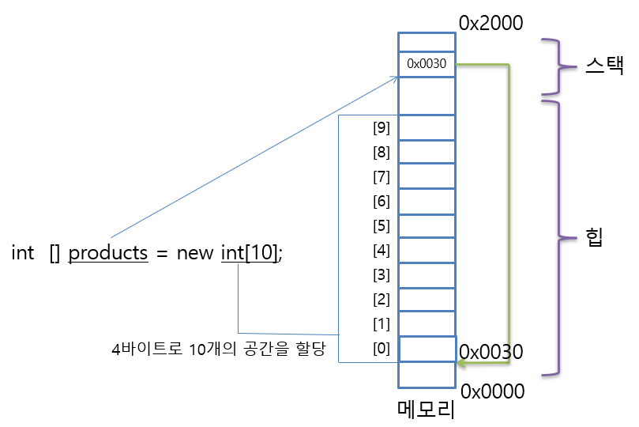

# 배열 ( Array ) 

* 컬렉션(collection) : 이름 하나로 데이터 여러 개를 담을 수 있다.
  * C#에서 다루는 컬렉션은 배열(array), 리스트(list), 사전(dictionary) 등이 있다.


**[ 배열의 종류 ]**

1. 1차원 배열
2. 다차원 배열
   * 다차원 배열 없이 프로그래밍 언어도 존재한다.
3. 배열의 배열
   * '가변(jagged) 배열'이라고 불리기도 한다.


---

## 1. 배열

* **array : 배열**
  * **element : 요소, 성분**
  * **item : 항목**


### 1.1. 개념

#### 1) 배경

배열 나오기 전 문제점

* 문제1 : 코드 중복
* 문제2 : 변수의 수를 동적으로 선하지 못함
  * 변수의 개수가 변경되면 코드를 바꿔야 하고 비효율적이다.

그렇게 탄생한 것이 배열이다.


#### 2) 개념

* 동일한 자료형을 여럿 담을 수 있는 자료구조이다. 
  * 요소(element) : 배열 안에 있는 각 데이터이다. ( 항목(item)이라고 불리기도 한다. )
* 몇 개의 데이터(길이)를 담을지 결정한 뒤에는 그 수를 바꿀 수 없다.
  * 내용은 변경 가능하다.


### 1.2. 기본 - 사용법

#### 1) 선언하기

* new 연산자를 사용한다.

```cs
int[] ages = new int[3];
float[] heights = new float[3];
```


**[ 배열의 메모리 구조 ]**




#### **2) 선언과 동시에 대입하기**

* **기본형**

  ```csharp
  int[] ages = new int[] {30, 14, 27};
  int[] year = new int[3] {2023, 2021, 1994}
  ```

  ```
  <자료형>[] <변수명> = new <자료형>[]{<데이터(콤마로 구분)>};
  ```

* **단축형**

  * <u>단축형을 좀 더 많이 본다.</u>

  ```csharp
  int[] ages = {30, 14, 27};
  ```

  ```
  <자료형>[] <변수명> = {<데이터(콤마로 구분)>};
  ```

  


#### 3) 요소 접근하기

* **access**

---

* 첨자 :  그림과 같은 '아래 첨자, 위 첨자'


---

* [] 안에 접근(access)하고자 하는 데이터의 색인(index)를 넣는다.
  * []을 첨자(subscript) 연산자라고 한다.
  * 대부분의 프로그래밍 언어에서 배열의 색인은 0부터 시작한다.
    * 첫 번째 : 0 , 두 번째 : 1
    * 그 이유는 메모리로 한 배열 안에 있는 모든 요소는 연속된 메모리 공간에 위치한다.
* 데이터가 들어가 있는 순서 : 제일 앞( 왼쪽 끝 )에서 부터 센다.
* 접근한 뒤에는 그 요소를 변수와 똑같이 사용 가능하다.


**[ 사용 예시 ]**


### 1.3. 응용 - 사용법

#### 1) char과 array

* string ( 문자열 )은 여러 개의 문자가 줄줄이 모인 집합체이다.
* char 배열은 여러 개의 문자 데이터를 담은 배열


* **char 배열과 string ( 문자열 ) 기본적으로 같은 데이터 방식이다.**
  * 그래서 일부 언어에서는 문자열을 지원 안 한다. 
  * string은 그저 char 배열을 보다 좀 더 많은 기능을 가지고 있고, 배열의 문제점 ( 고정 길이 / 길이 변경 불가 )을 해결 한다.
    * char 배열 : 고정 길이 / 길이 변경 불가 / 더하기 연산자 사용 불가능
    * string : 가변 길이 / 길이 변경 가능 / 더하기 연산자 사용 가능


> [참고] [댓글 답변] C#의 문자열은 C 처럼 널 캐릭터로 끝나는 char 배열이 아닙니다. 
> C#의 배열형은 길이까지 저장하는 "클래스 같은 놈"입니다. 길이를 알기 위해서는 str.Length인가 사용하면 된다.


#### 2) for문 - 활용

```c#
int[] ages = new int[3];

for (int i = 0; i < 3; ++i)
{
	age[i] = int.Parse(Console.ReadLine());
}
```


**[ 2차원 배열 ]**

2차원 배열은 순차적으로 접근하기 위해 for문이 2개 필요하다.

1. 행을 위한 for문
2. 열을 위한 for문


#### 3) 배열 프로퍼티 및 메서드

##### (1) Length 프로퍼티

<u>배열의 길이</u>를 알려준다.

모든 언어에서 사용할 수 있는 기능은 아니다.

* **<배열 변수명>**.Length
* 프로퍼티 ( property )
  * 함수는 아니다.
* C#에서 사용 방법이다. 

```c#
string[] args;
int length = args.Length;
```


##### (2) Rank 프로퍼티

배열의 차원수를 구할 수 있다.

* 2차원 배열이면 2반환
* 3차원 배열이면 3을 반환한다.

```cs
int[,,] arr = new int[2, 2, 2]
..
Console.WriteLine(arr.Rank);
```

```
3
```


##### (3) GetLength() 메서드

차수에 해당하는 길이를 알 수 있습니다.
GetLength(0), GetLength(1), GetLength(2) 형태로 1차원, 2차원, 3차원의 Length를 구할 수 있다.


**[ 2차원 배열 ]**

* arr.GetLength(0) : 행의 개수
* arr.GetLength(1) : 열의 개수


**[ 3차원 배열 ]**

* arr.GetLength(0) : 층의 개수
* arr.GetLength(1) : 행의 개수
* arr.GetLength(2) : 열의 개수


#### 4) 클린 코딩 : 사용 주의!

* 배열이 코드도 깔끔하고 좋긴 하지만 C#에서는 동적 할당(new 키워드 사용) 해줘야 한다는 흠이 있습니다.
* 가능하다면 정적 할당할 수 있는 변수를 사용하자.


## 2. 다차원 배열

* **Multi-dimensional Array**


### 2.1. 2차원 배열 

* **이미지 처리 ( 픽셀 데이터 )**
  * 게임 개발
  * 온라인 쇼핑물 ( 상품 )
* **테이블 형(Tabular Form) 데이터**
  * 엑셀 등

* **구구단 - 2차원 배열**


#### 1) 선언하기

2차원 배열의 인덱스는 행열로 xy 좌표를 표현하면 아래와 같다.
( 포토샵이나 다른 업무를 사용하는 입장에서 헷갈릴 수 있다. )


```c#
int[,] table = new int[2, 4];
// 					   y, x
```

* y와 x 값의 위치에 주의하자! [행, 열] [y, x]
* [ , ] 은 2차원을 의미한다. 
  * int[,]은 int형 2차원 배열을 의미한다.


#### 2) 선언과 동시에 대입하기

```c#
int[,] table1 = new int[,] { {1, 2, 3}, {2, 4, 6} };
int[,] table2 = new int[2,3] { {3, 6, 9}, {4, 8, 12} };
```

---

```csharp
int[,] table3 = { { 1, 2, 3 }, {4, 5, 6} };
```


#### 3) for 문 활용

2차원 배열은 순차적으로 접근하기 위해 for문이 2개 필요하다.

1. 행을 위한 for문
2. 열을 위한 for문


### 2.2. 3차원 배열

* '층, 행, 열'로 된 데이터 구조를 저장할 수 있습니다. 

* 사용 빈도 : 3차원 데이터를 다루는 분들이 많지 않기 때문에 많이 쓰이지는 않는다

  * **게임의 3차원**

    게임도 3차원 배열을 많이 쓰지는 않는다.
    2차원에서 3차원 배열을 쓰는 순간(축이 늘어나는 순간) 데이터가 기여 급수적으로 많아지기 때문이다.
    ( 그렇지만 특정 게임들은 3차원 데이터를 쓴다. 마인크래프트 등 - 실사 게임에 비해 정밀도가 높지 않다. )

  * **[포프 댓글]**  3D 공간에 있는 모든 점(point)마다 데이터를 저장하지 않고(3차원 배열) 거기서 실제 위치를 차지하는 점들만 다른 자료구조에 저장할 수 있습니다. 그러면 빈 공간은 저장 공간을 차지 하지 않죠

* 사용 분야

  * 3D 블록 데이터를 저장하는 게임 ( 3D 테트리스, 마인크래프트 등 ), 의료 프로그램 ( CT, MRI, MicroCT 스캐너 등)


### 2.3. 기타

#### 1)  N차원

* 물리 시뮬레이션
* 머신러닝
  * 피쳐 벡터 (feature vector)


#### 2) 반복문 중첩 ( 성능 문제 )

* **<u>반복문이 많아질 수록 성능이 떨어진다.</u>**
  * 기하급수적으로 떨어진다.
* 프로그램의 런타임 복잡도는 **내포(중첩)된 반복문 개수**에 **비례**한다.
  * 한 개 반복문 : O(N)
  * 이중 반복문 : O(N 제곱)
  * 삼중 반복문 : O(N 세제곱)
    * 만약 N = 100이라면 반복문 개수에 따라 100 => 10,000 => 1,000,000 증가 한다.
    * O(N 세제곱)을 O(N)으로 만들 수만 있다면 100,000 배 빨라질 수 있다. ( 알고리즘 성능 향상 )


## X. 실습 : 숫자야구


### 3.1. random 함수

```C#
int num = random.Next(1, 7);		// 1이상 7미만
```


### 3.2. 숫자야구

```C#
using System;

namespace UltimateBaseball
{
    class Program
    {
        static void Main(string[] args)
        {
            Console.WriteLine("+------------------------------------------------------+");
            Console.WriteLine("|                    궁극의 숫자야구 게임                 |");
            Console.WriteLine("+------------------------------------------------------+");
            Console.WriteLine("|    컴퓨터가 수비수가 되어 세 자릿수를 하나 골랐습니다.       |");
            Console.WriteLine("|    각 숫자는 0~9중에 하나며 중복되는 숫자는 없습니다.      |");
            Console.WriteLine("|    모든 숫자와 위치를 맞히면 승리합니다.                   |");
            Console.WriteLine("|    숫자와 순서가 둘다 맞으면 스트라이크입니다.            |");
            Console.WriteLine("|    숫자만 맞고 순서가 틀리면 볼입니다.                    |");
            Console.WriteLine("|    숫자가 틀리면 아웃입니다.                            |");
            Console.WriteLine("+------------------------------------------------------+");

            Random random = new Random();
            int[] numbers = new int[3];

            int index = 0;
            while(index < 3)
            {
                bool hashDuplicate = false;
                numbers[index] = random.Next(0,10);

                for (int i = 0; i < index; i++)
                {
                    if (numbers[index] == numbers[i])
                    {
                        hashDuplicate = true;
                        break;
                    }
                }
            
                if (!hashDuplicate)
                {
                    index++;
                }
            }

            int[] guess = new int[3];
            string[] message = {"> 첫 번째 숫자를 입력하세요 : ", "> 두 번째 숫자를 입력하세요 : ", "> 세 번째 숫자를 입력하세요 : " };

            while(true)
            {
                index = 0;
                while(index < 3)
                {
                    bool hashDuplicate = false;
                    
                    Console.Write(message[index]);
                    guess[index] = int.Parse(Console.ReadLine());

                    for (int j = 0; j < index; j++)
                    {
                        if (guess[index] == guess[j])
                        {
                            Console.WriteLine("중복 된 숫자 입니다. 다시 입력해 주세요.");
                            hashDuplicate = true;
                            break;
                        }

                        if(guess[index] > 9 || guess[index] < 0)
                        {
                            Console.WriteLine("숫자가 너무 크거나 작습니다. 다시 입력해 주세요.");
                            hashDuplicate= true;
                            break;
                        }
                    }
            
                    if (!hashDuplicate)
                    {
                        index++;
                    }
                }

                int strikCount = 0;
                int ballCount = 0;

                for (int i = 0; i < 3; i++)
                {
                    for (int j = 0; j < index; j++)
                    {
                        if (guess[i] == numbers[j])
                        {
                            if(i == j)
                            {
                                strikCount++;
                            }
                            else
                            {
                                ballCount++;
                            }
                        }
                    }
                }

                Console.Write("스트라이크 카운트 :");
                Console.WriteLine(strikCount);
                Console.Write("볼 카운트 :");
                Console.WriteLine(ballCount);
                Console.Write("아웃 카은트 :");
                Console.WriteLine(3- strikCount - ballCount);

                if (strikCount == 3)
                {
                    Console.WriteLine("축하합니다. 승리하셨습니다.");
                    break;
                }
            }
        }
    }
}

```


## @@@@@@@@@@@@@@@@@


다차원 배열 없이 다른 걸로 대신 하는 프로그래밍 언어도 존재한다. 

(ex) 파이썬은 C#과 다차원 배열 대신 배열의 배열을 사용하는 듯 하다. ( 나중에 검증 )

---

배열

* 선언
* 대입
* 요소 접근
  * 인덱싱
  * 기타 

* for문 - 활용

* String과의 관계

* 기타

---

다차원 배열

* 2차원 배열 

* 3차원 배열

---

* 최적화 - 성능 문제

---

* 실습 - 숫자야구


## **$ Hello Coding $**


**Chapter 7 배열**

대량의 데이터를 처리하거나 코드를 짧게 만들 때 사용한다.

```c#
int[] passcodeNumbers = { 6, 2, 1, 9, 4, 7 };
---------------------------------------------
int[] userInput = new int[6];
userInput[0] = int.Parse(Console.ReadLine());
...
---------------------------------------------
int[] ages = new int[studentCount];
string[] names = new string[studentCount];
double[] heights = new double[studentCount];
```

---

* 컨테이너(container) : 데이터를 한 군데 모아 놓을 수 있는 저장소
  * 배열 외에도 리스트와 딕셔너리라는 컨테이너도 있다.


**배열의 한계** 

1. 프로그램 실행 중에는 배열의 크기를 바꿀 수 없다.
   * 리스트는 언제라도 데이터의 개수를 변경할 수 있다. 
2. 위치를 지정할 때 **정수만 사용**할 수 있다. 
   * 딕셔너리는 문자열 이름을 인덱스로 사용할 수 있다.


---

---


## **$ C# 스터디 : C# 문법 $**


### **C# 배열 (Array)**

배열은 일련의 **동일한 데이타 타입 요소**들로 구성된 데이타 집합으로서, 인덱스를 통하여 개개의 배열요소(Element)를 엑세스할 수 있다. **C#에서 배열은 Zero-based Array 즉 첫번째 요소가 인덱스 0을 갖는다**. 두번째 요소는 인덱스 1, 그 다음 요소들은 인덱스 2, 3, ... 등을 갖는다.

배열의 요소는 Sqaure Bracket([ ])안에 인덱스를 넣어 표시한다. 즉, 배열 A의 첫번째 요소는 A[0] 으로 표시한다.

C# 배열은 1차배열, 2차배열, 3차배열,..., 32차 배열 등 최고 32차 배열을 가질 수 있다. 2차 이상의 다차원 배열은 (1)각 차원별 요소 크기가 고정된 Rectangular 배열과 (2) 각 차원별 크기가 서로 다른 가변배열로 나뉠 수 있다.

다음은 1차 배열과 2차,3차 배열(C-Style의 Rectangular 배열)을 선언하는 예이다. 아래 예제에서 배열 players는 10개의 string 요소를 갖도록 선언되었고, Regions/Depts는 각각 1차,2차 배열이며 초기화 값들을 할당하고 있다. 마지막의 Cubes 는 3차배열을 선언한 예이다.

```
// 1차 배열
string[] players = new string[10];
string[] Regions = { "서울", "경기", "부산" };

// 2차 배열 선언 및 초기화
string[,] Depts = {{"김과장", "경리부"},{"이과장", "총무부"}};

// 3차 배열 선언
string[,,] Cubes;
```


**가변 배열 (Jagged Array)**

다차원 배열에서 각 차원별 배열 요소 크기가 동일한 **Rectangular 배열은 C#에서 [,] 와 같이 괄호안에 콤마로 분리하여 (C 언어 스타일)** 다차원을 표현한다. 하지만 각 차원별 배열 요소 크기가 가변적인 **가변 배열(Jagged Array)의 경우 [][] 와 같이 각 차원마다 괄호를 별도로 사용한다 (Java 언어 스타일)**.

가변 배열은 배열의 배열(array of arrays)이라 불리우는데, 첫번째 차원의 크기는 컴파일 타임에 확정되어야 하고, 그 이상 차원은 런타임시 동적으로 서로 다른 크기의 배열로 지정할 수 있다. 이러한 가변 배열은 각 차원별 배열 요소가 불규칙하여 Rectangular 배열처럼 고정된 크기를 사용하면 메모리의 낭비가 심한 경우에 사용하면 유용하다.

```
//Jagged Array (가변 배열)
//1차 배열 크기(3)는 명시해야
int[][] A = new int[3][];

//각 1차 배열 요소당 서로 다른 크기의 배열 할당 가능
A[0] = new int[2];
A[1] = new int[3] { 1, 2, 3 };
A[2] = new int[4] { 1, 2, 3, 4 };

A[0][0] = 1;
A[0][1] = 2;
```


**C# 배열의 사용**

C# 배열은 각 요소를 인덱스를 사용하여 엑세스한다. 예를 들어 Regions 배열의 첫번째 요소는 Regions[0]으로, 두번째 요소는 Regions[1]로 표시된다.

**모든 C# 배열은 내부적으로 .NET Framework의 \**System.Array\**에서 파생**된 것이다. 따라서, System.Array의 메서드, 프로퍼티를 사용할 수 있다.

다음 예제는 점수 배열(scores)을 하나 하나 엑세스하면서 총합을 구하는 예이다. 아래 예제에서 배열 scores의 사이즈를 구하기 위하여 scores.Length 처럼 .Length 속성을 사용하였는데, 이는 System.Array 클래스에 정의된 속성이다.

```
static void Main(string[] args)
{
    int sum = 0;
    int[] scores = { 80, 78, 60, 90, 100 };
    for (int i = 0; i < scores.Length; i++)
    {
        sum += scores[i];
    }
    Console.WriteLine(sum);        
}
```


**C# 배열의 전달**

C#에서 배열 전체를 전달하기 위해서는 보내는 쪽에서는 배열명을 사용하고, 받는 쪽에서 동일한 배열타입의 배열을 받아들이면 된다.

배열은 [레퍼런스(Reference) 타입](https://www.csharpstudy.com/CSharp/CSharp-struct.aspx)이기 때문에, 배열을 다른 객체나 메서드에 전달할 때, 직접 모든 배열 데이타를 복사하지 않고, 배열 전체를 가리키는 참조 값(Reference pointer)만을 전달한다. 즉, 전달하는 쪽에서는 단순히 레퍼런스인 배열명을 사용하며, 받는 쪽에서는 아래 예제와 같이 배열 데이타 타입 및 배열 파라미터명을 사용한다.

```
static void Main(string[] args)
{            
    int[] scores = { 80, 78, 60, 90, 100 };
    int sum = CalculateSum(scores); // 배열 전달: 배열명 사용
    Console.WriteLine(sum);        
}

static int CalculateSum(int[] scoresArray) // 배열 받는 쪽
{
    int sum = 0;
    for (int i = 0; i < scoresArray.Length; i++)
    {
        sum += scoresArray[i];
    }
    return sum;
}
```


