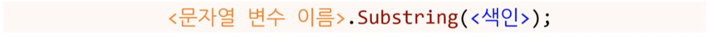
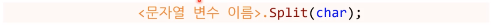
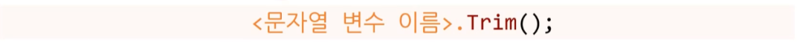
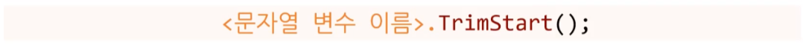

# 배열의 배열, 문자열 분할


## 1. 배열의 배열

### 1.1. 배열의 배열이란?

* **2차원 배열의 한계는 무엇인가?**  123
  * 직사각형 형태의 데이터만 지원 가능하다.
  * 각 행마다 열 수가 달라진다면 문제가 발생한다. ( ex. 학생 명부 )


* **2차원 배열과 배열의 배열 차이** 1
  * 2차원 배열
    * 배열 형태
      * 배열이 2D 형태
    * **배열의 각 원소는 배열형이 아니다.**
  * 배열의 배열
    * 배열 형태
      * 바깥 배열이 1D 형태
      * 바깥 배열의 각 원소는 1D 형태
    * **배열의 각 원소는 배열형이다.**


### 1.2. 배열의 배열 사용법

* **바깥 배열과 안쪽 배열을 설명하시오.** 
  * **바깥 배열**
    * **다른 배열을 포함하는 배열** 
    * 1D 배열 
      * 각 요소의 형 : 다시 1D 배열 ( 안쪽 배열 ) 
  * **안쪽 배열**
    * 각 요소의 형은 실제 자료형
    * 1D 배열


* **바깥 배열과 안쪽 배열은 각자 행열로 따지면 무엇인가?** 1
  * 바깥 배열 : 유사 ( 행 )
  * 안쪽 배열 : 유사 ( 열 )


* **string형 배열의 배열 길이 3의 바깥 배열을 생성하시오. **12

  ```
  
  ```

  |

  ```csharp
  string[][] classrooms = new string[3][];
  ```

  

* **바깥 배열의 index:1의 요소에 접근하시오.** 12

  ```csharp
  string[][] classrooms = new string[3][];
  
  int ?
  ? studentNames = ? 
  ```
  
  |
  
  ```csharp
  string[][] classrooms = new string[3][];
  
  int index = 1;
  string[] studentNames = classrooms[index];
  ```


* **바깥 배열을 바로 만든 후의 바깥 배열의 길이는 얼마인가?** 12

  ```csharp
  string[][] classrooms = new string[3][];
  Console.WriteLine(classrooms.Length);
  ```

  |

  ```
  																	3
  ```

  

* **바깥 배열을 바로 만든 후의 안쪽 배열의 길이는 얼마이고, 관련 코드가 무엇인지 작성하시오.** 12

  ```csharp
  string[][] classrooms = new string[3][];
  
  int classIndex = 0;
  ? studentNames = ?
  
  Console.WriteLine( ? );
  ```
  
  |
  
  null : 런타임 에러 발생
  
  ```csharp
  string[][] classrooms = new string[3][];
  
  int classIndex = 0;									//	1반 - classIndex : 0
  string[] studentNames = classrooms[classIndex];		//	1반에 접근
  
  Console.WriteLine(studentNames.Length);
  ```


* **안쪽 배열을 <u>생성</u>하는 코드와 그 <u>길이</u>를 출력하는 코드를 만드시오.** 1

  ```csharp
  const int CLASS_COUNT = 3;
  string[][] classrooms = new string[CLASS_COUNT][];
  
  int[] STUDENT_COUNT_PER_CLASS = { 3, 2, 5 };
  
  // 방법 1 - for 문 ( O ) 
  for (int i = 0; i < CLASS_COUNT; ++i)
  {
  	classrooms[i] = new string[STUDENT_COUNT_PER_CLASS[i]];
  }
  
  // 방법 2 - for 문 ( X ) 
  classrooms[0] = new string[3];
  classrooms[0] = new string[2];
  classrooms[0] = new string[5];
  
  
  // 길이 출력 - 코드
  int classIndex = 0;									//	1반 - classIndex : 0
  string[] studentNames = classrooms[classIndex];		//	1반에 접근
  
  Console.WriteLine( studentNames.Length );
  Console.WriteLine(  classrooms[classIndex].Length );
  ```

  |

  ```csharp
  const int CLASS_COUNT = 3;
  string[][] classrooms = new string[CLASS_COUNT][];
  
  int[] STUDENT_COUNT_PER_CLASS = { 3, 2, 5 };
  
  // 방법 1 - for 문 ( O ) 
  for (int i = 0; i < CLASS_COUNT; ++i)
  {
      classrooms[i] = new string[STUDENT_COUNT_PER_CLASS[i]];
  }
  
  // 방법 2 - for 문 ( X ) 
  classrooms[0] = new string[3];
  classrooms[1] = new string[2];
  classrooms[2] = new string[5];
  
  
  // 길이 출력 - 코드
  int classIndex = 0;									//	1반 - classIndex : 0
  string[] studentNames = classrooms[classIndex];		//	1반에 접근
  
  Console.WriteLine(classrooms[classIndex].Length);
  Console.WriteLine(studentNames.Length);
  ```

  

* **안쪽 배열의 원소에 접근하는 방법 2가지를 서술하시오.** 123

  ---

  **[ 방법 1 ]**

  ```csharp
  classrooms[classIndex][studentIndex] = "Tom";
  ```

  

  **[ 방법 2 ]**

  ```cs
  string[] studentNames = classrooms[classIndex];
  studentNames[studentIndex] = "Tom";
  ```

  ----

  

* **접근 방법 2가지 중 어떤 것을 더 선호하는가? 그리고 그 이유는?** 123

  * '방법 2'를 더 선호한다.
  * 생각하는 과정이 [방법 1]보다 이해하기 더 쉽다.
  * 하드웨어 적으로 볼 때 [방법 1]은 for문 사용시 돌 때마다 두 번 점프를 하는 것 보다는 [방법 2] 처럼 한 번 대입을 해 놓고, 한 번 점프 하는 게 낫기 때문이다.


### 1.3. 참조와 복사

* **배열의 배열은 어떤 접근 방식을 가지는가?** 123
  * 참조형 이다.


* **'배열의 배열'의 '안쪽 배열'을 늘리고 싶을 때 어떻게 해야 하는가?** 123
  1. 원하는 길이 만큼 New 안쪽 배열을 만든다.
  2. Old 안쪽 배열의 내용을 New 안쪽 배열에 복사 붙여 넣기를 한다.
  3. 새 배열을 Old 안쪽 배열과 연결 된 바깥 배열에 대입한다. 


* **배열을 복사하는 코드를 완성시키시오.**  1

  ```csharp
  string[][] classrooms = new string[3][];
  string[] sourceArray = classrooms[1];		// 원소 개수 10개 가정 ( classrooms[1] )
  string[] destinationArray = new string[2];	// 원소 개수 2개
  
  ?
  ```

  |
  
  ```csharp
  string[][] classrooms = new string[3][];
  string[] sourceArray = classrooms[1];		// 원소 개수 10개 가정 ( classrooms[1] )
  string[] destinationArray = new string[2];	// 원소 개수 2개
  
  Array.Copy(sourceArray, destinationArray, destinationArray,Length);
  ```
  


* **'배열의 배열' 복사하는 방법 2가지를 설명하시오.** 123
  1. for문 사용하기
  2. Array.Copy() 사용하기 - 이 쪽이 더 선호도가 높다.


* **Array.Copy() 사용이 선호도가 높은 이유는 무엇인가?**  123
  1. 읽고 쓰기 간단하다.
  2. 내부적으로 최적화 해줄 가능성이 있다.
     ( 단, 저게 없어도 만들 수 있는 실력이 있어야 한다. )


## 2. 문자열 분할

### 2.1. 데이터 관리 - 종류

* **데이터를 관리하기 위한 방법 2가지를 서술하시오.**
  * 표 
  * 키와 값 


* **Key의 용도와 특징을 3가지를 나열하시오.** 
  * 용도 : 어떤 용도의 데이터인지 알려 준다.
  * 1:1 매칭 : key를 통해서 1:1로 매칭에 된 값을 읽어온다.
  * 순서 X : 파일 안에서 순서가 바뀌어도 상관없다.


* **[옵션 1]과 [옵션 2] 중 어느 쪽이 성능이 좋고, 이유가 무엇인가?** 12

  ```
  [옵션 1] 몬스터 하나당 파일 하나
  [옵션 2] 파일 하나의 배열 같은 형태
  ```

  * [옵션 2]가 성능이 좋다.
  * **디스크를 긁을 때 마다 성능 저하에 큰 타격을 준다.**


* **[옵션 2]는 어떤 형태가 있는가?** 12

  |

  |

  * XML
  * JSON


* **표의 특징을 나열 하시오.** 1
  * 열 색인으로 어떤 용도의 데이터인지 결정된다.
  * 정형화된 다수의 데이터를 한 곳에 저장하기 용이하다.
    * 정형화가 더 될수록 컴퓨터가 데이터 처리하기 쉽다.


* **표는 실제 업계에서도 사용하는가?** 123
  * 실제 게임 업계에서도 많이 쓰이는 형태이다.
  * 기획자들이 많이 쓴다.


* **표를 저장하는 파일에는 어떤 것이 있는가? ( 2가지 )** 123
  |
  
  |
  
  * 엑셀
  * CSV


* **엑셀과 CSV의 차이점은 어떤 것이 있는가?** 123
  * 엑셀은 텍스트 파일이 아니다. ( 메모장으로 열어 볼 경우 이상하게 나온다. )
  * CSV는 텍스트 파일이다.


* **CSV의 특징은 무엇이 있는가?**  12
  * 각 값은 쉼표(comma)로 분리
    * 쉼표를 구분문자(delimiter) 라고 한다.
    * 다른 구분문자를 쓰는 것도 가능하다.
  * 규격화 - 점유율 : CSV 파일은 하나의 규격이 되어서 구글 등 여러 곳에서 많이 사용한다.


### 2.2. 토큰 ( token )

* **토큰이란 무엇인가?** 1
  * 연속된 데이터에서 쪼갤 수 있는 가장 작은 단위


* **토큰을 읽어온다는 게 어떤 것인가?** 12
  * 문자열을 조각 조각 내서 읽어오는 방법이다.
  * 다양한 함수와 연산자, 반복문 등을 사용한다.
    * string의 IndexOf(), Substring() 등의 함수 또는 첨자 연산자([])를 이용해서 구현 가능
    * 별도의 for문도 필요하다.


* **다음 코드를 완성하시오.** 12

  ```csharp
  string message = "C# is very ver fun!!";
  int index = ?							// 6반환
  ```

  |

  ```csharp
  string message = "C# is very ver fun!!";
  int index = message.IndexOf('v');		// 6반환
  ```


* **색인을 반환하는 함수는 무엇이 있는가?** 12

  ---

  * IndexOf()
  * LastIndexOf()


* **IndexOf / LastIndexOf 함수는 어떤 것인가?** 12

  * char의 위치를 찾아서 색인을 반환하는 함수

    * IndexOf()는 처음부터 끝까지 차례로 확인한다.
    * LastIndexOf()는 맨 끝부터 시작해서 확인한다.

  * 문자가 문자열을 여러 번 나타나면 가장 처음에 나타난 곳의 색인 반환

    

  * 다양한 함수 오버로딩이 있다. ( 사용법은 공식 문서를 참고하자. )


* **IndexOf / LastIndexOf 사용 중 찾는 문자열이 없다면 어떻게 하나?** 1
  * 찾는 문자가 문자열에 없다면 -1을 반환한다.
    ( 다른 함수의 경우 0, -int.MaxVlaue 등 다양한 값을 반환한다. 다양한 버전이 존재한다. )


* **message.IndexOf() 왜 이 방식을 사용하는가?** 12
  * 객체 지향 언어는 데이터 위에 함수를 올려 둔다.
  * 컴파일이 도는 순간 IndexOf() 형태가 된다.
  * 원래 절차 지향처럼 'IndexOf(...)' 형태로 사용하는 것이 더 컴퓨터에 가깝다.


* **다음 코드를 완성하시오.** 

  ```csharp
  string nameMessage = "name: PopeMon";
  string name =  ?							// "PopeMon" 반환
  ```

  |

  ```csharp
  string nameMessage = "name: PopeMon";
  string name = nameMessage.Substring(6);		// "PopeMon" 반환
  ```


* **Substring() 함수는 어떤 것인가?**

  * 지정된 문자 위치(**<색인>**)부터 문자열을 반환하는 함수 

  * [주의!] 문자 char 는 넣을 수 없다. - 런타임 에러 발생

    

  * 다양한 함수 오버로딩이 있다. ( 사용법은 공식 문서를 참고하자. )

    * 콤마(,) 별로 분리하려면 다른 버전의 Substring() 함수를 사용해야 한다.


* **첨자 연산자([]) 는 무엇인가?** 123
  * **<색인>** 위치에 있는 **문자 하나**를 반환
  * 배열을 사용하는 것과 유사하다.


* **다음 코드를 완성하시오. 1**

  ```csharp
  string text = "PopeMon,1,10000";
  string[] tokens = text.Split(',')							// {"PopeMon", "1", "10000"}
  ```

  |

  ```csharp
  string text = "PopeMon,1,10000";
  string[] tokens = text.Split(',');		// {"PopeMon", "1", "10000"}
  ```


* **다음 코드를 완성하시오.**

  ```csharp
  string text = "PopeMon,1:10000";
  
  ? delimiters = ?
  ? tokens = ?;		// {"PopeMon", "1", "10000"}
  ```

  |

  ```csharp
  string text = "PopeMon,1:10000";
  
  char[] delimiters = { ',', ':'};
  string[] tokens = text.Split(delimiters);		// {"PopeMon", "1", "10000"}
  ```


* **다음 코드를 완성하시오.**

  ```csharp
  string text = "PopeMon,1:10000:,10, 1000:LopeMon,100,100";
  
  char[] delimiters = { ',', ':'};
  string[] tokens = ?		
  // {"PopeMon", "1", "10000", "10", "1000", "LopeMon", "100", "100"}
  ```

  |

  ```csharp
  string text = "PopeMon,1:10000:,10, 1000:LopeMon,100,100";
  
  char[] delimiters = { ',', ':'};
  string[] tokens = text.Split(delimiters, StringSplitOptions.RemoveEmptyEntries);		
  // {"PopeMon", "1", "10000", "10", "1000", "LopeMon", "100", "100"}
  ```

  

* **다음 코드를 완성하시오.**

  ```csharp
  string firstName = "		Leon";
  string lastName = "Kim			";
  
  string trimmedFirstName1 = ?		// "		Leon"
  string trimmedLastName1 = ?			// "Kim";
  
  string trimmedFirstName2 = ?		// "Leon"
  string trimmedLastName2 = ?			// "Kim"
  
  string trimmedFirstName3 = ?		// "Leon"
  string trimmedLastName3 = ?			// "Kim			";
  ```

  |

  ```csharp
  string firstName = "		Leon";
  string lastName = "Kim			";
  
  string trimmedFirstName1 = firstName.TrimEnd();		// "		Leon"
  string trimmedLastName1 = lastName.TrimEnd();		// "Kim";
  
  string trimmedFirstName2 = firstName.Trim();		// "Leon"
  string trimmedLastName2 = lastName.Trim();			// "Kim"
  
  string trimmedFirstName3 = firstName.TrimStart();	// "Leon"
  string trimmedLastName3 = lastName.TrimStart();		// "Kim			";
  ```


* **다음 코드의 답을 맞추시오.**

  ```csharp
  string s = "ABC";
  Console.WriteLine(String.IsNullOrWhiteSpace(s));
  ```

  |

  ```
  False
  ```

  


* **다음 코드의 답을 맞추시오.**

  ```csharp
  string s = "ABC";
  Console.WriteLine(String.IsNullOrEmpty(s));
  ```

  |

  ```
  False
  ```


* **문자열에서 Split() 은 어떤 함수로 불리는가?** 1
  * 정형화 된 데이터를 쉽게 읽어오는 함수이다. 
  * '문자열 토크나이저'라 불린다. ( string tokenizer )
    * 토큰화 기계로 불리며 토큰으로 만들어 준다.


* **Split() 함수의 사용법은 무엇인가?**

  

  * 하나의 구분 문자로 문자열을 토큰화 할 경우
  * char 는 문자열을 쪼갤 때 사용할 구분 문자

  ---

  

  * 여러 개의 구분 문자로 문자열을 토큰화 할 경우
  * 문자형 배열( char[] )에 여러 개의 구분 문자를 대입한다.

  ---

  * 
  * 다양한 함수 오버로딩이 있다. ( 사용법은 공식 문서를 참고하자. )


* **Split()을 사용하면 문자열은 어떻게 되는가?**
  * 원본 문자열 : 변경 없이 그대로 유지
  * 쪼갠 문자열 : 문자열 배열로 반환


* **Split() 사용 중 문자열 중간에 공백으로 비워져 있을 경우?**
  * 공백 옵션을 사용해 준다.
    * StringSplitOptions.RemoveEmptyEntries
  * 옵션 없이 문자열을 쪼개면 빈 문자열이 나온다.


* **문자열의 공백을 지우는 함수는 무엇이 있는가?** 12
  
  |
  
  * Trim()
  * TrimStart()
  * TrimEnd()


* **위의 Trim 코드 3가지는 어떤 기능을 가지고 있는가?** 1

  * Trim()

    

    * **문자열 앞뒤**로 있는 공백을 없앤 후 문자열을 반환
    * <u>원본 문자열은 변경 없이 그대로 유지</u> 

  * TrimStart()

    

    * **문자열 앞**에서 공백을 모두 제거 후 문자열을 반환
    * 원본 문자열은 변경 없이 그대로 유지 

  *  TrimEnd() 

    

    * **문자열 뒤**에서 공백을 모두 제거 후 문자열을 반환
    * 원본 문자열은 변경 없이 그대로 유지 


