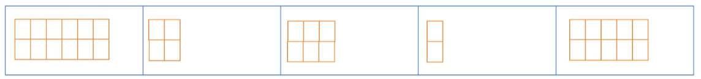
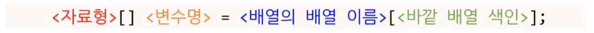
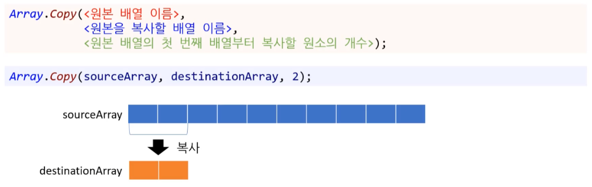
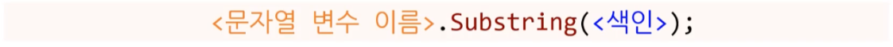
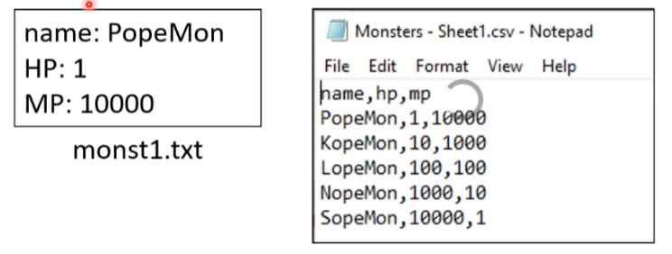
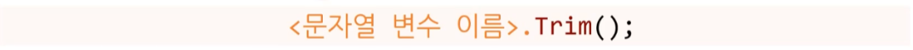

# 16 배열의 배열, 문자열 분할


## 1. 배열의 배열

* **jagged array**
* '가변 배열'이라고 불리기도 한다.


### 1.1. 배열의 배열이란?

#### 1) 2차원 배열의 한계

* 직사각형 형태의 데이터만 지원 가능
  * 각 행마다 열 수가 달라진다면 문제가 발생한다. ( ex. 학생 명부 )
  * 1D 배열에 없는 문제 
* 2차원 배열로는 해결할 수 없는 문제가 있다.
* 2차원 배열이 아닌 배열의 배열을 써야 하는 경우이다.


---


#### 2) 2차원 배열 vs 배열의 배열

* **2차원 배열**
  * 빈 공간은 비어 있을 수 있다. 
* **배열의 배열**
  * 메모리를 최적화 된 상태에서 사용할 수 있다.


[참고] '배열의 배열'은 '2차원 배열'을 원소로 가질 수 있습니다. ( 중요 X )

* 개발자가 직관적으로 인식하기에는 m x n 개의 고정된 2차원 배열이 기억하기 편하고 유지보수 하기도 쉽기 때문이다.
  ( 그래서 가변 배열을 다차우너 배열 처럼 사용하는 경우가 좀 더 일반적이다.)

  * 일상 생활에서는 사실 쓸 일은 없다.

  * 오히려 이거보다 3차원 배열을 더 쓸 가능성이 높다.


```csharp
int[][,] ohMyGod;
```




### 1.2. 배열의 배열 사용법

* **바깥 배열**
  * **다른 배열을 포함하는 배열** 
  * 1D 배열 
  * 각 요소의 형은 다시 1D 배열 ( 안쪽 배열 )
* **안쪽 배열**
  * 1D 배열
  * 각 요소의 형은 실제 자료형


#### 1) 바깥 배열

##### (1) 바깥 배열 만들기

* 안쪽 배열 : 마지막 안쪽 배열에 들어가는 최종 원소
* 바깥 배열 : 바깥 배열의 각 원소는 문자열 배열(string[])을 받을 거에요.


```cs
string[][] classrooms = new string[3][];
```

* `string[][]` : 배열의 배열을 만든다.
* `classrooms` : 문자열 배열을 원소로 가지는 배열의 이름은 `classrooms`에요.
* `new string[3][]` - **new** string**[3]**\[] : classrooms은 3개 짜리 1D 배열이에요. 
  * 바깥 배열 ( 유사 - 행 )
* `new string[3][]` - new **string**[3]**\[]** : 각 원소는 문자열 배열(string [])을 가질 거에요.
  * 안쪽 배열  ( 유사 - 열 )


**[ 바깥 배열 ( 행 ) ]**


**[ 안쪽 배열 ( 열 ) ]**


##### (2) 바깥 배열의 원소에 접근하기



```csharp
string[][] classrooms = new string[3][];
int classIndex = 0;									//	1반 - classIndex : 0
string[] studentNames = classrooms[classIndex];		//	1반에 접근
```

* studentNames에 문자열 배열의 배열인 classrooms의 classIndex 번째의 원소를 대입한다.


**[의문] studentNames에는 어떤 값이 담겨있을까?**


##### (3) 학생 정보를 담은 배열의 길이 출력 

* 바깥 배열만 만든 이후의 길이 출력이다.
* 정답 : null - 아무것도 없다 
  * 타언어에서는 null 대신 nil, nada라고 쓰이기도 한다.

```csharp
string[][] classrooms = new string[3][];

int classIndex = 0;									//	1반 - classIndex : 0
string[] studentNames = classrooms[classIndex];		//	1반에 접근

Console.WriteLine(studentNames.Length);
```


---


```csharp
string[][] classrooms = new string[CLASS_COUNT][];
```

* classrooms은 CLASS_COUNT 수 만큼의 문자열 배열을 담을 공간을 만드는 게 전부이다.


---


#### 2) 안쪽 배열 

##### (1) 안쪽 배열 만들기

```csharp
const int CLASS_COUNT = 3;
string[][] classrooms = new string[CLASS_COUNT][];

int[] STUDENT_COUNT_PER_CLASS = { 3, 2, 5 };

for (int i = 0; i < CLASS_COUNT; ++i)
{
    classrooms[i] = new string[STUDENT_COUNT_PER_CLASS[i]];
}

// 위와 동일한 코드
classrooms[0] = new string[3];
classrooms[1] = new string[2];
classrooms[2] = new string[5];
```


* **`for (int i = 0; i < CLASS_COUNT; ++i)`**


* **`classrooms[i] = new string[STUDENT_COUNT_PER_CLASS[i]];`**


##### (2) 학생 정보를 담은 배열의 길이 출력 

* 안쪽 배열까지 만든 이후의 길이 출력이다.

* `classrooms[i] = new string[STUDENT_COUNT_PER_CLASS[i]];`안쪽 배열을 만들었다.
  * `studentNames.Length` 더 이상 null이 아니게 된다.

```csharp
const int CLASS_COUNT = 3;
string[][] classrooms = new string[CLASS_COUNT][];
int[] STUDENT_COUNT_PER_CLASS = { 3, 2, 5 };

for (int i = 0; i < CLASS_COUNT; ++i)
{
    classrooms[i] = new string[STUDENT_COUNT_PER_CLASS[i]];
}

int classIndex = 0;									//	1반 - classIndex : 0
string[] studentNames = classrooms[classIndex];		//	1반에 접근

Console.WriteLine(studentNames.Length);
```

```
3
```


##### (3) 안쪽 배열의 원소에 접근하기

```csharp
// 바깥 배열과 안쪽 배열을 만드는 코드 생략. string classrooms[3][]
int classIndex = 0;     // 1반
int studentIndex = 0;   // 첫 번째 학생

// 방법 1
classrooms[classIndex][studentIndex] = "Severus";

// 방법 2
string[] studentNames = classrooms[classIndex];
studentNames[studentIndex] = "Severus";
```


**[방법 2]가 더 좋은 이유**

* 하드웨어 적으로 볼 때 [방법 1]은 for문 사용시 돌 때마다 두 번 점프를 하는 것 보다는 [방법 2] 처럼 한 번 대입을 해 놓고, 한 번 점프 하는 게 낫기 때문이다.
* 생각하는 과정이 [방법 1]보다 이해하기 더 쉽다.


**종합 코드**

```cs
const int CLASS_COUNT = 3;
string[][] classrooms = new string[CLASS_COUNT][];
int[] STUDENT_COUNT_PER_CLASS = { 3, 2, 5 };

for (int i = 0; i < CLASS_COUNT; ++i)
{
    classrooms[i] = new string[STUDENT_COUNT_PER_CLASS[i]];
}

int classIndex = 0;									//	1반 - classIndex : 0
string[] studentNames = classrooms[classIndex];		//	1반에 접근
studentNames[studentIndex] = "Severus";
```


### 1.3. 참조와 복사

#### 1) 배열의 배열은 참조형

```csharp
string[] studentNames = classrooms[classIndex];
studentNames[studentIndex] = "Severus";
```

* 참조형이기 때문에 이런 식의 접근이 가능하다. 
  * studentNames에 "Serverus" 값을 넣는 것 만으로 classrooms의 값이 바뀐다.
  * 쉽게 말해 원본이 바뀐다. 

---

* new로 만든 것은 값이 아닌 참조에 의한 전달로 생각하는 것이 좋다.
* new로 만든 것은 기본적으로 그 자체가 참조형 데이터다.
* 기본 자료형은 거의 모두 값의 의한 전달을 생각하면 좋다.


#### 2) 배열의 배열 안쪽 배열을 늘리기

```csharp
string[][] classrooms = new string[CLASS_COUNT][];

classrooms[0] = new string[3];
classrooms[1] = new string[2];
classrooms[2] = new string[5];
```

* 안쪽 배열은 여전히 1D 배열이다.

  즉, 고정되어 있어 2에서 3으로 늘릴 수없다.

* **유일한 방법 - 1가지**

  1. 크기가 3짜리 배열을 새로 만든다.
  2. for문을 이용해 기존의 배열 데이터를 새 배열로 복사한다.
  3. 새 배열을 바깥 배열에 대입한다.

  * 거의 유일한 방법이다.


#### 3) 배열의 배열 복사하기

##### (1) for문으로 배열 복사하기

```csharp
string[][] classrooms = new string[CLASS_COUNT][];

// 학생들 이름을 넣는 코드는 생략
string[] classroom2 = classrooms[1];

string[] newClassroom2 = new string[classroom2.Length + 1];
for (int i = 0; i < classroom2.Length; ++i) 
{
    newClassroom2[i] = classroom2[i];
}

newClassroom2[newClassroom2.Length - 1] = "Leanne";

classrooms[1] = newClassroom2;
```


##### (2) Array.Copy() 함수로 배열 복사하기

```csharp
string[][] classrooms = new string[CLASS_COUNT][];

// 학생들 이름을 넣는 코드는 생략
string[] classroom2 = classrooms[1];

string[] newClassroom2 = new string[classroom2.Length + 1];
Array.Copy(classroom2, newClassroom2, classroom2.Lentgh);

newClassroom2[newClassroom2.Length - 1] = "Leanne";

classrooms[1] = newClassroom2;
```

실무에서 사용하는 이유

1. 읽기 간단하다.
2. 내부적으로 최적화 해줄 가능성이 있다.
   ( 단, 저게 없어도 만들 수 있는 실력이 있어야 한다. )


**[ Array.Copy() ]**

```csharp
string[][] classrooms = new string[3][];

string[] sourceArray = classrooms[1];		// 원소 개수 10개 가정 ( classrooms[1] )
string[] destinationArray = new string[2];	// 원소 개수 2개
Array.Copy(sourceArray, destinationArray, destinationArray,Length);
```




## 2. 문자열 분할

string 객체를 활용하여 문자열을 짤라서 분리한다.


### 2.1. 데이터 관리 - 종류

* JSON, CSV 등 다양한 방식의 데이터 사용법이 있다.


**[ 게임 몬스터 데이터 읽어보기 ]**

* 게임을 만든다고 가정하자.
* 몬스터의 데이터의 이름, HP, MP를 텍스트 파일에서 읽어올 때
  * 어떤 정형화된 형식에서 프로그램에서 읽을 수 있을까?
  * 어떤 정형화된 형식으로 저장해야 할까?


#### 1) 키와 값 - key / value

* key : 어떤 용도의 데이터인지 알려준다.
  * 파일 안에서 순서가 바뀌어도 상관없다.
  * key를 통해서 1:1로 매칭에 된 값을 읽어온다.


---


**다수의 몬스터 데이터를 저장해야 한다면?**

* [옵션 1] 몬스터 하나당 파일 하나

  * 100마리의 몬스터라면 파일도 100개
  * 파일이 너무 많아진다.
  * **디스크를 긁을 때 마다 성능 저하에 큰 타격을 준다.**

* [옵션 2] 파일 하나에 배열 같은 형태

  * 100마리의 몬스터라면 파일은 **1개**면 충분하다.
  * XML 또는 JSON 파일이 이런 걸 지원한다.
  * JSON 파일 형태

  


#### 2) 표

* 표는 정형화된 다수의 데이터를 한 곳에 저장하기 용이하다.
* 열 색인으로 셋 중(name, hp, mp) 어떤 용도의 데이터인지 결정된다.
* 정형화가 더 될수록 컴퓨터가 데이터 처리하기 쉽다.
* 실제 게임업계에서도 많이 쓰이는 형태이다.
  * 기획자들이 많이 쓴다.


##### (1) 엑셀 파일

* 엑셀 파일을 이용하는 경우가 많다.
* 엑셀 파일은 텍스트 파일이 아니다!
  * (NotePad, NotePad++)로 열어보면 이상한 형태로 나오는 것을 볼 수 있다.


---


##### (2) CSV 

* 대신, CSV(comma-separated vlues) 파일로 저장 가능하다. 
  * 텍스트파일!
  * 각 값은 쉼표(comma)로 분리
    * 쉼표를 구분문자(delimiter) 라고 한다.
    * 다른 구분문자를 쓰는 것도 가능하다.
* CSV 파일은 하나의 규격이 되어서 구글 등 여러 곳에서 많이 사용한다.


**의사 코드**


### 2.2. 토큰 ( token )


#### 1) 토큰이란?

* 토큰 : 연속된 데이터에서 쪼갤 수 있는 가장 작은 단위
  * 토큰을 읽어 오는 법 : 문자열을 조각 조각 내서 읽어오는 방법이다.


* string의 IndexOf(), Substring() 등의 함수 또는 첨자 연산자([])를 이용해서 구현 가능
  * 별도의 for문도 필요하다.


#### 2) 함수 및 첨자 연산자

##### (1) IndexOf()

```cs
string message = "C# is very ver fun!!";
int index = message.IndexOf('v');		// 6반환
```


* IndexOf()는 처음부터 끝까지 차례로 확인하며, LastIndexOf()는 맨 끝부터 시작해서 확인한다.
* char의 위치를 찾아서 색인을 반환하는 함수
  * 문자가 문자열을 여러 번 나타나면 가장 처음에 나타난 곳의 색인 반환
  * 찾는 문자가 문자열에 없다면 -1을 반환한다.
    ( 다른 함수의 경우 0, -int.MaxVlaue 등 다양한 값을 반환한다. 다양한 버전이 존재한다. )
* 매개변수가 다양하게 들어올 수 있고, 이것을 함수 오버로딩이라고 한다. ( 사용법은 공식 문서를 참고하자. )


---

* message.IndexOf()
  * 객체 지향 언어 : C#이 객체 지향 언어이기 때문에 이런 방식으로 사용한다.
    * 객체 지향은 데이터 위에 함수를 올려 둔 것이다.
    * 컴파일러가 도는 순간 message.IndexOf()는 IndexOf() 형태가 된다.
  * 절차 지향 언어 : 절차 지향의 경우 'IndexOf(...)' 형태로 함수만 따로 사용한다.
    * 이 방식이 더 컴퓨터에 가깝다.
    * 컴퓨터는 함수와 데이터를 분리 시켜 본다.


##### (2) Substring()

```csharp
string nameMessage = "name: PopeMon";
string name = nameMessage.Substring(6);		// "PopeMon" 반환
```



* 지정된 문자 위치(**<색인>**)부터 문자열을 반환하는 함수 

* 마찬가지로 다양한 버전의 Substring() 함수가 존재한다.

  * 콤마(,) 별로 분리하려면 다른 버전의 Substring() 함수를 사용해야 한다.

  


##### (3) 첨자 연산자([])

**<색인>** 위치에 있는 **문자 하나**를 반환

```csharp
string HPMessage = "HP: 100";
char ch = HPMessage[4];		// '1'
```


#### 3)  Split() - 문자열 토크나이저

* 정형화 된 데이터를 쉽게 읽어오는 함수다.
* 문자열 토크나이저 : string tokenizer
  * 토큰으로 만들어 준다.
  * 토큰화 기계




##### **(1) Split 사용 - 쉼표 구분 문자**

```csharp
string text = "PopeMon,1, 10000";
string[] tokens = text.Split(',');		// {"PopeMon", "1", "10000"}
```


* 하나의 구분 문자로 문자열을 토큰화 할 경우
* char 는 문자열을 쪼갤 때 사용할 구분 문자

---

* 원본 문자열 : 변경 없이 그대로 유지
* 쪼갠 문자열 : 문자열 배열로 반환
* 여러 버전의 Split() 함수가 존재한다.


##### (2) Split 사용 - 다수의 구분 문자

* 여러 개의 구분 문자로 문자열을 토큰화 할 경우
* 문자형 배열( char[] )에 여러 개의 구분 문자를 대입한다.


```csharp
string text = "PopeMon,1:10000";

char[] delimiters = { ',', ':'};
string[] tokens = text.Split(delimiters);		// {"PopeMon", "1", "10000"}
```


##### (3) Split 사용 - 공백 옵션 사용

* 구분 문자 사이가 비어있다면?
  * 옵션 없이 문자열을 쪼개면 빈 문자열이 나온다.
  * [참고] String.IsNullOrEmpty  : 지정된 문자열이 `null`이거나 빈 문자열("")인지를 나타냅니다.

```csharp
string text = "PopeMon,1:10000:,10, 1000:LopeMon,100,100";

char[] delimiters = { ',', ':'};
string[] tokens = text.Split(delimiters);		
// {"PopeMon", "1", "10000", "", "10", "1000", "LopeMon", "100", "100"}
```


---

**[해결법]** StringSplitOptions.RemoveEmptyEntries 를 사용

```csharp
string text = "PopeMon,1:10000:,10, 1000:LopeMon,100,100";

char[] delimiters = { ',', ':'};
string[] tokens = text.Split(delimiters, StringSplitOptions.RemoveEmptyEntries);		
// {"PopeMon", "1", "10000", "10", "1000", "LopeMon", "100", "100"}
```


#### 4) Trim 공백 지우기

##### (1) Trim() - 문자열 앞뒤

* **문자열 앞뒤**로 있는 공백을 없앤 후 문자열을 반환
* 원본 문자열은 변경 없이 그대로 유지 

```csharp
string firstName = "		Leon";
string lastName = "Kim			";
string trimmedFirstName = firstName.Trim();	// "Leon"
string trimmedLastName = lastName.Trim();	// "Kim"
```




##### (2) TrimStart() - 문자열 앞

* **문자열 앞**에서 공백을 모두 제거 후 문자열을 반환
* 원본 문자열은 변경 없이 그대로 유지 

```csharp
string firstName = "		Leon";
string lastName = "Kim			";

string trimmedFirstName = firstName.TrimStart();	// "Leon"
string trimmedLastName = lastName.TrimStart();	// "Kim			";
```


##### (3) TrimEnd() - 문자열 뒤

* **문자열 뒤**에서 공백을 모두 제거 후 문자열을 반환
* 원본 문자열은 변경 없이 그대로 유지 

```csharp
string firstName = "		Leon";
string lastName = "Kim			";

string trimmedFirstName = firstName.TrimEnd();	// "		Leon"
string trimmedLastName = lastName.TrimEnd();	// "Kim";
```


### 2.3. string 클래스

#### 1) 메서드 

##### (1) IsNullOrEmpty()

* String.IsNullOrEmpty(String) 메서드

지정된 문자열이 `null`이거나 빈 문자열("")인지를 나타냅니다.
( 있다면 True, 없다면 False )

```csharp
/* 정의 */
public static bool IsNullOrEmpty (string? value);
```

```csharp
/* 사용 */
string s = "ABC";
String.IsNullOrEmpty(s)
```


##### (2) IsNullOrWhiteSpace()

* String.IsNullOrWhiteSpace(String) 메서드

지정된 문자열이 `null`이거나 비어 있거나 공백 문자로만 구성되어 있는지를 나타냅니다.
화이트 스페이스(공백 문자)가 포함되었다.
( 있다면 True, 없다면 False )

```cs
/* 정의 */
public static bool IsNullOrWhiteSpace (string? value);
```

```csharp
/* 사용 */
string s = "ABC";
Console.WriteLine(String.IsNullOrWhiteSpace(s));
```


​	

