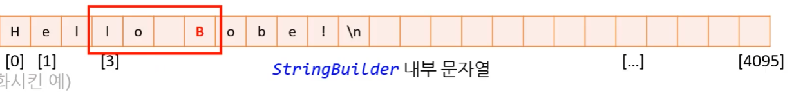

# 19 문자열 빌더와 컬렉션

문자열 사용으로 인해 생기는 성능상의 문제를 해결하기 위해 나온 기능이다.


## 1. 문자열과 가비지 수집기

### 1.1. 문자열 코드의 한계

#### **1) 중첩된 문자열 `+연산자`의 한계**

* 임시로 만들고 버려지는 임시 문자열이 많아진다.


#### 2) String.Join()의 한계

* String.Join() : 각 멤버 사이에 지정된 구분 기호를 사용하여 문자열의 배열을 연결합니다.

```csharp
public static string Join (char separator, params string?[] value);
```

---

```csharp
for (int i = 1; i <= 100; ++i)
{	
	++result;
	message = message + result + " ";
}
```

* String.Join() 함수도 `+ 연산자`와 for문을  활용한 방식으로 작동한다.
* 문장 하나로 해결할 수 있는 코드들이 있지만 내부적으로 어떻게 작동하는 지 알아야 한다.


### 1.2. 가비지 수집기 ( grabage collector, GC )

* 새로 만들어 진 문자열(임시)들은 언제가 지워져야 한다.
* C# 가비지 수집기 시스템이 자동으로 처리
  * but, 쓰레기 문자열이 넘쳐나면 GC의 성능 저하가 올 수 있다.


[ 고민 ]

* 그래서 <u>임시 문자열의 수를 줄여야 한다.</u>
  * but, 문자열 합치기는 매우 자주 하는 연산이다.
  * 문자열의 수를 줄이면 좋지만 현실적으로 연산을 자주 할 수 밖에 없기 때문에 이를 최적화 시킨 라이브러리가 등장한다.
  * 그것이 **StringBuilder 라이브러리**다.


## 2. StringBuilder 클래스

* 문자열을 효율 적으로 만들어 주는 클래스다. 
* [ 동작 방법 ]
  * 긴 문자열을 담을 수 있는 충분한 공간을 미리 확보한다. 
  * 추가 된 문자열들로 그 공간을 차례대로 채워 나간다.
  * 모든 것이 준비되면 최종적으로 문자열을 만들어서 반환한다.


**사용 예제**


### 2.1. 생성하기

```csharp
// 파일 제일 위에서 라이브러리 추가
using System.Text;

// 함수 안에서
StringBuilder builder = new StringBuilder(4096);
```


* 총 용량이 maxCharCount 인 StringBuilder 생성
  * 커다란 char[]를 **<u>미리 확보</u>**해 놓는다고 생각하는 게 좋다.


### 2.2. 추가하기 - Append() / AppenLine()

```csharp
StringBuilder builder = new StringBuilder(4096);
builder.AppendLine("Hello Pope!");
builder.Append("Give me");
```

* **`AppendLine(string text)`** : 문자열과 줄바꿈 ( \n ) 추가

* **`Append(string text)`** : 문자열 추가
  * StringBuilder의 내부 문자열에 문자열을 추가	

  * 이 외에도 여러가지 오버로드 함수들이 있다. ( 직접 찾아보자. )


**[ 참고 ]** **문자열 아닌 것도 합쳐진다.**

* 기존의 문자열 합치기 ( `+ 연산자` ) 처럼 StringBuilder 역시 다양한 자료형을 문자열에 합칠 수 있다.
  * 다양한 오버로드, 다양한 데이터 형을 지원한다.

```csharp
StringBuilder builder = new StringBuilder(4096);
builder.AppendLine("Score: " + 10);
builder.Append(3.14f);
```


### 2.3. 총용량과 현재 길이 - Capacity / Length

```csharp
Console.WriteLine($"Capacity: {builder.Capacity}, Lenth: {builder.Length}");
```

* **`builder.Capacity`** : 내부 배열의 총용량
* **`builder.Length`** : 내부 배열의 현재 사용 중인 길이 ( 어떤 언어에서는 length 대신에 size를 사용하기도 한다. )
  * builder는 StringBuilder
  * 함수는 아니다.


### 2.4. 추가 공간 확보 - EnsureCapacity()

```csharp
StringBuilder builder = new StringBuilder(25);
builder.AppendLine("Hello Pope!");
builder.Append("Give me");

builder.EnsureCapacity(1024);
```

* **`EnsureCapacity(int newCapacity)`** : StringBuilder의 내부 배열의 총용량을 늘리는 함수
  * 입력한 값 > 총용량 : 입력한 인자 값보다 현재 총용량보다 크면 <u>늘려준다.</u>
  * 입력한 값 < 총용량 : 인자 값이 현재 총용량보다 작은 값이 입력되면 <u>아무런 변화가 없다.</u> 


### 2.5. 최종 문자열 얻어오기 ( 반환하기 ) - ToString()

```csharp
StringBuilder builder = new StringBuilder(4096);
// 문자열 추가하는 코드 생략

string greetings = builder.ToString();
```

* **`ToString()`** : 완성한 문자열을 반환
  * 현재 내부 배열이 사용 중인 길이 만큼만 반환
  * 오버로드 한 함수가 있다. ( 직접 찾아보자. )


## 3. StringBuilder 기타 함수

### 3.1. Insert()

```csharp
StringBuilder builder = new StringBuilder(4096);
builder.AppendLine("Hello Pope!");
builder.Insert(6, "and bye ");
```

* **`Insert(int index, string text)`** 
  * `StirngBuilder`의 내부 배열 중간(int index)에 새로운 문자열(string text)를 삽입 ( 덮어쓰기가 아니다. 옆으로 밀어낸다.  )
  * 여러가지 오버로드 함수들이 있다. ( 직접 찾아볼 것 )


### 3.2. Replace()

```cs
StringBuilder builder = new StringBuilder(4096);
builder.AppendLine("Hello Pope!");
builder.Replace('p', 'b');
builder.Replace('P', 'B', 3, 3);
```

* **`Replace(char old, char new);`** : 모든 old를 new로 바꾼다.
* **`Replace(char old, char new, int start, int count)`** : start 번째부터 start + count 번째 사이에 있는 모든 old를 new로 바꾼다.
  * 여러가지 오버로드 함수들이 있다. ( 직접 찾아볼 것 )


---





### 3.3. Remove()

```cs
StringBuilder builder = new StringBuilder(4096);
builder.AppendLine("Hello Pope!");
builder.Remove(8, 2);
```

* **`Remove(int start, int length)`** : start번 째부터 length개 만큼의 문자를 지운다.


### 3.4. Clear()

```cs
StringBuilder builder = new StringBuilder(4096);
builder.AppenLine("Hello Pope!");
builder.Clear();
```

* **`Clear()`** : 임시 문자열을 제거하는 함수

  * 재활용 해서 사용할 수 있다.

  * 이 함수를 호출 후, 길이를 확인하면 0이 나온다.

    ```cs
    builder.Clear();
    Console.WriteLine(builder.Length);	// 0이 출력
    ```

    


## 4. StringBuilder vs 문자열 합치기

### 4.1. StringBuilder 임시 문자열과 길이

#### 1) 임시 문자열 비교하기

* `+ 연산자`를 이용한 문자열 합치기 - 2개

  ```csharp
  Console.WriteLine("Hello Pope!\n" + "Give me " + "2" + " dollars!");
  ```

* `StringBuilder`를 이용한 문자열 합치기 - **1개**

  ```csharp
  StringBuilder builder = new StringBuilder(4096);
  builder.AppendLine("Hello Pope!");
  builder.Append("Give me ");
  builder.Append(2);
  builder.AppendLine(" dollars!");
  string greetings = builder.ToString();
  Console.WriteLine(greetings);
  ```

  ```csharp
  Hello Pope!\nGive me 2 dollars! - 임시 문자열 총용량 : 4096
  ```

  * **자잘한 것 여러 개 가져오는 것 보다 한 번에 크게 ( 임시 문자열 총용량 : 4096 )을 잡아오는 것이 좋다.**
    - 대부분 일반적인 경우에 그렇다. 
      ( 메모리 부족한 하드웨어 제외 )


#### 2) 임시 문자열 공간을 다 쓴다면? 

* 처음 확보해 둔 공간을 다 쓴다면?

* 기능 상에 아무런 문제 없다.

---

* StringBuilder가 자동적으로 내부 공간을 늘린 뒤 모든 데이터를 복사한다.

```
StringBuilder builder = new StringBuilder(10);
builder.Append("Hello ");
builder.AppendLine("Pope!");
```


**[ 세부적인 동작 과정 ]**

* 내부 공간 길이가 부족하다고 판단 될 때, 클래스 자체적으로 기존 배열 길이의 두 배 크기로 배열을 생성한다.
* 이후 기존 배열에 있던 string을 새로운 배열에 복사 붙여넣기 한 후 다음 작업을 진행한다.
* 복사 이후 기존에 넣으려고 한 문자열을 추가한다.
* builder는 새로운 배열로 넘어온다.

---

* TIP : 복사를 안 할 수록 좋으므로 처음부터 충분한 공간을 확보하는 것이 좋다.
  * 보통 2의 승수로 잡아 쓴다. ( 256 -> 512 -> 1024 -> 2048 -> 4096 )


### 4.2. StringBuilder vs 문자열 합치기 - 결론

* 합칠 문자열이 몇 개 없다면 StringBuilder를 쓸 이유가 크게 없다.

  * 쓰는 게 번거롭기도 하다.

* 다수의 문자열을 합치면 그때부터 StringBuilder를 고려한다.

  * 수십 개 정도

  


