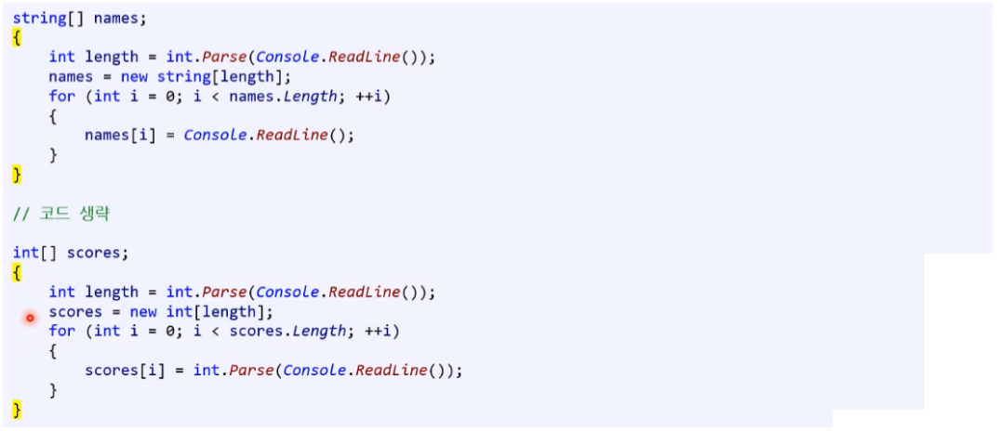
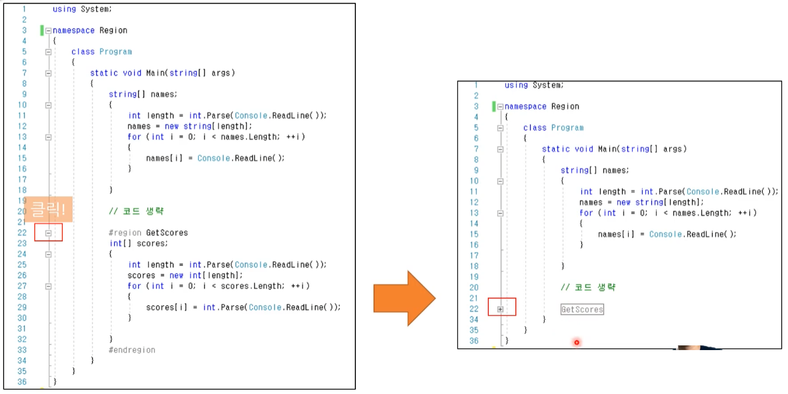

# 08 함수 ( 기본 )

## 1. 함수 생성 시점

* **함수의 사용를 핵심 목적은 무엇이고, 이유 2가지는 무엇인가?**
  * 목적 : 중복되는 코드를 재사용 및 재활용 할 수 있어서
  * 이유1 : 재사용으로 수정 및 관리가 용이해진다.
  * 이유2 : '블랙박스'로 사용이 쉬워진다.
    * 함수 바디 안에 내용을 몰라도 쉽게 사용할 수 있다.
    * 믿어야 한다. ( 함수의 내부가 모르더라도 그렇게 돌아갈 것이라는 것을 신뢰하고 사용해야 한다. )


* **수학의 함수와 프로그래밍의 함수의 차이점은?**
  * 수학 : **<u>오직 하나</u>** 씩만 대응한다.
  * 프로그래밍 : 하나씩 대응하지 않는다.
    * 반환형 : 0~1개의 반환형을 가진다.( void 포함 )
    * 매개변수 : 0개 이상의 매개변수를 가진다.
    * 특정 입력값 대응 : ( random 제외 )한 동일한 입력 값이 들어갔을 때 출력은 거의 똑같은 값이 정해져서 나온다. 


* **함수는 어떤 시점에 작성해야 하는가?**
  * 코드 중복으로 재사용이 필요할 때 만들 것 : 2번 이상 기준
  * but, 유지 보수 책임의 이유로 최대한 쪼개지 않는 게 좋다.
    * 함수를 만드는 것 자체가 책임 질 일을 만드는 것이다. 


* **모든 것을 쪼개서 함수로 만드는 것은 좋은가?**

  * 논쟁 지점이다.

  * [문제점] 유지 보수에 어려움을 겪는다. 

    치명적인 단점 중 하나다.

    새롭게 함수를 재편하면 그 함수를 쓰던 코드나 개발자 모두에게 영향을 끼친다. 함부로 함수를 만들어서는 안된다.


* **함수는 너무 길어서는 안 되는가?** 
  **코드가 20줄이 넘을 시 함수로 쪼개야 하나?**
  * 논쟁 지점이다.
  * 예전에는 맞는 말이었지만 현재는 의견이 분분하다. 참고로 그 당시에는 모니터 화면이 작았었다. 어떤 연구 기관의 조사에 따르면 코드가 200줄 이상일 시 가독성에 문제가 된다는 연구 결과도 있다. 
  * Clean Code 책에서 나오는 내용을 바탕으로 하는 것인데 그 당시에는 모니터 화면이 작았기 때문에 맞는 내용이었지만 현대는 적절한 조언이 아니다.


* **함수 이름 네이밍 규칙(업계 표준)은?**

  어떤 기능을 하는지 유추할 수 있는 단어를 사용한다.

  1. 동사로 시작할 것 => 함수는 보통 행동(action)에 대한 것이다.
  2. 파스칼 표기법 : 제일 첫 글자는 대문자 
     * (ex) Add, Square

  * 여러 단어를 연결하면 두 번째 단어부터는 첫 글자를 대문자로 사용한다.
    * 이 방식도 조금 복잡하기 때문에 남용해서는 안된다. ( 되도록이면 두 단어까지 사용하지 않는게 좋다. )
    * (ex) AddTwoNumbers, PrintFullName

  

* **함수 매개변수와 지역변수 네이밍 규칙은?**

  정확히 어떤 정보를 담는 단어인지 유추할 수 있는 단어 사용한다.

  1. 명사를 사용
  2. camel case : 제일 첫 글자는 소문자로 시작할 것 
     * (ex) mathScore, studentName


* **함수 헤더 바디 작성시 주의 사항 2가지는 무엇이 있을까?**

  1. 함수는 블랙박스여야 한다.

  2. 함수의 기능은 하나여야 한다.


* **함수가 블랙박스 여야 한다는 게 무슨 의미인가?** - 코딩 스탠다드
  * **함수명**
    * 함수명만으로 유추가 되어야 한다.
    * 호출자가 함수 내부를 알 필요 없이 함수명 만으로도 명확하게 보여주는 그대로 결과가 나와야 한다.
    * 값을 반환하는 함수의 이름은 무엇을 반환하는지 알 수 있게 짓는다.   (ex) GetAge
  * **함수 헤더**
    * 함수 헤더로 볼 때 더 명확히 유추가 가능해야 한다.
  * **함수 바디**
    * 내부도 명확히 하는 것이 좋다.


* **함수의 기능은 하나 여야 하는가?**

  보통 그렇습니다. 그러나 어디 까지가 하나의 기능인지 판단하는 것은 주관적이다. 

  그렇기에 여러 기능을 묶어서 하나의 함수로 만드는 경우도 있다.


## 2. 함수 정의

* **함수 헤더에는 무엇이 있는가?**
  * 반환형
  * 함수 이름
  * 매개변수


* **반환형은 몇 개까지 필요한가?**
  * 0~1개만 가능하다.


* **반환형은 반드시 필요한가?**
  * 반드시 필요하다. 
  * 미표기시 컴파일 에러 발생
  * 반환할 값이 없다면 void로 표시


* **매개변수는 몇 개까지 필요한가?**
  * 0개 이상


* **일반적인 함수의 시그니처에는 무엇 무엇이 있는가?** 
  * 함수 이름
  * 매개변수 갯수
  * 매개변수 명 ( 선택 )
  * 반환형 ( 선택 )


* **함수의 시그니처로 무엇을 알 수 있는가?**
  * 기능을 유추할 수 있어야 한다.
  * 블랙박스


* **반환형이 void가 아니라면 함수 바디는?**

  * **return 값이 무조건 있어야 한다.**

    ( void의 경우도 return ;을 사용할 수 있지만 굳이 쓰지는 않는다. )


* **선조건과 후조건은 무엇인가?**

  함수가 무슨 일을 하는지에 대한 약속이다. 
  조건을 따로 문서화 시키기도 하지만 그렇지 않은 경우도 있다. 


* **선조건이란?**
  * 함수 실행 전에 참으로 가정하는 조건
    * (ex) Divide() 함수는 분모가 0이 아니어야 한다.
  * 함수 이름이나 매개변수로 유추 가능하나, 부족하면 주석으로 추가 설명한다.


* **문서 주석은 어떻게 작성하는가?**
  * 비주얼 스튜디오에서는 함수 선언문 앞에서 /// 코드를 작성하면 자동으로 완성합니다.
    ( 슬래스 ( / )를 세 번 입력하면 자동으로 생성된다. )


* **문서 주석은 어떤 형태로 되어 있고, 무엇을 표기할 수 있는가?**
  * xml format을 사용한다.
  * 선조건 후조건 둘 다 표기 가능하다.


* **최근에는 주석을 어떻게 사용하는가?**
  * 현재는 이렇게 까지 문서 주석을 쓰지는 않고 코드 자체가 설명이 되는 방식을 중점으로 사용하고 있다.
  * 예전처럼 정형화 된 방식으로 설명하지는 않고, 필요할 때만 설명하는 방식으로 사용한다.
  * 오픈소스의 경우 사용자가 워낙 많으니 주석 작성 비율이 높다. 
  * 회사 직원 끼리 사용한다면 굳이 작성하지 않는다.


* **후조건이란?**
  * 함수 실행 후에 보장되는 조건
    * (ex) 두 정수를 더하면 정수의 결과가 나온다.
  * 함수 이름과 반환형으로 유추 가능하다.
  * 선조건을 만족하지 못하면 후조건을 보장 할 수 없다.


* **함수 호출 시 초보자가 자주 하는 실수 3가지는?**
  * **블랙박스**
    * 함수 사용자는 오직 이 세 가지( 1. 함수 이름   2. 반환형   3. 매개변수 목록 )를 통해서 이해 유추하고 사용해야 한다.
      즉, 위 세 가지로부터 알 수 없는 내용들을 어느 쪽도 알아서는 안된단 뜻이죠. ( 폰트 색을 바꿀 때 어떻게 구현했는지는 알 필요 없다. )
    * 굳이 내부까지 알려고 할 필요가 없다.
  * **불신**
    * 올바른 값을 함수에 입력하면 약속된 값이 반환된다고 믿고 고민 없이 그 함수를 호출 가능하다.
    * 믿고 사용하자. ( 신뢰 )
  * **오용**
    * 많은 초보자 분들이 하시는 실수가 잘못된 방식으로 '함수 안에 코드가 이렇게 작성되어 있으니 난 함수 밖에서 이렇게 해야지~' 또는 '이 함수 호출하는 코드를 저렇게 작성해놨으니 이 함수에서 이래도 돼~' 이런 생각한다.


## 3. 함수와 범위

* **내포된 범위 ( nested scope )란 무엇인가?**
  * 상위 범위에서 선언한 '변수 / 상수'는 하위 범위에서 사용 가능하다. ( 범위 밖은 불가능하다. )
  * 어떤 범위 안에 선언된 것은 범위 밖에서 쓰지 못한다.


* **함수 안에 함수는 정의할 수 있나?**
  * 안된다.
  * C#에서 안될 뿐 더러 다른 언어에서도 지원이 되더라도 그렇게 사용하는 것을 추천하지 않는다. 


* 다음 코드에서 에러가 나는 부분과 이유를 설명하시오.

  ```csharp
  static void Main(string[] args)
  {
      int[] numbers = new int[] { 1, -3, 4, -10, 4, 2, 9, 15 };
      double average = GetAverage(numbers);
  
      Console.WriteLine($"average: {average}");
  
      {
          int average = 0; 
          string message = "Message in the first child scope!";
          Console.WriteLine(message);
      }
      
      {
          int average = 0; 
          string message = "Message in the second child scope!";
          Console.WriteLine(message);
      }
  }
  ```

  * int average : 에러 발생
    * 이미 부모 scope에서 double average를 선언했기 때문이다. 
  * string message : 이상 없음
    * scope 끼리 형제 관계 이기 때문에 상관없다.

  ```csharp
  static void Main(string[] args)
  {
      int[] numbers = new int[] { 1, -3, 4, -10, 4, 2, 9, 15 };
      double average = GetAverage(numbers);
  
      Console.WriteLine($"average: {average}");
  
      {
          //int average = 0; // Compile error!
          string message = "Message in the first child scope!";
          Console.WriteLine(message);
      }
      
      {
          //int average = 0; // Compile error!
          string message = "Message in the second child scope!";
          Console.WriteLine(message);
      }
  }
  ```

  


* **값에 의한 전달은 무엇인가?**
  * Call by Value
  * 함수 매개변수에서 원본의 **사본**을 전달하는 방식이다.
  * 호출된 함수(receiver)의 인자 값이 변경 되도 호출자 함수(caller)에 반영되지 않는다.


* **참조에 의한 전달은 무엇인가?**
  * 인자 초기화 : ref 변수로 사용할 변수 초기화 필수! - <u>[주의!] 컴파일 에러</u>
  * 함수 매개변수에 **원본** 변수가 전달되는 방식이다.
  * 호출된 함수 (receiver)의 인자의 값이 변경되면 호출자 함수(caller)에 반영된다.


* **C#에서는 함수에서 어떤 키워드를 사용해야 '참조에 의한 전달'을 하는가?** 
  * ref 키워드


* **ref 매개변수 사용법은 무엇인가?**
  * 인자 초기화 : ref 변수로 사용할 변수 초기화 필수! - <u>[주의!] 컴파일 에러</u>
  * 함수 선언시 : 매개변수에 ref 키워드 사용
  * 함수 호출시 : 인자에 ref 키워드 사용


* **ref 매개변수는 어떤 용도로 보는게 좋을까?** 
  * 입출력을 위해 사용한다고 보면 좋다.


* **함수가 길어지는 어떤 문제가 발생하는가?**
  * 함수가 길어지면 동일한 이름의 지역 변수가 생기는 경우가 있다.


* **길어진 함수로 인한 지역변수 중복 사용 문제는 어떻게 해결해야 하는가?**

  * **'중괄호'**를 사용하여 범위를 분리 시키면 문제 해결 가능하다.
  * 코드가 길어지고 가독성이 나빠지는 것을 방지한다.

  

  

* **C#에서는 다른 해결법이 있는가?**

  ```cs
  #region GetScors		// 펼쳤을 때
  ...
      // 코드 생략
  ...
  #endregion
  ```

  ```csharp
  #region GetScors		// 접혔을 때
  #endregion
  ```

  


* 
