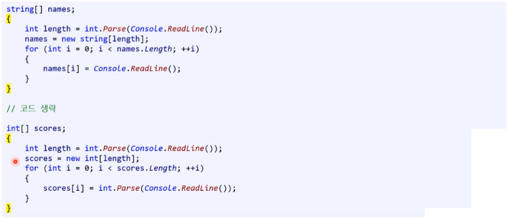
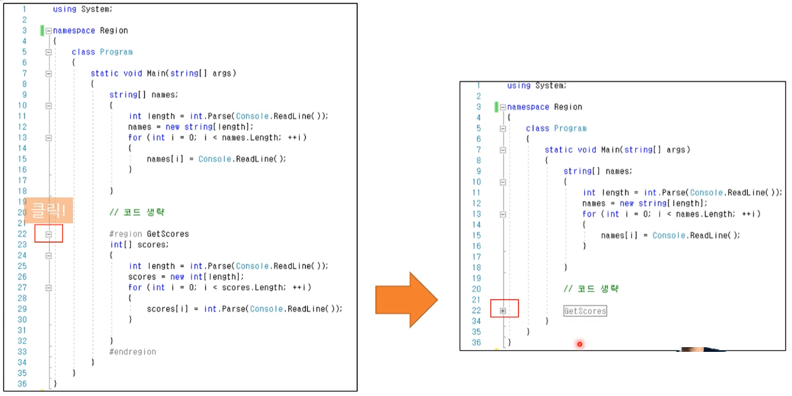

# 08 함수 ( 기본 )


**[ 함수 / 메서드 용어 정리 ]**

일반적으로 함수와 메서드는 동의어로 사용합니다. 
굳이 나눠서 말하는 사람들이 있는데  (특히 OOP 쪽을 맹신하는 사람들이 그렇다. ) 

그 분들에 따르면 class에 들어있는 함수를 메서드라고 나눠 부릅니다.
하지만 이것도 잘못된 용어 사용이다.

전혀 중요하지 않지만 엄밀하게 구분을 해드리면 이렇습니다.

---

* 서브 루틴(subroutine) : 가장 일반적이고 모든 것을 포함하는 개념

  * 프로시저(Procedure) : 서브루틴 중 '반환 값'이 없는 것. (즉, void가 반환형인 함수)

  * 함수 : 서브루틴 중 '반환 값'이 있는 것.

  * 메서드 : 서브루틴 중 클래스 속에 있는 것들

역시 전혀 중요하지 않으며 이제는 그냥 다 함수라 부릅니다.
대부분의 책에서는 이 모든 키워드들이 동의어 처럼 사용되고 있습니다.

---


**[ 함수의 기능 ]**

* 코드 파편화 : 기능별로 세분화 시킬 수 있다.
* 코드 집중화 : 문제가 발생하는 함수만을 바꾸면 해결된다.
* 코드 은닉화 : 사용자가 모든 함수의 내부적인 작업을 이해할 필요가 없다.


## 1. 함수 생성 시점

### 1.1. 함수의 목적과 구분

#### 1) 목적

* **중복되는 코드 - 재사용 ( 재활용성 )**
  * 수정 및 관리가 용이해 진다.
  * 블랙박스
    * 함수 바디 안에 내용을 몰라도 쉽게 사용할 수 있다.
    * 믿어야 한다. ( 함수의 내부가 모르더라도 그렇게 돌아갈 것이라는 것을 신뢰하고 사용해야 한다. )


#### 2) **수학의 함수 vs 프로그래밍 함수**

모양은 비슷하나 개념은 서로 다르다.

* 수학 : **<u>오직 하나</u>** 씩만 대응하며, 이 대응 f를 집합 X에서 집합 Y로의 함수라 한다.
  * y = f(x) ( x는 집합 X의 원소, y는 집합 Y의 dnjsth )
* 프로그래밍 : 함수에 입력(input)이 들어가면 어떤 결과가 출력(output)
  * 동일한 입력 값이 들어갔을 때 출력은 거의 똑같은 값이 정해져서 나온다. ( random 제외 )
  * 0~1개의 반환형을 가진다.( void 포함 )
  * 0개 이상의 매개변수를 가진다.
  * 입력 : 두 개의 정수 => 47과 84
  * 출력 : 한 개의 정수 => 131


#### 3) 함수의 종류

* **내장 함수**
  * C#이 자주 사용하는 기능을 미리 만들어서 제공하는 함수로, 특정 클래스의 함수로 표현된다.
  * 사용 용도에 따라 문자열 함수, 날짜 및 시간 함수, 수학 함수 등 으로 나뉜다.
  * 이러한 내장 함수를 API(Application Programming Interface)로 표현합니다. 
* **사용자 정의 함수**
  * 프로그래머가 필요할 때마다 새롭게 기능 추가하여 사용하는 함수이다.


### 1.2. 함수 작성시기 ( 프로그래머 )

* 최대한 안 만들고 시작하되
* **코드 중복으로 재사용이 필요할 때 만들 것 ( 중복 가능성이 높을 때도 -  포함 ) ★★**
  * 기준 : 2번 이상


처음부터 함수로 시작하지 말 것 - 함수를 만드는 것 자체가 책임 질 일을 만드는 것이다. 

---

**[ 논쟁이 있는 가르침 ]**

* 모든 것을 함수로 만든다.
  * [문제점] 유지 보수에 어려움을 겪는다. 
    새롭게 함수를 재편하면 그 함수를 쓰던 코드나 개발자 모두에게 영향을 끼친다. 함부로 함수를 만들어서는 안된다.
* 함수는 너무 길어서는 안된다. ( 코드가 20줄이 넘을 시 함수로 쪼갠다. )
  * 예전에는 맞는 말이었지만 현재는 의견이 분분하다. 참고로 그 당시에는 모니터 화면이 작았었다. 어떤 연구 기관의 조사에 따르면 코드가 200줄 이상일 시 가독성에 문제가 된다는 연구 결과도 있다. 
  * Clean Code 책에서 나오는 내용을 바탕으로 하는 것인데 그 당시에는 모니터 화면이 작았기 때문에 맞는 내용이었지만 현대는 적절한 조언이 아니다.

---


### 1.3. 함수 코딩표준 

#### 1) 함수의 네이밍 규칙 ( 업계 표준 )

어떤 기능을 하는지 유추할 수 있는 단어를 사용한다.

1. 동사로 시작할 것 => 함수는 보통 행동(action)에 대한 것이다.
2. 제일 첫 글자는 대문자 ( 파스칼 표기법 )
   * (ex) Add, Square

* 여러 단어를 연결하면 두 번째 단어부터는 첫 글자를 대문자로 사용한다.
  * 이 방식도 조금 복잡하기 때문에 남용해서는 안된다. ( 되도록이면 두 단어까지 사용하지 않는게 좋다. )
  * (ex) AddTwoNumbers, PrintFullName


#### 2) 매개변수와 지역변수 이름 짓기

정확히 어떤 정보를 담는 단어인지 유추할 수 있는 단어 사용

1. 명사를 사용
2. 제일 첫 글자는 소문자로 시작할 것
   * camel case 사용
     (ex) mathScore, studentName


#### 3) **함수는 블랙박스여야 한다.**

함수명을 명확하게 하여 보여 주는 그대로 결과가 나와야 한다.

* **함수명**

  * 함수명만으로 유추가 되어야 한다.
  * 호출자가 함수 내부를 알 필요 없이 **함수명 만으로도 명확하게** 보여주는 그대로 결과가 나와야 한다.
  * 값을 반환하는 함수의 이름은 무엇을 반환하는지 알 수 있게 짓는다. (ex) GetAge

* **함수 헤더**
  * 함수 헤더로 볼 때 더 명확히 유추가 가능해야 한다.

* **함수 바디**

  * **내부도 명확히** 하는 것이 좋다.

  * (ex) add 라는 함수가 있다면 더하기만 하면 된다. 
    내부적으로 여러 작업을 비교하고 하는 작업을 하게 된다면 블랙박스의 의미가 없어진다.


#### 4) 함수의 기능은 하나여야 한다.

보통 그렇다.
만약, if else로 다른 동작을 한다면 되도록이면 둘을 불리 시켜서 함수를 작성하는 것이 좋다.

그러나 어디 까지가 하나의 기능인지 판단하는 것은 주관적이다. 
그렇기에 여러 기능을 묶어서 하나의 함수로 만드는 경우도 있다.


## 2. 함수 정의

* **definition**

```c#
static <반환형> <함수명> (<매개변수 목록>)
{
	// 함수 바디(body)
}
```


### 2.1. **함수 시그니쳐 ( function signature )** 

함수명, 매개변수 목록 등의 조합이 가지는 하나의 정체성이다. 

( 하나라도 다르면 다른 함수이다. )

* **일반적인 함수의 시그니처(signature)**
  * **함수 이름**
  * **매개변수**
    * **변수 개수**
    * (선택) 변수 자료형 조합  -  동적 언어에는 해당 사항이 없다.
  * (선택) 반환형
    * [주의!] 반환형은 함수의 시그니처가 맞을 때도 있고, 아닐 때도 있다.
    * 동적 언어에는 해당 사항이 없다.

* [C# 메서드 시그니처](https://learn.microsoft.com/ko-kr/dotnet/csharp/methods#method-signatures)
  * 엑세스 수준 : public, private
  * 선택 한 정자 : abstract, sealed
  * 반환형 : void 및 데이터형
  * 메서드 이름
  * 매개변수
    * 변수 개수
    * 변수 조합

---

**함수의 시그니쳐가 알려 주는 것**

* 함수의 헤더만으로 기능을 유추 할 수 있어야 한다.


---


### 2.2. 함수 헤더

* **function header**


#### 1) 매개변수

```C#
static int Add(int op1, int op2)		// 매개변수 : int형 'op1, op2' 2가지이다.
{
	return op1 + op2;		
}
```

```c#
static void PrintHello()				// 매개변수 : 매개변수가 없은 함수이다.
{
	Console.WriteLine("Just hello!");
}
```

* 함수의 **입력(input)**
* **매개변수 ( parameter )**라고 부른다.
* 사용 가능 한 자료형
  * int, byte와 같은 자료형 뿐만 아니라 int[]나 string[]과 같은 배열도 매개변수로 사용 가능하다.
* 매개변수는 **필수가 아니다.**
  * 매개변수 목록은 없어도 될 때도 있다.
  * 함수는 **0개 이상**의 매개변수를 가진다. 


**[ 매개변수와 인자 ]**

다른 말이지만 사람들이 거의 구분 없이 쓴다.

* 매개변수 ( parameter ) : 함수를 정의할 때 함수의 입력 값을 선언하는 걸 말한다.
* 인자 ( argument ) : 함수를 호출할 때 함수로 전달하는 실제 값을 말한다.


**[ 메인 함수의 매개변수에 데이터 넘기는 법 ( with Visual Studio) ]**

1. Visual Studio의 '솔루션 탐색기'에서 프로젝트 우클릭
2. 우클릭 메뉴에서 '속성' 클릭
3. 속성창에서 '디버그' 클릭
4. '응용 프로그램 인수'에 데이터 입력 (ex) Hello, C# is fun!
   * 문장을 **큰 따옴표로 감싸면 1개의 매개변수로 인지**한다.


5. 저장 - Ctrl + s 혹은 상단 메뉴에서 저장 아이콘 클릭
6. 실행


**[ 코드 및 실행결과 ]**

```c#
static void Main(string[] args)
{    
	for (int i = 0; i < args.Length; ++i)    
	{        
		Console.WriteLine($"args[{i}] = {args[i]}");    
	}
}
```


#### 2) 함수명

```c#
static int Add(int op1, int op2)		// 함수명 : Add
{
	return op1 + op2;		
}
```

* 함수 이름
* 어떤 기능을 가졌는지 알 수  있게 지으면 가독성이 증가한다.
  * 함수명이 "A"이면 함수가 어떤 기능인지 유추하기 어렵다.
  * 함수는 블랙박스 이기에 내부구조를 몰라도 기능을 알 수 있게 이름을 작성하는 것이 좋다.


#### 3) 반환형

---

* 반환 값 ( return value )

---

* 함수의 **출력 (output)**
* **반환형은 반드시 선언해야 한다.**
  * void : 반환 값이 없을 경우 사용한다.
    * void인 경우에도 return 문을 사용할 수 있습니다.
  * void가 아닐 경우 
    * 함수 바디에 return 키워드를 이용해 데이터를 반환한다.
    * 데이터를 반환하지 않으면 컴파일 오류
  * 미표기 시 컴파일 에러


```C#
static int Add(int op1, int op2)		// int 반환형
{
	return op1 + op2;					// op1 + op2 값으로 반환
}
```


### 2.3. 함수 바디

* **function body**

```c#
static int Add(int op1, int op2)
{
	return op1 + op2;		// 함수 바디
}
```

* 함수의 기능을 구현한 코드 블록
* 반복문과 마찬가지로 중괄호( { } )를 이용한다.
* return 반환 사용 
  * 함수가 void가 아닌 반환형을 가지고 있다면 반드시 return 키워드를 이용해 데이터를 반환 해야한다.
    ( void의 경우 return ;을 사용할 수 있지만 굳이 쓰지는 않는다. )


### 2.4. 선조건과 후조건

**선조건(Precondition)과 후조건(Postcondition)**

함수가 무슨 일을 하는지에 대한 약속이다. 
조건을 따로 문서화 시키기도 하지만 그렇지 않은 경우도 있다. 


#### 1) 선조건

* **Precondition**

* 함수 실행 전에 참으로 가정하는 조건
  * (ex) Divide() 함수는 분모가 0이 아니어야 한다.
* 함수 이름이나 매개변수로 유추 가능하나, 부족하면 주석으로 추가 설명한다.


##### - XML 문서 주석 

* Documentation Comment
* xml format을 사용한다.
* 비주얼 스튜디오에서는 슬래스 ( / )를 세 번 입력하면 자동으로 생성된다.
* 해당 함수에 마우스를 올리거나 코드를 작성할 대 관련 설명을 볼 수 있다. 
* 후조건도 표기 가능하다.


( 선 조건을 명시한 주석 예시 )


[최신] 현재는 이렇게 까지 주석을 쓰지는 않고 코드 자체가 설명이 되는 방식을 주목해서 사용하고 있다.

* 예전처럼 정형화 된 방식으로 설명하지는 않고, 필요할 때만 설명하는 방식으로 사용한다.
* 오픈소스의 경우 사용자가 워낙 많으니 주석 작성 비율이 높다. 
* 회사 직원 끼리 사용한다면 굳이 작성하지 않는다.


#### 2) 후 조건

* **Postcondition**
* 함수 실행 후에 보장되는 조건
  * (ex) 두 정수를 더하면 정수의 결과가 나온다.
* 함수 이름과 반환형으로 유추 가능하다.
* 선조건을 만족하지 못하면 후조건을 보장 할 수 없다.


### 2.5. 함수 호출

함수 호출(call)에서 함수의 구조나 사용법을 유추할 수 있다. 
( 블랙박스 : 내부까지는 알 필요는 없다. )

```c#
static int Add(int op1, int op2)
{
	return op1 + op2;
}

static void Main(string[] args)
{
    int result1 = Add(123, 589);
    
    int num1 = int.Parse(Console.ReadLine());
    int num2 = int.Parse(Console.ReadLine());
    int result2 = Add(num1, num2);
}
```


**[ 초보자들이 하는 실수 ]**

* 블랙 박스
  * 함수는 블랙박스라는 것을 기억하자.
  * 함수 사용자는 오직 이 세 가지( 1. 함수 이름   2. 반환형   3. 매개변수 목록 )를 통해서 이해 유추하고 사용해야 한다.
    즉, 위 세 가지로부터 알 수 없는 내용들을 어느 쪽도 알아서는 안된단 뜻이죠. ( 폰트 색을 바꿀 때 어떻게 구현했는지는 알 필요 없다. )

* 불신
  * 올바른 값을 함수에 입력하면 약속된 값이 반환된다고 믿고 고민 없이 그 함수를 호출 가능하다.
  * 믿고 사용하자. ( 신뢰 )
* 오용
  * 많은 초보자 분들이 하시는 실수가 잘못된 방식으로 '함수 안에 코드가 이렇게 작성되어있으니 난 함수 밖에서 이렇게 해야지~' 또는 '이 함수 호출하는 코드를 저렇게 작성해놨으니 이 함수에서 이래도 돼~' 이런 생각한다.


## 3. 함수와 범위

### 3.1. **범위 ( scope )**

* 코드 블록을 감쌀 대 중괄호로 감싸야 한다. ( {  } )
* if 문이나 반복문에서도 범위가 나오며, 범위를 명백하게 보여주기 위해 중괄호를 써야 한다.

* 내포된 범위 ( nested scope ) : 상위 범위에서 선언한 '변수 / 상수'는 하위 범위에서 사용 가능하다. ( 범위 밖은 불가능하다. )
  * 어떤 범위 안에 선언된 것은 범위 밖에서 쓰지 못한다.


### 3.2. 전역 변수 / 지역 변수

#### 1) 지역 변수

* local variable

* 기본적으로 함수 안에서 선언한 모든 것은 그 함수에서만 사용 가능하다.

  * 대체로 함수 밖에 있는 '변수 / 상수'는 사용할 수 없다. ( 예외의 경우 나중에 배울 예정 )

  ```cs
  static int AddNumbers(int num1, int num2)
  {	
  	int sum = num1 + num2;
  	return sum;
  }
  ```

  ---

  ```csharp
  class Program
  {
      static void Square(double number) 
      { 
          double result = number * number;
      }
  
      static void Main(string[] args)
      {
          double num = double.Parse(Console.ReadLine());
          Square(num);
          Console.WriteLine($"Result: {result}");        // 컴파일오류
      }
  }
  ```


**[주의!] 함수 안에 함수를 정의해서 사용할 수 없다. **

* **C#에서 지원이 안될 뿐 더러 다른 언어에서도 지원이 되더라도 그렇게 사용하는 것을 추천하지 않는다. **

```c#
int main()
{
	static int Add(int num1, int num2)
	{
		...
	}
	Add(num1, num2);
}
```


#### 2) 전역 변수 ( 필드 )

* global variable  /  field
* C#에서는 전역 변수가 아닌 필드라는 단어를 주로 사용합니다. 
* 전역 변수는 언더스코어( `_` ) 또는 `m_`접두사를 붙이는 경향이 있습니다.


### 3.3. 매개변수 전달 방식

* 값에 의한 전달(호출) : 복사본 전달
* 참조에 의한 전달(호출) : 원본 전달


#### 1) 값에 의한 전달 

* Call by Value

* 원본 변수 != 인자
  * 함수 매개변수에 원본 변수의 **사본**이 전달
* 호출된 함수(receiver)의 인자 값이 변경 되도 호출자 함수(caller)에 반영되지 않음

```cs
class Program
{
	static void Square(double number)
	{
		number *= number;
		return number;
	}
    
    static void Main(string[] arge)
    {
		double nubmer = 5;
        Console.WriteLine($"Before: {number}");
	    number = Square(number);
        Console.WriteLine($"After: {number}");
	}
}
```


#### 2) 참조에 의한 전달

* Call by Reference
* 원본 변수 = 인자
  * 함수 매개변수에 원본 변수가 전달되는 방식이다. ( 원본 변수를 직접 참조 )
* 호출된 함수 (receiver)의 인자의 값이 변경되면 호출자 함수(caller)에 반영


```cs
class Program
{
	static void Square(ref double number)
	{
		number *= number;
	}
    
    static void Main(string[] arge)
    {
		double nubmer = 5;
        Console.WriteLine($"Before: {number}");
        Square(ref number);
        Console.WriteLine($"After: {number}");
	}
}
```


##### - ref 키워드 ( C# 전용 )

* 참조에 의한 전달을 위해 C#에서 사용

* 함수 호출 시 인자에 **ref** 키워드를 붙인다.

* ref 키워드는 다른 프로그래밍 언어에서 널리 쓰이지 않는다.

  * 그러나 일부 언어에서 비슷한 개면이 존재

    => 참조에 의한 전달을 지원하고 싶어하기 때문이다.

* 사용법

  * 인자 초기화 : ref 변수로 사용할 변수 초기화 필수! - <u>[주의!] 컴파일 에러</u>
  * 함수 선언시 : 매개변수에 ref 키워드 사용
  * 함수 호출시 : 인자에 ref 키워드 사용


### 3.4. **긴 함수의 문제와 해결법 **

#### 1) **공통**

* 함수가 길어지면 동일한 이름의 지역 변수가 생기는 경우가 있다.

  => **'중괄호'**를 사용하여 범위를 분리 시키면 문제 해결 가능하다.

* 코드가 길어지고 가독성이 나빠지는 것을 방지한다.




#### 2) C# : #region과 #endregion

* C# 전용 해결법

* 비주얼 스튜디오에서 코드를 접거나 펼 수 있게 해준다.
* 긴 코드의 함수가 가지는 문제점을 해결하는 방법이다.
* 긴 함수를 짧게 만들 수 있는 방법이다.
  * 실제로 함수 길이가 줄어드는 것은 아니다.

```cs
#region GetScors		// 펼쳤을 때
...
    // 코드 생략
...
#endregion
```

```csharp
#region GetScors		// 접혔을 때
#endregion
```




## 4. 실습 코드

**[ Hello World! ]**

* 함수의 형태 - 입력과 리턴 : 기본
  * 일반적인 함수 - 입력 값 O, 출력 값 O
  * 입력 값 없는 함수 - 입력 값 X, 출력 값 O
  * 출력 값 없는 함수 - 입력 값 O, 출력 값 X
  * 둘 다 없는 함수 - 입력 값 X, 출력 값 X


## Chapter 10  random

```C#
int num = random.Next(1, 7);		// 1이상 7미만
```


## Chapter 11  숫자야구

```C#
using System;

namespace UltimateBaseball
{
    class Program
    {
        static void Main(string[] args)
        {
            Console.WriteLine("+------------------------------------------------------+");
            Console.WriteLine("|                    궁극의 숫자야구 게임                 |");
            Console.WriteLine("+------------------------------------------------------+");
            Console.WriteLine("|    컴퓨터가 수비수가 되어 세 자릿수를 하나 골랐습니다.       |");
            Console.WriteLine("|    각 숫자는 0~9중에 하나며 중복되는 숫자는 없습니다.      |");
            Console.WriteLine("|    모든 숫자와 위치를 맞히면 승리합니다.                   |");
            Console.WriteLine("|    숫자와 순서가 둘다 맞으면 스트라이크입니다.            |");
            Console.WriteLine("|    숫자만 맞고 순서가 틀리면 볼입니다.                    |");
            Console.WriteLine("|    숫자가 틀리면 아웃입니다.                            |");
            Console.WriteLine("+------------------------------------------------------+");

            Random random = new Random();
            int[] numbers = new int[3];

            int index = 0;
            while(index < 3)
            {
                bool hashDuplicate = false;
                numbers[index] = random.Next(0,10);

                for (int i = 0; i < index; i++)
                {
                    if (numbers[index] == numbers[i])
                    {
                        hashDuplicate = true;
                        break;
                    }
                }
            
                if (!hashDuplicate)
                {
                    index++;
                }
            }

            int[] guess = new int[3];
            string[] message = {"> 첫 번째 숫자를 입력하세요 : ", "> 두 번째 숫자를 입력하세요 : ", "> 세 번째 숫자를 입력하세요 : " };

            while(true)
            {
                index = 0;
                while(index < 3)
                {
                    bool hashDuplicate = false;
                    
                    Console.Write(message[index]);
                    guess[index] = int.Parse(Console.ReadLine());

                    for (int j = 0; j < index; j++)
                    {
                        if (guess[index] == guess[j])
                        {
                            Console.WriteLine("중복 된 숫자 입니다. 다시 입력해 주세요.");
                            hashDuplicate = true;
                            break;
                        }

                        if(guess[index] > 9 || guess[index] < 0)
                        {
                            Console.WriteLine("숫자가 너무 크거나 작습니다. 다시 입력해 주세요.");
                            hashDuplicate= true;
                            break;
                        }
                    }
            
                    if (!hashDuplicate)
                    {
                        index++;
                    }
                }

                int strikCount = 0;
                int ballCount = 0;

                for (int i = 0; i < 3; i++)
                {
                    for (int j = 0; j < index; j++)
                    {
                        if (guess[i] == numbers[j])
                        {
                            if(i == j)
                            {
                                strikCount++;
                            }
                            else
                            {
                                ballCount++;
                            }
                        }
                    }
                }

                Console.Write("스트라이크 카운트 :");
                Console.WriteLine(strikCount);
                Console.Write("볼 카운트 :");
                Console.WriteLine(ballCount);
                Console.Write("아웃 카은트 :");
                Console.WriteLine(3- strikCount - ballCount);

                if (strikCount == 3)
                {
                    Console.WriteLine("축하합니다. 승리하셨습니다.");
                    break;
                }
            }
        }
    }
}

```


---

* 함수의 구조
  * 개념
  * 빈 함수
  * 함수 호출하기
  * 작성과 호출 순서
  * 매써드 비교

---

* 함수의 형태 - 입력과 리턴 : 기본
  * 일반적인 함수 - 입력 값 O, 출력 값 O
  * 입력 값 없는 함수 - 입력 값 X, 출력 값 O
  * 출력 값 없는 함수 - 입력 값 O, 출력 값 X
  * 둘 다 없는 함수 - 입력 값 X, 출력 값 X

---

* 매개변수와 인수
  * 매개변수
  * 인수
  * 기타 

---

* 랜덤 함수 - 호출 방법

---

* 기타 

---

* 실습 : 재귀함수 - 피보나치 수열, 하노이의 탑 


