# 15 재귀 함수, 랜덤

재귀 함수는 일부를 추상화를 한 개념이다.

수학적으로 말하면 일반화이다.


## 1. 재귀 함수

**recursive function**

* recursive (형용사) : 반복되는


### 1.1. 작성

* 재귀함수를 작성할 때 생각하는 방법 : 작은 문제 해결 방식으로 더 큰 문제를 해결
* 프로그래밍에서는 **함수 A가 매개변수만 바꾸어 다시 함수 A를 호출하는 방법**으로 구현

```cs
static uint SumRecursive(uint num)
{
	if (num == 0)
	{
		return 0;
	}
    else
    {
        return num + SumRecursive(num - 1);
	}
}

static void Main(string[] args)
{
 	Console.WriteLine(SumRecursive(3));
}
```


### 1.2. 구성요소 - 2가지 

수학 귀납법에서는 base case

* 종료조건(ending condition, base case)

  * 더 이상 재귀 함수를 호출하지 않고 값을 반환하는 조건
  * 매우 간단히 함수의 반환 값을 찾을 수 있는 경우
  * [주의!] 함수는 무한 재귀 호출이 발생할 수 있기 때문에 무조건 필요하다.

* 재귀적 함수 호출

  * 종료조건이 아닌 경우

  * <u>함수의 인자를 바꿔 스스로를 다시 호출</u>

  * <u>이 때, 함수의 인자는 현재 문제보다 작은 문제를 대표해야 한다.</u>

  * <u>즉, 동일한 동작을 보다 작은 문제에 적용</u>

    ( 너가 해결해줘 토스 호출 => 호출 => 반환 => 반환 )


#### 1) 종료조건

```csharp
static uint SumRecursive(uint num)
{
	if (num == 0)
	{
		return 0;
	}
	...
}
```


**[주의!] 종료조건이 없는 경우**

* 무한 함수 호출에 빠져버린다. ( 에러? )

```cs
static uint SumRecursive(uint num)
{
	return num + SumRecursive(num - 1);
}

static void Main(string[] args)
{
 	Console.WriteLine(SumRecursive(3));
}
```


#### 2) 재귀호출

```csharp
static uint SumRecursive(uint num)
{
	if(...)
	{
		...
	}
	else
	{
		return num + SumRecursive(num - 1);
	}
}
```


**최종**

```csharp
static uint SumRecursive(uint num)
{
	if (num == 0)
	{
		return 0;
	}
    else
	{
		return num + SumRecursive(num - 1);
	}
}
```


---


### 1.3. 재귀 함수의 필요성

#### 1) 재귀 함수가 필요한 시점

* 모든 재귀 함수는 반복문으로 해결 가능
* but, 복잡한 문제일수록 재귀 함수가 더 편하다.
  * 이진 검색
  * 트리 구조
  * 퀵 정렬
  * 하노이의 탑
  * 어떤 폴더 아래에 있는 모든 파일 목록 구하기

---

* 논리적으로 쉽게 접근 할 수 있고, 눈으로도 쉽게 볼 수 있는 시점이 있다.

* (ex) 자료구조 2진 트리, 정렬, 그래프 띄우기, 네트워크 패킷 분산 전송, 게임에서 길 찾기 등 다양하게 사용된다. ( 특히 복잡한 거 할 때 사용된다. )

---

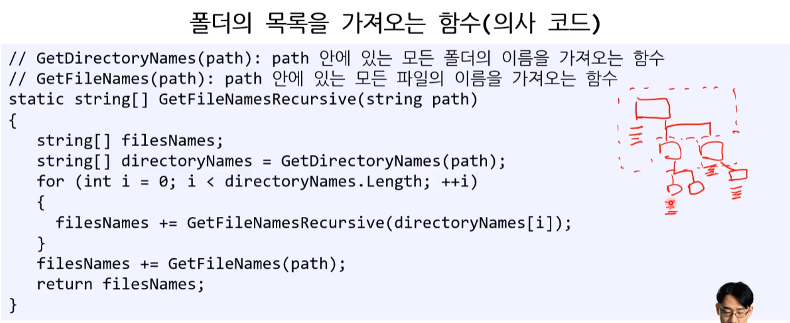


#### 2) 재귀적 해결법 = 논리력

* 프로그래머의 논리력을 평가하기 적합하다.

  * 개발자 이 능력이 부족하다면 조금만 복잡한 일을 하면 그것을 못 끝낼 가능성이 높다.
* 매우 큰 문제를 작게 쪼개서 증명할 수 있는가?

  * 절대 틀릴 수 없는 아주 작은 최소한의 문제를 푼다.
  * 최소한 문제의 해법에 의존하여 그 보다 하나 더 큰 문제를 해결
  * 그 과정을 반복하면서 논리적으로 최종 문제까지 해결


#### 3) 재귀 함수의 장단점

##### (1) 장점

* 개념적으로 매우 훌륭하다.
* 증명이 가능하기 때문에 신뢰하고 안심할 수 있다.


##### (2) 단점

* **효율성이 떨어진다.** 
  * 중복되는 것을 또 호출한다. ( FibonacciRecursive(0) 호출 FibonacciRecursive(0) 또 호출 )
  * 반복문은 중간에 연산 결과를 저장(캐싱)할 수 있지만 재귀함수는 그럴 수 없다.
* **스택 오버플로우**
  * stack overflow
  * 함수 호출 깊이에는 제한이 있다. 
    ( 컴퓨터 구조 과목에서 좀 더 자세히 설명 )
    * [참고] 재귀 호출은 스택 메모리에 저장되는 형태로 실행된다.
  * 반드시 모든 경우에 쓸 수 있는 것은 아니다.


---


[ 단점 : 효율성 ]

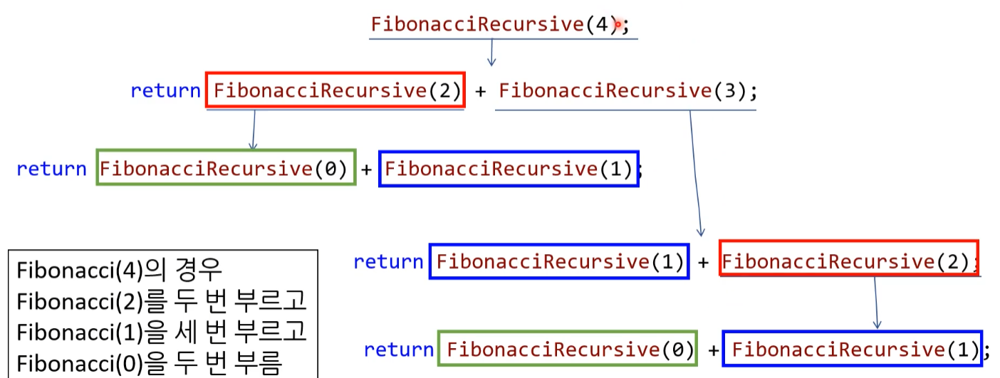

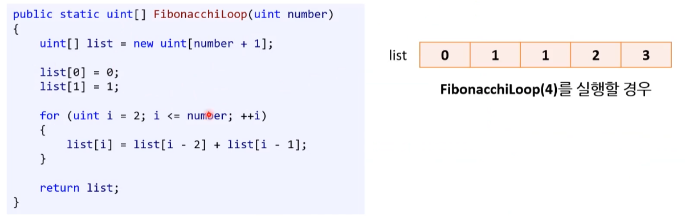


[ 단점 : 스택 오퍼플로우 ]

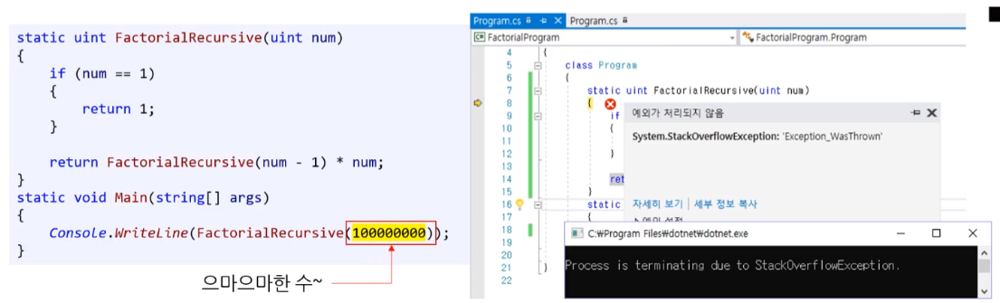

---


##### (3) 재귀함수를 사용하는 경우 - 베스트 프랙티스

* **반복문 사용하는 경우** : 캐싱 없이 간단한 반복문으로 작성 가능한 문제 ( ex. 1 ~ N까지 수의 합 구하기 )
* **재귀함수 사용하는 경우** : 그 외에는 재귀 함수로 우선 작성
  * 설계 및 이해가 용이하기 때문이다.
  * <u>BUT, 아래의 경우 반복문으로 코드 리팩토링 ( code refactoring )</u>
    * 함수 호출의 최대 깊이를 확정할 수 없다. - 스택 오버플로우 발생
    * 또는, 성능상의 문제를 발견 - 효율성 문제 


**[보충] 재귀함수와 성능**

재귀함수는 (스택)<u>메모리도 더 잡아먹고</u>, 함수 호출에 따른 부하로 <u>성능도 더 느립니다</u>. 
그래서 재귀 함수는 성능 문제로 많이 안 쓰인다는 낭설이 있지만 사실이 아닙니다.

재귀함수가 이해하기도 읽고도 쉽고, 유지보수(실수 방지)에도 좋기 때문에 일반적인 경우에는 재귀함수를 사용하는 것이 좋습니다.

실전에서도 많이 쓰이지만 특정 문제가 있을 경우에만 코드 리팩토링을 진행해야 한다.

> ---
>
> 일반적으로 어떤 프로그램을 구현한 코드 중에 20%이하가 실제 프로그램의 성능을 저하시키는 병목점이므로, 재귀 함수가 그 병목점에 해당하는 경우가 아니라면 그냥 재귀함수로 놔두는게 코드의 이해 및 유지보수에 더 용이합니다.
>
> ---


### 1.4. 재귀 함수의 수학적 신뢰

#### 1) 수학적 귀납법

재귀함수는 수학적 귀납법과 매우 밀접하다.

**수학적 귀납법**이 익숙지 않기 때문에 반복문의 선호도가 높은 것이다.


**[ 수학적 귀납법 ]**

* 일단 '2.'이 맞다고 가정하고 믿고 진행한다.
* '3. (k +1)'까지의 합도 2번식으로 공식을 만족하는지 증명한다.

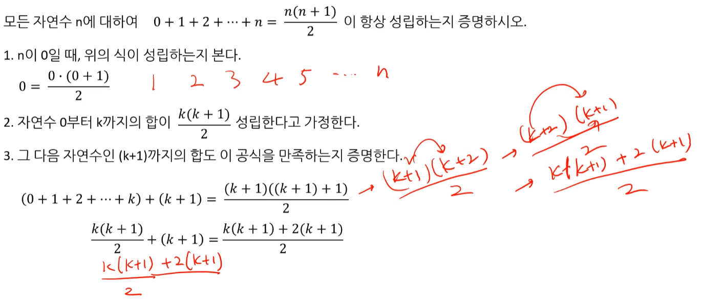

4. 즉, 0일 때, 1일 때, 2일 때 모두 참이라는 것이 증명이 되는 것이다.


#### 2) 재귀 함수와 신뢰

* 함수는 신뢰의 문제다.
* 재귀 함수는 더 큰 신뢰를 요구한다.
* Fibonacci(4)를 구하려 할 때
  * Fibonacci(2), Fibonacci(3)은 반드시 올바른 값을 반환한다 믿어야 한다.
  * 왜? 수학적 귀납법
  * 다른 말로 하면 종료 조건 : Fibonacci(0)은 0, Fibonacci(1)은 1을 반드시 반환
  * 그 후의 수는 위 종료 조건에 기초하여 값을 계산할 수 있다.


#### 3) 재귀 함수를 작성법

* 개인적인 의견을 적었다. 

0. 수학적 귀납법과 트리를 떠올리며 구상해 본다. 
1. 종료 조건 - 정하기
2. 맨 끝에서 생각 : 0 또는 1 등 마지막에 있는 종료 조건에 행위를 검증해 본다.
3. 3번째 생각 : 3번째 항이 어떻게 나오는지 본다.
4. 맨 앞에서 생각 : n개, n+1개, n-1개 묶음 단위로 행위를 진행해보기
   * 숫자가 아주 큰 단위까지 검증했다는 가정을 검증한다고 볼 수 있다.


### 1.5. 재귀 함수 : 실습 

#### 1) 피보나치 수열 : 실습 1

* 제 0항은 0, 제 1항은 1이며, 그 뒤의 모든 항은 바로 앞 두 항의 합인 수열

  0   1   1   2   3   5   8   13   21   34   55   ...

* 수학적 정의

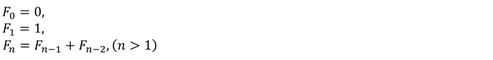

```c#
public static int FibonacciRecursive(uint number)
{
	if (number == 0)
	{
		return 0;
	}
	
	if (number == 1)
	{
		return 1;
	}
	
	return FibonacciRecursive(number - 2) + FibonacciRecursive(number - 1);
}

static void Main(string[] args)
{
	FibonacciRecursive(10);		// 피보나치 함수 호출
}
```

* [참고] elif 안쓰고 if만 쓰는 이유 바로 return을 하기 때문이다.

* early exit


#### 2) 하노이의 탑 : 실습 2

바라흐마의 규칙

1. 한 번에 원판 하나씩만 옮길 수 있다.
2. 작은 원판 위에 그보다 큰 원판을 옮길 수 없다.

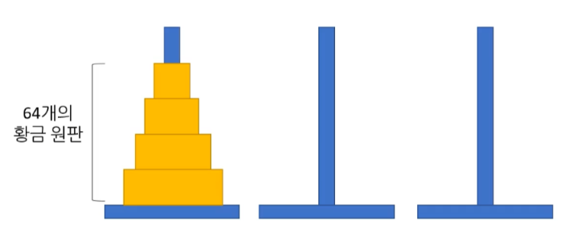


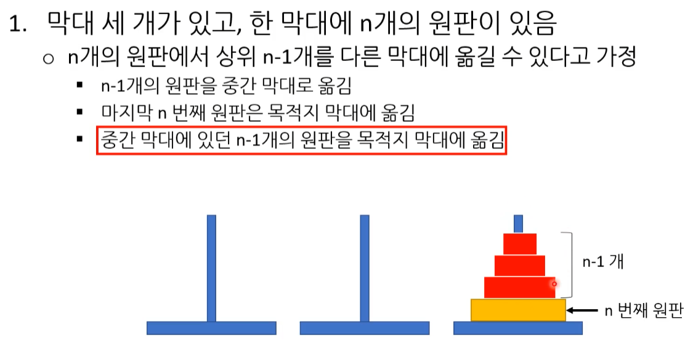

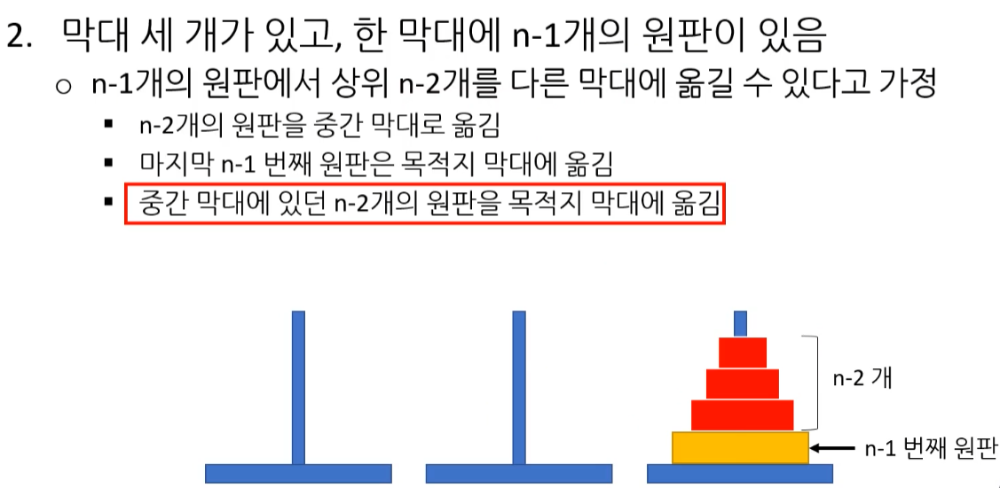

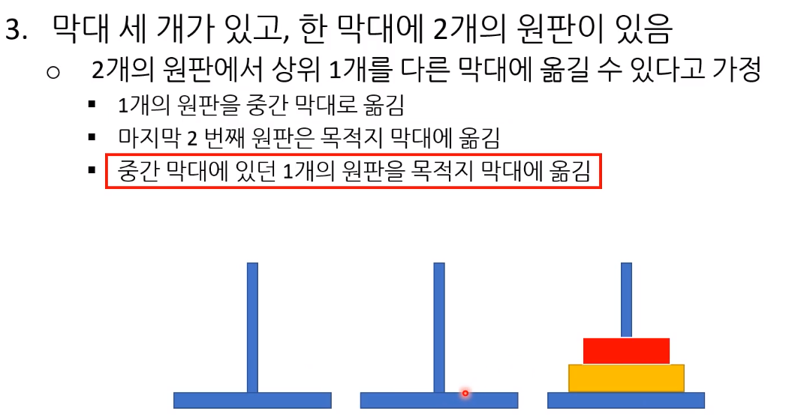


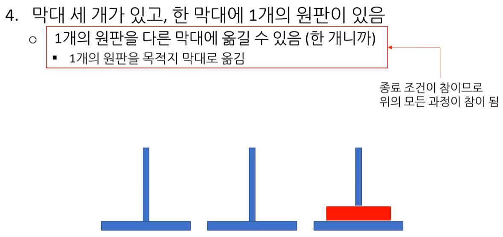


## 2. 랜덤 수

* 난수 
* 무작위 수
* 랜덤 ( random )

---

* 랜덤 수 생성 ( random number generation )

---


### 2.1. Random 클래스 

* **거의 모든 프로그래밍 언어에 존재하는 개념이다.**
* 난수 생성이라고도 한다.
* 언제나 예측 가능했던 (deterministic) 컴퓨터 세상에 내린 단비
  ( 이것 덕분에 게임이 나올 수 있었다. )

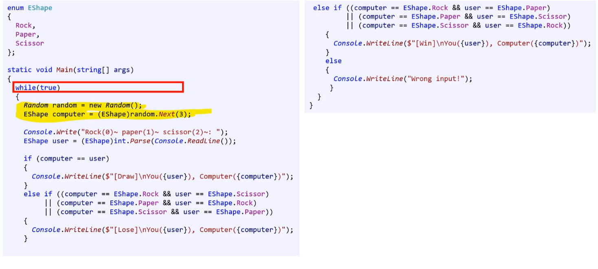


#### 1) Random 클래스와 개체 생성

* Randome 클래스의 변수를 만들어서 개체를 생성한다.
  * '랜덤 생성기(개체)를 만들어 random 자료형의 개체 이름에 대입한다'

```cs
Random luck = new Random();
Random random = new Random();
```

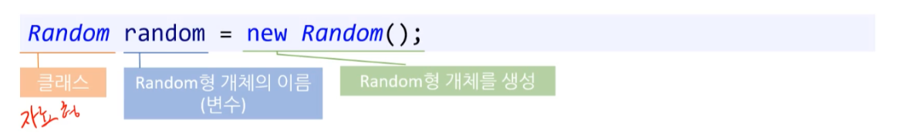


#### 2) 랜덤 수 생성하기

```
Random random = new Random();
int number1 = random.Next(3);
int number2 = random.Next(1, 10);
```

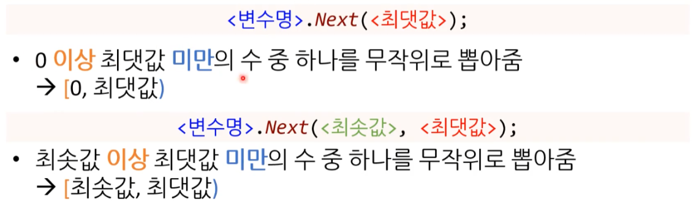


### 2.2. Random 함수

#### 1) 의사 랜덤

* **pseudo random**

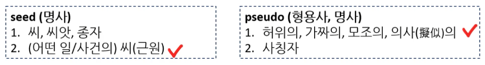

* 대부분 언어에서 지원하는 랜덤은 진정한 랜덤이 아니다.
* 시드 (seed) 값을 초기 입력값으로 하여 알고리즘을 통해 "난수"를 만들어 내는 함수이다.


* 


#### 2) 랜덤 함수의 시드값

랜덤 수를 생성하는 방법도 결국 함수이다.

* 함수는 입력값x가 같다면 약속된 y가 항상 나오게 된다.
* 그러니 시드 값을 이용하게 된다.

---

* 시드 (seed) 값을 초기 입력값으로 하여 알고리즘을 통해 "난수"를 만들어 내는 함수
* 그 결과는 다시 랜덤의 입력값이 된다.
* 즉, 시드 값이 같으면 언제나 생성된 난수의 순서가 동일하다.

---

* 시드 값 

  * 여기서 입력되는 시드도 내부적으로 기억하는 알파값을 사용하는 것으로 초기에 시드 값이 같으면 같다는 의미에서 쉽게 설명하기 위해 설명했다.

  * 랜덤 함수의 경우는 최소(시드)를 제외하고는 본인 스스로가 반환한 값을 다시 입력으로 사용합니다.
    ( 엄밀하게 항상 이런 건 아니고, 개념적 상으로는 맞다. - 중간에 알파 값도 들어간다. )

  * 즉, 시드가 같으면 늘 같은 결과가 나온다. 

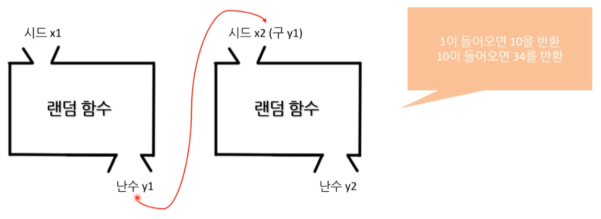


---

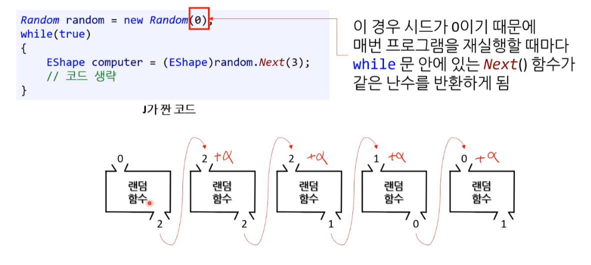

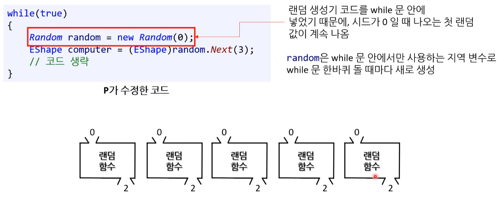

---


### 2.3. Random 사용법

**(1) 문제점 : 완벽하지 않은 난수 생성기**

* 여러 알고리듬이 존재한다.
* 대부분의 알고리듬은 완벽하게 랜덤이 아니다.
  * 알고리듬의 효율성은 난수의 분포로 결정
  * 대부분이 완벽한 랜덤이 아니다. ( 오차 존재 )
* 완벽한 난수 생성기를 만드려는 사람들이 있었다. ( 누군가의 꿈 )
  * **perfect random number generator**
  * 전용 하드웨어가 나왔다.

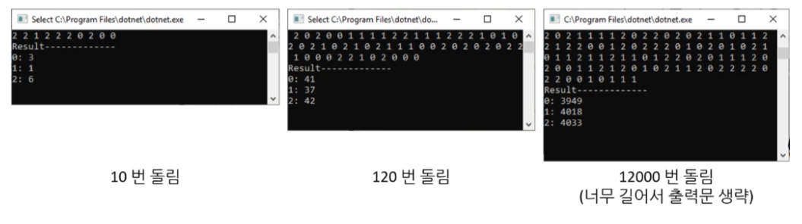


**(2) 해결책 : 시계 시드값**

* 이 문제를 해결하기 위해 컴퓨터에 달린 시계를 시드값으로 이용

* new Random() 도 내부적으로 이걸 사용한다.

  ( 이걸 직접 안 해주는 언어에서는 직접 시간을 읽어서 시드값으로 넣어준다. )


**[참고] 고정된 시드값 유용성**

* **디버깅**
  * 랜덤 수에 기초한 프로그램 로직에서 문제가 발생한 경우
  * 똑같은 시드값을 넣고 개발자 기계에서 실행하면 그대로 문제 재현

* **게임 개발**

  * 네트워크로 연결된 두 사용자가 게임을 할 때
  * 동일한 시드값을 각 컴퓨터에 넣어주고 난수를 동일한 횟수만큼 생성
  * 그러면 난수에 의해 바뀌는 게임 속 로직도 두 컴퓨터에서 동일

  * (ex) 게임에서 지형을 자동으로 생성 - 마인크래프트 


