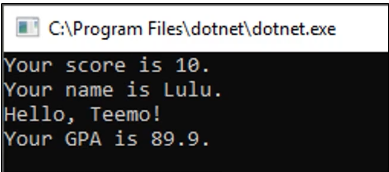
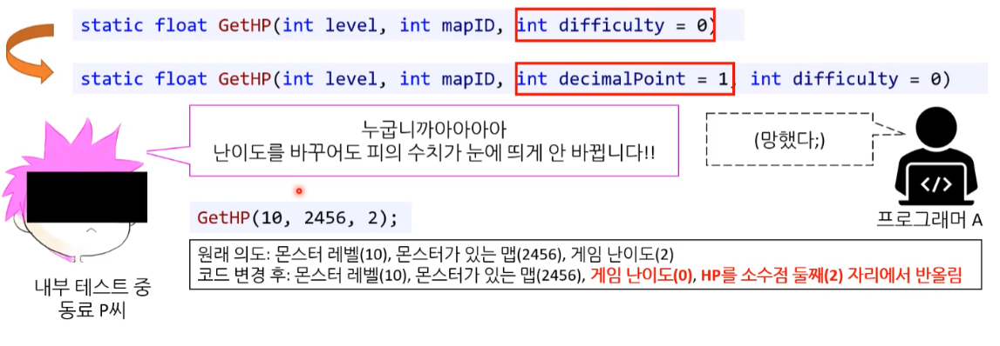
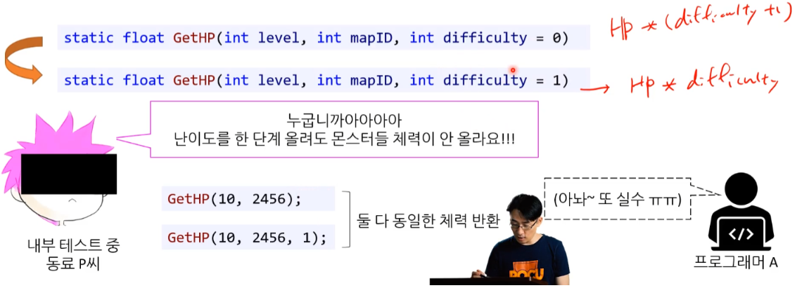

# 함수 Ⅲ - 오버로딩, C# 매개변수

모든 언어에서 지원하는 것은 아니지만 많은 언어에서 지원하는 기능에 대한 내용이다.


## 1. 함수 오버로딩

```csharp
static float Average(int[] scores)		// 함수 바디 생략
static float Average(float[] floats)	// 함수 바디 생략
```

* **함수 오버로딩** : 함수를 동일 이름으로 사용한다.
  * 모든 언어가 다 되는 것은 아니다.


### 1.1. 함수 오버로딩

* **function overloading**

---

```cs
static void Print(int score)
{
    Console.WriteLine($"Your Score : {score}");
}

static void Print(string name)
{
    Console.WriteLine($"Your Name : {name}");
}

static void Print(float gpa, string name)
{
    Console.WriteLine($"Hello, {name} | Your GPA : {gpa}");
}

static void Main(string[] args)
{
    Print(10);
    Print("Lulu");
    Print(89.9f, "Teemo");
}
```




* 함수 오버로딩

  동일한 이름을 가진 함수 구현을 허용하는 기능이다.

  * 이름 : 동일 해야 하다.
  * 매개변수 : 매개변수 목록으로 구분한다.
  * 반환형 : 상관 없다.

* 함수의 시그니처 : 매개변수와 함수 이름을 시그니처로 사용한다.

  * 반환형은 시그니처에 포함되지 않는다. ( 거의 없다. )
  * [이유] **컴파일러가 판단이 불가능하다.**

  ```c#
  static void Print(int score)					// OK
  static void Print(string name)					// OK
  static void Print(float gpa, string name)		// OK
  static int Print(int score)						// 컴파일 오류
  static int Print(float gpa)						// OK
  ```

  ```
  Print(10);
  ```


### 1.2. 함수 오버로딩 ( 문제점 )

#### 1) 잘못된 함수 호출

잘못 된 함수 호출이 일어 날 수 있다.

```cs
static string[] GetStudents(float height)		// 함수 바디 생략
static string[] GetStudents(int age)			// 함수 바디 생략

// 메인 함수
int height = 175;		// GetStudents(int age)가 호출. 175세;;
GetStudents(height);	// GetStudents(int age)가 호출. 175세;;
GetStudents(175);
```


#### 2) 매개변수 승격 / 묵시적 형변환

동일한 매개변수 함수가 없다면, 승격(promotion) / 묵시적 형변환을 통해 일치하는 함수를 찾는다.

```cs
static string[] GetStudents(float height)		// 함수 바디 생략

// 메인 함수
int age = 17;		
GetStudents(age);		// GetStudents(float height)가 호출. 17cm 단신
GetStudents(17);		// GetStudents(float height)가 호출. 17cm 단신
```


### 1.3. 코딩표준 : 함수 오버로딩

1. 매개변수의 개수가 다른 경우 => 오버로딩

2. 승격 / 묵시적 변환을 해도 상관 없을 경우 => 오버로딩
   ( double, float )

   ```csharp
   static double Sqrt(double num)		// 함수 바디 생략
   static int Sqrt(int num)			// 함수 바디 생략
   
   // 메인 함수
   Sqrt(10.0f);		// double형을 호출해도 그닥 문제는
   ```

   * 실제 C#의 Math 라이브러리도 flaot 보단 double을 더 많이 지원한다.

     * float 지원 함수 : Abs(), Clamp(), Max(), Min(), Sign()

     * float 미지원 함수 : Ceiling(), Cos(), Floor(), Log(), Pow(), Round() 등 등

       ```csharp
       float a = (float)Math.Round(3.5f);
       ```

3. 매개변수가 아예 승격이 불가능 한 경우 => 오버로딩
   ( 예 : string <=> int 혹은 string[] <=> int[] )

   ```csharp
   static string[] GetStudents(string name)	// 함수 바디 생략
   static string[] GetStudents(int age)		// 함수 바디 생략
   ```

4. 그런 게 아니라면, 함수 오버로딩 보다는 이름을 명확하게 분류하여 사용한다. 

   ```csharp
   static string[] GetStudentsByHeight(float height)	// 함수 바디 생략
   static string[] GetStudentsByAge(int age)			// 함수 바디 생략
   
   // 메인 함수
   int height = 180;				
   GetStudentsByHeight(height);	// OK (int가 float으로)
   GetStudentsByHeight(170.3f);	// OK (float이니까)
   GetStudentsByAge(17);			// OK (int니까)
   GetStudentsByAge(170.3f);		// 컴파일 오류 (float에서 int는 불가)
   ```

   


## 2. C# 매개변수 / 키보드 입력 


### 2.1. 기본값 인자

* **default parameter** - 기본값 매개변수
* **( optional argument )** - 선탠적 인자


**문제 상황**

```csharp
// 좋은 예는 아니다.
static string GetFullAdress(string street, string city);
static string GetFullAdress(string street, string city, string state);
```

* **함수 간 중복 된 매개변수가 많을 경우**

* 두 코드의 차이는 `string state` 뿐이다.

  * 계속 함수를 오버로딩한다?

  * 만약 '도시' 개념이 없는 나라를 고려해야 한다면? 아래 코드 추가?

    ```csharp
    static string GetFullAdress(string street);
    ```


**해결법 : 기본값 인자**

* 아무것도 안 했을 때 기본적으로 들어가는 인자이다.

* 매개변수 선언할 때 미리 기본값을 설정 할 수 있다.
* 여러 개 지정할 수 있다.

```csharp
static string GetFullAdress(string street, string city, string state = "")
static float GetHP(int level, int mapID, int difficulty = 0)

GetFullAdress("123 Main street", "Big City", "Big State");  // OK
GetFullAdress("456 Jido-daero", "Seoul");					// OK

GetHP(1, 1234, 10);	// OK
GetHP(1, 1234);		// OK
GetHP(1, 1234, 0);	// OK
```


**컴파일 에러**

* 매개변수 목록 중간에 기본값 인자가 오면 안된다. ( 맨 오른쪽에 있어야 한다. )

거의 모든 언어가 이런 방식으로 작동한다.

```csharp
// 컴파일 오류
static string GetHP(int level, int mapID, int difficulty = 0, string name);

// OK
static float GetHP(int level, int mapID, string name, int difficulty = 0);
```


#### 1) 기본값 인자의 문제점 - 2가지

**문제1 : 기본값 인자 - 추가시**

* 나중에 누군가 기본값 인자를 중간에 추가할 때 이상한 일이 일어날 수도 있다. 




**문제2 : 기본값 인자 - 변경시**

* 기본값 인자가 도중에 변경될 경우, 기존에 사용 중인 코드에서 문제가 발생할 수 있다.




#### 2) 기본값 인자 : 코딩 표준

* 회사들이 대부분이 아래의 표준을 따른다.

---

* 기존 코드에 새 기본 매개변수를 추가할 때는 항상 맨 뒤에 둘 것

  * 즉, 중간에 끼우지 말 것

* 기본값은 언제나 0으로 할 것

  * 0이 아니면 기본 매개변수로 하지 말 것 ( 엄한 규칙 : 안정성 중시 - 김포프식 ) 
    ( 다른 조직에서는 이 정도 까지 엄한 규칙이 적용 안될 수 도 있다. )

* 기본값 인자도 함수 오버로딩을 의존하다 보니 그거 대신에 함수 이름을 제대로 써주는 게(함수 이름 구체적으로 분류) 좋을 수도 있다. 

  = 기본 인자값을 빼버리고, 매개 변수 직접 넣어주며 사용하기

  


#### 3) 기본값 인자 vs 오버로딩

선택적 인자는 유용하지만, 메소드 오버로딩과 함께 사용할 대 혼란을 야기할 수 있다.

```csharp
void MyMethod (string arg0 = "", string arg1 = "")
{
	Console.WriteLine("A");
}

void MyMethod ()
{
	Console.WriteLine("B");
}
```

```
B
```

선택적 인자와 오버로딩을 함께 사용하는 것 자체가 0점짜리 코드다.

* 오버로딩을 할지 아니면 선택적 인자를 사용할 지를 프로그래머가 정책적으로 분명하게 정할 필요가 있다. 
* 논리는 동일하되 매개변수가 다른 경우는 선택적 인자를 사용하고, 매개변수에 따라 논리도 함께 달라지는 경우는 오버로딩을 사용하는 식으로 말이다.


 

**포프 댓글 답변**

```
[질문] 
그럼 새 기본 매개변수들은 대부분 기본 인자값이 있어야 하겠네요? 기본 인자값 없다고 중간에 넣으면 매개변수 순서가 뒤로 밀리니..

[답변]
'기본 매개변수'라는 게 무엇을 의미하는지 잘 이해가 안 되서 이렇게 이해하고 답변을 드리겠습니다.

1. 원래 함수가 있음. 이 함수가 받는 매개변수는 다음과 같음 (int a, int b, int c = 0)
2. 프로그래머가 새로운 매개변수 x를 추가하려고 함
3. 옵션 a: (int a, int x, int b, int c = 0)
4. 옵션 b: (int a, int b, int x = 0, int c = 0)
5. 질문자 분은 옵션 b가 맞는 방법이라 생각하심

제 답: 옵션 a가 올바른 방법입니다. 기본인자가 필요하지 않은 매개변수에 순서 안 바꾸기 위해서 기본 인자값을 넣으면 프로그래머의 의도가 모호해지며, 차라리 이 함수를 호출하는 모든 코드를 변경하더라도 딱 필요한 의도/기능만 넣는 게 맞습니다.
```


### 2.2. 명명된 인자 

**named arguments**

함수를 호출 할 때 필요한 매개변수 이름을 직접 지정할 수 있다.
함수를 호출 할 때만 인수의 이름 뒤에 콜론(:)을 붙인 뒤 그 뒤에 할당할 데이터를 넣어주면 됩니다.

* 사용시 코드가 훨씬 읽기 좋습니다. 
* 인자가 너무 많아 어느 매개변수에 어느 인수를 할당하고 있는지 분간이 어려운 경우에는 명명된 인자가 도움이 됩니다.

```csharp
using System;

namespace NamedParameter
{
    class MainApp
    {
        static void PrintProfile(string name, string phone)
        {
            Console.WriteLine("Name:{0}, Phone:{1}", name, phone); 
        }

        static void Main(string[] args)
        {
            PrintProfile(name: "박찬호", phone: "010-123-1234");
            PrintProfile(phone: "010-987-9876", name: "박지성");
            PrintProfile("박세리", "010-222-2222");
            PrintProfile("박상현", phone:"010-567-5678");
        }
    }
}
```

```
Name:박찬호, Phone:010-123-1234
Name:박지성, Phone:010-987-9876
Name:박세리, Phone:010-222-2222
Name:박상현, Phone:010-567-5678
```


### 2.3. out 매개변수

C#에서 거의 유일하게 있는 기능이다.


#### 1) ref 매개변수 : 문제 

```csharp
static bool TryDivide(float numberator, float denominator, ref float result)
{
    if (denominator == 0.0f)
    {
        return false;
    }

    result = numberator / denominator;

    return true;
}

static void Main(string[] args)
{
    float result1 = 0.0f;
    bool bSuccess1 = TryDivide(10.0f, 0.0f, ref result1);
    float result2 = 0.0f;
    bool bSuccess2 = TryDivide(10.0f, 5.0f, ref result1);
}
```

Try를 쓰는 패턴이다. 

* 의미 : 시도하다.

* 성공했으면 true, 실패했으면 false


**문제 1 : ref 대입 값 누락** 

* result 값을 대입하는 것을 안 할 경우 문제가 발생한다.
* 심지어 컴파일 에러는 발생하지 않고, ref 변수에 값 대입이 누락된다.

```cs
 static bool TryDivide(float numberator, float denominator, ref float result)
{
    if (denominator == 0.0f)
    {
        return false;
    }

    // result = numberator / denominator;   문제 발생

    return true;
}

static void Main(string[] args)
{
    float result1 = 0.0f;
    bool bSuccess1 = TryDivide(10.0f, 0.0f, ref result1);
    float result2 = 0.0f;
    bool bSuccess2 = TryDivide(10.0f, 5.0f, ref result2);
}
```


**문제 2 : 초기화 필수**

* 출력하는 변수로 사용할 예정이기 때문에 처음부터 초기화를 할 필요 없음에도 컴파일 상 초기화 해야 한다. 

* [주의!] ref 매개변수로 쓸 변수는 반드시 초기화 해야 한다. ( 누락시 컴파일 에러 )

  ```csharp
  float result = 0.0f;
  TryDivide(10.0f, 0.0f, ref result);
  ```


**정리**

* ref 키워드는 결국 입출력 값을 위해 사용되는 매개변수다.

* [의문] result는 출력 값인데 왜 0으로 초기화를? 더 좋은 방법이 없을까?


#### 2) out 매개변수

out 매개변수는 ref와 달리 오직 출력을 위해 사용된다.

'출력 전용 매개변수' 이다.


**[ 특징 ]**

1. 대입값 누락시 : 에러발생
2. 초기화 하지 않은 변수 사용 가능

ref 키워드와 상당히 상반 되는 기능이다. 

```csharp
static bool TryDivide(float numberator, float denominator, out float result)
{
    if (denominator == 0.0f)
    {
        result = 0.0f;
        return false;
    }

    result = numberator / denominator;
    return true;
}

static void Main(string[] args)
{
    float result1 = 0.0f;
    bool bSuccess1 = TryDivide(10.0f, 0.0f, out result1);
    float result2 = 0.0f;
    bool bSuccess2 = TryDivide(10.0f, 5.0f, out result1);
}
```


#####  **(1) 대입값 누락시 : 에러 발생** 

'출력 전용 매개변수'로써 일종의 안정 장치 역할을 하는 것이다.

* 함수 안에서 **대입** 안 하면 <u>컴파일 오류</u>
  * if / else if 문에서 대입 안 한 곳이 있어도 오류

```csharp
// 컴파일 오류
static bool TryAdd(float num1, float num2, out float result)
{
    return false;
}
```

```cs
// OK
static bool TryAdd(float num1, float num2, out float result)
{
    result = 0.0f;
    return false;
}
```


---


```csharp
// 컴파일 오류
static bool TryDivide(float numberator, float denominator, out float result)
{
    if (denominator == 0.0f)
    {
        return false;
    }
	// 뒷 코드 생략
}
```

```csharp
// OK
static bool TryDivide(float numberator, float denominator, out float result)
{
    if (denominator == 0.0f)
    {
        result = 0.0f;
        return false;
    }
	// 뒷 코드 생략
}
```


##### (2) 초기화 하지 않은 변수 사용 가능

* 함수에서 그 지역 변수를 할당할 것을 보장하기 때문이다.
* 마찬가지로 변수는 함수 호출 시 매개변수에서 즉시 선언해서 사용 가능하다.

```csharp
using System;

namespace UsingOut
{
    class MainApp
    {
        static void Divide(int a, int b, out int quotient, out int remainder)
        {
            quotient = a / b;
            remainder = a % b;
        }

        static void Main(string[] args)
        {
            int a = 20;
            int b = 3;

            Divide(a, b, out int c, out int d);

            Console.WriteLine("a : {0}, b : {1}:, a / b : {2}, a % b : {3}", a, b, c, d);
        }
    }
}
```

```
a : 20, b : 3:, a / b : 6, a % b : 2
```


 


#### 3) TryParse() 키보드 입력

```csharp
int num = int.Parse(Console.ReadLine());
```

* 문제점 : 숫자 이외의 값을 넣으면 예외 발생
* 해결법 : TryParse()

```csharp
int num;
bool bSuccess = int.TryParse(Console.ReadLine(), out num);
// bSuccess의 값에 따라 코드 작성
```

* TryParse()는 예외 처리(exception handling) 없이 예외 상황을 처리할 수 있는 매우 좋은 방법
* 매개변수로 out 매개변수를 사용한다. 
  * 어떻게 보면 반환값이 2개다.

---

* 빠르고 좋은 방법이다. ( 많이 사람이 쓰는 방식이다. )

---


[ 주로 사용하는 방식 ]

* 주의! else 문에는 out 매개변수 사용을 지양하자.
* [주의!] [기본 방침] false 반환 할 때 'out float result' 이 부분을 쓰면 안된다. 올바른 방향이 아니다.

```c#
string str = Console.ReadLine();
int n;

if (int.TryParse(str, out n))
{
	// use n
}
else
{
    // [주의] not use n  -  에러는 나지 않지만 권장 사항
}
```

---


**[ 참고 ] TryParse()  -  베스트 프렉티스**

* 함수가 호출 되는 상황이 <u>**외부에서 컨트롤 할 수 없는 데이터**</u>가 들어오는 경우라면 **Try 함수**를 쓰거나 **예외 처리**를 한다.
* 우리가 컨트롤 할 수 있는 <u>유한 값 외에는 들어오지 않는다고 확신하고 보장</u>할 수 있을 때는 Try 사용 하는 것 보다는 그런 예외 상황이 없다는 가정 하에 **Assert**를 사용하는 것이 좋다.


### 2.4. 가변 개수의 인수

개수가 유연하게 변할 수 있는 인수를 말한다.


#### 1) 사용 시기

* '개수'가 다르다는 이유만으로 오버로딩 하고 싶을 때 '가변 개수의 인수'를 사용하면 된다.
* 단, 매개변수의 개수가 유한하게 정해져 있다면 가변 개수의 인수보다는 메소드 오버로딩을 사용하는 것이 적절하다. 
* 가변 개수의 인수는 형식은 같으나 인수의 개수만 유연하게 달라질 수 있는 경우에 적합하다.


#### 2) 가변 개수의 인수

* 가변 개수의 인수는 params 키워드와 배열을 이용해서 선언합니다.
* 인수의 개수를 달리해서 호출 할 수 있습니다.

```csharp
using System;

namespace UsingParams
{
    class MainApp
    {
        static int Sum(params int[] args)
        {
            Console.Write("Summing... ");
            
            int sum = 0;

            for(int i=0; i<args.Length; i++)
            {
                if (i > 0)
                    Console.Write(", ");

                Console.Write (args[i]);

                sum += args[i];
            }
            Console.WriteLine();

            return sum;
        }
        
        static void Main(string[] args)
        {
            int sum = Sum(3, 4, 5, 6, 7, 8, 9, 10);
            Console.WriteLine("Sum : {0}", sum);
        }
    }
}
```

```
Summing... 3, 4, 5, 6, 7, 8, 9, 10
Sum : 52
```


## 3. 로컬 함수

* **local function**
* 특정 함수 내에서만 사용하는 또 다른 함수를 만드는 방법이다.
* 함수 안에서 선언되고, 함수 안에서만 사용된다. 
  * 자신이 존재하는 지역에 선언되어 있는 변수를 사용할 수 있다. 

* [장점] 메소드 밖에서는 다시 쓸 일 없는 반복적인 작업을 하나의 이름 아래 묶어놓는 데 제격이다.
  * 람다식과 더불어 프로그래머에게 코드를 간추릴 수 있는 또 하나의 옵션이다.


```cs
using System;

class LocalFunctionDemo
{
    static void Main()
    {
        void Display(string text)
        {
            Console.WriteLine(text);
        }

        Display("로컬 함수");
    }
}
```

```
로컬함수
```

---

```csharp
using System;

class ExpressionBodiedMethod
{
    static void Main()
    {
    	// 로컬 함수 만들기
		static void Log(string message) => Console.WriteLine(message);
	    static bool IsSame(string a, string b) => a == b;
	    	   
    	// 로컬 함수 사용하기
        Log("함수 축약"); //아래에 함수를 먼저 만들고 호출해야 함
        Console.WriteLine(IsSame("A", "B"));       
    }

}
```

```cs
함수 축약
False
```


