# 컬렉션

C#에서는 컬렉션이란 배열이 아닌 방법으로 모은 것을 이야기 한다.


## 1. 컬렉션(collection) 이란?

* 동일한 형의 여러 자료를 저장하는 공간
* 자료구조(data structure)의 일부
* 다른 언어에서는(container)로 불리기도 한다. 
  * (ex) C++

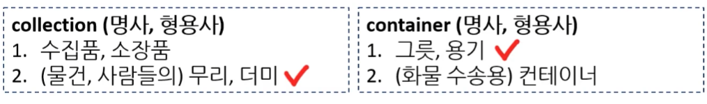


### 1.1. 배열 vs 컬렉션

* 배열은 크기가 고정이다. 

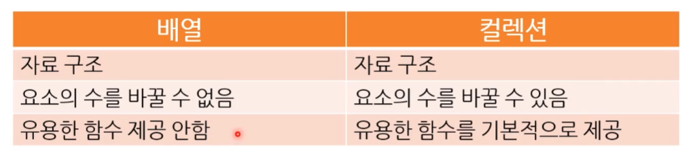


### 1.2. 컬렉션 종류

* 단순한 컬렉션 : 길이가 바뀔 수 있는 배열 ( 가변 길이 배열 )
* 복잡한 컬렉션 : 자유로운 길이 + 다양한 요소 접근 방법
  * 조금 복잡한 거다.

 


#### 1) 컬렉션 결정 시 고려 사항

컬렉션은 용도에 따라 다양하게 고려할게 있다.

어떤 컬렉션을 이용하느냐에 따라 메모리 사용량, 성능이 달라지니 잘 고려한 후 결정해야 한다. ( 다른 과목에서 배울 예정이다. )

1. **색인 ( index )의 종류**

   색인이 숫자를 사용하는 경우도 있고 key 값으로 접근 할 수도 있다.

   * 정형화 된 색인 : 배열에서 본 그 방식이다. ( 0, 1, 2, 3, 4 ... )
   * 임의의 key 값 : 어떤 자료형이든 기능하나 정형화 된 색인은 아닌 것 
     ( "사과", "이름", "달리다"와 같은 문자열 )

2. **데이터 접근 패턴**

   * 처음부터 끝까지 컬렉션 데이터를 순회할 것인가?
   * 컬렉션의 중간에 데이터를 자주 넣고 빼는가?


#### 2) 컬렉션 종류

[ 자주 사용하는 컬렉션 ]

1. List
2. Dictionary
3. HashSet


[ 그 밖의 컬렉션 ]

1. Statck
2. Queue
3. LinkedList

* 그 외 : 멀티 쓰레드 환경에도 안전한 컬렉션들도 있다.
  * 궁금하면 System.Collections.Concurrent 네임스페이스를 볼 것

> ---
>
> [ 참고 ]
>
> * Stack, Queue의 경우 알고리즘 들어가면서 많이 쓰게 된다.
>
> * 알고리듬 과목을 비롯한 기타 과목에서 더 자세히 배울 예정
>
> ---


## 2. 리스트 ( List )

* 배열과 거의 비슷하며 좀 더 사용하기 편한 배열로 볼 수 있다.
* 색인 (0부터 n)을 통해 데이터 접근
* [사용 이유] 배열의 길이 ( 담을 수 있는 최대 요소 수 )를 언제든 바꿀 수 있다.


**[ 배스트 프랙티스 : 언제 사용하면 좋을까? ]**

* 배열 사용하는 곳에는 다 사용하기 좋다.
  * 배열보다 리스트를 많이 쓴다.

* (TIP) 리스트는 처음부터 총용량을 정해 가는 편이 좋다.
  * 성능상 이점이 있다.


### 2.1. 생성, 삽입

#### 1) 생성

```csharp
List<int> scores = new List<int>();
List<string> names = new List<string>();
```

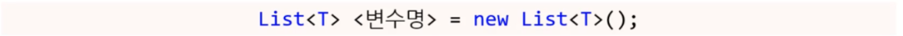

* 리스트를 생성하는 코드
* 리스트의 길이는 0

> ---
>
> **\< T >**
>
> * 어떤 자료형을 담을지를 표현한다.
> * 제네릭(generic) 프로그래밍의 일부
> * C++에서 템플릿 프로그래밍이라고도 함
> * 나중에 따로 공부하기
>
> ---


**[ 총용량 ]**

```csharp
List<int> scores = new List<int>(3);
List<string> names = new List<string>(6);
```

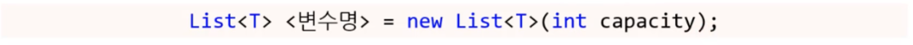

* 총용량이 capacity인 리스트를 생성하는 코드
* 다른 오버로드 함수가 있다. ( 직접 찾아볼 것 )

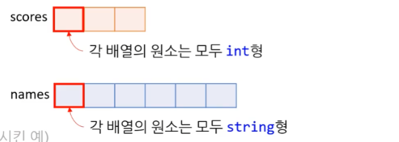


**[ 초기화 ]**

* 배열처럼 초기화 가능하다.

```csharp
List<int> scores = new List<int>(3) { 30, 5, 40 };   
Console.WriteLine(scores[2]);
```

```
40
```


#### 2) 데이터 추가 - Add()

```csharp
List<int> scores = new List<int>(3);

scores.Add(10);
scores.Add(30);
```

```csharp
List<int> names = new List<string>(5);

names.Add("Bobe");
names.Add("Kope");
```

* `Add(T data)` : 자료형 T의 데이터를 리스트에 넣기

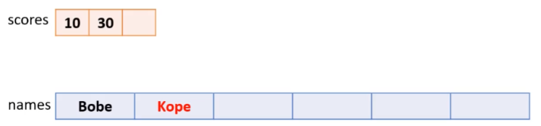


#### 3) 데이터 여러 개 추가 - AddRange()

```csharp
int[] dummy = { 10, 20 };

List<int> scores = new List<int>(3);
scores.AddRange(dummy);
```

```csharp
List<string> names = new List<string>(5);
names.Add("Bobe");
names.Add("Kope");

List<string> names1 = new List<string>();
names1.AddRange(names);
```

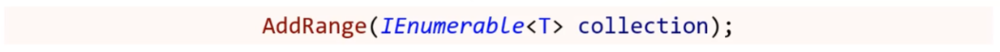

* 여러 개의 데이터를 리스트에 넣기
  * `IEnumeralbe< T >`이 뭔지는 아직 몰라도 된다.
  * 배열([])이나 `List<T>`가 매개변수가 되는 것만 기억하자.


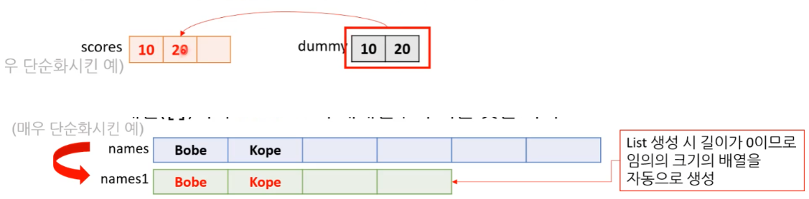


#### 4) 데이터 중간 삽입 - Insert()

```csharp
List<int> scores = new List<int>(3);		// { 30, 40 }
scores.Insert(2, 10);

List<string> names = new List<string>(5);	// { "Bobe", "Kope" }
names.Insert(1, "Pope");
```

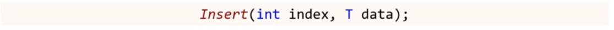

* 리스트의 index 번째에 data를 넣기

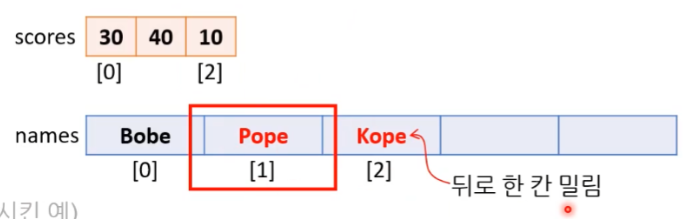


### 2.2. 확인, 색인, 길이

#### 1) 데이터 확인 - Contains()

```csharp
List<int> scores = new List<int> (3);		// { 10, 30 }
bool bResult1 = scores.Contains(40);		// false
bool bResult2 = scores.Contains(30);		// true

List<string> names = new List<string>(5);	// { "Bobe", "Kope" }
bool bResult1 = names.Contains("bobe");		// false (대소문자 구분)
bool bResult2 = names.Contains("Bobe");		// true
```

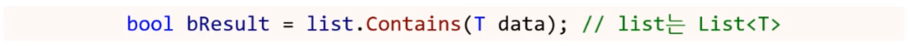

* 해당 데이터가 있으면 참, 아니면 거짓을 반환

* 대소문자 구분한다.


#### 2) 데이터 색인 반환 - IndexOf / LastIndexOf()

* 대소문자 구분한다.
* 없다면 -1을 반환
* 다양한 오버로드 함수가 있음 ( 직접 찾아볼 것 )
  * 다양한 오버로드 함수가 있지만 사실상 위의 예시 외에는 잘 안쓰인다. 


##### **(1) 처음** - IndexOf()

```csharp
List<int> scores = new List<int>(3);		// { 30, 30 }
int index1 = scores.IndexOf(40);			// -1
int index2 = scores.IndexOf(30);			// 0

List<string> names = new List<string>(5);	// { "Bobe", "Kope" }
int index1 = names.IndexOf("bobe");			// -1 ( 대소문자 구분 )
int index2 = names.IndexOf("Bobe");			// 0
```

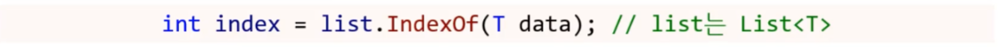

* 해당 데이터가 '처음'으로 나타난 위치의 색인을 반환
* 


##### **(2) 마지막 - LastIndexOf()**

```csharp
List<int> scores = new List<int>(3);			// { 30, 30 }
int index1 = scores.LastIndexOf(40);			// -1
int index2 = scores.LastIndexOf(30);			// 1

List<string> names = new List<string>(5);		// { "Bobe", "Kope" }
int index1 = names.LastIndexOf("bobe");			// -1 ( 대소문자 구분 )
int index2 = names.LastIndexOf("Bobe");			// 0
```

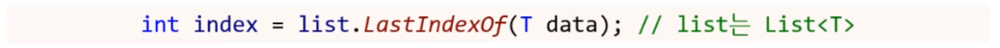

* 해당 데이터가 '마지막'으로 나타난 위치의 색인을 반환


#### 3) 총용량과 길이 - Capacity / Count

```csharp
List<int> scores = new List<int>(3);						// { 30, 40 }
Console.WriteLine($"{scores.Capacity}, {scores.Count}");	// "3, 2"

List<string> names = new List<string>(5);					// { "Bobe", "Kope", "Pope" }
Console.WriteLine($"{names.Capacity}, {names.Count}");		// "5, 3"
```

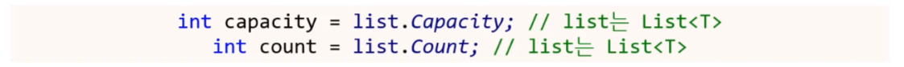

* `List<T>`의 현재 총용량(capacity)과 사용량(count)을 알려준다.

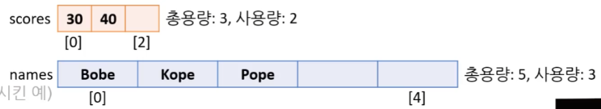


#### 4) 잘못된 색인 : 런타임 에러 발생

* **[중요] 런타임 에러 발생!**

```cs
List<int> scores = new List<int>(3);	// { 30, 30 }
scores.Insert(10, 10);
```

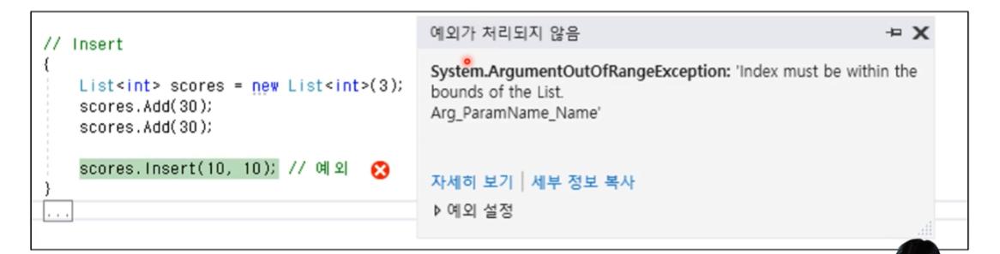


**해결법**

* 예외처리 보다  '조건문'과 '길이' 등을 활용해서 사용하는 게 좋다.


### 2.3. 접근, 변환

#### 1) 요소 접근하기 - []

```csharp
List<int> scores = new List<int>(3);	// { 10, 30 }
scores[2] = 100;						// 프로그램 실행하면 예외 발생 : 런타임 에러
int myScore = scores[0];				// myScore: 10
scores[0] = 100;						// { 100, 30 }
```

* **`T data = list[index];`** : 값 얻어오기 ( list는 List<T>, index는 정수형 )
* **`list[index] = <T형 데이터>`**; : 값 대입하기 ( list는 List<T>, index는 정수형 )
  * 리스트의 index 번째 요소에 접근


#### 2) 요소 전체 순차적으로 접근하기 - for문

```csharp
List<string> names = new List<string>(5);	// { "Bobe", "Kope", "Pope" }

for (int i = 0; i < names.Count; ++i)
{
	Console.WriteLine($"Name: {names[i]}");
}
```

* 반복문으로 이용해 순차적으로 접근 가능하다.

* 순차적 접근한다, 순회 한다, 훑는다.
* [주의!] For문 안에서 List를 중간에 제거하거나 추가할 경우 names.Count의 값이 바뀔 수 있다.


#### 3) 배열로 변환하기 - ToArray()

* 배열로 일일히 넣어도 되지만 간편한 함수가 따로 있다.

```csharp
List<string> names = new List<string>(5);	// { "Bobe", "Kope", "Pope" }
...

string[] nameArray = names.ToArray();
```

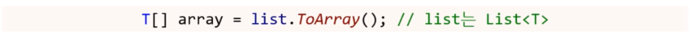

* `List<T>`에서 순수한 `배열 T[]`로 변환하는 함수
  * `List<int>`는 `int[]`로, `List<float>`는 `float[]`로...


### 2.4. 삭제

#### 1) 요소 삭제 - Remove()

```csharp
List<int> scores = new List<int>(3);			// { 10, 30, 40 }
bool bSuccess1 = scores.Remove(10);				// 참
bool bSuccess2 = scores.Remove(100);			// 거짓

List<string> names = new List<string>(5);		// { "Bobe", "Kope", "Pope" }
bool bSuccess1 = scores.Remove("Pope");			// 참
bool bSuccess1 = scores.Remove("Tobe");			// 거짓
```


* data가 있으면 삭제하고, 참 반환
* data가 없으면 거짓을 반환

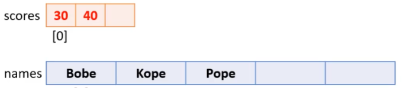


#### 2) 요소 삭제2 - RemoveAt()

```csharp
public void RemoveAt (int index);
```

List<T>의 지정된 인덱스에 있는 요소를 제거합니다.


#### 3) List\<T\>의 모든 요소를 지우기

```cs
List<string> names = new List<string>(5);		// { "Bobe", "Kope", "Pope" }

names.Clear();
```

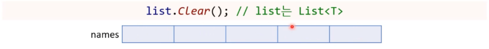

* `List <T>`의 요소를 모두 지우는 함수

  * [주의!] 요소를 지우는 거지, 총용량을 바꾸는 것은 아니다.

    ( Capacity 용량은 변함 없음! )


## 3. 딕셔너리 ( Dictionary )

* 색인(index) 대신 키(key)와 값(value)을 사용한다.
  * 키(key) : 임의의 데이터 형 - 배열의 색인처럼 키가 동일하면 같은 값을 가리킨다.
  * 값(value) : 실제 저장되는 값
* 실제로 우리가 사용하는 사전과 비슷하다.

---

* 비연속 데이터 : 내부 데이터 저장은 배열처럼 연속된 메모리에 할 수 없다.
  * 배열과 비교하면 배열이 더 효율적이다.

---

* 다른 언어에서는 딕셔너리 대신 맵(map)이라고 하기도 한다.

  * 1:1로 매핑 된다고 해서 map라고 하는 경우도 많다.

  * 가장 많이 쓰는 Map 구현하는 방식 중에 HashMap이 있다.
    * (나중에) HashMap 구현 방법 정도는 알아야 한다.

---

* [참고] 리스트, 배열 다음으로 많이 쓰이는 컬렉션이다.

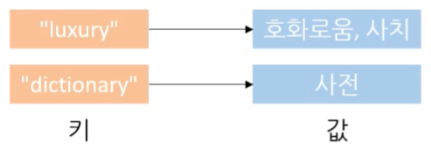

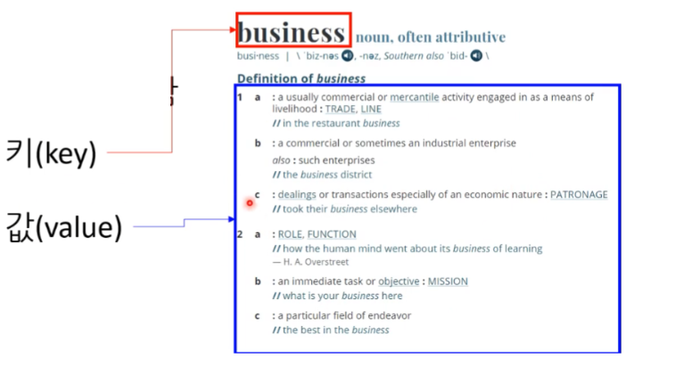


**[ 배스트 프랙티스 : 딕셔너리를 언제 사용하면 좋을까? ]** 

배열 처럼 연속적으로 색인을 저장하기 어려운 경우이다. ( 0, 1, 2, 3 ... )

* **숫자가 커서 배열 색인을 쓰기 힘든 경우**
  * (ex) 학번
  * 10~20번까지 도 배열 사용하는데 어려움이 없다.

* **배열 중간에 데이터를 삽입 및 삭제를 자주 해야 할 경우**
  * 배열은 중간 데이터를 삽입하면 난리가 나기 때문에 딕셔너리가 더 유리하다.
    * 연속적인 데이터가 아니기 때문에 삽입시 배열처럼 큰 문제가 발생하지 않는다.
  * 순서대로 나가지 않고 중간에 비어있고 그런 경우에 사용하는 경우가 좋다.


### 3.1. 생성, 삽입

#### 1) 생성 

```csharp
Dictionary<int, string> students = new Dictionary<int, string>();
Dictionary<int, int> scores = new Dictionary<int, int>();
```

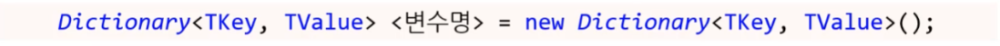

* **`< TKey >`** : 어떤 자료형의 키를 담을지 표현한다.

* **`< TValue >`** : 어떤 자료형의 값를 담을지 표현한다.

  


#### 2) 데이터 추가 - Add()

```csharp
Dictionary<string, string> students = new Dictionary<string, string>();
students.Add("A10000000", "Teemo");	// (학번, 학생 이름)
students.Add("A10000001", "Leon");
```

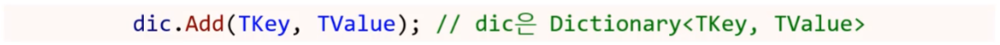

* 키와 매핑되는 값을 딕셔너리에 추가
* [**주의**!] 아래 그림은 정확히 맞는 그림은 아니다. 
  * 딕셔너리는 배열 처럼 연속된 데이터가 아니다. 
  * 쉽게 설명하기 위해 표현한 것일 뿐이다.

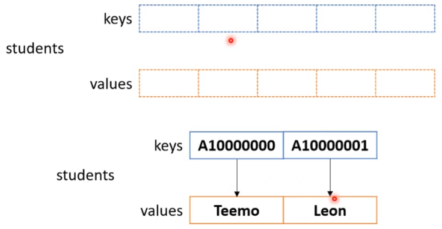


**[ 중복 된 키에 데이터 추가 : 런타임 에러 ]**

```csharp
Dictionary<string, string> students = new Dictionary<string, string>();
students.Add("A10000000", "Teemo"); 	// (학번, 학생 이름)
students.Add("A10000001", "Leon");
students.Add("A10000001", "Lulu");		// 런타임 에러 : 예외발생
```

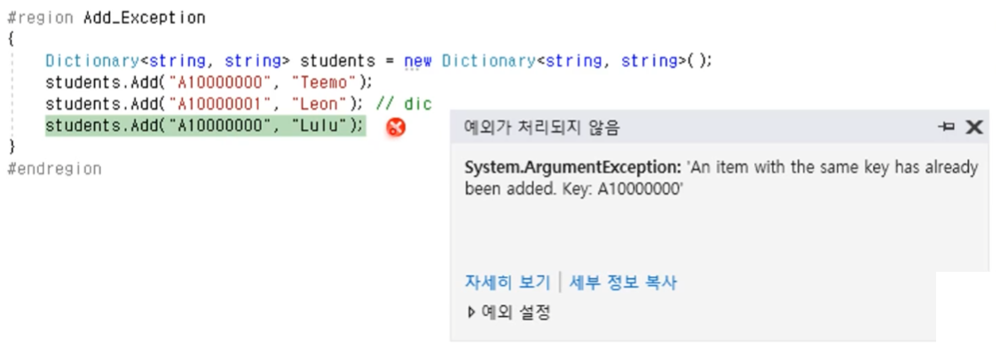


#### 3) (중복 된 키를 확인 후) 데이터 추가 - TryAdd()

```csharp
Dictionary<string, string> students = new Dictionary<string, string>();
// { ("A10000000", "Teemo"), ("A10000001", "Leon") }

bool bScuccess1 = students.TryAdd("A10000000", "Lulu");		// 거짓
bool bScuccess2 = students.TryAdd("A10000002", "Lulu");		// 참
```

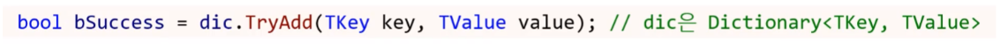

* Key 존재 ( O ) : 새로운 값 넣고, 참 반환
* Key 존재 ( X ) : 거짓 반환

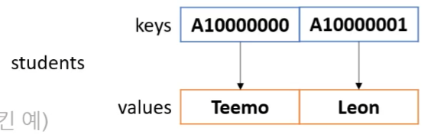


### 3.2. 확인

#### 1) Key 확인 - ContainsKey()

```csharp
Dictionary<string, string> students = new Dictionary<string, string>();
// { ("A10000000", "Teemo"), ("A10000001", "Leon") }

bool bContain1 = students.ContainsKey("A10000000");		// 참
bool bContain2 = students.ContainsKey("Leon");			// 거짓
```

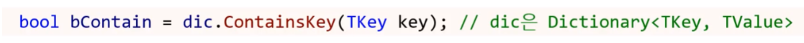

* key가 키로 있으면 참, 없으면 거짓


#### 2) Value 확인 - ContainsValue()

```csharp
Dictionary<string, string> students = new Dictionary<string, string>();
// { ("A10000000", "Teemo"), ("A10000001", "Leon") }

bool bContain1 = students.ContainsValue("A10000000");		// 거짓
bool bContain2 = students.ContainsValue("Leon");			// 참
```

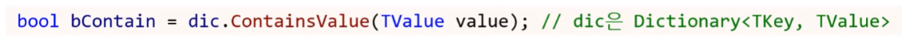

* value가 값으로 있으면 참, 없으면 거짓


### 3.3. 접근, 가져오기

#### 1) Key로 매핑된 Value 가져오기 - TryGetValue()

```csharp
Dictionary<string, string> students = new Dictionary<string, string>();
// { ("A10000000", "Teemo"), ("A10000001", "Leon") }

string value;
bool bFound = students.TryGetValue("A10000000", out value);
// bFound : 참, value : "Teemo"
```

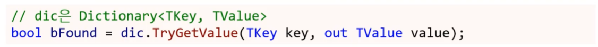

* key 존재 ( O ) : 키로 있으면 값을 out 매개변수에 대입하고 참으로 반환
* key 존재 ( X ) : 키로 없으면 값을 out 매개변수에 대입 없이 거짓으로만 반환


#### 2) 요소 접근 / 추가 / 변경 - []

```csharp
Dictionary<string, string> students = new Dictionary<string, string>();
// { ("A10000000", "Teemo"), ("A10000001", "Leon") }

students["A10000000"] = "Lulu";
// string student = students["A10000002"]; 		// throws an exception
students["A10000002"] = "Teemo";
```

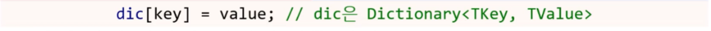

* 키 존재 ( O ) : 연결된 값을 변경
* 키 존재 ( X ) : 키와 값을 새로운 원소로 추가
  * [주의!] 키가 없는데 접근만 한다면 : **예외 발생 - 런타임 에러**

---

* [주의!] 읽어 올 때는 값이 있는지 없는 지 100% 확신이 없다면 이 방식을 잘 쓰지는 않는다.
* 덮어쓰기 하고 싶을 때는 이렇게 많이 쓰인다.
* TryGetValue나 ContainsKey를 활용해 []에 접근하는 방식을 쓴다.
  * 이 둘 중 ContainsKey를 활용해 []에 접근하는 방식을 더 많이 쓴다.

---

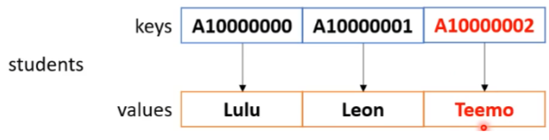


### 3.4. 삭제

#### 1) 특정 요소 삭제 - Remove()

```csharp
Dictionary<string, string> students = new Dictionary<string, string>();
// { {"A10000000", "Teemo"}, {"A10000001", "Leon"} }

bool bRemove1 = students.Remove("A10000000");	// 참
bool bRemove1 = students.Remove("Temmo");		// 거짓
```

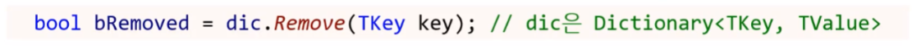

* key 존재 ( O ) : 요소를 삭제 후, 참 반환
* key 존재 ( X ) : 요소를 그냥 두고, 거짓 반환 ( 예외 발생 X )
  * Remove("Leon")을 넣었더라면 키가 아니라 값이기 때문에 삭제하지 않는다.
  * 삭제 한 부분 접근할 경우 : 런타임 에러 발생

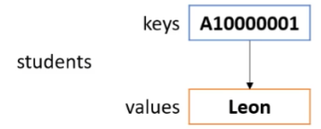


#### 2) 모든 요소 삭제 - Clear()

```csharp
Dictionary<string, string> students = new Dictionary<string, string>();
// { ("A10000000", "Teemo"), ("A10000001", "Leon") }

students.Clear();
```

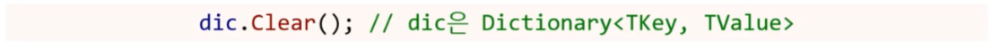

* 딕셔너리의 모든 요소를 삭제 

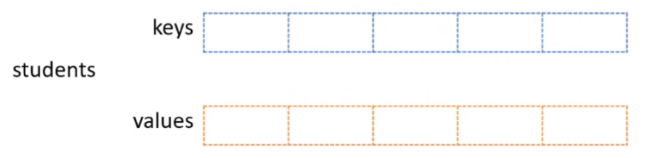


## 4. 해시 셋 ( HashSet )

집합의 set

* 중복된 값 찾는 것은 '해시 셋'을 쓰는게 낫다.
* 딕셔너리와 매우 비슷하다.
  * [현실] 리스트와 딕셔너리를 쓰는 경우가 거의 90%
  * 나머지는 정말 특별할 때만 쓴다.

* '해시 셋'은 딕셔너리랑 비슷해서 쉽다. 
* 차이점은 '해시 셋'은 중복이 안된다  
  * 키만 있다고도, 값만 있다고 표현할 수도 있다. ( 관점의 차이 )
  * 키 든 값이든 상관 없이 중복이 안된다고 생각하면 된다. ( 관점의 차이 )


**[ 배스트 프랙티스 : 언제 사용하면 좋을까요? ]**

* **중복 데이터를 삭제할 때**
  * 수학의 집합
  * 똑같은 데이터를 Add() 하면 아무 일도 일어나지 않는다.


#### 1) 생성

```csharp
HashSet<int> studentIDs = new HashSet<int>();
HashSet<string> studentNames = new HashSet<string>();
```


#### 2) 요소 추가 - Add()

```csharp
HashSet<int> studentIDs = new HashSet<int>();
bool bSuccess1 = studentIDs.Add(201900002);     // 참
bool bSuccess2 = studentIDs.Add(201900001);     // 참
bool bSuccess3 = studentIDs.Add(201900002);     // 거짓
```

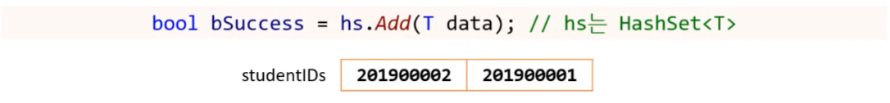

* 키 존재 ( X ) : 새 요소로 추가한 후 참을 반환
* 키 존재 ( O ) : 거짓만 반환


#### 3) 요소 확인 - Contains()

```csharp
HashSet<int> studentIDs = new HashSet<int>();	// { 201900002, 201900001 }
bool bSuccess1 = studentIDs.Contains(0);     
bool bSuccess2 = studentIDs.Contains(201900001);    
```

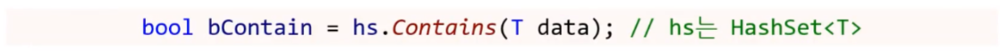

* 키 존재 ( O ) : 참을 반환
* 키 존재 ( X ) : 거짓을 반환


#### 4) 요소 삭제 - Remove()

```csharp
HashSet<int> studentIDs = new HashSet<int>();	// { 201900002, 201900001 }
bool bSuccess1 = studentIDs.Remove(0);     		// 거짓
bool bSuccess2 = studentIDs.Remove(201900002);	// 참
```

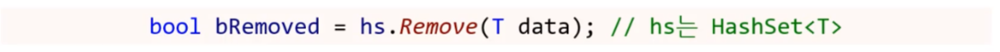

* 키 존재 ( O ) : 요소를 삭제 후, 참을 반환
* 키 존재 ( X ) : 거짓을 반환


#### 5) 모든 요소 삭제 - Clear();

```csharp
HashSet<int> studentIDs = new HashSet<int>();	// { 201900002, 201900001 }
studentIDs.Clear();
```


* '해시 셋'의 모든 요소를 삭제


#### 6) 요소 가져오기 - TryGetValue()

```csharp
HashSet<int> studentIDs = new HashSet<int>();	// { 201900002, 201900001 }
int id;
bool bSuccess = studentIDs.TryGetValue(201900001, out id);
// bSuccess: 참, id: 201900001
```

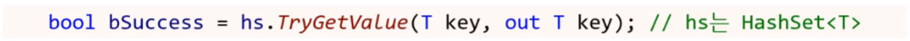

* 키 존재 ( O ) : out 매개변수 대입, 참으로 반환
* 키 존재 ( X ) : 거짓으로만 반환


## 5. var과 foreach 활용

컬렉션과 같이 쓰면 유용한 것들 이다.


### 5.1. foreach

C#에서 유용하게 사용할 수 있는 기능이다.


#### 1) for과 컬렉션 - 순차적 요소 탐색

리스트만 for문으로 순차적 검사를 할 수 있다.

나머지 컬랙션으로는 불가능하다.


**[ 리스트 ] **

```csharp
List<string> names = new List<string>(5);	// { "Bobe", "Kope, "Pope" }

for (int i = 0; i < names.Count; ++i)
{
	Console.WriteLine($"Nmae: {names[i]}");
}
```

※ [주의!] For문 안에서 List를 중간에 제거하거나 추가할 경우 names.Count의 값이 바뀔 수 있다.


**[ 딕셔너리 ]**

* 순수하게 딕셔너리가 지원하는 함수로는 불가능


**[ 해시셋 ]**

* 순수하게 딕셔너리가 지원하는 함수로는 불가능


#### 2) foreach와 컬렉션 - 순차적 요소 탐색

for문의 한계를 해소할 수 있는 방법이다.


##### (1) 리스트

```csharp
List<string> names = new List<string>(5);	// { "Bobe", "Kope, "Pope" }

foreach (string name in names) 
{
	Console.WriteLine(name);
}
```

```csharp
foreach (T <변수명> in list)	// list는 List<T>
{
	..
}
```

* 처음부터 끝까지 훑어볼 수 이다.
* **foreach** 문 안의 **T**는 리스트 선언할 때 사용한 자료형
* **<변수명>**은 **foreach 문** 범위에서만 사용된다.


##### (2) 딕셔너리

```csharp
Dictionary<string, string> students = new Dictionary<string, string>();
// { ("A10000000", "Teemo"), ("A10000001", "Leon") }

foreach (KeyValuePair<string, string> score in students)
{
	Console.WriteLine($"Key: {score.Key}, Value: {score.Value}");
}
```

```csharp
foreach (KeyValuePair<TKey, TValue> <변수명> in dic)	// dic은 Dictionary<TKey, TValue>
{
    ...
}
```

* **`KeyValuePair<TKey, TValue>`** 의 **TKey**와 **TValue**는 각각 딕셔너리를 선언할 때 사용한 키와 값의 자료형
* **<변수명>**은 **foreach 문** 범위에서만 사용된다.


##### (3) 해시셋

```csharp
HashSet<int> studentIDs = new HashSet<int>();	// { 201900002, 201900001 }
foreach (int studentID in studentIDs)
{
	Console.WriteLine(studentID);
}
```

```csharp
foreach (T <변수명> in hs)		// hs는 HashSet<T>
{
	..
}
```

* **foreach**문 안의 **T**는 해시셋 선언할 때 사용하는 자료형

* **<변수명>**은 **foreach 문** 범위에서만 사용된다.


##### (4) 배열 ( [ ] )

```csharp
float[] scores = { 30.5f, 41.0f, 53.2f, 66.6f, 70.9f };
foreach (float score in scores)
{
	Console.WriteLine(score);
}
```

```csharp
foreach (T <변수명> in arr)	// arr는 T[]
{
	...
}
```


#### 2) foreach 문의 한계

1. 요소의 값을 바꿀 수 없다.

   * `foreach(int name in names)` 라면 `name`에 값을 복사 한다는 느낌이다.
     * 원본을 바꾸는 것이 불가능하다.

   * 읽을 때는 좋으나, 쓸 때는 힘들다.

   ```csharp
   List<int> scores = new List<int>(4096);	// { 10, 20, 30 }
   
   foreach (int score in scores)
   {
   	score += 10;	// 컴파일 오류
   }
   ```

   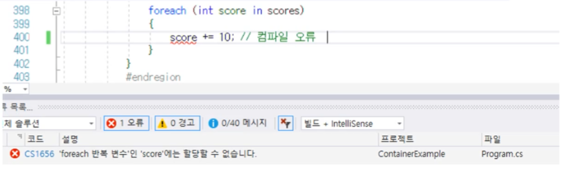


2. 현재 요소의 색인을 알기 어렵다.

   * 알려면 별도의 변수를 foreach 문 밖에서 선언 한 후 사용해야 한다.

   ```csharp
   List<int> scores = new List<int>(4096);	// { 10, 20, 30 }
   
   int index = 0;
   foreach (int score in scores)
   {
   	++index;
   	Console.WriteLine(score);
   }
   ```

   

3. 컬렉션이나 배열을 거꾸로 탐색할 수 없다.

   ```csharp
   List<int> names = new List<int>(4096);	// { "Bobe", "Kope", "Pope" }
   
   foreach (int name in names)
   {
   	Console.WriteLine(name);
   }
   ```

   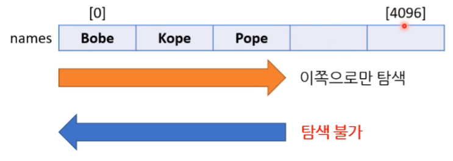


### 5.2. var

데이터 타입이다. 


#### 1) var 키워드

* 묵시적 자료형

  * 컴파일러가 알아서 추론해주는 자료형이다.
  * 묵시적으로 타입을 추론해 준다. ( var score = ... )

* 긴 자료형을 짧게 줄여준다. => 편의성

* 지역 변수에만 사용 가능하다.

* 반드시 선언과 동시에 대입해야 한다. (주의! 컴파일 오류)

  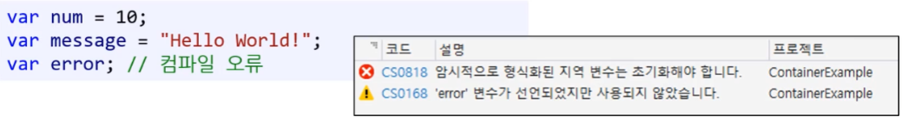

* ( C++에서는 auto라고 표현한다. )

* [주의!] JavaScript의 var와는 다르다. 

  * JavaScript - var : 동적인 데이터형
  * C# - var : 정적인 데이터형 ( 강한형 ) 
    * C#은 오른쪽의 값으로 추론한다.


#### 2) 딕셔너리 - foreach 문

딕셔너리를 좀 더 간편하게 사용할 수 있다.

* 딕셔너리 foreach 문의 문제점 해결

```csharp
Dictionary<string, string> students = new Dictionary<string, string>();
// { ("A10000000", "Teemo"), ("A10000001", "Leon") }

foreach (var student in students)
{
	Console.WriteLine($"Key: {student.Key}, Value: {studen.Value}");
}
```


#### 3) var : 코딩표준

* 자료형이 뭔지 바로 알 수 있을 때만 var 사용한다.
  * 대입하는 값을 통해 명백하게 자료형을 알 수 있을 때만 사용한다.

```csharp
var num = 10;					// 10 				<= 명백 ( O )
var message = "Hello World!";	// "Hello World"	<= 명백 ( O )
var weight = GetWeight();		// GetWeight()? 	<= 명백 ( X ) - 함수를 봐야 한다.
```

* foreach 문에서 사용하는 건 거의 언제나 좋다!

  ```csharp
  Dictionary<string, string> students = new Dictionary<string, string>();
  // { ("A10000000", "Teemo"), ("A10000001", "Leon") }
  
  // 원래는 KeyValuePair<string, string>
  foreach (var score in students)
  {
  	Console.WriteLine($"Key: {score.Key}, Value: {score.Value}");
  }
  ```

  