# 21 개체지향 프로그래밍 기초1

* 개체지향 프로그래밍(Object Oriented Programming) 기초


## 1. 클래스

### 1.1. 클래스 탄생 계기

#### 1) 절차적 언어의 아쉬운 점

1. 데이터의 비 인간화 - 데이터가 분리되어 있다.

2. 데이터가 많아지면 관리가 힘들어진다. => 실수할 여지가 증가한다.

---

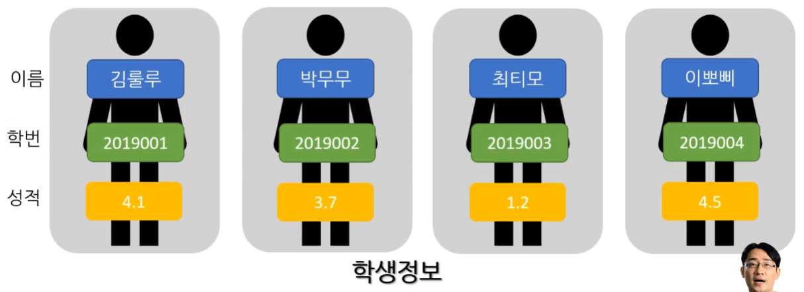

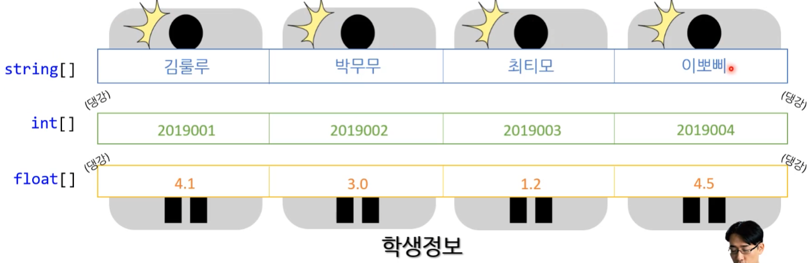

---

**[ 절차지향 실수 - 예시 ]**

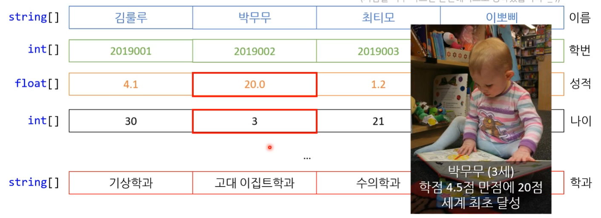

---


#### 2) 보완책1 : 구조체 

* 구조체는 언어 마다 초기화 해주는 방식이 다르다.

* 구조체(struct) : 데이터를 그룹으로 묶는 방법

  * 데이터 그룹을 하나의 '변수' 처럼 사용
  * 생성과 동시에 그룹 안의 모든 데이터가 초기화

* 기계가 이해하는 데이터 형태는 아니다.

  * 컴파일러가 자체적으로 순서대로 그룹 내의 변수를 선언한다고 생각하면 된다.
  * 컴파일러가 알아서 도움을 주는 형태라고 생각하면 편하다.

  ```cs
  // C언어 의사 코드
  
  struct Human
  {
  	int age;
  	float height
  };
  
  Human human;
  human.age = 10;
  human.height = 170.0f
  ```

  


**[ 구조체의 한계 ]**

* 여전히 데이터와 동작이 분리
  * 데이터는 해결 했지만 기능을 해결하지 못했다.

* 어떤 구조체가 어떤 함수량 연관 있는지 찾기 어려움 ( 복잡함 )

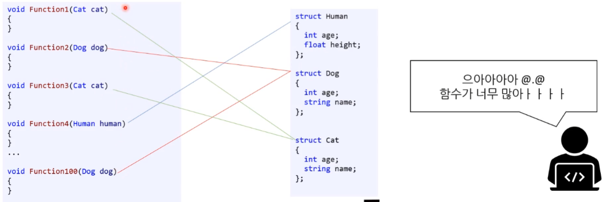


#### 3) 보완책2 : 개체 지향 

* 개체 지향 ( 함수까지 하나로 )

* 사람들은 세상을 물체(object)로 인지 => 직관적
* 물체는 상태와 동작이 한 곳에, 이것을 프로그래밍에서는 '개채'라 번역

---

* int 변수 : int는 정수를 담는 자료형, age 변수에 넣는 15는 정수형 데이터

  ```cs
  int age = 15;
  ```

---

* 사람 자료형 변수 : 사람도 **자료형**과 **데이터**(개체)가 필요!  - 클래스

  ```
  <사람을 나타내는 자료형> human = <데이터>;
  ```


### 1.2. 클래스 ( class )

* 클래스 : 커스텀하게 만드는 자료형
  * 사람은 내부적으로 여러 데이터를 가지고 있으니 그걸 정의하는 자료형을 만들어야 한다.
  * class : 계층, 계급 등
    * 게임에서 전사, 마법사, 성직자와 같은 직업군이라 생각하면 편하다.
      ( 게임에서는 이런 직업군에 따라 결정 되는 스탯과 스킬들이 있다. )


---


---


#### 1) 클래스 만들기 : Car 

* Car 형
* 우리가 '직접' 만드는 새로운 자료형!
* [생성 방법] 별도의 cs 파일을 만들어 클래스 생성

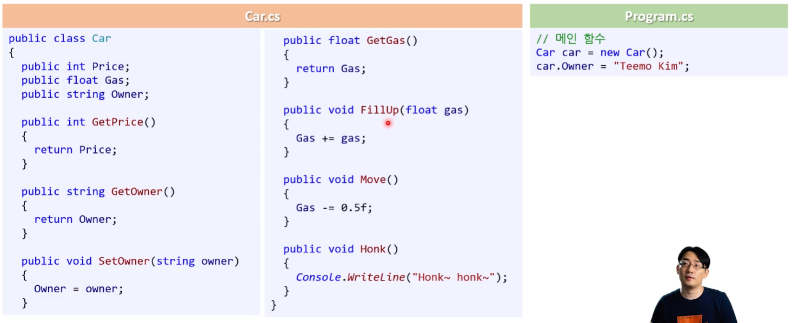


##### (1) 멤버 변수

* member variables

* **클래스 안**에서 선언한 변수
* **클래스 안**에서 자유롭게 사용가능
* 클래스의 구성원인 변수

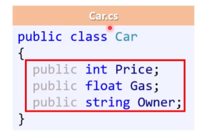


##### (2) 메서드 ( 멤버 함수 )

* 멤버 함수라고도 한다.
  * [참고] 클래스 안에 들어가 있는 것을 메서드라고 부르고, 밖에 나온 걸 함수라고 부르자고 한 시점이 있었다. 요즘은 그냥 다 섞어쓴다.

* 개체의 행위들
* **클래스 안**에서 선언한 함수
* **클래스 안**에서 자유롭게 사용 가능하다.
* 같은 클래스의 멤버 변수에 접근 가능

```cs
public class Car
{
	public float Gas;
	
	public void Move()
	{
		Gas -= 0.5f;
		
		Console.WriteLine($"Move!\n(Gas: {Gas}L left)");
	}
	
	public void Honk()
	{
		Console.WriteLine("Honk~ honk~");
	}
}
```


#### 2) 개체 생성 및 사용 

##### (1) 개체 생성

---

* 인스턴스 만든다.
* 인스턴스화 한다. ( 번역을 안하고 영어적 표현을 직역을 하면 인스턴스 )

---

* 클래스(내가 만든 데이터형)을 데이터 형 변수로 만들어서 사용할 수 있게 만든다.
* **<클래스 이름>** <변수명> = **new** <클래스 이름> ();
  * 새로운 **<클래스 이름>** 형의 데이터를 만든다.
  * 클래스로 정의된 형에 맞는 구체적인 데이터를 개체(object)라고 한다.
  * C#에서는 **new**를 통해서만 만들 수 있다.


```csharp
// 메인 함수
Car car = new Car();
```


##### (2) 개체의 멤버에 접근하기 

* 앞에서 보여준 'C언어 구조체 유사 코드'와 유사하다.

```cs
// C# 개체 멤버 사용

Car car = new Car();
car.Owner = "Teemo Kim";
car.Price = 20000;
car.Gas = 60.0f;
```

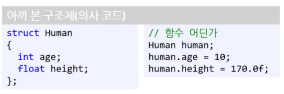


##### (3) 최종 코드 및 실행

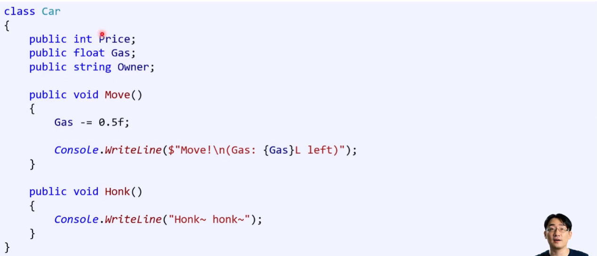

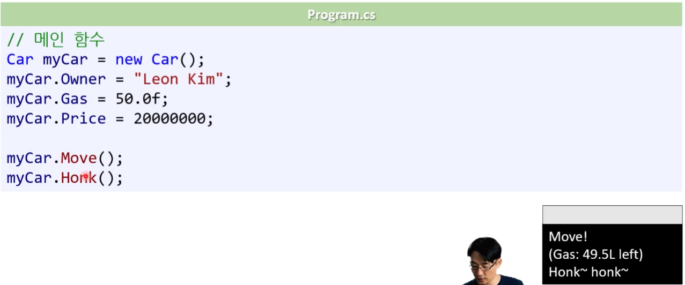


## 2. 생성자와 접근 제어자

* 좀 더 효율적이고, 안전한 OOP 사용법


### 2.1. 생성자

* 생성자 ( Constructor )

---

* **개체를 초기화** 하는 것이 목표이다.
* 개체가 생성 될 때 자동으로 호출되는 함수이다.
  * 초기 데이터 미입력으로 인해 생길 수 있는 문제를 미리 방지할 수 있다.

```cs
// Car.cs

public class Car
{
	public int Price;
	...
	
	public Car(int price)
	{	
		Price = price;
	}
	...
}
```

```cs
// Program.cs

// Main Fuction
Car car1 = new Car(2000000);	// OK
Car car1 = new Car(); 			// 컴파일 오류
```


**[주의!] 데이터 대입 누락**

```cs
// Main Function

Car car = new Car();
car.Gas = 50.0f;
```

* 개체 생성 후 깜빡하고 데이터를 대입 안 할 경우 예기치 못한 문제가 발생할 수 있다. 
  ( 실제로 유지보수 과정에서 문제가 발생하기도 한다. )
* 이걸 해결할 수 있는 것이 **생성자**다.


#### 1) 생성자

* 생성자 개체를 생성(new) 할 때 반드시 호출되는 함수

---

* **함수명과 클래스명이 같아야 한다.**
* **반환형을 적지 않는다.**
* 생성에 필요한 **매개변수를 강제할 수 있다.**
* **생성자 오버로딩** : 생성자를 여러 개 만들 수도 있다.

---

```csharp
public class Car
{
	public Car(int price)
	{
		Price = price;
	}
}
```

```csharp
public <클래스명>(<매개변수 리스트>)
{
}
```


#### 2) [주의!] 데이터 오입력 

* 모든 개체가 '동일한 값'을 가져야 하는 경우가 있을 수 있다. 
  * 생성자를 잘 사용해야 하는 이유이기도 하다. 

* 이걸 이용자(일반인, 프로그래머)가 제대로 입력 해줄 것이라 생각해서는 안된다. ( 실수 가능 )

```csharp
// Car.cs

public class Car
{
	public int Price;
	...
	
	public Car(int price)
	{
		Price = price;
	}
	...
}
```

```csharp
// Program.cs
// Main Fuction

Car car1 = new Car(5000000);
Car car2 = new Car(5000000);
Car car3 = new Car(500000);		// 데이터 오입력 - 중고차가 50만원에 팔려 버렸다!
```


##### (1) 방법 1 : 생성자 안에서 상수를 대입

* 매개변수가 비어있는 생성자에 상수를 바로 대입하는 코드 만든다.

* [참고] 만약 생성자가 전혀 없다면 `Car car1 = new Car();`사용 시 매개변수가 0으로 대입된다. ?? ( 멤버변수 아닌가? )
      ( `public Car()` 생성자가 자동으로 생성 되는 듯 하다. )

```cs
// Car.cs

public class Car
{
	public int Price;
	...
	
	public Car(int price) 
	{
		Price = 50000;	// 상수 대입
	}
	...
}
```

```cs
// Program.cs
// Main Fuction

Car car1 = new Car();
Car car2 = new Car();
Car car3 = new Car();
```


**[주의!] 생성자 오버로딩**

* 만약, `public Car(int Price)` 형태의 생성자만 있다면 `Car car1 = new Car()`형태로는 개체를 만들 수 없다. 
  * 컴퓨터가 자동으로 생성해 주던 `public Car()` 생성자는 `public Car(int Price)` 기입함으로 인해 `public Car()`를 자동으로 생성해 주는 의미가 사라지면서 누락시키는 듯 하다.

* `public Car()` 도 같이 사용하기 원한다면 `public Car(int Price)`형태 뿐만 아니라 매개변수가 없는 형태의 생성자도 `public Car()` 코드에 기입하여 생성자 오버로딩을 시켜줘야 한다.

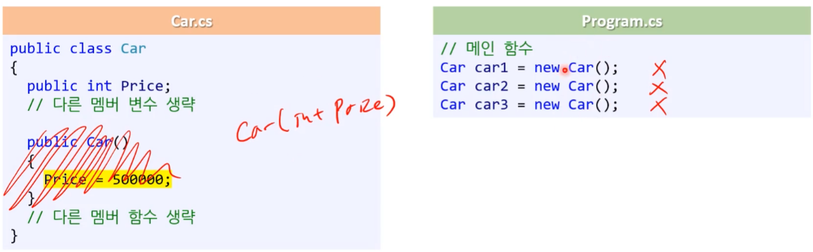


##### (2) 방법 2 : 개선 된 방법

* 멤버 변수 기입하기 : `public int Price = 50000;` 
  * 기본 생성자의 코드 블록에 굳이 `public int Price = 50000;` 처럼 표기하지 않아도 정상적으로 작동 한다.  
  * 기입시 코드를는 기본값으로 초기화 시키기 때문에 따로 

```cs
// Car.cs

public class Car
{
    public int Price = 50000;

    public Car()
    {}
    
    public Car(int price)
    {
        Price = price;  // ★
    }
}
```

```cs
// Program.cs
// Main Function

Car car1 = new Car();
Car car2 = new Car(30000); 

Console.WriteLine(car1.Price);
Console.WriteLine(car1.Price);
```

```
50000
30000
```


#### 3) 클래스를 멤버 변수로 사용 

* 멤버 변수로 다른 클래스형을 가질 수도 있다. 
* [참고] string도 클래스다. ( Owner가 개체가 된다. )

```csharp
// Car.cs

public class Car
{
	public int Price;
	public string Owner
	...
	
	public Car(string owner)
	{
		Owner = owner;	// ★
	}
	...
}
```


**[ 멤버 변수와 지역 변수의 초기화 ]**

* **멤버 변수** : 초기화 생략 가능하다. 기본값이 들어간다. ( 멤버변수 대입 안해줘도 갖는 값이다. )

* 지역 변수(함수 안의 변수) : 초기화를 생략하면 컴파일러 오류가 날 수 있다. 
  * [참고] 대분분의 언어들이 위의 방식으로 동작하며, 개체를 만들게 되면 멤버변수를 자동으로 초기화 시켜준다. 


---

* **초기화 값**
* 값 형의 기본값 : 0, 0.0f

* 참조 형의 기본값 : null ( 0에 준한다. )

---

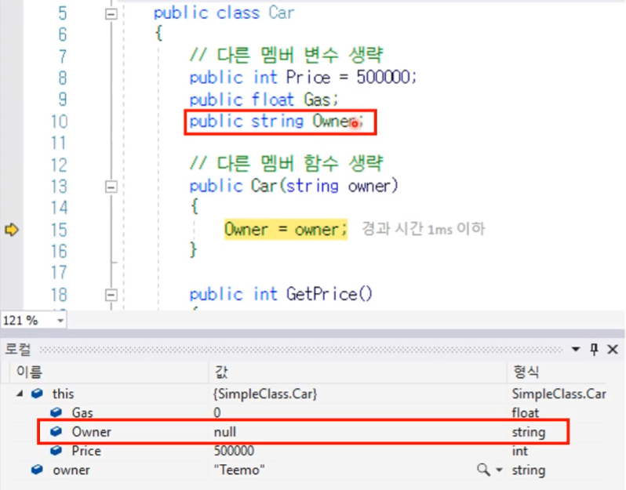


### 2.2. 접근 제어자

* **접근 제어자 ( Access Modifier )**

---

**[주의!] 외부에서 접근하여 값 변경** 

* 바뀌어서는 안되는 멤버 변수의 값을 변경하는 경우가 발생한다.

---

* 접근 제어자 - 키워드
  * public
  * private ( 함수 : 기본값 )
  * protected  ( 나중에 공부 )
  * internal ( 나중에 공부 ) ( 클래스 : 기본값 )


#### 1) public 

* 클래스 내에서 밖에서 모두 접근 가능
  * 클래스 안에서 : 접근가능
  * 클래스 밖에서 : 접근가능

* 변수, 함수 모두 public 가능

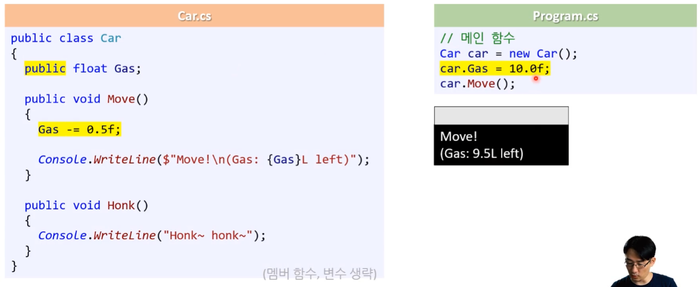


#### 2) private

* 클래스 안에서만 접근 가능
  * 클래스 안 : 접근 가능
  * 클래스 밖 : 접근 불가능 => <u>컴파일 오류</u>
* 변수, 함수 모두 private 가능
* 외부에서 private 변수의 값을 바꾸려면 public 함수가 필요하다.

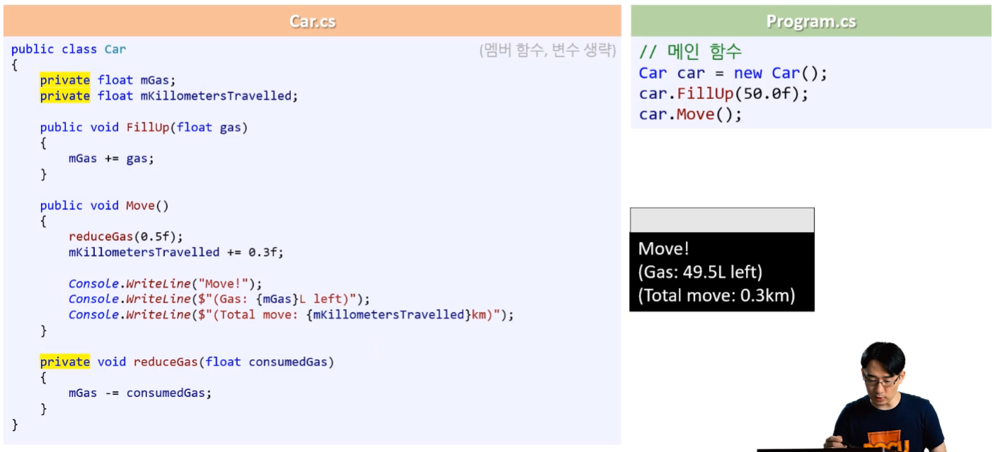


> ---
>
> [ 포프 질의응답 ]
>
> 질문
> 클래스 앞에도 접근제어자를 붙이던데  클래스 앞에 접근제어자를 붙이면 어떤점이 달라지나요?
>
> 답변
> 지금 아셔야할 건 아닌데 일단 이걸 잘 설명해둔 웹 문서 링크를 걸어드리겠습니다. 
>
> https://www.csharpstudy.com/CSharp/CSharp-access-modifier.aspx 
>
> 추가 설명을 하자면  .cs 파일들을 어셈블리 하나로 합쳐서 .dll 파일 하나만 나올수도 있고 여러개로 갈라서 여러개의 .dll이 나올 수도 있습니다. 그럴 경우 같은 dll 안에 있는 클래스끼리만 접근이 가능하게 할지 아니면 .dll파일이 다른 클래스끼리도 접근이 가능하게 할지를 결정하는 겁니다.
>
> ---


## 3. 프로퍼티

### 3.1. 문제 발생

* 문제 1 : 데이터에 접근 할 수 없다. ( 컴파일 에러 ) 
  * private라 클래스 밖에서 접근 불가 
  * public으로 변경하다면 또 다른 문제가 발생
  * (예제) 연료량을 알 수 없다.
* 문제 2 : 데이터 변경 문제 ( 조건 사용 불가 )
  * 최저가 조건문을 사용하고 싶지만 public으로 하면 최저가 보다 낮은 가격이 들어 올 수 있다. 
  * (예제) 판매가 변경 시 조건을 걸기 어려움 


**(예제) 연료량을 알 수 없다.**

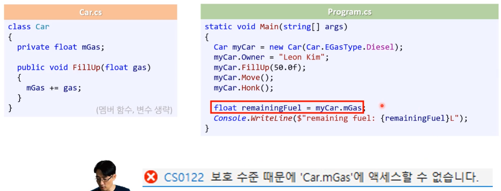


**(예제) 판매가 변경 시 조건을 걸기 어려움** 

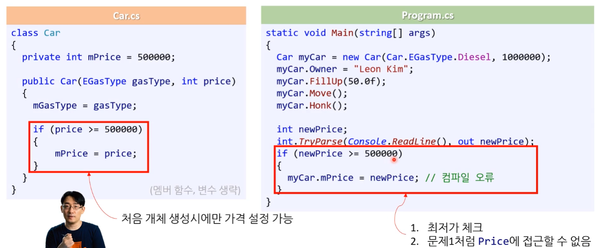


### 3.2. 해결법1 : getter/setter 함수

* 다른 언어에서도 많이 쓰이는 방식이다.
* 멤버 변수로 직접 접근하지 않고 함수를 이용해서 접근하는 방식이다.
  * 앞에 이름에 get 혹은 set을 사용한다.

---

* getter 함수 : 값 반환
  * 순수하게 값을 반환 목적이기 때문에 값 변경이 없어야 한다.

* setter 함수 : 값 변경
  * 값을 바꾸는 것 ( 조건문이 넣을 수도 있다. )
  * 순수하게 값을 변경(대입)시켜 주는 것이기 목적이기 때문에 반환 값이 없어야 한다.


---

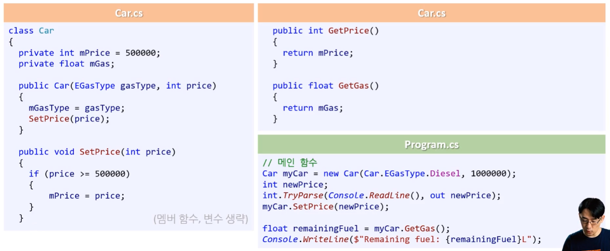

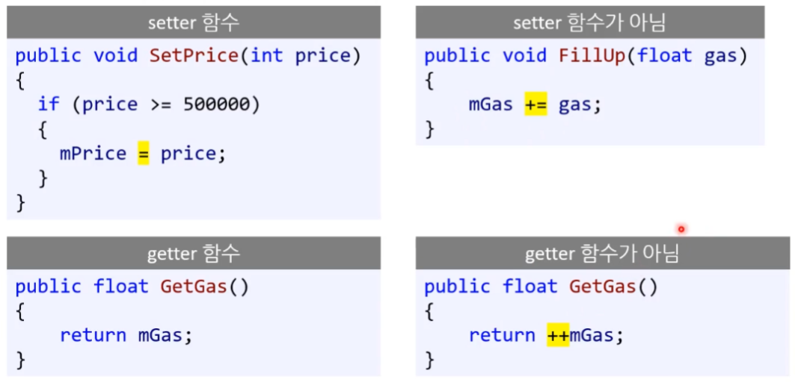


**[ 언어별 해결법 ]**

---

* getter / setter보다 더 개선된 방법을 찾을 수 없을까?

---

* 의문 제시

  * 대입과 접근 까지 함수로 만들어야 되냐는 의견이 있었다. 

  * 데이터를 가져오는 것 처럼 바꾸고 싶다는 의견이 있었다.

* 해결법

  * C : 데이터에 그냥 접근
  * JAVA : getter, setter함수를 중점으로 사용 ( 함수로 밀고 나감 )
  * C# : 프로퍼티 ( property )


### 3.3. 해결법 2 : 프로퍼티 ( property )

더 편하게 처리하는 방법이다.

* **프로퍼티** 
  * 변수, 메서드, getter, setter가 모두 함께 있는 형태이다.
  * 프로퍼티는 변수가 아니라 getter setter를 정의하는 것이다.
  * 멤버 변수를 외부에 노출하지 않고 데이터를 변경할 수 있게 해준다.
  * [참고] 프로퍼티 번역 : 한국말로 하면 속성이라는 의미인데 나중에 사용할 attribute와 헷갈릴 수 있기 때문에 프로퍼티라고 구분하는 것이 좋다.


---

* **get / set** 

  * getter, setter를 정의하는 것이라 보는게 좋다.

  * 컴파일러가 알아서 getter와 setter 함수를 만들어 준다고 생각하면 좋다.

  * getter / setter 함수처럼 추가적인 논리 코드(조건문)도 넣을 수 있다.

  * 함수 호출 형태가 아니라 대입에 형태로 사용한다가 생각하는게 좋다.

    * `myCar.Price` : **get**을 호출한다. 

    * `myCar.Price = 20000;` : **set**을 호출하고 20000을 value로 사용한다.

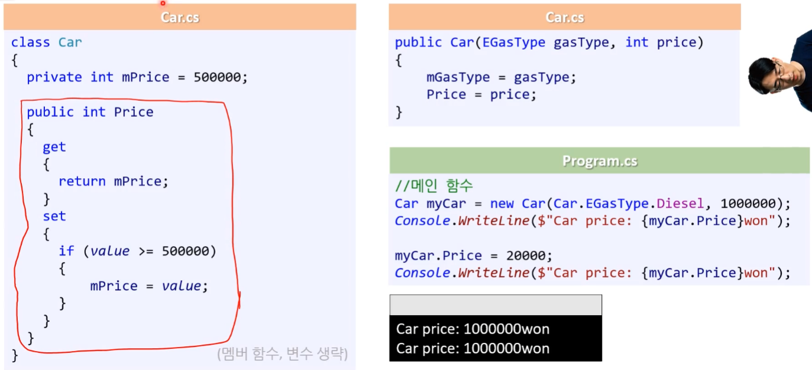


#### 1) getter / setter  -  get / set (프로퍼티)

* 비교하기 
* [문제] 작성할 게 너무 많다. 간단히 작성할 방법이 존재한다!

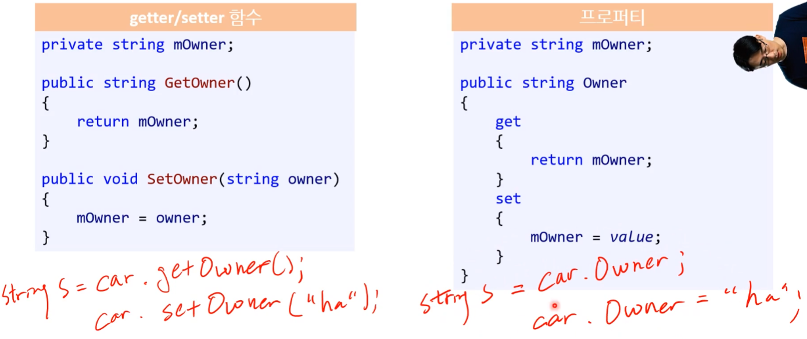

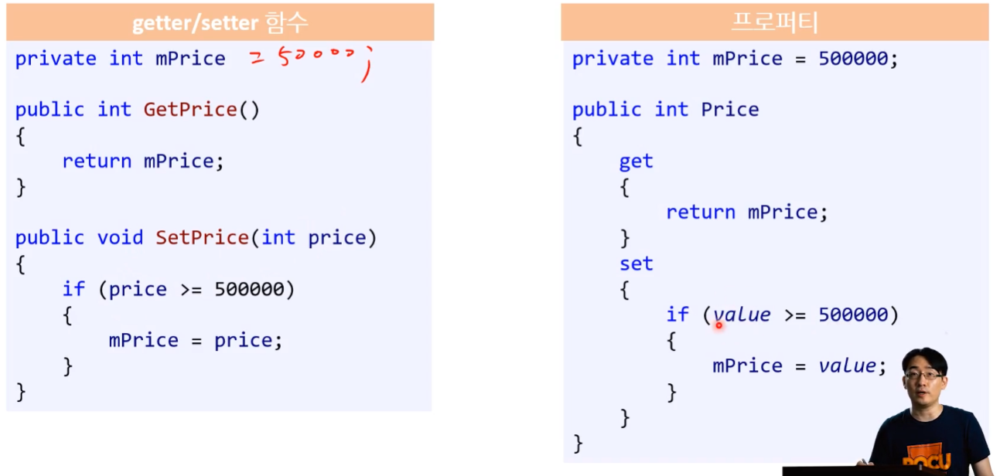


#### 2) 자동으로 구현된 프로퍼티 ★★★

* 자동으로 구현된(auto-implemented) 프로퍼티

  * 최종적으로 간단하게 프로퍼티를 쓸 수 있는 방법이다.
  * 멤버 변수에 단순히 데이터를 대입하거나 반환만 할 때 사용
    * setter에서 특별한 연산을 해줄 때는 여전히 수동 프로퍼티를 사용한다.
    * set에 특별한 조건문 같은 연산을 넣는 경우가 아니라면 이 방식을 사용한다.
  * 컴파일러가 컴파일 시에 익명의 멤버 변수를 만들어 준다.
    * 프로퍼티 형태( `Price { get; set; }` )로 사용해 주면 아래 처럼 멤버변수를 선언하고 대입해 주던 방식을 내부적으로 알아서 mPrice 같은 것을 만들어서 사용할 수 있게 된다. 


  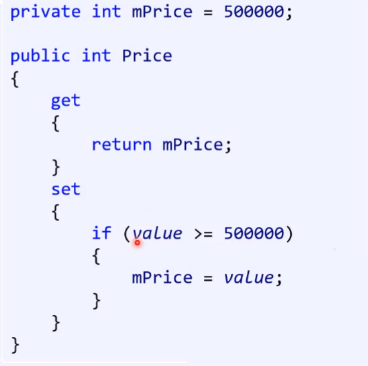

---

  * 초기화도 가능 ( 선택 )
  * get과 set에도 접근 제어자를 붙여 줄 수 있다. ( 선택 )
    * private set : 클래스 내부에서만 set을 사용할 수 있다. 
      * (ex) `myCar.GasType = blabla;` : 컴파일 에러 발생

---

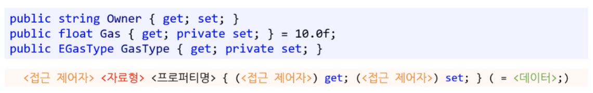

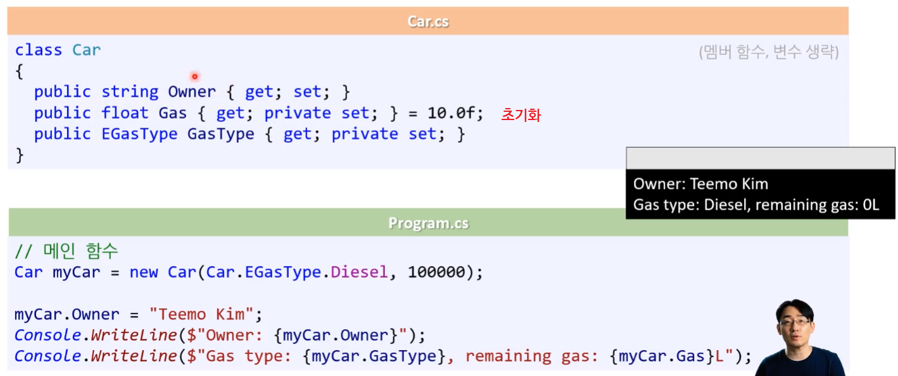

---


#### 3) 최종 : 프로퍼티를 적용한 Car 클래스

* 클래스 안에 enum을 넣어서 사용할 수도 있다.
* 클래스 안에 상수 가격을 만들어서 쓰는 경우도 있다.

```csharp
// Car.cs

class Car
{
	public enum EGasType
	{
		Gasoline,
		Diesel,
	};
	
	private const int MIN_PRICE = 500000;
    private int mPrice = MIN_PRICE;
    
    public int Price
    {
        get
		{
        	return mPrice;
		}
        set
        {
            if (value >= MIN_PRICE)
            {
                mPrice = value;
			}
        }          
	}
    
    public float Gas { get; private set; }
    public EGasType GasType { get; private set; }
    public string Owner { get; set; }
    
    private float mKillometersTravelled;
    
    public Car(EGasType gasType, int price)
    {
        GasType = gasType;		// 프로퍼티 접근
        Price = price;
    }
    
    public void FillUp(float gas)
    {
       	Gas += gas;
	}
    
    public void Move()
    {
        reduceGas(0.5f);
        mKillometersTravelled += 0.3f;
        
        Console.WriteLine("Move!");
        Console.WriteLine($"(Gas: {Gas}L left)!");
        Console.WriteLine($"(Total move: {mKillometersTravelled}km");
	}
    
    public void Honk()
    {
        Console.WriteLine("Honk~ honk~");
	}
    
    private void reduceGas(float consumedGas)    
    {
        Gas -= consumedGas;
	}
}
```

[주의!] redueceGas 함수는 재활용성이 없기 때문에 굳이 만들 필요는 없었지만 private 함수 사용법을 보여 주기 위해 표현한 것이다. ( private 접근한정자가 붙을 경우 표기법에 주의하자.  )


```csharp
// Program.cs
// Main Function

Car myCar = new Car(Car.EGasType.Diesel, 10000000);
myCar.Owner = "Teemo kim";
myCar.Price = 650000;
myCar.FillUp(100.0f);
myCar.Move();
myCar.Move();
myCar.Honk();
```


> ---
>
> 김포프의 질문답변
>
> [질문] public string Owner{get;set;}의 경우 궂이 property로 만드는 이유가 있나요? public string Owner;로 설정하는 것과 뭐가 다른가요?
>
> [답변]
>
> 이건 개체지향 과목에서 좀더 배우시게 되겠지만 get;set;은 내부적으로 getter/setter 함수 호출로 바뀝니다. OOP의 데이터 추상화라는 원칙을 확실히 따른다면 public 멤버변수는 존재해서는 안 됩니다. 이 외에도 메서드가 될 경우, 다형성(역시 개체지향 과목에서 배움)을 사용할 수 있다는 장점도 있습니다. 
>
> 하지만 함수호출에 따른 overhead도 있기에 성능이 중요한 분야(예: 게임 프로그래밍)에서는 getter/setter를 사용하지 않고 곧바로 public 멤버변수를 사용하는 경우도 있습니다. 
>
> 실무적인 측면에서 베스트 프랙티스를 말씀드리면 다음과 같습니다. 
>
> - 기본적으로 public 멤버변수를 사용하지 말것 (C#에서는 프로퍼티 사용, 타 언어에서는 getter/setter 사용) 
> - 정말 그래야 할 이유(성능 등)가 있을때 public 멤버변수를 사용
>
> ---


## 4. 코딩표준

* 이 코딩표준은 각 회사 마다 다를 수 있다.

* 하단의 코딩표준은 가장 많이 쓰이는 코딩 표준을 따르고 있다.

  ( 김포프 식으로 좀더 편하게 수정한 것들도 있다. )


### 4.1. 클래스 작성 순서

1. public const 상수      ( 댓글로 피드백 받음 )
2. private const 상수      ( 댓글로 피드백 받음 )
3. public 멤버변수/프로퍼티
4. internal 멤버변수/프로퍼티
5. protected 멤버변수/프로퍼티
6. private 멤버변수
   * 단, 프로퍼티와 대응하는 private 멤버 변수는 프로퍼티 바로 위에 작성
7. 생성자
8. public 메서드
9. Internal 메서드
10. protected 메서드
11. private 메서드

```csharp
private const int MIN_PRICE = 500000;

private int mPrice = MIN_PRICE;
public int Price
{
    get
	{
        return mPrice;
	}
    set
    {
        if (value >= MIN_PRICE)
        {
            mPrice = value;
        }
    }          
}
```


### 4.2. 프로퍼티

* 프로퍼티 쓸 수 있으면 무조건 쓰자.
* [중요!] setter / getter 함수보다는 프로퍼티를 사용하자!

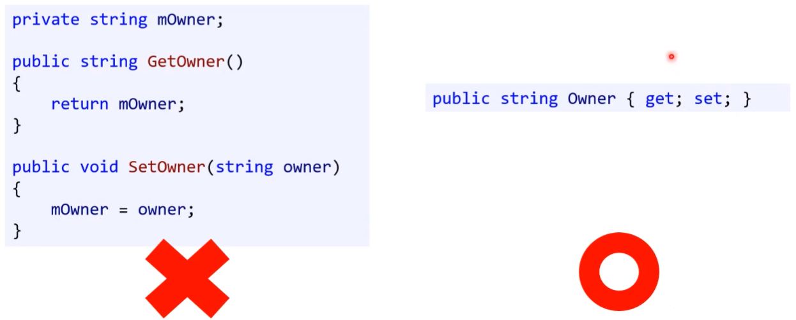


### 4.3. 네이밍

#### 1) 멤버 변수 / 프로퍼티

대문자 소문자를 다르게 해서 어떤 타입의 변수를 사용하고 있는지 편하게 구분하기 위함이다.

* **public 멤버 변수 / 프로퍼티** 

  * 파스칼 표기법을 따른다.

    ```csharp
    public float GasType { get; private set; }
    ```

* **private 멤버 변수**

  * 맨 앞에 'm'을 붙인다. 

  * 낙타 표기법을 따른다.

  * [참고] 일반적인 C# 회사의 경우 m 안 붙인 낙타표기법을 사용한다.

    ```csharp
    private float mKillometersTravelled;
    ```

* **함수의 매개변수, 지역변수**

  * 낙타 표기법을 따른다.

    ```csharp
    public Car(EGasType gasType, int price)
    ```


#### 2) 멤버 함수 이름 작성

* **public 함수**

  * 파스칼 표기법을 따른다.

    ```csharp
    public void Honk()
    {
        Console.WriteLine("Honk~ honk~");
    }
    ```

* **private 함수**

  * 낙타 표기법을 따른다.

  * [참고] 일반적인 C# 스탠다드에서는 파스칼 표기법을 그냥 사용한다.

    ```csharp
    private void reduceGas(float consumedGas)
    {
    	Gas -= consumedGas;
    }
    ```

    


