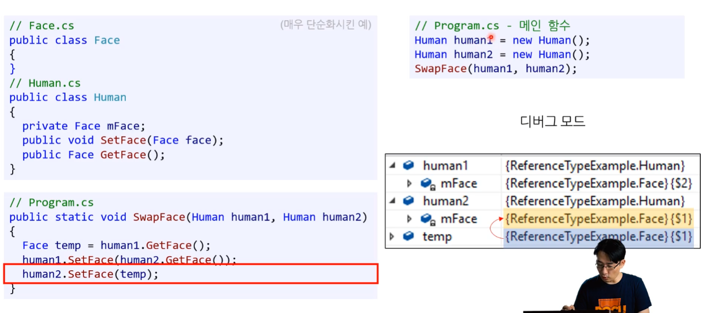
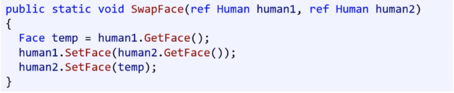
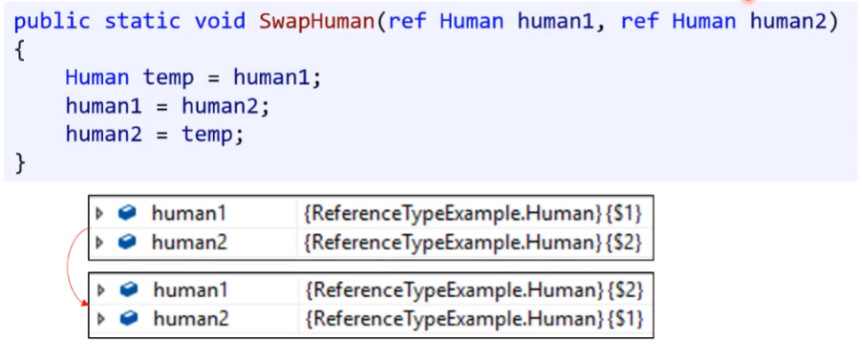
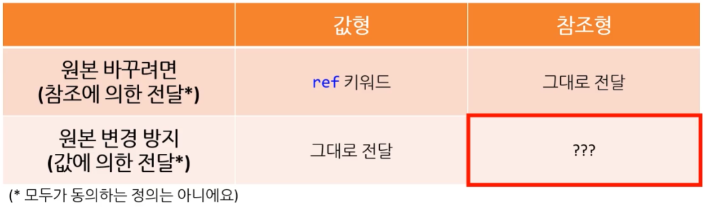
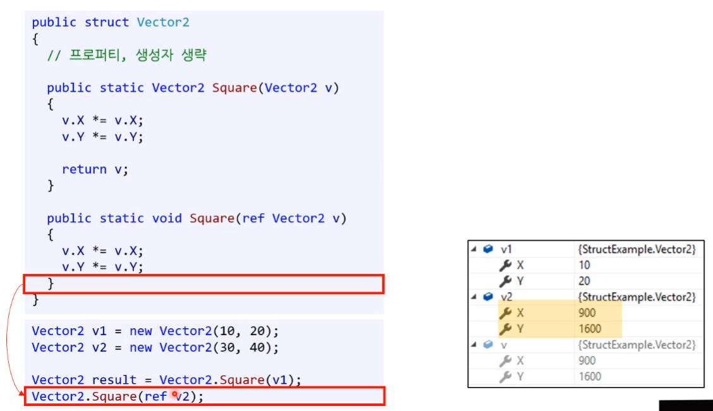
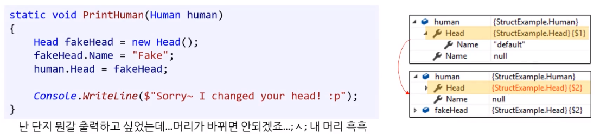

# 23 구조체, Nullable

## 1. 클래스의 인자 전달


#### 1) 참조형의 인자 전달

[예문] 값 교환

* 값 교환이 된다.




##### - 참조형의 인자 전달과 ref  

* 참조형을 ref 매개변수로 전달해도 제대로 작동한다.

  * but, 이건 참조형의 참조라 대부분 별 의미가 없다.
  * 오히려 쓸데없이 참조를 한 번 더 해서 개미 눈꼽 만큼의 성능 저하가 발생한다.
    * 면접관 입장에서 참조형을 이해하지 못하고 있구나 라는 생각을 하게 만든다.


---

  * 단, 아래의 경우에는 의미가 있다.
  * 그러나 생각보다 많이 없는 일이다. 
    ( [노란색] 크게 중요한 내용은 아니다.)

 


#### 2) 참조형 vs 값형의 매개변수 전달 ★



> ---
>
> [논쟁] 간혹 클래스를 전달하는 것도 값에 의한 전달해야 하는 것 아니라는 의견이 있다. 
>
> * 김포프 : 원본을 기준으로 분류하지 않으면 혼동이 오니 이렇게 나눠야 된다는 입장
>
> ---

---

* ref 대신 val 같은 키워드를 임의로 만들어서 사용할 수는 없을까? 없다.
* 결국 class 라 문제인 것인데 class와 비슷하지만 값 형 인것은?
  * 구조체! ( structure )

---

* 사본을 전달하는 것 : 구조체 사용
  * 다른 언어의 경우 참조형을 값형으로 바꿀 수 없다고 넘어가는 경우도 있다.


> ---
>
> 질문
>
> 값형이 함수 인자로 전달 될 경우 메모리 복사가 일어나야 하기 때문에 단순히 참조만 전달하는 것에 비하여 메모리 낭비가 발생하고 복사하는데 걸리는 성능 저하로 인해 성능이 더 안 좋을 것 같습니다. 기본 타입일 경우 크기가 작으므로 별로 상관이 없을 것 같은데 크기가 큰 개체의 경우 이러한 현상이 더 심해질 것 같습니다. 이런 상황에서도 값형이 여전히 더 성능이 좋은게 맞나요?
>
> 
>
> 답변
>
> 값은 스택 메모리를 사용하여 복사하기 때문에 힙 메모리에 비해 속도가 매우 빠릅니다. 따라서 기본적으로 갑형이 성능이 유효하다고 생각하시는게 편합니다. (실제 실무에서도 스택 메모리에 넣을 수 있다면 최대한 스택 메모리에 넣고, 용량상 그게 안될 때는 힙 메모리에 넣는 경우가 보통입니다) 
>
> 하지만 C++에 가시면 많은 개체(object)를 담고 있는 컨테이너를 값형으로 복사할 경우 성능상의 문제가 발생할 여지가 있어 그 컨테이너 안에 값이 아닌 참조형(즉 포인터)를 저장하거나 아예 컨테이너를 복사하지 않고 참조로 전달할 경우들이 있습니다. (이 정도가 성능때문에 값형 대신 참조형을 사용하는 거의 유일한 예)
>
> ---


## 2. 구조체

* **structure**
* **struct 키워드** 

클래스랑 비슷한데 값형이다.
클래스를 값 형 처럼 사용할 수 있다.

[주의!] C, C++에서 말하는 구조체와 다르다. C#에서만 구조체 사용이 다르다.

---

* 개념 : 기능은 없고 데이터만 모아 둔 클래스다.
  * BUT, C#의 구조체는 함수도 가질 수 있다.
  * 여전히 개념 상의 이유로 클래스에서 가능한 것들을 못하는 경우가 있다. 
    ( 자세한 것 나중에 따로 알아보자. )
* **[중요] 구조체는 값형이다. ★**
  * 잘 쓰이지는 않는 편이다. 
    ( 나중에 쓰면서 더 자세히 배우기 )


---


**[ Vector 2 구조체 - 예시 ]**

* class 대신에 struct로 선언한다.

```csharp
public struct Vector2
{
	public int X { get; set; }
	public int Y { get; set; }
	
	public Vector2(int x, int y)
	{
		X = x;
		Y = y;
	}
	
	public static Vector2 Square(Vector2 v)
	{
		v.X *= v.X;
		v.Y *= v.Y;
		
		return v;
	}
	
	public static void Square(ref Vector2 v)
	{
		v.X *= v.X;
		v.Y *= v.Y;
	}
}
```


### 1) 생성자

* **매개 변수가 있는 생성자만 선언 가능** ( 매개변수가 없으면 생성자 선언 불가능 )
  * 구조체 자체가 값 형이기 때문에 변수로 0으로 초기화 시켜주는 것을 강제한다. 
    그래서 매개변수를 따로 안 받는 생성자를 거부하는 것으로 보는 것이 좋다.

  * 매개변수가 없어도 구조체는 값형이기 때문에 무조건 0으로 만들겠다는 의지를 보인다.
  * 단, 다른 값 매개변수를 넣어서 초기화 시켜주는 것은 허용한다.

```csharp
public <구조체 이름>(<매개변수 리스트>)
{

}
```

```csharp
public Vector2(int x, int y)
{
	X = x;
	Y = y;
}
```

---

```csharp
public Vector2()		// 컴파일 오류
{
    ...
}
```


### 2) 멤버 변수와 프로퍼티

* 값 형이기 때문에 특정 값으로 초기화 하는 것을 허용하지 않는다.

* 멤버 변수와 프로퍼티 모두 선언과 동시에 초기화 할 수 없다.

  * 값형은 초기화 값이 0이어야 한다.
  * 이런 식으로 초기화를 시킬 수 있다면 혼동이 올 것이다.
    ( 바꾸고 싶으면 매개변수가 있는 생성자를 사용하거나 구조체 생성한 이후에 바꾸라는 의미이다. )

  ```csharp
  public int X = 10;					// 컴파일 오류
  public int Y = { get; set; } = 10	// 컴파일 오류
  ```

  

  * 단, 상수(const)나 정적(static) 변수는 초기화 가능하다.
    ( 사실상 구조체 만들 때 생성이 된다는 개념이 아니라 공유한다는 개념이라서 가능한 것이다. )

    ```csharp
    public const int MAX = 200;		// OK
    public static int X = 10;		// OK
    ```

    

  


### 3) 구조체 개체 생성 ( 인스턴스 )

* new 키워드를 사용해서 생성한다.
* 단점 - 1가지  : '구조체'인지 '클래스'인지 헷갈릴 때가 있다.
  * 김포프도 구별하기 어렵고 방법이 없다고 한다. 
    ( 나중에 답을 찾는 다면 POCU 스탠다드에 올릴 예정 )

```csharp
Vector2 v1 = new Vector2();			//	모든 멤버변수가 0으로 초기화
Vector2 v2 = new Vector2(30, 40);
```


### 4) 구조체를 매개변수로 전달하기

* 구조체는 값 형이기 때문에 사본으로 전달한다.
* 값을 바꾸고 싶다면 ref 키워드를 사용해서 참조형으로 전달해야 바꿀 수 있다.




### 5) 클래스와 구조체 서로 포함 가능 

클래스와 구조체 모두 자료형이기 때문에 서로 포함 가능하다.

```csharp
public class Human
{
	public Head Head { get; set; }	// Head는 struct
	public Body Body { get; set; }	// Body는 class
}
```

```csharp
public struct Human
{
	public Head Head { get; set; }	// Head는 struct
	public Body Body { get; set; }	// Body는 class
}
```


### 6) 클래스 vs 구조체

* 대부분 응용 프로그램에서는 구조체를 잘 안쓴다.

  * 개체를 전달하면서 원본을 바꾸는 것이 보통이기 때문이다.

  * 일반적으로 90%는 클래스를 쓴다. 

    웹서버의 경우 100% 클래스를 쓴다.

* 특정 분야에서만 사용된다.

  * 성능을 요하는 특정 분야(수학, 물리 시물레이션)에서는 객체를 여러개 만들어서 가비지 컬랙션을 돌리는 것 자체가 금지 된민감한 사항이다.  
    ( 그렇기 때문에 내부적으로 struct를 쓰는 경우가 있다. )
  * 고성능 
  * 쓰레기를 만들지 않음
  * 고성능이나 게임쪽은 구조체를 쓰는 경우가 있을 수도 있다.

* 원본 대신 언제나 복사본을 전달하고 싶다면 구조체를 쓰기도 한다.

* **[ 핵심 ] 구조체는 깂 형, 클래스는 참조형**

  


> ---
>
> [ C# 프로그래머 면접 질문 - 2가지 ]
>
> ※ 김포프가 시니어 개발자를 판단할 때 하는 2가지 질문 사항이다.
>
> 1. 구조체와 클래스의 차이점
> 2. 가비지 컬렉션이 어떻게 작동하며, 느리게 작동하는 것을 해결하기 위해서 어떻게 빠르게 만들었냐?
>    * 가비지 컬렉션 새로운 방법 도입 
>    * 유니티가 쓰는 가상머신이 아직도 옛날 것이기 때문에 느리다.
>
> ---


