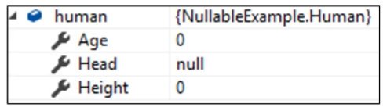
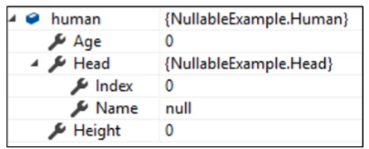
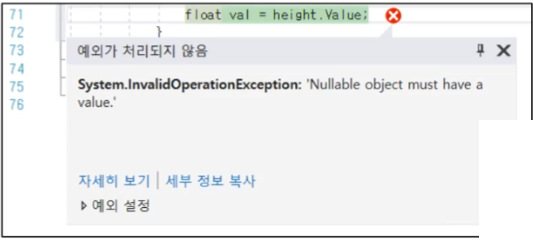

# Nullable

## 1. Nullable

* null을 가질 수 있는 구조체
* Null이 될 수 있는 이라는 의미이다.


### 1.1. 기본값

#### 1) 클래스 멤버변수의 기본값

```csharp
public class Human
{
	public int Age { get; private set; }
	public float Height { get; private set; }
	public Head Head { get; private set; }		// Head는 클래스
}
```

* Human human = new Human(); 을 실행하고 나면 'Age', 'Height', 'Head'에는 어떤 값이 들어갈까?
  * '0' 또는 '0에 준하는 값'
  * 값 형 : 0
  * 참조형 : null ( 비트 패턴이 0 )




#### 2) 구조체 멤버변수의 기본값

```csharp
public class Human
{
	public int Age { get; private set; }
	public float Height { get; private set; }
	public Head Head { get; private set; }		// Head는 구조체
}
```

Human human = new Human(); 을 실행하고 나면 'Age', 'Height', 'Head'에는 어떤 값이 들어갈까?

* '0' 또는 '0에 준하는 값'

* 값 형 : 0

* Head도 값 형이니 Head 내부의 변수들도 다 0

  => Head가 null이 아님 **( 중요! )**




### 1.2. Nullable 

#### 1) 탄생 계기

* 값 형에도 null을 쓸 수 없을까?

---

* List<T>에서 IndexOf() 함수가 원하는 요소를 못 찾는다면?

  ```csharp
  List<int> list = new List<int> { 10, 20, 30, 40 };
  int index = list.IndexOf(100);	// -1을 반환
  ```

  *  -1 보다 null을 반환하는게 더 낫지 않을까?

* 하지만 int는 값 형으로 null이 될 수 없다.
  ( 구조체도 마찬가지다. )

* 그걸 가능하게 해주는 것이 Nullable\<T>


**[ Nullable \<T> ]**

* [정의] T 형의 값, 또는 null을 가질 수 있는 구조체
  * 참조형은 T가 될 수 없다. ( 순수하게 값형만 들어간다. )
* [용도] null 도 가질 수 있는 값 형을 표현할 때 쓰인다.
* 기본값은 null


#### 2) 선언 및 대입

##### (1) 선언 - 기본형

```csharp
Nullable<int> age;
Nullable<float> height = 180.0f;
Nullable<Head> head;
Nullable<Body> body = new Body();
```


##### (2) 선언 - 축약형 ( 이걸 쓰자 )

```csharp
int? age;
flaot? height = 180.0f;
Head? head;
Body? body = new Body();
```


##### (3) 대입

```csharp
age = 7;
height = null;
head = new Head();
body = null;
```


#### 3) null 확인하기

```csharp
if (age.HasValue)
{
	...
}
```

* if (age == null)을 쓰자. 
  * 이게 더 일반적이다.


#### 4) 값 읽어오기

반드시 Value를 써줘야 한다. ( null 일 수 있기 때문이다. )

```csharp
if (age != null)
{
	Console.WriteLine(age.Value);
}
```

---

[주의!] null인 경우 그래도 .Value를 불러온다면?

* 런타임 에러 : 예외 발생

```csharp
float? height;
flaot val = hewight.Value;
```




#### 5) 값 비교하기

* `T형`과 `T?형`을 비교할 때 단순히 `== 연산자`를 쓰는게 가능하다.

  * Nullable이 내부적으로 null 검사를 한 뒤에 비교해 준다.

  ```csharp
  int? age = null;
  if (age == 3)			// if (age != null && age.Value == 3)
  {
  	...
  }
  
  int? grade = 3;
  if (grade == 3)
  {
  	...
  }
  ```

---

* 비교할 때는 .Value를 뽑아 쓸 필요는 없다.

* 아래 두 개의 코드는 같은 코드다.

  * 두 번째 코드 처럼 간단하게 사용해도 된다.

  ```c#
  if (age != null && age.Value == 3)
  {...}
  ```

  ```c#
  int? age = null;
  if(age == 3)
  {
  }
  ```

  


#### 6) 값 형에 Nullable 변수 대입하기

* Nullable형에 값 형을 대입할 수 있다.   ( ※ '에' , '을' 헷갈림 주의! )

* 값 형에 Nullalbe형을 대입할 수 없다.

  * Nullable형에 null이 있을 수 있으니 실수 방지용으로 에러를 발생시키는 듯 하다.


---

```csharp
/* [ 컴파일 오류 ] */

int? maybeAge = 3;
int age = maybeAge;		// 컴파일 오류 - 값 형에 Nullalbe형을 대입할 수 없다.
```

---

```csharp
/* [ 올바른 코드 ] */

int? maybeAge = 3;
int age = maybeAge.Value;	
```

* Nullable과 아닌 것을 섞어쓰면 복잡해진다.


#### 7) Nullable 사용성

* 그럼 전부 Nullable을 사용하면 되지 않을까? 그러지 못하는 이유

---

* List<T>의 IndexOf() 는 왜 반환값으로 -1을 사용했을까?
  * IndexOf() 에서 -1은 색인으로는 유효한 값이 아니다라는 것을 나타낸다.
  * 다른 언어의 경우 리스트의 색인은 uint로 0부터 시작 할 경우
    * 요소를 못 찾으면 uint.MaxValue를 반환하기로 약속 하기까지 한다.

---


**[ Nullable 의 문제점 ]**

* Nullable을사용하지 못하는 이유다.

1. Nullable 사용시 당연히 오버헤드가 있다. 
   ( 오버헤드 : 성능상의 저하 문제, 해야 할 작업 등이 많다. )

2. 잘못 쓰면 코드 괜히 복잡해진다.
   * null을 허용하는 코드와 null을 예상치 않는 함수간에 데이터 교환을 할 때 등등


```csharp
static int Min(int num1 int num2)
{
	...
}

// 어떤 함수 안
int? maybeAge = 3;
if (maybeAge != null)
{
	int age = maybeAge.Value;
    int minAge = Min(age, ADULT);	// ADULT는 상수
}
```


**[ Nullable 사용 방향 ]**

* 'Null을 반환 해야만 할 때 등 정말 필요할 때만  Nullable을 사용하자. ( 생각보다 쓸일 거의 없다. )
* 그게 아니라면 예외 상황이 발생했을 때 흔히 사용하는 반환값은 아래 값을 사용하자. **( 흔한 방식이다. )**
  * `-1`
  * `uint.MaxValue`


**[ 실습 예제 ]**

```csharp
namespace Nullable
{
    public struct Bar
    {
        public Bar(int number)
        {
            Number = number;
        }

        public int Number { get; private set; }
    }
}

```

```csharp
using System;

namespace Nullable
{
    class Program
    {
        static void Main(string[] args)
        {
            Bar[] bars = new Bar[]
            {
                new Bar(1),
                new Bar(2),
                new Bar(3)
            };

            //Bar bar1 = First(bars, 2);
            Bar? bar1 = First(bars, 2);

            if (bar1 == null)
            {
                Console.WriteLine($"bar1 is null!");
            }
            else
            {
                Console.WriteLine($"bar1: {bar2.Value.Number}");
            }

            Bar? bar2 = First(bars, 4);

            if (ba2r == null)
            {
                Console.WriteLine($"bar2 is null!");
            }
            else
            {
                Console.WriteLine($"bar2: {bar2.Value.Number}");
            }
        }

        public static Bar? First(Bar[] bars, int number)
        {
            foreach (Bar bar in bars)
            {
                if (bar.Number == number)
                {
                    return bar;
                }
            }

            return null;
        }
    }
}
```


## @@@@@@@@@@@

### $  이것이 C#이다.

---

참조 형식은 Nullable을 사용할 수 없다. 


---


### $ C# 스터디 

---

### Nullable Type

정수(int)나 날짜(DateTime)와 같은 [Value Type](https://www.csharpstudy.com/CSharp/CSharp-struct.aspx)은 일반적으로 NULL을 가질 수 없다. C# 2.0에서부터 이러한 타입들에 NULL을 가질 수 있게 하였는데, 이를 **Nullable Type** 이라 부른다.

C#에서 물음표(?)를 int나 DateTime 타입명 뒤에 붙이면 즉, int? 혹은 DateTime? 같이 하면 Nullable Type이 된다. 이는 컴파일하면 .NET의 Nullable<T> 타입으로 변환된다. Nullable Type (예: int?) 을 일반 Value Type (예: int)으로 변경하기 위해서는 Nullable의 .Value 속성을 사용한다.

```C#
// Nullable 타입
int? i = null;
i = 101;
            
bool? b = null;

//int? 를 int로 할당
Nullable<int> j = null;
j = 10;
int k = j.Value;
```


**C# 데이타 타입 예제**

```C#
// Bool
bool b = true;

// Numeric
short sh = -32768;   
int i = 2147483647;  
long l = 1234L;      // L suffix
float f = 123.45F;   // F suffix
double d1 = 123.45; 
double d2 = 123.45D; // D suffix
decimal d = 123.45M; // M suffix

// Char/String
char c = 'A';
string s = "Hello";

// DateTime  2011-10-30 12:35
DateTime dt = new DateTime(2011, 10, 30, 12, 35, 0);
```

- **float** 데이타 타입은 숫자 뒤에 123.45F와 같이 **F**를 붙여 double이 아닌 float 타입임을 나타낸다.
- **double** 데이타 타입은 숫자 뒤에 123.45D과 같이 **D**를 붙이거나 혹은 아무것도 붙이지 않음으로 해서 double 타입임을 나타낸다.
- **decimal** 데이타 타입은 숫자 뒤에 123.45M과 같이 **M**를 붙여 decimal 타입임을 나타낸다.
- **char** 데이타 타입은 작은따옴표 ' (single quotation)을 사용하여 한 문자를 할당한다.
- **string** 데이타 타입은 큰따옴표 " (double quotation)을 사용하여 문자열을 할당한다.

---


