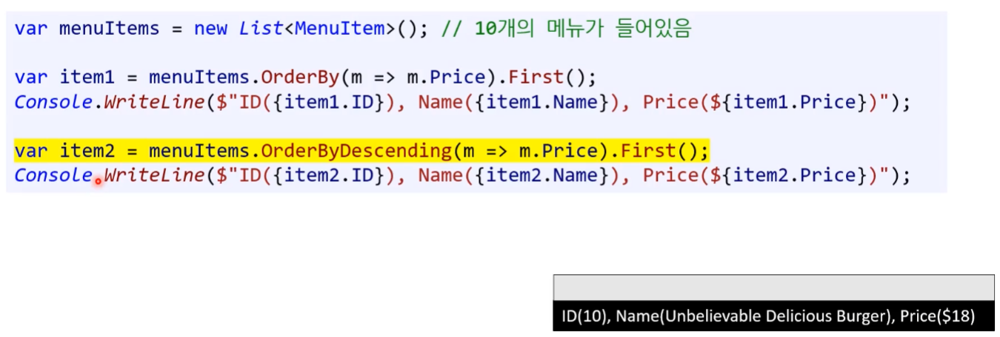

# 24 LINQ

* 발음 ( 링큐, 링쓰 )


**[ 탄생 배경 ]** 

데이터베이스를 사용하는 관리자들이 C#으로 코딩할 때 데이터베이스에서 쓰는 것처럼 편하게 사용하기 위해 나왔던 거 같은데 프로그래머 입장에서 보기에는 굉장히 외계어스러운 부분이다. 프로그래머 입장에서는 좀 더 편한 방법이 있다. 물론 C#에서는 이 두 개를 다 지원한다.

데이터가 많이 있을 때 그걸 쉽게 빠르게 처리하기 위해 쓴다.


## 1. 엑셀 데이터 정리 : 실습


**[ 1. 테이블의 각 행(row)을 클래스화 ]**


```csharp
public class MenuItem
{
	public int ID { get; set; }	
    public string Name { get; set; }
    public float Price { get; set; }
    
    public MenuItem(int id, string name, float price)
    {
        ID = id;
        Name = name;
        Price = price;
	}
}
```


**[ 2. 클래스 데이터 컬렉션화 ]**

* 엑셀 테이블과 똑같이 표현 가능하다.

---

**List (ex)**

```csharp
var menuItems = new List<MenuItem>();
menuItems.Add(new MenuItem(1, "Dellicious Burger", 10.0f));
menuItems.Add(new MenuItem(2, "Very Dellicious Burger", 11.0f));
```

**Dictionary (ex)**

```csharp
var menuItems = new Dictionary<int, MenuItem>();
menuItems.Add(1, new MenuItem(1, "Dellicious Burger", 10.0f));
menuItems.Add(2, new MenuItem(2, "Very Dellicious Burger", 11.0f));
```

---


## 2. C#과 쿼리

* 데이터베이스 테이블에서 필요한 데이터만 빠르게 선택(select)하는 법이 있는데 그걸 쿼리라고 한다.


### [실습] 엑셀에서 $15보다 비싼 메뉴를 반환하기

****


### 2.1. 쿼리문 : 데이터베이스 

* 쿼리 (query) : 데이터베이스 테이블에서 필요한 데이터만 빠르게 선택(select)하는 법이 있는데 그걸 쿼리라고 한다.

---

* 쿼리문 : 엑셀에서 $15보다 비싼 메뉴를 반환하기

```sql
SELECT * FROM MenueItems
WHERE price > 15;
```

* `SELECT *` : **모든 메뉴 정보 (아이디, 이름, 가격)을 뽑아주세요!**
* `FROM MenueItems` : **MenueItems 테이블에서부터** 모든 메뉴 정보 (아이디, 이름, 가격)을 뽑아주세요!
* `WHERE price > 15` : MenueItems 테이블에서 **$15보다 비싼** 메뉴 정보 (아이디, 이름, 가격)을 뽑아주세요!


### 2.2. 반복문 : C#

컬렉션에서 필요한 개체만 뽑아내는 방법은 반복문이다.

```csharp
var filteredItems = new List<MenuItem>(menuItems.Count);
foreach (var item in menuItems)
{
	if (item.Price > 15)
	{
		filteredItems.Add(item);
	}
}
```


### 2.3. LINQ : C#

* 데이터베이스에만 익숙한 사람들은 반복문보다 쿼리문을 좋아한다.
* 그래서 C#에서도 그걸 지원 LINQ(Language-Integrated Query)란 것을 만들게 된다.
* 쿼리문과 똑같이 돌아간다.
  * 데이터베이스 관리자는 좋아합니다.

```csharp
// 파일 맨 위
using System.Linq;

var filteredItems =
	from item in menuItems
	where item.Price > 15
	select item;
```


### 2.4. LINQ 함수 : C#

LINQ는 프로그래머에게 어색하다.

* 프로그래머에게는 함수가 익숙하다.

* 그래서 함수 형태의 LINQ를 쓸 예정이다. 
  * 둘 다 LINQ이므로 똑같은 라이브러리를 사용한다. ( `using System.Linq;` )

* 컬렉션에 `System.Linq`를 이용하면, 예전에 직접 for문을 작성해서 처리했던 만들 것들을 **함수 호출 몇 번** 만으로 해결 가능하다.


**[ LINQ 함수 ]**

* **Where()**
* **OrderBy(), OrderByDescending()**
* **ThenBy(), ThenByDescending()**
* **First(), FirstOrDefault()**
* **All(), Any()**
* **ToList(), ToArray(), ToDictionary()**
* **Select()**
* 기타 등 등 많다.
  * 두 테이블을 조인(join)하는 것도 가능하다.
  * [참고] 직접 문서를 읽어보거나 데이터베이스 배운 뒤 다시 보면 이해가 잘 된다.
    * 구글 검색 키워드 : c# system.linq


## 3. LINQ 함수


### 3.1. 필터 및 정렬

#### 1) Where()

* 특정 조건에 맞는 데이터만 찾아서 또 다른 컬렉션에 반환 한다.

```csharp
var filteredItems = menuItems.Where(m => m.Price > 15.0f);
```

`m => m.Price > 15.0f`

* `m =>` : menuItems 안에 있는 각 m에 대해

  * `m` : menuItems 안에 있는 각 요소를 의미한다. 내부적으로는 결국 for문이다.
        ( `foreach (MenuItem m in menuItems)` 가 줄어서 `m`이 됐다고 보면 된다. )
  * `=>` : "~에 대해"라는 의마라고 보면 된다.

* `m.Price > 15.0f` : 조건이 참이면 반환할 목록에 추가

  * 아래 조건문이 축약 됐다고 보면 된다.

  ```csharp
  if (m.Price > 15.0f)
  {
  	filteredItems.Add(m);
  }
  ```

---

* `var filteredItems = menuItems.Where(m => m.Price > 15.0f);`
  * menuItems 안에 있는 메뉴 중에 $15보다 비싼 메뉴들을 filteredItems에 추가해서 반환하는 코드이다.

---


**[ 보충 문제 ]**

이것은 무슨 코드 일까?

```csharp
var filteredItems1 = menuItems.Where(m => m.Price <= 14.0f && m.Name.Contains("Super"));
```

* [정답] menuItems 안에 있는 메뉴 중에 가격이 $14 이하이고, 이름에 "Super"를 포함한 메뉴 목록을 filteredItems1에 반환하는 코드


---

**[ 실전 예문 ]**

```csharp
var menuItems = new List<MenuItem>();	// 10개의 메뉴 목록이 들어있다.
var filteredItems = menuItems.Where(m => m.Price > 15.0f);

foreach (MenuItem item in filteredItems)
{
	Console.WriteLine($"ID({item.ID}), Name({item.Name}), Price({item.Price})");
}
```


#### 2) OrderBy()  /  ThenBy()

* 두 함수 모두 **오름차순**으로 **정렬 후 반환**한다.
* **별도의 정렬 기준을 추가**하고 싶다면 **ThenBy()**를 사용한다.

---

```csharp
var filteredItems = menuItems.OrderBy(m => m.Price);
```

메뉴를 가격의 오름차순으로 정렬 후 `filteredItems` 에 반환

---

```csharp
var filteredItems2 = menuItems.OrderBy(m => m.Price)
							  .ThenBy(m => m.Name)
```

메뉴를 가격의 오름차순으로 정렬한 뒤, 다시 이름의 오름차순으로 정렬 후 `filtereditems2`에 반환

* 사슬처럼 엮는 다고 해서 chaining 호출이라고 부르기도 한다.


**[ 출력 결과 ]**


#### 3) OrderByDescending()  /  ThenByDescending()

* 두 함수 모두 내림차순으로 정렬 후 반환한다.
* 별도의 정렬 기준을 추가하고 싶다면 `ThenByDescending()`을 사용한다.

---

```csharp
var filteredItems = menuItems.OrderByDescending(m => m.Price);
```

메뉴를 가격의 내림차순으로 정렬 후 `filteredItems`에 반환 

---

```csharp
var filteredItems = menuItems.OrderByDescending(m => m.Price);
			   				 .ThenByDescending(m => m.Name);
```

메뉴를 가격의 내림차순으로 정렬한 뒤, 다시 이름의 내림차순으로 정렬 후 `filteredItems`에 반환한다.


**[ 출력 결과 ]**


---


#### 4) chanining ( 종합해서 사용 )

* 여러가지를 함수들과 섞어서(chaining) 사용할 수도 있다.

```csharp
var filteredItems = menuItems.OrderByDescending(m => m.Price);
			   				 .ThenBy(m => m.Name);
```

메뉴를 가격의 내림차순으로 정렬한 뒤, 다시 이름의 오름차순으로 정렬 후 `filteredItems`에 반환한다.

```csharp
var filteredItems = menuItems.OrderBy(m => m.Price);
			   				 .ThenByDescending(m => m.Name);
```

메뉴를 가격의 오름차순으로 정렬한 뒤, 다시 이름의 내림차순으로 정렬 후 `filteredItems`에 반환한다.


**[ where 포함 ]**

```csharp
var menuItems = new List<MenuItem>();	// 10개의 메뉴 목록이 들어있다.

var filteredItems = menuItems.Where(m => m.Price > 15);
							 .OrderBy(item => item.Price);
			   				 .ThenByDescending(m => m.Name);

foreach (MenuItem item in filteredItems)
{
	Console.WriteLine($"ID({item.ID}), Name({item.Name}), Price({item.Price})");
}
```


### 3.2. 요소 반환

* First(), FirstOrDefault() 사용 시 Where() 대신 조건을 넣을 수도 있다. 


#### 1) First()

데이터 셋(data set)에서 가장 처음 요소를 반환한다.

```csharp
var item1 = menuItems.OrderBy(m => m.Price).First();
var item2 = menuItems.OrderByDescending(m => m.Price).First();
```

[주의!] 비어 있다면 예외가 발생한다!

* 이런 예외를 처리를 해결하기 편한 간단한 함수가 있다. ( FirstOrDefault )

```csharp
var item = menuItems.Where(m => m.Price < 0)
					.OrderBy(m => m.Price)
					.First();
```


**[ 출력 결과 ]**




#### 2) FirstOrDefault()

* 조건에 맞는 첫 요소를 못 찾을 경우 기본값 (default)를 반환한다.
* 클래스형의 기본값은? null
* 이런 간편함 때문에 FirstOrDefault() 를 기본적으로 많이 사용한다. 흔하다.

```csharp
var item = menuItems.Where(m => m.Price < 0)
					.OrderBy(m => m.Price)
					.FirstOrDefault();
					
if (item != null)
{
	Console.WriteLine($"ID({item.ID}), Name({item.Name}), Price({item.Price})");
}
```


#### 3) Sum()

총 합을 구하는 함수이다.

```csharp
List<OrderItem> allOrderItems = orders.SelectMany(o => o.OrderItems).ToList();
decimal totalPrice = allOrderItems.Sum(oi => oi.Price * oi.Quantity);
```


### 3.3. 데이터 조건

#### 1) All()

모든 데이터가 특정 조건을 만족하는지 평가한다.

* 모두 맞을 경우 true, 아닐 경우 false 반환

---

```csharp
bool result = menuItems.All(m => m.Price >= 0);			// true
```

모든 메뉴의 가격이 $0 이상인가?  true

---

```csharp
bool result = menuItems.All(m => m.Price >= 15);		// false
```

모든 메뉴의 가격이 $15 이상인가?  false


**[ 출력 결과 ]**


#### 2) Any()

데이터 셋에 있는 데이터 중 하나라도 특정 조건을 만족하는지 평가한다.

* 하나라도 맞을 경우 true, 아닐 경우 false 반환

  ( 모두 만족 안 할 경우에만 : false )

---

```csharp
bool result1 = menuItems.Any(m => m.Price >= 15);		// true
```

메뉴 중 하나라도 $15 이상인 메뉴가 있는가?  true

---

```csharp
bool result1 = menuItems.Any(m => m.Price < 10);		// true
```

메뉴 중 하나라도 $10 미만인 메뉴가 있는가?  false

---

* `menuItems.Any()` 안에 객체가 하나라도 있는가를 의미하기도 한다.
  * `menuItems.Any()`
  * `=  menuItems.Count > 0`


**[ 출력 결과 ]**


### 3.4. 컬렉션 변환 / 새로운 개체 생성

#### 1) ToList()  /  ToArray()  /  ToDictionary()

리스트, 배열, 딕셔너리로 변환해준다.

```csharp
var menuItems = new List<MenuItem>();		// 10개의 메뉴가 들어있다.

List<MenuItem> items1 = menuItems.Where(m => m.Price < 15).ToList();

MenuItem[] items2 = menuItems.Where(m => m.Price < 15).ToArray();

Dictionary<int, MenuItem> items3 = menuItems.Where(m => m.Price < 15)
											.ToDictionary(m => m.ID)  // Key만 정하면 된다.
```


#### 2) Select()

큰 개체 하나에 몇 개 멤버만 빼서 새로운 개체를 만든다.

몇 개만 빼온다고 생각하면 된다.

```csharp
var menuItems = new List<MenuItem>();		// 10개의 메뉴가 들어있다.

var items1 = menuItems.Select(m => new { m.Name, m.Price });      

var item = items1.FirstOrDefault();
if (item != null)
{
	Console.WriteLine($"Name({item.Name}), Price({item.Price})");	
}
```

* `new { m.Name, m.Price }` : 무슨을 의미하는 지 모르겠다. 사용이 애매하다.

---

* 코드 실행 결과
  


**[ Select() - 더 나은 방법 ]**

더 명확하게 의미를 알 수 있다.

```csharp
public class DisplayMenuItem
{
	public string Name { get; set; }
	public float Price { get; set; }
}

var menuItems = new List<MenuItem>();		// 10개의 메뉴가 들어있다.

var items = menuItems.Select(m => new DisplayMenuItem { Name = m.Name, Price = m.Price });

DisplayMenuItem displayItem = items.FirstOrDefault();
if (displayItem != null)
{
	Console.WriteLine($"{displayItem.Name}: {displayItem.Price})");	
}
```


#### 3) SelectMany()

Select()를 하면 배열의 배열, 2차원 배열 처럼 값이 나온다.

SelectMany()를 시켜주면 하나의 단순 한 시퀀스(배열)로 변환되어 나온다.

```csharp
List<OrderItem> petersOrderItems = petersOrders.SelectMany(o => o.OrderItems).ToList();
```


## 4. LINQ 사용 주의사항

사용이 편하다 보니 `성능`이나 `유지보수`에 문제가 되는 코드가 완성될 수 있다.


### 4.1. 내부를 이해할 것 ( 반복문 )

* LINQ는 매우 유용한 함수들을 제공한다.
* 하지만, 내부를 제대로 이해해야 한다.
  * (ex) Where은 내부적으로 for문을 사용하는 것이다. ( 즉, 느려질 수 있다. )

---

**[주의!]** LINQ 내부를 이해 못하는 무늬만 시니어 인 7년차 프로그래머가 진짜 저지르는 실수


```csharp
List<Order> orders = GetOrders();		// 수만 개의 주문 정보

var activeOrders = orders.Where(o => o.Status == EOrderStatus.Active).ToList();
var fulfilledOrders = orders.Where(o => o.Status == EOrderStatus.Fulfilled).ToList();
var cancelledOrders = orders.Where(o => o.Status == EOrderStatus.Cancelled).ToList();
```

Where 할 때 마다 수 만개를 훑는다. 

* 만약, 3만 3천개 였다면 10만번을 돌린 것이다.
* for문에서 if문이나 switch-case 넣은 다음에 작성하면 3만 3천개만 돌리면 된다.

```csharp
List<Order> orders = GetOrders();		// 수만 개의 주문 정보

var activeOrders = new List<Order>(orders.Count);
var fulfilledOrders = new List<Order>(orders.Count);
var cancelledOrders = new List<Order>(orders.Count);

foreach (var order in orders)
{
	switch (order.Status)
    {
        case EOrderStatus.Active:
            activeOrders.Add(order);
            break;
        case EOrderStatus.Fulfilled:
            fulfilledOrders.Add(order);
            break;
        case EOrderStatus.Cancelled:
            cancelledOrders.Add(order);
            break;
        default:
            Debug.Assert(false, "wrong order status");
            break;
	}
}
```


### 4.2. 가독성

* chaining 을 남발할 수 있다.
  * 실제로 시니어 프로그래머들도 하는 실수이다. 
    ( 김포프 경험 : 타입스크립트에 엄청 기여했 던 프로그래머 )
  * 며칠이 지나면 내가 이걸 왜 이렇게 만들 었는지 헷갈린다.

* 디버깅도 쉽지 않고 읽기도 어렵다.

```csharp
List<Order> orders = GetOrders();		// 수만 개의 주문 정보

var payments = orders.Where(o => o.Status == EOrderStatus.Active)
					 .Select(o => ...)
					 .OrderbyDescending(a => ...)
					 ...
					 ... ( 50줄 -_- )
					 ...
					 .ToList();
```


**[ 해결책 ]**

변수에 대입해 주면서 긴 LINQ를 잘게 쪼개서 사용한다.

```csharp
List<Order> orders = GetOrders();		// 수만 개의 주문 정보

var activeOrders = orders.Where(o => o.Status == EOrderStatus.Active);
var paymentInfos = activeOrders.Select(o => ...)
							   .OrderByDescending(a => ...)
							   .Select(a => ...);
var something = paymentInfos.XXX();
...
var payments = somethings999.ToList();
```

김포프도 많이 쓰는 것 중에 하나가 LINQ다.


## 5. 기타

### 질의응답

```
[ 질문 ]
LINQ 강의에서 나온 것과 같이 DB관리자가 사용하는 쿼리를 프로그래머가 사용하기 편한 방식으로 바꾼걸 ORM 이라 하나요?

LINQ가 그 ORM이라는 개념을 이용하는 것 같은데, 정확히 이 개념인지 확신이 안갑니다. 다른 개념도 있더라구요.

https://velog.io/@daonez/ORM-NoSQLSQL-%EA%B0%9C%EB%85%90%EC%A0%95%EB%A6%AC
https://stackoverflow.com/questions/8163513/ls-linq-an-orm-object-relational-mapper
```

```
[답변1] 조교 - Pichu
LINQ가 ORM 개념을 이용한다기 보다는,,,
저는 LINQ든 DB SQL 이든 데이터 덩어리를 내가 원하는 형태로 가공하기 위한 도구이고, 차이점이라면 데이터의 위치가 메모리이냐 disk 이냐 차이라고 생각합니다.

ORM은 프로그래머에게 친숙한 함수 호출 방식으로도 SQL을 작성할 수 있도록 도와주는 도구입니다.
프로그래머에게는 낯선 SQL 문법을 익혀야하는 부담과 쿼리를 작성하다 보면 생길 수 있는 실수들로 부터 한결 자유로워질 수 있는 장점이 있습니다.

C# 프로그램에서 DB와 통신해야하는 경우가 많고, DB에서의 상당수의 기능이 LINQ에도 동일하게 존재하다 보니, 그에 대응되는 SQL까지 만들어주는 ORM 기능까지 추가된거라고 생가합니다.
```

```
[답변2] 포프

ORM은 db 데이터를 OOP의 object로 변환해주는 라이브러리고요.

db의 테이블 하나하나를 그냥 배열로 보면 그걸 이리저리 조작해서 필요한 데이터만 뽑아낼 수 있도록 linq를 사용할 수 있다고 보시면 될 거 같아요.

물론 db에서 데이터를 읽어오려면 기본적으로 sql query를 작성해야 하는데 LINQ를 사용하면 그러지 않아도 됩니다. 그걸 책임져 주는건 C#에서는 entity framework라는 라이브러리고요.
```

