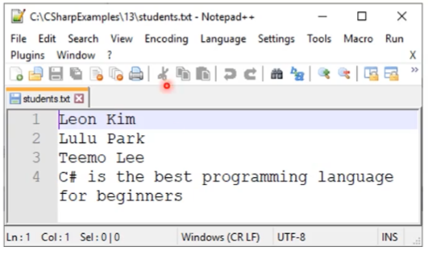

# 파일 입출력


## 1. 파일 입출력

### 1.1. 파일이 필요한 이유

* 지금까지 만든 프로그램들은 동료 시 모든 데이터가 사라진다.
  * 변수는 프로그램 실행 중에 임시적으로 데이터를 저장하는 공간
* 나중에 프로그램을 다시 실행해도 원상태로 복구되려면 어딘가에 저장해야 한다.
* 파일은 이런 영구 저장소 중 하나다.


### 1.2. 텍스트 파일 함수

#### 1) 저장하기 - WriteAllLines() / WriteAllText()

* **WriteAllLines()**
* **WriteAllText()**

```csharp
File.WriteAllLines(@"C:\CSharpExamples\13\students.txt", names); 
File.WriteAllText(@"C:\CSharpExamples\13\students.txt", message);
```

---

* 텍스트 파일을 저장 함수다.
* 파일에 문자열을 쓰는 가장 쉬운 방법이다.
* 이미 파일이 존재한다면 <u>덮어쓴다.</u>
* 열어서 쓰고, 자동으로 닫아주기 까지 하는 간편한 함수다.

---

filePath에 여러 줄의 문자열을 쓰고 파일을 닫음

```csharp
File.WriteAllLines(string filePath, string[] lines);
```

---

filePath에 한 줄의 문자열을 쓰고 파일을 닫음

```csharp
File.WriteAllText(string filePath, string text);
```

---


**[ 텍스트 파일 저장하기 - 출력 결과 ]**


#### 2) 덧붙이기 - **AppendAllLines()** / **AppendAllText()**

파일에 덧붙이는 함수이다.

* **AppendAllLines()**
* **AppendAllText()**


**[ 텍스트 파일 덧붙이기 - 출력 결과 ]**





#### 3) 읽어오기 - ReadAllLines() / ReadAllText()

* **ReadAllLines()** : 각 줄마다 읽어온다.
* **ReadAllText()** : 파일 전부를 다 읽어서 string으로 변환
      ( \n로 구분하며, \n 사용으로 출력물이 같아 질 수 있다. )

```csharp
string[] lines = File.ReadAllLines(@"C:\CSharpExamples\13\students.txt"); 
string text = File.ReadAllText(@"C:\CSharpExamples\13\students.txt");
```

---

* 파일 읽어오는 함수
* 파일을 읽어오는 **가장 쉬운 방법**이다. **( 자동 닫힘 )**
* CSV 데이터를 읽어와서 토큰화 할 때도 이 방법을 사용했다.

---

filePath에 <u>여러 모든 줄의 문자열을 읽어 string[]으로 반환</u> 후, **파일을 닫음**

```csharp
string[] lines = File.ReadAllLines(string filePath);
```

---

filePath에 <u>여러 모든 문자열을 읽어 string으로 반환</u> 후, **파일을 닫음**

```csharp
string text = File.ReadAllText(string filePath);
```

---


**[ 텍스트 파일 읽어오기 - 출력 결과 ]**


---


### 1.3. 이진 파일 함수

#### 1) 이진 파일 ( binary file  )

[참고] 어떤 데이터가 오던 간에 프로그래머는 그걸 확인할 수 있는 능력을 길러야 한다.


* binary file 

  * 이진 파일은 ASCII 코드(숫자)를 저장

  * 텍스트를 저장하는 것이 아니다.

  * 이진 파일이 제대로 저장 되었는 지 확인하려면 일반 텍스트 편집기가 아니라 16진수 편집기(hex editor)를 이용해야 한다. 

    (ex) hxd - 김포프 선호하는 프로그램이아다.

    

    


* 구글링 키워드 : hex  editer
  * 김포프는 HxD를 주로 사용한다.


#### 2) 쓰기 및 읽기 - WriteAllBytes() / ReadAllBytes()

* **WriteAllBytes()**
* **ReadAllBytes()**

```c#
File.WriteAllBytes(@"C:\CSharpExamples\13\binaryFile.txt", bytes);
byte[] bytes = File.ReadAllBytes(@"C:\CSharpExamples\13\binaryFile.txt");
```

---

* byte[]를 한 번에 쓰기 및 읽는 경우에 사용한다.
* 하지만 이렇게 쓸 수 있는 경우는 제한적이다.
  * 모든 바이트를 한 번에 읽어서 쓰기 때문에 사용이 제한적이다.
* **( 자동 닫힘 )** 쉬운 함수다.

---

이진 파일인 filePath에 바이트 배열을 쓴 뒤, **파일을 닫는다.**

```csharp
File.WriteAllBytes (string filePath, byte[] bytes);
```

---

이진 파일인 filePath로 부터 모든 바이트를 읽어 byte[]을 반환 후, **파일을 닫는다.**

```csharp
byte[] bytes = File.ReadAllBytes(string filePath);
```

---

---

[ 기타 ] 이 외에 문자열이 아닌 값들을 이진 파일에 쓰고 싶을 때도 있다.

* 이건 뒤에 나올 `BinaryReader`와 `BinaryWriter`에서 배울 부분이다.

```csharp
/* 쓰기 */
File.WriteInt(30);
File.WriteFloat(floatValue);
```

```csharp
/* 읽기 */
int value = File.ReadInt(30);
```


**[ 출력 결과 ]**


### 1.4. 빈 파일 에러 

#### 1) 빈 파일

존재하지 않는 파일을 읽으면?

* 예외 발생 : <u>런타임 에러</u>
* 대응책 : 예외가 날 수 있는 상황을 미리 검사하자.


#### 2) 파일 존재 여부 미리 판단하기 - File.Exists()

* **File.Exists()**

```csharp
string path = @"c:\unknown.txt";
bool bFound = File.Exists(path);
```

```csharp
bool bFound = File.Exists(string filePath);
```

---

* File.Exists()는 Boolean을 반환한다.
* 파일(filePath)이 있으면 true를 반환, 아니면 false를 반환한다.

* BUT, 이 방법도 완벽한 방법이 아니다. ( 틀린 방법 )


[ 파일 존재 여부를 미리 판단하기 - 예시 ]

* 파일이 존재하면 읽어 무언가를 해라.
* 존재하지 않으면 다 건너 뛰어라.


---

---


##### (1) File.Exists()의 한계

* File.Exists(path) 실행된 뒤
* 파일의 일부를 수정하거나 삭제할 경우
* 프로그램은 파일의 위치를 알 수 없어 에러가 발생한다.
* 실제 발생하는 상황을 보여 주는 것이다. 
* 이런 타이밍을 조절 할 수 없다.

---

* 멀티쓰레딩이랑 비슷한 상황이다. 프로그램과 사람이 따로 작업할 수 있다.
* 즉, File.Exists()만으로는 충분하지 않은 상황이다.

---


---


---


##### (2) 프로그래머가 완벽히 통제 할 수 없는 예외

* 위와 같은 경우는 충분히 예측 가능한 예외적 상황이다.
* 하지만 프로그래머가 이 상황을 완벽히 방지할 수 없다.
  * 파일 사용 권한은 운영체제가 줄 수 있지만 하드웨어 자체, 사람 등이 관여하면서 여러 상황을 불러올 수 있기 때문에 예측은 가능하지만 방지는 불가능 한 것이다.
* 이런 경우에는 예외 처리(exception handling)을 해줘야 한다.


