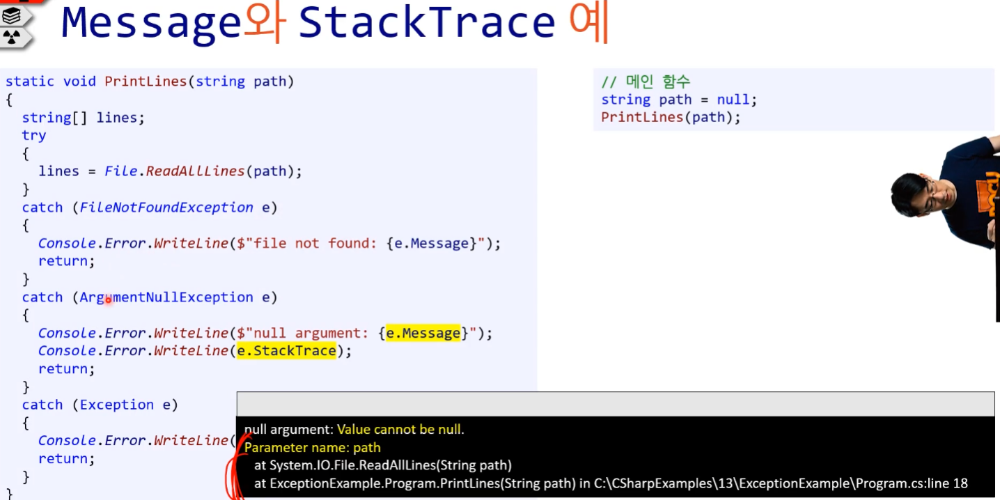

# 예외 처리

## 2. 예외 처리

* **Exception** : 예외


### 2.1. 예외 처리란?

#### 1) 예외처리

---

김포프의 주장 : 중요하지만 프로그래밍 동작에 아주 강하게 작용하지는 않는다.
( 논쟁 지점 )

---

* 특별한 처리를 요구하는 비정삭적인 혹은 예외적인 조건
* 프로그래머가 충분히 예측이 가능하기 때문에 거기에 대한 특별한 처리, 대응을 하라는 것이다.
  ( 방지는 못한다. )
* 예외를 제대로 처리하지 않으면 정상적인 프로그램 실행 순서가 망가진다.
* 선형적이었던 프로그래밍 실행 순서에 나타난 복병
* 예외를 어려워하고 실수를 많이 하는 이유는 선형적이지 않은 프로그래밍 순서이기 때문이다.


#### 2) 예외적인 조건

* 충분히 예측이 가능한 것
* 그러가 프로그래머가 미리 완벽히 방지할 수 없는 것
* 방지는 못하나 예외적인 조건이 발생할 대 **대응하는 것은 가능**

[참고 1] 프로그램을 짜보고 가장 먼저 해야 할 일이 망가뜨려보는 것이다. 어떻게 하면 망가뜨릴 수 있는지 어떻게 하면 방지 할 수 있는지 파악해야 한다.

[참고 2] 예전에 예외가 들어왔을 때 이 이상의 것을 예외로 하자는 경우도 많았고, 아직도 논쟁이 많다.

---

* 예외적인 조건을 제대로 처리해야 예외조건 발생 후에도 프로그램이 정상적으로 돈다. 

  * 그러나 생각보다 제대로 하긴 어려운 것이다. ( 말이 쉽지 어렵다. )
    ( 구글 검색어 : exception safe programming )

---


### 2.2. try / catch 블록

#### 1) try / catch

* try 블록 안에 있는 코드를 순서대로 실행하려고 시도
* 아무 문제 없이 try 블록의 마지막 줄까지 실행 했으면 계속 코드 실행 ( catch 블록은 건너 뛴다. )
* 만약 예외가 발생하면 아직 실행되지 않은 try 블록 안의 모든 코드를 건너 뛴다.
  * 발생한 예외를 처리하는 catch 블록이 있다면 그 안에서 문제 해결
    * [주의!] try문 안에 있는 코드들 중 예외가 발생한 지점부터 그 아래 코드는 전부 무시 
          ( 단, finally 제외 )
  * 없다면 그 예외는 **<u>호출자에게 던져 짐</u>** ( throw )
  * 내 함수 안에서 catch를 못 받았으니, 위의 함수로 올라간다. 
  * 그러다가 Main 함수 까지 올라가서 catch를 안하면 프로그램 위로 올라가 버리고 디버그가 잡아서 보여준다.


**[ 예외 예시 - FileNotFoundException ]**

```csharp
...
{
	if (!File.Exists(path)
	{
		return;
	}

	string[] lines;
	try
	{
		lines = File.ReadAllLines(path);
	}
	catch(FileNotFoundException e)
	{
		Console.Error.WriteLine($"file not found: {e.Messgae}");
        return;
	}
	catch (Exception e)
	{
		Console.Error.WriteLine($"exception: {e.Message}");
		return;
	}
	...       
}
```


---


#### 2) 다수의 catch 블록

* catch 블록은 여러 개가 있을 수도 있다.
* 위에 있는 catch 블록부터 평가한다.

---

* 특정한 예외를 catch 하고 싶다면 전용 예외 클래스를 사용한다.

  (ex) `FileNotFoundException`, `ArgumentNullException`

* 그 외 모든 예외를 catch 하고 싶다면 Exception 클래스를 사용한다.
  (ex) `Exception e`

```csharp
...
{
	string[] lines;
	try
	{
		lines = File.ReadAllLines(path);
	}
	catch (FileNotFoundException e)
	{
		Console.Error.WriteLine($"file not found: {e.Messgae}");
		return;
	}
	catch (ArgumentNullException e)
	{
		Console.Error.WriteLine($"null argument: {e.Message}");
		return;
	}
	catch (Exception e)
	{
		Console.Error.WriteLine($"exception: {e.Message}");
		return;
	}
	...       
}
```


#### 3) 모든 예외 처리 Exception 

* 개별적인 예외를 처리하지 않고 처음부터 모든 예외를 처리하기 위해 `Exception` 클래스를 쓰는 경우도 있다.
  * 예전에는 하지 말라는 사람들도 있었는데 요즘에는 이렇게 사용하는 경우가 꽤 있다.
  * case by case : 어떤 경우에는 하나 씩 catch 하는 게 좋을 때도 있고, 한 번에 처리하는 게 좋을 때도 있다.
  * 한 번에 처리할 경우 제품 동작에 문제가 없으면 상관이 없는데 제품 동작에 문제가 있을 경우 그것도 올바른 방향은 아니다. 

* `Exception` 클래스에 존재하는 모든 프로퍼티와 함수는 다른 예외 클래스에서도 사용할 수 있다.

```csharp
try
{
	lines = File.ReadAllLines(path);
}
catch (Exception e)
{
	Console.Error.WriteLine($"exception: {e.Message}");
	return;
}
```


#### 4) Message / StatckTrace

##### (1) Message

* 멤버 변수
* 발생한 예외의 내용
  * 현재 발생한 예외가 왜 발생했는지 설명한다.

```csharp
// try 블록 생략
...
catch(FileNotFoundException e)
{
	Console.Error.WriteLine($"file not found: {e.Messgae}");
	return;
}
catch (ArgumentNullException e)
{
	Console.Error.WriteLine($"null argument: {e.Message}");
	return;
}
```

```csharp
string Message
```


##### (2) StatckTrace

* 현재 발생한 예외의 호출 스택(call stack)을 보여준다.
  * 호출 스택 : 실행 중인 함수의 호출 정보를 기록한 자료 구조
  * 발생한 예외와 관련된 함수 호출의 정보를 보여 준다.
  * VisualStudio에서 Debugging할 때 볼 수 있다.

* 어느 함수에서 exception이 났는지, 누가 호출이 했는지 트리 구조로 보여 준다.
* e.StatckTrace를 안하고 e만 사용해도 출력이 된다.

```csharp
// try 블록 생략
...
catch(FileNotFoundException e)
{
	Console.Error.WriteLine(e.StackTrace);
	return;
}
catch (ArgumentNullException e)
{
	Console.Error.WriteLine(e.StackTrace);
	return;
}
```

```csharp
string StackTrace;
```


> ---
>
> [참고] '에러'와 '출력'을 따로 구분해서 사용한다.
>
> * stdout : Console.WriteLine();
> * stderr : Console.Error.WriteLine();
>
> ---


**[ 출력 결과 ]**




#### 5) try / catch / finally

##### [ 문제 ] File.Open() 파일에 두 번 쓰다

```csharp
static void Write Byte(string path, byte b)
{
	FileStream fs = null;
	try
	{
		fs = FileOpen(path, FileMode.Open);
		fs.WrtieByte(b);
	}
	catch (Exception e)
	{
		Console.Error.WriteLine($"{e.Message}");
		return;
	}
}

// 메인 함수 안
string path = "USB에 있는 파일 경로";
WriteByte(path, 67);
WriteByte(path, 67);
```


* `WriteAllLines()`나 `WriteAllText()`와 다르게 `Oepn()` 함수를 이용해 연 파일은 반드시 닫는 함수를 호출해야 한다.
* 즉, 예외가 발생했든 안 했든 한 번 열린 파일은 반드시 닫아야 한다.


##### [ 해결 시도1  ] try, catch에 Close() 사용 : 해결 (X)

* `fs.Close();`을 사용하는 것을 통해 해결하려 했다.
* 한계 : catch에서 받을 수 없는 예외가 발생할 경우 문제가 계속 발생한다.
  * 결국 파일 스트림이 제대로 닫히지 않는 상태에서 나가게 되고, 나중에 문제가 발생한다.

```csharp
static void Write Byte(string path, byte b)
{
	FileStream fs = null;
	try
	{
		fs = FileOpen(path, FileMode.Open);
		fs.WrtieByte(b);
		fs.Close();
	}
	catch (Exception e)
	{
		Console.Error.WriteLine($"{e.Message}");
		fs.Close();
		return;
	}
}

// 메인 함수 안
string path = "USB에 있는 파일 경로";
WriteByte(path, 67);
WriteByte(path, 67);
```


##### [ 해결 시도2 ] finally 블록 : 해결 (O)

* <u>예외가 발생하든 안 하든 언제나 최종적으로 실행</u>되는 코드 블록
  * catch 되지 않은 예외가 있어도 실행된다.

* 보통 시스템 리소스들을 해제(release)해 줄 때 많이 쓴다.
  * 시스템 리소스들은 GC가 치워주지 못한다.
  * 직접 해제해주지 않으면 메모리 누수 문제가 발생한다.
  * 파일 핸들이 열려 있기도 하다.
  * 파일 스트림 ( 시스템 리소스의 일부다. )
  * OS 관리해주고, 우리에게 빌려 주는 것 ( 반환 필수! )

```csharp
static void Write Byte(string path, byte b)
{
	FileStream fs = null;
	try
	{
		fs = FileOpen(path, FileMode.Open);
		fs.WrtieByte(b);
	}
	catch (Exception e)
	{
		Console.Error.WriteLine($"{e.Message}");
		return;
	}
	finally
	{
		if (fs != null)
		{
			fs.Close();	
		}
	}
}

// 메인 함수 안
string path = "USB에 있는 파일 경로";
WriteByte(path, 67);
WriteByte(path, 67);
```


### 2.3. 예외 클래스

#### 1) C# 자체 예외 클래스 

* [중요도] 노란색 : 크게 중요하지 않은 내용들이다.
* 더 자세한 내용은 공식문서 참고


#### 2) 커스텀 예외

* 나만의 예외를 만들 수 있다.

* exception도 하나의 클래스다.

[예문] 마이너스 금액이 나오면 예외 처리 하기

( 예시 일 뿐 좋은 커스텀 예외는 아니다. )

```csharp
/* NegativePriceException.cs */

public class NegativePriceException : Exception
{
	public NegativePriceException(string message)
		: base(message)
	{
		...	
	}
}
```

```csharp
/* Program.cs */

static void PrintMenu(List<DisplayMenuInfo> menu)
{
	foreach (var item in menu)
	{
		if (item.Price < 0)
		{
			throw new NegativePriceException("Price cannot be below 0.");		
		}
		Console.WriteLine($"{itme.Name}: ￦{item.Price}");
	}
}
```


##### (1) '커스텀 예외 클래스' 생성 순서

1. 새로운 cs 파일을 만든다.

   (ex) NegativePriceException.cs

2. 클래스명 옆에  `: Exception`을 추가한다.

   * `System.Exception`을 상속한다는 의미이다.

3. 생성자를 만든다.

   * 매개변수는 string message

   * 생성자 선언 바로 밑에 `: base(message)` 를 추가한다.

     => 상속과 관련 된 코드이다. 일단 이렇게 사용하다는 것만 이해하자.

```csharp
/* NegativePriceException.cs */

public class NegativePriceException : Exception
{
	public NegativePriceException(string message)
		: base(message)
	{
		...	
	}
}
```


##### (2) throw 예외를 던지기 - 사용

```csharp
if (item.Price < 0)
{
	throw new NegativePriceException("Price cannot be below 0.");		
}
```

```csharp
throw new <커스텀 예외 클래스>(string message);
```

* throw 키워드를 사용해 커스텀 예외 개체를 던진다. 


##### (3) 커스텀 예외를 catch 블록에서 잡는 법

```csharp
try
{
}
catch (NegativePriceException e)	// 커스텀 예외
{
}
```

* 시스템 예외를 잡을 때와 동일하다.


#### 3) 기타 : catch 블록에서 받은 예외를 다시 던질 수 있나요?

[노란색] 아주 중요하지는 않다.

* 가능하긴다.
  * 쓰는 곳이 아주 가끔 있다.
* 추천하진 않는다.

```csharp
static void WriteFile(string path)
{
	FileStream fs = null;
	try
	{
		fs = FileOpen(path, FileMode.OpenCreate);
		fs.WrtieByte(0xF);
	}
	catch (ArgumentNullException e)
	{
		Console.Error.WriteLine($"null argument: {e.Message}");
		return;
	}
	catch (Exception e)
	{
		Console.Error.WriteLine($"{e.Message}");
		return;
	}
	finally
	{
		if (fs != null)
		{
			fs.Close();	
		}
	}
}
```

* 개발자1 : path가 null일 경우는 여기보다는 호출자가 처리하게 해야지 ( 내 함수가 잘못한 게 아니잖소! )
  * 그리고 아래와 같이 작성한다.
  * **[주의!] 절대 이렇게 예외를 던지지 마라!**

```csharp
// 메인 함수
string path = null;
try
{
    WriteFile(path);
}
catch (ArgumentNullexception e)
{
    // 코드 생략
}
```

```csharp
static void WriteFile(string path)
{
	FileStream fs = null;
	try
	{
		fs = FileOpen(path, FileMode.OpenCreate);
		fs.WrtieByte(0xF);
	}
	catch (ArgumentNullException e)
	{
		throw e;
	}
	catch (Exception e)
	{
		Console.Error.WriteLine($"{e.Message}");
		return;
	}
	finally
	{
		if (fs != null)
		{
			fs.Close();	
		}
	}
}
```


##### (1) `throw e`의 문제점

* 호출 스택을 초기화 해버린다.
  * 즉, 오류가 발생한 위치가 어딘지 알 수 없게 된다.

* 프로그램이 새로운 exception이라고 생각한다.
* 처음 exception이 발생한 곳이라서 생각해서 호출 스택을 거기서 부터 시작한다.
* 사실은 내부에서 발생한 exception인데도 말이다.


**[ 올바른 방법 ]**

* 올바른 방법이지만 사실 잘 안쓴다.
* 주의! `throw e`와 `throw`는 다르다. 여기서 후자가 올바른 방법이다.

```csharp
catch (ArgumentNullexception e)
{
	throw;
}
```


**[ 호출 스택의 차이 ]**


##### (2) 그런데 ... 예외를 다시 던지는게 좋은가?

* 좋은 방법은 아니다.
* 이건 남에게 똥을 전달 전달하는 것과 같은 행위
  * 정말 아주 가끔은 좋을 때가 있다.


### 2.4. 올바른 예외처리 방법 ★

---

* 예외처리 방법에 모두가 동의하는 방법은 없다.
* [김포프의 의견] 김포프가 프로그래밍 하면서 얻은 예외처리 기준이다.
  * 다양한 예외처리 방법에 대한 의견을 듣고 상황에 따라 잘 타협해서 사용할 것을 권고한다.
  * 아래의 내용은 김포프 만의 의견이다.

---


#### 1) 논쟁 : 예외 처리는 정말 훌륭하다?

##### (1) 의문

예외 처리는 훌륭한가?

* 오해가 있을 때는 역사를 보는 것이 좋다.
* 10년 전이나 지금이나 스탠스가 변한 게 없다.


**[ 10년 전 상황 ]**


**[ 10년 후 상황 ]**


##### (2) 결론  : 그렇지 않다.

예외처리는 항상 훌륭하지 않다.

( 맹신이 심하다? )


**[ 역사의 흐름 ]**

* 예외처리 개념이 소개된 건 매우 오래전이다.

* 사용 기간 20년 정도
  * JAVA가 유명해지고 나서 부터 사용 비율이 높아졌다.
  * 프로그램의 안정성을 높여준다는 정말 믿고 싶던 믿음 혹은 맹신

---

* 하지만 결과적으로 너무 고평가 되어 있었다.
* 실버블렛 처럼 포장이 되어서 전달이 되었다.
  * 양쪽 진영에서 계속 논쟁이 되며 한동안 얘기가 많았다. 

---

---

* [문제점] 여전히 똑같은 불만과 피드백
  * 사람들이 쉽게 이해하지 못하고 이용하지 못하는 문제점이 있다.
  * 이유가 뭐든 간에 이건 사람이 쉽게 이해 못한다는 뜻
  * 따라서 실수도 많이 저지를 수 밖에 없다.

* [근거] 예외가 실제 프로그램의 안정성을 높였다는 통계 및 연구결과는 없다.
  * 오히려 그 반대 연구결과가 존재한다.


**[ 예외 상황과 프로그램 안정성 ]**

* 논문 : Exceptional Stiuations and Program Reliability (2008)

  * Weimer, W; Necula, G.C. ACM Transactions on Programming Languages and Systems

  * 5백만 줄 이상의 JAVA 코드를 분석한 결과 1300개의 예외처리 결함을 발견

  * **[예외처리의 가장 큰 문제점]** 프로그래머가 쉽게 예측하기 어려운 코드 실행 순서(경로)가 숨어있다.
    * 변수가 너무 많아져서 프로그래머가 쉽게 예측하기 어려운 실행 경로가 나온다.

* 예외처리의 무분별한 사용을 경계하라는 훌륭한 소프트웨어 엔지니어들의 조언이다.
* 하지만 20년간 다수결에 밀려 무시 받았다.

---

※ 구체적인 내용은 다른 과목에서 배울 예정


#### 2) 베스트 프랙티스

* 아래 내용은 본 강사의 <u>개인적인 의견</u>
* 반대하는 사람도 꽤 있다.
* BUT 최소한 이 방법을 따르면 코드가 깔끔해지고 유지보수가 쉬워 질 것이다.
* [참고] exception 제대로 처리할 수 있는 사람은 10%가 안되었다.


##### (1) 함수의 선조건

* 선조건 : 함수가 실행하기 위해 보장되는 조건 
  ( 조건을 만족하지 않으면 그 책임은 호출자에게 있다. )
* 모든 예외 상황에 예외를 던지라는 주장을 하는 사람도 있다.
* 하지만 많은 경우는 함수의 선조건에 의해 처리 가능하다.
  * 잘못된 입력값을 절대 함수에 전달하지 말 것
  * 잘못된 입력값이 전달되는 코드를 작성했다면 Assert()로 개발 중에 잡을 것
  * 혹시라도 못 잡으면 배포(release) 버전 실행 중에는 오작동 가능
  * QA 테스트를 돌리면서 실제 문제 있는 코드들을 충분히 QA하는 것이 문제지, 코드에서 exception 던진다고, 코드 품질이 보장되는 것은 아니다.


---

* 함수 이름, 변수명, 반환형이 제대로 되어 있다면 보는 순간 사람들이 상식적으로 알아야 하고, 실수할 가능성이 적다. 그런데 여기서 사람들이 실수할 가능성이 1% 되고 이걸 예외를 던지라는 거는 예외가 던져졌을 때 그 처리를 제대로 못할 수 있는 사람의 확률이 1% 이상이기 때문에 오히려 안 좋은 방향이라고 생각한다.
* 정말 완벽하게 동작하는 코드를 만들기 위해서는 무조건 예외를 던지는 게 맞지만 사람들이 그걸 쓰면서 제대로 쓸 수 없다는 통계가 나온 상황에서는 실수가 적은 쪽으로 갈 수 밖에 없다.
* 그래서 선조건이 맞다고 생각한다.

---


**[ '함수의 선조건 처리'가 불가능한 경우 ]**

프로그래머가 함수에 어떤 입력값이 들어올지 컨트롤 할 수 없을 때

1. 외부로 부터 들어오는 값
   * 유저가 프로그램 실행 중에 직접 입력하는 값
   * 외부에서 유입되는 데이터 ( 예 : 웹 요청 )
   * (ex)숫자로 써달라고 했는데, 문자로 적었을 때
2. 라이브러리 배포 및 사용
   * 소스코드가 없는 외부 라이브러리의 기능만 이용 하는 경우
     * (ex) 파일을 오픈 할 때 파일이 없을 때 발생하는 예외
   * 내 코드가 라이브러리로 판매 되는 경우
     * 외부 사람들이 내 코드를 사용하는데 문제가 발생할 경우 exception을 던져서 처리할 수 있게 만들어 줘야 한다. ( 상대방이 내 소스코드가 없기 때문이다. )


**[ '함수의 선조건 처리'가 가능한 경우 ]**

* 내 라이브러리 내 회사에서 쓸 때
* 외부에 공개가 안될 때
* 데이터가 내가 컨트롤이 가능할 때


##### (2) 입력값 검증 ( input validation )

* 유저가 입력하자마자, 웹 request가 오자 마자 검증을 하면 된다.
* 우리가 생각하는 유효한 값 인지만 판단을 하자는 의미이다.
* 유저 입력을 그대로 내부 함수에 전달하지 말 것

---

* 그 전에 유저 입력값이 유효한지 검증

  1. TryParse()와 같은 함수 사용
  
  * false 나면 유효한 값이 들어간다는 보장이 없기 때문에 out 매개변수 값은 사용하지 않는게 좋습니다.

  2. 유효하지 않다면 곧바로 유저에게 오류메세지를 보여줄 것
  
  3. 유효한 경우에만 내부함수로 전달
  
  ```csharp
  double num1;
  if (!double.TryParse(Console.ReadLine(), out num1))
  {
  	Console.WriteLine("Please enter integer only!");
  }
  // num2는 동일해서 생략
  double result = Divide(num1, num2);
  ```

---

* 기타 등등을 판단한 다음에 유효하지 않으면 거기서 연산을 멈추고 나를 호출한 유저에게 그 때 예외를 던지든 에러 코드나 메세지를 보여줘서 유저가 고칠 수 있게 하든 딱 경계 상황에서 해주면 된다.
* 일단 그 검증을 패스했다면 그 이후 아무런 이상한 데이터가 안 들어 온다는 가정 하에 함수 선조건에 맞춰서 프로그램을 짤 수가 있다.


**[ 유효성 판단이 어려운 경우 ]**

* DB 데이터베이스를 접근하는 함수를 호출하기 전에는 데이터가 있는지 모른다. 
  그때는 함수를 호출해야 한다. 

  거기서 유효하지 않은 데이터가 올 수도 있다. 그런 경우에는 어쩔 수 없이 예외를 던져야 할 수도 있지만 그 보다는 김포프 회사에서는 예외를 던지지 않는다 이다. TrySomething() 같은 함수를 쓰거나 오류 코드를 써서 실제 함수를 호출했을 때 거기서 유효한 값이 없으면 데이터가 날라오게 그 유효한 데이터는 if문으로 검사하게 찾을 수 없어라고 말하게 한다. 무작정 exception을 던지지 않게 한다. 외부에서 들어오는 데이터도 마찬가지다.

  결과적으로는 입력 값 검증하고, 검증 틀리면 잘못했다고 반환(exception 이나 에러코드)해주고, 내부로 타고 들어가면 내부 함수에서는 exception은 던지지 말자는 얘기이다. 실수가 있었던 어떤 방식을 만들자 단 exception은 쓰지 말자. exception은 외부에서 내부로 들어올 때 딱 경계에서 있게 되고, 내부는 exception이 없게 도니까. 사람들이 볼 때도 코드가 일직선이 된다. 누가 exception을 catch해야 하나 걱정도 줄어들게 된다. 

* 입력값의 완벽한 유효성 판단이 어려운 경우 내부 함수가 확인 후 bool 도는 오류코드 반환

  * 좋은 예 : TrySomething() 함수

    ```csharp
    static bool TryOreder(int id)
    {
    	if (/* DB에서 id가 존재하는지 확인 */)
    	{
    		return false;
    	}
    	
    	return true;
    }
    ```

* 외부에서 들어오는 데이터에도 마찬가지


##### (3) 예외 vs 오류코드 

---

* 내부 함수 호출했을 때 내부에서 원치 않는 결과 있을 때 어떻게 판단할 것인가? 

  **[ MS의 입장 ]**

  * MS에서 나온 Exception Best Practice에서는 이런 경우 예외를 던지라고 한다.
  * if문을 사용해서 함수 호출시 오류 코드(boolean 값이나 enum 값) 반환으로 실패하게 되었을 경우에는 잘못된 연산을 하지 말아야 한다.
  * 그런데 호출자가 그걸 까먹고 if문을 안 넣은 상황에서는 이 연산이 실행이 되었다는 가정 하에 다음 연산을 계속 할테니까 잘못된 연산을 할 수 있다는 것이다.
  * 그럴 때 차라리 Exception을 던져 넣으면, 호출자가 그걸 catch하지 않으면 계속 Exception이 위로 올라가면서 request가 전체가 fail 되면서 좀 던 안전하다는 것이다.

  **[ 김포프의 입장 ]**

  * 동의 하지 않는다.

  * 첫 번째, 함수의 시그니처 만으로 어떻게 사용(조건문을 넣어야 한다는 것)해야 할지 알 수 있고, 리뷰를 통해 지적도 가능하다.

    *  빨리 잡을 가능성이 높다.

  * 두 번째, Exception을 사용할 경우 Exception이 날 거라는 걸 생각하지 못한다.

    * 함수를 호출했을 때 무사히 호출 된다고 가정하지 Exception이 날 거라는 것을 생각하지 못한다.
    * 함수 이름에도 써져 있지 않다. 
    * 함수 내부를 보지 않는 한 모르는 것이다.

  * 세 번째, Exception의 실패 오작동

    * 중간까지 동작한 이후 예외가 날 경우 원칙상 중간 코드가 복구가 시켜야 하는데 그렇지 않고 모든 게 실패할 수 있다.
    * 이렇게 되면 문제가 되는 부분을 바로 잡기도 어려워 진다. ( 눈에 안 보인다. )

    * 실패 할 경우 정상적으로 동작할 가능성이 낮다.

  * 정리

    * 퍼펙트한 월드에서는 MS가 말하는 것이 말이 되긴 한다.
    * 하지만 실제 사람들하고 일하는 상황에서 실수하는 상황이 발생할 경우 이 실수를 빨리 바로 잡는 것에 집중한다면 내부적으로 Exception을 던지지 않는 게 맞다. ( 이 부분이 MS와 김포프가 의견이 달라지는 부분이다. 그 외에는 같다. )

---

* 다른 사람이 내 라이브러리를 잘못 호출할 때 예외를 던지는 것은 괜찮다.
* 그 대신 오류코드 또는 오류 개체를 반환하는 것도 가능하다.
  * bool TrySomething(out int result) 함수
  * EError TrySomething(out int result) 함수
  * Result<int> DoSomething() 함수
    * Result에는 int 결과와 오류코드를 나타내는 열거형이 들어가 있다. 
    * 함수명만 봐도 알 수 있다.


**[ 결론 ]**

**예외는 경계에서 바로 처리한다.**

* 앞의 입력값 검증도 이 원칙을 따르는 것이다.

* 다른 라이브러리를 호출할 때 예외가 나올 경우

  * 이 예외를 처리 안하고 호출자에게 넘기면 과연 제대로 처리할까? ( X )
    호출자가 자신이 처리 해야 하는 것 알까? ( X )
    제대로 처리할 수 있을까? ( X )
  * 내가 내부에서 처리하는 게 낫다. 
    ( 다른 사람에게 예외를 떠넘기지 마라. )

  


**[ 경계에서 처리하는 코드 ]**

* 내부에서 오류코드를 반환해서 처리한다. ( ex. false )
* MS의 Exception Best Practice에서도 가능하면 Try로 해결한다.
  * Try로 해결이 안될 경우 
    * MS는 예외 코드를 던지라고 말한다.
    * 포프는 오류코드를 반환하는 게 실수를 덜 유발 시킨다는 입장이다.

```csharp
bool TryPrint(string path)
{
    if (!File.Exists(path))
    {
        return false;
    }

    string[] lines;

    try
    {
        lines = File.ReadAllLines(path);
    }
    catch (Exception e)
    {
        Console.Error.WriteLine(e.Message);
        return false;
    }

    foreach (var line in lines)
    {
        Console.WriteLine(line);
    }

    return true;
}

```


