# 25 파일 스트림


## 3. 파일 스트림

### 3.1. 파일 스트림 탄생계기

#### 1) [ 문제 ] 기존 파일 입출력 방법 

```csharp
string[] lines = File.ReadAllLine(@"C:\CSharpExamples\13\students.txt");
byte[] bytes = File.ReadAllBytes(@"C:\CSharpExamples\13\binaryFile.txt");
```

* 파일 컨텐츠를 전부 다 메모리로 읽어온다.
* 만약, 파일 요량이 엄청 크다면? (ex. 10GB)
  * 메모리에 부담
  * 한 번에 조금씩 읽어서 처리하는 게 더 나음
  * 이 파일의 일부분만 읽고 싶으면 그 읽을 위치로 점프한 뒤 그 부분만 읽는 게 좋다.
* 이걸 할 수 있는 게 `파일 스트림`이다.


#### 2) [ 해결법 ] 스트림이란?

* 데이터의 입력이나 출력을 줄줄이 순서대로 한다고 해서?
  * (ex) 네트워크 패킷
  * (ex) 웹 브라우저에서 이미지 뜰 때 한 번에 뜨지 않고 줄줄이 뜨는 경우
    * 한 번에 오지 않고 주르륵 온다.


---

* 파일도 그렇게 볼 수 있다. ( 파일 스트림 )

* 메모리에 저장 된 데이터도 그렇게 볼 수 있다. ( 메모리 스트림 )

* 스트림에 따라 원하는 위치로 읽기 쓰기 위치를 건너뛸 수도 있다.


**[ 파일 스트림 읽기 - 예문 ]**

* 아래 예문에서는 예문으로 쓰기에 코드가 복잡하다는 이유로 Exception 처리를 기입하지 않았지만
* 파일을 읽을 때 마다 Exception 처리하는 게 옳긴 옳다. 
* 중간 중간 오류 나는 건 try-catch 해야 한다.

---

[중요] `FileStream fs = File.Open(path, FileMode.Open)`, `fs.ReadByte()`, `fs.Close()`

```csharp
static void ReadByte(string path)
{
	FileStream fs = File.Open(path, FileMode.Open);
	
	for (int i = 0; i< fs.Length; ++i)
	{
		int value = fs.ReadByte();
		Console.Write($"{value} ");
	}
	
	fs.Close();
}

static void Main(string[] args)
{
    string path = @"C:\CSharpExamples\13\students.txt";
    ReadByte(path);
}
```

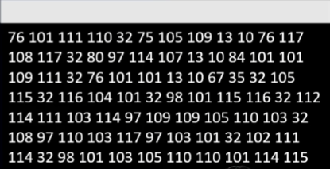


### 3.2. 파일 스트림 ( 함수 )

#### 1) 준비

##### (1) File.Open()

```csharp
FileStream fs = File.Open(path, FileMode.Open);
```


* File.Open()은 파일 모드에 따라 파일을 연 뒤 FileStream을 반환한다.


##### (2) FileMode

[노란색] 중요도

* 파일 모드 : 읽기, 쓰기, 추가 등 다양하게 있다.
* Create와 Open이 다르다 라는 것을 중점적으로 기억하자.

---

---

* CreateNew : 새로운 파일을 만든다. 이미 파일이 있다면 예외(IOException)가 발생한다.
* Create : 새로운 파일을 만든다. 이미 파일 이 있다면 덮어쓴다. 단, 숨긴 파일이면 예외(UnauthorizedAccessException)이 발생한다.

---

* Open : 이미 존재하는 파일을 연다. 파일이 없다면 예외(FileNotFoundException)가 발생한다.
* OpenCreate : 파일이 없다면 만들고, 있으면 존재하는 파일을 연다.

---

* Truncate : 이미 존재하는 파일을 연다. 파일을 여는 순간 기존에 있던 내용은 모두 사라진다. 이 모드로 연 파일을 읽으려고 하면 예외(ArgumentException)가 발생한다.
* Append : 파일이 없다면 만들고, 있으면 존재하는 파일을 연다. 열면 기존 파일의 맨뒤를 가리키고 있다. 파일 끝이 아닌 위치를 탐색하려고 하면 예외(IOException)가 발생한다. 그 외의 읽기 실패의 경우도 예외(NotSupportedException)가 발생한다.

---


##### (3) FileStream 프로퍼티

* 어떤 파일 스트림(읽기 전용, 쓰기 전용) 인지 판단할 수 있다.

```csharp
FileStream fs = File.Open(path, FileMode.Open);

if (fs.CanRead) {}
if (fs.CanWrite) {}
if (fs.CanSeek) {}
```


* CanRead
  * 스트림 읽기를 지원하면 true를, 아니면 false를 반환
* CanWrite
  * 스트림 쓰기를 지원하면 true를, 아니면 false를 반환
* CanSeek 
  * 스트림 탐색을 지원하면 true를, 아니면 false를 반환
    ( 검색이라고도 하는데 탐색이 더 적절한 표현이다. )
  * 처음 부터 읽을 수 있느냐? 중간 부터 읽을 수 있느냐?
    점프하는 것을 허용 하는 가를 알아보는 것이다.


#### 2) 읽기 

##### (1) ReadByte()

```csharp
FileStream fs = File.Open(path, FileMdoe.Open);
for (int i = 0; i < fs.Length; ++i)
{
	int valu = fs.ReadByte();
	Console.Wrtie($"{value} ");
}
```


* 파일로 부터 한 바이트씩 읽어오는 함수
* 파일을 끝까지 다 읽으면 -1 을 반환한다.
  * 그래서 byte가 아니라 int가 반환형
* 파일을 모두 읽으려면 반복문을 돌려야 한다.
* [단점] 반복문 돌려서 끝까지 돌려야 한다. 
      ( 아니면 -1 반환 할 때 까지 돌려야 한다.)


##### (2) Read()

* 한 번에 읽는 방법이다.

```csharp
FileStream fs = File.Open(path, FileMdoe.Open);

byte[] values = new byte[fs.Length];
int n = fs.Read(values, 3, 5);
```

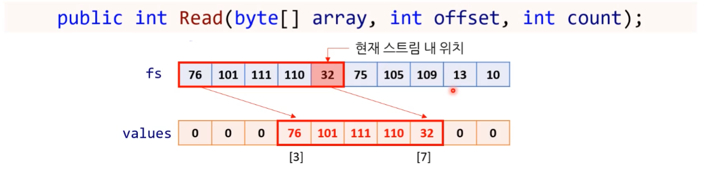

* 스트림에서 **count** 만큼의 바이트를 읽어와서 array[offset] 부터 array[offset + count - 1]에 집어 넣는 함수 

---

* byte[] array : 최종적으로 값을 읽어온 배열
* offset : 배열 크기를 잡아 놓고 중간부터 채워 넣을 수 있다는 의미이다.
* count : 몇 바이트 읽어 올 지


##### (3) ReadByte() / Read() 문제점

* 바이트 또는 바이트 배열만 읽을 수 있다.
  * 바이트 단위로만 읽힌는다.
  * 즉, 텍스트 파일도, 일진 파일도 모두 바이트로 보인다.


* 텍스트 파일일 때는 string으로 저장하거나 읽어 오고 싶고,
  이진 파일일 때는 long으로 쓰고 싶은데
* 바이트로 읽어오면 하나 하나 변환해야 하는 불편함이 있다.


#### 3) 쓰기

##### (1) WriteByte()

* 파일에 한 바이트씩 쓰는 함수

```csharp
FileStream fs = File.Open(path, FileMdoe.OpenOrCreate);

fs.WriteByte(0x73);
```


**[ 파일 스트림 쓰기 - 예문 ]** 

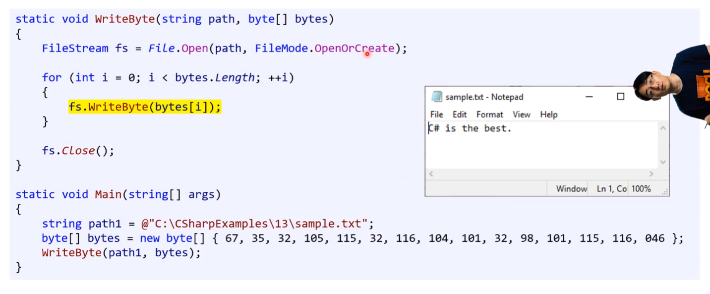


##### (2) Write()

* Byte 쓰기를 통째로 한다.

```csharp
FileStream fs = File.Open(path, FileMdoe.OpenOrCreate);

byte[] bytes = new byte[] { 73, 32, 108, 111, 118, 101, 32, 67, 35, 32 }
fs.Write(bytes, 0, 4);
```


* `FileMdoe.OpenOrCreate`
* 스트림에 `array[offset]`부터 `array[offset + count - 1]`의 내용을 쓰는 함수

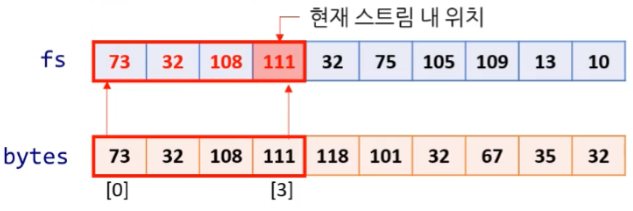


#### 4) 수정 / 닫기

##### (1) Seek()

* 읽는 위치나 쓰는 위치를 바꾸는 함수

```csharp
FileSteram fs = File.Open(path, FileMode.OpenOrCreate);

byte[] bytes = new byte[]  { 73, 32, 108, 111, 118, 101, 32, 67, 35, 32 };
fs.Write(bytes, 0, 4);	// { 73, 32, 108, 111, 32, 75, 105, 109, 13, 10}
fs.Seek(0, SeekOrigin.Begin);
fs.Write(bytes, 0, bytes.Length);	// { 73, 32, 108, 111, 118, 101, 32, 67, 35, 32 }
```


* 현재 스트림의 위치를 origin + offset 으로 이동시키는 함수
* **SeekOrigin** ( 기준점 )
  * **Begin** : 스트림의 제일 처음 위치
  * **Current** : 스트림의 현재 위치
  * **End** : 스트림의 제일 마지막 위치


##### (2) Close()

* 현재 열려 있는 스트림을 닫는 함수

```csharp
FileStream fs = File.Open(path, FileMode.OpenOrCreat);
fs.Write(bytes, 0, 4);
fs.Close();
```


##### (3) using 문 ★

---

**[ Close() 호출을 까먹으면? ]**

* 언젠가는 GC가 지울 때 대신 Close() 호출해 주긴 한다.

  ( 하지만 그게 언제가 될지 모른다. )

* 그전까지 파일이 열려 있고, 거기에 다른 코드가 다시 열려고 한다면 오류가 일어 날 수 있다.

  * 너무 까먹기 쉽다.
  * **using 문을 쓰면 해결 가능하다!**


---

* 지금까지 사용했던 using System과 다른 것이다. ( 동명이인 )

  * `using System` ( X )
  * `using (FileStream fs = File.Open(path, FileMode.Append))` ( O )


* 시스템 리소스(파일이나 OS 자원 등)를 사용하는 클래스 들은 Dispose()란 함수를 구현하는 경우가 있다. 
  * 소스 코드에서 파일스트림 클래스 F12 누른 다음 내부 볼 수 있다.
  * 아래에 Dispose()라는 함수가 있는 경우 대부분 using을 쓸 수 있다.

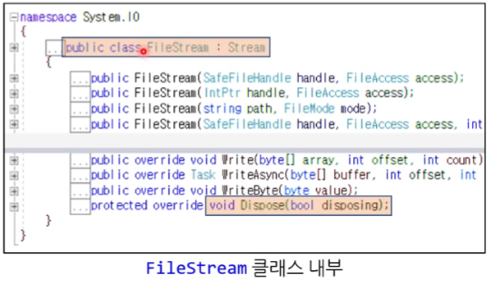


* 이 때 using문을 사용하면 그 블록이 끝나는 곳에서 알아서 Dispose()를 해출해주고, 이건 다시 Close()를 호출한다.

* 아래의 조건이 하나라도 만족하면 무조건 using문을 사용하자.

  1. 클래스 헤더에 `IDisposable`이란 게 보인다. ★ 
     (ex) `class A : IDisposable` 
  2. 멤버 함수로 `Dispose()`가 있다.

  * 이 2가지 경우로 대부분 using문을 사용할 수 있다. 
    ( 쉽게 생각해서 using 써보고 컴파일 오류 발생하면 사용하지 않으면 된다. )

* 이해가 안 된다면 "이 블록 안에서만 `FileStream fs`를 사용 할 테니 끝나면 알아서 지워줘"라고 이해하는 편이 좋다. ( 아직은 이해하기 어렵다. )

  ```csharp
  using (FileStream fs = File.Open(path, FileMode.Append))
  {
  	fs.Write(bytes, 0, bytes.Length);	// OK
  }
  fs.Write(bytes, 0, bytes.Length);		// 컴파일 오류
  ```

  * fs 범위가 using 범위 안에서 사용해야 된다. 범위 밖에서 사용할 경우 컴파일 오류 발생


**[ 예시 ]**

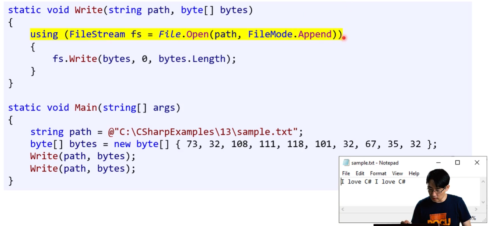


#### 5) Stream / Binary

파일 스트림 바이트 밖에 못쓰는 문제 해결하기


##### (1) StreamWriter

텍스트를 스트림에 쉽게 쓰게 해주는 클래스

* StreamWriter - 개체 생성하기

  ```csharp
  var writer = new StreamWriter(File.Open(path, FileMode.OpenOrCreate));
  ```

  

  * `File.Open()`은 반환 값으로 `FileStream` 개체를 준다.
    => 이 개체는 `Stream` 개체라 볼 수 있다. ( 나중에 자세히 알아보기 )


* Write, WriteLine - 파일에 텍스트를 쓰는 함수들 

  ```csharp
  writer.Write(message);
  writer.WriteLine(message);
  ```

  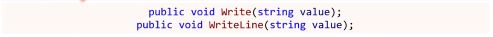


---


**[ 문자열을 텍스트에 쓰기 ]**

* 파일 스트림 바이트 밖에 못쓰는 문제 해결하기

```csharp
string path = @"C:\CSharpExamples\13\diary.txt";
string message = "C# is so fun!";

using (var writer = new StreamWriter(File.Open(path, FileMode.OpenOrCreate)))
{
	writer.Write(message);
	writer.WriteLine(message);
	writer.WriteLine(message);
}
```

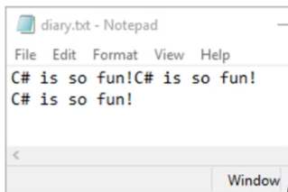


**[ StreamWriter 처음부터 쓰기 ]**

처음부터 다시 쓰고 싶다면 Seek을 사용해서 내부에 있는 스트림을 처음으로 돌린 후에  StreamWriter을 새로 만들어서 사용해야 한다.

[주의!] Seek을 사용해서 내부에 있는 스트림을 처음으로 돌려도, StreamWriter을 자신을 위치 굳건히 지키면서 계속 진행을 한다. 

```csharp
...
    
using (StreamWriter writer = new StreamWriter(File.Open(OUTPUT_FILE_FULL_PATH, FileMode.OpenOrCreate, FileAccess.Write)))
{
	writer.Write(allText);

    foreach (string line in allLines)
    {
    	writer.WriteLine(line);
    }

    	writer.BaseStream.Seek(0, SeekOrigin.Begin);  // 이렇게만 작성하면 맨 끝에 놓인다.
        writer.Write("Overwritten text");
	}
}
```


##### (2) StreamReader

스트림에서 텍스트를 쉽게 읽어올 수 있는 클래스

* StreamReader - 개체 생성하기

  ```csharp
  var reader = new StreamReader(File.Open(path, FileMode.Open));
  ```

  

  * `File.Open()` 은 반환 값으로 `FileStream` 개체를 준다.
    => 이 개체는 `Stream` 개체라 볼 수 있다. ( 나중에 자세히 알아보기 )


* ReadLine, ReadToEnd - 파일에서 텍스트를 읽는 함수들

  * Stream에서 Read를 사용할 때는 ReadToEnd() 보다 ReadLine()을 사용하는 것이 적절할 수 있다.

  ```csharp
  string line = reader.ReadLine();		// 한 줄 읽기
  string text = reader.ReadToEnd();		// 모든 텍스트 읽기
  ```

  


**[ 파일에서 텍스트 읽기 ]**

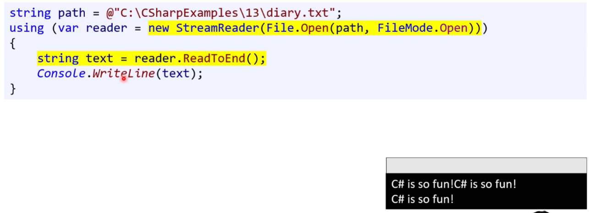


##### (3) BinaryWriter

데이터를 이진 스트림에 쉽게 쓸 수 있게 해주는 클래스

* BinaryWriter - 개체 생성하기

  ```csharp
  var writer = new BinaryWriter(File.Open(path, FileMode.OpenOrCreate));
  ```

  

  * `File.Open()` 은 반환 값으로 `FileStream` 개체를 준다.
    => 이 개체는 `Stream` 개체라 볼 수 있다. ( 지금은 자세히 몰라도 된다. )


* Write - 이진 스트림에 이진 데이터 쓰기

  * 수 많은 Write() 오버로드 함수가 있다.

  ```csharp
  writer.Write(3.14);
  writer.Write("Hi");
  ```

  


**[ 이진 파일 쓰기 ]**

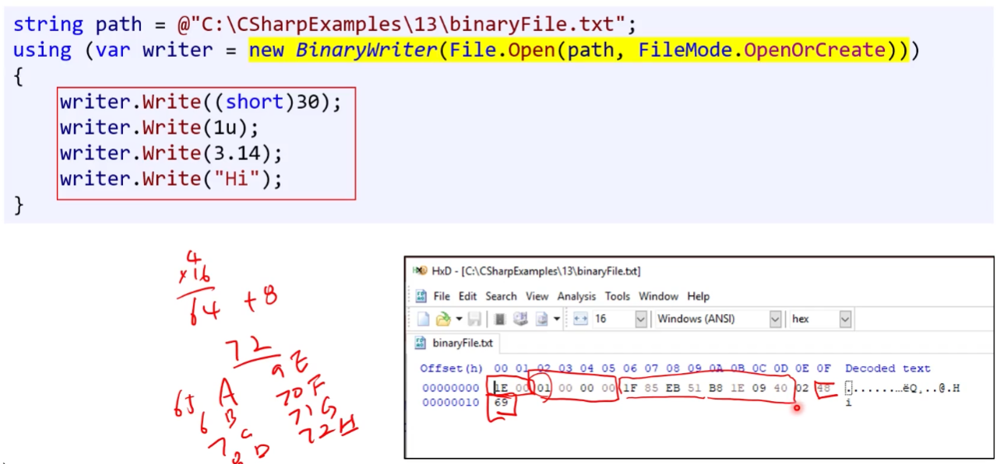


##### (4) BinaryReader

이진 스트림을 쉽게 읽어올 수 있는 클래스

* BinaryReader - 개체 생성하기

  ```csharp
  var reader = new BinaryReader(File.Open(path, FileMode.Open));
  ```

  

  * `File.Open()` 은 반환 값으로 `FileStream` 개체를 준다.
    => 이 개체는 `Stream` 개체라 볼 수 있다. ( 지금은 자세히 몰라도 된다. )


* ReadXXX - 이진 스트림에서 이진 데이터 읽기

  * 다양한 ReadXXX() 함수가 있다.
  * [주의!] 오버로드 함수가 아님, 이름이 다양한 함수를 사용한다.

  ```csharp
  short shortVal = reader.ReadInt16();
  uint uintVal = reader.ReadUInt32();
  double doubleVal = reader.ReadDouble();
  string stringVal = reader.ReadString();
  ```

  


**[ 이진 파일 읽기 ]**

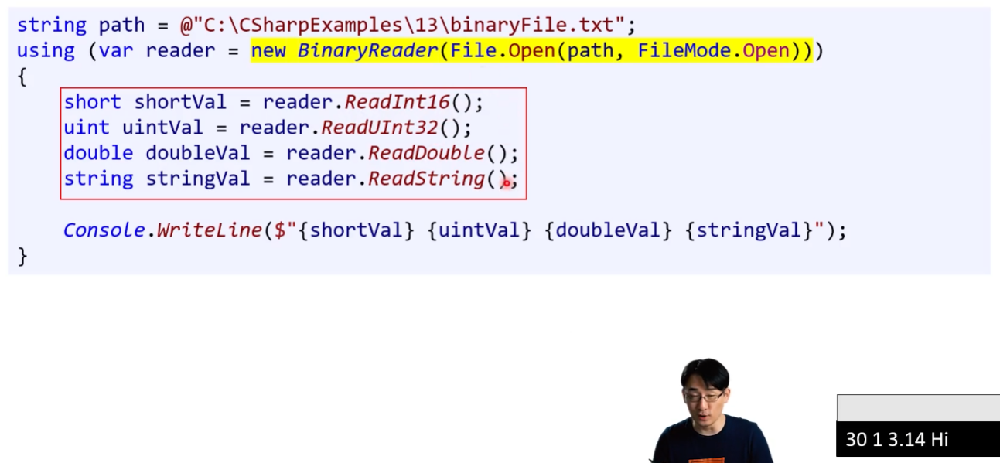


##### [ Bonus : 파일 대신 메모리에 저장하고 싶다면? ]

* StreamReader는 이름부터 FileStreamReader가 아니다.

* 따라서 파일 스트림 외에 다름 스트림하고도 사용 가능하다.

* 대표적인 예가 **MemoryStream**

  * 파일이 아니라 메모리에 쓰고 그로부터 읽고 싶을 때 사용한다.
  * 파일 : 파일들이 저장되는 공간 - HDD / SSD
  * 메모리 : 임시 저장 공간 - RAM

  

  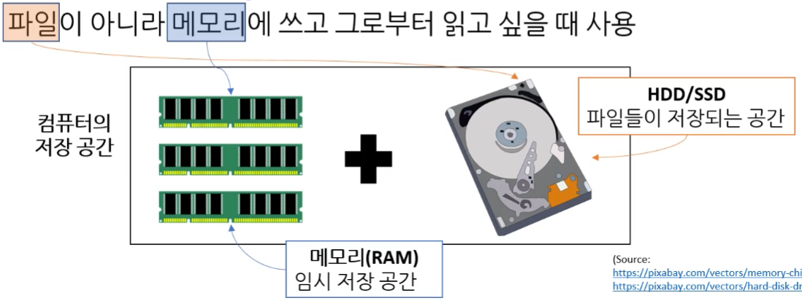


**[ using의 범위 ]**

* using의 범위가 같은 경우 겹쳐서 사용하기도 한다.
  * 각각의 using 범위 - 빨간색 괄호
  * [참고] 예시문은 여러 경우를 보여주기 위해 이런 방식으로 코드 작성한 것일 뿐 엄밀히 따지면 3가지의 using문은 같은 범위에 있다.
* 동일한 memoryStream을 사용하고 있기 때문에 `Write`이후에 스트림이 위치가 바뀐다. 그러니 `Seek`를 사용해서 위치를 조정한 후 사용하는 것이다.

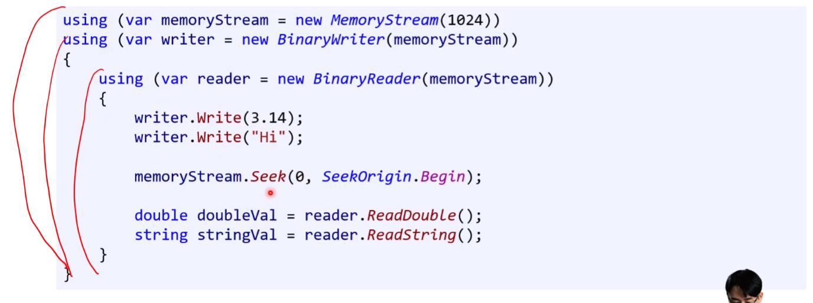

