# 파일과 디렉터리


## 파일


### 왜 정적 함수인가?

* 파일 시스템은 자잘하게 쪼개기 어렵다.


### File.Exists()

* 여러 가지의 경우에 따라 false를 반환한다.
* File.Exists() 이 함수 만큼은 예외처리 하지 말고 사용하라고 준 함수이다.
  * 예외처리 안 할 수록 빠르다. 

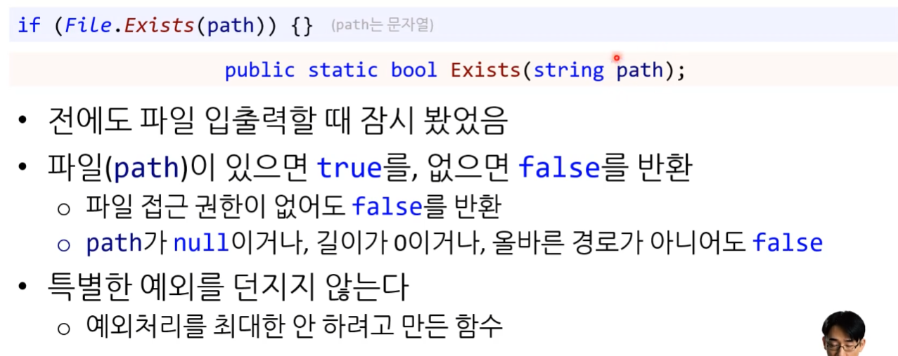


### File.Move()

* rename이 같이 들어가 있는 함수이다.
  * 옮기면서 이름을 바꿔 줄 수도 있다.

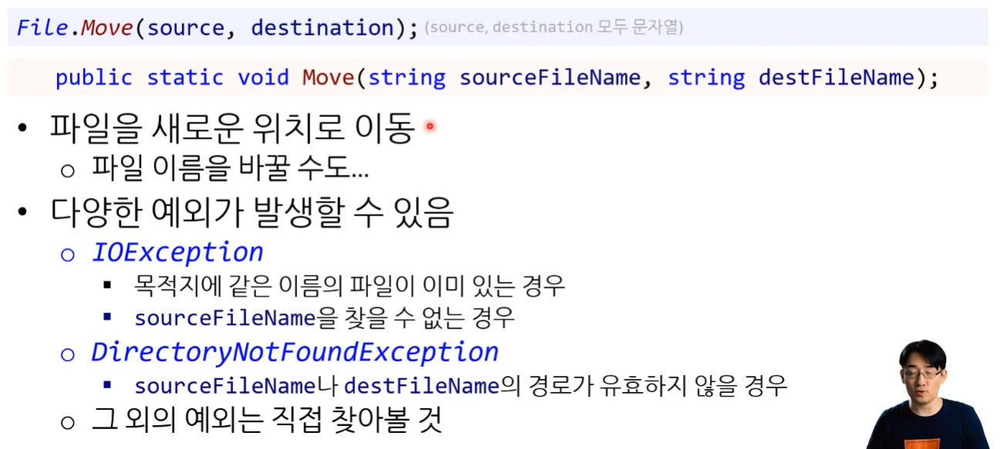


### is 키워드

* 호환이 되는 형태인지 확인

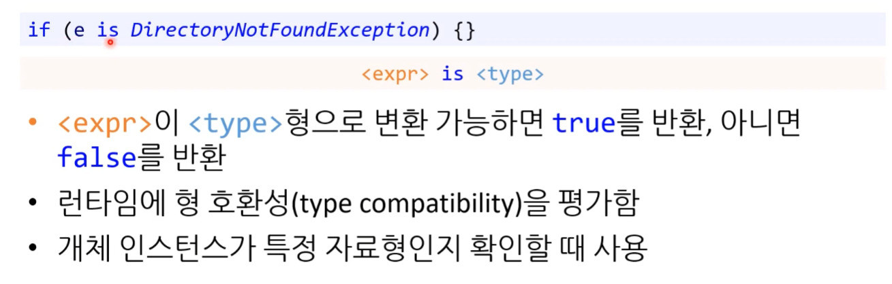


 **[ 파일 이동하기 - 코드 예시 ]**

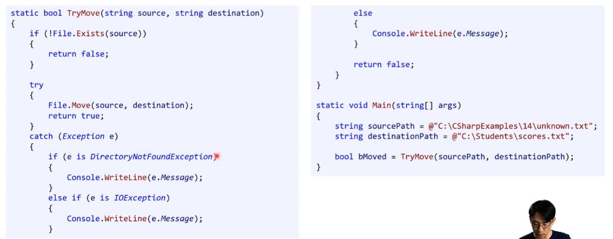


[ 파일 이동하기 - 성공시 ]

```csharp
if (!File.Exists(source))
```

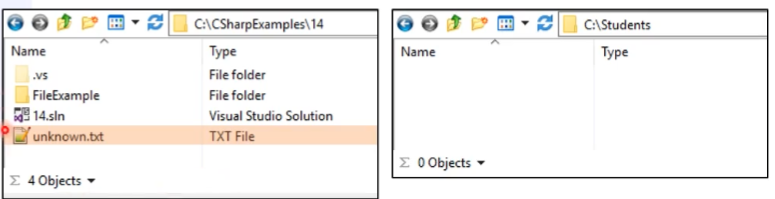


```csharp
File.Move(source, destination);
```

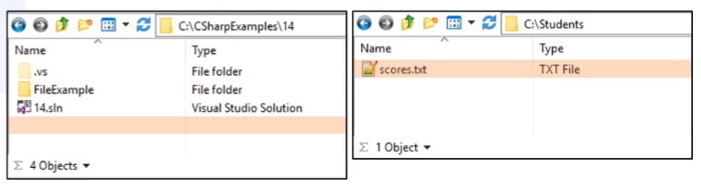

* 마지막 : return true


**[ 파일 이동하기 - 실패시 : 목적지에 이미 파일이 있는 경우 ]**

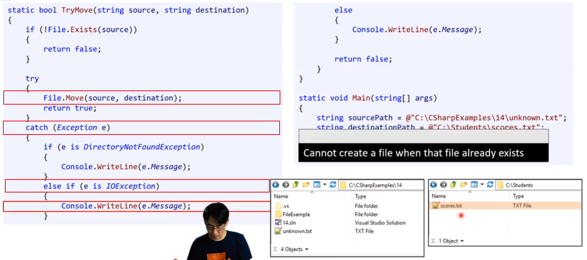

* 마지막 : return false


**[ 파일 이동하기 - 실패시 : 잘못된 경로 ]**

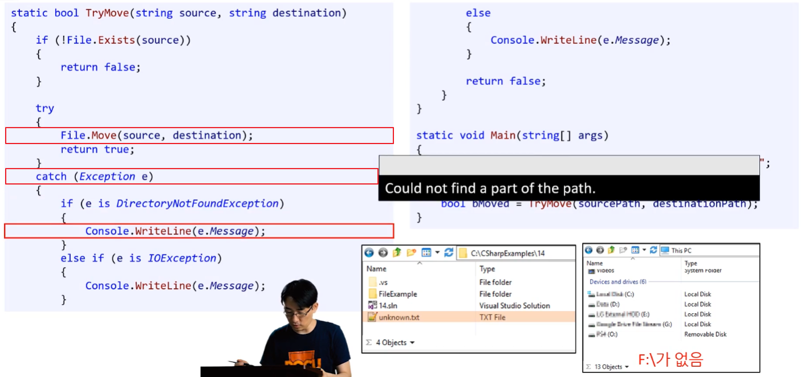

* 마지막 : return false


**[ 파일 이동하기 - 실패시 : 기타 실패 ]**


### File.Copy()


### File.Delete()

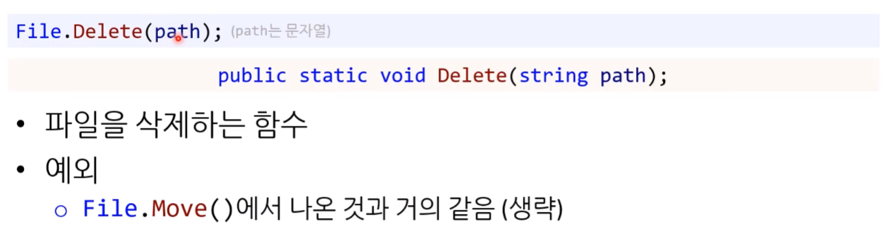


### File.Encrypt() / File.Decrypt()

[중요도] 노란색

* 흔히 쓰이는 방식은 아니다.
* 다른 좋은 방식들이 있다. 일단 알아 만 두자.


## 디렉터리


### 디렉터리란?

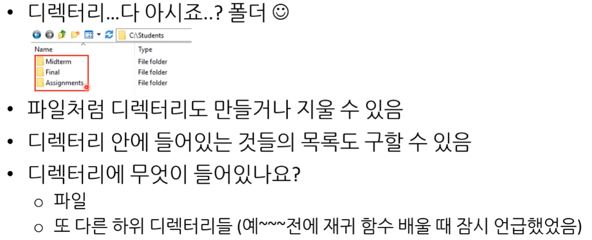


### Directory.Exists()

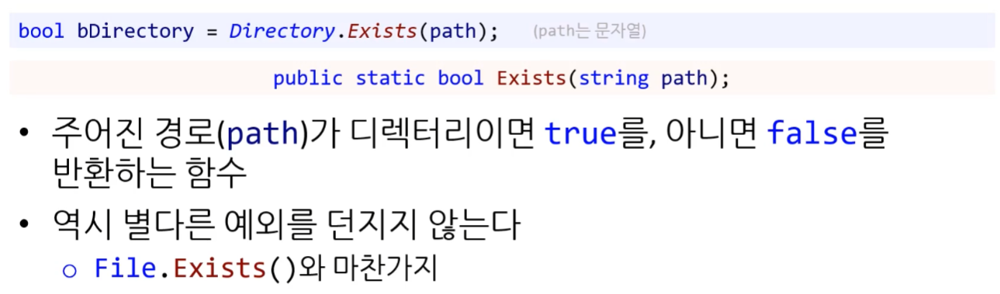


### Directory.Move()

* 디렉터리를 새로운 위치로 이동 시키는 함수

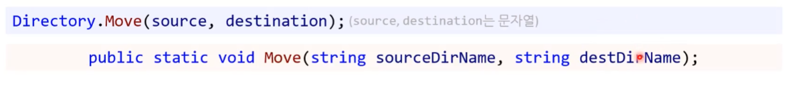


### Directory.CreateDirectory()

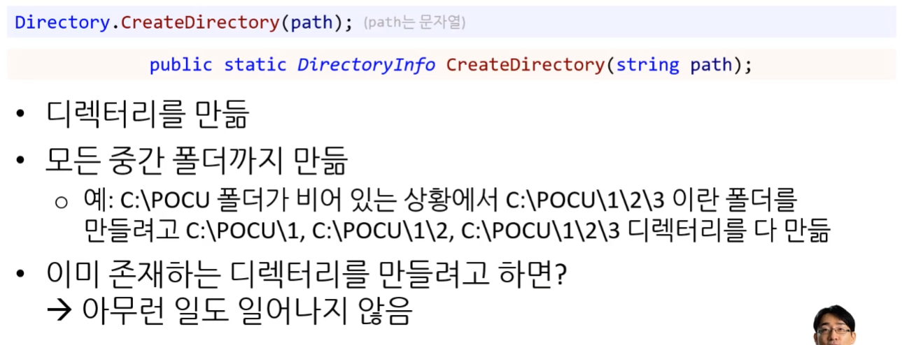


### Directory.Delete()

* 매개변수로 경로만 사용하면 빈 디렉터리만 지우는 함수가 된다.

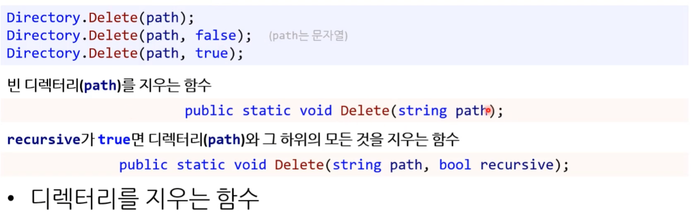


### Directory.GetDirectories() 1

* top-level에만 있는 하위 디렉터리 반환


### Directory.GetDirectories() 2


* * 정규식 : SearchPattern을 10 단계 정도 업그레이드 한 것이다.
    * 강력하지만 읽기 복잡한 부분이 있다.
    * 이걸 쓰면 편한 부분이 가끔 있다.


### Directory.GetFiles() 1

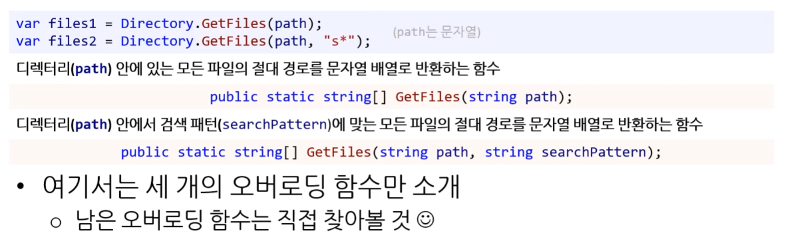


### Directory.GetFiles() 2


* 하위의 모든 디렉터리를 찾아오기 때문에 절대 경로를 반환한다.


**[ 재귀함수 때 잠시 봤던 의사코드 ]**

중요도 : 노란색


### ~~Directory.Copy()~~

* **이런 함수 없음!**
  * for 문 돌려가면서 해야한다.
  * 재귀함수로 만들기 좋다.


## 경로

생각보다 실수를 많이 하는 부분이다.

C#에서는 이런 실수를 방지하기 위한 좋은 함수들을 제공한다.


### 경로란?


### 용어 정리 


* `..\` : '이전 경로' 부터 시작
* `.\`   : '현재 경로' 부터 시작


### 문제점

#### 문제1 : 운영체제마다 경로 구분자가 달라진다.

* 윈도우 : 역슬래쉬( \ )
* 리눅스, 맥 : 슬래쉬 ( / )
  * .NET으로 여러 플랫폼에 사용하려 하면 문제가 발생할 수 있다.

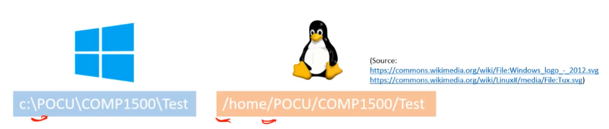


#### 해결1 : Path.DirectorySeparatorChar

* 현재 실행되고 있는 운영체제에서 어떤 게 경로를 구분하는 문자 인지를 반환 해주는 프로퍼티다.

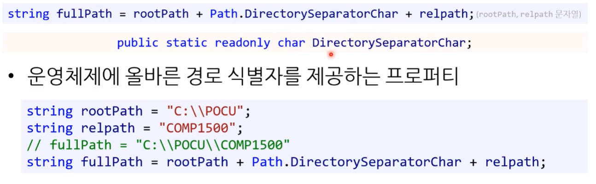


---


#### 문제2 : 경로를 합칠 때 구문 문자 중복/누락

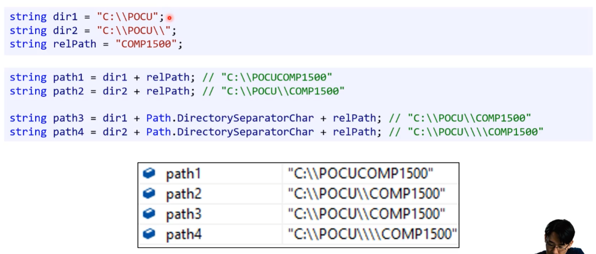


#### 해결2 : Path.Combine()

* Path 클래스를 사용해서 여러 개의 문자열을 파일 경로로 합칠 수 있다. 
* 경로 만들 때는 언제나 Path.Combine()을 쓰는 게 좋다. ( + 쓸 이유가 없다. )


```csharp
private static readonly string OUTPUT_FILE_FULL_PATH = Path.Combine(CURRENT_DIRECTORY, "output", "outputtext.txt");
```


#### 문제3 : 파일 또는 폴더 이름만 가져오기 불편


* 확장자만 때고 가지고 오고 싶은 경우에도 사용이 어렵다.
* 어려운데 너무 귀찮고, 실수하기도 쉽다. 


#### 해결3 : GetFileName() / GetFileNameWithoutExtension()

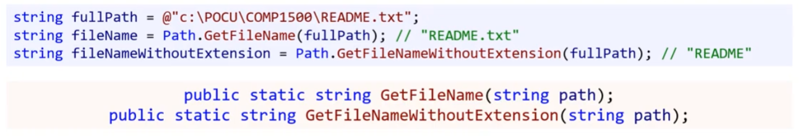

* 이를 해결하기 위한 함수들이 다 존재한다.
* 경로에서 파일 이름을 추출 하는 함수


#### 해결3 : GetDirectoryName()

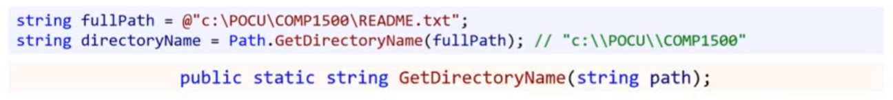

* 경로에서 디렉터리만 추출 하는 함수


#### 문제4 : 확장자 관리도 마찬가지 문제

바꿔주기 번거롭다.

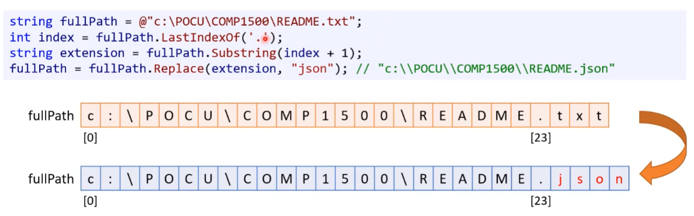


#### 해결4 : GetExtension() / ChangeExtension()

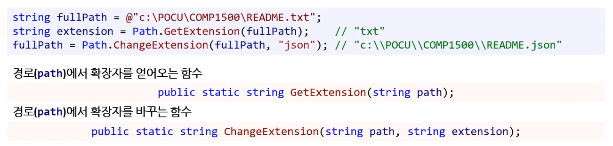


#### 문제5 : 절대 경로 구하기?

명령 프로프트에서 나오는 것 처럼 경로를 구하고 싶은데 번거롭다.


#### 해결5 : Path.GetFullPath() 1

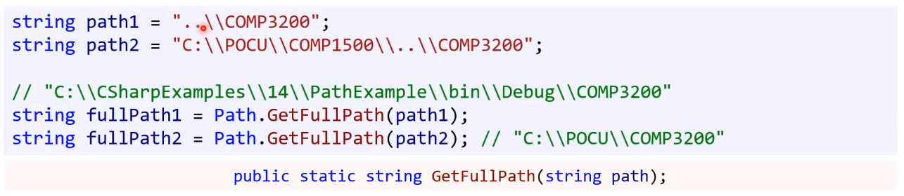

* 경로(path)의 절대 경로를 반환하는 함수
* path1 : `..\`로 기준 `.Net` 경로 제거하고 절대 경로로 반환 
* path2 : `..\`로 기준 `COMP1500` 경로 제거하고 절대 경로로 반환


#### 해결5 : Path.GetFullPath() 2

* [중요도] 노란색
* 이 방식은 어떤 매개변수가 어디에 있는지 헷갈리기 때문에 많이 쓰이지는 않는다.
  ( 매개변수 순서 자체가 특이하다. basePath를 앞에 적어야 할 것 같은데 말이다. )

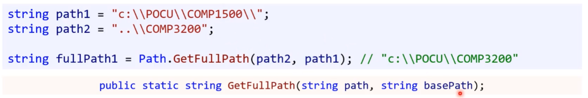

* 기본 경로(basePath)와 상대 경로(path)를 토대로 절대 경로를 반환하는 함수


#### 문제6 : 상대 경로 구하기?

* 마찬가지로 귀찮다.


#### 해결 6 : Path.GetRelativePath()

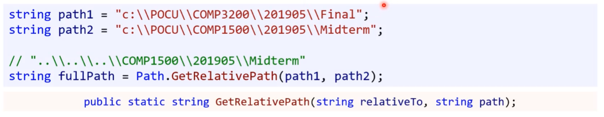

* 한 경로(relativeTo)에서 다른 경로(path)까지의 상대 경로를 반환하는 함수


* Directory.GetCurrentDirectory() 
  현재 실행 컨텍스트의 경로를 가져옴

  * 이건 프로그램의 빌드 아웃풋 경로, bin/Debug/net6.0

  ```csharp
  private static readonly string CURRENT_DIRECTORY = Directory.GetCurrentDirectory();
  ```


