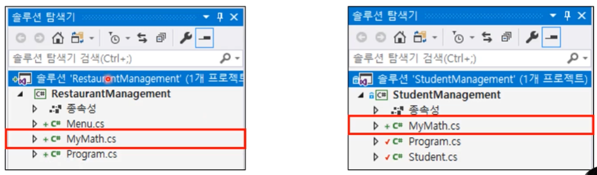
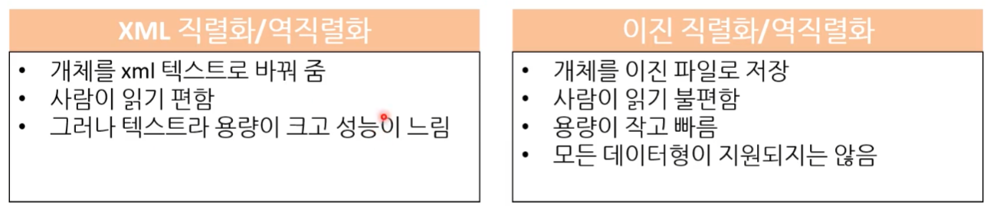

# 나만의 라이브러리, 직렬화

## 1. 나만의 라이브러리

[ 예시 - 두 프로그램의 공통점 ]

두 프로그램에서 사용하면 좋겠다.

### 문제점 : 프로젝트 다름

* 각 프로젝트에 MyMath 클래스를 만들어야 한다.
  => 즉, 코드 중복이 발생한다.
* **여러 프로그램(exe 파일)에서 공유할 수 있는 코드는 공유하면 좋다.**

### 해결 : 클래스 라이브러리 프로젝트

* 공통으로 사용하는 코드를 클래스 라이브러 프로젝트로 만들 수 있다.
* 이제 다른 프로젝트에서 위 프로젝트를 공유 가능하다.

**[ 비주얼 스튜디오 솔루션과 프로젝트 ]**

* 비주얼 스튜디오에서 솔루션은 한 개 이상의 프로젝트를 가질 수 있다.
* 중복 코드 부분을 클래스 라이브러리로 따로 만들 수 있다.

#### 1) 클래스 라이브러리 만들기

---

* 라이브러리를 사용할 것이라는 의미로 '참조 추가'를 하면 된다.

#### 2) 클래스 라이브러리 배포

* 요즘은 dll 파일로 배포하기 보다 NuGet을 통한 방법을 많이 사용한다.
  * 유료 또는 무료 두 가지 다 있다.

#### 3) 남의 라이브러리 쓰기

* 소스 파일 까지 원하면 유료로 구매해야 할 것이다.

* 하지만 요즘은 주로 패키지 관리자(NuGet)을 사용한다.

* [주의!] NuGet 패키지가 다 좋은 것은 아니다. 
  * 유지보수도 안되고, 버그도 많은 것들이 있기도 하다. 
  * 그러니 잘 판단해서 사용하는 것이 좋다. ( 만들 수 있는 건 만들고, 써먹을 수 있는 건 쓴다. )

## 2. 직렬화

지원하는 언어가 있고, 지원하지 언어가 있다.

언어에서 실행 도중에 어떤 객체나 클래스라던가 데이터 종류를 알 수 있고, 모든 멤버변수를 확인할 수 있는 언어 라면은 직렬화를 하기 쉽다. 그 반대의 경우는 직렬화를 지원하기 어렵다.

* 지원 하는 언어 : C#, JAVA

* 지원 안 되는 언어 : C, C++

### 파일 저장이 필요한 이유

* 편하지 않았다 귀찮았다.

### 편하게 저장하고 로딩하고 불러오고 싶다!

### 직렬화(serialization)와 역직렬화(deserialization)는?

**[ 사전적 의미 ]**

* 직렬화 : 연속적으로 무언가를 만들자.
* 역직렬화 : 직렬화의 반대

---

### 직렬화 방법1 : 직접 Save() 함수를 구현

* 클래스마다 Save() 함수를 만든다.
  * BinaryWriter를 이용해서 파일에 적으면 끝!
* 수동과 차이가 없다.........

* **어떤 언어에서는 이런 방법을 사용해야 한다.**
  * **하지만! C#에서는 다른 방법이 있다!**

### 직렬화 방법2 : Serializer를 이용

* .Net 에서 기본적을 지원
* 여러 종류의 시리얼라이저(serializer)가 있다.

#### XML 직렬화 / 역직렬화

* XML : 정형화 된 문서 형식

#### 이진 직렬화 / 역직렬화

### 이진 / XML / JSON

#### 이진 vs XML

* 이진 직렬화는 모든 데이터형이 지원되지 않았기 때문에 생각보다 많이 쓰이지 않았다.
* 따라서 특별한 경우가 아니면 보통 텍스트 형태로 한다.
* 과거에는 XML이 많이 썼었는데 요즘은 잘 안 쓰이는 편이다.
* 현재 대세는 JSON

#### JSON vs XML

* 둘 다 그냥 어떤 규격을 따르는 **문서** ( 그 이상도 이하도 아님 )
  * 둘 다 텍스트 파일이다. 약간의 규격이 있다. 

* XML 장점 : 좀 더 체계화 되고 정형화 되어 있기 때문에 어떤 데이터를 잘못 넣었을 때 올바른 데이터 인지 확인하는 방법이 있다. 그걸 스키마를 이용한 데이터 검증 방법이라고 한다. 그래서 좀 더 정형화 된 데이터를 좋아하는 경향이 있다.
* XML 단점 : 시각적으로 보기 힘들다. 그래서 JSON의 점유율이 높아지고 있다.

### 직렬화 방법3 : JSON 직렬화

* C# 자체에서 지원하지는 않음
* 하지만 아주 많이 쓰는 라이브러리가 존재한다.
* **Json.NET (Newtonsoft)**
  * 대동단결
* 누겟(NuGet)으로 배포
* 공짜고 막강하다.

#### Json.NET 설치

---

* TIP : 버전이 꼬일 수 있기 때문에 최대한 패키지 관리 할 때는 솔루션에서 오른쪽 버튼 눌러서 모든 프로젝트가 동일한 버전으로 사용하게 만드는 것이 좋다.
* 설치만 하면 알아서 '종속성 참조'도 설정되기 때문에 쓰기만 하면 된다.

---

#### Json.Net 직렬화 예

#### Json.Net 역직렬화 예

#### Json.Net 딕셔너리 사용 가능

* 깊은 복사
  * list를 깊은 복사하기 어렵기 때문에 JSON을 활용해서 깊은 복사를 할 수 있다.
  * 꽤 느린 연산 중에 하나다.
  * 가장 손쉽게 코딩 적게 하고, 오브젝트를 복사 하는 방벙이 위의 코드다.