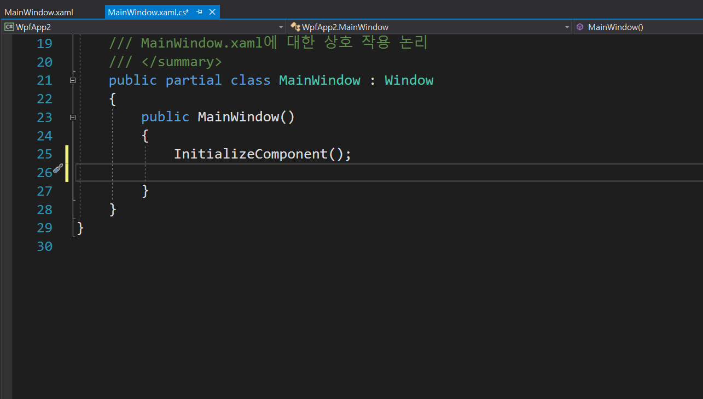
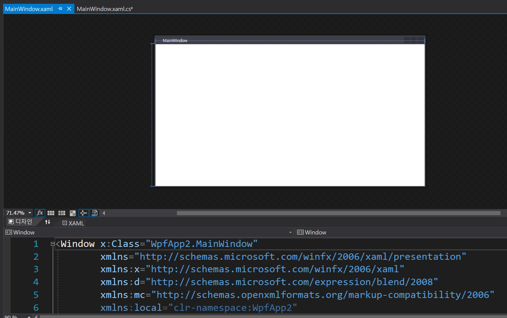

## UI 프레임워크

### Winform 

Winform의 경우 .Net 1.0 부터 지원되었고, 이는 드레그 앤 드롭 방식으로 자신이 생성하고 싶은 컨트롤을 UI 개발창에 올리면 자동으로 코드가 생성되고, 결과는 개발자가 볼 수 있는 방식이였습니다. 

### WPF

Wpf의 경우 .Net 3.0 부터 지원이 되었고, Winform이 갖고 있던 다양한 한계를 해결하고 만들어졌습니다. 그래서 Winform에 비해서 더 다양한 기능과 확장성을 갖고 있습니다. 

Winform에서는 Form이라면 Wpf에서는 Control이 있습니다. Control을 상속 받아서 다양한 Control이 생성되는데요. Window, UserControl, Button 처럼 다양한 Control을 만들 수 있습니다. 

처음 Wpf 프로젝트를 생성하면 MainWindow.xaml 이라는 것을 볼 수 있는데요. 이는 C# 코드와 xaml 코드가 합쳐진 형태입니다. 그래서 xaml 코드를 이용해서 디자인 작업을 하고 C# 코드를 이용해서 필요한 기능을 구현하기도 합니다. 

왼쪽이 C# 코드이고 오른쪽이 xaml 코드입니다. 실제로 xaml 코드는 다양한 곳에서 사용되는데요. 여기서 xaml은 Extensible Application Markup Language 의 약자로 흔히 마크업 언어라고 불리는 언어들 중에 하나인데요. 인터넷 브라우저에서 F12를 누르면 나오는 코드들과 비슷한 형태의 코드라고 보시면 됩니다.

---

WPF는 Winform의 한계를 극복하기 위해서 그리고 더 다양한 확장성을 갖기 위해서 만들어진 UI 개발 프레임워크인데요. 처음 WPF와 Winform을 접하는 분들에게는 Winform 더 직관적이고 쉬울 수 있으나, 실제 실무에서는 Winform 보다는 Wpf를 더 많이 사용하고 있고, 다양한 클라이언트의 요구를 만족시키기 위해서라도 Wpf가 더 좋은 선택이라고 생각하는데요. 한번 배우는데, 오래 걸리고 MVVM이나 Binding, DependencyProperty 와 같은 생소한 개념들이 있기 때문에 거부감이 들 수 있지만, 이러한 기능들은 개발자의 편의를 위해서 개발된 기능이기 때문에 충분히 익힌다면, 오히려 도움이 될 것이라고 생각합니다. 

WPF를 이용하면 Winform에 비해서 쉽게 웹으로 확장이 가능하기 때문에, 추후 다양한 영역에서 자신의 가치를 올릴 수 있을 것이라고 생각하네요. 

### xaml

Extensible Application Markup Language라는 뜻으로 결국엔 마크업 언어라는 것입니다. 

* https://tip1234.tistory.com/212여기부터 할 차례
* https://tip1234.tistory.com/213?category=842024
* https://tip1234.tistory.com/214?category=842024