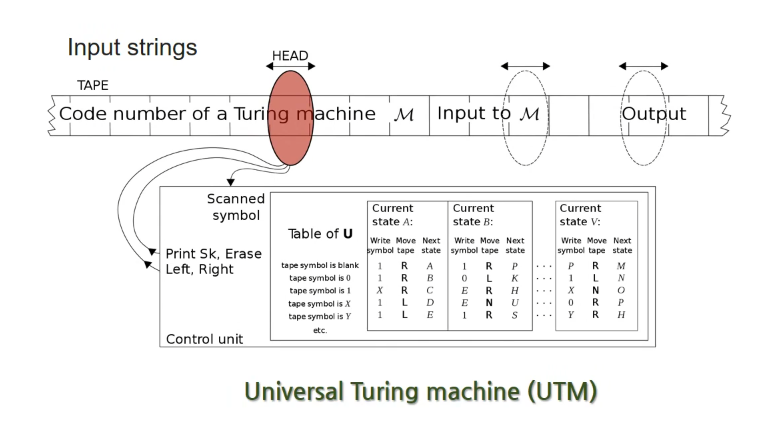

# 01 컴퓨터의 역사

## 1. 반도체

### 1) 반도체란?

* **반도체란 무엇인가?** 123
  * 전압 조건에 따라 전기가 흐르는 물질이다.

* **반도체를 어떻게 활용하는가?** 123
  
  |
  
  * 2진법 사용할 수 있다.
  
  * '논리소자'로 0과 1을 구분 지어 사용할 수 있게 된 것이다.
  
    

* **[참고] 도체와 부도체** ㅇㅇㅇ
  * 도체 : 전기가 흐르는 물질 
    (ex) 구리, 철, 금, 물, 몸 - 전기 저항이 0에 수렴
  * 부도체 : 전기가 흐르지 않는 물질 
    (ex) 그릇, 세라믹[전선 주변 감는 것], 돌 - 전기 저항이 거의 무한대

### 2) 반도체 역사

* **최초의 반도체는 무엇인가?** 12

  |

  * 트랜지스터

* **트랜지스터는 현재 어떻게 사용하고 있는가?**  12
  * '집적 회로'처럼 세밀하게 담아 사용한다.

* **[참고] 에디슨 효과 ( 리처드슨 효과 )** ㅇㅇㅇ

  * 전구 발명 => 열전자 방출 - 발견
  * 리차드슨 효과 : 열에 의해 에너지를 얻은 전자가 원자의 구속에서 벗어나 고체 표면에서 튀어나오는 것으로, 마치 액체 표면에서 증기가 증발하는 것과 비슷하다.
    * 즉, 필라멘트가 뜨거워지면서 전자를 방출한다.
  * 전구의 필라멘트와 양극화된 금속판(플레이트)사이에 전류가 흐르는 현상(열전자 방출)을 발견하였고, 1883년 이를 에디슨 효과라고 이름 붙였다.
    * [참고] 양극화 : 두 개의 전극 사이에 전류가 흐를 때에, 전위가 높은 쪽의 극.

  

  

* **[참고] 진공관  - 1세대 부품**ㅇㅇㅇ

  - 진공관 Vacuum tubes - 열전자 방출 효과로 만든 장치

  - 내부가 진공인 유리관에 음극(cathode)과 양극(anode)의 두 전극이 있고, 두 극 사이의 전위차에 의해 두 극 사이에 전자가 이동하여 전류가 흐르도록 만든 전기 장치이다. 

  - **진공관 디이오드**
    필라멘트가 (-)전극에 금속판이 (+)극에 연결 되어 있으면, 이 전자들은 (-)전하를 가지므로 전기력에 의해 금속판으로 끌려간다. 
    그러나 전극을 반대로 연결하면 금속판은 가열되지 않아 열전자를 방출하지 않으므로 전류가 흐르지 않게 된다. 

    따라서 <u>한 방향으로 전자가 흐르는 다이오드 역할</u>을 하게 된다.

              

* **[참고] 트랜지스터 - 2세대 부품 ★★★** ㅇㅇㅇ
  * **<u>최초의 반도체</u>**
    * 인간은 탄소가 핵심 물질이고, 
    * <u>컴퓨터는 트랜지스터가 핵심 물질</u>이다.
      * 그리고, 트랜지스터의 핵심 물질은 규소(실리콘)이다.
  
  * 트랜지스터 Transistor 
  
    * 3개의 다리로 전기를 제어한다.
      * **(1) 전기가 들어오는 부분**
      * **(2) 전기가 나가는 부분**
      * **(3) 전압 조절**
  
    * 진공관 보다 작게 만들 수 있고, 안전하다. 
    * [참고영상] 트렌지스터의 원리 : https://youtu.be/7ukDKVHnac4?t=137

* **[참고] 다이오드와 트랜지스터의 차이** ㅇㅇㅇ

  * **다이오드 ( np ) ( - + )** 
    
    * 2개 실리콘 - led
    
  * **트랜지스터 ( npn ) ( - + - )**
  
    * 3개의 실리콘 
    * p에 전압을 주어서 켯다 끄는 것
  
    1. 스위치 기능  :  컴퓨터에서 중요한 기능이다.
       - 전기만 가지고 수 억개를 조정할 수 있다.
       - 2진법
         - 1bit - 1트랜지스터
  
    2. 증폭 기능  :  컴퓨터에서는 그닥 중요하지 않은 기능이다.

* **[참고] 집적 회로 ( IC ) - 3세대 부품 ★★★** ㅇㅇㅇ

  * 1958년, 텍사스 인스트루먼트에서 일하던 잭 킬비가 만들었다. 

  * 수 많은 트랜지스터와 기타 부품들을 작게 모아서 구현한 부품 이다.
  
    * 트랜지스터, 다이오드, 저항, 캐패시터 등 복잡한 전자부품들을 정밀하게 만들어 작은 반도체 속에 하나의 전자회로로 구성해 집어 넣는다.

    * 반도체를 하나씩 따로 따로 사용하지 않고 실리콘의 평면상에 몇 천개 몇 만개를 모아 차곡차곡 쌓아놓은 것이다. 
      ‘모아서 쌓는다’ 즉, 집적한다고 하여 집적회로(IC)라는 이름이 붙게된 것이다.
  
  * [ 기능에 따른 부품 ]
  
    * 기능에 따라 다양한 제품의 핵심 부품으로 사용되고 있다.
  
    * [메모리 반도체]
  
      * 휘발성 메모리 - DRAM, SRAM 등
      * 비휘발성 메모리 - Mask ROM, PROM, EPROM, EEPROM, 플래시 메모리, 옵테인 메모리 등
  
    * [비메모리 반도체]
    
      * 디지털 집적 회로 - CPU, GPU, ASIC
      
      > ---
      >
      > **CPU**
      >
      > 2020년 현재 컴퓨터의 CPU는 대개 20억~400억 개의 트랜지스터를 포함한 집적 회로로 구성되어 있다. 
      >
      > 만약 집적 회로 없이 트랜지스터 100억개를 일반 회로(분리형 회로, discrete circuit)에 얹으려면 약 100 헥타르, 즉 1 km²의 면적의 회로 기판이 필요할 것이다. 
      >
      > ---
  
    

​                         

### 3) 반도체 생산 과정

* **반도체 생산 과정을 간단하게 나열 하시오.** 123
  1. 모래
  2. 규소 ( 실리콘 Slicon )
  3. 고체 실리콘
  4. 실리콘 웨이퍼
  5. 직접회로 생산

* **[참고] 반도체 생산 과정을 상세히 설명하시오.** ㅇ

  * 모래

  * 규소 ( 실리콘 Slicon )
    열을 가해 불순물 제거하여 순수한 실리콘 용액을 만든다.

  * 고체 실리콘 ( 잉곳 )

    고체표면에 붙여서( 돌리면서 끌어올리기) 커다란 고체 실리콘을 만든다.

  * 실리콘 웨이퍼 
    잘라서 실리콘 원판 만들기 ( 웨이퍼 한 장 당 수백 개의 반도체가 된다. )

    [참고 동영상] [[3분차이\] 반도체란 무엇일까? | 반도체 제조공정 | 웨이퍼](https://www.youtube.com/watch?v=2DHAGw274U4)
    [참고 동영상] [반도체 실리콘 웨이퍼는 어떻게 만들어질까? - SK 실트론](https://www.youtube.com/watch?v=ad-fZDchlo0&t=2s&ab_channel=SKsiltron)
    
  * 직접회로 생산 ( IC : Integrated Circuit )
  
    실리콘 원판을 가지고 회로 깔기 등 여러 단계를 거쳐 최종적으로 우리가 아는 IC 칩이 완성된다.
    
    [참고 동영상] [From Sand to Silicon: the Making of a Chip | Intel](https://www.youtube.com/watch?v=Q5paWn7bFg4)
  
  ---

  > **실로콘밸리**
  >
  > 반도체에 이용되는 소자로 대표적인 소재로 **실리콘**을 사용한다. 
  > '실리콘벨리'도 실리콘 칩 제조 회사들이 많이 모여있었기 때문에 이와 같이 이름 붙여지게 된 것이다.
  
  ---
  

## 2. 컴퓨터

### 1) 컴퓨터란?

* **[참고] 컴퓨터의 시초** ㅇㅇㅇ

  * 과거 학자들은 단순 계산을 위한 계산원들을 고용해 쓰기 시작했다. 
  * 이 계산원들을 계산하는 사람이란 뜻의 컴퓨터라 부른 것으로 시작된다.
    * 영화 '히든피겨스'

  

* **컴퓨터란 무슨 일을 하는가?** 123
  
  * 명령어(숫자 계산)를 순서대로 수행하는 계산 기계이다.
  * [참고] 컴퓨터는 **바보**지만 **피지컬 좋은 숫자 노동자**다. ( 명령어의 중요성 )

* **계산기와 컴퓨터의 차이점은 무엇인가?** 123
  * 컴퓨터가 더 복잡한 계산과 다양한 일을 한다.

* **컴퓨터의 구성 요소는 무엇인가?** 123
  * 하드웨어
  * 소프트웨어

    * 시스템 소프트웨어 ( OS 등 )

    * 응용 소프트웨어

### 2) 컴퓨터 역사

* **컴퓨터의 중요한 기반 지식 2가지를 말하시오. **12
  * 튜링 머신(기계)
  * 프로그램 내장 방식 (폰노이만 구조)

* **현대 컴퓨터는 어떤 게 발전하였고, 무엇을 사용하는가?** 12
  * 프로그램 내장 방식에서 더 발전 된 형태로 시스템 컨트롤 버스를 사용한다.

* **[참고] 튜링 머신 ( 튜링 기계 )** ㅇㅇ
  * **계산 기계**이자 **수학적 모형**이다.
  * [기계]
    * 알고리즘을 수행하는 기계
    * 긴 테이프에 쓰여있는 여러 가지 기호들을 일정한 규칙에 따라 바꾸는 기계이다. 
    * 이 기계는 적당한 규칙과 기호를 입력한다면 일반적인 컴퓨터의 알고리즘을 수행할 수 있으며 컴퓨터 CPU의 기능을 설명하는데 상당히 유용하다.
      * 앞뒤로 가면서 연산을 수행하는 기계로 특정 지점을 수행한다.
      * 프로그램 마다 실행할 때 종이를 갈아 끼우는 방식이다. 
       * ADD, SUB, MUL, DIV, JMP
       * IP : InstructurePoint - 현재 실행 지점
  * [개념]
    * 수학적 모형의 일종으로 수학자 앨런 튜링이 1936년에 제시한 컴퓨터 개념이다. 
      * <u>계산하는 기계의 일반적인 개념을 설명하기 위한 가상의 기계이며 오토마타의 일종</u>이다. 
      * **<u>알고리즘을 실행하는 추상적인 모델</u>**을 고안했다.
  * [현대 컴퓨터]
    * 현대의 '폰 노이만 구조'로 된 컴퓨터는 모두 '튜링 머신 이론'에 바탕을 두고 있다. 
      따라서, 튜링 머신은 현대의 모든 컴퓨터의 동작을 포함하는 큰 집합이다.

* [참고자료] [튜링 머신은 어떻게 작동할까? 계산과 알고리즘에 대해](https://www.youtube.com/watch?v=crK01_Mc5Nw&ab_channel=%EA%B9%80%ED%95%84%EC%82%B0%EC%9D%98%EC%82%AC%EC%9D%B4%EC%96%B8%EC%8A%A4%EB%B9%84%EC%B9%98)

* **[참고] 프로그램 내장 방식 (폰노이만 구조) - 탄생** ㅇㅇ
  * [탄생]
    * 1945년 존 폰 노이만과 다른 여러 기술자들의 서술을 기반으로 한 컴퓨터 구조(아키텍처)이다.
      * 개념 제시는 폰노이만 이지만 구조로 업그레이드 한 것은 많은 엔지니어였다. 그래서 한 사람이 이름이 아니라 프로그램 내장 방식으로 부르자는 의견이 많다.
      * 프로그램 내장 방식, 폰 노이만 구조라고도 불리며, 이론상 튜링 머신과 같은 일을 수행 할 수 있다.
    * 과거에 프로그램을 소프트웨어가 아닌 하드웨어를 다루듯 사용했다. 
      ( 사실상 소프트웨어가 없었다. )
      * 프로그램 내장 방식이 등장하기 이전의 컴퓨터들은 스위치를 손수 직접 설치하고 전선을 연결하여 데이터를 전송하고 신호를 처리하는 식으로 프로그래밍을 하였다. 
  * [구성]
    * 폰 노이만 구조는 크게 **중앙처리장치(CPU), 메모리, 프로그램, 입력 장치, 출력 장치** 이 다섯 가지 구성 요소로 이루어져 있다.
    * 이 중 <u>CPU, 메모리, 프로그램</u>이 중요하다.
  * [구조 설명]
    * 연산 장치와 기억 장치는 분리되어 있다.
    * 내장형 프로그램 방식의 컴퓨터이다. 
      * 프로그램은 메모리에 있다. 
      * IP(현재 실행 지점)만 바꿔서 사용하는 방식으로 여러 프로그램을 사용할 수 있게 되었다.
      * 과거처럼 따로 종이를 갈아 끼울 필요가 없다.

  

* **[참고] 현대 컴퓨터 탄생 ( 시스템 컨트롤 버스 )** ㅇㅇ

  - 컴퓨터의 구성요소를 서로 연결하고 데이터 전달을 위한 경로를 사용하고 있다.
  - 주소 버스, 데이터 버스, 제어 버스로 구성되어 있다.
    - 프로그램 내장 방식에서 좀 더 발전된 형태이다.

  

  

