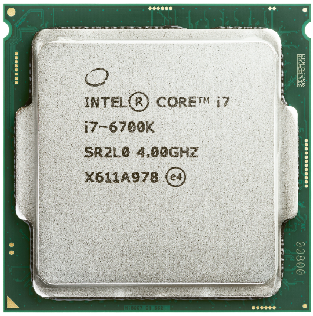

# 02 하드웨어와 소프트웨어

## 1. 하드웨어

[참고] 프로그래머가 알아야 할 핵심 하드웨어는 2가지(CPU, RAM) 정도가 있다. 

### 1) 하드웨어 구성 요소

> * 전원 공급 장치
> * 메인보드
> * 제어 연산 장치
> * 입출력장치
> * 기억장치

### 2) 하드웨어 종류

#### CPU ★★★

**Central Processing Unit - 중앙처리장치** 

* **역할 및 기능**
  중앙처리장치로 숫자를 연산하는 역할에 집중되어 있다.

#### RAM ★★★

**Random-Access Memory** 

* **역할 및 기능**
  * 프로그램이 실행될 때 머무르는 장소이다.
* **휘발성**
  * 전원이 꺼지면 저장되어 있는 자료들이 사라진다.

* **Random-Access라고 하는 이유**
  * 컴퓨터에서 임시로 데이터를 저장하고 데이터에 바로 액세스할 수 있기 때문입니다. 

* <u>`1차 메모리`</u>라 불리기도한다.

#### **HDD/SSD**

**Hard Disk Drive / Solid-State Drive**

* **비휘발성**
  전원이 꺼져도 장기간 저장된 자료가 사라지지 않고 유지된다.
* **성능 지표**

  * **RPM** - Revolutions per minute 또는 Rotate per minute
  * 회전이 빠를수록 속도가 빠르다.

* **필요성**
  빅데이터를 다뤄야 할 때는 CPU 뿐만 아니라 보조기억장치 까지 고려해야 할 수 있다. 
  ( 페이스북은 더 가서 HDD 사용대신 RAM만 사용하기도 한다. )

* <u>`2차 메모리`</u>로 불리기도 한다.

[참고] SSD : USB 같은 플래시 메모리가 발전한 형태이다.

#### VGA

**Video Graphic Array, Graphics Card - 그래픽카드**

* **GPU ( Graphics Processing Unit )**

  * 그래픽스 용도의 CPU ( 쿨러도 들어 있다. )
  * 컴퓨터 그래픽을 처리하는 장치로, 그래픽 카드를 구성하는 가장 중요한 핵심 요소이다.
  * 행렬 계산 같은 특정 연산에 효율성을 발휘한다.

* **Memory**

  * 자체 메모리도 존재한다.

  

#### M/B

**MainBoard, MotherBoard - 메인보드**

* **ROM ( Read-only memory ) / BIOS ★** 
  * 전원이 꺼도 데이터 저장 가능
  * 부트 프로그램
  * 하드웨어 검사
* **칩셋 ★**
  * 다른 부품들 사이의 중간다리 역할을 하며, 부품들이 서로를 **인식**하게 만든다. 
  * 칩셋은 연결된 여러 저장 장치 및 확장 장치와 CPU간의 **버스** 소통을 **중계**한다.
    * ( Z390과 같은 고급 칩셋은 오버클러킹 지원, 향상된 버스 속도 등 여러 장점이 있습니다 )
* 규격 및 포트
  * (1) 부품 규격 - 장착할 하드웨어 부품들의 규격은 서로 다르며 그걸 고려하여 메인모드를 구매해야 한다.
  * (2) 부품 포트 - 외부 입출력 단자 ( interface ) 들이다.

#### **Monitor**

**모니터**

* 픽셀 값의 계산을 출력하는 장치 ( 계산은 CPU나 GPU에서 실행 )
* [참고] 모니터도 계산된 복잡한 값을 이해하는 CPU의 역할을 하는 어떠한 코어가 있다.

---

**[ 교양 - 참고1 ]** 

**A: / B: 드라이브**

과거에는 FDD(Floppy Disk Drive)를 사용하던 때가 있었고,  그 당시 드라이브 A와 B를 저장하는 기억장치였다.

**[ 교양 - 참고2 ]** 

**자기테이프 (magnetic storage)**

장점 - 데이터 용량 대비 비용이 매우 저렴하다. / 장기 저장 안정성도 높다. ( 수명도 길다. )

단점 - 임의 접근 속도가 매우 떨어지기 때문에 특정 자료를 찾기 어렵다.

실제 사용 - 데이터 백업용이나 장기간 보존용으로 사용된다.

(참고자료) 윈터솔져 졸라 박사 알고리즘의 등장 - https://www.youtube.com/watch?v=E486XjhYHh8

---

## 2. 소프트웨어

### 1) 프로그램이란?

* **프로그램**
  앞으로 할 일을 적어둔 것 ( 계획, 수행절차, 순서 )

  * pro ( before ) + graphein ( **write** )
  * 프로그래밍 ( Programming ) - 행위를 뜻하는 동명사 ing 

* **컴퓨터 프로그램**
  명확한 언어로 명령과 순서를 적어둔 것들 이다. 

  * [목적] **자동화 ★**

  * 여기서 언어는 프로그래밍 언어를 말한다.

    

### 2) 아날로그와 디지털 데이터

자연 상태의 것들은 연속적인 아날로그 형태로 되어 있다. 

이를 컴퓨터에 저장하기 위해서는 비연속적인 구조로 경계를 두어 잘게 쪼개게 된다. 
이는 컴퓨터가 가지는 특유의 전기적 특성(전압)을 이용한 저장 방식 때문이다.
( 전압으로 1, 0으로 분류한다. )

가령 작곡을 위해 소리를 저장 한다고 한다면 ms 단위 마다 경계를 두어 측정하고, 저장하게 된다. 
여기서 정밀한 값을 저장할 수록 더 많은 연산과 데이터가 증가하게 된다.

( 디지털의 한계로 어쩔 수 없이 왜곡되는 부분이 생길 수 밖에 없다. )

* **아날로그 : 연속적**

* **데이터 : 비연속적 ( 각진 세상 )**

## 참고

| 유튜버             | 제목                                                         | 주소                                                         |
| ------------------ | ------------------------------------------------------------ | ------------------------------------------------------------ |
| 오제이튜브         | 💻 컴퓨터의 실체                                              | https://www.youtube.com/playlist?list=PLz--ENLG_8TNmXT0BY43eSLlFCcQDDqyA |
| 홍정모             | C언어[따배씨] 초반 부분                                      | https://www.youtube.com/playlist?list=PLNfg4W25Tapyl6ahul_8VS_8Tx3_egcTI |
| 종합               | CS개론(입문 - 개론/메모리/보수/문자)                         | https://www.youtube.com/playlist?list=PLetkvXWioaD3eBJZrgBayT-SfUdV9SroK |
| 뉴렉처             | 프로그래밍 학습 가이드 목록                                  | https://www.youtube.com/playlist?list=PLq8wAnVUcTFVWq7BUX9kz1mdoeQKEcL9Q |
| 뉴렉처             | 컴퓨터 프로그래밍을 하기 위한 사전지식                       | https://www.youtube.com/playlist?list=PLq8wAnVUcTFXna0fCAsElIj2qayRqvGjk |
| Tucker Programming | 컴맹을 위한 Go 언어 기초 프로그래밍 기초 강좌 ( 1~6강 까지 ) | https://www.youtube.com/playlist?list=PLy-g2fnSzUTAaDcLW7hpq0e8Jlt7Zfgd6 |
| 널널한 개발자      | 넓고 얕게 외워서 컴공 전공자 되기                            | https://www.inflearn.com/course/%EB%84%93%EA%B3%A0%EC%96%95%EA%B2%8C-%EC%BB%B4%EA%B3%B5-%EC%A0%84%EA%B3%B5%EC%9E%90/dashboard |
