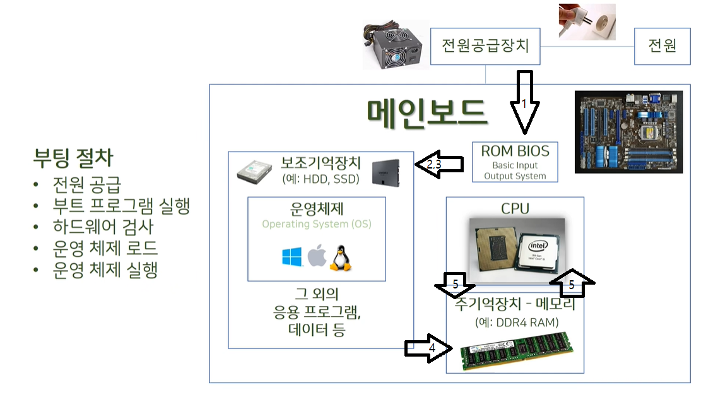

# 03. 컴퓨터 부팅 과정

* Bootstrap ( Booting )

1. **전원 공급**

   * CPU 레지스터인 프로그램 카운터 레지스터가 초기화된다.
     ( ROM BIOS의 부트 프로그램의 주소값으로 시작 번지 지정한다. )
   * [참고] 부트 프로그램은 ROM 시작 번지(0번지)에 설치되어 있다.

2. **ROM BIOS Boot Program**

   * Basic Input Output System
     * 메인보드의 ROM ( Read Only Memory )에 저장되어 있는 초기 프로그램이다. 
   * 우선 CPU의 이상 유무를 테스트 후, POST 작업을 수행한다.

3. **하드웨어 검사 ( POST )**

   * Power on self test

   * 하드웨어가 정상 동작할 수 있는 상태로 세팅인지 확인한다. 

4. **운영체제 로드 **

   * POST에 이상이 없으면 BIOS는 OS를 로드 하기 위해 Boot Program은 부팅 정보를 메모리로 읽어 온다.

   * operating system : OS
     * 사용자의 하드웨어, 시스템 리소스를 제어하고 프로그램에 대한 일반적 서비스를 지원하는 시스템 소프트웨어이다. 시스템 하드웨어를 관리할 뿐 아니라 응용 소프트웨어를 실행하는데도 기여한다.

     * 보조기억장치 **=>** 주기억장치

6. **운영체제 실행 **
   * 주기억장치 **<=>** CPU

7. **바탕화면 프로그램 실행**

---

* 따배씨 교수님이 참고한 자료들 입니다.

1. 프로그래밍 관점에서 바라보는 컴퓨터 구조 / 정기철 / 연두에디션
2. 운영체제의 이해 / 김용석 / 홍릉과학출판사

---

## 참고

* [[따배씨\] 0.2 컴퓨터를 켤 때 일어나는 일들 | 따라하며 배우는 C언어, c언어 , 컴퓨터 작동원리, 코딩](https://www.youtube.com/watch?v=nibismaE3fk)

* [컴퓨터 동작원리(1) 부팅과정](https://www.youtube.com/watch?v=hKkF3QrQIUw)

