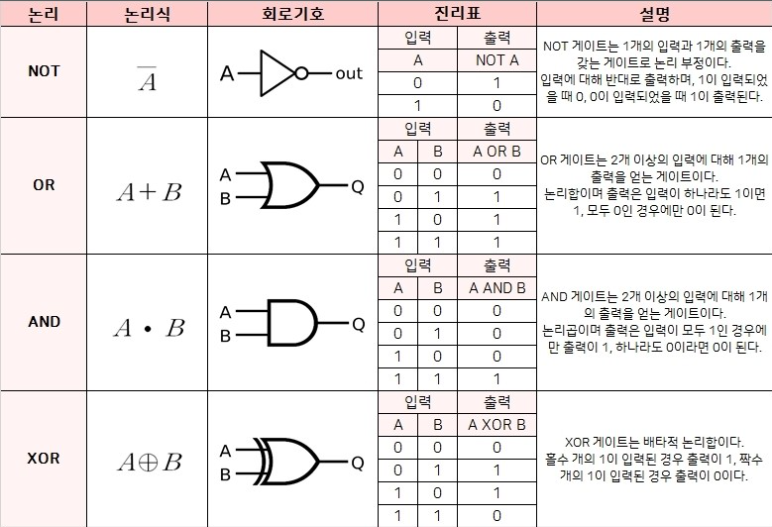

# 10. 논리회로

## 1. **논리소자 / 논리게이트**

**논리소자 ( 0 / 1 )**
base에 전압이 걸리느냐 아느냐에 따라 1 0 결정

**논리게이트 - AND, OR, XOR, NOT**

이것을 토대로 덧셈, 뺄샘 등을 실행하게 된다.

* AND - 논리의 곱 

  * 두 개의 도체가 필요하다.

* OR - 논리의 합

* NOT - 논리의 부정

  - 전류의 성질을 이용하고 Ground로 빠짐
  - 인버터

  * 0 1
    1 0

* XOR - 배타적

  * 올림수를 사용하기 위해 사용된다.
  * 000
    101
    011
    110
  

## 2. **반가산기 / 전가산기**

**( ※ 개인적으로 이해가 잘 안되는 부분으로 다시 공부할 필요가 있다. )**

**반가산기**

컴퓨터가 덧셈 하는 방법

**전가산기** 

컴퓨터가 덧셈 하는 방법
( 올림수 까지 덧셈 계산에 들어간다. )

* A, B, Cin(올림수) - 총 3가지의 수로 덧셈이 이루어 지는 것이다.

  

